# Chapter 1 Basic Heat Transfer

# 第 1 章 基础传热

## 来源追溯

| 项目 | 内容 |
|---|---|
| 原书 | Engineering Data II |
| 章节 | Chapter 1 |
| PDF 页码 | 8-58 |
| 书内页码 | 6-56 |
| 进度记录 | [progress.md](./progress.md) |

## 1.1 Basic Mechanisms of Heat Transfer

## 1.1 传热的基本机制

[传热](../../../glossary/terms.md#term-heat-transfer)的基本机制通常认为包括[导热](../../../glossary/terms.md#term-conduction)、[对流换热](../../../glossary/terms.md#term-convection)、[沸腾](../../../glossary/terms.md#term-boiling)、[冷凝](../../../glossary/terms.md#term-condensation)和[热辐射](../../../glossary/terms.md#term-radiation)。在这些机制中，辐射通常只有在温度高于管式过程换热设备中通常遇到的温度时才显著；因此，本手册不会对辐射作很详细的讨论。其余几种机制在设备设计中都起着重要作用，并且会在后续讨论中频繁出现。本节重点是对这些过程作定性描述，并介绍少量最基本的方程。

### 1.1.1 Conduction

### 1.1.1 导热

#### Mechanism

#### 机理

金属固体中的导热主要来自电子在金属内部的随机运动。固体高温部分的电子比低温部分的电子具有更高的动能，并会把部分动能传递给较冷的原子，于是热量便从高温表面传向低温表面。由于自由电子同样负责金属中的电流传导，所以金属导热能力和导电能力之间存在一种定性的相似性。此外，原子间振动也会传递一部分热量。

#### Fourier Equation

#### 傅里叶方程

导热的细节相当复杂，但从工程用途看，通常可以用一个简单方程处理，这个方程通常称为[傅里叶方程](../../../glossary/terms.md#term-fouriers-equation)。对于穿过平壁的稳态热流，如图 1.1 所示，两个表面温度分别为 T1 和 T2，且 T1 大于 T2。单位表面积 A 上的热流率 Q，也就是[热流密度](../../../glossary/terms.md#term-heat-flux)，可写为：

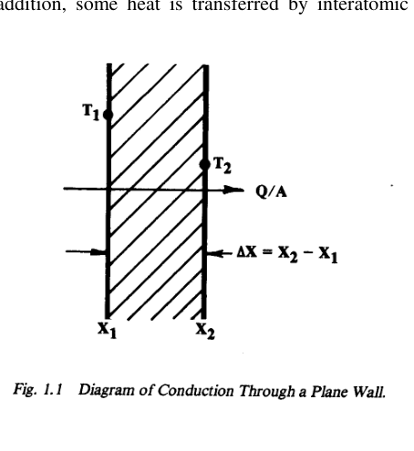

*图 1.1：穿过平壁的导热示意图。*

原式截图：[eq-1-1-original.png](./assets/eq-1-1-original.png)

$$
\frac{Q}{A}=q=k\left(\frac{T_1-T_2}{X_1-X_2}\right)=k\frac{\Delta T}{\Delta X}
\tag{1.1}
$$

其中，k 称为[导热系数](../../../glossary/terms.md#term-thermal-conductivity)，是材料的实验测定值。如果把温度梯度项写成微分形式，式 (1.1) 可以写成更一般的形式：

原式截图：[eq-1-2-original.png](./assets/eq-1-2-original.png)

$$
\frac{Q}{A}=-k\frac{dT}{dx}
\tag{1.2}
$$

式中的负号用于表达热量从高温处传向低温处这一事实；在这种方向约定下，dT/dx 本身为负，因此双重负号表示沿温度降低方向的热流为正。

#### Conduction Through a Tube Wall

#### 穿过管壁的导热

式 (1.2) 的主要优点在于，当传热截面积沿导热路径发生变化时，它可以进行积分。图 1.2 给出了管壁的一段。Q 表示单位时间内穿过管壁传导的总热量。在管壁中的径向位置 r 处，若管长为 L，则传热面积为 A = 2πrL。代入式 (1.2) 得到：

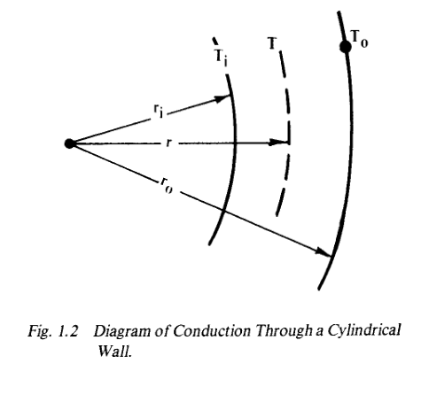

*图 1.2：穿过圆筒壁的导热示意图。*

原式截图：[eq-1-3-original.png](./assets/eq-1-3-original.png)

$$
\frac{Q}{2\pi rL}=-k\frac{dT}{dx}
\tag{1.3}
$$

积分后得到：

原式截图：[eq-1-4-original.png](./assets/eq-1-4-original.png)

$$
Q=\frac{2\pi kL(T_i-T_o)}{\ln(r_o/r_i)}
\tag{1.4}
$$

如果 Ti < To，则 Q 会得到负值；这只表示热流方向向内，与我们选取的正方向相反。对于薄壁管，外半径与内半径之比接近于 1，因此可以采用更简单的方程，且误差很小：

原式截图：[eq-1-5-original.png](./assets/eq-1-5-original.png)

$$
Q=\frac{2\pi r_o Lk(T_i-T_o)}{r_o-r_i}
\tag{1.5}
$$

> 译者注：原书式 (1.3) 仍写作 `dT/dx`，但本段语境是径向导热；理解和积分时应按径向坐标处理。

#### Conduction Through a Bimetallic Wall

#### 穿过双金属壁的导热

有时，出于耐腐蚀、强度或经济性方面的原因，管子实际上由两个紧密配合的同心圆筒构成，并且两个圆筒采用不同金属，如图 1.3 所示。

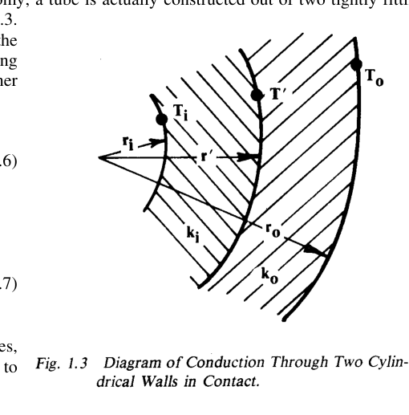

*图 1.3：两个接触圆筒壁中的导热示意图。*

注意，r′ 是内管的外半径，也是外管的内半径；T′ 是该位置对应的温度。由式 (1.4) 可以直接写出内管的导热关系：

原式截图：[eq-1-6-original.png](./assets/eq-1-6-original.png)

$$
Q=\frac{2\pi Lk_i(T_i-T')}{\ln(r'/r_i)}
\tag{1.6}
$$

对于外管：

原式截图：[eq-1-7-original.png](./assets/eq-1-7-original.png)

$$
Q=\frac{2\pi Lk_o(T'-T_o)}{\ln(r_o/r')}
\tag{1.7}
$$

由于流过两层管壁的热量必须相同，两个方程中的 Q 相等。因此可以合并方程，消去未知温度 T′，得到：

原式截图：[eq-1-8-original.png](./assets/eq-1-8-original.png)

$$
Q=
\frac{T_i-T_o}
{\frac{\ln(r'/r_i)}{2\pi Lk_i}+\frac{\ln(r_o/r')}{2\pi Lk_o}}
\tag{1.8}
$$

#### Contact Resistance

#### 接触热阻

前一小节假设内圆筒外表面与外圆筒内表面处于相同温度，这意味着两者之间不存在传热阻力。如果两个表面以冶金方式结合，例如一种材料熔合到另一种材料上，或者通过爆轰波结合，那么这个假设基本正确。然而，如果两个表面只是紧密的物理接触，即使采用热套配合所能施加的很高压力，这个假设也可能产生严重误差。

实际金属表面通常具有 10 到 180 微英寸范围内的粗糙度，粗糙度的大小和形态取决于金属本身以及表面的成形方法。当两个这样的表面接触时，接触的是表面上的“峰”，而“谷”中充满周围气体，通常为空气。由于气体的导热系数很低，几乎所有热量都通过金属与金属真正接触的点传导。在低压力下，真实接触面积只占表面积的一小部分，甚至可能不到百分之一；由此导致的热流线收缩，可能使界面热阻比金属板本身的热阻还大数倍。

当两个表面之间的接触压力较高时，为了承受载荷，表面峰顶会被压平，使真实接触面积增大，界面热阻随之降低。为保证良好热接触，工程上会采用多种方法，包括共挤和热套配合；但过程设备正常运行中的反复热循环，加上蠕变，可能导致长期而严重的效率损失。

遗憾的是，在过程设备应用中，几乎不可能预测[接触热阻](../../../glossary/terms.md#term-contact-resistance)。正如所有过程设备设计一样，工程师必须评估判断错误的后果以及可能的替代方案。

### 1.1.2 Single Phase Convection

### 1.1.2 单相对流

#### Fluid Motion Near a Surface

#### 表面附近的流体运动

对流换热与表面附近的流体流动机理紧密相关，因此首先需要描述这种流动。

[单相流](../../../glossary/terms.md#term-single-phase-flow)必须同时用流体所经过的通道几何形状以及流体通过通道时的[流动状态](../../../glossary/terms.md#term-flow-regime)来表征。通道几何基本上有两类：一类是恒定截面，即沿通道任意位置，流体可用流通面积的形状和面积都相同；另一类是变截面，即通道的形状和/或面积沿长度方向变化，通常以规则、重复的方式变化。

在过程传热应用中，最常见的恒定截面通道几何是圆管。在圆柱几何中，通常假设所有流动参数只与到圆柱轴线的径向距离，或者等价地与到壁面的距离，以及与入口的距离有关，后者对应入口效应。

对于变截面通道中的流动，本书关心的典型情况是流体横掠管束。此时会出现另一个现象，它对压降计算极其重要，并且会不利地影响压降转化为换热的效率。在恒定截面通道中，主要需要考虑的是流体相对表面运动造成的摩擦压降，即表面摩擦；而在管束中，[形状阻力](../../../glossary/terms.md#term-form-drag)是压降的主要贡献者。形状阻力产生的原因是，管子前表面的压力大于后表面的压力。这个压差表现为穿过管束总压降的一部分；与表面摩擦不同，形状阻力在促进换热方面效率并不高。形状阻力还会引起边界层分离和尾流形成，这可能造成管束中管子的破坏性振动。

通道中的流动类型也可以用流动状态来表征，也就是[层流](../../../glossary/terms.md#term-laminar-flow)、[湍流](../../../glossary/terms.md#term-turbulent-flow)，或具有两种极限状态特征的过渡状态。层流的严格定义都相当复杂，像图 1.4 这样的图示更有帮助。

如果在一根圆管中有液体以稳定速率流动，并且我们用一根与管轴平行的针注入一条染色示踪线，可能出现两种情况：

1. 染色线平滑地沿管子流动，保持为清晰的线条，只是非常缓慢地变粗。
2. 染色线不规则地沿管子流动，在管径方向来回摆动，最终完全弥散。

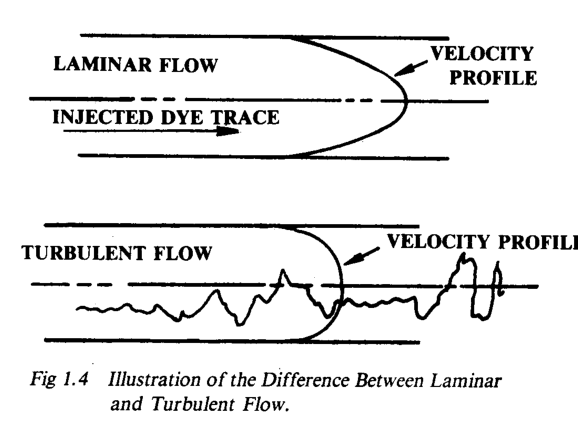

*图 1.4：层流与湍流差异示意图。*

第一种情况是层流，第二种情况是湍流。层流对应于流体层之间平滑滑移而不发生混合；湍流则以流体团或流体微团通过湍涡在径向上从流场一处快速交换到另一处为特征。

速度分布也存在差异。在层流中，给定点处的速度是稳定的；而在湍流中，速度围绕平均值快速波动。如果在管截面的不同位置测量局部速度，会发现层流给出抛物线形速度分布，而湍流给出更钝平的速度剖面，如图 1.4 所示。在两种流动中，壁面处流体速度均为零，中心线处速度最大。

给定情况下存在的流动状态通常用[雷诺数](../../../glossary/terms.md#term-reynolds-number)表征。不同几何中的流动有不同的雷诺数定义；对于管内流动，雷诺数按式 (1.9) 定义：

原式截图：[eq-1-9-original.png](./assets/eq-1-9-original.png)

$$
\mathrm{Re}=\frac{d_i\rho V}{\mu}=\frac{d_iG}{\mu}
\tag{1.9}
$$

其中，di 是管内径，V 是管内平均速度，ρ 是流体密度，μ 是流体黏度。低雷诺数对应层流，高雷诺数对应湍流。

对于管内流动，雷诺数低于约 2000 时，稳定流动状态为层流。雷诺数高于约 2100 时，在压降计算中可按湍流处理；而对于换热计算，通常要到雷诺数高于 10000 时才按湍流处理。对于换热问题，2100 到 10000 之间通常称为过渡流区。其他几何具有不同的雷诺数范围来表征流动状态。

#### Heat Transfer to a Flowing Fluid (Convection)

#### 对流动流体的传热（对流）

对流换热可以定义为：在流动流体中，由于流体宏观运动而把热量从一处输送到另一处，热量以流体内能的形式被携带。对流过程已经受到大量实验和解析研究。虽然本书主要关心如何使用这些研究结果，但仍有必要粗略考察对流的物理过程，以便定义术语，并建立一些直觉，理解我们使用的关联式究竟试图表示什么。

在层流流体流过冷壁面时，热量从紧邻壁面的流体传给管壁。在流体内部，热量通过导热从一“层”流体传到另一“层”流体。没有垂直于主流方向的流体运动来通过其他机制输运热量。不过，由于不同“层”的流体速度不同，这里的导热过程比前面讨论的固体壁导热更难分析。

如果观察湍流流体流过冷表面的情况，并标记若干代表性流体微团来追踪它们的路径，就会得到类似图 1.5 的图像。

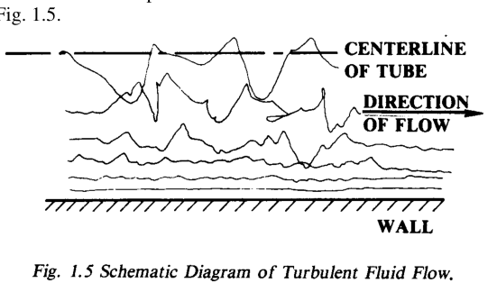

*图 1.5：湍流流体流动示意图。*

对应的时间平均速度剖面和温度剖面可分别类似图 1.6 和图 1.7。

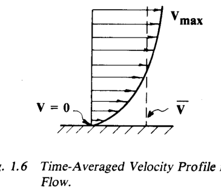

*图 1.6：湍流中的时间平均速度剖面。*

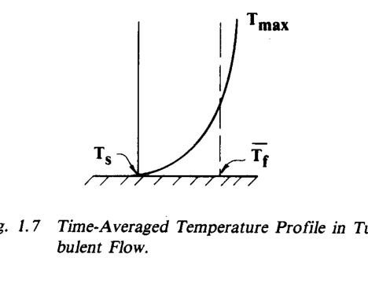

*图 1.7：湍流中的时间平均温度剖面。*

靠近壁面的流动只有少量小涡，因此主要传热机制是导热。在壁面处，流体速度为零，流体温度等于壁面温度。靠近壁面处的速度梯度和温度梯度远比主体流中陡峭，因为主体流中涡团输运逐渐占主导。需要注意，当我们没有进一步限定而谈到流股的速度或温度时，指的是图中所示的体积平均或混合杯平均值 V 和 Tf。下文将省略平均符号。不过必须记住，流体中某些部分的温度可能明显高于或低于平均值，在这些位置可能发生热降解或相变。对于图中情况，如果流体凝固温度位于 Ts 和 Tf 之间，则壁面会形成固体层，导致传热和流体流动机制发生重大变化。

#### Film Heat Transfer Coefficients

#### 膜传热系数

对于许多对流换热过程，局部热流密度近似与壁面和流体主体之间的温差成正比，即：

原式截图：[eq-1-10-original.png](./assets/eq-1-10-original.png)

$$
\frac{Q}{A}\propto (T_f-T_s)
\tag{1.10}
$$

于是我们定义一个比例常数，称为[膜传热系数](../../../glossary/terms.md#term-film-coefficient-of-heat-transfer)，通常记为 h：

原式截图：[eq-1-11-original.png](./assets/eq-1-11-original.png)

$$
\frac{Q}{A}=h(T_f-T_s)
\tag{1.11}
$$

h 的数值取决于系统几何形状、流体物性以及流体流速。

传热系数这一概念只有在这些变量与传热系数之间存在定量关系时，对设计者才有用。同样重要的是，这种关系在具体应用所处条件下应当具有合理有效性。这些关系或关联式可能来自理论研究、实验研究，或二者结合。关联式可以表示为方程、图、数值表，或计算程序。根据使用者的需要和便利程度，这些形式之间或多或少可以互相转换。在使用关联式时，设计者至少需要大致知道该关联式在其应用中的结果可能具有怎样的精度。

有时，我们也会在热流密度甚至并不近似正比于温差的情况下使用膜传热系数，例如核态沸腾。严格说，这与式 (1.10) 的含义相矛盾；但这种做法提供了一个有用的比较基础，可以比较给定问题中若干传热过程的相对热阻。不过，这种情况下的膜传热系数不具有基本物理意义。

### 1.1.3 Two Phase (Liquid-Gas/Vapor) Flow

### 1.1.3 两相（液-气/汽）流

#### Regimes of Two-Phase Flow

#### 两相流的流型

在当前语境中，[两相流](../../../glossary/terms.md#term-two-phase-flow)通常指液体和气体或蒸汽在通道中同时流动。当蒸汽正在冷凝或液体正在汽化时，会出现这种流动；较少见的情况是，气-液混合物，例如空气和水，一起流动并被加热或冷却，但没有显著相变。

给定情况下，通道中实际存在的两相流构型或流型取决于两相流量的相对大小和绝对大小、流体物性、通道几何构型，以及所涉及的传热过程类型。先考虑 Alves 在水平管空气-水流动研究中观察到的流型。这些流型以较理想化的形式示于图 1.8。非传热情况下研究得到的流型与冷凝过程中存在的流型之间，主要差异在于冷凝时通道整个表面上存在液膜。不过可以认为，薄薄的、排液中的冷凝液膜不会使蒸汽与主体液体之间的相互作用发生本质差异。

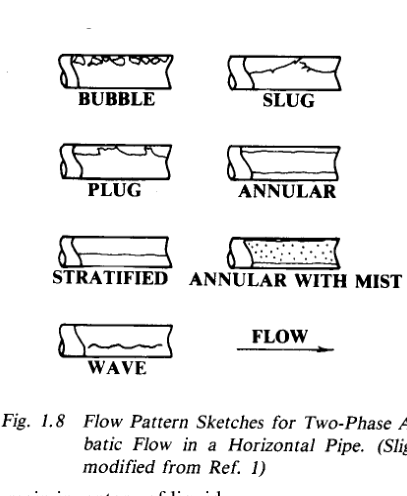

*图 1.8：水平管中绝热两相流流型示意图。*

对于沸腾流动，至少还需要另外两个流型。在其中一种流型中，气泡在壁面上形成，并扰乱壁面附近的流动形态。要发生这种情况，壁面必须高于沸点，但这并不保证一定会形成气泡；如果主体流体温度处于饱和状态，气泡会被带向下游，很像图 1.8 中的泡状流；如果主体流为过冷状态，气泡会很快坍缩。在后一种情况下，对压降的影响相对较小。第二种新流型是雾状流，在这种流型中，雾环状流壁面上的液膜已被蒸发，剩余液体以小液滴形式被蒸汽夹带。

可以把流型看作两种力相互作用的结果，即不同方向上的重力和蒸汽剪切力。在低蒸汽流量下，重力占主导，并且根据液体存量的相对多少，可得到分层流、塞状流、弹状流或泡状流。在高蒸汽速度下，蒸汽剪切占主导，产生波状流、环状流或环雾状流。人们希望能以某种方式预测流型，并且已经尝试以一般而一致的方式进行预测。虽然没有一种方法完全成功，但 Baker 的工作通常被认为是公开文献中最好的可用方法，尽管它是一种无量纲表示，并且难以用基本原理解释。修正形式的 Baker 图见图 1.9，它有助于大致判断给定条件下存在的流型类型。

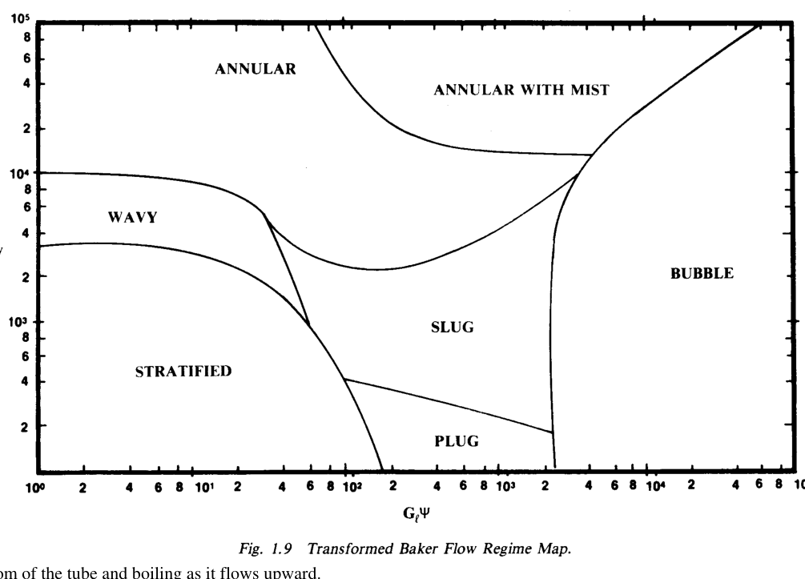

*图 1.9：修正 Baker 流型图。*

对于竖直管内两相流，分层流和波状流不能存在；通常认为此时的流型包括泡状流、弹状流、环状流和夹雾环状流。Fair 图（图 1.10）通常被认为最适用于这一构型，此处以略加修改的形式转载。它最初是为分析热虹吸再沸器而发展出来的，基本情形是液体流从管底进入，并在向上流动过程中沸腾。

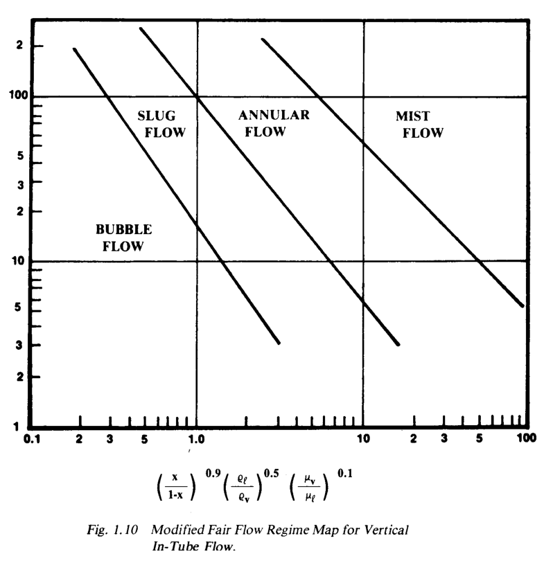

*图 1.10：竖直管内流动的修正 Fair 流型图。*

对于竖直管内冷凝，蒸汽通常从顶部进入，冷凝形成的两相混合物向下流动。在冷凝速率较高、蒸汽剪切占主导时，大部分流动处于环状流型。图 1.10 可用于估计这一假设何时失效。

我们对横掠管束的两相流型了解有限，无论有无折流板，知识几乎还停留在直觉层面。幸运的是，一些压降和相关流体动力效应的关联式在很大程度上并不依赖对流型的认识，因此仍然可以进行某些定量计算。

#### Heat Transfer to a Two-Phase Flow

#### 对两相流的传热

对两相流传热或从两相流传热的分析相当复杂，涉及两相的物性、相数量以及流体力学。由这些分析得到的设计关联式，其误差也通常大于单相传热关联式。

对于没有因传热而发生相变的气-液流动，流动通常为湍流。热量通过各相内部的湍涡，以及通过类似管内湍流的气-液界面和流体-固体界面处的湍流边界层现象进行传递。由于气相剪切在液体中产生强烈湍动，传热速率和压降都相对较高。

当还涉及相变时，例如汽化或冷凝，会有额外的传热机制参与。这些机制将在后续各小节中更详细讨论。

#### Phase Relationships in Two-Phase (Liquid Gas/Vapor) Flow

#### 两相（液-气/汽）流中的相平衡关系

两相流还必须根据组成以及由此产生的两相热力学关系来表征。可以区分四种情况：

a. 液体和气体为不同的纯组分。典型例子是空气-水混合物。这并不是常见的工业问题，但非常重要，因为关于两相流的大量知识都是在这一系统上获得的。一般来说，这些信息可以迁移到冷凝和部分沸腾工作中，但必须认识并考虑其中的重要差异。从热力学上看，该系统中的压力和温度可以在很宽范围内独立变化。

b. 液体和气体（蒸汽）为同一种纯组分。这是冷凝器设计中的常见情况，例如分离和/或提纯某种产品的塔顶冷凝器。此时压力和温度之间的关系就是该组分的蒸汽压曲线。

c. 液体和气体（蒸汽）均为多组分。热力学关系更复杂；例如在给定压力下，温度可以在一定范围内变化，同时总液体与总蒸汽的比例发生变化，并且各相组成也发生变化。只有少数情况下，相量和相组成的预测相对明确且容易完成，例如轻烃混合物；其他情况需要实验室热力学数据。

d. 这一情况与 b 或 c 相同，但存在不凝性气体，例如蒸汽中含空气，或惰性汽提气中含溶剂。这一情况在热力学上与 c 相似，但不凝性气体不会出现在液相中。

#### Other Two-Phase Systems

#### 其他两相系统

工业过程中还会出现其他两相系统，下面作简要说明。一般来说，与液-气/汽系统相比，人们对这些系统的了解较少，相应关联式也更少、更不准确。

1. **固-气系统。** 固-气混合物最重要的应用是在流化床中。气体从床底部引入并向上流动。如果气体流量足够大，固体颗粒通常为细小颗粒，例如催化剂颗粒或砂粒，会使床层膨胀。此时颗粒不再直接互相接触，而是在床内循环；气泡状气体会穿过床层，并在上表面破裂，使外观看起来类似液体沸腾。可以把管子形式的传热表面放入床层中，热量也可以通过围成床层的壁面传递。与常规气体流动相比，流化床中的传热速率通常高得多。

   如果气体流量进一步增加，固体颗粒会随气体一起被带走。这种做法有时是有意采用的，例如用于“输送线流化催化反应器”。这种情况下的传热机理与管内气-液流相似，只是固相中的“涡团”由一团团离散颗粒组成，它们整体运动，而不是一个宏观连续相。

2. **固-液系统。** 液体流化床也是已知的；主要差别在于固体和液体密度相当接近，因此固体更容易被液体流化并随液体输运。其传热速率只比对应液体单独流动时略大。

3. **液-液系统。** 换热器中有时会遇到两种互不相溶液体的混合物，并且会观察到类似气-液流动的流型。对于这类系统，在相同平均速度下，传热系数通常介于两种单一液体各自单独流动时所得到的数值之间。

### 1.1.4 Condensation

### 1.1.4 冷凝

#### Modes of Condensation

#### 冷凝方式

冷凝是通过从蒸汽中移除冷凝潜热，使蒸汽转变为液体的过程。通常认为冷凝有四种基本方式或机制：滴状冷凝、膜状冷凝、直接接触冷凝和均相冷凝。

1. **滴状冷凝。** 在滴状冷凝中，液滴从蒸汽中在固体表面上特别有利的位置形成，这些位置称为成核点。它们可以是凹坑、划痕，也可以是任何表面不规则处，尺寸可能只有几千埃或几微米。随着蒸汽持续冷凝，液滴长大；相邻液滴接触时会聚并。滴状冷凝只发生在液体不强烈润湿的表面上，因此液滴不会在表面铺展。液滴在原位长大，直到足够大后在重力作用下流离表面，或被流动蒸汽吹离表面。

   尽管滴状冷凝因所报告的高传热系数而很有吸引力，但目前并不认为它适合在过程设备中有意采用。通常必须连续向蒸汽中注入污染物，或使用特殊表面材料，而这些材料常常导热系数较低。即便如此，该过程仍不稳定、不可预测，并且在高蒸汽速度和工业实践条件下效果可疑。

2. **膜状冷凝。** 在膜状冷凝中，初始形成的液滴很快聚并，在表面形成连续液膜，热量必须通过该液膜传递，才能使更多蒸汽冷凝。膜状冷凝中的实际传热机理与前文单相流动机理密切相关。膜状冷凝是实践中通常发生的方式，也是冷凝器设计计算中假定存在的方式。

3. **直接接触冷凝。** 在直接接触冷凝中，液体冷却剂被直接喷入蒸汽中，蒸汽直接冷凝在喷雾液滴表面。直接接触冷凝是非常高效的过程，但会导致冷凝液和冷却剂混合。因此，只有在容易分离冷凝液、没有回收冷凝液需求，或冷却剂与冷凝液是同一种物质时，它才有用。

4. **均相冷凝。** 在均相冷凝中，液相直接从过饱和蒸汽中形成，远离任何宏观表面。由于这要求蒸汽过冷到比饱和温度低约一百度，并且由于实际观察到的均相冷凝发生在小得多的过冷度下，所以通常假设实际中存在足够数量的尘粒或雾滴充当成核点。均相冷凝主要与设备中雾的形成有关，而不是一种设计工况。

#### Condensation Outside Tubes

#### 管外冷凝

一种常见的冷凝器设计是：蒸汽在一束管子的外部，冷却剂在管内流动。蒸汽以膜状方式在管外冷凝。随后液膜在重力作用下流到管子底部，并滴落到管束中更低位置的下一根管子上。如果冷凝液黏度很高，至少在前几排管子上，这种膜状流动可能处于层流状态（图 1.11a）。更常见的是，冷凝液黏度相对较低，例如水，液膜很快转变为湍流（图 1.11b）。两种情况会导致对蒸汽冷凝潜热穿过液膜传递速率的预测明显不同。

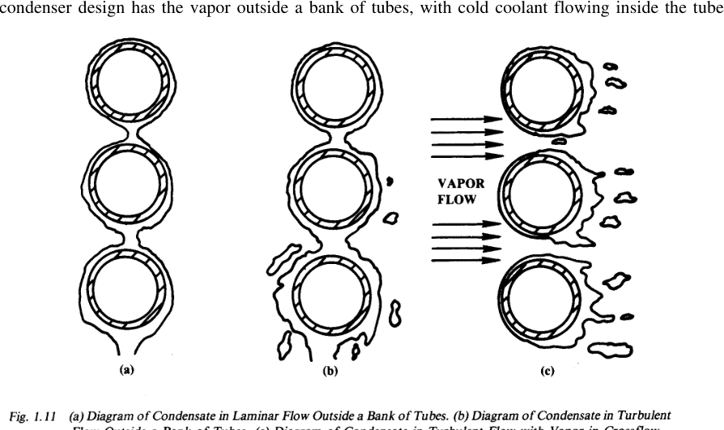

*图 1.11：(a) 管束外层流冷凝液示意图；(b) 管束外湍流冷凝液示意图；(c) 蒸汽横流作用下湍流冷凝液示意图。*

如果蒸汽流量很高，横流蒸汽对冷凝液膜的剪切作用会显著增强，把液体吹离壁面、以喷雾形式带向下游，并使液膜比单纯受重力影响时更早转变为湍流（图 1.11c）。

#### Condensation Inside Tubes

#### 管内冷凝

另一种常见冷凝器构型，特别是在空冷冷凝器中，是蒸汽在管内冷凝。管子通常为水平布置，或只是轻微向下倾斜以利排液；但也会采用竖直和倾斜管布置。如果蒸汽流量很低，冷凝液会在重力作用下形成于冷壁并排入管底液池；该液池又在重力作用下向管出口排出（图 1.12a）。这种现象发生在有利于分层流或波状流的条件下（见图 1.8 和图 1.9）。

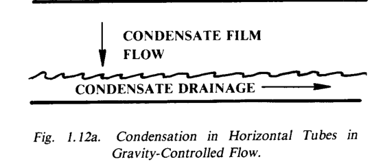

*图 1.12a：重力控制流动中的水平管内冷凝。*

如果蒸汽流量较高，液膜流动会由蒸汽剪切控制，如图 1.12b 所示。

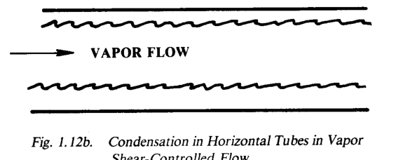

*图 1.12b：蒸汽剪切控制流动中的水平管内冷凝。*

#### Condensation of Mixtures

#### 混合物冷凝

基本纯组分的冷凝和混合物冷凝之间存在若干重要差异。Colburn 和 Drew 曾对二元混合物给出基本分析，图 1.13 以图示方式呈现。对于混合物，较重、挥发性较低的组分首先冷凝，只有当剩余蒸汽的温度降低后，较轻组分才会冷凝。因此，在液相和汽相中都必须考虑显热传递效应。由于冷却蒸汽所对应的低传热系数，这一过程会成为传热过程中的主要阻力，图中以温差 `(T_v - T_i)` 表示。

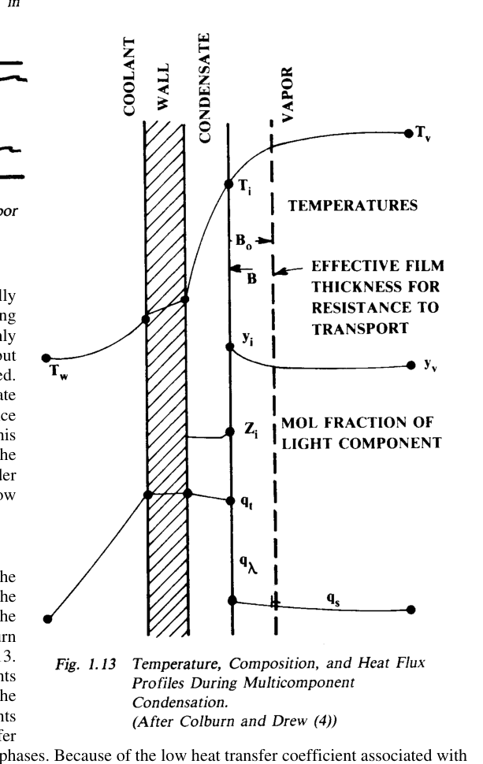

*图 1.13：多组分冷凝过程中的温度、组成和热流剖面。*

与主体蒸汽相比，较重组分在界面附近富集，如浓度差 `(y_i - y_v)` 所示，并反向扩散回主体蒸汽。由于液相和汽相的组成都在持续变化，在评价方程时还必须考虑物性变化问题。对于多组分混合物，问题会变得更加复杂，必须采用近似方法设计这些条件下的冷凝器。

### 1.1.5 Vaporization

### 1.1.5 汽化

#### Mechanisms of Pool Boiling

#### 池沸腾机理

通过加热使处于饱和温度的液体转变为蒸汽，可以通过若干机制或过程实现。如果沸腾或汽化发生在容器中被限制液体内的热表面上，这一过程称为“池沸腾”。池沸腾发生的具体机制随表面与液体之间温差变化，也在较小程度上随表面和液体性质变化。讨论这些机制最好结合液体热流密度与表面和液体饱和温度之间温差的曲线。图 1.14 转载了轻烃饱和池沸腾的典型热流密度与温差曲线。图中坐标为对数坐标，所示数值为轻烃的典型值。

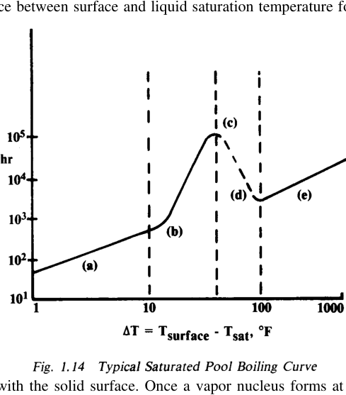

*图 1.14：典型饱和池沸腾曲线。*

图 1.14 中标出的各区域如下：

a. **自然对流区。** 该区域的特征是 ΔT 小于约 10°F。在这一区域中，与热表面接触的液体被过热，并通过自然对流上升到汽-液界面，在那里过热度通过液体的静态汽化释放出来。热表面上没有气泡形成，传热系数具有自然对流过程的特征。

b. **核态沸腾区。** 在该区域中，蒸汽气泡在热表面上优先的成核点形成，这些成核点通常是小凹坑或划痕。液体因与成核点直接接触而过热，气泡通过使周围液体去过热而迅速长大，直到浮力把气泡从表面拉脱并使其上升到汽-液界面。文献中已有若干适用于该区域的关联式。然而，由于核态沸腾现象强烈受表面和流体确切性质影响，设计该区域时最好使用实验信息。

c. **最大、峰值、临界或烧毁热流密度点。** 图中点 (c) 有多种称呼：最大热流密度、峰值热流密度、临界热流密度或烧毁热流密度。它表示在任何合理表面温度下可达到的最高热流密度。在这一点，蒸汽释放非常剧烈，流向表面的液体已不足以供应蒸汽。任何进一步升高表面温度的操作，都会导致部分生成蒸汽无法逸出，热流密度反而下降。峰值热流密度现象本质上是蒸汽流体动力极限，几乎与表面的具体性质无关。已有多种基于基本原理推导的峰值热流密度关联式。

d. **过渡沸腾区。** 过渡沸腾是中间状态，其特征是在表面偶尔形成蒸汽膜。蒸汽膜使表面与冷却液体隔离，导致局部热点和不稳定运行。在过渡沸腾区，蒸汽膜不稳定，经过短时间后液体会重新淹没表面并冷却它，使过程暂时回到核态沸腾。换热设备通常绝不会有意设计在过渡沸腾区运行。

e. **膜态沸腾区。** 膜态沸腾是在表面温度与饱和温度之间存在较大温差时稳定存在的沸腾区。在膜态沸腾中，表面与液池之间存在稳定、几乎静止的蒸汽膜。热量通过该蒸汽膜以导热方式传递到液池，从而产生更多蒸汽。蒸汽膜最终变得不稳定，并释放出大的蒸汽泡，这些蒸汽泡以相对较低频率穿过液池上升到界面。膜态沸腾的特征是温差大、热流密度通常很低，因而传热系数也相应较低。表面可能热到足以使被沸腾物质发生热降解。污垢问题在膜态沸腾区也会显著加剧，因为表面形成的污垢沉积物无法被液体重新溶解或冲刷掉。一般来说，在膜态沸腾区运行被认为是不希望的。

#### Vaporization During Flow

#### 流动中的汽化

上述沸腾过程发生在容器或液池中，因此称为池沸腾现象。某些类型的汽化设备，特别是热虹吸再沸器和泵送再沸器，具有液体净速度掠过传热表面。在这些条件下，紧邻热表面的液体层受到剪切应力作用，沸腾过程会被改变。一般来说，自然对流沸腾现象会被强制对流遮蔽，核态过程会受到某种程度抑制，甚至可能完全被抑制。若完全抑制，过热液体会被湍涡从管壁输送到汽-液界面，并在那里发生汽化形成蒸汽。在这些条件下，合成传热系数大于只有核态沸腾起作用时的传热系数。如果液体温度足够高，膜态沸腾也可能发生在强制对流汽化中。此时常见雾状流，液体存量以小液滴形式随蒸汽携带，小液滴与过热蒸汽接触而被加热并汽化。该过程的特征是传热系数很低，汽化设备绝不会有意设计在这种状态下运行。

存在一些关联式，可使设计者估算流动现象对沸腾过程的影响；如果发现这种影响显著，则可在强制对流条件下计算传热系数。

#### Vaporization of Mixtures

#### 混合物汽化

混合物给再沸器设计带来严重问题。图 1.15 和图 1.16 展示了这一问题。当宽沸程混合物进入再沸器时，首先生成的蒸汽富含低沸点组分，留下的液体则富集高沸点组分，尤其是在传热表面附近。随后，轻组分必须穿过这一屏障扩散到表面才能汽化。所需的驱动力大于剩余液体按混合平均组成所指示的驱动力。这一问题与前面讨论的宽冷凝范围混合物问题完全类似。

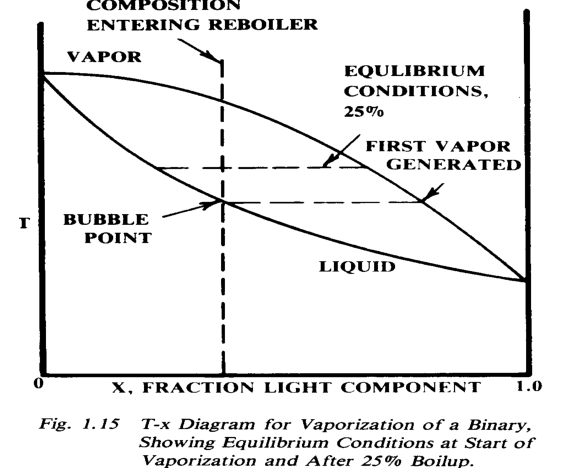

*图 1.15：二元混合物汽化的 T-x 图，显示汽化开始时和沸出 25% 后的平衡条件。*

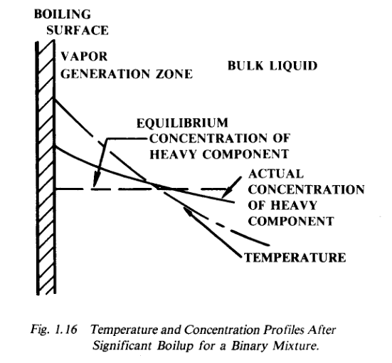

*图 1.16：二元混合物显著沸出后的温度和浓度剖面。*

如果测量热流密度随沸腾表面温度的变化，并将其与主体混合物的饱和温度比较，在纯组分之间的中间组成范围内，会出现传热系数看似下降的结果，如图 1.17 所示。然而，真实影响是温度驱动力发生畸变，而传热系数本身实际上是轻组分到纯重组分之间单调变化的函数。这并不会改变基本问题：如何计算“真实沸腾传热系数”与 ΔT 的乘积，也就是热流密度，并由此得到再沸器所需面积。

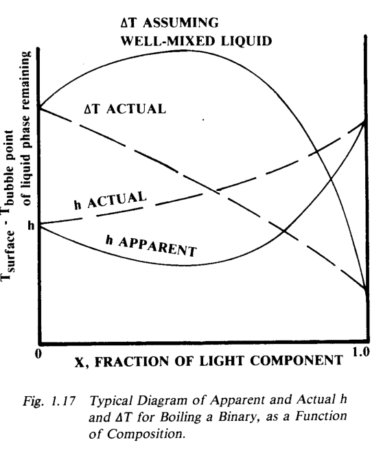

*图 1.17：二元混合物沸腾中，表观和实际 h 与 ΔT 随组成变化的典型图。*

### 1.1.6 Radiation

### 1.1.6 辐射

#### Source of Radiant Energy

#### 辐射能来源

所有物质都会以电磁波形式持续辐射能量。发射能量的多少强烈取决于物质的绝对温度，并在较小程度上取决于物质表面性质。辐射的基本定律由 Stefan 和 Boltzmann 推导，对于本书用途可写为：

原式截图：[eq-1-12-original.png](./assets/eq-1-12-original.png)

$$
\frac{Q}{A}=\sigma\varepsilon T_{\mathrm{abs}}^4
\tag{1.12}
$$

其中，σ 是 Stefan-Boltzmann 常数，数值为 0.1714 × 10-8 Btu/(hr·ft2·°R4)；Tabs 是以 °R 表示的绝对温度；ε 是[发射率](../../../glossary/terms.md#term-emissivity)，取值在 0 到 1 之间。对于理想反射体，ε = 0；对于理想发射体，即所谓“黑体”，ε = 1。高度抛光金属表面的发射率较低：抛光金属约为 0.02 到 0.05，氧化铝约为 0.15，钢材无论清洁或锈蚀约为 0.6 到 0.9，多数油漆约为 0.8 到 0.98，并且大体与颜色无关。

由于所有辐射热量的表面也都会吸收热量，因此凡是能够彼此“看见”的表面都在互相交换热量；净热流取决于绝对温度、发射率、面积以及表面的空间几何关系。完整的问题表述相当复杂，本书不再进一步展开。关于该主题，L. Siegel 和 J. R. Howell 的《Radiation Heat Transfer》是许多优秀教材之一。

#### Radiation in Process Heat Transfer Problems

#### 过程传热问题中的辐射

在通常大气温度下，与多数其他传热机制相比，辐射传热相对不重要；不过也有少数场合辐射会有显著贡献，例如未保温蒸汽管线的热损失。在较高温度下，辐射变得相对更重要；当温度高于大约 1000 到 1500°F 时，具体取决于其他过程，通常必须考虑辐射。

然而，对于常规换热器应用，这样高的温度很少出现。因此，本书不会进一步发展辐射换热的原理和方程。

## 1.2 Basic Heat Exchanger Equations

## 1.2 换热器基本方程

### 1.2.1 The Overall Heat Transfer Coefficient

### 1.2.1 总传热系数

考虑图 1.18 所示情形。热量从管内流体传出，管内流体在局部主体或平均温度 Ti 下，热量依次穿过一层污垢膜、管壁、另一层污垢膜，最后传给局部主体温度为 To 的管外流体。对于给定管长，Ai 和 Ao 分别表示内表面和外表面的传热面积。对普通光管圆筒而言：

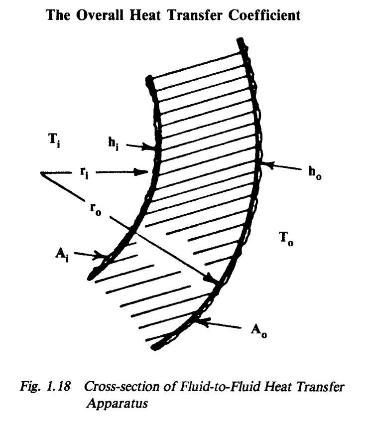

*图 1.18。*

原式截图：[eq-1-13-original.png](./assets/eq-1-13-original.png)

$$
\frac{A_o}{A_i}=\frac{2\pi r_oL}{2\pi r_iL}=\frac{r_o}{r_i}
\tag{1.13}
$$

管内流体与内侧污垢膜表面之间的传热率可用 Q/A = h(Tf - Ts) 这种形式表示，其中面积取 Ai；管外对流过程也类似，只是面积取 Ao。hi 和 ho 的数值必须由适当关联式计算。

在多数实际服役的换热器表面上，沉积物、水垢、有机生长物等[污垢](../../../glossary/terms.md#term-fouling)膜迟早会形成。少数流体，例如空气或液化天然气，通常足够洁净，污垢不存在，或小到可以忽略。穿过这些膜的传热主要靠导热，但设计者很少知道污垢层厚度或导热系数，无法真正把它当作导热问题处理。因此，设计者通常从标准值表或经验中估计一个[污垢热阻](../../../glossary/terms.md#term-fouling-resistance) Rf。Rf 按热流密度 Q/A 与污垢层两侧温差 ΔTf 定义：

原式截图：[eq-1-14-original.png](./assets/eq-1-14-original.png)

$$
R_f=\frac{\Delta T_f}{Q/A}
\tag{1.14}
$$

由式 (1.14) 可见，Rf 等价于污垢的传热系数 hf 的倒数：

原式截图：[eq-1-15-original.png](./assets/eq-1-15-original.png)

$$
h_f=\frac{Q/A}{\Delta T_f}=\frac{1}{R_f}
\tag{1.15}
$$

许多书会用“污垢传热系数”来计入污垢影响；但这个量本质上仍然是估算值。引入这一附加热阻的作用，是使换热器面积比清洁状态所需面积略大，从而在设备运行一段时间并积累一定污垢后，仍能完成所需工况。

沿单位管长穿过内侧流体膜、内侧污垢膜、管壁、外侧污垢膜和外侧流体膜的热流率必须相同。如果要求这些热阻上的温差之和等于总温差 (Ti - To)，则对图 1.18 所示情况可得：

原式截图：[eq-1-16-original.png](./assets/eq-1-16-original.png)

$$
Q=
\frac{T_i-T_o}
{\frac{1}{h_iA_i}+\frac{R_{fi}}{A_i}+\frac{\ln(r_o/r_i)}{2\pi Lk_w}+\frac{R_{fo}}{A_o}+\frac{1}{h_oA_o}}
\tag{1.16}
$$

写出式 (1.16) 时，假定污垢层厚度可忽略，因此 ri、ro、Ai 和 Ao 都取清洁管子的数值，并且不随污垢积累而改变。这不仅是方便的假设，也是因为我们对污垢并没有足够信息可作更复杂处理。

现在定义一个基于任意方便参考面积 A* 的[总传热系数](../../../glossary/terms.md#term-overall-heat-transfer-coefficient) U*：

原式截图：[eq-1-17-original.png](./assets/eq-1-17-original.png)

$$
Q\equiv U^*A^*(T_i-T_o)
\tag{1.17}
$$

比较上面两个方程可得：

原式截图：[eq-1-18-original.png](./assets/eq-1-18-original.png)

$$
\frac{1}{U^*}
=
\frac{A^*}{h_iA_i}
+\frac{A^*R_{fi}}{A_i}
+\frac{A^*\ln(r_o/r_i)}{2\pi Lk_w}
+\frac{A^*R_{fo}}{A_o}
+\frac{A^*}{h_oA_o}
\tag{1.18}
$$

通常但并非总是，A* 取为 Ao。此时 U* = Uo，式 (1.18) 化为：

原式截图：[eq-1-19-original.png](./assets/eq-1-19-original.png)

$$
\frac{1}{U_o}
=
\frac{A_o}{h_iA_i}
+\frac{A_oR_{fi}}{A_i}
+\frac{A_o\ln(r_o/r_i)}{2\pi Lk_w}
+R_{fo}
+\frac{1}{h_o}
\tag{1.19}
$$

如果参考面积 A* 选为 Ai，相应的总传热系数 Ui 为：

原式截图：[eq-1-20-original.png](./assets/eq-1-20-original.png)

$$
\frac{1}{U_i}
=
\frac{1}{h_i}
+R_{fi}
+\frac{A_i\ln(r_o/r_i)}{2\pi Lk_w}
+\frac{A_iR_{fo}}{A_o}
+\frac{A_i}{h_oA_o}
\tag{1.20}
$$

以上方程只适用于某一特定位置，在该位置上 (Ti - To) 是传热驱动力。若换热器中 Ti 和 To 随位置变化，如何应用该方程，将在下一小节讨论。

通常壁面热阻相对较小。对于光管，在足够精度下常可写为：

原式截图：[eq-1-21-original.png](./assets/eq-1-21-original.png)

$$
\frac{A_o\ln(r_o/r_i)}{2\pi Lk_w}
\simeq
\frac{2r_o\Delta x_w}{k_w(r_o+r_i)}
;\qquad
\frac{A_i\ln(r_o/r_i)}{2\pi Lk_w}
\simeq
\frac{2r_i\Delta x_w}{k_w(r_o+r_i)}
\tag{1.21}
$$

对于任一具体设计工况，检查式 (1.19) 或式 (1.20) 分母中各项的大小，可以很快看出哪一项或哪些项占主导，也就是哪一个传热热阻占主导。这个热阻控制换热器尺寸，也是设计者应集中注意力的对象。也许可以通过改变换热器设计或操作条件显著提高总传热系数。无论如何，设计者必须特别重视最大热阻项的计算或估算，因为这一项的数据、关联式或计算误差，会对换热器尺寸以及它完成工况的可信度产生不成比例的影响。

### 1.2.2 The Design Integral

### 1.2.2 设计积分

上一小节得到的方程通过总传热系数 U，把传热率与局部温差 (T - t) 和传热面积 A 联系起来。然而，在多数换热器应用中，一个或两个流股的温度会沿各自流路发生变化。每个流股温度变化由该流股的热量或焓平衡计算，这属于热力学问题。

接下来要做的是，把已经得到的方程应用到两股流体温差不恒定的情况。先把式 (1.17) 写成微分形式：

原式截图：[eq-1-22-original.png](./assets/eq-1-22-original.png)

$$
dA^*=\frac{dQ}{U^*(T-t)}
\tag{1.22}
$$

然后对换热器总热负荷 Qt 形式积分：

原式截图：[eq-1-23-original.png](./assets/eq-1-23-original.png)

$$
A^*=\int_0^{Q_t}\frac{dQ}{U^*(T-t)}
\tag{1.23}
$$

这就是基本换热器设计方程，或称[设计积分](../../../glossary/terms.md#term-design-integral)。

U* 和 A* 可以采用任何方便且一致的基准，但通常会使用 Uo 和 Ao。U* 可以是，而且实践中有时确实是已交换热量的函数。如果可以把 1/[U*(T - t)] 表示为 Q 的函数，则所需面积可按图 1.19 所示方法，用数值法或图解法计算。

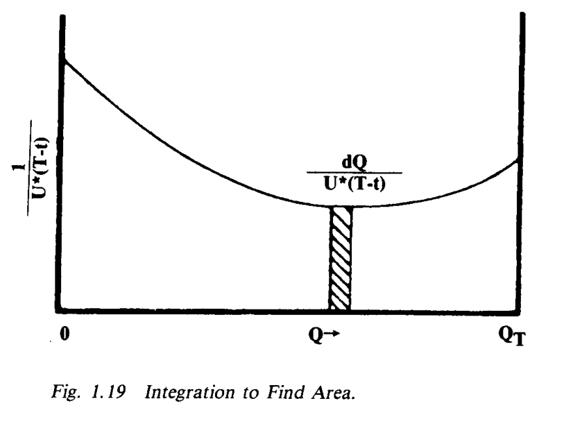

*图 1.19。*

在上述假设下，按式 (1.23) 求值的过程是严格的，并且总是可以使用。但它也很繁琐、耗时。因此自然要问，是否存在更短而且精度仍可接受的过程。事实是，如果作出某些假设，式 (1.23) 可以解析积分为式 (1.24) 的形式：

原式截图：[eq-1-24-original.png](./assets/eq-1-24-original.png)

$$
A^*=\frac{Q_t}{U^*(MTD)}
\tag{1.24}
$$

其中，U* 是假定为常数的总传热系数，MTD 是[平均温差](../../../glossary/terms.md#term-mean-temperature-difference)，将在下一节详细讨论。

## 1.3 The Mean Temperature Difference

## 1.3 平均温差

### 1.3.1 The Logarithmic Mean Temperature Difference

### 1.3.1 对数平均温差

#### Basic Assumptions

#### 基本假设

在上一节中，我们看到，如果能定义一个平均温差 MTD，使得下式成立，设计方程会容易求解得多：

原式截图：[eq-1-25-original.png](./assets/eq-1-25-original.png)

$$
A^*=\frac{Q_t}{U^*(MTD)}
\tag{1.25}
$$

为此，需要对传热过程作若干假设。下面这一组假设对很广泛的情况相当有效，并导向一个非常有用的结果：

1. 给定流股中的所有流体微元具有相同的热经历。
2. 换热器处于稳态。
3. 每股流体的比热恒定。
4. 总传热系数恒定。
5. 换热器没有热损失。
6. 同一流股内部不存在纵向传热。
7. 流动要么是并流，要么是逆流。

第一条假设值得特别注意，因为它常被省略，或以不够明确的方式表述。它的含义很简单：进入换热器的同一流股中，所有流体微元都沿具有相同传热特性的路径通过换热器，并且暴露于相同的传热面积。实际上，多数换热器里总会有一些流路的流动阻力更小，同时提供给流体的传热面积也更少。于是流体会优先走这些路径，并经历较少传热。通常这种差异不大，不会造成严重误差；但偶尔不均匀程度会大到使换热器性能严重不足。这个问题的详细分析过于复杂，本书不在此展开；但设计者应学会识别潜在麻烦构型并避开它们。

第二到第六条假设都比较直接，在实践中也常能满足。需要注意，等温相变，也就是纯组分在恒压下沸腾或冷凝，对应于无限大的比热，因而很好地满足第三条假设。

第七条假设需要用一种常见且简单的换热器构型来说明，即套管式换热器。

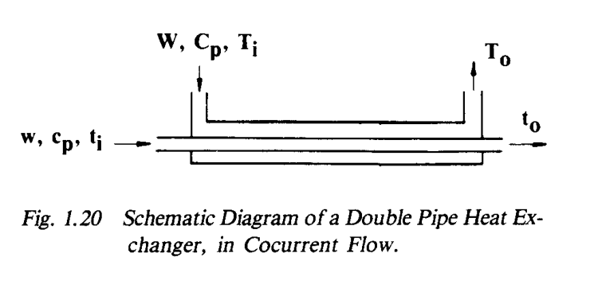

*图 1.20。*

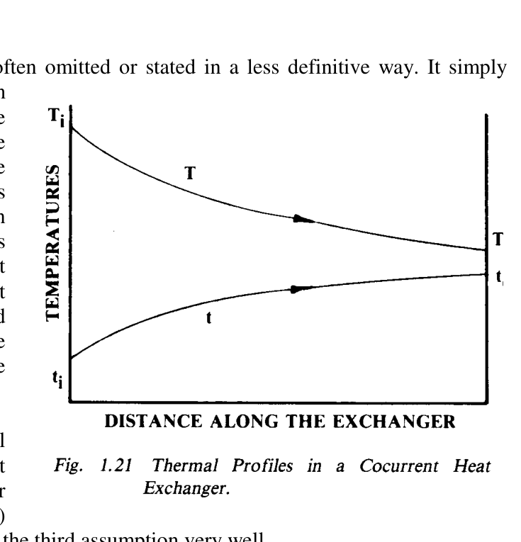

*图 1.21。*

#### The Double Pipe Heat Exchanger

#### 套管式换热器

套管式换热器本质上由一根管子同心放置在第二根较大管子内部构成，如图 1.20 所示。一种流体在内外管之间的环隙中流动，另一种流体在内管中流动。图 1.20 中，两种流体从同一端进入，沿同一方向流动，并从另一端离开；这种构型称为[并流](../../../glossary/terms.md#term-cocurrent-flow)。图 1.21 给出了该换热器中两股流体温度可能出现的剖面。图中把热流体画在环隙内，冷流体画在内管中；反过来的情况同样可能。

注意，出口温度只能彼此接近平衡，这会显著限制可能达到的温度变化。如果把局部温度对已传递热量作图，将得到直线，这是比热恒定假设的直接结果。

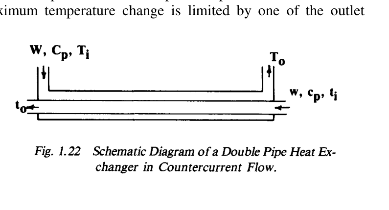

*图 1.22。*

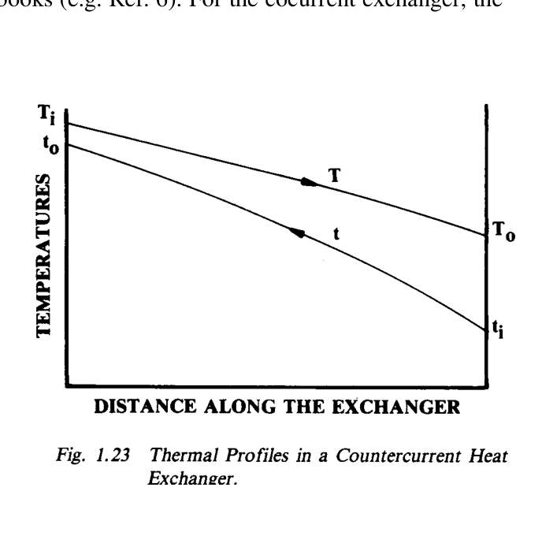

*图 1.23。*

[逆流](../../../glossary/terms.md#term-countercurrent-flow)换热器见图 1.22，可能的温度-长度剖面见图 1.23。还应注意，在逆流中，最大温度变化受一股流体出口温度与另一股流体入口温度达到平衡这一条件限制；与入口条件相同的并流布置相比，逆流布置本质上更有效。因此，只要可能，设计者几乎总是会选择逆流布置。

如果其中一股流体等温，则并流和逆流在温度剖面意义上等价，至少从温度分布角度看，选择并流或逆流并不重要。

#### The Logarithmic Mean Temperature Difference

#### 对数平均温差

如果基本假设成立，设计积分式 (1.23) 可以对并流和逆流情况解析求值。推导细节与这里关系不大，可在许多标准教材中找到，例如参考文献 6。对并流换热器，结果为：

原式截图：[eq-1-26-original.png](./assets/eq-1-26-original.png)

$$
MTD=
\frac{(T_i-t_i)-(T_o-t_o)}
{\ln\left[(T_i-t_i)/(T_o-t_o)\right]}
\tag{1.26}
$$

对逆流情况：

原式截图：[eq-1-27-original.png](./assets/eq-1-27-original.png)

$$
MTD=
\frac{(T_i-t_o)-(T_o-t_i)}
{\ln\left[(T_i-t_o)/(T_o-t_i)\right]}
\tag{1.27}
$$

对特殊情况 (Ti - to) = (To - ti)，式 (1.27) 化为：

原式截图：[eq-1-28-original.png](./assets/eq-1-28-original.png)

$$
MTD=(T_i-t_o)=(T_o-t_i)
\tag{1.28}
$$

式 (1.26) 和式 (1.27) 给出的 MTD 定义，分别是两种情况下端部温差的对数平均。由于它在换热器设计中极为重要，式 (1.27) 通常被称为[对数平均温差](../../../glossary/terms.md#term-log-mean-temperature-difference)，缩写为 LMTD。

### 1.3.2 Configuration Correction Factors on the LMTD

### 1.3.2 LMTD 的构型校正因子

#### Multiple Tube Side Passes

#### 多管程

LMTD 推导中的一个假设是，流动要么完全并流，要么完全逆流。出于多种原因，工程上可能更希望采用混合流、折返流或错流换热器构型。图 1.24 给出一个常见例子：单壳程、双管程设计，简称 1-2 换热器。

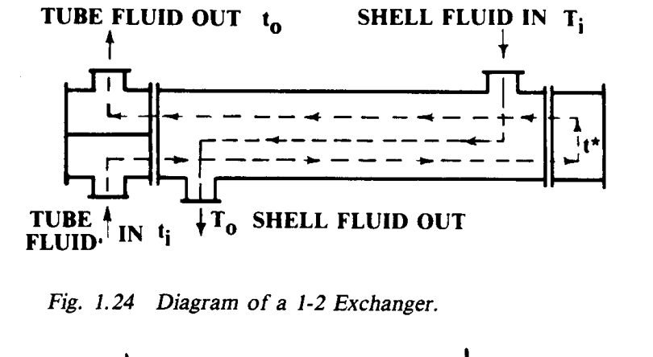

*图 1.24。*

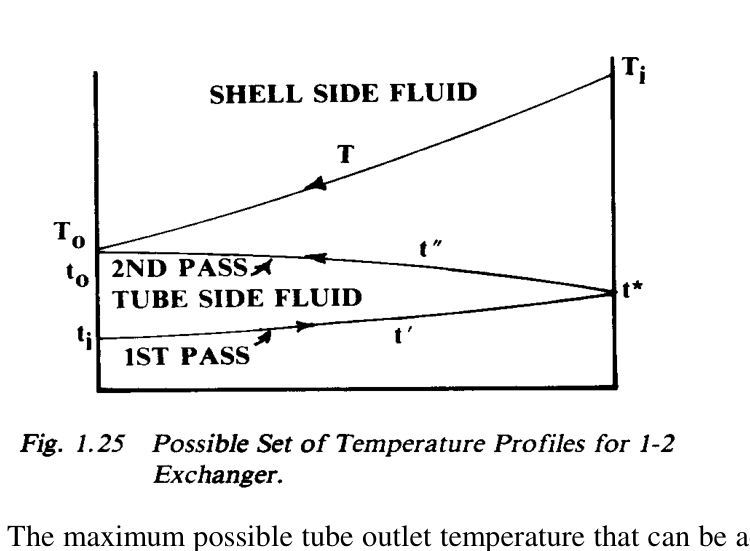

*图 1.25。*

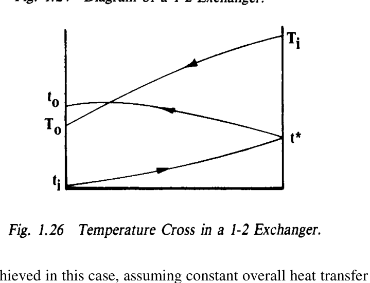

*图 1.26。*

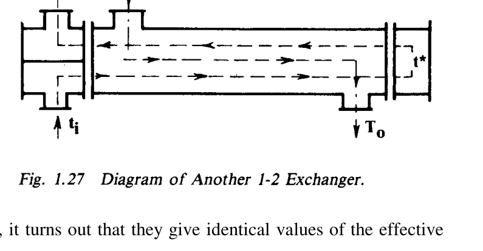

*图 1.27。*

注意，在第一管程中，管内流体相对于壳侧流体为逆流；而在第二管程中，管内流体与壳侧流体为并流。图 1.25 给出了这种换热器可能出现的一组温度剖面。

还要注意，管侧出口温度可能略高于壳侧出口温度。此时温度剖面可能类似图 1.26。若假定总传热系数恒定，这种情况下能够达到的最大管侧出口温度为：

原式截图：[eq-1-29-original.png](./assets/eq-1-29-original.png)

$$
t_{2,\max}=2T_o-t_1
\tag{1.29}
$$

由于达到该极限需要无限面积，并且需要所有其他假设严格成立，通常应远离这个极限运行，或寻找另一种构型。

图 1.27 给出了 1-2 换热器的另一种布置，图 1.28 给出了可能的温度剖面。在这种情况下，t* 不能超过 To。尽管这两种情况外观看起来很不相同，但在给定相同端部温度时，它们给出的有效温差数值相同。

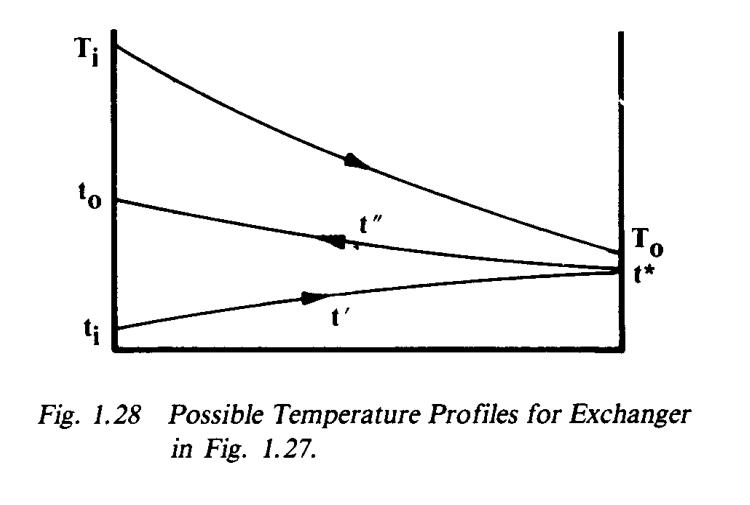

*图 1.28。*

计算这种构型的有效平均温差，可以采用与推导 LMTD 非常相似的方法。基本假设相同，只是不再要求纯并流或纯逆流；此外还假定每一管程具有相同传热面积。不过，与其直接计算 MTD，更常见的做法是计算一个作用在纯逆流 LMTD 上的校正因子 F，即：

原式截图：[eq-1-30-original.png](./assets/eq-1-30-original.png)

$$
F=\frac{MTD}{LMTD}
\tag{1.30}
$$

F = 1 表示流动情况等效于逆流；较低的 F 值则非常清楚地显示出采用 1-2 构型所付出的代价，这种代价最终表现为所需面积增大。必须记住，式 (1.30) 中的 LMTD 应按逆流情况，即式 (1.27)，计算。

对于 1-2 换热器，校正因子 F 可由图 1.29 查得，它是两个参数 R 和 P 的函数。按图中符号定义：

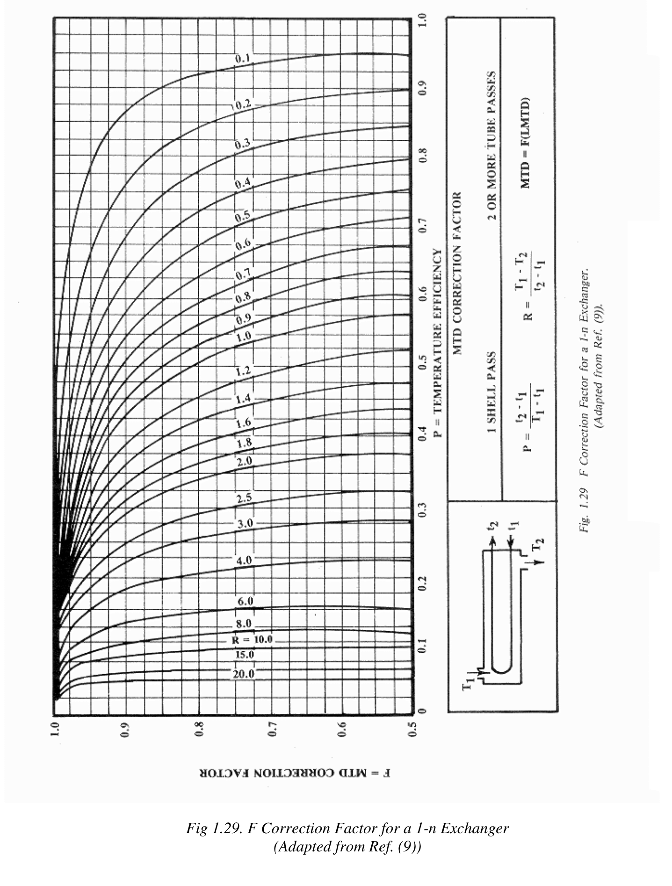

*图 1.29。*

原式截图：[eq-1-31-original.png](./assets/eq-1-31-original.png)

$$
R=\frac{T_1-T_2}{t_2-t_1}
\tag{1.31a}
$$

$$
P=\frac{t_2-t_1}{T_1-t_1}
\tag{1.31b}
$$

图 1.29 改编自 Tubular Exchanger Manufacturers Association 标准，也几乎与 Kern 书中的图相同。McAdams 中对应图使用完全不同的符号，但实际上与此处图相同。不过，还存在其他不同但最终等效的公式化方式；使用任何一种方式时，都必须严格采用它自己的定义。

检查该图可以发现，对每一个 R 值，曲线都会在某个 P 值附近突然变得极陡。这是因为管侧温度正在接近前面讨论过的某个热力学极限。在这个陡峭区域上或附近设计换热器极其危险，因为即使某个基本假设有很小偏离，也可能使换热器在热力学上无论增加多少面积都无法达到规定性能；此时第一条假设尤其关键。因此，工程上有一个普遍接受的经验规则：不设计 F 小于 0.75 的换热器。此外，较低的 F 值会导致大量额外面积需求，几乎总能找到更好的做法。

以上讨论集中在 1-2 换热器。更大的管程数是可能的，而且经常使用。Kern 简要讨论过这一问题，并指出任意偶数管程的校正因子与双管程相比通常在约 2% 以内，因此工程上常用图 1.29 处理所有 1-n 换热器，其中 n 为任意偶数。其他构型将在后文讨论。Kern、McAdams 和 Perry 手册给出了相当完整的 F 图集。

#### Multiple Shell-Side Passes

#### 多壳程

为了抵消多管程导致 F 小于 1.0 的不利影响，有些制造商会常规设计带壳侧纵向折流板的管壳式换热器，如图 1.30 所示。若追踪流路，会看到两股流体始终互为逆流，因此表面上得到 F = 1.0。同一原则可以扩展到多壳侧流程以匹配多管程，但实践中很少或几乎从不这样做。

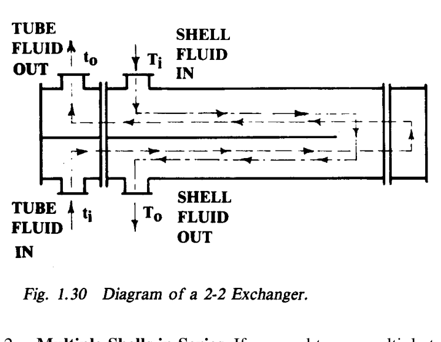

*图 1.30。*

即便只设置单个壳侧纵向折流板，也会带来许多制造、操作和维护问题。无需讨论所有可能性，至少可以看到，除非采取非常特殊的预防措施，否则热量可能从热的壳侧流程穿过折流板泄漏到另一个冷流程，这违反第六条假设。此外，由于压差，还可能有流体从第一壳侧流程物理泄漏到第二壳侧流程，这违反第一条假设。

Rozenmann 和 Taborek 最近对这一问题作了分析，可用于提示何时这种代价会变得严重。

#### Multiple Shells in Series

#### 多台壳体串联

如果需要使用多管程，而单壳程构型导致 F 值过低，甚至在热力学上不可行，该怎么办？通常的解决方案是采用多台壳体串联。图 1.31 给出了一个非常简单的情况：两台 1-2 换热器串联。

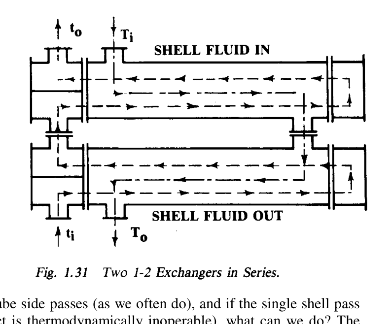

*图 1.31。*

## 1.4 Construction of Shell and Tube Heat Exchangers

## 1.4 管壳式换热器的结构

### 1.4.1 Why a Shell and Tube Heat Exchanger?

### 1.4.1 为什么采用管壳式换热器？

[管壳式换热器](../../../glossary/terms.md#term-shell-and-tube-heat-exchanger)及其各种结构变型，可能是过程工业中使用最广泛、最常见的基本换热器构型。它被广泛接受有若干原因。管壳式换热器能在体积和重量上提供相对较大的传热面积比；这种面积形式易于按很宽的尺寸范围制造，并且机械上足够坚固，能够承受通常的车间制造应力、运输和现场安装应力，以及正常运行条件。基本构型有许多变型，可用于解决特殊问题。管壳式换热器清洗相对容易，最容易失效的部件，即垫片和管子，也容易更换。最后，其设计方法成熟，全球范围内也普遍具备成功设计和制造管壳式换热器的经验与车间能力。

### 1.4.2 Basic Components of Shell and Tube Heat Exchangers

### 1.4.2 管壳式换热器的基本部件

虽然管壳式换热器可采用的具体设计特征种类极多，但基本部件数量相对较少。图 1.34 示出并标识了这些部件。

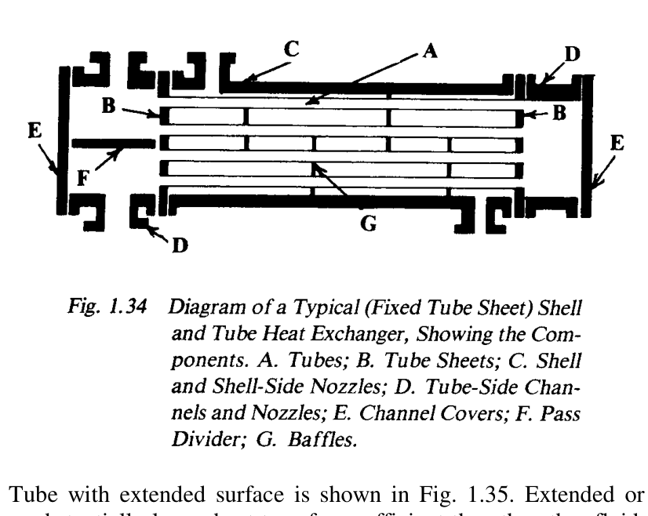

*图 1.34。*

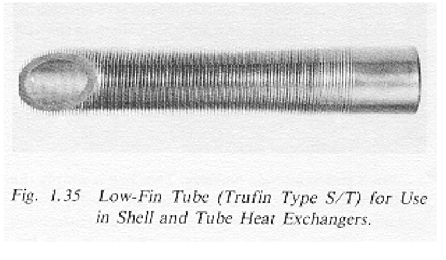

*图 1.35。*

#### Tubes

#### 管子

管子是管壳式换热器的基本部件，它在管内流体与横掠管外的另一种流体之间提供传热表面。管子可以是无缝管，也可以是焊接管，最常由铜合金或钢合金制成。特定应用中也可能需要镍、钛或铝的其他合金。

管子可以是光管，也可以在外侧采用扩展表面或强化表面。图 1.35 给出一根带扩展表面的典型 Trufin 管。当一种流体的传热系数显著低于另一种流体时，会采用扩展或强化表面管。也存在内外同时强化的双强化管，可降低换热器尺寸和成本。扩展表面，也就是翅片管，可在外侧提供普通光管的两到四倍传热面积；这一面积比有助于抵消较低的外侧传热系数。

较新的发展包括：内外均有传热强化的波纹管；既有外部扩展表面、又有内部扰流元件的翅片管；以及外表面经设计以促进核态沸腾的管材。这些以及其他发展将在本书最后一章详细处理。

#### Tube Sheets

#### 管板

管子插入管板孔中，并通过胀入孔内沟槽，或在管子伸出管板表面处与管板焊接而固定。管板通常是一块单一圆形金属板，经过适当钻孔和开槽，以容纳所需管排形式、垫片、间隔杆以及与壳体连接的螺栓圆孔。不过，如果必须避免两股流体在管子与管板密封处泄漏时发生混合，可以采用图 1.36 所示双管板。

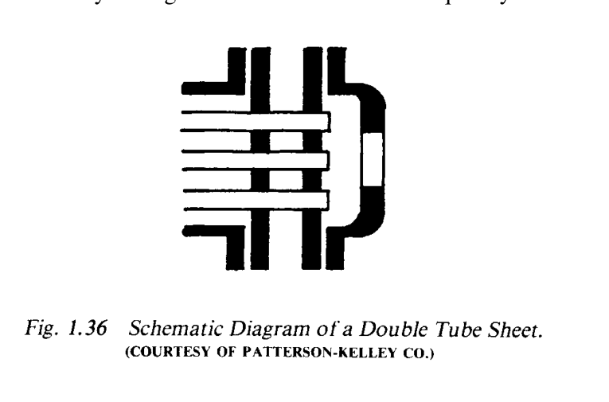

*图 1.36。*

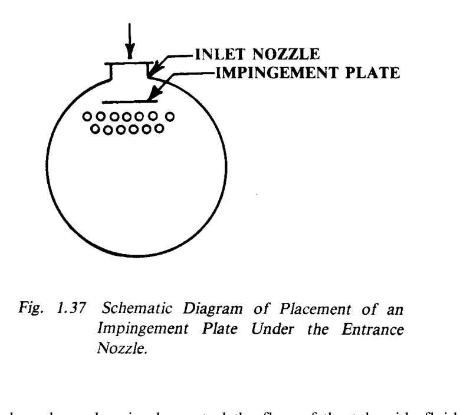

*图 1.37。*

两块管板之间的空间与大气相通，因此任一流体发生泄漏时都应能很快被发现。在极端危险或高价值流体场合，还会使用三重管板，使每种流体都能分别泄漏到大气而不混合；甚至会使用带惰性气体包覆或泄漏回收系统的更特殊设计。

管板除了满足机械要求，还必须能抵抗换热器内两种流体的腐蚀，并且必须与管子和所有管侧材料在电化学上相容。有时，管板采用低碳钢，并在一侧冶金结合一层薄的耐腐蚀合金。

#### Shell and Shell-Side Nozzles

#### 壳体与壳侧接管

壳体就是容纳壳侧流体的容器，接管则是入口和出口。壳体通常为圆形截面，常用适当尺寸的金属板卷成圆筒并焊接纵缝制成，称为卷制壳体。小直径壳体，直径约 24 英寸以下，可通过把所需直径的管子切成正确长度制成，称为管制壳体。

壳体圆度会决定可插入折流板的最大直径，因而影响壳体与折流板之间的泄漏。除非卷制时特别小心，否则管制壳体通常比卷制壳体更接近圆形。为尽量减小不圆度，小壳体有时会在芯轴上扩胀；在极端情况下，壳体会铸造后再用镗床镗孔。

对于大型换热器，凡是可能，壳体都采用低碳钢以降低成本；但当腐蚀或高温强度要求必须满足时，也可以并且确实会采用其他合金。

入口接管下方常设置防冲板，如图 1.37 所示，用于把进入流体射流偏转开，避免它以高速直接冲击最上排管子。这种冲击可能造成冲蚀、空化或振动。为了放置防冲板，同时仍在壳体与防冲板之间留出足够流通面积，使流体排出而不产生过大压降，可能需要从完整圆形布管中省去若干管子。偶尔还会采用更复杂的入口流量分布方式，例如开槽分布板和加大的环形分布段。

#### Tube-Side Channels and Nozzles

#### 管侧封头与接管

管侧封头和接管只是控制管侧流体进入和离开换热器管子的部件。由于管侧流体通常腐蚀性更强，这些封头和接管常由合金材料制成；当然，这些材料必须与管子和管板相容。它们也可以采用衬覆材料，而不一定使用整体合金。

#### Channel Covers

#### 封头盖

封头盖是用螺栓连接到封头法兰上的圆板，可以在不扰动管侧管线的情况下拆下，用于检查管子。在较小换热器中，常用带法兰接管或螺纹接口的罩盖来代替封头和封头盖。

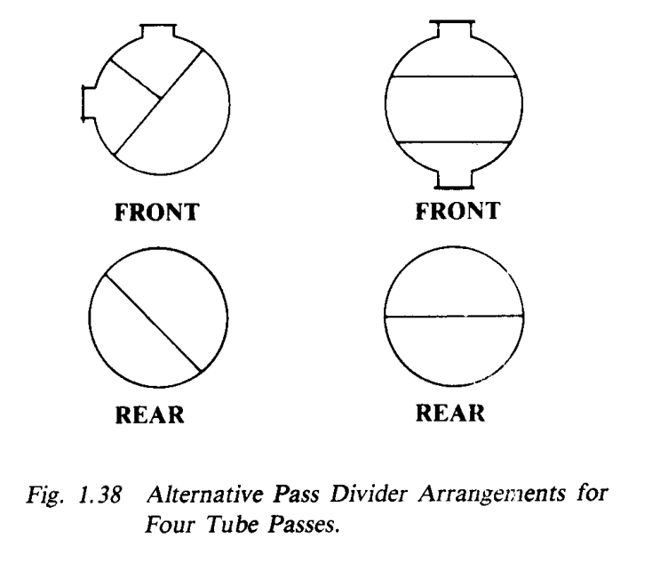

*图 1.38。*

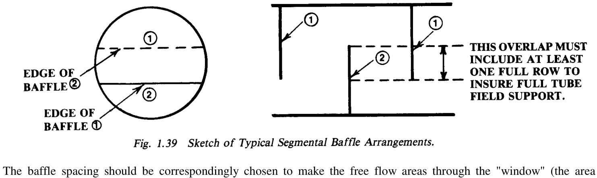

*图 1.39。*

#### Pass Divider

#### 分程隔板

双管程换热器需要在一个封头或罩盖中设置分程隔板；超过两管程的换热器则需要在两个封头或罩盖中都设置分程隔板。如果封头或罩盖为铸件，隔板通常整体铸成，然后加工端面，以便在隔板与管板之间的垫片上形成平整承压面。如果封头由板材卷制或由管件拼制，隔板则焊接到位。

多程换热器中分程隔板的布置在一定程度上是任意的。通常意图是：使各程管数尽量接近；尽量减少因布置而损失的管数；尽量减小任一分程隔板两侧压差，以降低泄漏并减少对 MTD 推导的违反；提供足够的垫片承压面；并尽量降低制造复杂性和成本。图 1.38 示出若干四管程分程隔板布置。

#### Baffles

#### 折流板

折流板有两个作用。最重要的是，它们在装配和运行期间把管子支撑在正确位置，并防止由流动诱发涡流造成的管子振动；其次，它们引导壳侧流体在管束中来回横掠，提高速度和传热系数。

最常见的折流板形状是单弓形折流板，见图 1.39。切掉的弓形段必须小于直径的一半，以保证相邻折流板至少重叠一整排管子。对于壳侧液体流动，折流板切口通常为直径的 20% 到 25%；对于低压气体流动，为尽量减小压降，40% 到 45%，即接近允许最大切口，更为常见。

折流板间距也应相应选择，使窗口区域，也就是折流板边缘与壳体之间的面积，和横掠管束的自由流通面积大致相等。

对许多高速气体流动，单弓形折流板构型会造成不希望的高壳侧压降。保留弓形折流板结构优点并降低压降的一种方法，是使用图 1.40 所示的双弓形折流板；遗憾的是，这也会在某种程度上降低传热系数。

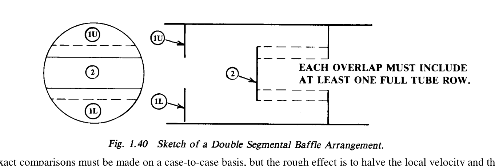

*图 1.40。*

精确比较必须针对具体情况进行，但粗略效果是使局部速度减半，因此相对于尺寸相当的单弓形单元，压降约降为四分之一。

对足够大的装置，可采用三弓形布置，最终也可采用条形折流板和杆式折流板。始终重要的一点是，必须保证每根管子在周期性距离上受到可靠约束，以防止下垂和振动。翅片管穿过折流板时需要特殊支撑措施：在折流板处设置无翅片的光管支承段；使用足够厚的折流板，使若干翅片落在折流板厚度内并形成坚实承载面；或在折流板附近的翅片外部包一层薄金属带。

### 1.4.3 Provisions for Thermal Stress

### 1.4.3 热应力处理措施

#### The Thermal Stress Problem

#### 热应力问题

由于换热器的目的本身决定了壳体温度通常会显著不同于管子温度，因此壳体会相对管子膨胀或收缩，从而在两个部件中产生应力，并通过管板传递。热应力后果随具体情况而异；实际中曾出现壳体屈曲、管子从管板中被拉出，或管子直接被拉断。图 1.34 所示固定管板换热器尤其容易受这类损伤影响，因为它没有容纳差胀的措施。

有一个粗略经验规则认为，简单固定管板构型只能用于两股流体入口温度相差不超过 100°F 的情况。显然，对这种笼统说法必须加上许多限定，包括材料及其性质差异、运行温度水平、开车和循环运行程序等。

#### Expansion Joint on the Shell

#### 壳体膨胀节

解决热膨胀问题最直观的方法，是在壳体上设置膨胀波或膨胀节，如图 1.41 所示。对于较大直径壳体或较高壳侧压力，这种方法吸引力会降低。不过，也有非常大直径、接近大气压力的壳体采用壳体局部球铰设计，使壳体可局部“转动”以容纳应力。

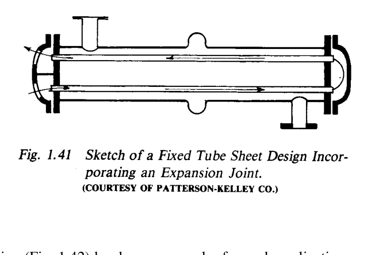

*图 1.41。*

#### Internal Bellows

#### 内部波纹管

近年来，内部波纹管设计，如图 1.42，已在某些应用中流行起来，例如废热立式热虹吸再沸器，此类设备管侧只允许一个流程。这些波纹管已被设计用于管侧高压沸腾水、壳侧高温反应器流出气体的工况，并能成功运行。

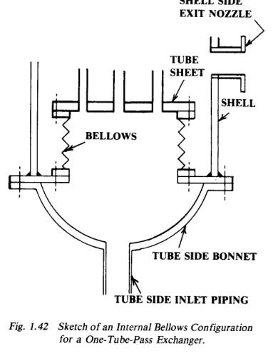

*图 1.42。*

#### The U-Tube Exchanger

#### U 形管换热器

允许管子和壳体独立膨胀的一种设计变型，是图 1.43 示意的 U 形管构型。尽管该设计几乎以可达到的最好方式解决了热膨胀问题，它仍有一些缺点，例如除外排管外无法更换单根管子、无法清洗弯管段附近等，这些缺点使它不适合某些工况。

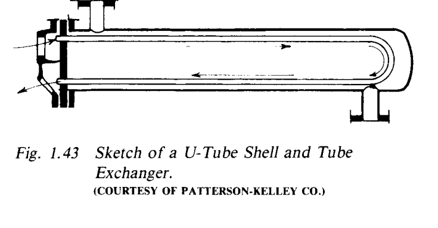

*图 1.43。*

#### Floating Head Designs

#### 浮头设计

常用的浮头式管壳换热器有几种不同设计。每种设计的目标当然都是解决热应力问题，并且都能实现这一目标。然而，不可避免地必须牺牲某些特性；选择时需要考虑各构型不同的缺点组合。

最简单的浮头设计是图 1.44 所示的可抽管束型。一块管板做得足够小，使它及其带垫片的罩盖可以完全穿过壳体抽出，以便检查和清洗壳侧。无需把管束从壳体中取出即可清洗管侧和更换单根管子。不利之处是，为了容纳罩盖法兰和螺栓圆，必须从完整管束边缘省去许多管子。

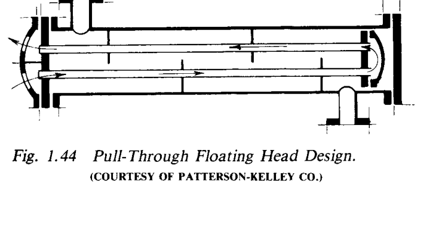

*图 1.44。*

图 1.45 所示剖分环浮头型通过把浮头罩盖连接到剖分背环，而不是连接到管板，来克服这一缺点。代价是机械复杂性增加，但可恢复可抽管束设计中损失的大部分管子，并保留其他特性。

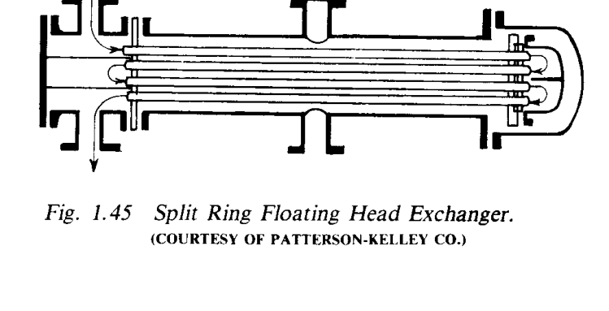

*图 1.45。*

另外两种类型，即外填料灯笼环浮头和外填料函浮头，见图 1.46 和图 1.47，比前述类型更容易向大气泄漏，因此在高压或危险流体工况中牺牲了可靠密封这一重要优点。它们的优点是允许单管程设计。

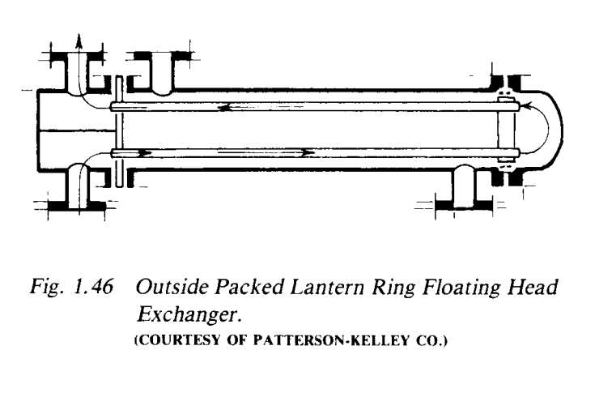

*图 1.46。*

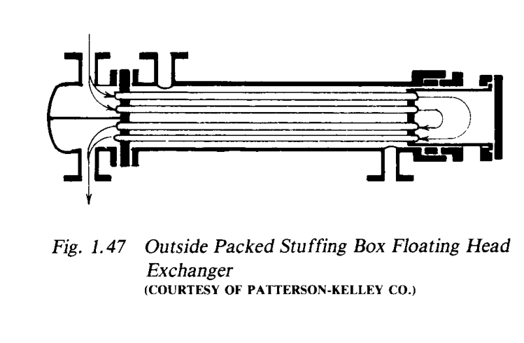

*图 1.47。*

### 1.4.4 Mechanical Stresses

### 1.4.4 机械应力

#### Sources of Mechanical Stresses

#### 机械应力来源

除温度梯度外，每台换热器还会受到多种来源的机械应力。制造技术会带来机械应力，例如胀管导致的管子和管板应力。换热器制造、运输和安装期间，会施加许多常常难以预见的应力。支承结构承受换热器重量时会产生应力，连接管线也会带来应力；这些应力在正常装置运行期间与施工或停车期间通常很不相同。最后，在运行中，由过程流股条件，尤其是压力，在换热器内部产生应力。

#### Provision for Mechanical Stress

#### 机械应力处理措施

为了保护换热器不因这些机械应力而发生永久变形或削弱，必须把换热器设计成：任何合理预期会发生的应力都不会使金属产生超过其能自发恢复原状限度的应变或变形。同时还必须确保不会出现高于设计值的应力。

换热器中的应力和应变分析是一个极其广泛且复杂的主题，本书不再详细发展。较明显的问题至少可由热设计人员定性预见，然后寻求该领域专家建议。

### 1.4.5 The Vibration Problem

### 1.4.5 振动问题

换热器机械设计中的一个非常严重问题，是管子的流动诱导振动。管子振动可能造成几种后果，而且都很糟。管子可能与折流板振动摩擦，最终把管子磨穿。在极端情况下，管子可能碰撞相邻管子，彼此直接撞出孔洞。或者，管子在管板等刚性支承附近反复受力，导致疲劳裂纹、管接头松动和腐蚀加速。

振动由反复作用在管子上的不平衡力造成。这类力有多种，但换热器中最常见的一种，是流体横掠管子时在管后尾流中产生的涡旋运动。不平衡力相对较小，但每秒发生数十次、数百次甚至数千次，而且其大小随流体速度升高而迅速增大。即便如此，这些力通常也会被阻尼掉，不会损坏管子。然而，任何物体在某些频率下都比在其他频率下更容易振动，这些频率称为固有频率。如果不平衡力以接近或等于固有频率的激励频率施加，就会发生共振；即使很小的力，也可能导致管子发生强烈振动。

虽然相关研究正在进步，但预测某一换热器构型是否足以抵抗振动，还不是发展成熟的科学。避免振动问题的两个最佳方法，是尽可能刚性地支撑管子，例如采用较小折流板间距，并保持较低速度。这两点常常与降低换热器成本的愿望相冲突。就目前而言，经验仍是该领域的最佳指南。

### 1.4.6 Erosion

### 1.4.6 冲蚀

换热器设计中另一个本质上属于机械问题的是冲蚀：由于流体在管内或管外流动摩擦而快速移除金属。冲蚀常常与腐蚀同时发生，并通过剥离某些金属表面的保护膜来加速腐蚀作用。

冲蚀速率取决于金属本身、流体速度和密度，以及系统几何形状。在其他因素相同的情况下，金属越硬，冲蚀越小。因此，冲蚀通常在管入口或 U 形管弯头处更严重，因为这些位置存在边界层发展或流体转向带来的附加剪应力。还有一些更难把握的影响与流体和管金属的化学性质有关，尤其是在涉及腐蚀时。

对给定金属的管内流动，存在一些常用最大速度限制，见表 1.1。

### 1.4.7 Cost of Shell and Tube Heat Exchangers

### 1.4.7 管壳式换热器成本

要正确选择换热器构型并分配流股，必须对管壳式换热器的成本基础有一定认识。这里不可能给出精确且足够现行的成本估算关联式，但至少可以识别总成本中的相对贡献，以及这些贡献如何随某些设计规定变化。

管壳式换热器在制造厂交货价中的成本，由各个部件成本，壳体、管子等，加上装配成本组成。每个部件的成本又包括材料成本、粗加工或成形成本，例如卷制壳体，以及机加工成本。给客户的最终价格还包括工程和其他间接费用、制造商利润以及运输费用。其中有些费用，例如利润，大致与总成本成比例；而运输费用更接近于与总重量成比例。

为了得到最经济的设备，按一次投资成本计，必须考虑设备特殊要求对各部件成本的影响。例如，假设一种流体需要特殊合金以抗腐蚀。如果把该流体放在壳侧，壳体和管子都必须由该合金制成；反之，如果把腐蚀性流体放在管内，则只有管子和管侧配件需要采用合金。如果管板和封头只做合金覆层，成本还常可进一步降低。

相同总传热面积可以布置在小直径、较长的壳体内，也可以布置在较大直径、较短的壳体内。壳体成本常是总换热器成本中最大的单项成本，它随直径增加非常迅速，但随长度最多只线性增加。因此，除非空间或压降限制另有要求，最经济的换热器通常具有较大的长径比，粗略经验上可高达约 12:1。

对整台换热器而言，只有对几种不同设计进行完整成本分析，才能确定哪一种一次投资成本最低。不过，有若干规则倾向于从大量可能性中选出较经济的设计，后文会继续讨论。

### 1.4.8 Allocation of Streams in a Shell and Tube Exchanger

### 1.4.8 管壳式换热器中的流股分配

原则上，进入管壳式换热器的任一流股都可以布置在传热表面的任一侧，即管侧或壳侧。然而，有四个因素会强烈影响哪一种选择能够得到最经济的换热器：

1. **高压。** 如果某一流股压力较高，最好把该流股放在管内。这样，只有管子和管侧配件需要设计成承受高压，而壳体可以采用较轻材料。显然，如果两股流体都处于高压，则需要重型壳体，其他因素将决定哪种流体进入管内。无论如何，高壳侧压力会使长而小直径的换热器设计更有价值。
2. **腐蚀。** 腐蚀通常决定结构材料选择，而不仅是换热器设计。然而，由于多数耐腐蚀合金比普通结构材料更贵，腐蚀性流体通常会放在管内，使至少壳体不必采用耐腐蚀材料。如果不能有效防止腐蚀，而只能通过材料选择减缓腐蚀，则必须选择一种易于更换可腐蚀部件的设计，除非报废整台设备并重做更经济。
3. **污垢。** 污垢在几乎所有过程换热器设计中都会产生可测影响，但某些流股结垢严重到整个设计都由以下目标支配：尽量减小污垢，例如采用高速度、避免死区或涡流区；便于清洗，例如把结垢流体放在管侧，若结垢流体在壳侧则采用大管间距和旋转正方形布管；或通过多台设备延长运行寿命。
4. **低传热系数。** 如果某一流股具有固有的低传热系数，例如低压气体或黏性液体，通常优先把该流股放在壳侧，以便使用扩展表面降低换热器总成本。

## 1.5 Application of Extended Surfaces to Heat Exchangers

## 1.5 扩展表面在换热器中的应用

### 1.5.1 The Concept of the Controlling Resistance

### 1.5.1 控制热阻概念

检查式 (1.18)、式 (1.19) 或式 (1.20) 可以看出，如果右侧分母中某一项显著大于其他项，它基本上就决定了 U 的数值。由于每一项都是传热热阻，占主导的项称为[控制热阻](../../../glossary/terms.md#term-controlling-resistance)，设计者需要特别关注其数值。

如上一节所述，一个传热系数可能远低于另一个传热系数，而这个低传热系数对应的就是高传热热阻，而且常常是控制热阻。

减小低传热系数不利影响的一种方法，是把该流股放在换热器壳侧，并采用扩展表面来增加外侧面积与内侧面积之比 Ao/Ai，从而抵消较低的 ho。

### 1.5.2 Types of Extended Surface

### 1.5.2 扩展表面类型

“扩展表面”涵盖许多可能性，但本书最关心的是带圆形翅片且翅片基本垂直于管轴的圆管。典型整体翅片管见图 1.48。

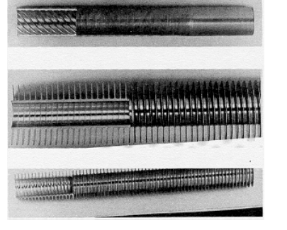

*图 1.48。*

管壳式换热器中常用的低翅片管，其外侧面积约为内侧面积的 3 到 4 倍，即 Ao/Ai 约为 3 到 4。在 Wolverine S/T 型中，可提供每英寸 16 到 40 片翅片。翅片外径只略小于管端光管外径，因此管子可穿过管板孔。翅片下方壁厚控制在规定厚度，光管端部壁厚约比其厚两个线规。为在折流板处支撑管子，可提供无翅片支承段。

管壳式换热器中也使用每英寸 11 片翅片的中等翅高管，其 Ao/Ai 通常约为 5。

当需要加热或冷却气体，或需要空冷过程流股时，高翅片管具有优势。高翅片管有多种翅高、厚度和间距，可得到高达 25 的 Ao/Ai 值。为防腐，可在翅片管内机械结合一根衬管。衬管可由耐腐蚀合金制成，而外管和翅片可由铜或铝等高导热金属制成，以改善传热。

Wolverine 生产的所有翅片管均为整体翅片，即翅片通过挤压工艺从基管材料形成，使最终管子及其翅片成为一整块金属。

对于高翅片管，也存在其他翅片形式，翅片作为独立金属件缠绕在管子上。翅片通常只靠变形翅片金属的张力固定，有时也通过软钎焊、焊接或硬钎焊固定到管子上。在这类翅片管中，翅片与管子之间的接触热阻是重要考虑因素。即使翅片最初具有良好热接触，反复热循环也可能导致蠕变和局部分离。此外，翅片与管子之间的缝隙可能成为腐蚀位置，随之增加接触热阻，并可能加速管子失效。

### 1.5.3 Fin Efficiencies and Related Concepts

### 1.5.3 翅片效率及相关概念

考察热量从管侧流体穿过管壁和翅片，再进入翅片侧流体的路径，可以看到热量必须流动的距离比相应光管情况更长。额外距离通常穿过高导热翅片金属，这一点没错，但热流仍然多了一个附加热阻，部分抵消了扩展表面的优势。为在计算中计入该热阻，定义[翅片效率](../../../glossary/terms.md#term-fin-efficiency) φ：实际翅片传出的总热量，与假想翅片全部处于翅片根部温度时传出的总热量之比。图 1.49 说明了这一定义。

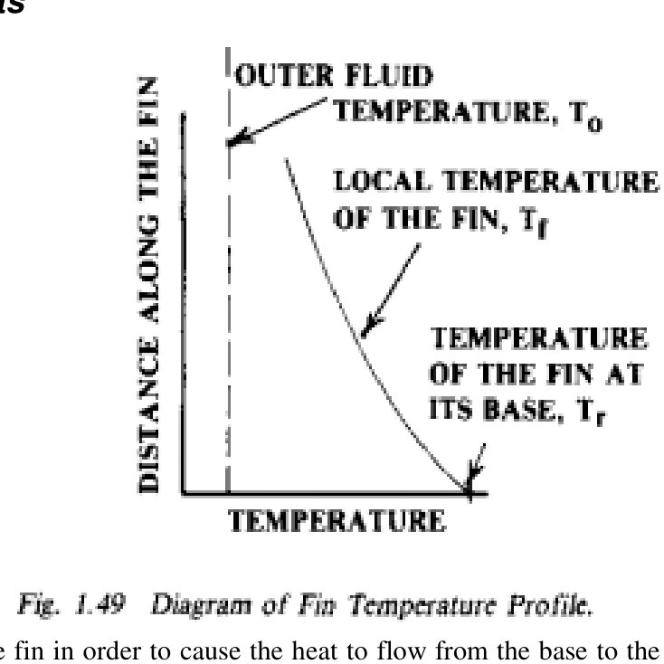

*图 1.49。*

图中翅片温度 Tf 高于外侧流体主体温度 To，因此热量从翅片传向外侧流体。然而，所有这样传出的热量都必须从翅片根部流入翅片。因此，翅片根部温度 Tr 是翅片中的最高温度。随着沿翅片向外移动，温度连续降低，正是这一温差推动热量从根部流向翅片。温度下降速率取决于翅片形状、导热系数以及翅片到外侧流体的膜传热系数。

显然，如果翅片各处都处于 Tr，翅片传热量将最大；这只有在翅片金属具有无限大导热系数时才可能发生。当然，没有金属具有无限大导热系数，但这提供了一个方便基准，用于按上述翅片效率定义比较真实翅片。

求解翅片效率需要复杂数学分析，这里不展开。Kern 和 Kraus 的《Extended Surface Heat Transfer》对该问题及其解法有非常完整的讨论。

对这里考虑的翅片类型，在多数关注范围内可使用下式：

原式截图：[eq-1-33-original.png](./assets/eq-1-33-original.png)

$$
\phi=\frac{1}{1+\frac{m^2}{3}\sqrt{\frac{d_o}{d_r}}}
\tag{1.33}
$$

其中：

原式截图：[eq-1-34-original.png](./assets/eq-1-34-original.png)

$$
m=H\left[\frac{2}{(1/h_o+R_{fo})k y}\right]^{1/2}
\tag{1.34}
$$

几何变量见图 1.50。ho 和 Rfo 分别为翅片侧实际对流传热系数和实际污垢热阻，均基于翅片面积。检查式 (1.33) 和式 (1.34) 可知，翅片材料导热能力越好，翅片效率越高；外侧传热系数越低，翅片效率也越高。通常不在翅片效率低于 0.65 的应用中使用翅片管。

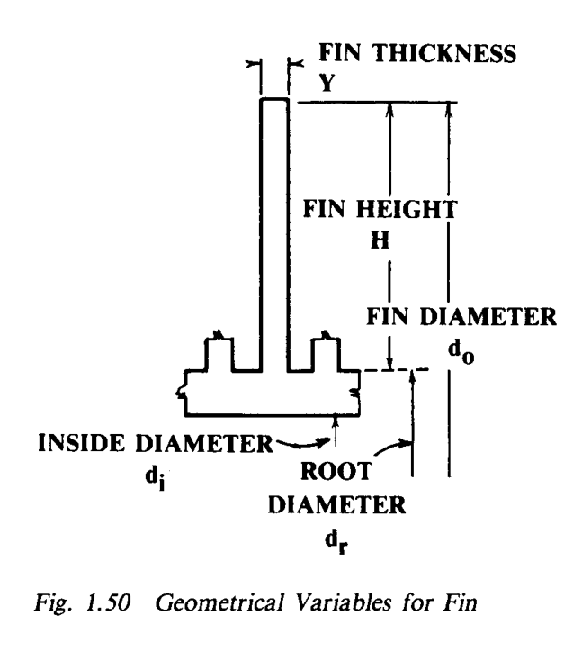

*图 1.50。*

翅片效率只适用于管子的翅片面积。管根区域，也就是翅片之间的光管区域，假定以 1.00 的效率传热。因此，可以把管子总传热量写为：

原式截图：[eq-1-35-original.png](./assets/eq-1-35-original.png)

$$
Q=h_oA_{root}(T_r-T_o)+\phi h_oA_{fin}(T_r-T_o)
\tag{1.35}
$$

该式可写成：

原式截图：[eq-1-36-original.png](./assets/eq-1-36-original.png)

$$
Q=h_o(T_r-T_o)(A_{root}+\phi A_{fin})
\tag{1.36}
$$

或：

原式截图：[eq-1-37-original.png](./assets/eq-1-37-original.png)

$$
Q=h_oA_{eq}(T_r-T_o)
\tag{1.37}
$$

其中 Aeq 为等效或有效传热面积：

原式截图：[eq-1-38-original.png](./assets/eq-1-38-original.png)

$$
A_{eq}=A_{root}+\phi A_{fin}
\tag{1.38}
$$

如果管外侧，包括翅片，存在污垢膜，则式 (1.35)、式 (1.36) 和式 (1.37) 必须写为：

原式截图：[eq-1-39-original.png](./assets/eq-1-39-original.png)

$$
Q=
\frac{A_{root}(T_r-T_o)}{1/h_o+R_{fo}}
+\frac{\phi A_{fin}(T_r-T_o)}{1/h_o+R_{fo}}
\tag{1.39}
$$

或：

原式截图：[eq-1-40-original.png](./assets/eq-1-40-original.png)

$$
Q=
\frac{(T_r-T_o)(A_{root}+\phi A_{fin})}{1/h_o+R_{fo}}
\tag{1.40}
$$

或：

原式截图：[eq-1-41-original.png](./assets/eq-1-41-original.png)

$$
Q=
\frac{A_{eq}(T_r-T_o)}{1/h_o+R_{fo}}
\tag{1.41}
$$

式 (1.38) 保持不变。

Aeq 可除以管子的总外侧传热面积 Ao，得到加权翅片效率：

原式截图：[eq-1-42-original.png](./assets/eq-1-42-original.png)

$$
E_w=\frac{A_{root}+\phi A_{fin}}{A_{root}+A_{fin}}
\tag{1.42}
$$

对给定管子，可把该比值作为材料以及 1/ho + Rfo 的函数一次性算出。Wolverine Trufin 产品的相关结果见图 1.51a、图 1.51b 和图 1.51c。

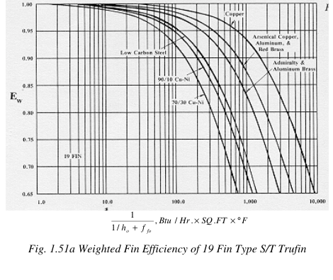

*图 1.51a。*

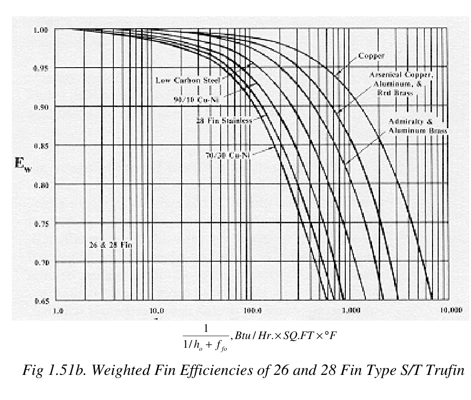

*图 1.51b。*

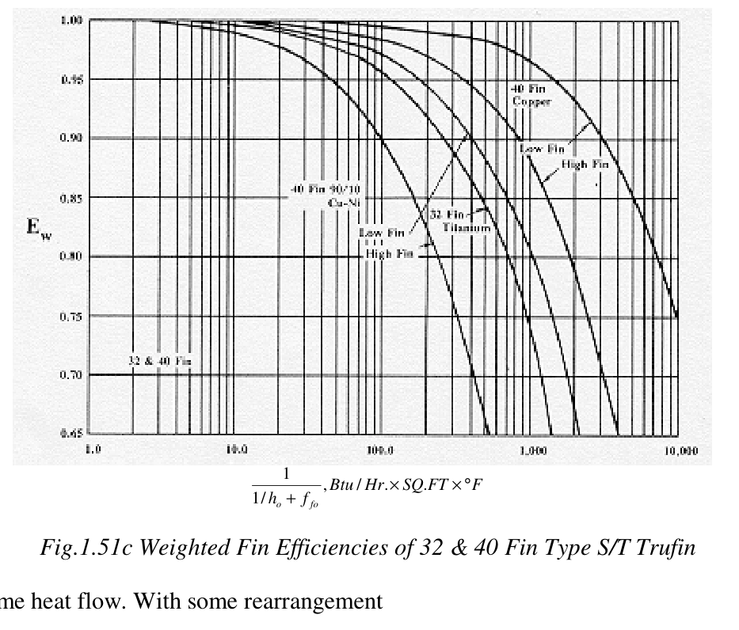

*图 1.51c。*

### 1.5.4 The Fin Resistance Method

### 1.5.4 翅片热阻法

表示翅片管传热有效性的另一种方法，是 Carrier 和 Anderson 首先发展、后来由 Young 和 Ward 修正的[翅片热阻法](../../../glossary/terms.md#term-fin-resistance-method)。本手册后续通常采用这一方法。导出式 (1.16) 的论证基于光管，并把全部外侧传热视为具有相同传热能力。如果把由翅片导热引入的附加热阻 Rfin 写入方程，则该方程的有效性可扩展到翅片管：

原式截图：[eq-1-43-original.png](./assets/eq-1-43-original.png)

$$
Q=
\frac{T_i-T_o}
{\frac{1}{h_iA_i}+\frac{R_{fi}}{A_i}+\frac{\Delta x_w}{k_wA_m}+\frac{R_{fin}}{A_o}+\frac{R_{fo}}{A_o}+\frac{1}{h_oA_o}}
\tag{1.43}
$$

分母中第三项代表壁面热阻，仅对位于内径与翅片根径之间的那部分管壁求值，也就是不包括翅片。因此：

原式截图：[eq-1-44-original.png](./assets/eq-1-44-original.png)

$$
\Delta x=\frac{d_r-d_i}{2}
\tag{1.44}
$$

并且：

原式截图：[eq-1-45-original.png](./assets/eq-1-45-original.png)

$$
A_m\approx \pi(d_i+\Delta x)L
\tag{1.45}
$$

现在定义一个基于翅片管全部外表面积 Ao 的总传热系数 Uo：

原式截图：[eq-1-46-original.png](./assets/eq-1-46-original.png)

$$
Q=U_oA_o(T_i-T_o)
\tag{1.46}
$$

由式 (1.43) 和式 (1.46) 消去 Q 和 (Ti - To)，并整理，可得：

原式截图：[eq-1-47-original.png](./assets/eq-1-47-original.png)

$$
\frac{1}{U_o}
=
\frac{1}{h_o}
+R_{fo}
+R_{fin}
+\frac{A_o\Delta x_w}{A_mk_w}
+\frac{A_oR_{fi}}{A_i}
+\frac{A_o}{h_iA_i}
\tag{1.47}
$$

按上述写法，右侧每一项都是特定过程对应的传热热阻；过程各部分的温降与对应热阻大小成比例。

如果取式 (1.47) 右侧前三项，则相应温降是从翅片根部到外侧流体的 (Tr - To)，对应热流为：

原式截图：[eq-1-48-original.png](./assets/eq-1-48-original.png)

$$
Q=
\frac{A_o(T_r-T_o)}{1/h_o+R_{fo}+R_{fin}}
\tag{1.48}
$$

该式可与使用翅片效率 φ 的式 (1.40) 相等，因为二者必须给出同一热流。经整理可得：

原式截图：[eq-1-49-original.png](./assets/eq-1-49-original.png)

$$
R_{fin}
=
\left(\frac{1}{h_o}+R_{fo}\right)
\frac{A_{fin}(1-\phi)}{A_{root}+\phi A_{fin}}
\tag{1.49}
$$

利用式 (1.33) 和式 (1.34) 求得 φ 后，可把 Rfin 计算为 1/ho + Rfo 的函数，并针对不同翅片材料和几何形状给出结果。标准 Wolverine Trufin 产品的结果见图 1.52a、图 1.52b 和图 1.52c。

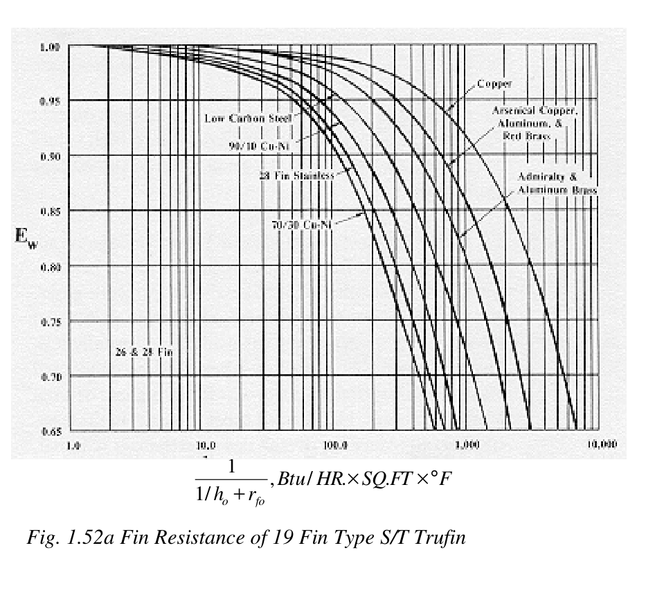

*图 1.52a。*

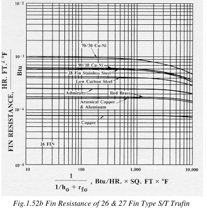

*图 1.52b。*

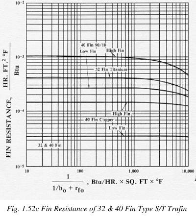

*图 1.52c。*

Rfin 的一个重要特征是：对给定翅片几何和材料，在横坐标达到很高数值之前，相对于翅片管通常应用范围而言，它几乎保持常数。

### 1.5.5 Some Applications of Finned Tubes

### 1.5.5 翅片管的一些应用

高翅片管的一个主要应用是空冷换热器。大气空气与所有低压气体一样，在正常速度下传热系数很低。相比之下，管侧流体通常是需要显热冷却的液体，或需要冷凝的蒸汽，其传热系数可能高出 100 倍甚至更多。因此，这类换热器采用高翅片管以降低所需换热器总体尺寸。即便如此，有些装置仍会占地数英亩。此类换热器的结构细节和设计方法见本手册第 4 章。

低翅片管和中翅片管用于管壳式换热器中的多种显热、冷凝和沸腾工况。典型显热传热应用是压缩机中间冷却器中冷却压缩气体，管内使用冷却水。

低翅片管用于有机蒸汽冷凝，这类蒸汽的冷凝传热系数只有管内冷却水传热系数的三分之一或四分之一。除提供额外传热面积外，翅片还提供滴落点，便于冷凝液排出。另一方面，当翅片侧冷凝蒸汽或其他高表面张力流体时，不采用翅片管。高表面张力会使液体滞留在表面上，形成基本静止液膜，从而在很大程度上绝热。

翅片管也用于沸腾工况，尤其是在管内冷凝蒸汽作为加热介质时。此时冷凝传热系数可能为 2000 或 3000 Btu/(hr·ft2·°F)，因此即使通常与核态沸腾相关的高传热系数，相比之下也可能较小；采用低翅片管可使设计受益。

## 1.6 Fouling in Heat Exchangers

## 1.6 换热器中的污垢

### 1.6.1 Typical Fouling Resistances

### 1.6.1 典型污垢热阻

“污垢”是一个通用术语，包括换热器寿命期间出现在传热表面上的任何外来材料沉积。无论沉积原因或确切性质如何，都会引入额外传热热阻，并相应降低换热器运行能力。在许多情况下，沉积物厚到足以显著干扰流体流动，并增加维持换热器内流量所需的压降。

设计者必须在所需运行周期内考虑污垢对换热器性能的影响，并在设计中留出足够额外能力，以保证换热器在停车清洗前仍能满足工艺规定。设计者还必须考虑需要什么机械布置才能便于清洗。

污垢裕量在很大程度上属于经验问题。各种工况有典型值表，例如 Perry 手册和 TEMA 标准，也有一种关于冷却水的专有关联式。这里把 TEMA 表改编为表 1.2。不过，污垢行为强烈依赖许多变量，且这些相互作用非常复杂，因此每个问题都确实需要检查是否存在意外陷阱和特殊考虑。

关于换热器污垢，Taborek 等人的综述是最好的总体介绍。其他重要贡献见参考文献 17 到 21。

### 1.6.2 Types of Fouling

### 1.6.2 污垢类型

污垢沉积可能由若干不同基本机制形成，每种机制通常又依赖若干变量。此外，在给定工况中，两种或多种污垢机制可能同时发生。本节识别主要污垢机制及其依赖的重要变量。

1. **沉积污垢。** 许多流股，尤其是冷却水，含有悬浮固体，这些固体可沉积在传热表面上。通常这类沉积物与表面结合不强，并且具有自限制性；也就是说，沉积越厚，越容易以斑块形式被冲走，并在一段时间后达到某种渐近平均值。沉积污垢强烈受速度影响，受壁温影响较小。然而，沉积物可能在热壁上被“烘结”，变得非常难以去除。
2. **反溶解度污垢。** 天然水中常见的某些盐类，尤其是硫酸钙，在热水中的溶解度低于冷水。如果这类流股遇到温度高于溶解盐饱和温度的壁面，盐就会在表面结晶。结晶会从特别活跃的点开始，即成核点，例如划痕和凹坑，通常在相当长诱导期后发生，然后扩展覆盖整个表面。只要与流体接触的表面温度高于饱和温度，沉积就会继续增长。这类水垢坚硬且附着牢固，通常需要强力机械或化学处理才能去除。
3. **化学反应污垢。** 上述污垢机制主要涉及物理变化。过程流股侧常见污垢来源，是在表面处或其附近发生化学反应并产生固相。例如，热传热表面可能导致过程流股中某组分热降解，在表面形成含碳沉积物，通常称为焦炭。或者，表面可能导致聚合，形成一层低级塑料或合成橡胶状坚韧沉积物。这类沉积物往往极其顽固，可能需要把沉积物烧掉等极端措施才能使换热器恢复满意运行。
4. **腐蚀产物污垢。** 如果某流股腐蚀传热表面金属，腐蚀产物可能对剩余金属抵抗进一步腐蚀至关重要。在这种情况下，任何清洗表面的尝试都可能只会加速腐蚀并导致换热器失效。
5. **生物污垢。** 许多冷却水源和少数过程流股含有会附着在固体表面并生长的生物。这些生物从藻类和微生物黏泥，到藤壶和贻贝不等。即使只有很薄一层膜，传热热阻也可能很大。当存在贻贝等宏观生物时，问题已不再是传热，因为热量不会穿过生物体，而是流道被堵塞。如果认为生物污垢是问题，通常解决方法是通过氯化杀死生物，或使用 90-10 铜镍合金 C70600 或其他高铜合金管，以阻止它们附着在传热表面。间歇冲击氯化有时可替代连续氯化并取得成功。
6. **组合机制。** 上述大多数污垢过程可以组合发生。一个常见例子是冷却塔水中的沉积污垢和反溶解度污垢组合。多数地表水既含沉积物，也含碳酸钙；当水在冷却系统中循环时，这些组分浓度升高。因此，常见沉积物由反溶解度盐结晶和细分散沉积物共同组成。这类沉积物行为介于两个极限情况之间：晶体倾向于把沉积物固定在原位，但结构中存在弱面，会不时失效并使沉积物以斑块脱落。

### 1.6.3 Effect of Fouling on Heat Transfer

### 1.6.3 污垢对传热的影响

如上所述，污垢的作用是在表面上形成基本固态沉积物，热量必须通过该沉积物以导热方式传递。如果知道污垢层厚度和导热系数，就可以把传热问题简单看作与壁面串联的又一个导热热阻。通常这两个量都不知道，唯一可行技术是在计算总传热系数时，像前面讨论的那样引入污垢因子。

如果已经考虑了传热降低和小幅流动阻力增加，管内污垢通常不会引起特殊问题。然而，翅片管外侧污垢可能更复杂，因为在极端情况下，具有有限厚度的污垢层可能有效封闭翅片之间的流道。另一方面，有时发现翅片表面比光滑表面更抗污垢；原因尚不明确，但可能是正常运行循环中表面的膨胀和收缩倾向于使脆性污垢膜脱落。不过，在已知显著结垢工况中使用翅片管仍应谨慎。

高翅片管通常只用于空气和其他低压、相对洁净的气体。此时即使发生污垢，也主要是粉尘沉积，可通过吹扫容易去除。

### 1.6.4 Materials Selection for Fouling Services

### 1.6.4 污垢工况的材料选择

潜在污垢问题可能以三种方式影响材料选择。最明显的是，通过选择不易腐蚀或不产生大量腐蚀产物沉积的结构材料，尽量减小腐蚀型污垢。如果计划采用化学方法去除污垢沉积，所选材料还必须能抵抗清洗溶液侵蚀。

其次，通过选择含铜合金，例如 90-10 铜镍合金 UNS 70600 或 70-30 铜镍合金 UNS 71500，可在很大程度上消除生物污垢。一般来说，含铜量大于 70% 的合金能有效防止或减小生物污垢。

第三，某些污垢可通过采用高流速来控制或减小。如果采用这一技术，必须考虑金属冲蚀可能性，因为将速度及其持续时间限制在与满意管寿命一致的范围内很重要。某些金属，例如钛或不锈钢，对高速流出物冲蚀有很强抵抗力。最近，International Nickel Company 开发了一种新的铜镍合金，名义成分为 83% 铜、17% 镍和 0.4% 铬，即 C72200 合金。该合金在耐腐蚀性方面类似其他铜镍合金，但抗速度冲击能力高得多，可在接近 25 ft/s 的海水流速下运行。

### 1.6.5 Removal of Fouling

### 1.6.5 污垢去除

如果无法防止污垢形成，就必须为周期性去除污垢作出安排。某些沉积物可纯粹通过化学方法去除，例如通过氯化去除碳酸盐沉积。化学清洗技术的应用是一门专门技艺，只应在专家指导下进行。不过，由于化学清洗通常不需要拆除设备，也不需要拆卸管线，如果设计适当，在可使用的情况下它是最方便的清洗技术。

机械去除污垢有多种技术。刮削或旋转刷洗仅限于刮削工具可以到达的表面；在壳侧，通过采用较大的管间间隙或旋转正方形布管，可缓解这一问题。需要注意，不应在翅片管上使用刮削。无论管内还是管外，使用极高速水射流都很常见；但对壳侧而言，水射流在大型管束深处不会非常有效。

对于高度重视保持清洁的情况，例如大型电站冷凝器，可能安装一种管内表面连续在线清洗系统。Amertap 系统使用略大于管内径的海绵橡胶球，并使其随机连续循环通过管子。当球通过管子时，会去除水垢或腐蚀产物积累。出口管线中的网篮收集这些球，球泵再把它们重新注入入口水流。外表面带磨料的球只能非常谨慎使用，因为连续磨蚀作用可能去除铜和铜基合金表面形成的保护腐蚀膜，从而缩短管寿命。

M.A.N. 系统通过使刷子穿过管子实现在线清洗。使用该系统的换热器在每根管子的两端都安装塑料篮或笼。一个适合管内径的塑料刷装入其中一个篮中。周期性地反转通过管子的水流，迫使刷子穿过管子，并被管子远端的篮捕获。随后冷却水流再次反转回正常流向，刷子返回管子出口端的笼中。由于系统相对简单，只要冷却水流可以反向，该系统可用于各种尺寸的换热器。

### Table 1.1 Erosion Limits

### 表 1.1 冲蚀限制：管内流动的最大设计流体速度

原表截图：[table-1-1-original.png](./assets/table-1-1-original.png)

| 流体 / 材料 | 最大设计速度 |
|---|---:|
| 水，低碳钢 | 10 ft/s |
| 水，不锈钢 | 15 ft/s |
| 水，铝 | 6 ft/s |
| 水，铜 | 6 ft/s |
| 水，90-10 铜镍合金 | 10 ft/s |
| 水，70-30 铜镍合金 | 15 ft/s |
| 水，钛 | 大于 50 ft/s |

其他液体的允许速度可按水的允许速度修正：

原式截图：[eq-table-1-1-liquid-velocity-original.png](./assets/eq-table-1-1-liquid-velocity-original.png)

$$
V_{\mathrm{allow,liquid}}
=
V_{\mathrm{allow,water}}
\left(\frac{\rho_{\mathrm{water}}}{\rho_{\mathrm{liquid}}}\right)^{1/2}
$$

对于气体和干蒸汽，钢管最大设计速度可估算为：

原式截图：[eq-table-1-1-gas-velocity-original.png](./assets/eq-table-1-1-gas-velocity-original.png)

$$
V\,[\mathrm{ft/s}]
=
\frac{1800}{\left(p_{\mathrm{abs}}\,[\mathrm{psia}]\,M\right)^{1/2}}
$$

其他金属的允许速度可按其在水中允许速度的相同比例取值。

### Table 1.2 Fouling Resistances for Typical Process Applications

### 表 1.2 典型过程应用的污垢热阻

本表改编自 Tubular Exchanger Manufacturers Association 标准。表中数值是所描述情形的典型值，但必须允许不同案例之间存在显著变化。热阻以与流体接触的表面积为基准，并用于式 (1.19) 和式 (1.20) 形式的方程。热阻单位为 hr·ft2·°F/Btu。

原表截图：[水](./assets/table-1-2-water-original.png)、[一般工业/化工/天然气与天然汽油](./assets/table-1-2-industrial-chemical-gasoline-original.png)、[炼油](./assets/table-1-2-refinery-original.png)、[润滑油加工续表](./assets/table-1-2-lube-original.png)

#### I. 水

| 水类型 | 加热介质不超过 240°F，水温不超过 125°F，水速 3 ft/s 及以下 | 加热介质不超过 240°F，水温不超过 125°F，水速大于 3 ft/s | 加热介质 240-400°F，水温大于 125°F，水速 3 ft/s 及以下 | 加热介质 240-400°F，水温大于 125°F，水速大于 3 ft/s |
|---|---:|---:|---:|---:|
| 海水 | 0.005 | 0.001 | 0.003 | 0.002 |
| 微咸水 | 0.002 | 0.001 | 0.003 | 0.002 |
| 冷却塔和人工喷淋池，处理过的补充水 | 0.001 | 0.001 | 0.002 | 0.002 |
| 冷却塔和人工喷淋池，未处理 | 0.003 | 0.003 | 0.005 | 0.004 |
| 城市水或井水，如五大湖水 | 0.001 | 0.001 | 0.002 | 0.002 |
| 五大湖水 | 0.001 | 0.001 | 0.002 | 0.002 |
| 河水，最小值 | 0.002 | 0.001 | 0.003 | 0.002 |
| 密西西比河 | 0.003 | 0.002 | 0.004 | 0.003 |
| Delaware、Schuylkill 河 | 0.003 | 0.002 | 0.004 | 0.003 |
| East River 和 New York Bay | 0.003 | 0.002 | 0.004 | 0.003 |
| Chicago Sanitary Canal | 0.008 | 0.006 | 0.010 | 0.008 |
| 泥质或含淤泥水 | 0.003 | 0.003 | 0.005 | 0.005 |
| 硬水，大于 15 grain/gal | 0.003 | 0.003 | 0.005 | 0.005 |
| 发动机夹套水 | 0.001 | 0.001 | 0.001 | 0.001 |
| 蒸馏水 | 0.0005 | 0.0005 | 0.0005 | 0.0005 |
| 处理过的锅炉给水 | 0.001 | 0.0005 | 0.001 | 0.001 |
| 锅炉排污水 | 0.002 | 0.002 | 0.002 | 0.002 |

> 表注：第 3、4 列基于加热介质温度 240-400°F。如果加热介质温度超过 400°F，且已知冷却介质会结垢，应相应修正这些数值。

#### II. 一般工业流体

| 类别 | 流体 | 污垢热阻 |
|---|---|---:|
| 气体和蒸汽 | 制造煤气 | 0.010 |
| 气体和蒸汽 | 发动机排气 | 0.010 |
| 气体和蒸汽 | 蒸汽，不含油 | 0.0005 |
| 气体和蒸汽 | 排汽，含油 | 0.001 |
| 气体和蒸汽 | 制冷剂蒸汽，含油 | 0.002 |
| 气体和蒸汽 | 压缩空气 | 0.002 |
| 气体和蒸汽 | 工业有机传热介质 | 0.001 |
| 液体 | 制冷剂液体 | 0.001 |
| 液体 | 液压油 | 0.001 |
| 液体 | 工业有机传热介质 | 0.001 |
| 液体 | 熔融传热盐 | 0.0005 |
| 液体 | 燃料油 | 0.005 |
| 液体 | 变压器油 | 0.001 |
| 液体 | 发动机润滑油 | 0.001 |
| 液体 | 淬火油 | 0.004 |

#### III. 化工过程流股

| 类别 | 流体 | 污垢热阻 |
|---|---|---:|
| 气体和蒸汽 | 酸性气 | 0.001 |
| 气体和蒸汽 | 溶剂蒸汽 | 0.001 |
| 气体和蒸汽 | 稳定塔顶产品 | 0.001 |
| 液体 | MEA 和 DEA 溶液 | 0.002 |
| 液体 | DEG 和 TEG 溶液 | 0.002 |
| 液体 | 稳定侧线和塔底产品 | 0.001 |
| 液体 | 苛性碱溶液 | 0.002 |
| 液体 | 植物油 | 0.003 |

#### IV. 天然气和天然汽油过程流股

| 类别 | 流体 | 污垢热阻 |
|---|---|---:|
| 气体和蒸汽 | 天然气 | 0.001 |
| 气体和蒸汽 | 塔顶产品 | 0.001 |
| 液体 | 贫油 | 0.002 |
| 液体 | 富油 | 0.001 |
| 液体 | 天然汽油和液化石油气 | 0.001 |

#### V. 炼油流股

| 类别 | 流体 | 污垢热阻 |
|---|---|---:|
| 原油和减压装置气体/蒸汽 | 常压塔顶蒸汽 | 0.001 |
| 原油和减压装置气体/蒸汽 | 轻石脑油 | 0.001 |
| 原油和减压装置气体/蒸汽 | 减压塔顶蒸汽 | 0.002 |

原油污垢热阻随温度、含盐情况和速度变化：

> 译者注：原表第二组温度栏标题在扫描图中疑似重复为 0-199°F；结合脚注和数值排列，本译文按 200-299°F 处理。

| 原油情况 | 0-199°F，低于 2 ft/s | 0-199°F，2-4 ft/s | 0-199°F，4 ft/s 及以上 | 200-299°F，低于 2 ft/s | 200-299°F，2-4 ft/s | 200-299°F，4 ft/s 及以上 | 300-399°F，低于 2 ft/s | 300-399°F，2-4 ft/s | 300-399°F，4 ft/s 及以上 | 400-499°F，低于 2 ft/s | 400-499°F，2-4 ft/s | 400-499°F，4 ft/s 及以上 |
|---|---:|---:|---:|---:|---:|---:|---:|---:|---:|---:|---:|---:|
| 干原油 | 0.003 | 0.002 | 0.002 | 0.003 | 0.002 | 0.002 | 0.004 | 0.003 | 0.002 | 0.005 | 0.004 | 0.003 |
| 含盐原油 | 0.003 | 0.002 | 0.002 | 0.005 | 0.004 | 0.004 | 0.006 | 0.005 | 0.004 | 0.007 | 0.006 | 0.005 |

> 表注：通常在该温度范围以下脱盐。该注适用于 200-299°F、300-499°F、500°F 及以上范围。

| 类别 | 流体 | 污垢热阻 |
|---|---|---:|
| 炼油液体 | 汽油 | 0.001 |
| 炼油液体 | 石脑油和轻馏分 | 0.001 |
| 炼油液体 | 煤油 | 0.001 |
| 炼油液体 | 轻瓦斯油 | 0.002 |
| 炼油液体 | 重瓦斯油 | 0.003 |
| 炼油液体 | 重燃料油 | 0.005 |
| 炼油液体 | 沥青和渣油 | 0.010 |
| 裂化和焦化装置流股 | 塔顶蒸汽 | 0.002 |
| 裂化和焦化装置流股 | 轻循环油 | 0.002 |
| 裂化和焦化装置流股 | 重循环油 | 0.003 |
| 裂化和焦化装置流股 | 轻焦化瓦斯油 | 0.003 |
| 裂化和焦化装置流股 | 重焦化瓦斯油 | 0.004 |
| 裂化和焦化装置流股 | 塔底浆液油，最低 4.5 ft/s | 0.003 |
| 裂化和焦化装置流股 | 轻液体产品 | 0.002 |
| 催化重整、加氢裂化和加氢脱硫流股 | 重整进料 | 0.002 |
| 催化重整、加氢裂化和加氢脱硫流股 | 重整流出物 | 0.001 |
| 催化重整、加氢裂化和加氢脱硫流股 | 加氢裂化进料和流出物 | 0.002 |
| 催化重整、加氢裂化和加氢脱硫流股 | 循环气 | 0.001 |
| 催化重整、加氢裂化和加氢脱硫流股 | 加氢脱硫进料和流出物 | 0.002 |
| 催化重整、加氢裂化和加氢脱硫流股 | 塔顶蒸汽 | 0.001 |
| 催化重整、加氢裂化和加氢脱硫流股 | 液体产品，大于 50° API | 0.001 |
| 催化重整、加氢裂化和加氢脱硫流股 | 液体产品，30-50° API | 0.002 |
| 轻端加工流股 | 塔顶蒸汽和气体 | 0.001 |
| 轻端加工流股 | 液体产品 | 0.001 |
| 其他炼油流股 | 吸收油 | 0.002 |
| 其他炼油流股 | 烷基化微量酸流股 | 0.003 |
| 其他炼油流股 | 再沸器流股 | 0.003 |
| 润滑油加工流股 | 进料油 | 0.003 |
| 润滑油加工流股 | 原料油 | 0.002 |
| 润滑油加工流股 | 溶剂进料混合物 | 0.002 |
| 润滑油加工流股 | 溶剂 | 0.001 |
| 润滑油加工流股 | 抽出液 | 0.003 |
| 润滑油加工流股 | 抽余液 | 0.001 |
| 润滑油加工流股 | 沥青 | 0.005 |
| 润滑油加工流股 | 蜡浆 | 0.003 |
| 润滑油加工流股 | 精制润滑油 | 0.001 |

> 表注：对于加氢裂化和加氢脱硫进料，取决于进料特性和储存历史，进料污垢热阻可能为表值的许多倍。对于抽出液和蜡浆，必须采取预防措施，防止蜡在冷管壁上沉积。

## Nomenclature

## 符号说明

原表截图：[nomenclature-1-original.png](./assets/nomenclature-1-original.png)、[nomenclature-2-original.png](./assets/nomenclature-2-original.png)、[nomenclature-3-original.png](./assets/nomenclature-3-original.png)

| 符号 | 含义 | 单位 |
|---|---|---|
| A | 传热表面积。Ao 和 Ai 分别为外侧和内侧表面积；Am 表示 Ao 与 Ai 的对数平均。A* 是与 U* 对应的广义面积。Afin 为管上所有翅片的总传热面积，Aroot 为翅片之间剩余光管面积，Aeq 为式 (1.38) 定义的组合值。 | ft2 |
| Cp, cp | 流动流体的比热。大写符号通常指热流体，小写指冷流体；也可分别指传热表面外侧和内侧流体。 | Btu/(lb·°F) |
| d | 管径。do 和 di 分别为外径和内径，dm 表示对数平均值。dr 是翅片管根径，即从管轴到翅片根部的距离。deq 表示非圆形通道的当量直径，其定义有多种，会在使用处分别给出并解释。 | in. 或 ft |
| Ew | 式 (1.42) 定义的加权翅片效率。 | 无量纲 |
| F | LMTD 校正因子，用于使对数平均温差适用于流动并非完全逆流或并流的换热器。 | 无量纲 |
| gc | 重力换算常数。 | 4.17 × 108 lbm·ft/(lbf·hr2) |
| G | 质量速度，即单位流通截面积的质量流量。Gv 和 Gl 分别为汽相和液相表观质量速度；表观表示假设该流体单独流动并使用整个截面积计算。 | lbm/(ft2·hr) |
| H | 翅片从根部到顶部的高度。 | in. 或 ft |
| h | 膜传热系数。ho 和 hi 分别为传热表面外侧和内侧数值。hf 是可能存在的污垢的等效传热系数，等于污垢热阻倒数。 | Btu/(hr·ft2·°F) |
| k | 材料导热系数。kw 指壁材，ko 和 ki 分别指传热表面外侧和内侧流体。 | Btu/(hr·ft·°F) |
| L | 长度，通常指管长。 | ft |
| MTD | 式 (1.24) 定义的平均温差。 | °F |
| m | 式 (1.34) 定义的表征翅片几何和性质的量。 | 无量纲 |
| P | 式 (1.31b) 定义的 MTD 计算参数。 | 无量纲 |
| Q | 热流率。 | Btu/hr |
| q | 热流密度，即单位传热表面积的热流率。Colburn-Drew 二元混合物冷凝分析中，qs 和 qλ 分别为显热热流密度和潜热热流密度。 | Btu/(hr·ft2) |
| R | 式 (1.31a) 定义的 MTD 计算参数。 | 无量纲 |
| Rf | 污垢导致的传热热阻。Rfo 和 Rfi 分别为传热表面外侧和内侧污垢热阻。 | hr·ft2·°F/Btu |
| Rfin | 式 (1.49) 给出的翅片传热热阻。 | hr·ft2·°F/Btu |
| Re | 流过或掠过表面的雷诺数。根据具体几何有多种定义；式 (1.9) 为管内流动定义。 | 无量纲 |
| r | 管半径。ro 和 ri 分别为外半径和内半径，rm 为二者的对数平均。r′ 为双金属管中内管外半径，同时也是外管内半径。 | in. 或 ft |
| T, t | 温度。两个符号通常带下标使用，且基本可互换，因此每个具体讨论中都必须仔细定义每个温度。通常大写表示热流体，小写表示冷流体；有时大写表示外侧流体，小写表示内侧流体。Ti 和 ti 通常表示两股流体入口温度，To 和 to 表示出口温度。 | °F |
| Tabs | 表面绝对温度，仅用于辐射计算。 | °R |
| U | 两流体被表面隔开时的总传热系数。U* 为式 (1.17) 定义的广义值。Uo 和 Ui 分别以外表面积和内表面积为基准。 | Btu/(hr·ft2·°F) |
| V | 管道内流体平均速度。Vmax 为最大流速，在管中心线处出现。对管束，Vmax 按管子最接近处的平均速度计算。 | ft/s |
| W, w | 换热器中流体的质量流量。W 和 Cp 总与同一流股相关，w 和 cp 与另一流股相关。 | lbm/hr |
| x | 通常为长度变量，尤其在 Δxw 中表示管壁厚度。但也见下一条。 | ft |
| x | 对两相汽液流，表示流动干度，即流动中蒸汽的质量分数。 | 无量纲 |
| Y | 翅片厚度。 | in. 或 ft |
| y | 某组分在汽相中的分数。yv 为主体汽相组成，yi 为界面组成。 | 无量纲 |
| Z | 某组分在液相中的分数。Zl 为主体液相组成，Zi 为界面组成。 | 无量纲 |

### Greek

### 希腊字母

| 符号 | 含义 | 单位 |
|---|---|---|
| ε | 表面辐射发射率。 | 无量纲 |
| Λ | 水平管两相流的修正 Baker 参数。 | lbm/ft3 |
| λ | 液体汽化潜热。 | Btu/lbm |
| μ | 流体黏度。μl 指液体，μv 指蒸汽。 | lbm/(ft·hr) |
| ρ | 流体密度。ρl 指液体密度，ρv 指蒸汽密度。 | lbm/ft3 |
| σ | 液体表面张力。也可在辐射中表示 Stefan-Boltzmann 常数。 | dyne/cm；或 0.173 × 10-8 Btu/(hr·ft2·°R4) |
| φ | 翅片效率：真实翅片传热量与翅片全处于根部温度时传热量之比。 | 无量纲 |
| Ψ | 水平管两相流的修正 Baker 参数。 | 见原书单位表达 |

## Bibliography

## 参考文献

原页截图：[bibliography-original.png](./assets/bibliography-original.png)

1. Alves, G. E., Chem. Eng. Prog. 50, No. 9, 449 (1954).
2. Baker, O., Oil and Gas J. 53, No. 12, 185 (1954).
3. Fair, J. R., Pet. Ref. 39, No. 2, 105 (1960).
4. Colburn, A. P., and Drew, T. B., Trans. AIChE 33, 197 (1937).
5. Siegel, R., and Howell, J. R., Thermal Radiation Heat Transfer, 2nd Ed., Hemisphere Publ. Corp., Washington, D.C. (1981).
6. Parker, J. D., Boggs, J. H., and Blick, E. G., Introduction to Fluid Mechanics and Heat Transfer, Addison-Wesley Publishing Co., Reading, Mass. (1969).
7. Kern, D. Q., Process Heat Transfer, McGraw-Hill Book Co., New York (1950).
8. McAdams, W. H., Heat Transmission, 3rd Edition, McGraw-Hill Book Co., New York (1954).
9. Standards, Tubular Exchanger Manufacturers Association, 6th Ed., New York (1978).
10. Perry, R. H., and Chilton, C. H., Eds., Chemical Engineers' Handbook, 5th Ed., McGraw-Hill Book Co., New York (1973).
11. Rozenman, T., and Taborek, J., AIChE Symp. Ser. No. 118, 68, 12 (1974).
12. Kern, D. Q., and Kraus, A. D., Extended Surface Heat Transfer, McGraw-Hill Book Company, New York (1972).
13. Carrier, W. H., and Anderson, S. W., Heating, Piping, and Air Conditioning, 304 (May, 1944).
14. Young, E. H., and Ward, D. J., Ref. Eng. 29, No. 11 (October, 1957).
15. Taborek, J., Aoki, T., Ritter, R. B., Palen, J. W., and Knudsen, J. G., Chem. Eng. Prog. 68, No. 2, 59 (1972).
16. Taborek, J., Aoki, T., Ritter, R. B., Palen, J. W., and Knudsen, J. G., Chem. Eng. Prog. 68, No. 7, 69 (1972).
17. Kern, D. Q., and Seaton, R. E., Chem. Eng. Prog. 55, No. 6, 71 (1959).
18. Kern, D. Q., and Seaton, R. E., Chem. Eng. 66, 125 (Aug. 10, 1959).
19. Gilmour, C. H., Chem. Eng. Prog. 61, No. 7, 49 (1965).
20. Kern, D. Q., Proc. Third Int. Heat Transfer Conf. (Chicago) Vol. 1, 170 (August, 1966).
21. Moore, I. A., "Fin Tubes Foil Fouling for Scaling Services," Chem. Proc., 8 (August 1974).
22. Schlunder, E. U., ed., Heat Exchanger Design Handbook, Hemisphere Publ. Corp., Washington, D.C. (1983).
