# Chapter 2 Sensible Heat Transfer

# 第 2 章 显热传热

## 来源追溯

| 项目 | 内容 |
|---|---|
| 原书 | Engineering Data II |
| 章节 | Chapter 2 |
| PDF 页码 | 59-143 |
| 书内页码 | 57-141 |
| 进度记录 | [progress.md](./progress.md) |

## 2.1 Heat Exchangers with Low- and Medium-Finned Trufin

## 2.1 采用低翅片和中翅片 Trufin 管的换热器

### 2.1.1 Areas of Application

### 2.1.1 应用范围

第 1 章已经说明，当两侧膜传热系数中有一侧显著低于另一侧时，使用 [Trufin 管](../../../glossary/terms.md#term-trufin-tube)通常是有利的。较低的膜传热系数往往会支配或控制总传热系数 U 的大小，从而造成所需传热面积很大，相应地换热器尺寸也很大。如果让翅片表面接触膜传热系数较低的那股流体，就可以减少所需管长，并由此减小换热器尺寸。

在这种情况下，如果两个[显热传热](../../../glossary/terms.md#term-sensible-heat-transfer)过程的热阻大致相等，通常可以得到接近最优的设计。这个要求可以写成：

$$
\frac{1}{h_i A_i} \approx \frac{1}{h_o A_o}
$$

或：

$$
\frac{A_o}{A_i} \approx \frac{h_i}{h_o}
$$

许多应用中的 hi/ho 约为 2 到 10。正是在这些条件下，S/T 型和 W/H 型 Trufin 最为适用，因为这些管子的 Ao/Ai 大约从略低于 3 到超过 6。

本节讨论的是翅片表面发生单相传热的应用。典型应用包括但不限于以下几类：

1. 用冷却水冷却液体或气态产品。很多时候需要用冷却塔水或天然水源把气体、液体产品冷却到储存温度。除非产品腐蚀性很强，通常让水走管内。水侧传热系数通常约为 1000 Btu/hr ft2 °F，而典型壳侧系数可从中压气体的约 50 到非水、低黏度液体的 300 到 350。对于中压气体，可以考虑高翅片 H/F 型管；但结构要求通常会导向采用中翅片 W/H 型或 S/T 型 Trufin 的管壳式换热器。对于液体，通常选用一种低翅片 S/T 型 Trufin。

2. 冷却压缩气体，可以是级间冷却，也可以是压缩完成后的后冷却。这类气体侧传热系数通常在 25 到 100 之间；由于冷却器压降经常受限，气速较低，所以这些值低于前一类应用。因为中翅片 S/T 或 W/H 型 Trufin 具有更有利的面积比，所以通常较适合；低翅片管也常被采用。

3. 进料-出料换热器以及类似的热回收布置。越来越多的工况需要用反应器或精馏塔出来的热出料流来加热进入系统的冷进料流。这两股流体中通常有一股天然具有较高的传热系数，例如热液体出料流；此时采用 Trufin 往往能带来换热器设计优势。

上述只是 S/T 和 W/H 型 Trufin 的典型应用。一般地说，只要由此得到的换热器比同一工况所需的光管换热器更便宜，或运行上更方便，就应该考虑使用 Trufin。很多情况下，只有把翅片管方案和光管方案都完成到最终设计并进行对比之后，Trufin 管设计的优势才会清楚显现。

### 2.1.2 Description of Low- and Medium-Finned Trufin

### 2.1.2 低翅片和中翅片 Trufin 管说明

1. S/T 型 Trufin 低翅片管。图 2.1 给出了 S/T 型 Trufin 管示例。图中管子每英寸 19 片翅片；类似产品也有每英寸 16、26、32 和 40 片翅片的规格。这类管的翅高约为 1/16 in.，通常称为[低翅片管](../../../glossary/terms.md#term-low-finned-tube)。40 翅片产品也供应翅高 0.035 in. 的规格。32 翅片产品翅高为 0.032 in.，通常以钛材供应。

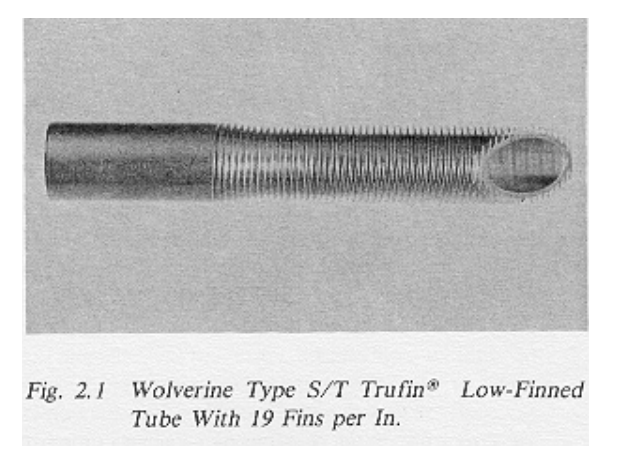

*图 2.1：Wolverine S/T 型 Trufin 低翅片管，每英寸 19 片翅片。*

2. S/T 型 Trufin 中翅片管。S/T 型 Trufin [中翅片管](../../../glossary/terms.md#term-medium-finned-tube)的特点是每英寸 11 片翅片、翅高 1/8 in.，外表面积与内表面积之比约为 5。典型管子见图 2.2。这些管子可以供应带扩口端、适合胀接到管板中的形式，也可以供应最长 3 in. 的光端形式。

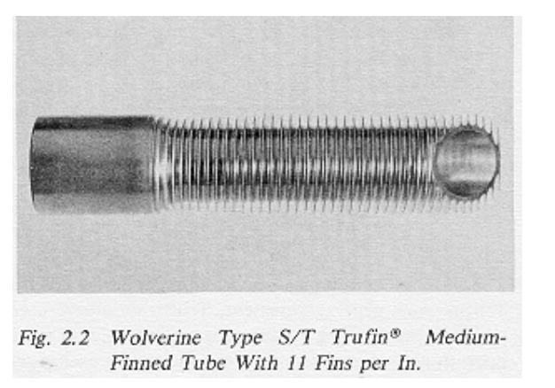

*图 2.2：Wolverine S/T 型 Trufin 中翅片管。*

3. S/T 型 Turbo-Chil 翅片管。图 2.3 所示为 S/T 型 Turbo-Chil 翅片管。这种管形把传统 S/T Trufin 每英寸 19、26 或 40 片翅片所提供的外表面强化，与管内螺旋肋带来的内侧传热系数强化结合在一起。螺旋肋提高了管内流体的湍动程度。

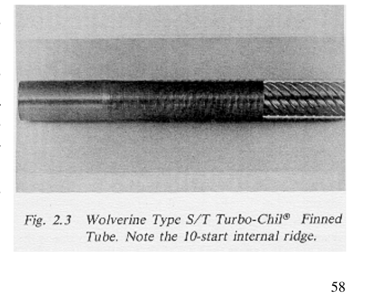

*图 2.3：S/T 型 Turbo-Chil 翅片管，外侧为 Trufin 强化表面，内侧为螺旋肋强化。*

由于 Turbo-Chil 同时强化管内和管外传热，它主要适用于光管两侧传热系数原本量级相近的应用。在这些场合，Turbo-Chil 可显著提高单位管长传热率，并能大幅减少特定工况所需的换热器体积。

Turbo-Chil 的管内传热和压降需要专门的关联式。

## 2.2 Basic Equations for Heat Exchanger Design

## 2.2 换热器设计的基本方程

### 2.2.1 The Basic Design Equation and Overall Heat Transfer Coefficient

### 2.2.1 基本设计方程与总传热系数

适用于管壳式换热器的基本方程已经在第 1 章中建立。这里仅引用那些对[壳侧](../../../glossary/terms.md#term-shell-side)发生显热传热的管壳式换热器设计直接有用的方程。具体地说，本章先限于总传热系数为常数，并且平均温差概念的其他假设也成立的情况。于是基本设计方程为：

原式截图：[eq-2-1-original.png](./assets/eq-2-1-original.png)

$$
Q_T = U^* A^* F(LMTD)
\tag{2.1}
$$

其中，QT 是要传递的总热负荷；U* 是基于面积 A* 的总传热系数；A* 是任何方便选取的传热面积；LMTD 是纯逆流构型的对数平均温差；F 是多管程或多壳程构型修正因子。常见管壳式换热器构型的 F 图将在后文讨论。

U* 最常见的基准面积是 Ao，即包括翅片在内的总管外传热面积。此时总传热系数写作 Uo，它与各侧膜传热系数、管壁热阻等的关系为：

原式截图：[eq-2-2-original.png](./assets/eq-2-2-original.png)

$$
\frac{1}{U_o}
=
\frac{1}{h_o}
+ R_{fo}
+ R_{fin}
+ \frac{\Delta x_w A_o}{k_w A_m}
+ R_{fi}\frac{A_o}{A_i}
+ \frac{1}{h_i}\frac{A_o}{A_i}
\tag{2.2}
$$

其中，ho 和 hi 分别为外侧和内侧膜传热系数；Rfo 和 Rfi 分别为外侧和内侧污垢热阻；Δxw 与 kw 分别为翅片段管壁厚度和管壁导热系数；Rfin 是翅片存在所带来的传热热阻。由于 Wolverine 制造的全部低翅片和中翅片管都是整体成形的，也就是管体和翅片为同一块金属，所以不需要包括接触热阻项。

适用于 ho 和 hi 的关联式将在本章后文给出。污垢热阻通常由客户根据相关流体的运行经验指定；典型值可参见第 1 章表 1.2。

平均管壁传热面积 Am 可用下式给出，精度已足够设计使用：

原式截图：[eq-2-3-original.png](./assets/eq-2-3-original.png)

$$
A_m = \frac{\pi L}{2}(d_i+d_r)
\tag{2.3}
$$

如果希望使用基于[管侧](../../../glossary/terms.md#term-tube-side)内表面积 Ai 的总传热系数，则有：

原式截图：[eq-2-4-original.png](./assets/eq-2-4-original.png)

$$
U_o A_o = U_i A_i
\tag{2.4}
$$

在引用膜传热系数或总传热系数数值时，始终说明其基准面积极其重要。

### 2.2.2 Fin Efficiency and Fin Resistance

### 2.2.2 翅片效率与翅片热阻

翅片效率和翅片热阻的一般概念已经在第 1 章中建立，因此这里仅重申主要方程和概念。

用于式 (2.2) 的 Rfin 为：

原式截图：[eq-2-5-original.png](./assets/eq-2-5-original.png)

$$
R_{fin}
=
\left(
\frac{1-\Phi}{A_{root}/A_{fin}+\Phi}
\right)
\left(
\frac{1}{h_o}+R_{fo}
\right)
\tag{2.5}
$$

其中，Φ 为翅片效率：

原式截图：[eq-2-6-original.png](./assets/eq-2-6-original.png)

$$
\Phi =
\frac{1}{1+\frac{m^2}{3}\sqrt{\frac{d_o}{d_r}}}
\tag{2.6}
$$

其中：

原式截图：[eq-2-7-original.png](./assets/eq-2-7-original.png)

$$
m =
H
\left[
\frac{2}{\left(\frac{1}{h_o}+R_{fo}\right)k_wY}
\right]^{1/2}
\tag{2.7}
$$

同时：

原式截图：[eq-2-8-original.png](./assets/eq-2-8-original.png)

$$
A_{root}
=
\pi d_r L
\left(\frac{s}{s+Y}\right)
=
\pi d_r L N_f s
\tag{2.8}
$$

以及：

原式截图：[eq-2-9-original.png](./assets/eq-2-9-original.png)

$$
A_{fin}
=
\frac{\pi}{2}
(d_o^2-d_r^2)LN_f
\tag{2.9}
$$

对于几乎所有应用，S/T Trufin 的典型翅片效率都高于 0.90；在低翅片 Trufin 最有价值的应用中，翅片效率常接近 1.00。第 1 章已把这些效率作为 1/ho + Rfo 的函数列成图，并按不同 Trufin 材料给出。使用第 1 章图 1.51 和图 1.52，通常可以避免在大多数设计工况中逐项计算式 (2.5) 到式 (2.9)。

### 2.2.3 Mean Temperature Difference, F Factors

### 2.2.3 平均温差与 F 因子

本手册采用平均温差 MTD 形式进行换热器设计。MTD 与对数平均温差 LMTD 的关系为：

原式截图：[eq-2-10-original.png](./assets/eq-2-10-original.png)

$$
MTD = F(LMTD)
\tag{2.10}
$$

LMTD 总是按图 2.4 所示逆流布置定义：

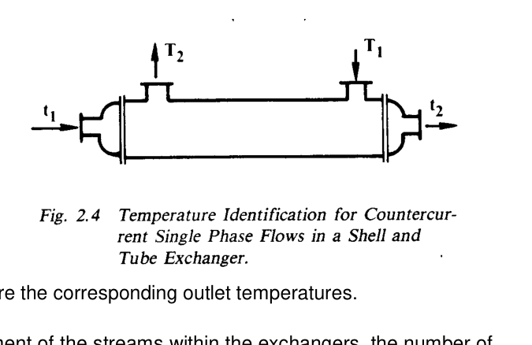

*图 2.4：逆流布置中用于定义 LMTD 的端点温度。*

原式截图：[eq-2-11-original.png](./assets/eq-2-11-original.png)

$$
LMTD =
\frac{(T_1-t_2)-(T_2-t_1)}
{\ln\left[\frac{T_1-t_2}{T_2-t_1}\right]}
\tag{2.11}
$$

对于并流情况，LMTD 写成：

原式截图：[eq-2-12-original.png](./assets/eq-2-12-original.png)

$$
LMTD =
\frac{(T_1-t_1)-(T_2-t_2)}
{\ln\left[\frac{T_1-t_1}{T_2-t_2}\right]}
\tag{2.12}
$$

F 因子通常通过两个无量纲温度参数 R 和 P 查图得到：

原式截图：[eq-2-13-original.png](./assets/eq-2-13-original.png)

$$
R =
\frac{T_1-T_2}{t_2-t_1}
=
\frac{\text{壳侧流体温度变化范围}}
{\text{管侧流体温度变化范围}}
\tag{2.13}
$$

原式截图：[eq-2-14-original.png](./assets/eq-2-14-original.png)

$$
P =
\frac{t_2-t_1}{T_1-t_1}
=
\frac{\text{管侧流体温度变化范围}}
{\text{最大端点温差}}
\tag{2.14}
$$

图 2.5 到图 2.12 给出了常见管壳式换热器布置的 F 因子。使用这些图时应记住，F 越接近 1，构型越接近理想逆流；F 明显降低时，说明所选壳程、管程布置对温差利用不利。工程上通常避免设计 F 过低的换热器。

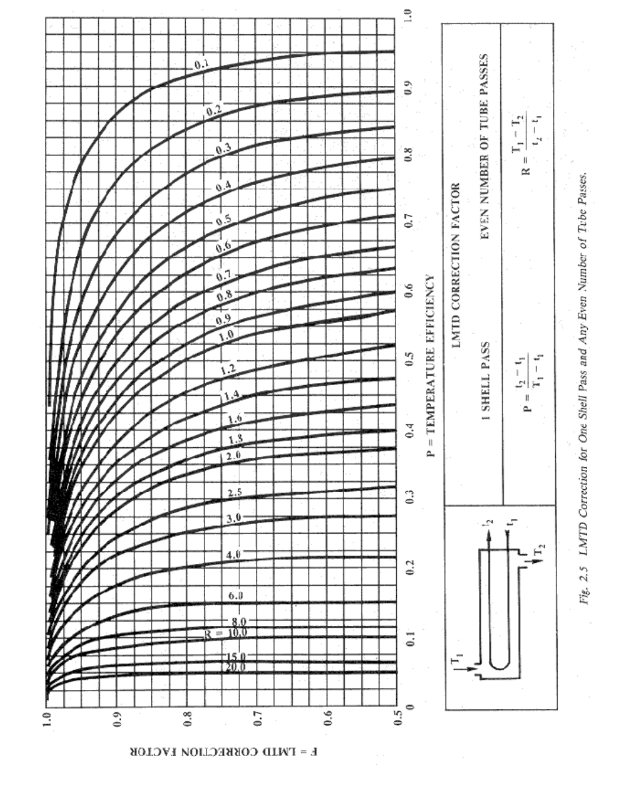

*图 2.5：常见壳管程布置的 F 因子图。*

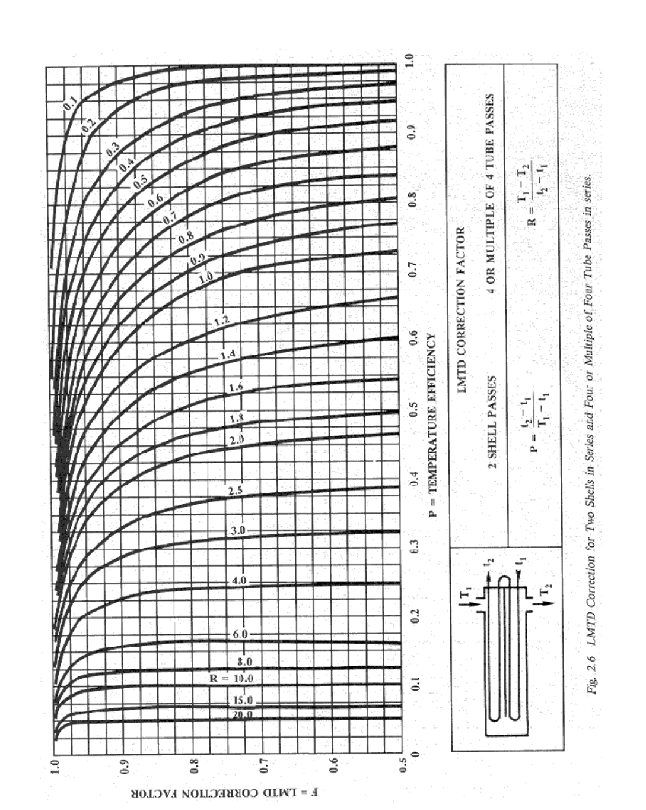

*图 2.6：常见壳管程布置的 F 因子图。*

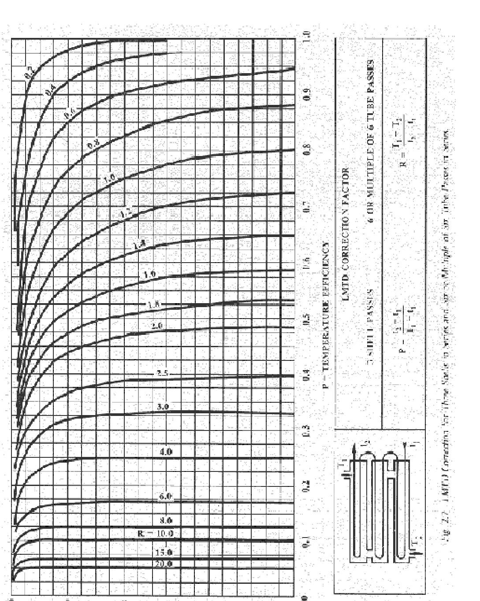

*图 2.7：常见壳管程布置的 F 因子图。*

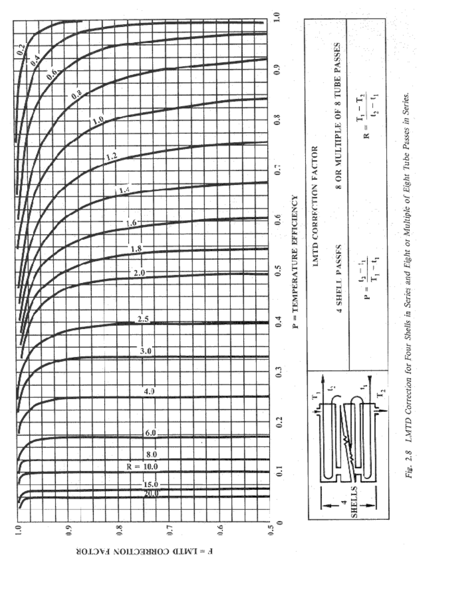

*图 2.8：常见壳管程布置的 F 因子图。*

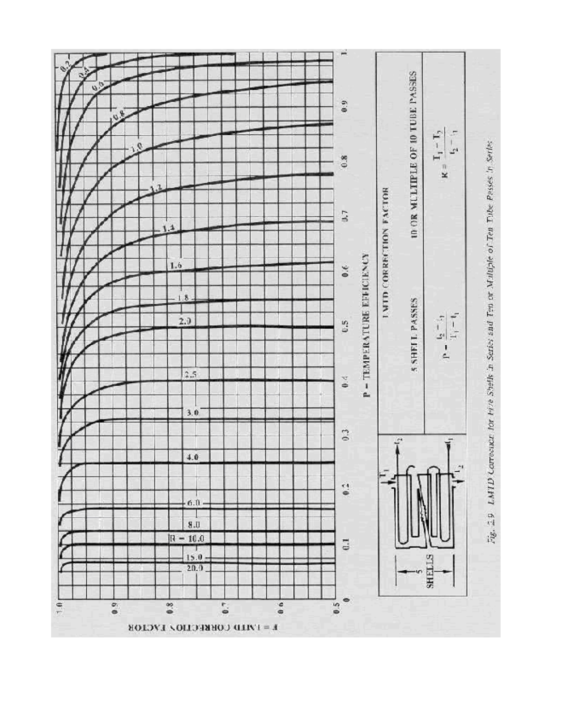

*图 2.9：常见壳管程布置的 F 因子图。*

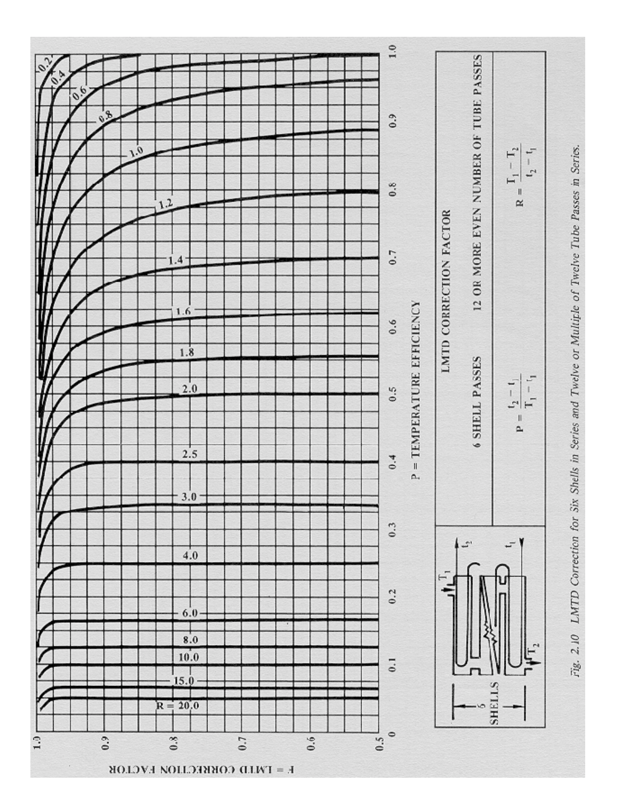

*图 2.10：常见壳管程布置的 F 因子图。*

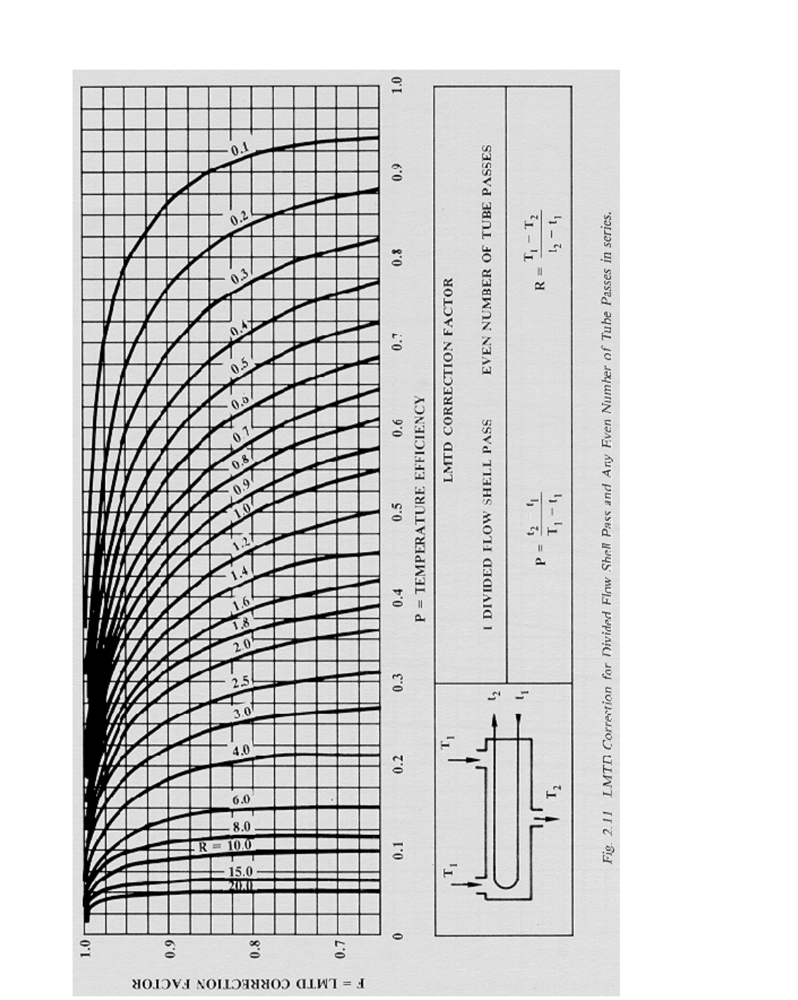

*图 2.11：常见壳管程布置的 F 因子图。*

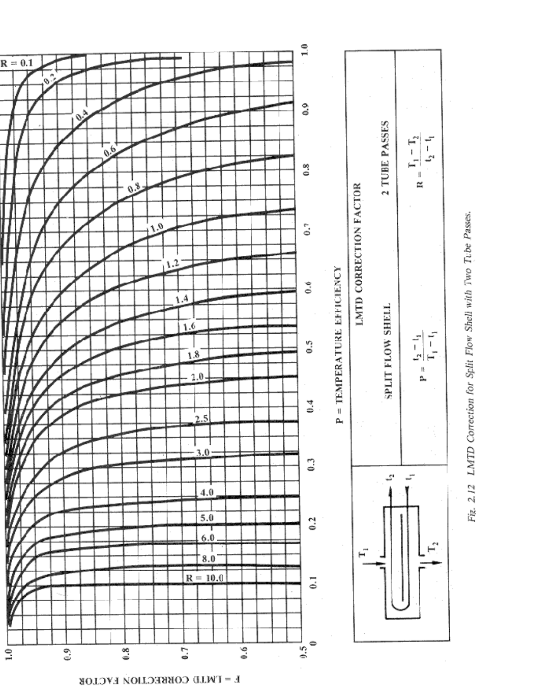

*图 2.12：常见壳管程布置的 F 因子图。*

## 2.3 Heat Transfer and Pressure Drop During Flow Across Banks of Trufin Tubes

## 2.3 横掠 Trufin 管束时的传热与压降

### 2.3.1 Heat Transfer in Trufin Tube Banks

### 2.3.1 Trufin 管束中的传热

使用 S/T 型 Trufin 的折流管壳式换热器，其壳侧传热系数和压降设计方法将在本章后面的例题中详细说明。但是作为该计算不可缺少的基础，必须先有横掠翅片管束的基本传热和流动数据。遗憾的是，公开文献中关于低翅片和中翅片管束的数据很少。不过现有数据表明，只要作小幅修正，就可以使用大量已有的光管管束数据和关联式。

本书采用的数据基础最初来自 Williams 和 Katz；而对当前用途最明确的分析由 Briggs 等完成。后者以 [Delaware 法](../../../glossary/terms.md#term-delaware-method)解释早期数据。后文提出的设计方法是 Delaware 法的修正版，因此数据基础及其纳入设计方法的方式至少是自洽的。

管束传热数据用横流传热 [Colburn j 因子](../../../glossary/terms.md#term-colburn-j-factor)与横流 Reynolds 数的关系来关联。横流 Colburn j 因子定义为：

原式截图：[eq-2-15-original.png](./assets/eq-2-15-original.png)

$$
j_s =
\left(\frac{h_o}{C_pG_m}\right)_s
\left(\frac{C_p\mu}{k}\right)_s^{2/3}
\left(\frac{\mu_w}{\mu}\right)_s^{0.14}
\tag{2.15}
$$

其中，Gm 是相邻管子之间最小自由流通面积处的质量速度：

原式截图：[eq-2-16-original.png](./assets/eq-2-16-original.png)

$$
G_m = \frac{W_s}{S_m}
\tag{2.16}
$$

下标 s 表示壳侧流动。在圆形管束中，Sm 定义为一个横流截面，即相邻折流板之间、靠近管束中心线处的最小自由流通面积。Sm 的计算方法将在本章例题中演示。

翅片管束横流 Reynolds 数定义为：

原式截图：[eq-2-17-original.png](./assets/eq-2-17-original.png)

$$
Re_s = \frac{d_rG_m}{\mu_s}
\tag{2.17}
$$

其中 dr 是翅片管根径。当通过 Delaware 法把 Trufin 换热器数据与其他条件相同的光管换热器比较时，Briggs 等得到的结果如图 2.13 所示，流体包括水、油和甘油。

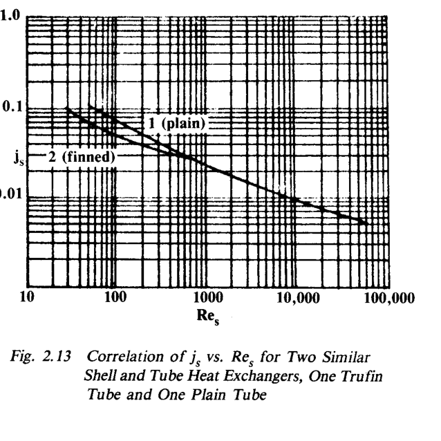

*图 2.13：一个 Trufin 管换热器与一个光管换热器的 js 与 Res 关联比较。*

从图 2.13 可见，当 Res 大于约 500 时，光管管束与 Trufin 管束的 js 曲线基本没有差别。低于 500 时，Trufin 管束相对光管管束的性能下降。Briggs 等将三组不同管束数据综合比较后，绘制了图 2.14，给出了低于 Res = 1000 时翅片管 js 与光管 js 之比。

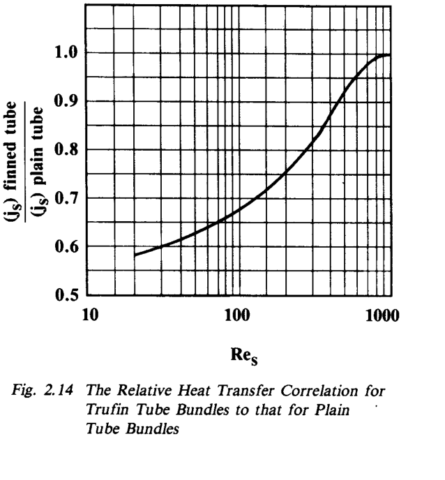

*图 2.14：Trufin 管束与光管管束的相对传热关联。*

在低 Reynolds 数下，翅片似乎倾向于把流体困在翅片之间，降低管间局部速度，从而降低传热系数。需要注意，Briggs 等的数据只包括每英寸 19 片翅片的管子。Rabas 等后来的研究显示，低翅片管束的传热和压降还会受到翅片密度影响。

设计者还应注意，在很低 Res 下，js 比值似乎接近最小值 0.5。由于翅片带来的面积增加总是大于 2 倍，通常更接近 3 或 4 倍，所以在相同 Res 下，与光管相比，hoAo 仍有净增加。

采用上述数据后，就可以为最常见管束几何构型建立基本设计曲线。Delaware 法和后续手册中已经给出了常见管壳式换热器管排布置的 js 与 Res 曲线。将图 2.14 的比值应用到这些曲线上，得到图 2.15 所示的 Trufin 管束基本 js 与 Res 曲线。

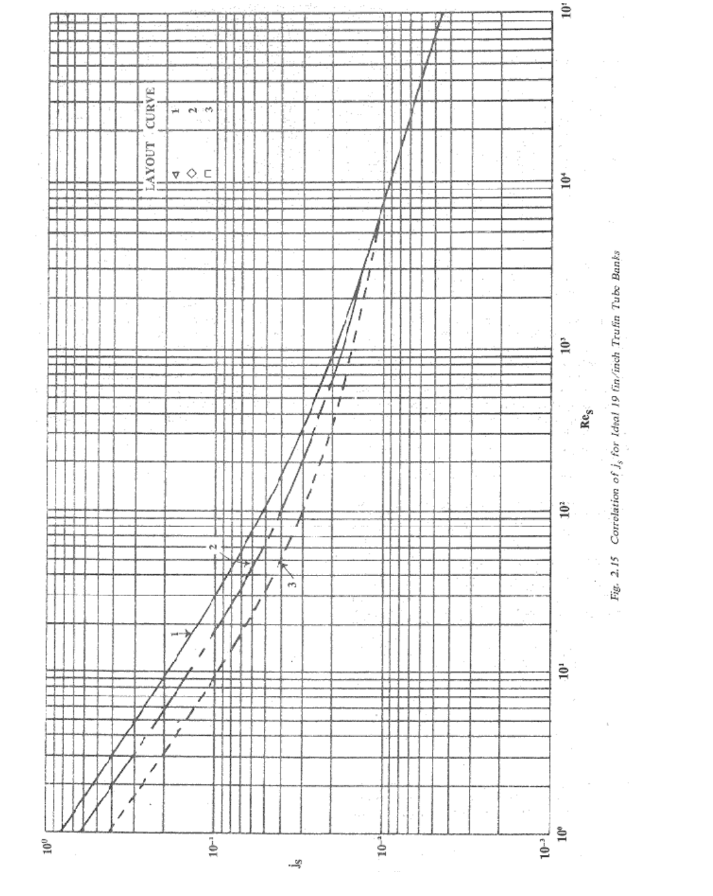

*图 2.15：理想一英寸 Trufin 管束的 js 关联曲线。*

图 2.15 中选择哪条曲线，决定因素是管排布置：等边三角形、旋转正方形或顺列正方形。不同节距比之间会有小差异；节距比是相邻管中心距与管外径之比。但在管壳式换热器常用的 1.2 到 1.5 范围内，这些差异相对于其他影响通常是次要的。

### 2.3.2 Pressure Drop During Flow Across Banks of Low-Finned Trufin Tubes

### 2.3.2 横掠低翅片 Trufin 管束时的压降

S/T 和 W/H 型 Trufin 管束压降关联式的基础与传热关联式基本相同：Briggs 等对 Williams 和 Katz 结果的解释，并结合 Delaware 法。

横流压降的关联量是式 (2.18) 定义的[Fanning 摩擦因子](../../../glossary/terms.md#term-fanning-friction-factor)：

原式截图：[eq-2-18-original.png](./assets/eq-2-18-original.png)

$$
f_s =
\frac{2\Delta P_s g_c \rho_s}
{4N_cG_m^2}
\left(\frac{\mu}{\mu_w}\right)_s^{0.14}
\tag{2.18}
$$

其中，ΔPs 是横掠管束的压降；Gm 由式 (2.16) 定义；Nc 是流体在一个管束中穿过的主要节流排数。对顺列正方形或等边三角形排列，Nc 等于管排数；对旋转正方形排列，Nc 等于管排数减一。黏度梯度项用于考虑非等温效应；ρs 为壳侧流体密度；gc 为重力换算常数。

摩擦因子与式 (2.17) 定义的壳侧或横流 Reynolds 数相关联。图 2.16 给出了该研究中的典型结果。遗憾的是，压降结果不如传热结果那样清楚、令人满意。基本摩擦因子曲线约为原 Delaware 光管管束结果预测值的两倍。不过从图 2.16 可以看出，Trufin 结果与 Briggs 等研究中相应光管管束结果相当接近。

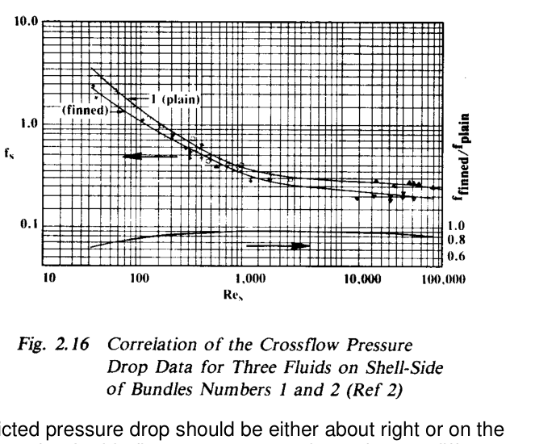

*图 2.16：横掠 Trufin 管束时的摩擦因子数据。*

原因似乎在于，把管壳式换热器压降数据约化为理想管束数据时，各修正因子中隐含的误差最终都会集中到最终结果，也就是 fs 曲线中。事实上，压降预测比传热预测更不确定、精度更差；这一结果并不意外。但它提醒设计者，在建立和使用压降关联式以及解释结果时必须谨慎。

因此，本书建议的关联方式是：把原 Delaware 工作报告的 fs 值在任意给定 Reynolds 数下加倍。这些值见图 2.17。将它们用于 Delaware 法时，预测压降应当大致正确，或者偏保守，偏保守程度可能高达约 2 倍。图 2.17 给出了两种基于管外径的节距比曲线，但不区分管排布置。这一点有推测成分，不过与目前有限信息相一致。

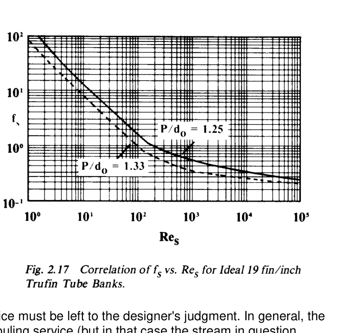

*图 2.17：推荐用于理想一英寸 Trufin 管束的 fs 曲线。*

### 2.3.3 Effect of Fouling on Trufin

### 2.3.3 污垢对 Trufin 的影响

关于翅片表面污垢的数据很少，即便已有数据也相互矛盾。一方面，人们一般认为 Trufin 不应当用于严重结垢工况，因为污垢沉积物可能比在光管上更容易在翅片之间站稳脚跟，并可能完全堵塞表面。另一方面，同样重量、适中数量的污垢材料必须铺展到更大的面积上，因此它对 Trufin 的影响按比例会小于对光管的影响。此外，还发现某些脆性污垢沉积物会在热循环中随管子膨胀和收缩而从 Trufin 上开裂脱落。

总之，某个结垢工况是否应使用 Trufin，最终必须由设计者判断。一般说来，严重结垢工况不使用 Trufin；但在这种情况下，相关流体很可能也应当走管内，以便清洗。对于大多数工况，Trufin 的总沉积量很可能不比光管差，而且由于外侧翅片面积与内侧面积之比高于光管，当考虑所需面积惩罚时，Trufin 具有优势。

## 2.4 Heat Transfer and Pressure Drop Inside Tubes

## 2.4 管内传热与压降

### 2.4.1 Heat Transfer and Pressure Drop in Single Phase Flow Inside Round Tubes

### 2.4.1 圆管内单相流传热与压降

#### 流动状态与传热

管内传热的基本机制已在第 1 章讨论；这里为给出详细的传热系数计算关联式，重复其中若干要点。计算管内传热系数时采用哪个关联式，取决于管内存在的流动状态：层流、湍流或过渡流。对于大多数适合 Trufin 的应用，流动将是湍流；不过仍有必要给出覆盖完整范围的一组关联式。

管内流动状态可通过 Reynolds 数 Rei 判断：

原式截图：[eq-2-19-original.png](./assets/eq-2-19-original.png)

$$
Re_i = \frac{d_i\rho_iV_i}{\mu_i}
\tag{2.19}
$$

其中，di 是翅片段管内径；ρi 和 μi 分别为管内流体密度和黏度；Vi 是翅片段管内平均流速。只要最终结果无量纲，方程中的量可采用任意一致单位制。

如果某一流动的 Rei 小于约 2000，则为层流；但来自管入口或上游泵的扰动可能在管内相当长距离内持续存在。如果 Rei 大于约 10000，则流动为充分发展湍流，并且已有良好的传热关联式。对于 Rei 在 2000 到 10000 之间的情况，传热系数介于层流值和湍流值之间，不能精确预测。这一区域称为过渡流区，通常建议设计者尽量避开。通常可以通过提高速度，例如采用多管程，使流动进入充分发展湍流区。

#### 层流传热

层流区已有多个关联式，最常推荐的是 [Hausen 关联式](../../../glossary/terms.md#term-hausen-correlation)：

原式截图：[eq-2-20-original.png](./assets/eq-2-20-original.png)

$$
\bar{h_i}
=
\frac{k_i}{d_i}
\left[
3.65+
\frac{0.0668Re_iPr_i(d_i/L)}
{1+0.04[Re_iPr_i(d_i/L)]^{2/3}}
\right]
\left(\frac{\mu_i}{\mu_{w,i}}\right)^{0.14}
\tag{2.20}
$$

其中，hi 是单根管整个长度 L 上的平均系数。Pri 是流体 [Prandtl 数](../../../glossary/terms.md#term-prandtl-number)，定义为：

原式截图：[eq-2-21-original.png](./assets/eq-2-21-original.png)

$$
Pr_i = \frac{c_{pi}\mu_i}{k_i}
\tag{2.21}
$$

观察式 (2.20) 可见，平均系数随管长 L 增加而降低。这是层流中不利温度梯度逐步建立的结果。L 应取单管程长度；对于 U 形管束，取管板到弯管切点的直管长度。换言之，回弯或 U 形弯头中强烈二次流会被认为完全破坏了不利温度梯度。hi 对 L 的依赖意味着严格设计计算原则上需要迭代：先估计 L，计算 hi，再用基于该 hi 的面积需求重新计算 L。这个迭代过程通常收敛很快。

手算时，除壁面黏度 μw 外，所有物性按图 2.18 定义的流股平均体温 t 或 T 评价，通常精度已足够。

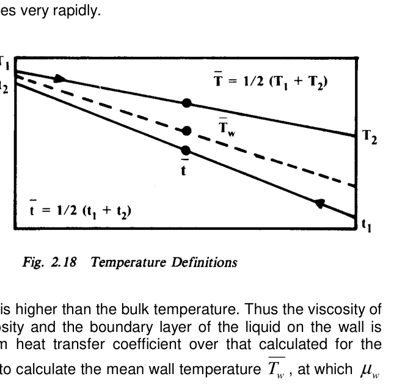

*图 2.18：用于管内传热计算的体温和壁温定义。*

式 (2.20) 末尾的黏度项是所谓 [Sieder-Tate 方程](../../../glossary/terms.md#term-sieder-tate-equation)中的修正项，用于修正主体流体与壁面流体之间黏度差对传热系数的影响。例如，如果液体在管内被加热，则壁面温度以及壁面液体温度高于主体温度。于是壁面液体黏度低于主体黏度，壁面液体边界层更薄，膜传热系数比恒黏度情况略有增加。计算 μw 时采用图 2.18 所示平均壁温即可有足够精度：

原式截图：[eq-2-22-original.png](./assets/eq-2-22-original.png)

$$
\bar{T_w}
=
\bar{t}
+ \frac{U_i}{\bar{h_i}}(\bar{T}-\bar{t})
\tag{2.22}
$$

其中 Ui 基于内表面积计算。

本节计算中引入的一项保守性是，在计算 hi 时忽略自然对流效应。这些效应源于温度梯度造成的密度差，在换热器中几乎总是会提高传热系数，而且温差越大影响越强。但计算这些效应会增加复杂性，通常忽略它们既方便又略偏保守。

#### 湍流传热

当 Rei 大于 10000、流动为充分发展湍流时，最广泛适用的 hi 关联式为 Sieder-Tate 方程：

原式截图：[eq-2-23-original.png](./assets/eq-2-23-original.png)

$$
h_i =
0.023
\frac{k_i}{d_i}
Re_i^{0.8}
Pr_i^{1/3}
\left(\frac{\mu_i}{\mu_{i,w}}\right)^{0.14}
\tag{2.23}
$$

实际上，各资料中前置常数有时取 0.019 到 0.027，0.023 是合理的平均值。设计者在判断计算结果可信度以及应保留多少有效精度时，应考虑这种变动。对于 L/di 小于 60 的情况，入口效应会使平均传热系数略高于式 (2.23) 给出的值；不过大多数换热器远大于该比值，而且忽略这一改善通常是保守的。

对于水这种 Trufin 应用中常见的管侧流体，Eagle-Ferguson 图被认为既便于手算，又比多数方法更准确。该图见图 2.19。注意，速度和内径都应取翅片段管内的值。

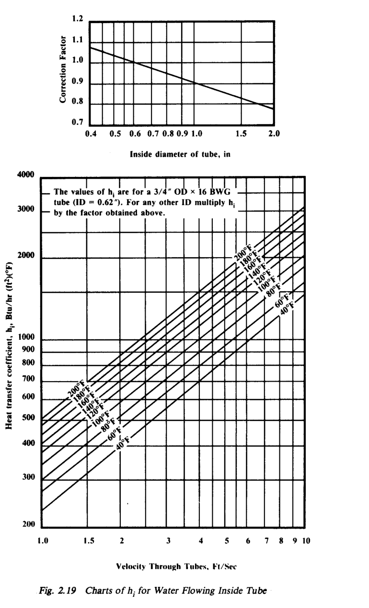

*图 2.19：水在圆管内流动时用于估算管内传热系数的图。*

#### 过渡流传热

当 Rei 在 2000 到 10000 之间时，传热系数很难预测，主要取决于上游流动条件所形成的流动结构。由于层流和湍流之间的水动力不稳定性，还可能发生流动振荡；因此设计者最好尽量避开这个区域。

不过传热系数会被式 (2.20) 和式 (2.23) 所限定。在该范围内，一个合理但不十分精确的步骤如下：

A. 按层流假设，用式 (2.20) 计算 hi。

B. 按湍流假设，用式 (2.23) 计算 hi。

C. 用线性插值估计过渡区值：

原式截图：[eq-2-23A-original.png](./assets/eq-2-23A-original.png)

$$
(h_i)_T
=
\bar{h_i}
+(h_i-\bar{h_i})
\left[
\frac{Re_i-2000}{8000}
\right]
\tag{2.23A}
$$

#### 圆管内压降

换热器管侧压降由几个不同项组成：进出口管嘴压降、封头或通道压降、流体加速并建立管内速度分布所对应的压降，以及管内流动摩擦损失。

管嘴和封头压降通常按若干速度头估算。原书给出以下手算估计：

原式截图：[eq-2-24-original.png](./assets/eq-2-24-original.png)

$$
\Delta P_{noz}
=
\frac{3\rho V_{noz}^2}{2g_c}
\tag{2.24}
$$

原式截图：[eq-2-25-original.png](./assets/eq-2-25-original.png)

$$
\Delta P_{ent}
=
3\left(\frac{\rho V_i^2}{2g_c}\right)
\tag{2.25}
$$

管内摩擦压降为：

原式截图：[eq-2-26-original.png](./assets/eq-2-26-original.png)

$$
\Delta P_i
=
\frac{2f_i\rho_iV_i^2L}{d_ig_c}
\left(\frac{\mu_w}{\mu}\right)_i^{0.14}
\tag{2.26}
$$

图 2.20 给出了管内摩擦因子或压降估算所需的图解资料。实际设计中，管内压降应与允许压降一起检查；如果计算压降远低于允许值，通常可以提高管内速度来改善传热和抑制污垢。

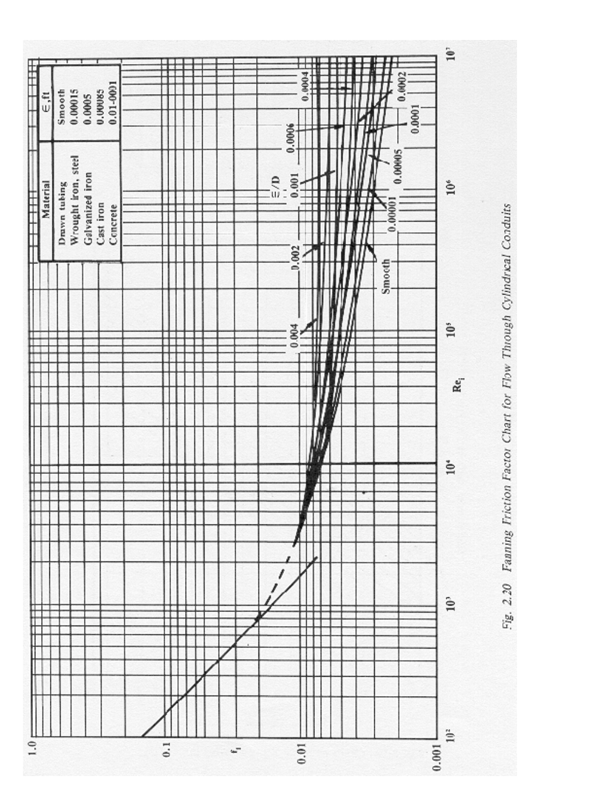

*图 2.20：管内单相流压降估算用图。*

### 2.4.2 Heat Transfer in Two-Phase Flow Inside Tubes

### 2.4.2 管内两相流传热

本章的重点是显热传热，但在许多 Trufin 应用中，管内可能存在冷凝或汽化等两相过程。两相流管内传热比单相流复杂得多，因为流型、相含率、壁面润湿状态以及压降机制都可能沿程变化。

对于水平管内冷凝，本书采用 [Boyko-Kruzhilin 方程](../../../glossary/terms.md#term-boyko-kruzhilin-equation)形式估计平均传热系数：

原式截图：[eq-2-27-original.png](./assets/eq-2-27-original.png)

$$
h_i =
0.024
\frac{k_l}{d_i}
Re_{i,l}^{0.8}
Pr_{i,l}^{0.43}
\left[
\frac{
\sqrt{(\rho_l/\rho_m)_i}
+\sqrt{(\rho_l/\rho_m)_o}
}{2}
\right]
\tag{2.27}
$$

入口和出口处的液体密度与混合物密度比可由质量分数估计：

原式截图：[eq-2-28-original.png](./assets/eq-2-28-original.png)

$$
\left(\frac{\rho_l}{\rho_m}\right)_i
=
1+x_i
\left(\frac{\rho_l}{\rho_v}-1\right)
\tag{2.28}
$$

原式截图：[eq-2-29-original.png](./assets/eq-2-29-original.png)

$$
\left(\frac{\rho_l}{\rho_m}\right)_o
=
1+x_o
\left(\frac{\rho_l}{\rho_v}-1\right)
\tag{2.29}
$$

液相基准 Reynolds 数和质量速度关系可写为：

原式截图：[eq-2-30-original.png](./assets/eq-2-30-original.png)

$$
Re_{i,l}
=
\frac{4W_i}{\pi d_i\mu_l}
\tag{2.30}
$$

原式截图：[eq-2-31-original.png](./assets/eq-2-31-original.png)

$$
h_i =
0.024
\frac{k_l}{d_i}
Re_{i,l}^{0.8}
Pr_{i,l}^{0.43}
\left[
1+x\left(\frac{\rho_l}{\rho_v}-1\right)
\right]^{1/2}
\tag{2.31}
$$

式 (2.31) 是恒定干度气液流的粗略估算形式。对于实际换热设备中的气液混合物流，由于很难保证两相在每根管中均匀分配，这类计算必须被视为高度不确定。

两相沸腾流中的压降很难用适合手算的方法预测。原书在本章不展开复杂两相压降方法，而是把重点放在本章后续的单相壳侧显热设计方法上。

## 2.5 Preliminary Design of Shell and Tube Heat Exchangers

## 2.5 管壳式换热器的初步设计

### 2.5.1 Basic Principles of Design

### 2.5.1 设计基本原则

如果只作宽泛表述，工艺换热器必须满足的标准并不复杂。

第一，换热器当然必须满足工艺要求。它必须在允许压降范围内，使工艺流股达到期望的热状态改变，并且必须能够持续做到这一点，直到工厂下一次计划检修停机。

第二，换热器必须承受装置环境中的服役条件。这包括安装、开车、停车、正常运行、紧急状况和维护中的机械应力，也包括由温差引起的热应力。它还必须抵抗工艺流体和公用工程流体以及环境造成的腐蚀；这通常主要取决于材料选择，但机械设计也有影响。理想情况下，换热器还应尽量抗污垢，不过设计者在这方面能够有把握采取的措施并不多，除非在压降和振动限制允许范围内尽可能提高流速。

第三，换热器必须可维护。这通常意味着选择一种允许清洗的构型，包括管侧清洗和壳侧清洗，具体取决于工况，并允许更换特别容易受腐蚀、冲蚀或振动影响的管子及其他部件。这个要求也可能限制换热器布置位置，并要求周围留出清理空间。

第四，在满足上述要求的前提下，换热器成本应尽量低。在当前语境中，成本指初投资或安装成本；运行成本以及因换热器不可用导致的生产损失，已经在前面更重要的标准中隐含考虑。

最后，现场条件、吊装和维护能力或库存考虑可能会限制换热器直径、长度、重量以及管子规格。

有时会说，换热器设计最好考虑未来在其他应用中的替代用途。但这包含令人不安的含义。多数换热器服务于预计寿命五到二十年的项目，这一寿命等于或长于换热器可能寿命。暗示某台换热器可能提前空出来，实际上意味着换热器或工艺过程可能不能令人满意地履行其角色。因此，更好的设计态度是：每一台设备都应被唯一地设计为在当前任务中取得最佳表现，而不是为假想再利用牺牲当前任务。

图 2.21 给出了工艺换热器设计流程的基本逻辑结构。不论采用手算还是计算机设计，基本结构都是一样的。

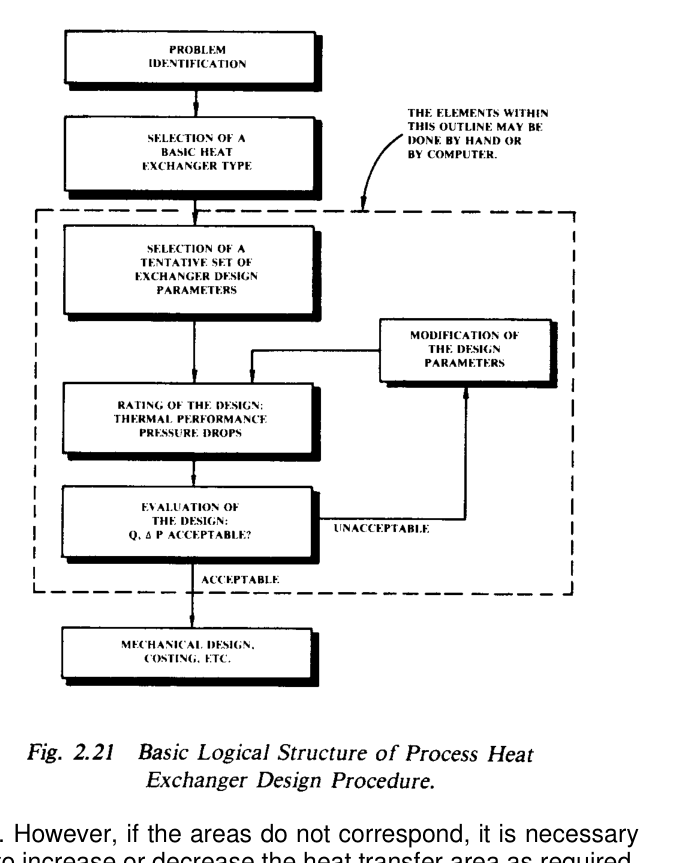

*图 2.21：工艺换热器设计流程的基本逻辑结构。*

首先，必须尽可能完整、明确地识别问题。这包括流量、压力、温度和组成等数据，也包括结垢可能性、清洗难度、特殊材料要求以及运行中可能遇到的异常条件等定性信息。

设计过程中最重要的单个决策就在此时作出：选择换热器基本构型，例如双套管、管壳式、板式等。

下一步是为换热器选择一组暂定主要参数：管型、尺寸、排列、壳径、长度、折流板间距等。本章后文将给出这种初步选择程序。

然后，用本章后文给出的方法对暂定构型进行热力校核。也就是说，对所选设计中的给定流量计算总传热系数；把该值与所需热负荷和计算出的平均温差结合，得到所需换热面积。最后，将所需面积与所选设计可提供的面积比较。如果计算面积与可用面积相当接近，则从热工角度看该换热器可以接受，可继续进行压降计算。若两者不相符，则需要调整暂定构型参数，以按需要增加或减少传热面积，然后重新校核新构型。压降计算中，每股流体的压降必须小于允许值，但也不应远小于允许值。如果计算压降远低于允许值，通常说明可以减小换热器尺寸。

当热工性能要求和压降限制均满足后，才进入机械设计和成本估算。本手册不包括这些阶段。

### 2.5.2 Preliminary Design Decisions

### 2.5.2 初步设计决策

#### 流股分配

选定管壳式换热器后，设计者下一步必须决定哪股流体走管内，哪股流体走壳内。若干因素会控制这个决定，最重要的包括以下几项：

a. 是否可能使用扩展表面管。正如前文反复强调的，当一股流体传热系数显著低于另一股时，使用 Trufin 通常有利。在这种情况下，应将低传热系数流体分配到壳侧。

b. 一股流体高度腐蚀。处理腐蚀性流体的办法是使用耐该流体腐蚀的合金。由于所有耐腐蚀合金都相对昂贵，因此腐蚀性物质应走管内。这样只有管子、管板以及管侧封头和管道需要采用合金，壳体、折流板、拉杆等可以采用低碳钢，从而显著节省成本。

c. 一股流体处于高压。如果一股流体压力远高于另一股，应让其走管内。只有管侧部件需要按高压建造，特别是不需要使用厚重昂贵的高压壳体。

d. 一股流体严重结垢。由于管侧比壳侧更易用机械方法清洗，如刷洗、水射流等，结垢更严重的流体应走管内。

e. 如果一股流体允许压降非常有限，它通常应走壳侧。尽管壳侧把压降转化为传热系数的效率没有管侧高，因为存在形状阻力，但壳侧设计参数的选择通常有更大灵活性，更容易满足低压降限制。

这些规则之间显然经常会发生冲突。例如，一股流体可能高压，另一股可能严重腐蚀。在这种情况下，决策可能必须延后，直到两种方案都完成设计并估算成本。一般会选择低成本方案，但安全性或运行可靠性差异可能压倒单纯经济判断。

#### 壳型选择

选择壳型时最重要的因素是热应力问题。如第 1 章所述，热应力产生于管子平均温度与壳体平均温度不同，由此造成的热膨胀差可能导致多种灾难性事件：管子可能从管板中被拉出，管子可能被拉断或屈曲，壳体可能屈曲，管板也可能变形到足以使垫片处泄漏。

判断是否存在严重热应力问题是复杂计算，这里只能给出几条经验规则：

a. 没有专门布置来释放或避免热应力的固定管板换热器，只能在两股流体入口温差小于约 100 °F 时使用。

b. 壳体带滚制膨胀节的固定管板换热器，在中等压力壳体中可用于入口温差高达约 200 °F 的情况。低压薄壁壳体中，膨胀节曾用于更高入口温差。

c. 在可使用时，U 形管束基本解决了管子热应力问题，因为每根管都可相对壳体以及在相当范围内相对其他管子自由膨胀或收缩。不过管板热应力问题并未完全解决，仍需进一步分析。

各类浮头壳体设计的相对优缺点已在第 1 章讨论，这里不再展开。但大多数浮头设计都有多管程，需要对 LMTD 使用构型修正因子。

#### 壳体组合方式

完成某一换热任务时，经常需要不止一台换热器。两种基本布置是并联和串联。

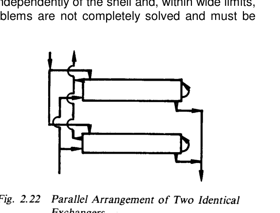

*图 2.22：两台相同换热器的并联布置。*

并联布置主要用于压降限制与长度、直径和折流板间距限制共同迫使壳侧速度降低、单台处理量降低的情况。对于相同设备，每台换热器可按其承担的流量比例单独分析。

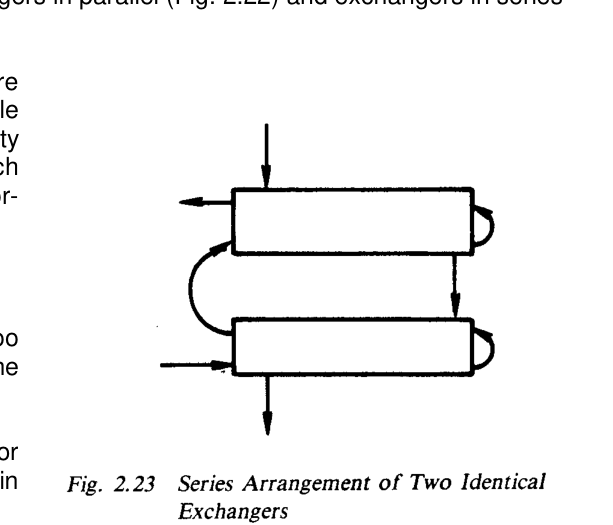

*图 2.23：两台相同换热器的串联布置。*

纯串联布置主要适用于两种情况：其一，单壳多管程导致 F 值过低；其二，壳长或壳径受限，必须把总面积分配到多个壳体中。为制造经济性以及安装、操作和维护灵活性，串联壳体通常做成相同设备。

串并联组合形式可以有无限多种。最常见的是若干换热器列并联，每一列由若干换热器串联组成。并联用于把总流量分到可由最大可接受换热器尺寸处理的流量，串联用于改善平均温差。可分析单个列承担的总流量比例，再用并联列数放大得到总服务能力。

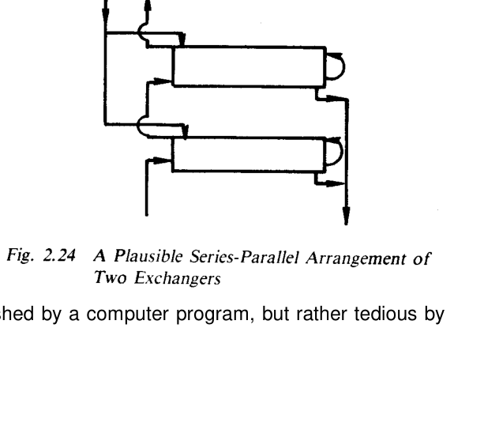

*图 2.24：一种可能的两台换热器串并联布置。*

图 2.24 给出了一种不太常见的串并联布置。如果壳侧流体有严重压降限制而需要并联流动，同时其温度只需在较窄范围内改变；而管侧流体流量较低，因而倾向于采用多个管程以保持速度，此类布置可能值得考虑。需要注意，两台壳体将有不同出口温度，因此两股出流混合时会有一定效率损失。一般来说，混合串并联布置需要对每台换热器的热平衡和传热方程进行试算；计算机程序容易完成，手算多个壳体则相当繁琐。

### 2.5.3 Procedure for Approximate Size Estimation

### 2.5.3 近似尺寸估算程序

#### 热负荷 Q 的计算

对于通常设计情况，已给出或可选定足够数据来计算 Q 和 MTD。壳侧显热传热的 Q 为：

原式截图：[eq-2-32-original.png](./assets/eq-2-32-original.png)

$$
Q = W_sC_{ps}\Delta T
\tag{2.32}
$$

管侧显热传热的 Q 为：

原式截图：[eq-2-33-original.png](./assets/eq-2-33-original.png)

$$
Q = w_ic_{pi}\Delta t
\tag{2.33}
$$

#### MTD 的计算

可由式 (2.11) 通过端点温差直接计算 LMTD。对于初步设计，也可在几个百分点精度内估算 LMTD；LMTD 总是小于算术平均温差，其差距大致与较大端点温差和较小端点温差之比有关。

F 值也可由端点温度计算，并根据构型使用图 2.5 到图 2.12 查取。对于多管程设计的初步设计，F 可估为 0.9，这是最大可能值 1.0 与最小推荐值 0.8 之间的平均。若端点温差比接近 1，可取稍高；若出口流体温度相近，可取稍低。后一种情况下，特别是发生温度交叉时，应先检查设计的热力学可行性。

原书给出可快速检查的绝对限制：

原式截图：[eq-2-34-original.png](./assets/eq-2-34-original.png)

$$
t_2 \le 2T_2-t_1
\quad
\text{管侧加热}
\tag{2.34}
$$

原式截图：[eq-2-35-original.png](./assets/eq-2-35-original.png)

$$
t_2 \le 2T_2-t_1
\quad
\text{管侧冷却}
\tag{2.35}
$$

其中，t2 是管侧出口温度，t1 是管侧入口温度，T2 是壳侧出口温度。原书式 (2.34) 与式 (2.35) 均给出同一不等式，分别作为管侧加热和管侧冷却时的快速热力学可行性检查；译文按原式保留。

当需要多壳串联时，例如进料-出料换热器中两股流体要在较宽温度范围内换热，有一种快速图解方法可估计足够的串联壳体数。程序如图 2.25 所示：

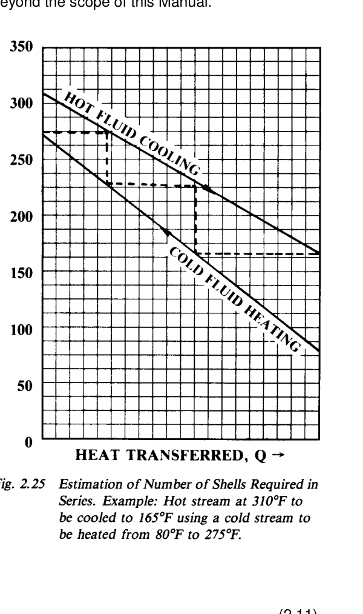

*图 2.25：用运行线图估计足够串联壳体数。*

a. 把两股流体的端点温度画在普通算术坐标纸的纵坐标上。左侧纵坐标放热流体入口温度和冷流体出口温度；右侧纵坐标放热流体出口温度和冷流体入口温度。两个纵坐标之间距离任意，代表两股流体间交换的总热量，可按使用者方便选取。

b. 如果每股流体比热为常数，则从每股流体入口温度点到出口温度点画直线，即运行线。如果一股或两股流体比热随温度变化，则必须计算该流体温度随另一股流体加入或移除热量的变化，运行线会变成曲线。这种情况下，寻找足够串联壳体数的图解方法仍有效，但平均温差概念不再成立。精确设计程序超出本手册范围。

c. 从冷流体出口温度开始作水平线，直到与热流体线相交；再从该点向下作垂线到冷流体线。这个过程定义了一台换热器操作，其中热流体温度从不低于冷流体达到的任何温度，即没有温度交叉，因此知道单壳完成这段操作不会出现热力学困难。

d. 重复该过程，直到某条垂线与冷流体运行线相交于冷流体入口温度或低于它的位置；或者等效地，继续直到某条水平线穿过右侧纵坐标。

e. 水平线的数量，包括与右侧纵坐标相交的那条，等于明显足以完成该任务的串联壳体数。图中例题为三台。

图 2.25 中的例子还给出若干量化感受：整体 LMTD 约为 56.4 °F；三壳串联可得到可接受 F 值。若壳体数过少，F 会过低，甚至接近不可行。

#### 面积估算

所需面积按下式估算：

原式截图：[eq-2-36-original.png](./assets/eq-2-36-original.png)

$$
A_o = \frac{Q}{U_oMTD}
\tag{2.36}
$$

对于近似设计，所需外表面积还需用若干因子修正：

原式截图：[eq-2-37-original.png](./assets/eq-2-37-original.png)

$$
A'_o = A_oF_1F_2F_3F_4
\tag{2.37}
$$

这些因子用于反映单元格、管程数、管束结构和管子强化表面对粗略尺寸估计的影响。图 2.26 和表 2.1 到表 2.5 是初步估算的核心资料。

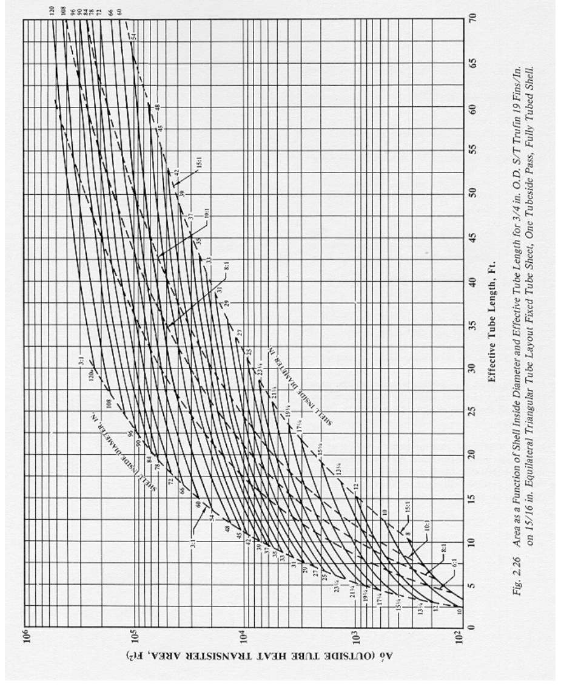

*图 2.26：由面积、壳径、管子布置等估计换热器尺寸的辅助图。*

表 2.1 给出了 Trufin 管换热器典型总设计传热系数。表中 Uo 和总污垢热阻均基于包括翅片在内的总管外面积。

[表 2.1 原表截图](./assets/table-2-1-original.png)

表 2.1 的一般说明包括：水溶液可近似按水处理；液氨结果与水相近；轻质有机液体通常指黏度小于约 0.5 cP 的液体；中等有机液体约为 0.5 到 1.5 cP；重质有机液体约大于 1.5 cP 但不超过 50 cP；非常重的有机液体如焦油、沥青、聚合物熔体、润滑脂等，估算不确定且常因污垢特性使翅片管不明智。

表 2.1 的典型 Uo 范围如下，单位为 Btu/hr ft2 °F，总污垢热阻单位为 hr ft2 °F/Btu。

| 管侧流体 | 壳侧流体 | 总污垢热阻 | Uo |
|---|---|---:|---:|
| 水 | 约 10 psig 气体 | 0.002 | 15-20 |
| 水 | 约 100 psig 气体 | 0.002 | 25-35 |
| 水 | 约 1000 psig 气体 | 0.002 | 50-75 |
| 水 | 轻质有机液体 | 0.0025 | 70-120 |
| 水 | 中等有机液体 | 0.003 | 50-80 |
| 水 | 重质有机液体 | 0.0035 | 30-65 |
| 水 | 非常重有机液体，冷却 | 0.005 | 5-30 |
| 冷凝蒸汽 | 约 10 psig 气体 | 0.0005 | 15-20 |
| 冷凝蒸汽 | 约 100 psig 气体 | 0.0005 | 25-40 |
| 冷凝蒸汽 | 约 1000 psig 气体 | 0.0005 | 60-85 |
| 冷凝蒸汽 | 轻质有机液体 | 0.001 | 100-150 |
| 冷凝蒸汽 | 中等有机液体 | 0.0015 | 75-130 |
| 冷凝蒸汽 | 重质有机液体 | 0.002 | 50-85 |
| 冷凝蒸汽 | 非常重有机液体 | 0.0035 | 10-40 |
| 轻质有机液体 | 轻质有机液体 | 0.0017 | 60-90 |
| 轻质有机液体 | 中等有机液体 | 0.0022 | 40-70 |
| 轻质有机液体 | 重质有机液体 | 0.0027 | 25-55 |
| 轻质有机液体 | 非常重有机液体 | 0.0042 | 5-25 |
| 中等有机液体 | 重质有机液体 | 0.0037 | 20-40 |
| 中等有机液体 | 非常重有机液体 | 0.0055 | 5-25 |

表 2.2 给出各种单元格的 F1；表 2.3 给出不同管程数的 F2；表 2.4 给出不同管束结构的 F3；表 2.5 给出不同管子面积强化的 F4。这些表用于快速估算，不应替代后续详细热工和压降校核。

[表 2.2 原表截图](./assets/table-2-2-original.png)

[表 2.3 原表截图](./assets/table-2-3-original.png)

[表 2.4 原表截图](./assets/table-2-4-original.png)

[表 2.5 原表截图](./assets/table-2-5-original.png)

原书用空气压缩机中冷器例子说明初步估算过程：冷却 13000 SCFM 的空气，从 350 °F 冷却到 125 °F，空气质量流量约 58500 lb/hr，冷却水从 80 °F 升到 110 °F。首先计算热负荷：

$$
Q=(58500)(0.241)(350-125)
=3.172\times 10^6\ \mathrm{Btu/hr}
$$

假定水出口温度为 110 °F，则：

$$
LMTD =
\frac{(350-110)-(125-80)}
{\ln\left[\frac{350-110}{125-80}\right]}
=116.5^\circ\mathrm{F}
$$

由端点温度可得 P = 0.111，R = 7.5，查图 2.5 得 F = 0.91，因此 MTD = 106 °F。由表 2.1 估计 Uo 约为 25 Btu/hr ft2 °F，则：

$$
A_o =
\frac{3.172\times 10^6}{(25)(106)}
=1197\ \mathrm{ft^2}
$$

由于图 2.26 的基准为 3/4 in. 外径、15/16 in. 三角形节距、19 翅片/in. 的 S/T Trufin、固定管板和单管程，还必须按表 2.2 到表 2.5 修正。对本例，F1 = 1.14，F2 = 1.06，F3 = 1.08，F4 = 0.79，因此进入图 2.26 的有效面积为：

$$
A'_o =
(1197)(1.14)(1.06)(1.08)(0.79)
=1234\ \mathrm{ft^2}
$$

从图 2.26 可知，这一面积可以由几种壳径和长度组合容纳：15 1/4 in. 壳内径配约 12 ft 管长，17 1/4 in. 壳内径配约 10 ft 管长，或 19 1/4 in. 壳内径配约 8 ft 管长。后续 2.7.1 会对其中一种方案作详细 Delaware 法校核。

## 2.6 Delaware Method for Shell-Side Rating of Shell and Tube Heat Exchangers

## 2.6 管壳式换热器壳侧校核的 Delaware 法

### 2.6.1 Introduction

### 2.6.1 引言

用于计算管壳式换热器壳侧单相流体传热系数和压降的 Delaware 法，基于 1946 年到 1963 年美国 Delaware 大学化学工程系开展的大量实验和分析研究。本书给出的步骤是在原方法基础上修订而来，并结合前文讨论，按照 Briggs 等的处理进一步修改以适用于 Trufin 管。

Delaware 法假定壳侧流体的流量、入口和出口温度已经指定；对气体或蒸汽，还需压力。壳侧流体的密度、黏度、导热系数和比热已知，或可作为温度函数合理估计。该法还假定已知或指定以下最小壳侧几何数据：

- 管根径和外径 dr、do。
- 翅片间距和厚度 s、Y。
- 管子几何排列，即单元格。
- 壳体内径 Di。
- 壳体外管限直径 Dotl。
- 有效管长 L，即管板之间长度。
- 折流板切口，折流板尖端到壳体内表面的距离 lc。
- 折流板间距，即面到面距离 ls。
- 每侧密封条数量 Nss。

由这些几何信息，可以用本节方法计算或估计壳侧计算所需的其余几何参数。如果有额外具体信息，例如管-折流板间隙，则可在计算中使用精确值，通常能改善精度。

为了完成管壳式换热器校核，还必须用前文方法计算管侧传热和压降特性。

不是所有流量和温度都能独立指定，它们通过换热器热平衡相互联系。同样，总传热方程 Q = UA(MTD) 也必须满足。按本设计方法计算出的 U 很可能不等于由热平衡和传热方程所需的 U。如果是在设计一台用于指定工况的换热器，出现这种情况时必须改变一个或多个几何参数，管长尤其常用，因为改变管长不必完全重新计算传热系数，直到计算性能与所需性能基本一致。如果是在校核已有换热器，则计算性能与所需性能不一致只能通过改变流量或端点条件来解决。

最后应记住，尽管 Delaware 法似乎是公开文献中总体最好的方法之一，但即便用于光管也并非特别精确。HTRI 的广泛研究将各方法与大量传热和压降数据比较，结果显示该方法预测壳侧传热系数可能低估约 50% 到高估约 100%；压降范围可能从低估约 50% 到高估约 200%。传热平均误差在所有 Reynolds 数范围内约为低估 15%，即偏保守；而压降平均误差在 Reynolds 数高于 1000 时约低估 5%，在 Reynolds 数低于 10 时约高估 100%。

使用下列方程和图时必须非常注意单位。用于几何参数估计的图和方程采用美国工程中常用单位；但用于传热系数和压降计算的方程要求量纲一致。因此，在给出最终答案单位前，最好检查每个方程使用的单位。

### 2.6.2 Calculation of Shell-Side Geometrical Parameters

### 2.6.2 壳侧几何参数计算

1. 换热器总管数 Nt。如果不能直接计数，可由表 2.6 根据壳体内径 Di、管距 p 和排列方式查取。表中管数针对固定管板、满布管束。若要估算其他管束结构的管数，可用表 2.4 的 F3 去除表 2.6 中管数。

[表 2.6 原表第 1 页](./assets/table-2-6-page-1-original.png)

[表 2.6 原表第 2 页](./assets/table-2-6-page-2-original.png)

[表 2.6 原表第 3 页](./assets/table-2-6-page-3-original.png)

[表 2.6 原表第 4 页](./assets/table-2-6-page-4-original.png)

2. 平行于流动方向的管距 pp 与垂直于流动方向的管距 pn。这些量主要用于估算其他参数。如果有详细图纸或可检查设备，最好直接计数或计算其他参数。管距定义见图 2.27，若干值列于表 2.7。

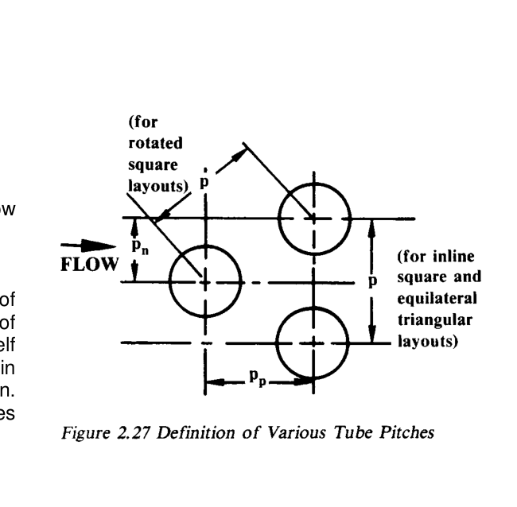

*图 2.27：平行流向管距和垂直流向管距定义。*

[表 2.7 原表截图](./assets/table-2-7-original.png)

3. 一个横流区中穿过的管排数 Nc。可由换热器图纸计数，或估算为：

原式截图：[eq-2-38-original.png](./assets/eq-2-38-original.png)

$$
N_c =
\frac{D_i}{p_p}
\left[
1-2\left(\frac{l_c}{D_i}\right)
\right]
\tag{2.38}
$$

这是相邻折流板尖端之间的管排数，尖端处每排按半排计。

4. 总管数中处于横流区的分数 Fc：

原式截图：[eq-2-39-original.png](./assets/eq-2-39-original.png)

$$
F_c =
\frac{1}{\pi}
\left[
\pi
+2\frac{D_i-2l_c}{D_{otl}}
\sin\left(
\cos^{-1}\frac{D_i-2l_c}{D_{otl}}
\right)
-2\cos^{-1}\left(
\frac{D_i-2l_c}{D_{otl}}
\right)
\right]
\tag{2.39}
$$

角度均以弧度计。为了方便，图 2.28 已把 Fc 按折流板切口百分比和壳体直径 Di 作成图。对于穿透式浮头或其他壳体内径与外管限之间间隙较大的设计，Fc 会略高于图示值。

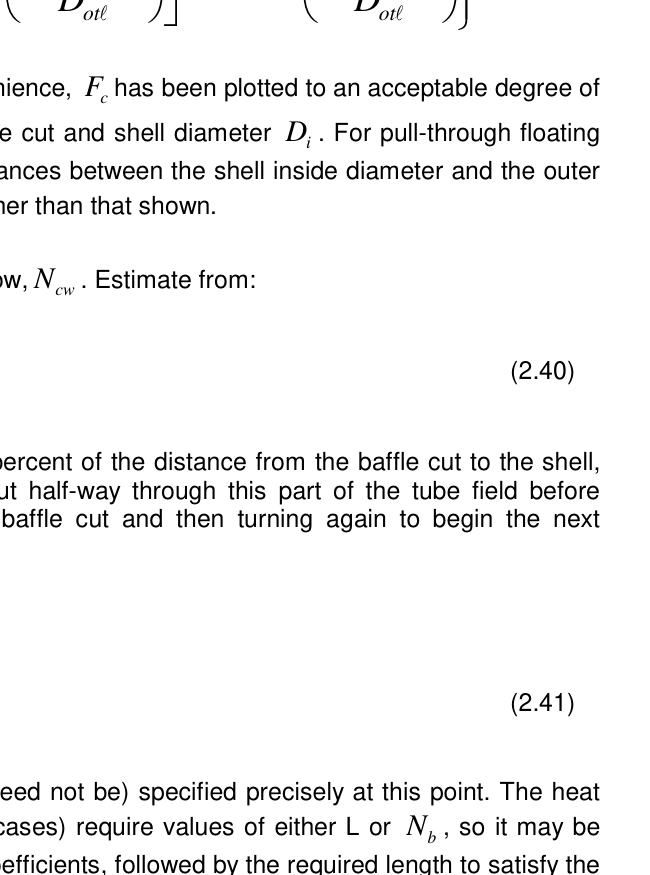

*图 2.28：估算处于横流区的管数分数 Fc。*

5. 每个窗口区有效横流管排数 Ncw：

原式截图：[eq-2-40-original.png](./assets/eq-2-40-original.png)

$$
N_{cw}=0.8\frac{l_c}{p_p}
\tag{2.40}
$$

该式假定管场覆盖从折流板切口到壳体之间距离的约 80%，并且流动平均穿透该部分管场约一半后转向，穿过折流板切口并再次转向进入下一横流区。

6. 折流板数 Nb：

原式截图：[eq-2-41-original.png](./assets/eq-2-41-original.png)

$$
N_b = \frac{L}{l_s}-1
\tag{2.41}
$$

在设计程序中，此时长度未必已精确指定，也未必需要精确指定。多数情况下，传热系数计算不需要 L 或 Nb，因此可先计算壳侧和总传热系数，再由热工要求计算所需长度。随后把长度调整为整数个折流间距，再用于计算 Nb 和压降。如果压降超过允许值，或低到表明较小壳径可能足够，则可能还要选择新壳径并重新开始。

7. 一个横流区在中心线附近的横流面积 Sm。旋转正方形和顺列正方形排列用式 (2.42) 估算：

原式截图：[eq-2-42-original.png](./assets/eq-2-42-original.png)

$$
S_m =
l_s
\left[
D_i-D_{otl}
+\frac{D_{otl}-d_o}{p_n}
\left(
p-d_o+2H\frac{s}{s+Y}
\right)
\right]
\tag{2.42}
$$

三角形排列用式 (2.43)：

原式截图：[eq-2-43-original.png](./assets/eq-2-43-original.png)

$$
S_m =
l_s
\left[
D_i-D_{otl}
+\frac{D_{otl}-d_o}{p}
\left(
p-d_o+2H\frac{s}{s+Y}
\right)
\right]
\tag{2.43}
$$

8. 可用于[旁路流](../../../glossary/terms.md#term-bypass-flow)的横流面积分数 Fsbp：

原式截图：[eq-2-44-original.png](./assets/eq-2-44-original.png)

$$
F_{sbp}
=
\frac{(D_i-D_{otl})l_s}{S_m}
\tag{2.44}
$$

这是最外排管子与壳体之间的面积，可能成为流体大量绕过传热表面的主要通道。对于壳体与外管限之间间隙较大的结构，几乎必须用密封装置阻断这股流动。

9. 单块折流板的管-折流板泄漏面积 Stb：

原式截图：[eq-2-45-original.png](./assets/eq-2-45-original.png)

$$
d_o=5/8\ \mathrm{in.}:
\quad
S_{tb}=0.0152N_t(1+F_c)\ \mathrm{in.^2}
\tag{2.45}
$$

原式截图：[eq-2-46-original.png](./assets/eq-2-46-original.png)

$$
d_o=3/4\ \mathrm{in.}:
\quad
S_{tb}=0.0184N_t(1+F_c)\ \mathrm{in.^2}
\tag{2.46}
$$

原式截图：[eq-2-47-original.png](./assets/eq-2-47-original.png)

$$
d_o=1\ \mathrm{in.}:
\quad
S_{tb}=0.0245N_t(1+F_c)\ \mathrm{in.^2}
\tag{2.47}
$$

这些值基于 TEMA R 级结构，标准管-折流板直径间隙为 1/32 in.。如果指定超紧或较松结构，或预计污物堵塞，应修正这些值。

10. 单块折流板的壳-折流板泄漏面积 Ssb。若已知折流板外缘与壳体内径之间的直径间隙 δsb，则：

原式截图：[eq-2-48-original.png](./assets/eq-2-48-original.png)

$$
S_{sb}
=
\frac{D_i\delta_{sb}}{2}
\left[
\pi-\cos^{-1}\left(1-2\frac{l_c}{D_i}\right)
\right]
\tag{2.48}
$$

壳-折流板泄漏面积也可用图 2.29 估算。

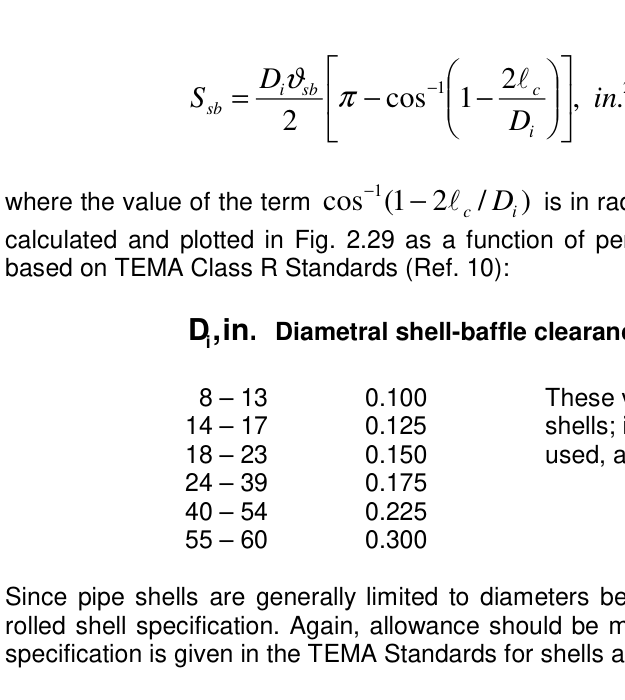

*图 2.29：壳-折流板泄漏面积 Ssb 的估算图。*

11. 窗口流通面积 Sw：

原式截图：[eq-2-49-original.png](./assets/eq-2-49-original.png)

$$
S_w = S_{wg}-S_{wt}
\tag{2.49}
$$

其中，毛窗口面积为：

原式截图：[eq-2-50-original.png](./assets/eq-2-50-original.png)

$$
S_{wg}
=
\frac{D_i^2}{4}
\left[
\cos^{-1}\left(1-2\frac{l_c}{D_i}\right)
-\left(1-2\frac{l_c}{D_i}\right)
\sin\left\{
\cos^{-1}\left(1-2\frac{l_c}{D_i}\right)
\right\}
\right]
\tag{2.50}
$$

窗口中由管子占据的面积为：

原式截图：[eq-2-51-original.png](./assets/eq-2-51-original.png)

$$
S_{wt}
=
\frac{N_t}{8}(1-F_c)\pi d_o^2
\tag{2.51}
$$

图 2.30 和图 2.31 为这些面积提供图解估算。

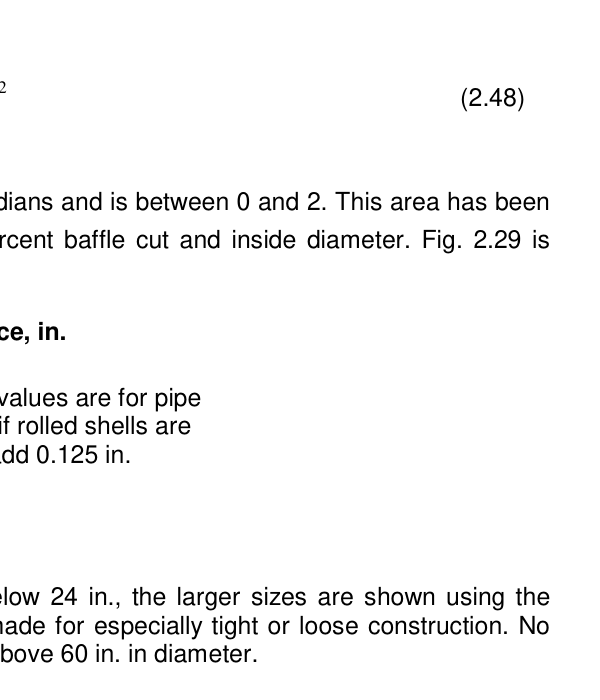

*图 2.30：毛窗口流通面积 Swg 的估算图。*

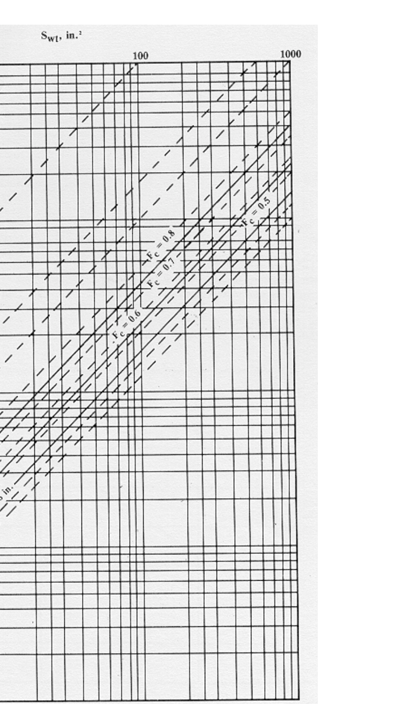

*图 2.31：窗口中管子占据面积 Swt 的估算图。*

12. 窗口区等效直径 Dw：

原式截图：[eq-2-52-original.png](./assets/eq-2-52-original.png)

$$
D_w
=
\frac{4S_w}
{\frac{\pi}{2}N_t(1-F_c)d_o+D_i\Theta}
\tag{2.52}
$$

其中：

原式截图：[eq-2-53-original.png](./assets/eq-2-53-original.png)

$$
\Theta =
2\cos^{-1}\left(1-2\frac{l_c}{D_i}\right)
\tag{2.53}
$$

图 2.32 给出窗口区等效直径估算辅助图。

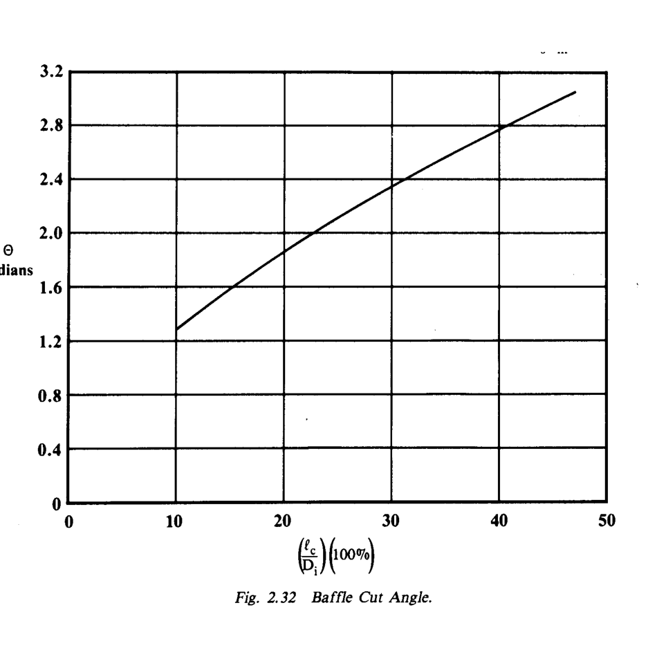

*图 2.32：窗口区等效直径 Dw 估算。*

### 2.6.3 Shell-Side Heat Transfer Coefficient Calculation

### 2.6.3 壳侧传热系数计算

Delaware 法首先计算设计流量下，流体横掠一个理想管束时的传热系数。该理想管束两侧由壳体限定，前后由相邻两块折流板限定。这个计算使用前文给出的理想管束关联。

随后，必须针对折流板几何、管-折流板泄漏、壳-折流板泄漏、管束旁路效应，包括密封条效应，以及低 Reynolds 数下不利温度梯度建立效应，对该系数进行修正。得到的系数即有效壳侧传热系数，并与其他传热项一起计算总传热系数。再用总传热系数、热负荷和平均温差计算所需面积。如果有效管长尚未指定，则可据此计算所需长度以判断设计可行性。如果长度已给定，如校核已有换热器，则比较所需面积与可用面积以判断适用性。

1. 计算壳侧 Reynolds 数：

原式截图：[eq-2-54-original.png](./assets/eq-2-54-original.png)

$$
Re_s =
\frac{d_rW_s}{\mu_sS_m}
\tag{2.54}
$$

其中 Ws 是壳侧流体质量流量，μs 是壳侧流体主体黏度，dr 是 Trufin 管根径。必须核实式 (2.54) 所用单位使 Res 无量纲。通常用壳侧流体入口和出口温度的算术平均值评价主体物性已足够；若温度范围很长，或黏度对温度非常敏感，则需特别小心，例如分段计算。

2. 在计算出的 Res 下，根据管排布置从图 2.15 的理想管束曲线查取 js。

3. 计算理想管束壳侧传热系数 ho,i：

原式截图：[eq-2-55-original.png](./assets/eq-2-55-original.png)

$$
h_{o,i}
=
j_s C_{p,s}
\left(\frac{W_s}{S_m}\right)
\left(\frac{k}{C_p\mu}\right)_s^{2/3}
\left(\frac{\mu}{\mu_w}\right)_s^{0.14}
\tag{2.55}
$$

4. 查取折流板构型修正因子 Jc。Jc 由图 2.33 按 Fc 查取。

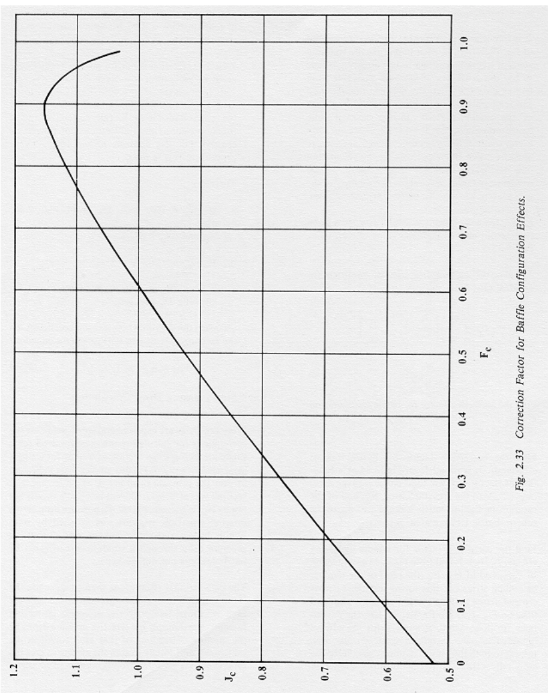

*图 2.33：折流板构型修正因子 Jc。*

5. 查取[折流板泄漏](../../../glossary/terms.md#term-baffle-leakage)效应修正因子 Jl。Jl 由图 2.34 按总折流板泄漏面积与横流面积之比，以及壳-折流板泄漏面积与管-折流板泄漏面积之比查取。

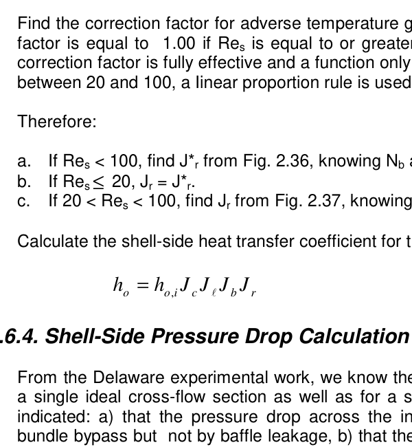

*图 2.34：折流板泄漏效应修正因子 Jl。*

6. 查取管束旁路效应修正因子 Jb。Jb 由图 2.35 按 Fsbp 和 Nss/Nc 查取，后者是每侧密封条数与一个折流横流区内穿过管排数之比。实线适用于 Res 大于等于 100；虚线适用于 Res 小于 100。密封条总是成对安装，并相对于平行流向和垂直流向的管束直径对称布置。传热改善与制造复杂性之间的最佳折中似乎是每约六排管使用一对密封条。

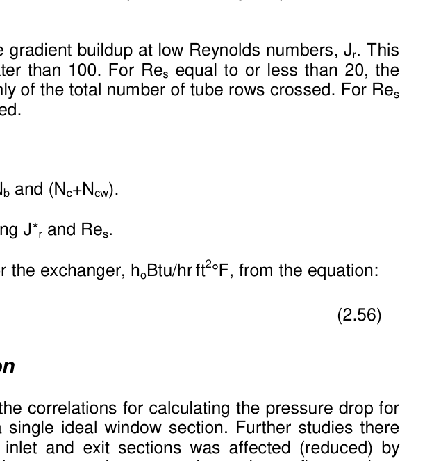

*图 2.35：管束旁路效应修正因子 Jb。*

7. 查取低 Reynolds 数下不利温度梯度建立修正因子 Jr。如果 Res 大于等于 100，则该因子等于 1.00。如果 Res 小于等于 20，则修正完全有效，仅取决于总穿过管排数。如果 Res 在 20 与 100 之间，采用线性比例规则。

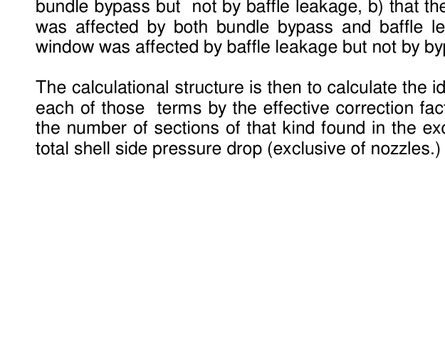

*图 2.36：完全有效时的 Jr* 修正。*

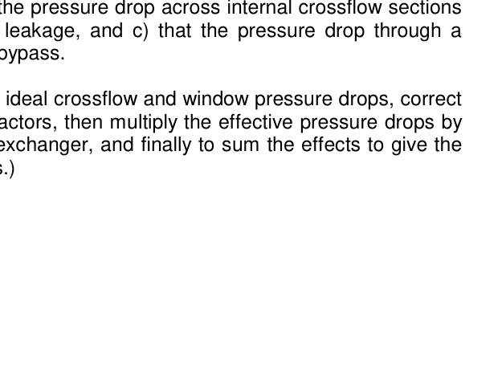

*图 2.37：20 到 100 的 Res 区间内 Jr 插值修正。*

8. 按下式计算换热器壳侧传热系数：

原式截图：[eq-2-56-original.png](./assets/eq-2-56-original.png)

$$
h_o =
h_{o,i}J_cJ_lJ_bJ_r
\tag{2.56}
$$

### 2.6.4 Shell-Side Pressure Drop Calculation

### 2.6.4 壳侧压降计算

Delaware 实验工作给出了单个理想横流区压降和单个理想窗口区压降的计算关联式。进一步研究表明：入口和出口区压降会受管束旁路影响而降低，但不受折流板泄漏影响；内部横流区压降同时受管束旁路和折流板泄漏影响；窗口区压降受折流板泄漏影响，但不受旁路影响。

因此，计算结构是先计算理想横流和理想窗口压降，对各项施加相应有效修正因子，再乘以换热器中对应区段数量，最后求和得到壳侧总压降，不包括管嘴压降。

如果结果满意，则至少从壳侧热工水力角度看，换热器设计成立。如果所需压降过大，就需要重新设计，可能采用更大壳径。如果计算压降远低于允许值，则可能可以减小壳径，重新设计成更小、更便宜的换热器。

1. 在给定管排布置和计算出的 Res 下，从图 2.17 的理想管束摩擦因子曲线查取 fs。

2. 计算理想横流区压降：

原式截图：[eq-2-57-original.png](./assets/eq-2-57-original.png)

$$
\Delta P_{b,i}
=
4f_s
\frac{W_s^2N_c}{2\rho_sg_cS_m^2}
\left(\frac{\mu_w}{\mu}\right)_s^{0.14}
\tag{2.57}
$$

式 (2.57) 的单位必须检查，以确保一致。

3. 计算理想窗口区压降 ΔPw,i。如果 Res 大于等于 100：

原式截图：[eq-2-58-original.png](./assets/eq-2-58-original.png)

$$
\Delta P_{w,i}
=
\frac{W_s^2(2+0.6N_{cw})}
{2g_cS_mS_w\rho_s}
\tag{2.58}
$$

如果 Res 小于 100：

原式截图：[eq-2-59-original.png](./assets/eq-2-59-original.png)

$$
\Delta P_{w,i}
=
\frac{26\mu_sW_s}{g_c\sqrt{S_mS_w}\rho_s}
\left[
\frac{N_{cw}}{p-d_o}
+\frac{l_s}{D_w^2}
\right]
+
\frac{W_s^2}{g_cS_mS_w\rho_s}
\tag{2.59}
$$

4. 计算折流板泄漏对压降的修正因子 Rl。由图 2.38 按总泄漏面积与横流面积之比，以及壳-折流板泄漏面积占总泄漏面积的比例查取。曲线不能外推超过图中点。

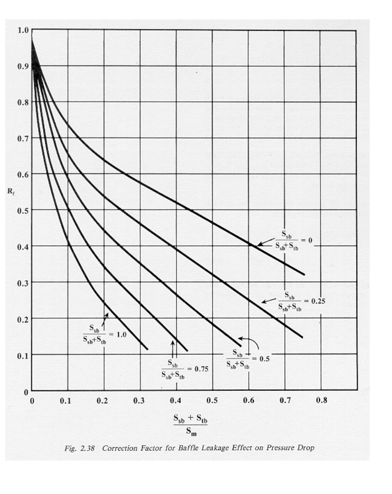

*图 2.38：折流板泄漏对压降的修正因子 Rl。*

5. 查取管束旁路修正因子 Rb。由图 2.39 按 Fsbp 和 Nss/Nc 查取。实线用于 Res 大于等于 100，虚线用于 Res 小于 100。

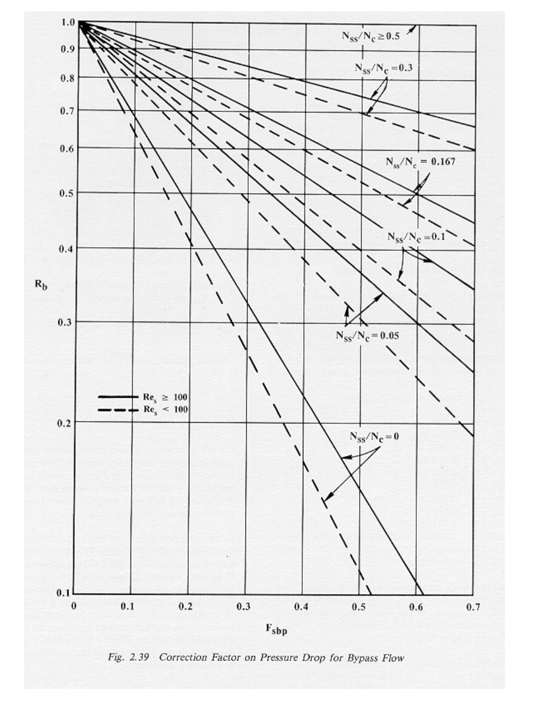

*图 2.39：管束旁路对压降的修正因子 Rb。*

6. 计算壳侧压降，不包括管嘴：

原式截图：[eq-2-60-original.png](./assets/eq-2-60-original.png)

$$
\Delta P_s
=
\left[
(N_b-1)\Delta P_{b,i}R_b
+N_b\Delta P_{w,i}
\right]R_l
+2\Delta P_{b,i}R_b
\left(1+\frac{N_{cw}}{N_c}\right)
\tag{2.60}
$$

Delaware 法在换热器设计中的应用由下一节例题说明。

## 2.7 Examples of Design Problems for Low- and Medium-Finned Trufin in Shell and Tube Heat Exchangers

## 2.7 低翅片和中翅片 Trufin 管壳式换热器设计例题

本节通过两个 Trufin 换热器设计例题说明前述方法。第一个问题是水冷空气压缩机后冷器，把空气从 350 °F 冷却到 125 °F。这与前文用来说明初步设计程序的问题相同，其结果将作为详细求解起点。第二个问题涉及热回收，用高温瓦斯油流股预热进入系统的中质原油；该问题将从头开始，先用已建立的初步程序启动设计。

### 2.7.1 Design of a Compressor Aftercooler

### 2.7.1 压缩机后冷器设计

问题是设计一台换热器，将 65 psig 下的 13000 SCFM，即 58500 lb/hr 空气，从 350 °F 冷却到 125 °F，使用 80 °F 的冷却水。指定设备为 U 形管结构，采用磷脱氧铜 S/T Trufin 管，外径 3/4 in.，每英寸 26 片翅片，目录号 65-265058。管子按 1 in. 等边三角形节距排列。

主要管子尺寸为：do = 0.750 in.，dr = 0.625 in.，H = 0.0625 in.，Y = 0.012 in.，s = 0.026 in.，Δxw = 0.058 in.，di = 0.509 in.，Ao = 0.640 ft2/ft，Ai = 0.133 ft2/ft，Si = 0.206 in.2，kw = 170 Btu/hr ft °F。

空气物性在 65 psia 和平均空气侧温度 240 °F 下评价，壁面黏度在 130 °F 下评价。水出口温度先假定为 110 °F，物性在平均体温 95 °F 下评价，估计平均壁温为 130 °F。水侧污垢因子取 0.001 hr ft2 °F/Btu；空气侧不指定污垢因子。

初步设计建议的组合为：15 1/4 in. 壳内径配约 12 ft 有效管长；17 1/4 in. 壳内径配约 10 ft；19 1/4 in. 壳内径配约 8 ft。对低压压缩机中冷器或后冷器，气体压降是主要考虑因素，因此例题选择较大直径、较短壳体，即 19 1/4 in. 内径壳体。折流板间距选接近 TEMA 最大允许值，试取 18 in.；折流板切口也取较大值，选 8 in.。

例题随后按本章步骤逐项计算壳侧几何参数。重要结果包括：U 形管修正后 Nt 约为 260；由于 U 形管最小弯曲半径造成中心线附近缺管，Nc 由几何估计值 4 调整为 2；Fc 也由图上值 0.25 调整为 0.15；Ncw 取 8；Sm 约 119 in.2；Fsbp 约 0.076；Stb 约 5.5 in.2；Ssb 约 2.5 in.2；窗口净面积 Sw 约 65.8 in.2。

壳侧传热计算给出 Res 约 68300，查图得 js = 0.0055；理想管束 ho,i 约 122 Btu/hr ft2 °F。折流构型、泄漏、旁路和低 Reynolds 数修正分别为 Jc = 0.65，Jl = 0.86，Jb = 0.91，Jr = 1.00。因此壳侧有效传热系数约为：

$$
h_o = 122(0.65)(0.86)(0.91)=62.1\ \mathrm{Btu/hr\ ft^2\ ^\circ F}
$$

热负荷为 3.17 x 106 Btu/hr。若水从 80 °F 升至 110 °F，水量约 105700 lb/hr。两管程水速约 2.55 ft/s，偏低；若改为四管程并考虑 U 形管管数变化，水速约 5.53 ft/s，更符合良好设计实践。用图 2.19 估算水侧传热系数约 1300 Btu/hr ft2 °F。

按第 1 章翅片热阻式或图 1.52，可得 Rfin = 8 x 10-5 hr ft2 °F/Btu。将壳侧传热、翅片热阻、管壁热阻、水侧污垢和管侧传热代入式 (2.2)，得到：

$$
U_o = 40.3\ \mathrm{Btu/hr\ ft^2\ ^\circ F}
$$

温差计算与初步设计类似：LMTD = 116.5 °F，P = 0.111，R = 7.5，查图 2.5 得 F = 0.9，因此 MTD = 104.8 °F。所需管外总面积为：

$$
A_o =
\frac{3.17\times 10^6}{(40.3)(104.8)}
=751\ \mathrm{ft^2}
$$

由 Ao = 0.640 ft2/ft、约 240 根管估算，所需有效直管长度为：

$$
L =
\frac{751}{(240)(0.640)}
=4.9\ \mathrm{ft}
$$

原书选取 6 ft 有效管长。这样在 18 in. 折流板间距下需要 3 块折流板，即 4 个折流间距。

壳侧压降计算中，图 2.17 给出 fs = 0.20。理想横流区压降为 31.4 lbf/ft2，理想窗口区压降为 246 lbf/ft2。折流板泄漏修正 Rl = 0.67，旁路修正 Rb = 0.73。代入式 (2.60) 并取 Nb = 3，得到壳侧压降：

$$
\Delta P_s = 5.24\ \mathrm{lb_f/in.^2}
$$

这个值可行，虽然略高于希望值；原书指出该计算很可能偏保守。如需降低壳侧压降，可考虑增大壳径、采用 TEMA J 分流壳、采用双弓形折流板，或采用窗口无管设计。但原书也提醒，当时的 Delaware 法尚未扩展到这些几何修改。

管侧压降计算中，四管程水侧 Reynolds 数为 28500，图 2.20 得 fi = 0.006。考虑六英尺直管段和 U 形弯管附加流动长度，管内总等效长度约 28.9 ft。式 (2.26) 给出管内摩擦压降约 3.19 psi；两个管入口损失由式 (2.25) 估计约 1.23 psi。这些值均在标准实践范围内。

因此，若壳侧压降可能高达约 5.3 psi 且可以接受，则该设计可完成任务。主要设计参数为：

| 项目 | 设计结果 |
|---|---|
| 壳体尺寸 | 19 1/4 in. 内径，6 ft 有效管长 |
| 壳型 | U 形管 |
| 折流板 | 单弓形，41.6% 切口，3 块折流板，间距 18 in. |
| 管子 | Wolverine S/T Trufin 65-265058-01，3/4 in. 外径，每英寸 26 片翅片，0.058 in. 壁厚，磷脱氧铜 |
| 管程 | 四管程 |
| 管排列 | 3/4 in. 外径管，1 in. 三角形节距 |
| 密封条 | 无 |

原书详细算页见以下源页对照：

[例题 2.7.1 原页 115](./assets/source-page-117.png)

[例题 2.7.1 原页 116](./assets/source-page-118.png)

[例题 2.7.1 原页 117](./assets/source-page-119.png)

[例题 2.7.1 原页 118](./assets/source-page-120.png)

[例题 2.7.1 原页 119](./assets/source-page-121.png)

[例题 2.7.1 原页 120](./assets/source-page-122.png)

[例题 2.7.1 原页 121](./assets/source-page-123.png)

[例题 2.7.1 原页 122](./assets/source-page-124.png)

[例题 2.7.1 原页 123](./assets/source-page-125.png)

[例题 2.7.1 原页 124](./assets/source-page-126.png)

### 2.7.2 Design of a Gas Oil to Crude Heat Recovery Exchanger

### 2.7.2 瓦斯油-原油热回收换热器设计

第二个问题是设计一台开口环浮头换热器，用 410 °F 的 28 °API 瓦斯油，以 13200 bpd，即约 152000 lb/hr，预热 34 °API 中大陆原油。原油流量为 49800 bpd，即约 597000 lb/hr，温度从 125 °F 升到 180 °F。瓦斯油冷却到 220 °F。换热器采用低碳钢 S/T Trufin 管，外径 1 in.，每英寸 19 片翅片，目录号 60-197083；管子按 1 1/4 in. 旋转正方形排列。两侧允许压降均为 15 psi。

主要管子尺寸为：do = 1.00 in.，dr = 0.875 in.，H = 0.0625 in.，Y = 0.017 in.，s = 0.036 in.，Δxw = 0.083 in.，di = 0.709 in.，Ao = 0.688 ft2/ft，Ai = 0.186 ft2/ft，Si = 0.395 in.2，kw = 26 Btu/hr ft °F。

原油侧物性在 150 °F 平均温度评价：密度 51.2 lbm/ft3，比热 0.51 Btu/lbm °F，主体黏度 7.0 lbm/ft hr，壁面黏度 4.4 lbm/ft hr，导热系数 0.071 Btu/hr ft °F。瓦斯油侧物性在 315 °F 平均温度评价：密度 49.3 lbm/ft3，比热 0.58 Btu/lbm °F，主体黏度 2.90 lbm/ft hr，壁面黏度 7.50 lbm/ft hr，导热系数 0.061 Btu/hr ft °F。两侧污垢因子均取 0.002 hr ft2 °F/Btu。

热负荷由两侧热平衡计算：

$$
Q_{crude}
=(597000)(0.51)(180-125)
=1.67\times 10^7\ \mathrm{Btu/hr}
$$

$$
Q_{gas\ oil}
=(152000)(0.58)(410-220)
=1.68\times 10^7\ \mathrm{Btu/hr}
$$

LMTD = 152.7 °F，P = 0.667，R = 0.289，查图 2.5 得 F = 0.92。由表 2.1 对“管侧中等有机液体、壳侧重质有机液体”取中间值 Uo = 30 Btu/hr ft2 °F，则实际需求面积初估为：

$$
A_o =
\frac{1.67\times 10^7}{(30)(0.92)(152.7)}
=3960\ \mathrm{ft^2}
$$

进入图 2.26 前，修正因子取 F1 = 1.54，F2 = 1.03，F3 = 1.09，F4 = 0.97，于是：

$$
A'_o =
(3960)(1.54)(1.03)(1.09)(0.97)
=6640\ \mathrm{ft^2}
$$

图 2.26 给出可行组合，例如 37 in. 壳内径配 10 ft 管长，33 in. 配 13 ft，31 in. 配 14.5 ft，29 in. 配 17 ft，27 in. 配 19.5 ft，25 in. 配 23 ft 等。由于壳侧流量很高，原书选择 31 in. 壳内径先作详细校核。

两管程时，固定管板管数 417 按 F3 = 1.09 修正后约为 382 根，每程 191 根，管侧速度仅 1.63 ft/s，偏低。改用六管程时速度约 5 ft/s，有利于控制污垢，且管侧压降仍可能可接受，因此选六管程。

进入 Delaware 法后，壳侧基本几何取 Di = 31 in.，Dotl = 29 3/8 in.，35% 折流切口，即 lc = 10.8 in.，折流板间距 16 in.。几何计算结果为：Nt = 355，pp = pn = 0.884 in.，Nc = 10，密封条取两对，Fc = 0.40，Ncw = 10，Sm = 200 in.2，Fsbp = 0.130，Stb = 12.2 in.2，Ssb = 9.2 in.2，Sw = 151 in.2。

壳侧传热计算得到 Res = 4480，js = 1.1 x 10-2，理想管束 ho,i = 189 Btu/hr ft2 °F。查图得 Jc = 0.845，Jl = 0.80，Jb = 0.95，于是：

$$
h_o = 189(0.845)(0.80)(0.95)
=121\ \mathrm{Btu/hr\ ft^2\ ^\circ F}
$$

六管程时每程约 59 根管，管侧速度为 5.29 ft/s，Rei = 19100。用式 (2.23) 得管侧传热系数：

$$
h_i = 167\ \mathrm{Btu/hr\ ft^2\ ^\circ F}
$$

翅片热阻由第 1 章取 Rfin = 4.9 x 10-4 hr ft2 °F/Btu。代入式 (2.2) 得：

$$
U_o = 24.3\ \mathrm{Btu/hr\ ft^2\ ^\circ F}
$$

所需实际管外面积为：

$$
A_o =
\frac{1.68\times 10^7}{(24.3)(0.92)(152.7)}
=4920\ \mathrm{ft^2}
$$

由 355 根管和 Ao = 0.688 ft2/ft 得所需有效管长约 20 ft。16 in. 折流板间距对应 15 个折流间距或 14 块折流板，管嘴位于壳体相对两侧；若这不合适，可试算略短或略长的折流间距。

壳侧压降计算中，Res = 4480 时图 2.17 给 fs = 0.38。单个理想横流区压降为 61.6 lbf/ft2，单个理想窗口区压降为 45.8 lbf/ft2，Rl = 0.58，Rb = 0.87。式 (2.60) 给壳侧压降约 6.88 psi；即便加上管嘴损失，也在允许范围内。

管侧压降中，Rei = 19100 时 fi = 0.007。六管程、20 ft 有效管长给总管内摩擦长度 120 ft，式 (2.26) 得摩擦压降约 9.02 psi。入口和出口损失按式 (2.24) 与式 (2.25) 估计约 3.57 psi，总管侧损失约 12.6 psi，在 15 psi 限制内。

这一例题与前一个问题的差别在于：它不是低压气体冷却，而是液体-液体热回收。设计约束不再由气体压降支配，而更多受污垢控制、速度控制、壳侧旁路与泄漏修正、管程数和清洗维护要求控制。最终主要设计参数为：

- 壳体尺寸：31 in. 内径，20 ft 有效管长。
- 壳型：开口环浮头。
- 折流板：单弓形，35% 切口，14 块折流板，间距 16 in.。
- 管子：Wolverine S/T Trufin 60-197083-63，1 in. 外径，每英寸 19 片翅片，0.083 in. 壁厚，碳钢。
- 管程：六管程。
- 管排列：1 in. 外径管，1 1/4 in. 旋转正方形节距。
- 密封条：两对。

这一例题的价值不在于单个数值，而在于完整展示了从初估 Uo、选择壳径和管程，到按 Delaware 法修正壳侧传热和压降，再回到设计参数调整的闭环。原书详细算页见以下源页对照：

[例题 2.7.2 原页 125](./assets/source-page-127.png)

[例题 2.7.2 原页 126](./assets/source-page-128.png)

[例题 2.7.2 原页 127](./assets/source-page-129.png)

[例题 2.7.2 原页 128](./assets/source-page-130.png)

[例题 2.7.2 原页 129](./assets/source-page-131.png)

## Nomenclature

## 符号说明

本章符号表较长，原页截图如下，供数值校对和单位追溯使用：

[符号表原页 139](./assets/reference-page-139-original.png)

[符号表原页 140](./assets/reference-page-140-original.png)

[符号表原页 141](./assets/reference-page-141-original.png)

[符号表原页 142](./assets/reference-page-142-original.png)

本章核心符号包括：Ao 管外总面积；Ai 管内面积；Am 平均管壁面积；ho 壳侧膜传热系数；hi 管侧膜传热系数；Rfo 和 Rfi 污垢热阻；Sm 最小横流面积；Sw 窗口流通面积；Fc 横流区管数分数；Fsbp 旁路面积分数；Jc、Jl、Jb、Jr 为壳侧传热修正因子；Rl、Rb 为壳侧压降修正因子。

## Bibliography

## 参考文献

原书参考文献页见：

[参考文献原页 143](./assets/reference-page-143-original.png)

本章主要依赖 Williams 和 Katz 的低翅片管束数据、Briggs 等对这些数据的 Delaware 法解释、Delaware 壳侧校核方法、Perry 手册中的常见管束关联、Sieder-Tate 和 Hausen 管内传热关联、以及 HTRI 对壳侧预测方法误差范围的评估。
