# Chapter 3 Condensing Heat Transfer

# 第 3 章 冷凝传热

## 来源追溯

| 项目 | 内容 |
|---|---|
| 原书 | Engineering Data II |
| 章节 | Chapter 3 |
| PDF 页码 | 144-209 |
| 书内页码 | 142-208 |
| 进度记录 | [progress.md](./progress.md) |

## 3.1 Trufin Tubes in Condensing Heat Transfer

## 3.1 Trufin 管在冷凝传热中的应用

### 3.1.1 Modes of Condensation

### 3.1.1 冷凝方式

[冷凝](../../../glossary/terms.md#term-condensation)是通过移除冷凝潜热，使饱和蒸汽转变为液体的传热过程。

通常认为冷凝有四种基本机制：[滴状冷凝](../../../glossary/terms.md#term-dropwise-condensation)、[膜状冷凝](../../../glossary/terms.md#term-filmwise-condensation)、[直接接触冷凝](../../../glossary/terms.md#term-direct-contact-condensation)和[均相冷凝](../../../glossary/terms.md#term-homogeneous-condensation)。滴状冷凝中，液滴从固体表面特定成核点上由蒸汽生成，并在长大过程中保持彼此分离，直到被重力或蒸汽剪切带走。膜状冷凝中，最初形成的液滴很快并合，在表面形成连续液膜；更多液体要冷凝，热量必须穿过这层液膜传出。直接接触冷凝中，蒸汽直接在喷入蒸汽空间的冷却液表面上冷凝。均相冷凝中，液相从过饱和蒸汽中直接形成，远离任何宏观表面；不过实际中通常假定蒸汽中有足够数量的尘粒或雾滴可作为成核点。

滴状冷凝之所以诱人，是因为文献报道的传热系数很高。但就当前工艺设备而言，它还不适合作为一种有意采用的设计方式。通常必须连续向蒸汽中注入污染物，或采用特殊材料，而这些材料往往导热系数较低。即便如此，该过程仍不稳定、不可预测，在高蒸汽速度和工业实践条件下效果也存疑。

直接接触冷凝效率很高，但会使冷凝液与冷却液混合。因此它只适用于冷凝液易分离、不希望回收冷凝液，或冷却液与冷凝液本来就是同一物质的情况。均相冷凝主要与设备中的雾形成有关，并不是一种设计模式。

因此，本章后续提到冷凝时，均指膜状冷凝。也就是说，传热表面覆盖着一层薄冷凝液膜，冷凝液膜受重力、[蒸汽剪切](../../../glossary/terms.md#term-vapor-shear)或表面张力作用而流动。

本章后文将建立冷凝传热和压降计算所需的方程。先研究管内冷凝，再扩展到 Trufin 管外冷凝。

### 3.1.2 Areas of Application

### 3.1.2 应用范围

第 1 章指出，当两侧膜传热系数中一侧明显小于另一侧时，使用 Trufin 通常是有利的。较低的膜系数往往控制总传热系数 U 的大小，也就控制换热器尺寸。因此，如果让低系数流体接触翅片提供的高传热面积，所需总管量相对光管会减少，换热器总体尺寸也会随之减小。

最佳设计通常在两侧流体传热热阻大致相等时获得。这一条件可写为：

原文未编号公式截图：[source-page-145.png](./assets/source-page-145.png)

$$
\frac{1}{h_iA_i}\approx\frac{1}{h_oA_o}
$$

或：

$$
\frac{A_o}{A_i}\approx\frac{h_i}{h_o}
$$

在工艺和制冷工业的大量冷凝应用中，尤其在采用水冷却时，hi/ho 往往在 2 到 5，甚至到 10。由于低翅片和中翅片 Trufin 的 Ao/Ai 约为 3 到 7，这些管子常能显著节省换热器总体尺寸和成本。在这类应用中，冷凝发生在管外翅片表面。

另一些应用采用空气作为冷却介质，此时空气侧传热系数远低于冷凝侧传热系数。高翅片 Trufin 用于这类场合，让冷凝在管内发生，把管外高面积放在空气侧。

### 3.1.3 Types of Tubes Available

### 3.1.3 可用管型

1. S/T 型 Trufin 低翅片管。这类管每英寸 16 到 40 片翅片，翅高约 1/16 in.。翅顶外径等于或小于光端直径，以便管子穿过管板。

2. 中翅片 Trufin。这类管每英寸 11 片翅片，翅高 1/8 in.。可供应翅片段直径大于光端直径的 W/H 型，也可供应带扩口端、适合胀接到管板中的 S/T 型。

3. S/T 型 Turbo-Chil 翅片管。这类管外表面类似标准 S/T Trufin；此外，内表面带整体螺旋肋，以强化管内传热系数。

4. Koro-dense 管。这是波纹管而非翅片管，但由于其在蒸汽冷凝中有有利应用，原书在此一并提及。它有两类：MHT 型，中等波纹强度，在压降允许时提供最大管侧性能；LPD 型，低波纹强度，用于管侧压降受限时。

上述管型中，冷凝通常发生在管外表面。

5. 高翅片 Trufin。这类管用铜和铝制造，翅片数为每英寸 5 到 11 片，翅高可达 5/8 in.。铝翅片管可配多种其他金属内衬。高翅片 Trufin 在本章主要作为空气冷却器中管内冷凝、空气侧强化的背景。

## 3.2 Condensation of Vapor Inside High-Finned Trufin Tubes

## 3.2 高翅片 Trufin 管内蒸汽冷凝

### 3.2.1 Vapor-Liquid Two-Phase Flow

### 3.2.1 气液两相流

#### 1. 两相冷凝流的相态关系

蒸汽冷凝经常在采用高翅片 Trufin 管的空气冷却换热器管内进行。管子通常水平或近似水平，偶尔也采用倾斜或垂直布置。气液两相混合物流动比单相流复杂得多，相应地，传热和压降关联式精度也更差。由于两相传热系数通常较高，这种不确定性对空气冷却冷凝器的传热计算并不是严重问题；但两相压降也很高，因此把预测值转化为设计考虑时必须谨慎。

表征冷凝两相流的第一种方式是按组成分类。可区分五种情况：

a. 液体和气体为不同纯组分。常见例子是空气-水混合物。它并不常见于工业问题，但非常重要，因为两相流知识有相当多来自该体系。虽然这些信息通常可迁移到冷凝和某些沸腾问题中，但必须认识并考虑其中重要差异。热力学上，该体系的压力和温度可以在宽范围内独立变化。

b. 液体和气体即蒸汽为同一纯组分。这是冷凝器设计中的常见情况，例如用于产品分离或精制塔的冷凝器。此时压力-温度关系就是该组分的蒸汽压曲线。

c. 液体和气体即蒸汽均为多组分混合物，每相中都含有部分各组分。热力学关系更复杂；例如在给定压力下，温度可在一定范围内变化，同时总液量与总汽量之比变化，每相组成也变化。在一些体系中，例如轻烃混合物，预测每相数量和组成相对成熟且容易；其他体系需要实验室热力学数据。

d. 类似 b 或 c，但存在[非凝气](../../../glossary/terms.md#term-non-condensable-gas)。最常见例子是蒸汽中的空气，也包括从惰性汽提气中冷凝溶剂等应用。

e. 介于 c 与 d 之间，典型例子是从湿天然气中冷凝轻汽油馏分。取决于气体组成以及冷凝压力和温度，一部分甲烷和乙烷会溶解在液体中，少量重组分也会留在蒸汽中。

本节主要讨论情况 b，即纯组分冷凝。不过后文建立的许多方程和程序也适用于其他情况，相关限制将在后面说明。

#### 2. 两相汽液流的表征参数

两相流需要定义若干定量参数。

a. 质量流量。各相质量流量通常已知，或可由工艺规格计算。冷凝流中，总质量流量保持不变，液相流量随气相流量减少而增加。由于气液比沿程变化，冷凝过程的流动机制也可能随入口到出口发生改变。通常用[干度](../../../glossary/terms.md#term-quality) x 无量纲表示两相比例：

原式截图：[eq-3-1-original.png](./assets/eq-3-1-original.png)

$$
x=\frac{w_v}{w_l+w_v}
\tag{3.1}
$$

b. 体积流量。体积流量偶尔很有用，定义为各相质量流量除以相应密度：

原式截图：[eq-3-2-original.png](./assets/eq-3-2-original.png)

$$
\dot V_l=\frac{w_l}{\rho_l},
\qquad
\dot V_v=\frac{w_v}{\rho_v}
\tag{3.2}
$$

c. 质量速度。总两相流的质量速度 G 在截面积恒定的通道中保持不变，定义为：

原式截图：[eq-3-3-original.png](./assets/eq-3-3-original.png)

$$
G=\frac{w_l+w_v}{S}
\tag{3.3}
$$

其中 S 是通道截面积。

d. 表观质量速度。某相的表观质量速度按该相单独占满整个通道截面计算：

原式截图：[eq-3-4-original.png](./assets/eq-3-4-original.png)、[eq-3-5-original.png](./assets/eq-3-5-original.png)

$$
G_v=\frac{w_v}{S}=xG
\tag{3.4}
$$

$$
G_l=\frac{w_l}{S}=(1-x)G
\tag{3.5}
$$

在计算 Gv 和 Gl 时使用整个截面积，尽管每一相实际上只占据一部分截面。这些量没有根本物理意义，但在两相流数据关联中方便且有用。

e. 速度。两相中每一相的真实平均速度并不简单地由上述参数决定。液体通常更靠近管壁，且黏度和密度高于蒸汽，因此一般流得更慢，产生“滑移”。若 Vv 为某点蒸汽真实平均速度，Vl 为液体对应速度，通常 Vv 大于 Vl。习惯上定义[滑移比](../../../glossary/terms.md#term-slip-ratio)为 Vv/Vl；它几乎总是大于 1，可达 10、20 或更高。若 Vv = Vl，流动称为均相流。均相流并不很真实，但使用简单，因为密度、速度、质量分数和体积分数可直接相互关联。缺少更好信息时可假设均相流，但必须警惕这种假设的非保守后果。

f. 相体积分率。蒸汽实际占据体积除以通道总体积，称为汽相体积分率 Rv，也更常称为[空隙率](../../../glossary/terms.md#term-void-fraction)。液相体积分率 Rl 等于 1 - Rv。对于稳态流或足够长时间平均的流动，它们也是各相占据截面积的比例。由连续性可写出空隙率关系：

原式截图：[eq-3-6-original.png](./assets/eq-3-6-original.png)

以这些量表示，[滑移比](../../../glossary/terms.md#term-slip-ratio)为：

原式截图：[eq-3-7-original.png](./assets/eq-3-7-original.png)

g. 有效密度。两相混合物有效密度定义为单位流动混合物体积中的质量：

原式截图：[eq-3-8-original.png](./assets/eq-3-8-original.png)

$$
\rho_{eff}=R_v\rho_v+(1-R_v)\rho_l
\tag{3.8}
$$

#### 3. 汽相体积分率关联式

为了计算两相流的若干特征量，需要汽相体积分率数据。大量实验研究测定了 Rv，也提出了许多关联式。Martinelli 及其合作者提出的关联式总体上可用于工艺应用范围，主要基于近大气压力空气-水体系。Martinelli 和 Nelson 针对体积分率提出的关联式在现有全范围数据上表现并不逊于其他方法。原始关联用于蒸汽-水系统，但可用约化压力推广。修改后的关联见图 3.1。

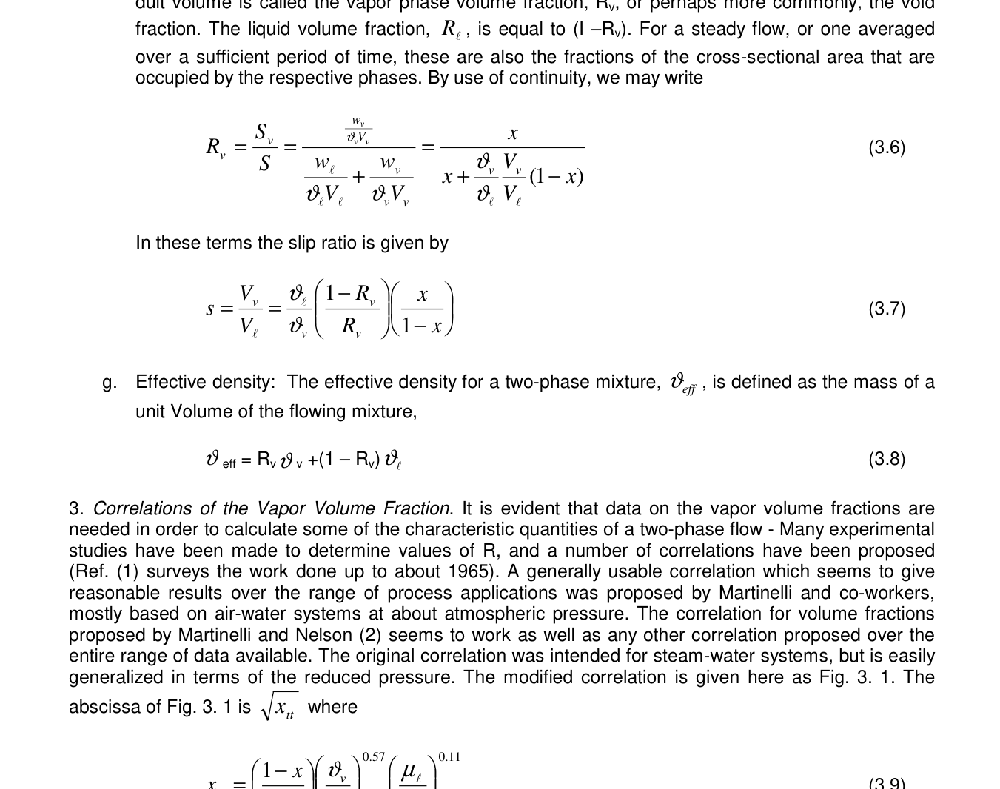

*图 3.1：Rl 和 Rv 作为 Xtt 的函数。由 Martinelli 和 Nelson 关系修改而来。*

横坐标为 [Lockhart-Martinelli 参数](../../../glossary/terms.md#term-lockhart-martinelli-parameter) Xtt：

原式截图：[eq-3-9-original.png](./assets/eq-3-9-original.png)

$$
X_{tt}
=
\left(\frac{1-x}{x}\right)^{0.9}
\left(\frac{\rho_v}{\rho_l}\right)^{0.5}
\left(\frac{\mu_l}{\mu_v}\right)^{0.1}
\tag{3.9}
$$

纵坐标为 Rl 与 Rv，参数为蒸汽约化压力：

原式截图：[eq-3-10-original.png](./assets/eq-3-10-original.png)

$$
P_R=\frac{p}{p_{crit}}
\tag{3.10}
$$

Xtt 的形式由 Martinelli 的两相流模型推导，但实际适用性相当广。PR = 0.005 的极限曲线取自大气压空气-水实验，PR = 1 的曲线来自两相性质趋同时滑移比趋于 1 的要求；其他约化压力曲线通过目测插值得到。

#### 4. 两相流型

到这里为止，我们还没有描述两相流的实际外观。在某些问题中，例如过程冷凝器空隙率计算，[流型](../../../glossary/terms.md#term-flow-regime)外观相对不重要；但在其他问题中，流型非常重要。两相流构型或流型取决于两相相对量和绝对量、流体物性、通道几何以及传热过程类型。Alves 对水平管内空气-水绝热流的观察以理想化形式画成图 3.2。

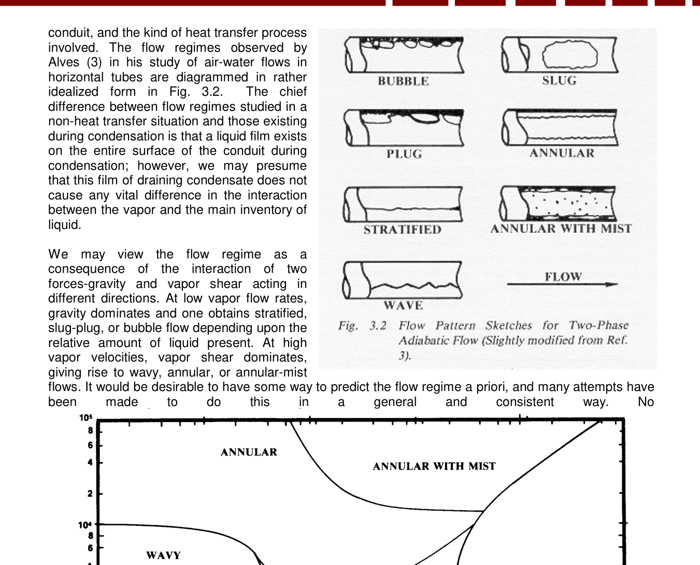

*图 3.2：两相绝热流流型示意。由 Alves 图略作修改。*

无传热流动与冷凝流动的主要差异是：冷凝期间通道整个表面都存在液膜。但可假定这层排液冷凝膜不会对蒸汽与主要液体滞留量之间的相互作用造成本质差别。

可把流型理解为重力与蒸汽剪切这两种作用于不同方向的力相互竞争的结果。低蒸汽流量时，重力占主导，根据液体相对量可形成分层流、弹塞流或泡状流。高蒸汽速度时，蒸汽剪切占主导，形成波状流、[环状流](../../../glossary/terms.md#term-annular-flow)或环雾流。

预测流型的通用方法一直是研究目标，许多尝试都未完全成功。Baker 的工作通常被认为是现有最好方法，虽然它是量纲形式，无法用基本理论充分解释。修改后的 Baker 图见图 3.3，可用于粗略判断给定条件下可能出现的流型。

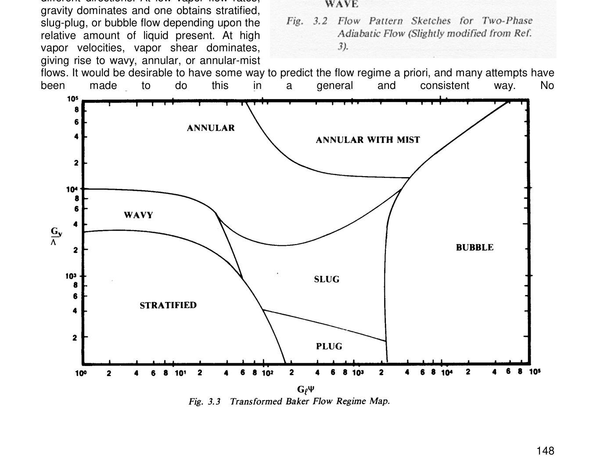

*图 3.3：转换后的 Baker 流型图。*

冷凝过程中，蒸汽与液体比例沿程变化。可借助图 3.4 在 Baker 图上跟踪这种变化。使用方法是：先计算半冷凝点，即 Gv = Gl 时对应 Baker 图横纵坐标，并在图 3.3 上标点。然后把图 3.4 曲线上的 0.5 点叠放在该点上，并使两图坐标方向平行。这样图 3.4 的曲线就表示从纯蒸汽到纯液体的流型变化序列。

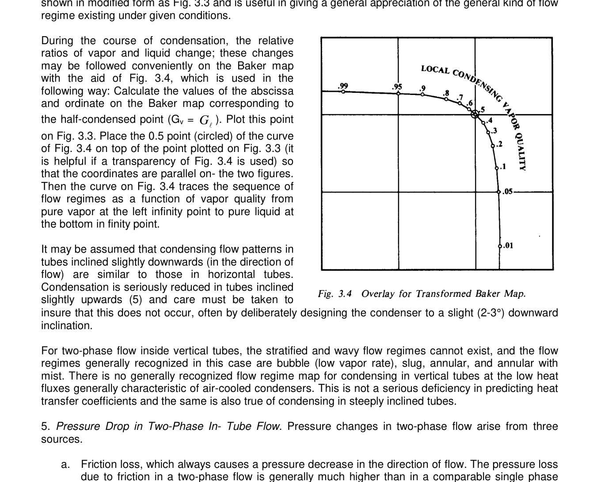

*图 3.4：用于转换 Baker 图的叠加曲线。*

可假定沿流动方向稍向下倾斜的管内冷凝流型与水平管类似。稍向上倾斜的管中冷凝会严重降低，必须避免；实际设计中常故意给冷凝器 2° 到 3° 的向下倾斜，以保证排液。

对于垂直管内两相流，分层流和波状流不可能存在，通常识别的流型为泡状流、弹状流、环状流和环雾流。对空气冷却冷凝器常见的低热流垂直管冷凝，公开文献没有公认流型图。对预测传热系数而言，这一缺陷通常不严重；陡倾斜管冷凝也类似。

#### 5. 管内两相流压降

两相流中的压力变化来自三个来源。

a. 摩擦损失。摩擦损失总是使压力沿流动方向降低。两相流摩擦压降通常比可比单相流高得多，因为汽液界面粗糙。摩擦压降梯度取决于局部状态，而冷凝流中局部状态沿程变化。因此摩擦对总压降的影响取决于冷凝路径。

b. 动量效应。动量效应来自流速变化，也就是流体动能变化。若流动加速，如沸腾，动量项为负，即压力损失；若流动减速，如一般冷凝，动量项为正，即压力回升。该项对总压力的影响只取决于端点状态，但某些情况下需要计算局部速度变化产生的局部压力梯度。

c. 静压效应。静压效应来自流体高程变化。该项在向上方向总是使压力降低，在水平管中为零。局部梯度取决于局部密度，因此通常需要沿冷凝路径计算。

三者代数和等于净压力效应。工艺应用中，水平构型通常以摩擦损失为主；垂直设计中，摩擦和静压通常同量级。但在极高速度冷凝流中，动量效应可能大于其他项，使入口到出口出现压力升高。

摩擦压降可用 Martinelli-Nelson 关联计算。首先按只有液体流过通道计算压力梯度：

原式截图：[eq-3-11-original.png](./assets/eq-3-11-original.png)

液相雷诺数为：

原式截图：[eq-3-12-original.png](./assets/eq-3-12-original.png)

若 Rel 大于 2100，可从 Fanning 摩擦因子图或下式取 fl：

原式截图：[eq-3-13-original.png](./assets/eq-3-13-original.png)

两相摩擦压力梯度为：

原式截图：[eq-3-14-original.png](./assets/eq-3-14-original.png)、[eq-3-15-original.png](./assets/eq-3-15-original.png)

其中两相摩擦倍率从图 3.5 按 Xtt 读取。

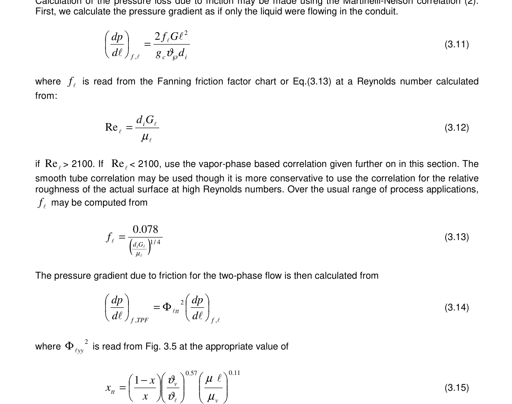

*图 3.5：Martinelli-Nelson 两相摩擦压降倍率。*

若 Rel 小于 2100 而 Rev 大于 2100，则采用以气相为基准的类似计算：

原式截图：[eq-3-16-original.png](./assets/eq-3-16-original.png)、[eq-3-17-original.png](./assets/eq-3-17-original.png)、[eq-3-18-original.png](./assets/eq-3-18-original.png)、[eq-3-19-original.png](./assets/eq-3-19-original.png)

若液相和气相雷诺数都低于 2100，可用层流摩擦因子近似：

原式截图：[eq-3-20-original.png](./assets/eq-3-20-original.png)

但在这种情况下，压降往往很低，通常不重要。

动量变化造成的压力效应局部形式为：

原式截图：[eq-3-21-original.png](./assets/eq-3-21-original.png)

总动量效应可仅由入口和出口条件求得：

原式截图：[eq-3-22-original.png](./assets/eq-3-22-original.png)

若干饱和蒸汽进入并完全冷凝，则式 (3.22) 化为：

原式截图：[eq-3-23-original.png](./assets/eq-3-23-original.png)

对冷凝而言，这是压力增加项。

静压效应为：

原式截图：[eq-3-24-original.png](./assets/eq-3-24-original.png)

其中有效密度由式 (3.8) 给出，θ 是垂直方向与管轴之间夹角；垂直管 θ = 0，水平管 θ = π/2，如图 3.6。

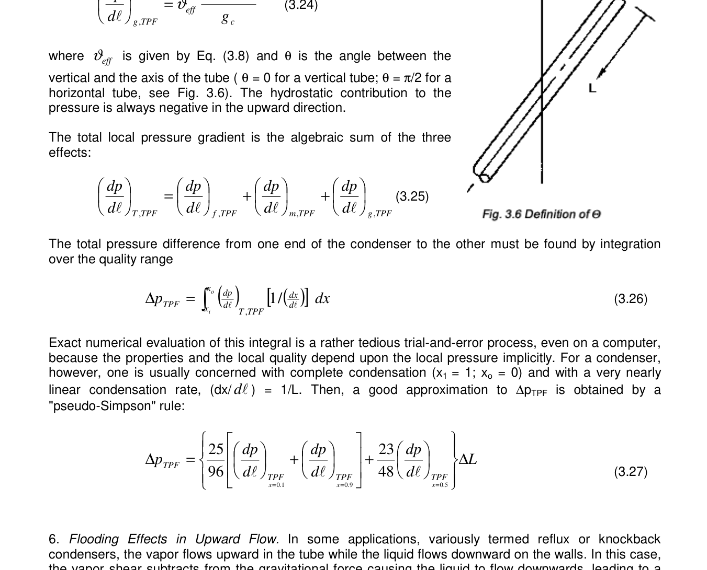

*图 3.6：管子角度 θ 的定义。*

总局部压力梯度为三项代数和：

原式截图：[eq-3-25-original.png](./assets/eq-3-25-original.png)

从冷凝器一端到另一端的总压力差必须在干度范围内积分：

原式截图：[eq-3-26-original.png](./assets/eq-3-26-original.png)

严格数值积分相当繁琐，即使用计算机也要试算，因为物性和局部干度隐含依赖局部压力。对冷凝器，通常关注完全冷凝，入口 x = 1，出口 x = 0，并且冷凝速率近似线性。这时可用“伪 Simpson”规则近似：

原式截图：[eq-3-27-original.png](./assets/eq-3-27-original.png)

#### 6. 向上流动中的液泛效应

在回流或 knockback 冷凝器中，蒸汽在管内向上流动，液体沿壁面向下流动。此时蒸汽剪切抵消重力对液体向下流动的作用，使液膜增厚；若液膜为层流，传热系数也会降低，这是 Nusselt 分析过的效应。一般而言，更重要的结果是蒸汽剪切使液膜过早湍动，液膜增厚但系数也提高。若没有蒸汽剪切时液膜本来就会湍动，蒸汽剪切对传热的净影响不明确，也未必关键。

回流冷凝器的主要关注点是避免液泛，即冷凝器任意点蒸汽剪切都不能等于液体重力。临界点在管下端入口，因为此处液体和蒸汽流量都最大。Soliman、Schuster 和 Berenson 曾从基础角度分析该问题，但最佳设计关联式来自 Diehl 和 Koppany。其初始液泛关联为：

原式截图：[eq-3-28-original.png](./assets/eq-3-28-original.png)、[eq-3-29-original.png](./assets/eq-3-29-original.png)、[eq-3-30-original.png](./assets/eq-3-30-original.png)、[eq-3-31-original.png](./assets/eq-3-31-original.png)

该式为量纲式，必须使用指定单位：ρv 用 lb/ft3，di 用 ft，σ 用 dyne/cm。由于给出的是初始液泛速度，保守设计要求最大设计蒸汽速度低于该值。若工况处于 Diehl-Koppany 数据覆盖的较宽范围内，按预测液泛速度的 70% 设计看来安全；否则应限制在计算值的 50%。

少数冷凝器被设计成蒸汽剪切足够大，以携带冷凝液向上并排出冷凝器。这种情况下不可能完全冷凝，因为顶部必须仍有足够蒸汽流量来带走液体。观察表明，当蒸汽流量超过 Diehl-Koppany 液泛限后，液体夹带缓慢增加，在约三倍液泛速度时几乎完全夹带。对相对可靠的运行，顶部设计工况可取此值。若处于中间值，回流液必须再次进入冷凝器并被吹出，容易产生液塞、分布不均和总体不稳定运行。

### 3.2.2 Condensation Heat Transfer

### 3.2.2 冷凝传热

#### 垂直管内纯组分层流膜状冷凝

饱和蒸汽纯组分层流膜状冷凝，是最早成功从基本原理分析的传热问题之一。决定性工作是 Nusselt 1916 年相隔两周发表的两篇论文。原始 Nusselt 分析专门适用于垂直表面上的层流冷凝膜，但该方法可推广到若干其他情况，包括水平管内冷凝。因此原书在此较详细地讨论该分析。

Nusselt 模型的关键假设是液膜为层流，液膜水动力由 Navier-Stokes 方程中的黏性项控制。这允许忽略惯性或动能项，从而得到液膜厚度、速度分布、重力和液体黏度之间的简单关系。若放宽该假设，需要求解复杂方程；已有数值解表明，对多数工艺应用，复杂解与简化解差别很小。

其他假设包括：

1. 蒸汽为饱和蒸汽。
2. 液体和蒸汽在界面处温度相同，均为 Tsat，即无界面热阻。
3. 热量只通过液膜导热传递。
4. 液膜内温度分布为线性。
5. 液体和固体表面在界面处温度相同。
6. 固体表面等温。
7. 液体物性不随温度变化。
8. 蒸汽不在液体表面施加剪切或法向应力。
9. 液体在液-固界面处速度为零，即无滑移。
10. 冷凝液过冷显热相对于潜热负荷可忽略。

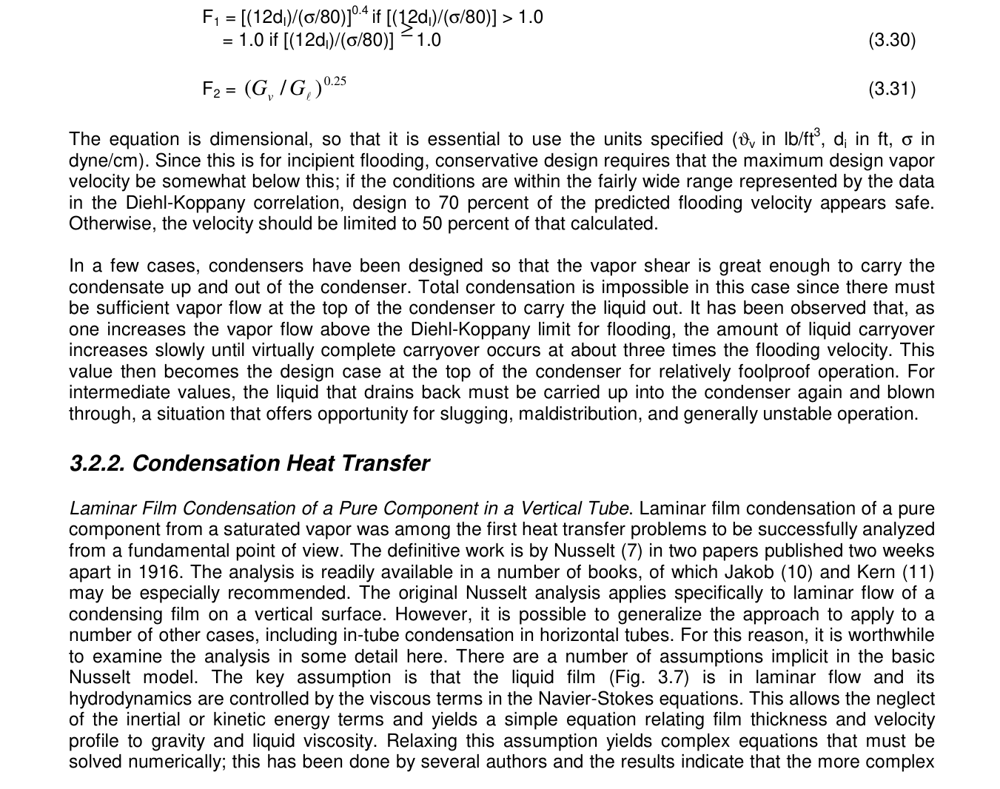

*图 3.7：垂直平面上的 Nusselt 冷凝模型。*

在距冷凝开始位置 x 处的局部液膜传热系数为：

原式截图：[eq-3-32-original.png](./assets/eq-3-32-original.png)

更有用的是长度 L 上的平均系数，记为冷凝系数 hc：

原式截图：[eq-3-33-original.png](./assets/eq-3-33-original.png)

式 (3.33) 预测传热系数随 L 和 Tsat - Tw 增大而降低。这是由于液膜增厚后导热阻力增大。

虽然式 (3.33) 是对垂直平面推导的，但冷凝液膜相对于典型管径很薄，因此只要其他假设满足，它也适用于垂直管内或管外冷凝。严格说，hc 对 L 和温差的依赖违反了常规换热器设计中使用对数平均温差的两个假设；但该影响可证明不严重，使用常规 F-LMTD 形式实际上略偏保守。

如果已知冷凝器管长，式 (3.33) 有用；若要按给定负荷设计冷凝器，则不方便。可先定义单位管排液周长上的管负荷 Γ。若每根管冷凝 w lb/hr：

原式截图：[eq-3-34-original.png](./assets/eq-3-34-original.png)

其中垂直管 Pt = πd。每根管总热负荷为：

原式截图：[eq-3-35-original.png](./assets/eq-3-35-original.png)

整理后得到更适合设计的形式：

原式截图：[eq-3-36-original.png](./assets/eq-3-36-original.png)

并定义冷凝液 Reynolds 数：

原式截图：[eq-3-37-original.png](./assets/eq-3-37-original.png)

代入可得：

原式截图：[eq-3-38-original.png](./assets/eq-3-38-original.png)

#### Nusselt 假设的设计影响

在受控实验中，Nusselt 方程的有效性已得到确认。但实际应用中若假设不满足，必须判断方程是否完全失效，或是否可修正后仍给出有用设计结果。

层流液膜这一基本假设被破坏时，后果很显著，后文将单独讨论。其他假设的影响如下。

饱和蒸汽假设已经过实验和理论研究。证据表明，纯蒸汽过热对冷凝系数影响很小。只要在冷凝器负荷中加入去过热所需显热，并用蒸汽饱和温度计算平均温差，Nusselt 方程可安全应用。当然，这要求冷凝器表面温度低于饱和温度，以便确实发生冷凝。

无界面热阻假设在传递过程多个领域被研究过。对冷凝而言，界面热阻只有在极高传递速率下才显著。例如液态金属冷凝系数“只有”约 10,000 Btu/hr ft2 °F，而不是 Nusselt 方程预测的 100,000 左右，界面热阻被认为可能是原因。对空气冷却冷凝器而言，这一假设是否精确成立完全不重要。

液膜内传热机制假设与层流假设等价；只有液膜不再层流时才破坏。线性温度分布假设可通过把 λ 替换为含显热修正的有效潜热来放宽：

原式截图：[eq-3-39-original.png](./assets/eq-3-39-original.png)

该修正只有在 Tsat - Tw 相当大时才显著，通常超出工艺实践范围。由于修正会提高计算 hc，忽略它一般偏保守。

液-固界面热平衡假设理论上通常不被质疑，但实际案例必须考虑污垢膜热阻。污垢按常规方式处理，不影响 Nusselt 方程本身。

等温冷凝表面假设在实践中通常不成立。严格处理非等温表面需要计算机；标准做法是使用平均壁温。即使这样原则上也要迭代：假设壁温、计算系数、检查壁温，再重复。常规工艺工况中，使用平均壁温的影响很小，并且可能偏保守。

液体物性恒定假设从不严格成立，但接受它是因为替代方案非常困难。物性通常按算术平均膜温取值。除非温差很大或冷凝液黏度温度系数很大，最终结果不会出现显著误差。若有疑问，在 Nusselt 方程中使用表面温度下的黏度。

关于蒸汽剪切，Nusselt 本人分析过垂直表面上的影响。若蒸汽和冷凝液一起向下流动，蒸汽剪切会在层流中略微增强冷凝系数；若两者反向流动，冷凝液膜变厚，热阻增加。但后一种情况中，更可能的显著后果是液膜波动、湍动、夹带、液塞和液泛。

无滑移假设得到大量层流研究支持。过冷液显热可忽略这一假设通常成立，但也可保守地把过冷热量加入总传热负荷。冷凝液平均过冷约为 3/8 倍的 Tsat - Tw，因此附加热负荷为：

原式截图：[eq-3-40-original.png](./assets/eq-3-40-original.png)

更重要的是，如果避免再热，这种过冷可能足以满足冷凝液泵 NPSH 要求，从而不需要额外冷凝液过冷器。

#### 垂直管内湍流膜状冷凝

式 (3.33) 和 (3.38) 只适用于垂直管中层流冷凝膜。接下来需要回答三个问题：液膜何时不再层流；液膜湍流时用什么关联式；蒸汽剪切对冷凝机制和关联式有什么影响。

第一个问题没有硬性答案。冷凝液膜在较低 Rec 下即可出现表面波纹，如图 3.8 所示，但这些波纹似乎对冷凝系数影响很小。在无蒸汽剪切时，液膜传热行为在 Rec 约 1600 到 2000 处出现明确转折，因此本章把该范围作为降膜临界 Reynolds 数。

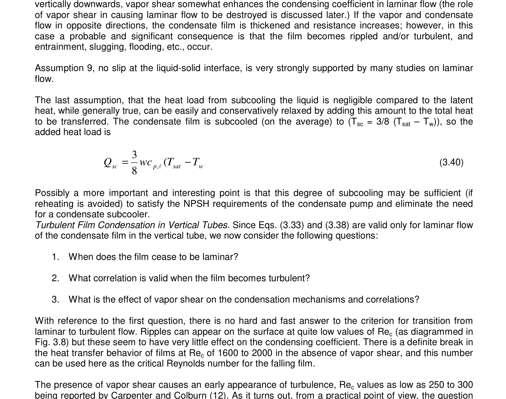

*图 3.8：理想化垂直膜状冷凝，显示层流膜、波纹层流膜和湍动趋势。*

蒸汽剪切会使湍动更早出现，Carpenter 和 Colburn 报告 Rec 可低至 250 到 300。实际设计中，该问题并不严重，因为计算得到的系数大小本身会显示应采用哪种流动区。

在湍流液膜且蒸汽剪切较低时，冷凝传热可由 Colburn 基于单相湍流中热量与动量传递类比建立的基本分析关联。Colburn 方法需要数值积分得到平均系数，最终结果通常以图表示。为此，可把 Nusselt 解以无量纲形式绘制，在对数坐标上斜率为 -1/3，Rec = 1 时截距为 1.47。Colburn 解也可在同一坐标上绘制，并以液相 Prandtl 数为参数，得到图 3.9。

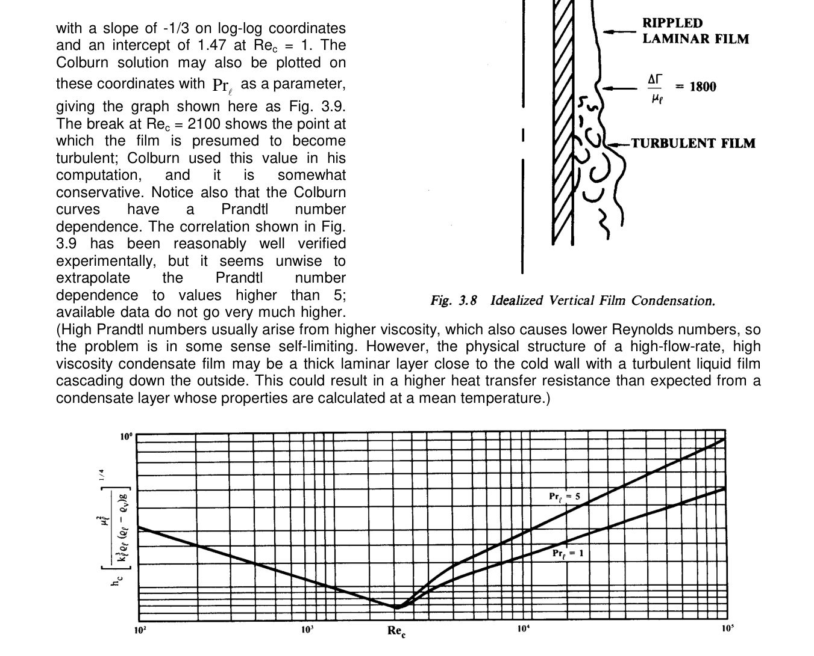

*图 3.9：按冷凝液 Reynolds 数表示的冷凝膜传热关联，含 Nusselt 和 Colburn 形式。*

图中 Rec = 2100 的断点表示假定液膜进入湍流；Colburn 计算采用此值，略偏保守。Colburn 曲线还具有 Prandtl 数依赖性。图 3.9 已得到相当程度实验验证，但不宜把 Prandtl 数依赖性外推到高于 5 的值，因为可用数据并不高太多。高 Prandtl 数通常来自较高黏度，也会使 Reynolds 数下降，所以问题某种程度上自限。但高流量、高黏度冷凝液膜的物理结构可能是在冷壁附近存在厚层流层，而外侧有湍动液膜瀑落；这可能导致热阻高于按平均温度物性估算的冷凝层。

#### 蒸汽剪切控制的垂直管内冷凝

对垂直管内蒸汽剪切控制冷凝，文献中有多种方法。Carpenter 和 Colburn 对该问题进行了第一项较全面实验研究，并用以下形式关联平均系数：

原式截图：[eq-3-41-original.png](./assets/eq-3-41-original.png)、[eq-3-42-original.png](./assets/eq-3-42-original.png)、[eq-3-43-original.png](./assets/eq-3-43-original.png)、[eq-3-44-original.png](./assets/eq-3-44-original.png)

其中 Gv,i 和 Gv,o 分别为入口和出口蒸汽相表观质量速度。若干燥饱和蒸汽进入并完全冷凝，则 Gv,m = 0.58 Gv,i。

存在许多其他高蒸汽剪切冷凝关联式，其中一些更准确。但更准确的方法也更难使用，并且对空气冷却冷凝器通常不需要，因为冷凝侧不是控制热阻。

Carpenter-Colburn 关联只在蒸汽剪切控制液膜水动力并因此控制传热时有效。若蒸汽剪切不控制，该关联会给出不现实的低系数。因此选用规则为：分别用重力控制关联式和蒸汽剪切控制关联式计算冷凝系数，取较高值。

#### 水平管内层流膜状冷凝

前述垂直管分析中使用的假设基本也可用于水平管内冷凝。两者本质差别是：水平管中有效重力分量 g sin θ 随管周位置变化；冷凝液会在管底形成液池，如图 3.10 所示，使该部分管面失效。

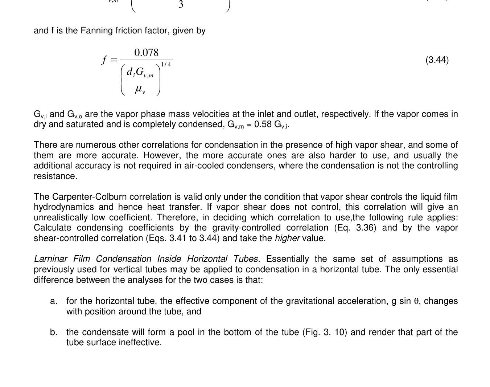

*图 3.10：水平管内 Nusselt 冷凝，显示排液液膜和底部冷凝液池。*

被液池影响的表面积比例取决于冷凝液物性、冷凝速率、管子几何和冷凝液排出方式。若无液池，Nusselt 分析得到水平管内传热系数式：

原式截图：[eq-3-45-original.png](./assets/eq-3-45-original.png)

Kern 将该式改写为引入每管冷凝液质量流量 Wt、消去温差并考虑液池惩罚的形式：

原式截图：[eq-3-46-original.png](./assets/eq-3-46-original.png)

仍有更精细方程，但附加精度通常不是必要的。式 (3.46) 只适用于低蒸汽剪切速率。

高冷凝负荷时，蒸汽剪切占主导，关联式应与管子方向无关，实验也确实如此。因此高蒸汽剪切冷凝系数可用前述 Carpenter-Colburn 式 (3.41) 到式 (3.44) 计算。

给定工况下选用哪个关联式，依据如下逻辑：低管负荷时流型、水动力和传热由重力主导；高管负荷时由蒸汽剪切主导。两个极限都有可用关联式；若把某一关联式用于不适合的情况，它会给出相对偏低的系数。因此当不确定时，同时用式 (3.41) 到式 (3.44) 与式 (3.46) 计算，取较高 hc。

#### 倾斜管内膜状冷凝

对于垂直和水平管内冷凝，前文已经说明：高速度下蒸汽剪切控制时管向不重要；若倾斜管中蒸汽向较低端流动，预计也一样。在重力控制区域，倾斜会产生影响。公开文献中关于这一问题的信息很少，原书只能提出一种能反映主要影响并回到正确极限的程序。

从垂直管 θ = 0 开始，随着 θ 增大，作用于排液膜的有效重力分量按 g cos θ 减小。因此建议在重力控制区域，对倾斜管冷凝传热系数使用图 3.9 时，把纵坐标中的 g 替换为 g cos θ。

但若把该过程推到近水平管，θ 接近 90°，cos θ 接近 0，hc 会趋于 0，这不符合物理实际。hc 不太可能低于同负荷水平管值；实际上，即使几度向下坡度，也应显著帮助排液，并使系数高于水平管。因此对倾斜管 hc 的下限，保守取同负荷水平管式 (3.46) 给出的值。

此外，每一情况都应计算式 (3.41) 到式 (3.44) 的 hc。若该值高于前述重力控制计算值，则可认为流动主要处于蒸汽剪切控制区，并采用较高 hc。

### 3.2.3 Mean Temperature Difference for In-Tube Condensation

### 3.2.3 管内冷凝的平均温差

#### 纯饱和蒸汽的 MTD

空气冷却换热器中冷凝纯饱和蒸汽时，正确的平均温差通常为对数平均温差，热侧恒定温度采用名义冷凝压力下蒸汽饱和温度 Tsat：

原式截图：[eq-3-47-original.png](./assets/eq-3-47-original.png)

严格说，该式仅在总传热系数恒定、冷凝流体等温、无去过热或过冷、蒸汽压降相对绝对压力很小时成立。实际中这些限制通常不严重。冷凝过程通常只占总传热阻的一小部分，因此总传热系数围绕平均值变化不大；平均值可用平均冷凝系数计算，或在某些关联式中用平均干度处冷凝系数计算。去过热和过冷处理见后文。

若冷凝过程中压降不可忽略，可近似放宽条件：先按入口和出口压力求饱和温度 Tsat,i 与 Tsat,o，再计算 LMTD：

原式截图：[eq-3-48-original.png](./assets/eq-3-48-original.png)

最后用：

原式截图：[eq-3-49-original.png](./assets/eq-3-49-original.png)

$$
MTD=F(LMTD)
\tag{3.49}
$$

其中 F 从第 4 章曲线读取。只有当温度接近不太小且冷凝蒸汽压降相对较小时，该程序才合理。空气冷却冷凝器通常满足这两个条件。

多数空气冷却冷凝器设计为单程冷凝，从一个管箱到另一个管箱。若不这样做，液相和蒸汽相会在转弯管箱中分离并分布不均，导致某些管蒸汽过多而可能不能完全冷凝，另一些管液体过多而过冷过度。

不过，单程冷凝通常仍包含若干垂直管排。空气从一排到下一排逐渐升温，局部温差和冷凝速率相应降低。这意味着若最底排管中蒸汽刚好完全冷凝且不过冷，则上排管中的蒸汽可能未完全冷凝，造成蒸汽损失。

为避免这种情况，Mueller 推导了一个安全系数，用于保证进入上排管的蒸汽在管末完全冷凝，从而使下排冷凝液出现一些过冷：

原式截图：[eq-3-50-original.png](./assets/eq-3-50-original.png)、[eq-3-51-original.png](./assets/eq-3-51-original.png)

热面积或管长先按每排冷凝负荷均匀计算，然后乘以 E，即可得到保证顶排完全冷凝所需的总面积和附加管长。

#### 去过热

若进入冷凝器的蒸汽为过热蒸汽，则必须先移除过热显热并通过冷却表面传出，蒸汽才能冷凝。若冷表面高于蒸汽饱和温度，则热量以对流显热传热方式移除，可用第 2 章按蒸汽物性计算的关联式。若冷表面低于现有压力下饱和温度，则蒸汽会直接在表面冷凝，冷凝液-蒸汽界面处基本处于热力学平衡，从过热状态到饱和状态的温度梯度发生在界面附近蒸汽层中。

现有资料表明，直接从过热蒸汽冷凝时的传热系数，与从饱和蒸汽冷凝的系数相差只有几个百分点，且都用蒸汽饱和温度作为传热驱动力。这一巧合对去过热冷凝器设计很有用。

判断暴露于过热蒸汽的冷表面是否会发生冷凝，可先假定热量由过热蒸汽以显热传热方式传出。若 Tv 是局部蒸汽温度，Tsat 是冷凝或饱和温度，t 是局部冷却剂温度，则蒸汽侧壁温计算值 T′w 为：

原式截图：[eq-3-52-original.png](./assets/eq-3-52-original.png)

若 T′w 大于 Tsat，不会冷凝，T′w 等于真实壁温，传热率按显热总传热系数计算。若 T′w 小于 Tsat，则会发生冷凝，传热率按冷凝总传热系数和 Tsat - t 计算，真实内表面温度由下式给出：

原式截图：[eq-3-53-original.png](./assets/eq-3-53-original.png)

进一步说，令 U+ 为壁阻、翅片阻、冷却剂和污垢等合成热阻对应的总系数。U+ 基本不依赖热流，也不依赖管内是否发生冷凝。显热去过热情形的热流为 U+(T′w - t)，冷凝情形为 U+(Tw - t)。由于 T′w 不小于 Tw，除非显热传热方式能够获得更高热流，否则冷凝会直接从过热蒸汽发生。由此可得一个实用推论：假定过热蒸汽直接冷凝，用饱和温度和冷凝传热系数进入速率方程，并把显热加入热负荷，既简单又保守，因为会算出较大冷凝面积。

若去过热负荷占总热负荷很大，设计者可能希望利用显热去过热更高热流带来的面积节省。但这相当复杂，因为必须在两个方向上同时满足热平衡和速率方程：沿管束高度方向和沿管长方向逐步计算。这严格属于计算机求解问题；已有专有程序可用于校核和设计。仍须记住，程序结果只和数据基础、工程师及系统分析人员的建模能力一样可靠，即便最佳方法也有相当不确定性。

#### 冷凝液过冷

除冷凝过程本身带来的几度过冷外，实际中常希望进一步过冷冷凝液。可让冷凝液通过空气冷却器底部一排或多排管实现。

该问题的精确热分析很复杂，只能用计算机程序完成。近似计算可把冷凝和过冷看成两个串联换热器。先按第 4 章空气冷却方法计算空气通过过冷管后的混合平均温度，再把该混合平均空气温度作为冷凝段入口空气温度，并按本章方法设计冷凝段。

有几项重要注意事项。第一，离开过冷段的空气温度沿管长变化，这会改变冷凝模式：相比混合平均假设，一端局部温差和局部冷凝率增加，另一端降低。该影响有抵消趋势，但净结果是否保守取决于具体问题。过程流体温度越接近空气温度，方法绝对误差越大。

第二，空气冷却器的设计和机械布置几乎肯定由冷凝过程主导。因此能达到的过冷程度受冷凝过程条件支配，而不是独立可控。若要求精确控制冷凝液过冷，最好设置单独换热器，其操作条件可独立调节。

## 3.3 Condensation of Vapor Outside Low- and Medium-Finned Trufin

## 3.3 低翅片和中翅片 Trufin 管外蒸汽冷凝

本节讨论低翅片和中翅片 Trufin 管在冷凝发生于管外翅片表面时的应用，包括去过热和过冷。

典型管外冷凝应用包括：

- 用冷却水冷凝空调、制冷和低温工艺系统中的制冷剂。典型制冷剂传热系数约 150 到 500 Btu/hr ft2 °F，而水侧系数通常为 1000 到 1500，因此把 Trufin 用在冷凝侧优势明显。
- 用水冷冷凝器冷凝精馏塔顶流。塔顶流可基本为单组分，也可含许多组分。无论哪种，冷凝系数通常低于水侧系数一半。
- 若多组分混合物或含非凝气蒸汽的冷凝温度范围很宽，剩余气体或蒸汽的显热冷却可能占总传热相当大一部分。这种显热传热系数几乎总是低于冷却剂系数，甚至低于冷凝系数，使采用 Trufin 更有吸引力。
- 用非水冷却剂冷凝蒸汽。此时两侧系数可能接近，标准 Trufin 看似优势不大。但 Turbo-Chil 这类双侧强化管既有外翅片，又有内螺旋肋，可同时强化管侧系数和管外冷凝，显著减小换热器尺寸。

不推荐 Trufin 用于水蒸气即蒸汽冷凝。由于水表面张力高，冷凝液会跨越翅片间隙，在管外保留厚液层，严重降低有效传热系数。该应用可考虑 Koro-dense。

### 3.3.1 Shell and Tube Heat Exchangers for Condensing Applications

### 3.3.1 冷凝应用中的管壳式换热器

管壳式换热器提供了一种机械可行方式，可在相对紧凑体积内提供大传热面积。其构型足以承受过程和动力工业中常见的大范围操作条件，并有大量设计选项以满足多数需求。

基本管壳式换热器结构已在第 1 章说明，本章不重复。但冷凝应用中有若干特殊构型值得讨论。

图 3.11 是过程工业中典型管壳式冷凝器。冷凝发生在壳侧，蒸汽从一端喷嘴进入，冷凝液从另一端壳体底部喷嘴排出。冷凝液出口端还设有非凝气放空口。按 TEMA 记号，该构型为 E 壳。图中为固定管板、两管程冷却剂布置。截面 A-A 所示折流为最常见构型：垂直切口弓形折流板，底部开槽，以便冷凝液从一个隔室排至下一个隔室，最后到达冷凝液出口。

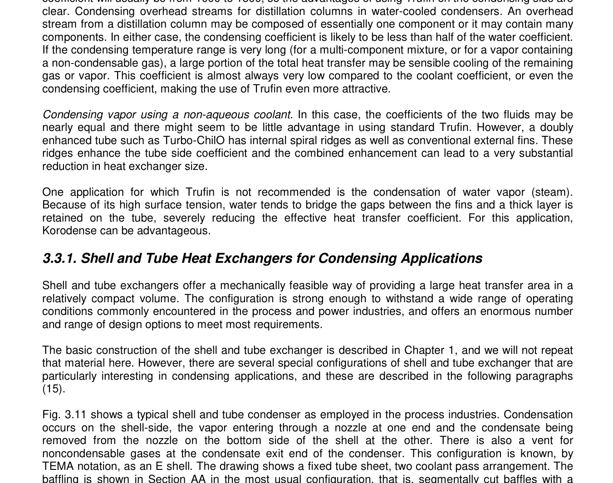

*图 3.11：用于壳侧冷凝的管壳式换热器，一壳程、两管程。*

近来也有采用水平切口折流板的趋势，使两相流必须向上越过折流板。该布置被认为可降低壳侧分层和液相分离的可能，但代价是压降增加。蒸汽入口处几乎总会设置防冲板，以保护靠近蒸汽喷嘴的管子免受蒸汽夹带液滴冲蚀。

热回收服务中，例如进料-出料换热器，经常需要在多个串联换热器中完成冷凝。此时通常优选堆叠水平 E 壳进行壳侧冷凝，如图 3.12。该布置降低但不能消除相分离及其对多组分汽液平衡曲线的扭曲。仍应选择合适折流板间距和切口，以保持蒸汽速度较高；各壳体折流几何也可能不同。

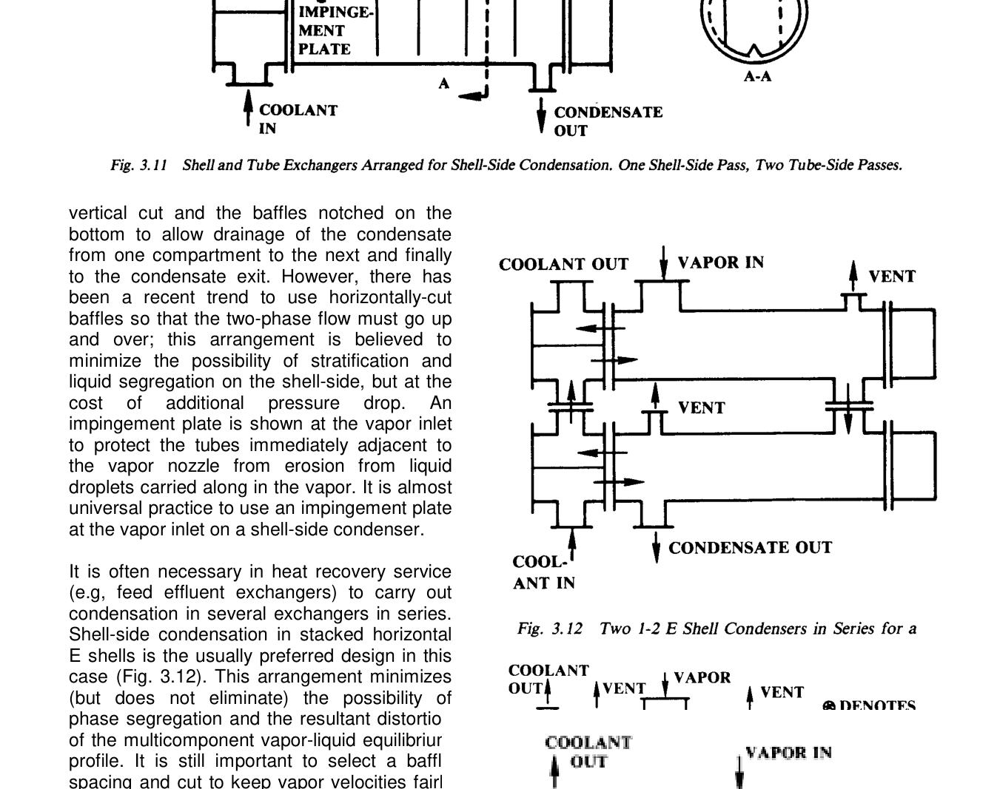

*图 3.12：两台 1-2 E 壳冷凝器串联用于冷凝。*

图 3.13 为另一种壳侧冷凝构型，TEMA 记号为 G 壳。流体从中心蒸汽入口分为两股，沿纵向折流板引导，较对称地流向两端；随后在端部折流区转向，通过下部管场返回，冷凝液从冷凝器中央热井排出。标准做法仍是采用垂直折流切口，使流动横向穿过管束。

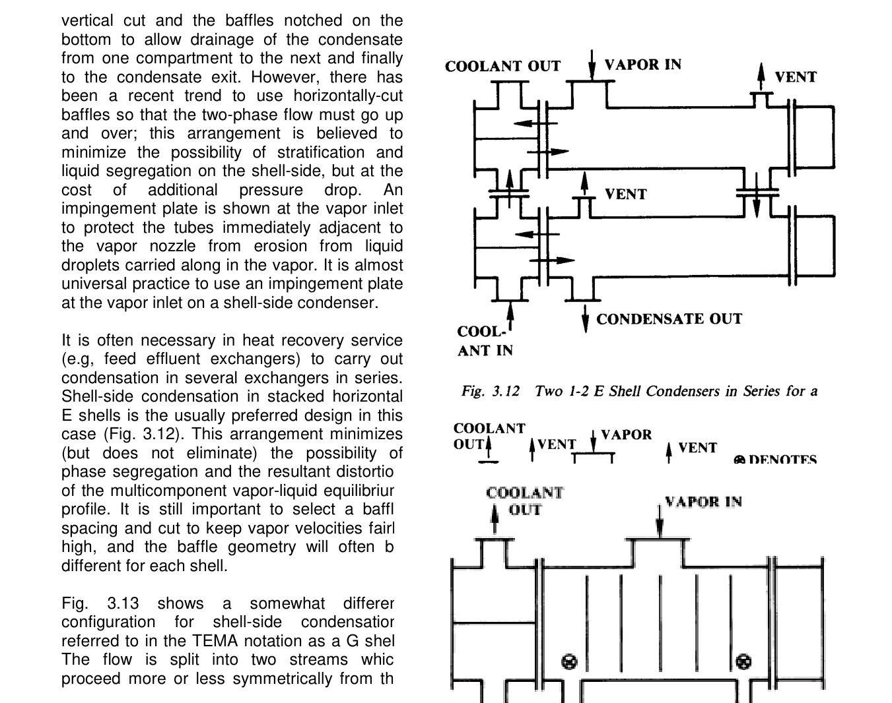

*图 3.13：用于壳侧冷凝的 G 壳构型。*

图 3.14 为 TEMA J 壳冷凝器。折流切口通常为垂直。与对应 E 壳相比，J 壳把流量分开并把流动距离减半，因此压降可降低 60% 到 80%，这在真空服务中尤其重要。但两个区段温度曲线并不相同，需要仔细分析。

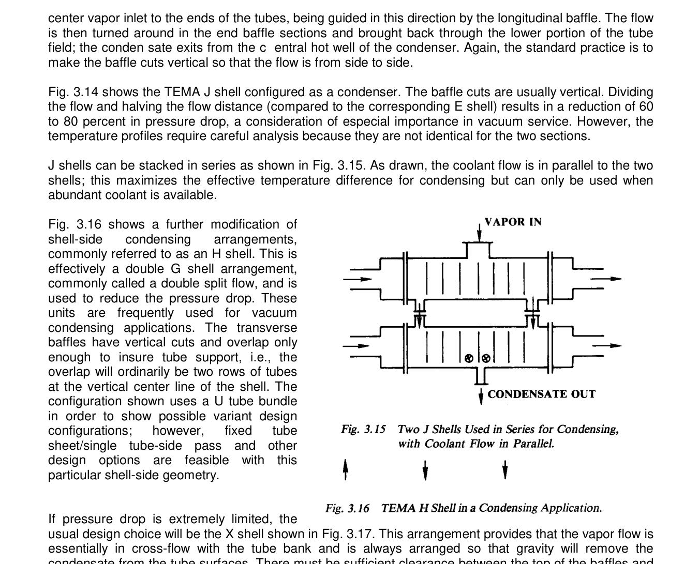

*图 3.14：TEMA J 壳作为冷凝器。*

J 壳可按图 3.15 堆叠串联。图示中冷却剂对两壳并联流动，这会使冷凝有效温差最大，但只有冷却剂充足时才能采用。

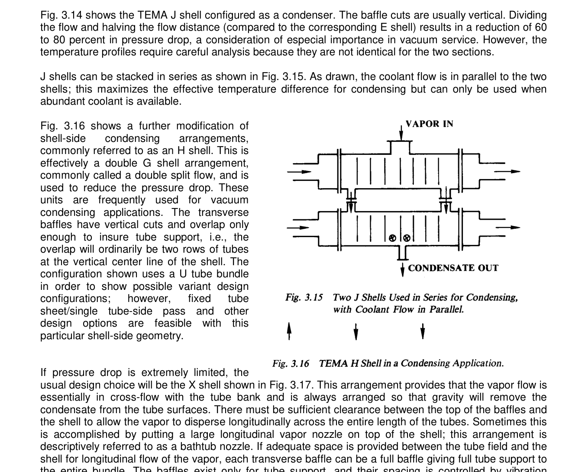

*图 3.15：两台 J 壳串联用于冷凝，冷却剂并联流动。*

图 3.16 为壳侧冷凝布置的进一步变型，通常称为 H 壳。它等效于双 G 壳，也称双分流，用于降低压降。该类设备常用于真空冷凝。横向折流板有垂直切口，只重叠到保证管支撑所需程度；通常在壳体垂直中心线处重叠两排管。图示采用 U 形管束以展示可能设计变型，但固定管板、单管程以及其他设计选项也可与这种壳侧几何组合。

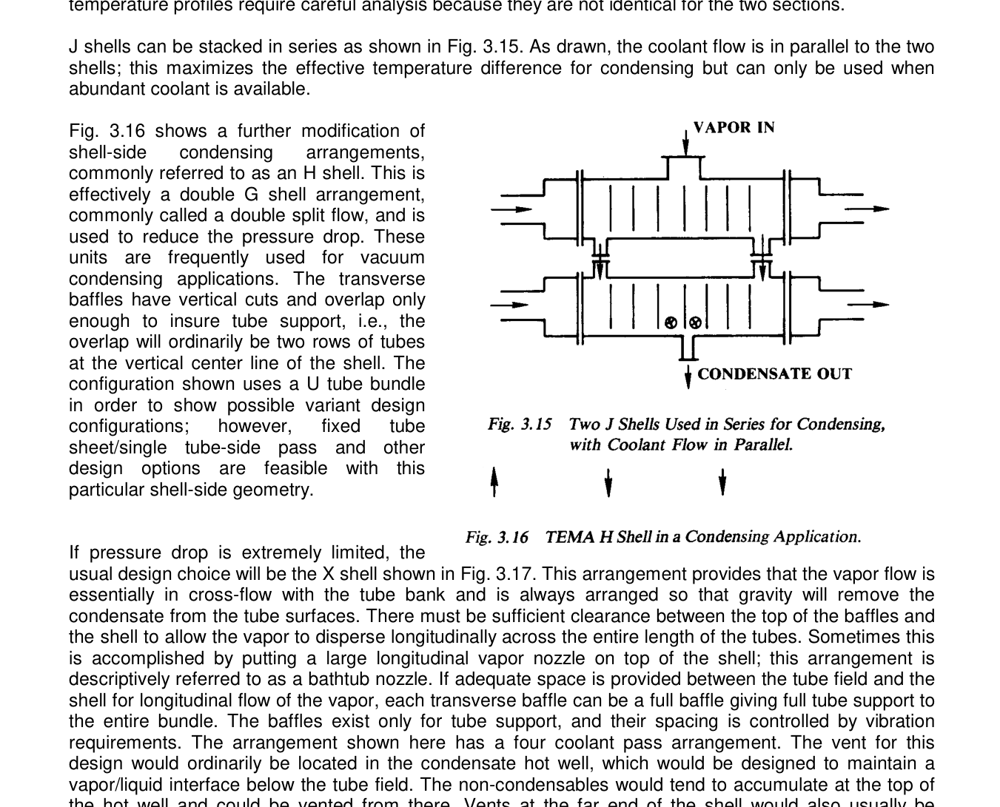

*图 3.16：TEMA H 壳用于冷凝。*

若压降限制极严，通常选择图 3.17 所示 X 壳。该布置使蒸汽基本横掠管束，并总是布置成让重力把冷凝液从管面排走。折流板顶部与壳体之间必须有足够间隙，使蒸汽沿管长全长分布。有时可在壳体顶部设置大型纵向蒸汽喷嘴，即所谓“浴盆喷嘴”。若管场与壳体之间有足够蒸汽纵向流动空间，每块横向折流板都可为全圆折流板，对整个管束提供完整支撑。此时折流板仅用于管支撑，其间距由振动要求控制。

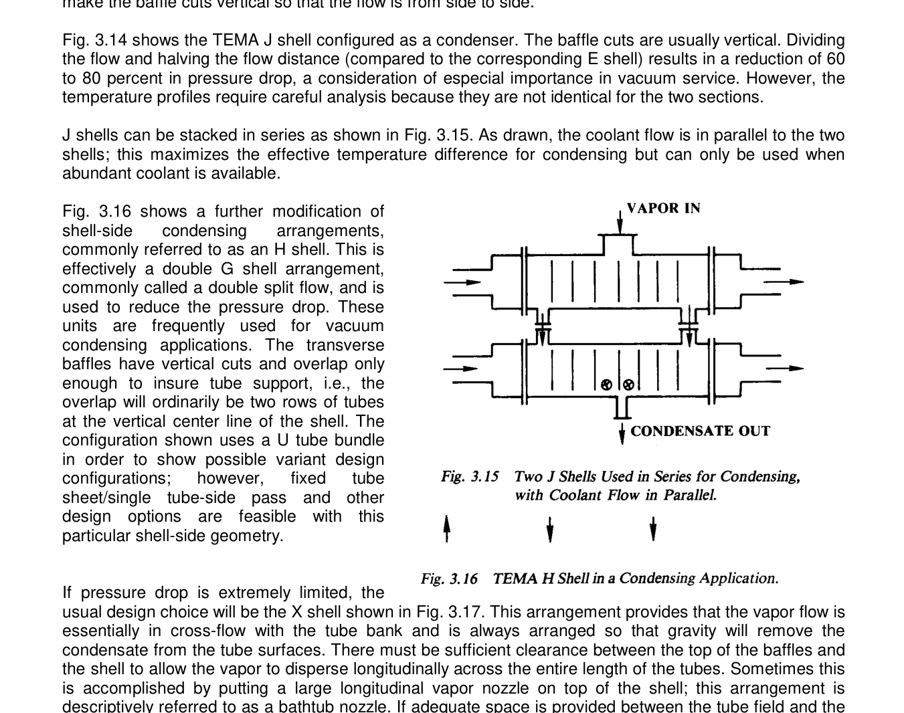

*图 3.17：TEMA X 壳用于冷凝。*

该图中为四管程冷却剂布置。该设计的放空口通常位于冷凝液热井中，热井应维持管场以下汽液界面。非凝气趋向聚集在热井顶部，可从那里放出。壳体远端通常也需设放空，以清除可能聚集且未被扫入热井的非凝气。

图 3.18 展示壳侧回流或 knockback 冷凝器，用于特殊需求。典型应用是部分冷凝宽冷凝范围的蒸汽-气体混合物。首先冷凝的液体可能为焦油状，但会溶解在管束顶部附近冷凝的较轻液体中。通过保持低气/汽速度，这对所有回流冷凝器都很必要，较轻液体不断向下排流并冲洗焦油物质。

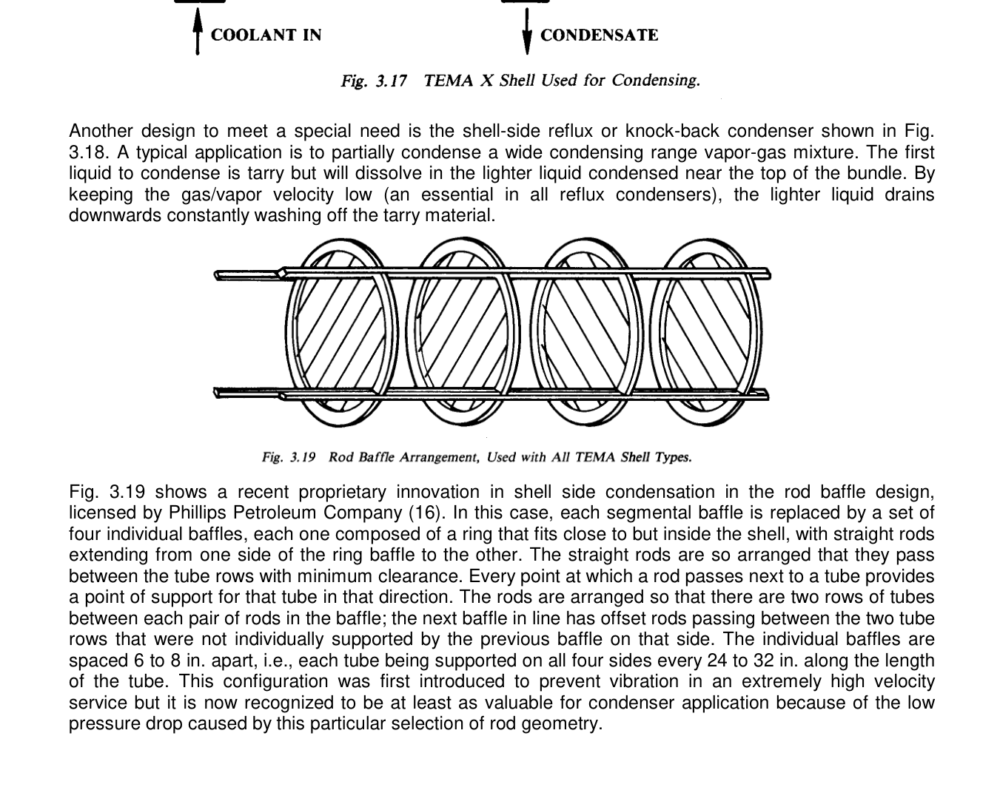

*图 3.18：壳侧回流或 knockback 冷凝器。*

图 3.19 是 Phillips Petroleum 授权的一种壳侧冷凝专有创新：杆式折流设计。每个弓形折流板被四个独立折流件代替，每个折流件由紧贴壳体内侧的环和从环一侧延伸到另一侧的直杆组成。直杆布置在管排之间，并与管子保持最小间隙。每个杆靠近管子的点都在该方向上支撑管子。每个折流件中的杆之间隔两排管；下一块折流件杆错开，支撑上一块未逐根支撑的管排。独立折流件间距为 6 到 8 in.，因此每根管沿长度每 24 到 32 in. 就在四侧得到支撑。该构型最初用于防止极高速度服务中的振动，现在也被认为非常适合冷凝器，因为选定杆几何带来低压降。

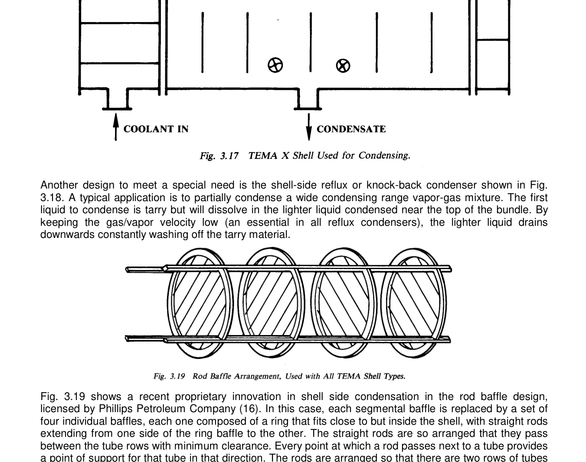

*图 3.19：杆式折流设计用于壳侧冷凝。*

图 3.20 显示冷凝侧可变折流板间距。其目的在于维持较高蒸汽速度，从而利用剪切增强冷凝传热系数。显然，若要有效采用该选项，需要较了解蒸汽剪切影响，并能预测壳侧两相流特性。该布置只适用于冷凝侧允许一定压降、以便保持足够高蒸汽速度取得剪切增强的场合。只要壳体出口端设放空口，非凝气排出很明确，因为蒸汽自然流动会把非凝气带到此处。有效使用该选项需要基于计算机的校核方法，本手册不展开细节。

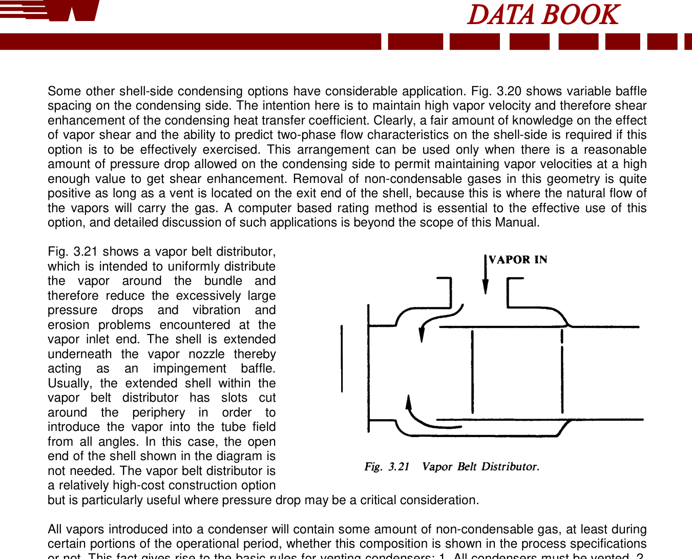

*图 3.20：冷凝侧采用可变折流板间距。*

图 3.21 为蒸汽带分布器，目的在于使蒸汽围绕管束均匀分布，减少蒸汽入口端过大压降以及振动和冲蚀问题。壳体在蒸汽喷嘴下方延伸，起到防冲板作用。通常，蒸汽带分布器内的延伸壳体会在周向开槽，使蒸汽从各个角度进入管场。这种情况下，图中所示开口端并不需要。蒸汽带分布器造价较高，但在压降可能关键时尤其有用。

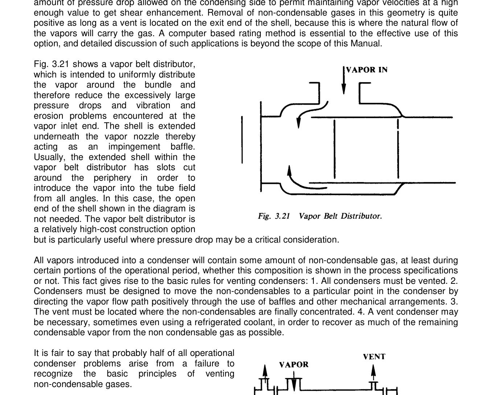

*图 3.21：蒸汽带分布器。*

所有进入冷凝器的蒸汽，在运行周期某些阶段都含有一定量非凝气，不论工艺规格中是否列出。这一事实给出了冷凝器放空的基本规则：所有冷凝器都必须放空；冷凝器必须通过折流板和其他机械布置明确引导蒸汽流路，把非凝气带到特定位置；放空口必须布置在非凝气最终聚集处；可能需要放空冷凝器，有时甚至要用制冷冷却剂，以尽可能从非凝气中回收剩余可冷凝蒸汽。

可以说，冷凝器运行问题大约有一半源于未认识非凝气放空的基本原则。

冷凝应用中常常需要过冷冷凝液。过冷要求可能只是几度以防泵汽蚀，也可能需要很多度以便把冷凝液冷却到适合常压长期储存的安全温度。最可靠方式是如图 3.22 另设单独过冷器。此时过冷器按单相换热器设计，设计方法比积分过冷精确得多；并且可单独控制过冷器冷却剂流量，更好控制流出液温。显然，其缺点是单独冷凝器加过冷器的初投资通常高于带积分过冷的冷凝器。

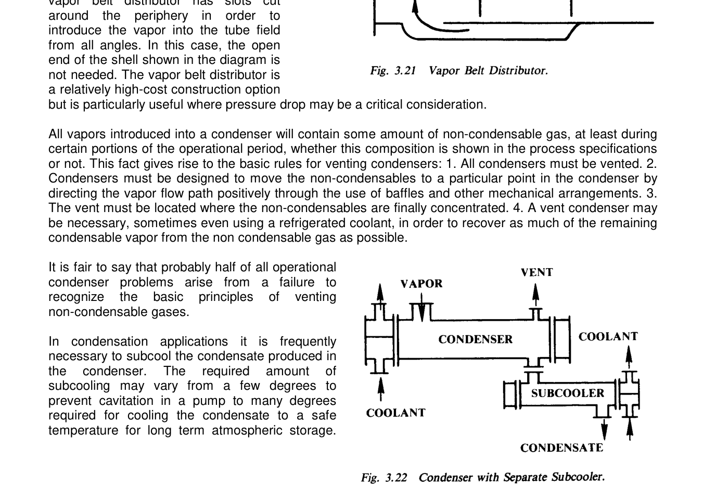

*图 3.22：冷凝器配单独过冷器。*

水平壳侧冷凝器中，可允许壳内形成分层液池，让入口冷却剂对其进行显热冷却，从而实现积分过冷，如图 3.23。需要某种液位控制，最好可调。该设计计算相当复杂且精度不高。

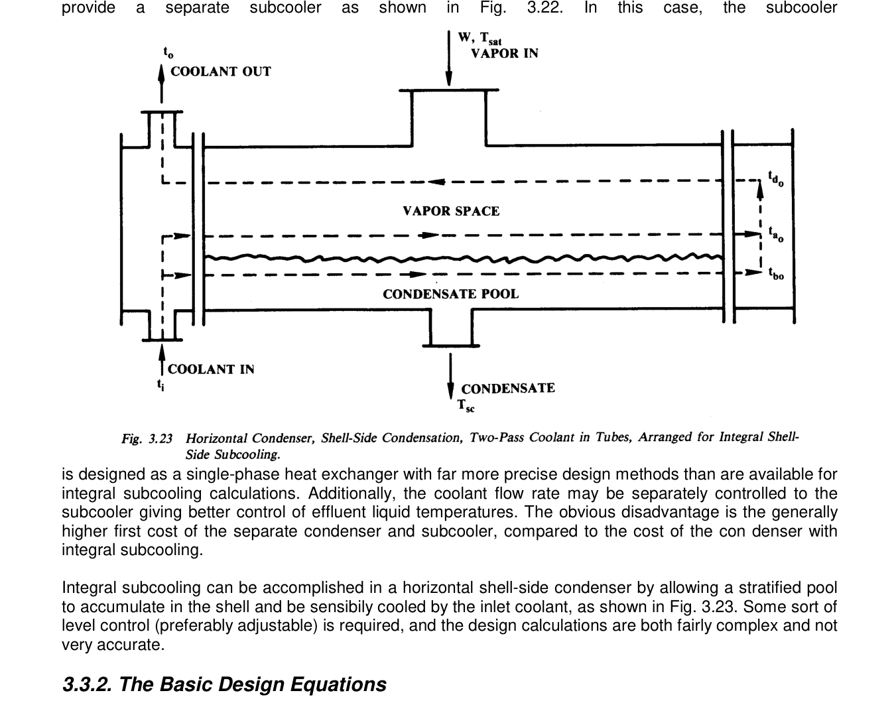

*图 3.23：水平壳侧冷凝器，两管程冷却剂，布置为壳侧积分过冷。*

### 3.3.2 The Basic Design Equations

### 3.3.2 基本设计方程

适用于管壳式换热器的基本方程已在第 1 章建立，本节只列出壳侧冷凝设计直接需要的部分。先限定为总传热系数恒定且平均温差概念假设成立的情况。多组分蒸汽或带非凝气蒸汽的冷凝不满足该要求，将在后文讨论。

基本设计方程为：

原式截图：[eq-3-54-original.png](./assets/eq-3-54-original.png)

$$
Q_T=U^*A^*(LMTD)
\tag{3.54}
$$

其中 QT 为总传热负荷，U* 是以参考面积 A* 为基准的总传热系数。A* 可取任何方便的传热面积，LMTD 为对数平均温差。

U* 最常以总管外传热面积 Ao 为基准，包括翅片面积，此时写作 Uo。它与各膜系数、壁阻等关系为：

原式截图：[eq-3-55-original.png](./assets/eq-3-55-original.png)

式中 ho 和 hi 分别为外侧和内侧膜传热系数，Rfo 和 Rfi 分别为外侧和内侧污垢热阻，Δxw 和 kw 分别为翅片段壁厚和壁导热系数，Rfin 为翅片导致的传热热阻。由于 Wolverine 制造的所有低翅片和中翅片 Trufin 都为整体管，即管与翅片为同一块金属，不需加入接触热阻。

ho 的合适关联式将在本节建立。hi 的关联式见第 2 章。翅片热阻和壁阻计算的方程与图表见第 1 章。

### 3.3.3 Mean Temperature Difference

### 3.3.3 平均温差

平均温差公式详见第 1 章，但在冷凝应用中必须谨慎使用。对一个特殊但重要的情况，即纯蒸汽或近纯蒸汽在冷凝侧压降低到可忽略时等温冷凝，LMTD 不但有效，而且形式大为简化。若冷凝温度为 Tsat，冷却剂入口和出口温度为 t1 和 t2，则 LMTD 即 MTD 为：

原式截图：[eq-3-56-original.png](./assets/eq-3-56-original.png)

严格说，多数冷凝传热关联式是局部热流或局部温差的函数，因此 LMTD 并非精确有效。不过实际工况中影响很小，工程实践中使用 LMTD 通常偏保守。

若正在冷凝多组分混合物、带非凝气蒸汽，或存在明显去过热、过冷效应，则 MTD/LMTD 形式不适用。这些情况需要专门技术，后文说明。

### 3.3.4 Condensation of a Superheated Vapor

### 3.3.4 过热蒸汽冷凝

常会遇到入口温度高于冷凝器内压力下饱和温度的蒸汽，例如非冷凝汽轮机排汽或节流阀后的蒸汽。文献中对过热蒸汽冷凝设计方法存在混淆，但下述论证通常被认为正确。

若进入冷凝器的蒸汽过热，则其显热必须先被移除并通过冷却表面传出，蒸汽才能冷凝。若冷表面温度高于蒸汽饱和温度，则热量通过对流显热传递，系数可用适用几何和蒸汽物性的关联式计算。若冷表面温度低于该压力下蒸汽饱和温度，则蒸汽直接在表面冷凝，冷凝液-蒸汽界面处基本热力学平衡，从过热状态到饱和状态的温度梯度位于界面附近蒸汽中。

可用资料表明，直接从过热蒸汽冷凝的传热系数，与饱和蒸汽冷凝的系数只差几个百分点，并且传热温差都用蒸汽饱和温度计算。

判断冷表面暴露在过热蒸汽中是否发生冷凝，先假设热量通过过热蒸汽显热传递。若 Tv 为局部蒸汽温度，Tsat 为冷凝或饱和温度，t 为局部冷却剂温度，则蒸汽侧表面温度 T′s 为：

原式截图：[eq-3-57-original.png](./assets/eq-3-57-original.png)

其中 hs 是蒸汽流显热传热系数，Us 是以 hs 计算的总传热系数。若 T′s 大于 Tsat，不发生冷凝，T′s 等于真实表面温度，传热率为 Us(Tv - t)。若 T′s 小于 Tsat，会发生冷凝，传热率为 Uc(Tsat - t)，其中 Uc 是假设发生冷凝时计算的总传热系数，真实表面温度为：

原式截图：[eq-3-58-original.png](./assets/eq-3-58-original.png)

本情形中，Uc 即式 (3.55) 给出的 Uo，其中 ho 为此处讨论的 hc。冷凝系数关联式见后文。

定义 U′ 为壁阻、冷却剂和污垢膜的组合传热系数。U′ 基本不依赖热流，也不依赖外表面是否发生冷凝。显热去过热情形热流为 U′(T′s - t)，冷凝情形热流为 U′(Ts - t)。由于 T′s 大于等于 Tsat 且不小于 Ts，显热热流高于冷凝热流。换言之，除非显热方式能获得更高热流，否则蒸汽会直接冷凝。由此可得：假定过热蒸汽直接冷凝、用饱和温度和冷凝传热系数进入速率方程，并把显热加入总负荷，既更简单也更保守。

### 3.3.5 Condensation with Integral Subcooling On the Shellside

### 3.3.5 壳侧带积分过冷的冷凝

冷凝液过冷常用于给泵提供 NPSH，或把产品冷却到可进入缓冲罐或储罐的温度。通常最好用单独的显热冷却换热器完成过冷。还应记住，膜状冷凝本身会使液膜过冷约 1/3 到 1/2 倍的 Tsat - Ts；若避免再热且泵位置合适，这种过冷可能已足够。

但有时，特别是只需中等程度过冷时，希望在水平冷凝器壳内设置一个区域，使冷凝液与入口冷却剂换热。此时需要一个理性的过冷面积计算方法。

参考图 3.23，液池表面画成基本水平，实际中压力差可能造成显著静压坡度。因此后文计算的 F 应理解为被淹没管子的有效分数。

缺乏更好知识时，可保守假定液池等温，温度为所需过冷温度 Tsc。这样冷凝器可看作两段组成：壳侧温度为 Tsat 的冷凝区，以及壳侧温度为 Tsc 的过冷区。过冷区中，冷却剂沿长度方向的热负荷和温度分布为：

原式截图：[eq-3-59-original.png](./assets/eq-3-59-original.png)、[eq-3-60-original.png](./assets/eq-3-60-original.png)

求解可得任意距离 x 处冷却剂温度：

原式截图：[eq-3-61-original.png](./assets/eq-3-61-original.png)

在管端 x = L 时，t 为该程出口温度。图 3.23 中，对被淹没第一程管为 tbo。冷凝区也有类似方程，可得第一程中处于冷凝服务管子的出口温度 tao。在回程处，第一程两股流假定完全混合，按热平衡得到 tdo，作为下一程入口温度。

使用式 (3.61) 时，可把 aL 视为每根管面积且 w 为每根管冷却剂流量，也可把 aL 视为一程所有管子的总面积且 w 为总冷却剂流量。下面计算方案采用后一种观点，并利用两管程且每程管数相等时 aL = AT/2。

该算法先估计总面积，然后判断最终冷却剂出口温度是否等于热平衡要求；再调整总面积直到温度匹配。由于初始估算很粗，若 F 接近 1，第一次计算可能进入错误分支；这可在计算过程中检查发现，并在步骤 9 或 15 重新估计 AT。

计算步骤如下。

1. 计算热负荷：

原式截图：[eq-3-62-original.png](./assets/eq-3-62-original.png)、[eq-3-63-original.png](./assets/eq-3-63-original.png)

2. 计算冷却剂流量：

原式截图：[eq-3-64-original.png](./assets/eq-3-64-original.png)

3. 估算总面积：

原式截图：[eq-3-65-original.png](./assets/eq-3-65-original.png)

4. 计算第一程被淹没管子的出口温度：

原式截图：[eq-3-66-original.png](./assets/eq-3-66-original.png)

5. 计算第一程中需要淹没的管子分数 F：

原式截图：[eq-3-67-original.png](./assets/eq-3-67-original.png)

若 F 大于 1，说明整个第一程都应淹没，直接转步骤 10。

6. 计算第一程未淹没管子的出口温度：

原式截图：[eq-3-68-original.png](./assets/eq-3-68-original.png)

7. 计算第一程所有管子混合平均出口温度：

原式截图：[eq-3-69-original.png](./assets/eq-3-69-original.png)

8. 计算第二程出口温度，即冷凝器出口冷却剂温度：

原式截图：[eq-3-70-original.png](./assets/eq-3-70-original.png)

9. 判断 t*o 是否等于给定 to。若相等，则总冷凝-过冷面积为 AT，第一程中 F 分数管子应淹没；若不相等，重新假定 AT 回到步骤 4。

若步骤 5 发现 F 大于 1，则采用以下分支：

10. 计算第一程全部淹没时出口温度：

原式截图：[eq-3-71-original.png](./assets/eq-3-71-original.png)

11. 计算第二程中被淹没管子的出口温度：

原式截图：[eq-3-72-original.png](./assets/eq-3-72-original.png)

12. 计算第二程中处于冷凝服务管子的出口温度：

原式截图：[eq-3-73-original.png](./assets/eq-3-73-original.png)

13. 计算第二程处于冷凝服务的管子分数 F′：

原式截图：[eq-3-74-original.png](./assets/eq-3-74-original.png)

14. 计算第二程所有管子的混合平均出口温度：

原式截图：[eq-3-75-original.png](./assets/eq-3-75-original.png)

15. 判断 t*o 是否等于给定 to。若相等，则总冷凝-过冷面积为 AT，两程中除 F′ 对应部分外均被淹没，即总管数中 1 - F′/2 分数被淹没；若不相等，重新假定 AT 回到步骤 10。

若冷凝-过冷器采用 U 形管，第一程末端管侧流体不发生混合。假定所有管子长度相同且有效传热面积相同；这并不严格真实，但方便且误差在本问题及其他 U 形管应用正常范围内。前六步与前述分析相同，然后按以下步骤进行：

7. 计算第一程被淹没的那些管子在第二程出口的温度：

原式截图：[eq-3-76-original.png](./assets/eq-3-76-original.png)

8. 计算第一程处于冷凝服务的那些管子在第二程出口的温度：

原式截图：[eq-3-77-original.png](./assets/eq-3-77-original.png)

9. 计算第二程所有管子的混合平均出口温度，即冷凝器出口温度：

原式截图：[eq-3-78-original.png](./assets/eq-3-78-original.png)

9A. 判断 t*o 是否等于给定 to。若相等，则总冷凝-过冷面积为 AT，第一程中 F 分数管子被淹没；若不相等，重新假定 AT 回到步骤 4。该 U 形管情形下对应“第一程全部淹没”的步骤 10 到 15 与前述情况相同。

### 3.3.6 Filmwise Condensation on Plain and Trufin Tubes

### 3.3.6 光管和 Trufin 管上的膜状冷凝

管外冷凝方程的建立仍基于 Nusselt 模型和前文管内冷凝分析中讨论的假设。水平管内冷凝得到式 (3.45)；把该式中的 di 替换为 do，即可得到管外水平单管冷凝系数：

原式截图：[eq-3-79-original.png](./assets/eq-3-79-original.png)

其中 hc 为管外平均冷凝传热系数。kl 和 μl 分别为冷凝液导热系数和黏度，ρl 与 ρv 分别为冷凝液和蒸汽密度，λ 为冷凝潜热，g 为重力加速度，do 为管外径，Tsat 为蒸汽饱和温度，Tw 为壁温。

该式也可写为：

原式截图：[eq-3-80-original.png](./assets/eq-3-80-original.png)

其中 L 是管长，W 是单位时间内在该管上冷凝的蒸汽质量。也可写成其他形式。

这些方程对水平单根光滑圆管的实际传热系数预测相当接近，平均约比实验值低 15%。差异通常归因于液膜波动、早期湍动以及管底排液不稳定。经一定修改后，这些方程也可用于预测 Trufin 管冷凝系数。

Beatty 和 Katz 研究了水平低翅片管冷凝，发现数据可由式 (3.79) 修改形式关联：

原式截图：[eq-3-81-original.png](./assets/eq-3-81-original.png)

其中等效直径相关项由下式给出：

原式截图：[eq-3-82-original.png](./assets/eq-3-82-original.png)

Φ 为翅片效率，Afin 为总翅片面积，Aeq 为翅片管等效外面积，Aroot 为按根径计算的光管外面积，dr 为根径。L 的定义为：

原式截图：[eq-3-83-original.png](./assets/eq-3-83-original.png)

其中 afin 为单个翅片单面面积：

原式截图：[eq-3-84-original.png](./assets/eq-3-84-original.png)

翅片效率可按下式计算：

原式截图：[eq-3-85-original.png](./assets/eq-3-85-original.png)、[eq-3-86-original.png](./assets/eq-3-86-original.png)

总翅片面积、等效面积和根部面积分别由下式给出：

原式截图：[eq-3-87-original.png](./assets/eq-3-87-original.png)、[eq-3-88-original.png](./assets/eq-3-88-original.png)、[eq-3-89-original.png](./assets/eq-3-89-original.png)

上述方程组可较准确地计算 Trufin 管冷凝传热系数，但使用繁琐。实践中发现，采用更简单方法也能得到近似同样好结果：用式 (3.79)，把直径取为根径 dr，并把算得的 hc 应用于整个外部翅片面积 Ao：

原式截图：[eq-3-90-original.png](./assets/eq-3-90-original.png)

也可用式 (3.80) 计算 ho。原则上，使用这些方程都需要试算，实际程序在后面例题中示范。

应用所有这些方程时必须记住：Trufin 管不应用于冷凝蒸汽。水表面张力高，冷凝液膜会跨越翅片间隙，被厚液层滞留在管上并起绝热作用；单位管长传热率会显著低于光管。表面张力达到何值时该效应变得重要尚不明确。表面张力 25 到 30 dyne/cm 的冷凝液已有在翅片管上成功冷凝的经验，包括烃、醇、制冷剂等常见设计范围，其表面张力约 10 到 25 dyne/cm。但大气压水的表面张力约 60 dyne/cm，冷凝会受到严重惩罚；中间范围似乎没有公开数据或经验。

### 3.3.7 Filmwise Condensation on Tube Banks

### 3.3.7 管束上的膜状冷凝

#### 1. 管排数影响

实际冷凝器中，上部管子形成的冷凝液会落到下方管子上，并可能改变传热系数。Nusselt 假定每一后续管上的液膜仍保持不扰动层流，理论上得到水平光管管束平均冷凝传热系数：

原式截图：[eq-3-91-original.png](./assets/eq-3-91-original.png)

$$
h_{c,N}=h_{c,1}N^{-1/4}
\tag{3.91}
$$

其中 hc,1 为按前述方程计算的单排系数，N 为一个垂直列中的管子数。合理尺寸过程冷凝器中，N 可为 20 或 30，该式相对单管预测出很严重的惩罚。Kern 对光管建议指数 -1/6。然而 Short 和 Brown 实验发现，在一列 20 根管高的单排中，相对单管系数没有净惩罚。

后者与过程经验更一致，因此当前设计实践是假定整个管束平均系数与单管相同。通常解释是：从一根管落到下一根管的液体造成波动、飞溅和湍动，抵消了各管液体负荷增加可能带来的不利影响。

#### 2. 蒸汽剪切影响

众所周知，高速横掠管子的蒸汽可使传热系数显著高于 Nusselt 重力排液模型。但用于估计该效应大小的数据极少，且多为专有数据。图 3.24 是常被引用的曲线，表示蒸汽 Reynolds 数高于约 30,000 后，传热系数超过 Nusselt 值；在 Rev = 100,000 时可达约 10 倍。

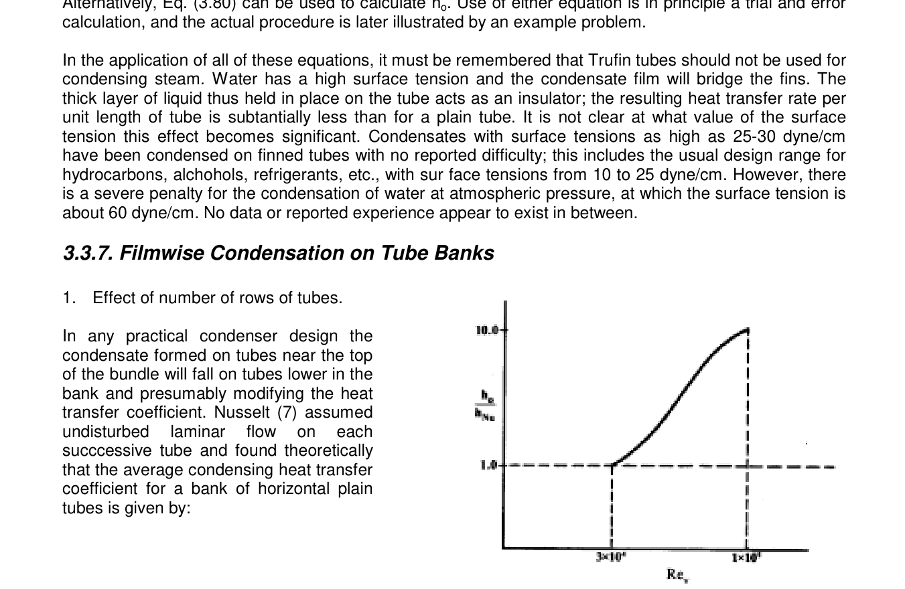

*图 3.24：蒸汽剪切对管束冷凝传热的影响。*

但这些数据全都来自光管管束，并且蒸汽速度常高到需要过大压降才能取得显著改善。在更多数据可用以前，稳妥做法是按纯重力排液计算冷凝系数，不把蒸汽剪切增强计入设计。

### 3.3.8 Pressure Drop during Shell Side Condensation

### 3.3.8 壳侧冷凝压降

关于管壳式换热器壳侧冷凝压降的公开数据很少。Diehl 和 Unruh 对若干理想管束中的两相绝热压降进行了关联，包含垂直向下流和水平横流。Brooks 在若干假设基础上从 Diehl-Unruh 关联出发，得到一个修正因子，用来把全蒸汽流壳侧压降转换为入口为饱和蒸汽、出口干度为 xo 的冷凝器压降。该图即图 3.25。

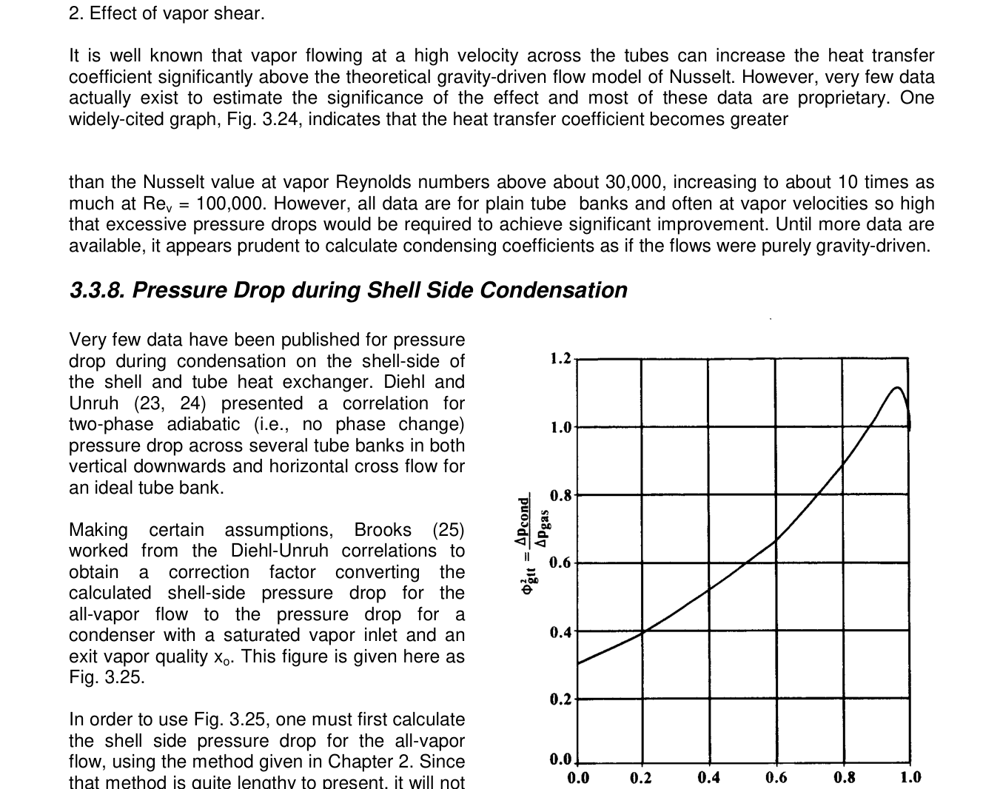

*图 3.25：壳侧冷凝器压降修正因子。*

使用图 3.25 时，先按第 2 章方法计算全蒸汽流的壳侧压降。由于该方法较长，本节不重复。然后按出口干度从图 3.25 读取修正因子 Φ2gtt，把全蒸汽流压降乘以该因子，得到冷凝器压降。

图 3.25 的建立包含若干重要假设：

1. 壳侧蒸汽流始终为湍流。
2. 所有管束布置具有相同修正因子。Diehl 和 Unruh 发现，在液体较多的末端，45° 管束压降略高于 60° 和 90° 管束，但此时压力梯度较小；本曲线取结果平均。
3. 两相流对窗口区压降的影响与横流区类似。
4. 冷凝率沿管束长度恒定。若部分冷凝器入口附近冷凝率更高，实际压降应低于图 3.25 估计；反之亦然。

应认识到，壳侧压降计算充其量只是粗略估计。实际冷凝器测试太少，尚不足以支持更精确方法。

## 3.4 Examples of Design Problems for Low- and Medium-Finned Trufin in Shell and Tube Condensers

## 3.4 低翅片和中翅片 Trufin 管壳式冷凝器设计例题

### 3.4.1 Condenser Design for a Pure Component: Example Problem

### 3.4.1 纯组分冷凝器设计例题

#### 题目说明

设计一台冷凝器，用 86 °F 水冷凝 2,630,000 lb/hr 丙烷。丙烷入口为 148 °F、200 psia，饱和温度为 105.2 °F。丙烷最大允许压降为 10 psi，水侧最大允许压降为 25 psi。最小水速为 8 ft/sec。污垢热阻为：水侧 0.001 hr ft2 °F/Btu，丙烷侧 0.0003 hr ft2 °F/Btu，均以各自传热面积为基准。采用 E 壳或 J 壳，最大允许折流板间距和切口。管子为 Wolverine S/T Trufin，3/4 in.、16 BWG、19 fins/in.、70/30 CuNi。最大允许管长为 80 ft。固定管板结构可接受。

该问题类似某大型 LNG 装置丙烷冷凝器的实际设计，冷却水为微咸水。高水速用于降低污垢，70/30 CuNi 用于耐蚀。实际原设计为杆式折流换热器，但此处选常规折流壳，仅为说明壳侧压降计算。

#### 初步尺寸估算

1. 热负荷。

热负荷由两部分组成：蒸汽从 148 °F 去过热至 105.2 °F 的显热，以及在 105.2 °F 下冷凝潜热。

去过热负荷：

原式截图：[eq-3-92-original.png](./assets/eq-3-92-original.png)

$$
Q_{DSH}=WC_p(T_{SH}-T_{SAT})
\tag{3.92}
$$

丙烷在 105.2 °F、200 psia 下物性取：液体密度 29.3 lb/ft3，蒸汽密度 1.85 lb/ft3；液体黏度 0.194 lb/ft hr，蒸汽黏度 0.021 lb/ft hr；液体导热系数 0.074 Btu/hr ft °F；蒸汽比热 0.39 Btu/lb °F；潜热 138.1 Btu/lb。水在约 90 °F 下取密度 62.1 lb/ft3，黏度 1.79 lb/ft hr，导热系数 0.358 Btu/hr ft °F，比热 1.00 Btu/lb °F。

管子名义参数为：外径 0.750 in.，内径 0.508 in.，根径 0.638 in.，翅高 0.056 in.，翅厚 0.011 in.，外表面积 0.503 ft2/ft，内表面积 0.130 ft2/ft，外/内面积比 3.86，单管内流通面积 0.195 in.2，导热系数 17 Btu/hr ft °F，翅片热阻 7.1×10-4 hr ft2 °F/Btu。

去过热：

QDSH = 2,630,000 × 0.39 × (148 - 105.2) = 4.39×107 Btu/hr。

潜热冷凝：

Qc = 2,630,000 × 138.1 = 3.63×108 Btu/hr。

总负荷为 4.07×108 Btu/hr。初步假定总负荷都按 105.2 °F 恒温冷凝传递。

2. 平均温差。

先试取设计出水温度为 95 °F。由式 (3.56)：

LMTD = (95 - 86) / ln[(105.2 - 86)/(105.2 - 95)] = 14.2 °F。

冷凝侧等温，F = 1.00。此时所需水量为：

wH2O = 4.07×108 / [(1.00)(9.0)] = 4.52×107 lb/hr。

3. 总传热系数。

先估各项系数和热阻，以各自面积为基准：

- 冷凝侧：ho = 500 Btu/hr ft2 °F，以总外表面积为基准。
- 外侧污垢：Rfo = 3.0×10-4 hr ft2 °F/Btu，同基准。
- 翅片热阻：Rfin = 7.1×10-4 hr ft2 °F/Btu，同基准。
- 壁阻：壁厚 0.065 in.，导热系数 17 Btu/hr ft °F，按平均壁径约得 Rw = 0.00032 hr ft2 °F/Btu。
- 水侧：hi = 1600 Btu/hr ft2 °F，以管内面积为基准。
- 内侧污垢：Rfi = 0.001 hr ft2 °F/Btu，同基准。

把各项折算到总外表面积基准，并代入式 (3.55)，得 Uo = 96.4 Btu/hr ft2 °F。

4. 面积计算。

Ao = 4.07×108 / [(96.4)(14.2)] = 2.97×105 ft2。

5. 壳体尺寸估算。

使用第 2 章方法和图 2.26。先计算有效面积 A′o：

A′o = AoF1F2F3F4。

此处 3/4 in. 管、15/16 in. 三角排列可用，F1 = 1.00；希望用一管程，F2 = 1.00；固定管板可接受，F3 = 1.00；3/4 in. 外径、19 fins/in. 管，F4 = 1.00。因此 A′o = 2.97×105 ft2。

查图 2.26，可满足要求的组合之一是 120 in. 内径壳体，管长约 41 ft。查表 2.6，一管程换热器管数约 14,500。总面积为：

Ao = 14,500 × 0.503 × 41 = 299,034 ft2，与估算所需 297,000 ft2 接近；对应允许实际管长约 40.33 ft。

校核水侧速度：

VH2O = 10.3 ft/sec。

该速度高于最小要求。校核水侧压降：Re = 54,450，从图 2.20 得 fi = 0.0046。摩擦压降约 12.45 psi，入口损失约 2.1 psi，因此管侧总压降在设计限制内。该设计可继续。

120 in. 壳体超出标准 TEMA 折流板间距规格。按保守机械设计，可采用文献表 R-4.52 对全管束推荐的最大无支撑跨距 52 in.，即折流板间距 26 in.。若这导致速度或压降过大，可转为 J 壳、X 壳或杆式折流设计。

#### 传热计算

已有初步设计后，需要校核传热系数的具体数值。

1. 冷凝系数。

先用式 (3.80) 计算。每根管单位时间冷凝质量为：

W = 2,630,000 / 14,500 = 181.3 lb/hr per tube。

代入丙烷物性、L = 40.33 ft，得 hc ≈ 511 Btu/hr ft2 °F。

再用 Beatty-Katz 预测式 (3.81) 到式 (3.89) 校核。所需量包括：Aroot = 6.7 ft2，Afin = 15.6 ft2；估计壁温为 100 °F，求得 m = 1.11，翅片效率 Φ = 0.692，等效面积 Aeq = 14.0 ft2，单翅片单面面积 afin = 8.5×10-4 ft2，等效长度 L = 0.0136 ft。代入式 (3.81) 得 hc 约 1000 Btu/hr ft2 °F。

该值原则上需迭代收敛，收敛后会略小于此处显示值，但仍显著高于未修正 Nusselt 式的 511。由于冷凝过程只占总热阻约 15%，对总传热系数的影响很小，约增加 5%。考虑其他不确定性，尤其水侧污垢热阻既最大又最不确定，该差异不值得为初步设计过度调整。

用修正后的保守值计算总传热系数：取 ho = 510 Btu/hr ft2 °F，Rfo = 0.0003，Rfin = 7.1×10-4，Rw = 0.00032，水侧 hi = 1990，Rfi = 0.001。代入式 (3.55)，得 Uo = 101.4 Btu/hr ft2 °F。

对应面积：

Ao = 4.07×108 / [(101.4)(14.2)] = 282,700 ft2。

管长为：

L = 282,000 / [(14,500)(0.503)] = 38.8 ft。

后续计算取 39 ft。

#### 壳侧压降计算

到目前为止，传热性能、管侧压降和水速均满足要求，还需计算壳侧压降。基本程序是先按蒸汽相全长未冷凝流动，使用第 2 章 Delaware 方法计算壳侧压降，再按图 3.25 的两相倍率修正。

1. 基本几何数据。

管外径 do = 0.750 in.；根径 dr = 0.638 in.；翅片间距 s = 0.0265 in.；翅片厚度 Y = 0.011 in.。管排列为 15/16 in. = 0.9375 in. 等边三角排列。壳内径 Di = 120 in.，壳体外管限 Dotl = 119 in.，有效管长 L = 39 ft，折流切口 c = 58 in.，折流板间距 ls = 26 in.，每侧密封条数 Nss = 0。

2. 壳侧几何参数。

总管数 Nt = 14,500。平行流向节距 pp = 0.814 in.，垂直流向节距 pn = 0.469 in.。一个横流区穿过管排数 Nc = 5。切口占壳径比 c/Di = 58/120 = 0.48，由图 2.28 得横流区管子分数 Fc = 0.05。每个窗口有效横掠管排数 Ncw = 57。折流板数 Nb = 18，且为偶数，意味着喷嘴位于壳体相对两侧，满足本设计。

中心线横流面积 Sm = 900 in.2。旁路流面积分数 Fsbp = 0.029。单块折流板管-折流板泄漏面积 Stb = 280 in.2。假定壳-折流板直径间隙为 0.700 in.，壳-折流板泄漏面积 Ssb = 67.4 in.2。窗口总面积 Swg = 5415 in.2，窗口内管占面积 Swt = 3043 in.2，净窗口流通面积 Sw = 2372 in.2。

3. 壳侧压降计算。

a. 壳侧 Reynolds 数为 Res = 1.07×106。需估计摩擦因子，本例取约 0.2。

b. 理想横流区压降 Δpf,b,i = 3.2 psia。

c. 理想窗口区压降 Δpf,w,i = 10.9 psia。

d. 折流板泄漏修正。由面积比 (Ssb + Stb)/Sm = 0.386，Ssb/(Ssb + Stb) = 0.19，从图 2.38 得 Rl = 0.48。

e. 管束旁路修正。Fsbp = 0.029，Nss = 0，从图 2.39 得 Rb = 0.90。

f. 全蒸汽流壳侧总压降为：

Δps = {(18 - 1)(3.2)(0.90) + 18(10.9)} × 0.48 + 2(3.2)(0.90)(1 + 57/5) = 215 psi。

原书给出 215 psi；若完全使用本页列出的四舍五入值直接复算，结果约为 189 psi，说明原书此处可能使用了未列出的图读数或未四舍五入中间值，也可能存在算术遗留。译文补齐原式中的端部窗口修正项，并保留原书 215 psi 及后续 62.2 psi 的判断链。

g. 冷凝流修正。由图 3.25，完全冷凝流压降约为相应全蒸汽流压降的 0.29，因此拟议冷凝器压降为 62.2 psi。该值显著超过允许压降，必须采取措施降低。

#### 本例的替代设计

除了常规 E 壳压降过大外，还存在其他顾虑。鉴于速度高，尤其入口附近可能发生管振动；所有 E 壳和 J 壳，包括杆式折流设计，都应指定环形分布器或蒸汽带。若采用 X 壳，可用一只几乎贯穿壳体全长的大型“浴盆”喷嘴，或沿顶部使用多个常规喷嘴，但管道成本会增加。

为处理壳侧压降，可采用常规折流 J 壳设计，其余几何与计算例相同。J 壳相对相同 E 壳可把壳侧压降降低 6 到 8 倍。壳侧速度降低不会影响设计所用冷凝系数，因为本设计未计入蒸汽剪切增强。

另一方案是采用 E 壳杆式折流结构，也可把压降降到可接受范围。该压降可用基于管外径等效直径的管阵纵向流压降估算，并可合理地使用图 3.25 中横掠管束冷凝流压降修正因子。

最后，也可用相同壳径和管长的 X 壳，配全圆管支撑或杆式支撑，只要蒸汽沿管束长度分布良好，如前文所述。

### 3.4.2 Condenser Design for a Multi-component Mixture: Example Problem

### 3.4.2 多组分混合物冷凝器设计例题

#### 多组分冷凝的特殊考虑

多组分混合物冷凝机理在第 1 章已有定性说明。与纯组分冷凝相比，重要差异可概括为两点：

1. 较重组分优先冷凝，因此每一相组成从一点到另一点不断变化。
2. 随着冷凝进行，冷凝温度下降，剩余蒸汽还必须显热冷却。相应显热负荷必须通过显热传热系数从蒸汽传出，而该系数通常远低于冷凝系数。

Krishna 和 Panchal 曾从基本原理分析多组分冷凝过程，但这些方法在设计中尚未完全实现，并且需要计算机。Silver 提出较启发式程序，Bell 和 Ghaly 将其整理成适用于多管程冷却剂冷凝器的形式。其变体用于多种基于计算机的冷凝器校核程序，但即使简化方法，手算也极其繁琐。所以下面只示范 Silver 方法的简化形式；它一般适用于行为良好的情况，即温度-热释放冷凝曲线接近线性或略向上凹，物性从开始到结束变化不大，且冷却剂温度不太接近蒸汽温度。

在这些条件下，Silver 的设计积分可由下列近似代替：

原式截图：[eq-3-93-original.png](./assets/eq-3-93-original.png)

式中各项定义如下：

原式截图：[eq-3-94-original.png](./assets/eq-3-94-original.png)

冷凝传热系数 ho 按本节方法计算，如式 (3.80)。

Z 为蒸汽/气体显热冷却负荷占总热负荷的分数：

原式截图：[eq-3-95-original.png](./assets/eq-3-95-original.png)

其中 Qsv 是冷却蒸汽所移除的显热负荷，可近似按下式计算：

原式截图：[eq-3-96-original.png](./assets/eq-3-96-original.png)

QT 为冷凝器总传热负荷。hsv 是在半冷凝点、并假定只有蒸汽相流动时计算的显热传热系数。最后，MTD 由 LMTD 和构型修正因子计算，使用蒸汽和冷却剂的端部温度。

#### 题目说明

一股饱和蒸汽混合物由 0.6 摩尔分数正戊烷和 0.4 正丁烷组成，压力 50 psia，以 120,000 lb/hr 的速率在水平 E 壳管壳式换热器壳侧完全冷凝，冷却水入口 85 °F。可采用固定管板和低碳钢结构。蒸汽侧压降不应超过 5 psi，水侧不应超过 10 psi。

污垢热阻为：水侧 0.001 hr ft2 °F/Btu，烃类混合物侧 0.0005 hr ft2 °F/Btu。采用 Wolverine S/T Trufin，3/4 in. × 16 BWG，19 fins/in.，低碳钢。

纯组分物性取自 Perry，混合物物性按同一来源混合规则计算，并假定在整个问题中恒定。液相：密度 33.4 lb/ft3，黏度 0.375 lb/ft hr，比热 0.58 Btu/lb °F，导热系数 0.077 Btu/hr ft °F。气相：密度 0.57 lb/ft3，黏度 0.017 lb/ft hr，比热 0.42 Btu/lb °F，导热系数 0.0098 Btu/hr ft °F。

冷凝曲线由蒸汽压和焓数据构造，如图 3.26。

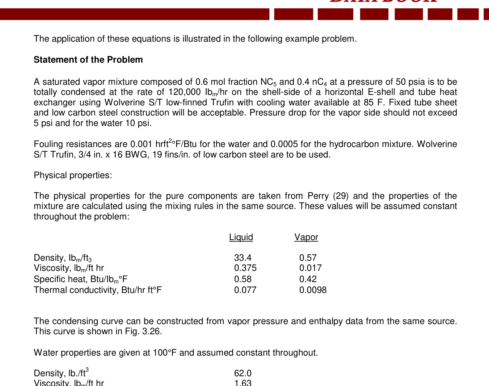

*图 3.26：C4-C5 例题的冷凝曲线。*

水在 100 °F 下取物性并假定恒定：密度 62.0 lb/ft3，黏度 1.63 lb/ft hr，比热 1.00 Btu/lb °F，导热系数 0.361 Btu/hr ft °F。

管子名义特性为：外径 0.750 in.，内径 0.495 in.，根径 0.625 in.，翅高 0.052 in.，翅厚 0.011 in.，外表面积 0.503 ft2/ft，内表面积 0.1303 ft2/ft，外/内面积比 3.86，单管内流通面积 0.195 in.2，导热系数 26 Btu/hr ft °F，翅片热阻 3.1×10-4 hr ft2 °F/Btu。

#### 初步设计估算

1. 热负荷。

从图 3.26 得 Q = 1.798×107 Btu/hr。

2. 平均温差。

试取设计出水温度 115 °F。由冷凝曲线，入口蒸汽端温约 152 °F，出口约 136 °F。计算：

LMTD = 43.6 °F。

假定多管程，参数 P = (115 - 85)/(152 - 85) = 0.448，R = (152 - 136)/(115 - 85) = 0.533。由 MTD 修正图得 F = 0.955。因此：

MTD = 0.955 × 43.6 = 41.6 °F。

3. 估算总传热系数。

以外表面积为基准。为反映蒸汽相额外热阻，冷凝系数估取 250 Btu/hr ft2 °F，而不是这些条件下纯组分冷凝常见的 400。代入各项热阻和面积比后，得：

Uo = 75.5 Btu/hr ft2 °F。

4. 面积计算。

Ao = 1.798×107 / [(75.5)(41.6)] = 5696 ft2，为估算总外翅片面积。

5. 壳体尺寸估算。

采用第 2 章图 2.26。A′o = AoF1F2F3F4。本例 F1 = 1.00，F2 = 1.03，F3 = 1.00，F4 = 1.00，因此：

A′o = 5696 × 1.03 = 5867 ft2。

由图 2.26 可选若干组合：

| 壳内径 in. | 有效管长 ft |
|---|---|
| 35 | 10 |
| 33 | 11 |
| 31 | 13 |
| 29 | 15 |
| 27 | 17.5 |
| 25 | 20 |
| 23 1/4 | 23.5 |

选 31 in. 内径壳体作进一步分析。

校核水侧速度：两管程，总管数 Nt = 878，即每程 439 根。水量为：

wH2O = 1.798×107 / [(1.00)(30)] = 599,000 lb/hr。

水速为 4.51 ft/sec，暂时可以接受。

#### 热设计

此处需要计算壳侧 ho 和 hsv，以及管侧 hi，使式 (3.93) 和 (3.94) 可求。

1. 计算 ho。

用式 (3.80)，假设 L = 13 ft。每管冷凝量：

W = 120,000 / 878 = 136.7 lb/hr per tube。

代入混合物液相物性和管长，得 ho = 357 Btu/hr ft2 °F，以外翅片面积为基准。

2. 计算 hsv。

采用 Delaware 方法，按半冷凝点蒸汽流量 60,000 lb/hr，并假定只有蒸汽相流动。初步取折流板间距 22.28 in.，折流切口为壳径 35%，即 10.85 in.。按第 2 章得到壳侧参数：

- Nt = 878。
- pp = 0.814 in.，pn = 0.469 in.。
- 横流管排数 Nc = 11。
- c/Di = 0.35，Fc = 0.40。
- 窗口有效横掠管排 Ncw = 11。
- 折流板数 Nb = 6。
- 中心线横流面积 Sm = 202 in.2。
- 旁路面积分数 Fsbp = 0.055。
- 管-折流板泄漏面积 Stb = 22.6 in.2。
- 假设直径间隙 0.300 in.，壳-折流板泄漏面积 Ssb = 8.7 in.2。
- 窗口总面积 Swg = 235.4 in.2，管占面积 Swt = 116.4 in.2，净窗口面积 Sw = 119 in.2。

传热计算如下：Res = 131,000；js = 0.0039；理想横流系数 ho,i = 86.6 Btu/hr ft2 °F；折流切口修正 Jc = 0.85；泄漏参数给 Jl = 0.775；旁路修正 Jb = 0.93。于是：

hsv = 86.6 × 0.85 × 0.775 × 0.93 = 53.1 Btu/hr ft2 °F，以管外面积为基准。

3. 计算 hi。

用图 2.19，hi = 1.04 × 1140 = 1190 Btu/hr ft2 °F，以管内面积为基准。

4. 计算 U′o。

由式 (3.94)：

U′o = 86.8 Btu/hr ft2 °F。

5. 计算 Z。

显热冷却负荷：

Qsv = 0.42 × [(120,000 + 0)/2] × (152 - 136) = 403,200 Btu/hr。

因此：

Z = 403,200 / 1.798×107 = 0.0224。

6. 计算 Ao。

由式 (3.93)：

Ao = [1/86.8 + 0.0224/53.1] × 1.798×107 / 41.6 = 5162 ft2。

实际设计提供面积为：

Ao = 878 × 13 × 0.503 = 5741 ft2。

实际面积比计算所需大约 10%。对于这类问题，这是合理安全系数，原书建议不要试图把设计削得更小。

#### 壳侧压降计算

本例方法是：先用 Delaware 方法计算壳侧只有蒸汽流动时的压降，再应用 Diehl-Unruh 完全冷凝两相修正因子。

1. 对只有蒸汽流动的壳侧压降进行 Delaware 计算。

a. Res = 262,000，取 f = 0.25。

b. 理想横流区压降 Δpf,b,i = 1.65 psi。

c. 理想窗口区压降 Δpf,w,i = 1.56 psi。

d. 泄漏修正 Rl = 0.54。

e. 管束旁路修正 Rb = 0.80。

f. 全蒸汽流壳侧压降：

Δps = 2005 lbf/ft2 = 13.9 psi。

这是蒸汽沿整个壳程不冷凝流动的压降。

g. 冷凝流修正。由图 3.25，完全冷凝流压降约为全蒸汽流压降的 0.3，因此实际壳侧喷嘴到喷嘴压降估计为 0.3 × 13.9 = 4.2 psi，略低于题目限制。需要注意，这些计算很不精确。若希望稍增安全余量，可指定总管长 14 ft，折流间距不变，对应有效管长约 13.7 ft，可使压降约增加 8% 的余量并维持设计性能。除此之外，该设计基本满足要求。

## 公式原式截图索引

| 范围 | 原式截图 |
|---|---|
| (3.1)-(3.12) | [(3.1)](./assets/eq-3-1-original.png), [(3.2)](./assets/eq-3-2-original.png), [(3.3)](./assets/eq-3-3-original.png), [(3.4)](./assets/eq-3-4-original.png), [(3.5)](./assets/eq-3-5-original.png), [(3.6)](./assets/eq-3-6-original.png), [(3.7)](./assets/eq-3-7-original.png), [(3.8)](./assets/eq-3-8-original.png), [(3.9)](./assets/eq-3-9-original.png), [(3.10)](./assets/eq-3-10-original.png), [(3.11)](./assets/eq-3-11-original.png), [(3.12)](./assets/eq-3-12-original.png) |
| (3.13)-(3.24) | [(3.13)](./assets/eq-3-13-original.png), [(3.14)](./assets/eq-3-14-original.png), [(3.15)](./assets/eq-3-15-original.png), [(3.16)](./assets/eq-3-16-original.png), [(3.17)](./assets/eq-3-17-original.png), [(3.18)](./assets/eq-3-18-original.png), [(3.19)](./assets/eq-3-19-original.png), [(3.20)](./assets/eq-3-20-original.png), [(3.21)](./assets/eq-3-21-original.png), [(3.22)](./assets/eq-3-22-original.png), [(3.23)](./assets/eq-3-23-original.png), [(3.24)](./assets/eq-3-24-original.png) |
| (3.25)-(3.36) | [(3.25)](./assets/eq-3-25-original.png), [(3.26)](./assets/eq-3-26-original.png), [(3.27)](./assets/eq-3-27-original.png), [(3.28)](./assets/eq-3-28-original.png), [(3.29)](./assets/eq-3-29-original.png), [(3.30)](./assets/eq-3-30-original.png), [(3.31)](./assets/eq-3-31-original.png), [(3.32)](./assets/eq-3-32-original.png), [(3.33)](./assets/eq-3-33-original.png), [(3.34)](./assets/eq-3-34-original.png), [(3.35)](./assets/eq-3-35-original.png), [(3.36)](./assets/eq-3-36-original.png) |
| (3.37)-(3.48) | [(3.37)](./assets/eq-3-37-original.png), [(3.38)](./assets/eq-3-38-original.png), [(3.39)](./assets/eq-3-39-original.png), [(3.40)](./assets/eq-3-40-original.png), [(3.41)](./assets/eq-3-41-original.png), [(3.42)](./assets/eq-3-42-original.png), [(3.43)](./assets/eq-3-43-original.png), [(3.44)](./assets/eq-3-44-original.png), [(3.45)](./assets/eq-3-45-original.png), [(3.46)](./assets/eq-3-46-original.png), [(3.47)](./assets/eq-3-47-original.png), [(3.48)](./assets/eq-3-48-original.png) |
| (3.49)-(3.60) | [(3.49)](./assets/eq-3-49-original.png), [(3.50)](./assets/eq-3-50-original.png), [(3.51)](./assets/eq-3-51-original.png), [(3.52)](./assets/eq-3-52-original.png), [(3.53)](./assets/eq-3-53-original.png), [(3.54)](./assets/eq-3-54-original.png), [(3.55)](./assets/eq-3-55-original.png), [(3.56)](./assets/eq-3-56-original.png), [(3.57)](./assets/eq-3-57-original.png), [(3.58)](./assets/eq-3-58-original.png), [(3.59)](./assets/eq-3-59-original.png), [(3.60)](./assets/eq-3-60-original.png) |
| (3.61)-(3.72) | [(3.61)](./assets/eq-3-61-original.png), [(3.62)](./assets/eq-3-62-original.png), [(3.63)](./assets/eq-3-63-original.png), [(3.64)](./assets/eq-3-64-original.png), [(3.65)](./assets/eq-3-65-original.png), [(3.66)](./assets/eq-3-66-original.png), [(3.67)](./assets/eq-3-67-original.png), [(3.68)](./assets/eq-3-68-original.png), [(3.69)](./assets/eq-3-69-original.png), [(3.70)](./assets/eq-3-70-original.png), [(3.71)](./assets/eq-3-71-original.png), [(3.72)](./assets/eq-3-72-original.png) |
| (3.73)-(3.84) | [(3.73)](./assets/eq-3-73-original.png), [(3.74)](./assets/eq-3-74-original.png), [(3.75)](./assets/eq-3-75-original.png), [(3.76)](./assets/eq-3-76-original.png), [(3.77)](./assets/eq-3-77-original.png), [(3.78)](./assets/eq-3-78-original.png), [(3.79)](./assets/eq-3-79-original.png), [(3.80)](./assets/eq-3-80-original.png), [(3.81)](./assets/eq-3-81-original.png), [(3.82)](./assets/eq-3-82-original.png), [(3.83)](./assets/eq-3-83-original.png), [(3.84)](./assets/eq-3-84-original.png) |
| (3.85)-(3.96) | [(3.85)](./assets/eq-3-85-original.png), [(3.86)](./assets/eq-3-86-original.png), [(3.87)](./assets/eq-3-87-original.png), [(3.88)](./assets/eq-3-88-original.png), [(3.89)](./assets/eq-3-89-original.png), [(3.90)](./assets/eq-3-90-original.png), [(3.91)](./assets/eq-3-91-original.png), [(3.92)](./assets/eq-3-92-original.png), [(3.93)](./assets/eq-3-93-original.png), [(3.94)](./assets/eq-3-94-original.png), [(3.95)](./assets/eq-3-95-original.png), [(3.96)](./assets/eq-3-96-original.png) |

## Nomenclature

## 符号说明

本章符号表较长，原页截图如下。常用符号已同步补充到全局 [symbols.md](../../../glossary/symbols.md)：

- [符号表原页 203](./assets/reference-page-203-original.png)
- [符号表原页 204](./assets/reference-page-204-original.png)
- [符号表原页 205](./assets/reference-page-205-original.png)
- [符号表原页 206](./assets/reference-page-206-original.png)
- [符号表原页 207](./assets/reference-page-207-original.png)

## Bibliography

## 参考文献

- [参考文献原页 208](./assets/reference-page-208-original.png)
- [参考文献原页 209](./assets/reference-page-209-original.png)
