# Chapter 4 Trufin Tubes in Air-Cool Heat Exchangers

# 第 4 章 Trufin 管在空气冷却换热器中的应用

## 来源追溯

| 项目 | 内容 |
|---|---|
| 原书 | Engineering Data II |
| 章节 | Chapter 4 |
| PDF 页码 | 210-241 |
| 书内页码 | 209-240 |
| 进度记录 | [progress.md](./progress.md) |

## 4.1 Heat Exchangers with High-Finned Trufin Tubes

## 4.1 采用高翅片 Trufin 管的换热器

### 4.1.1 Areas of Application

### 4.1.1 应用范围

在换热过程中，经常有一股流体的膜传热系数远高于另一股。例如水的传热系数通常可达 1000 到 1500 Btu/hr ft2 °F，而常压空气通常约为 10。

这种不平衡的结果是：换热器尺寸几乎完全由“必须为传热较差介质提供大面积”这一需求控制。通常，在不过分增大换热器总体尺寸的情况下提供这种面积的最佳方式，是采用图 4.1 所示的[高翅片 Trufin](../../../glossary/terms.md#term-high-finned-trufin) 管束，让传热较差的介质横掠翅片表面，而另一股流体在管内流动。

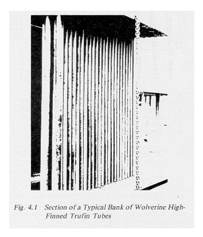

*图 4.1：Wolverine 高翅片 Trufin 管束的典型截面。*

高翅片 Trufin 用于多种工况，但绝大多数应用是把热量传递给大气空气。由于多种原因，空气作为最终废热排放介质越来越重要。在某些地区，水完全缺乏；即便有水，也可能太昂贵，或需要大量处理以减少污垢和腐蚀，或在排放到环境前需要过多再处理。在某些情况下，即使水容易取得，空气也可能是更好的冷却介质。最终结果是，需要越来越多专门设计来处理大量空气并向空气传热的换热器。

这类设备中，空气被吹过或抽过翅片管束，从管侧流股吸收热量，管侧流股相应被冷却。热空气通常排入大气，通过混合散热。为此设计的设备通常称为空气冷却换热器或空气冷却器；在一定程度上，这个术语已经成为多数高翅片 Trufin 设备的通称。不过必须记住，高翅片 Trufin 还有多种其他应用。

典型空气冷却换热器中，管侧流体可能是需要在进入储存或下一工序前显热冷却的工艺液体，也可能是必须冷凝的蒸汽。蒸汽还可能在饱和温度以上过热，因此冷凝前需要先降过热。蒸汽可能基本为单组分，也可能是多组分混合物，且其中不一定全部可冷凝。空气冷却设备还可完成冷凝液过冷。

上述工况中，冷却过程是直接的，即热量从工艺流体通过管壁和翅片直接传给空气。也可采用间接空气冷却：工艺流股先在管壳式换热器中由闭式水循环冷却，再由空气冷却器冷却该水循环。这种布置可在工艺装置附近使用更紧凑的水冷设备，并把最终向大气排热的空气冷却设备布置在装置外围。中间冷却介质品质可控制，以减少腐蚀和污垢问题。代价是设备和管道更复杂，工艺流体能降到的温度不如直接空气冷却低。

如果空气温度低到会使工艺流体冻结或黏度极高，间接循环很有用。中间流体可选为水-乙二醇混合物，使其在最极端条件下也不冻结。中间流体温度可通过让部分流体旁通过冷器，或关闭部分或全部风机来控制。

高翅片 Trufin 除用于工艺装置排热外，也可用于电厂排热、制冷和空调系统。在空间采暖系统中，管外热空气才是目标产物；热源可为管内冷凝蒸汽或热液体。

最后还有两类应用中，大气空气是热源而不是热汇。第一类用空气向工艺流体供热，使其显热升温或汽化。但空气可冷却的温度范围有限；若翅片表面温度低于空气露点且低于 32 °F，翅片上会结冰，迅速限制空气流动并可能造成机械损伤。第二类应用关注被冷却的空气，例如空调或制冷；冷源可能是沸腾制冷剂或显热升温的盐水。

原则上，所有上述应用的空气侧计算，也就是管束翅片面计算，都是相同的，尽管具体参数范围差别很大。但管侧计算差别很大，本手册其他章节分别处理。

### 4.1.2 High-Finned Trufin

### 4.1.2 高翅片 Trufin

Wolverine 制造的所有高翅片 Trufin 都是整体翅片管。也就是说，翅片在制造过程中由基管金属轧制形成，最终管子及其翅片是一整块金属。L/C 型 Trufin 是例外，它有不同金属的内衬；但它的外管和翅片仍是一整块金属。

整体翅片保证了管子的最高热效率，因为翅片不可能因翅根处环境腐蚀、运行中反复膨胀收缩或搬运机械损伤而部分或完全脱离管体金属。

Wolverine 制造多种高翅片管。以下说明只列出每类管的主要特征、适合的一般应用、材料可得性和结构限制。详细尺寸、容差、材料规格和订购信息参见原书第 6 章。

图 4.2 定义了 Wolverine 高翅片管共有的主要几何参数。H/F 型 Trufin 通常由 122 合金，即 DHP 铜制造，某些尺寸也可用 706 合金，即 90/10 铜镍合金。标准内径从 5/16 in. 到 1 1/4 in.，对应翅片外径从 0.9 in. 到 2.2 in.，翅片数为每英寸 7 或 9 片。

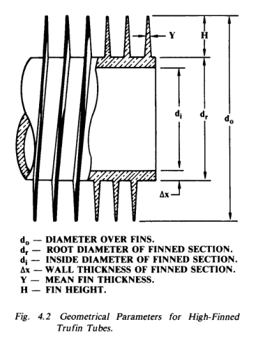

*图 4.2：高翅片 Trufin 管的几何参数。*

H/R 型 Trufin 由 3003 铝制造。标准根径从 3/8 in. 到 1 in.，对应翅片外径从 0.9 in. 到 1.9 in.，标准翅片数为每英寸 5、7、9 和 11 片。I/L 型 Trufin 具有内部纵向翅片和外部螺旋翅片，仅用 3003 铝制造，外部翅片构型与 H/R 铝管相同。

L/C 型 Trufin 是一种[双金属管](../../../glossary/terms.md#term-bimetallic-tube)。外管为整体翅片 3003 铝，外翅片构型类似 H/R 铝管；内管可为任意材料，包括铜、海军黄铜、铜镍合金、低碳钢和不锈钢。内管尺寸采用换热器管标准尺寸。当腐蚀或压力要求必须让特殊材料接触工艺流体时，采用 L/C 型 Trufin。铝保证了翅片到空气的良好导热，也提供优良的大气腐蚀抗力。

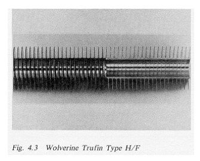

*图 4.3：Wolverine H/F 型 Trufin。*

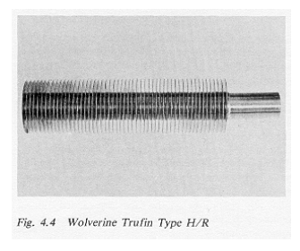

*图 4.4：Wolverine H/R 型 Trufin。*

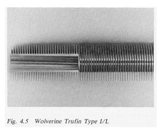

*图 4.5：Wolverine I/L 型 Trufin。*

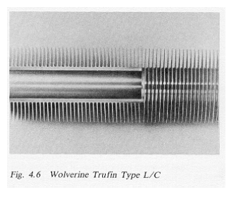

*图 4.6：Wolverine L/C 型 Trufin。*

### 4.1.3 Description of Equipment

### 4.1.3 设备说明

大型[空气冷却换热器](../../../glossary/terms.md#term-air-cooled-heat-exchanger)通常由较浅的管束组成，一般为 3 到 8 排管，大量空气由大型风机以较低速度吹过或抽过管束。图 4.7 和图 4.8 给出两种布置。

图 4.7 为水平管[鼓风式](../../../glossary/terms.md#term-forced-draft)布置，风机安装在管束下方，把空气向上吹过管束。该构型常用于液体冷却和蒸汽冷凝；特别在冷凝应用中，管子可沿流动方向向下倾斜 2° 或 3°，以便冷凝液从管内排出。鼓风式布置在机械上有吸引力：风机和驱动装置可直接支撑在地面上，轴较短，减轻应力和振动问题，并简化维护。但热空气以较低速度从设备顶部离开，可能再循环进入本设备或附近设备，提高入口温度，降低能力。

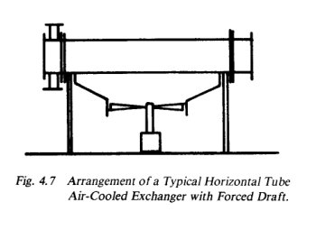

*图 4.7：典型水平管空气冷却换热器，鼓风式布置。*

图 4.8 为水平管[引风式](../../../glossary/terms.md#term-induced-draft)布置。引风式通常使通过管束的空气分布更均匀，并更明确地把热空气羽流送入大气，减少再循环问题。但在图示布置中，风机和驱动装置更难固定和维护，风机处理密度较低的热空气时效率也会降低。

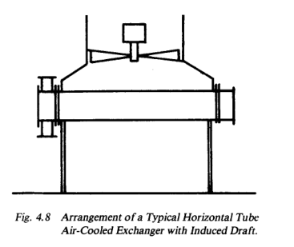

*图 4.8：典型水平管空气冷却换热器，引风式布置。*

引风式还可采用另一种布置：把驱动装置放在管束下方，用长轴连接到管束上方的风机。这样可改善驱动装置维护条件，但必须在管束中留出轴穿过的位置，导致空气旁路和传热面积损失，还可能引入长轴振动问题。因此这种方案并不是单纯的机械优化，必须连同热力和空气分布一起判断。

管子总是采用三角形排列，较少采用旋转正方形排列，如图 4.9 所示。绝不采用顺列排列，因为大量空气会从相邻管翅片尖端之间的清晰通道中穿过管束，与流过翅片场并受热的空气混合很差。其结果是表观传热系数降到三角形排列约一半。即便采用错列布置，管子也应尽可能靠近，同时避免正常运行中管子互相振动碰撞。典型翅尖间隙约为 1/4 in.。

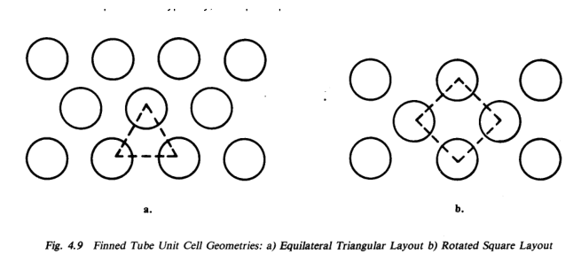

*图 4.9：翅片管单元格几何：等边三角形排列与旋转正方形排列。*

管子通常插入箱式管箱，如图 4.10 所示。管子可胀接或焊接到管板中。简单箱式管箱可拆下法兰盖板，露出所有管端，便于检查、检漏、清洗、更换、再胀接、再焊接或堵管。整体焊接箱式管箱用于较高压力运行，对管子的操作通过拆下检查塞并经检查孔进行。

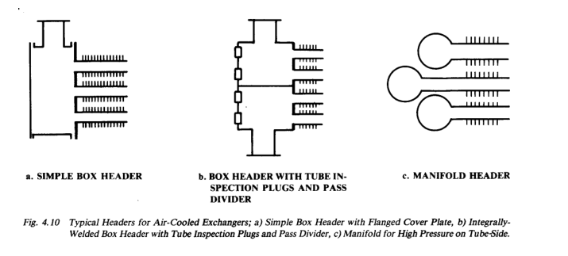

*图 4.10：空气冷却换热器典型管箱。*

管束至少采用三排管，通常最多八排，偶尔可到十二排。管排数较多的情况通常需要相对较小空气流量；此时管侧流体往往温度较高，空气温升可相应较大。

在某些应用中，例如冷凝，特别是多组分混合物冷凝，管束采用单程：工艺流体从一端进入，平行流过管束所有管子，从另一端流出。其他应用中，例如液体在较宽温度范围内冷却，通常让管侧流体在管排间往返，形成两程、三程或更多程，并横穿空气流。管侧流体总是先通过最上排管，随后各程移动到更低管排，以尽量接近与空气逆流。流路由管箱中的分程隔板控制。图 4.11 示出把管排分成分数管排的可能方式。

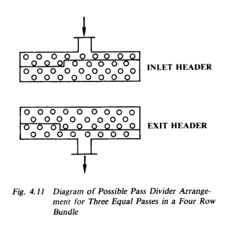

*图 4.11：通过隔板实现分数管排分程的管箱布置。*

若管箱间距大于约 4 到 6 ft，必须设置周期性管支撑板。管子穿过支撑板，支撑板孔与翅片外径之间只留足装配所需间隙。为了提供支承面，可在几片翅片长度范围内用低熔点合金填充翅片间隙，或用包覆支承，也可让支撑板足够厚以支承多片翅片。

管束由侧梁、管箱、支撑板和腿部或塔架支撑结构连接并加固。最外侧管子与侧梁之间间隙应尽可能小，以减少空气旁路。风箱、导流罩、百叶系统和防护网等辅助部件固定在主结构上。

风机和驱动装置是除管束外空气冷却器最重要的部件。风机总是轴流螺旋桨式，四叶或六叶，直径可达 24 ft 或更大。大尺寸风机尤其常用可调桨距叶片。最大静压通常限制在 1 in. 水柱，0.5 in. 水柱压降是常见设计规格。

如果空气温度不超过约 175 °F，风机叶片常用塑料制造，许多引风式应用也在此范围内。铝叶片可用到约 300 °F，更高温度则使用钢叶片。对大直径风机，叶尖速度不应超过约 12,000 ft/min；除强度限制外，风机噪声会在更高速度下迅速增加。

驱动装置可为电动机或汽轮机，既可直接驱动也可间接驱动。偏远地点还可使用发动机驱动。间接驱动通常采用 V 带或减速齿轮；若驱动装置处于引风式热空气区，必须注意温度限制。液压驱动也有应用。估算风机功率时，风机加驱动装置综合效率取 60% 是合理值，通常范围约为 50% 到 75%。由于风机和驱动选择高度专业，具体应用应向制造商取得详细建议。

其他部件包括风机圈、导流罩、[风箱](../../../glossary/terms.md#term-plenum)、[百叶](../../../glossary/terms.md#term-louver)和防护网等。它们用于引导空气流动，减少边缘逃逸、旁路和再循环。公开资料中很少有统一设计规则，通常只要认真遵循空气流动基本力学，就能避免灾难性问题。

在鼓风式装置中，若人员或异物可能接近风机，风机下方常设置粗网作为安全防护，同时防止飞来杂物被吸入风机和管束。

低环境温度下还必须防止工艺流体在管内冻结。常见措施包括：关闭风机；在管束下方设置百叶以进一步限制空气流量；安排部分风机可反转，使部分穿过管束的热空气回流到新鲜空气入口；或在主管束下方设置单独一排管，通入蒸汽以加热入口空气。这些控制措施说明，空气冷却器不仅是换热面积问题，也是全年运行和低温保护问题。

## 4.2 Heat Transfer with High-Finned Trufin Tubes

## 4.2 高翅片 Trufin 管传热

### 4.2.1 Fin Temperature Distribution and Fin Efficiency

### 4.2.1 翅片温度分布与翅片效率

由于翅片金属中存在导热热阻，翅片温度并非常数。图 4.12 示出了典型翅片温度分布。

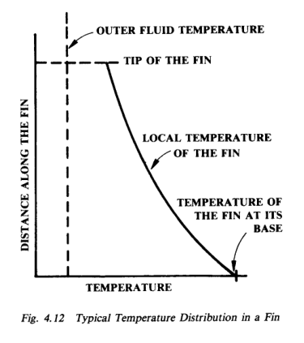

*图 4.12：翅片中的典型温度分布。*

翅片温度分布计算细节相当复杂，原书不展开。结果取决于翅片几何、材料、外侧流体温度和传热系数等多项参数，并需要作出若干假设。例如，多数分析假设外侧流体在翅片表面各点具有恒定主体温度和恒定传热系数。实际并非如此，但真实状态理解不足，若完全严格处理会使分析非常复杂。实践中，简化分析结果与经验一致，并能得到可接受设计。

翅片效率 Φ 是给定工况下真实翅片传热量与假设翅片全处于根部温度时传热量之比。对于本章考虑的翅片，在关注范围内可用：

原式截图：[eq-4-1-original.png](./assets/eq-4-1-original.png)

$$
\Phi =
\frac{1}{1+\frac{m^2}{3}\sqrt{\frac{d_o}{d_r}}}
\tag{4.1}
$$

其中：

原式截图：[eq-4-2-original.png](./assets/eq-4-2-original.png)

$$
m =
H
\left[
\frac{2}{\left(\frac{1}{h_o}+R_{fo}\right)k_wY}
\right]^{1/2}
\tag{4.2}
$$

式 (4.1) 实际基于等厚翅片，而 Wolverine 高翅片 Trufin 的翅片在根部略厚、尖端略薄。误差很小，且 Wolverine 翅片实际效率略高于该式指示。

原书例子取 H/R 型 3003 铝管，dr = 1.00 in.，do = 1.875 in.，H = 0.437 in.，s = 0.076 in.，Y = 0.015 in.，kw = 110 Btu/hr ft °F，ho = 10 Btu/hr ft2 °F，R = 0。计算得 m2 = 0.439，Φ = 0.919，即翅片效率 91.9%。这属于典型且偏低的空气冷却应用值。铜翅片导热系数更高，Φ 会更高；更厚翅片也会更高。

原书特别说明，名义尺寸与实际尺寸之间有小差别，实际尺寸也会随批次略有变化，细节需查第 6 章。本节例题使用名义尺寸。对高翅片空气冷却器而言，91.9% 的效率已经偏低：铜翅片因导热系数更高会给出更高效率；90/10 铜镍在相同条件下约为 0.730，但并不常用于高翅片管；本例采用的是可供应翅片中较薄的一种，厚翅片效率会更高。若空气膜系数取极端值 20 Btu/hr ft2 °F，效率仍约为 0.862。

设计中更直接有用的是翅片热阻 Rfin：

原式截图：[eq-4-3-original.png](./assets/eq-4-3-original.png)

$$
R_{fin}
=
\left(
\frac{1-\Phi}{A_{root}/A_{fin}+\Phi}
\right)
\left(
\frac{1}{h_o}+R_{fo}
\right)
\tag{4.3}
$$

继续采用上述例题，可计算单位长度管子的根部裸管面积 Aroot 约为 0.219 ft2/ft，全部翅片传热面积 Afin 约为 3.62 ft2/ft。代入式 (4.3) 得 Rfin = 0.00827 hr ft2 °F/Btu，相当于仅针对翅片部分的等效传热系数 121 Btu/hr ft2 °F。与典型空气冷却器空气膜系数约 10 Btu/hr ft2 °F 相比，翅片热阻只是总热阻中的小部分，但不能忽略，因为它会随材料、翅片厚度和空气侧系数变化。

翅片热阻可直接并入总传热系数：

原式截图：[eq-4-4-original.png](./assets/eq-4-4-original.png)

$$
\frac{1}{U_o}
=
\frac{1}{h_o}
+R_{fo}
+R_{fin}
+\frac{\Delta x_w A_o}{k_wA_m}
+R_{fi}\frac{A_o}{A_i}
+\frac{1}{h_i}\frac{A_o}{A_i}
\tag{4.4}
$$

对任一具体工况，可先用式 (4.1) 和式 (4.2) 求翅片效率，再用式 (4.3) 得到 Rfin，最后放入式 (4.4) 的总热阻链。这样做比简单把外面积乘以效率更清楚，因为它把空气膜、污垢、翅片、管壁、管内污垢和管内膜系数放在同一个面积基准上。

### 4.2.2 Effect of Fouling on High-Finned Trufin

### 4.2.2 污垢对高翅片 Trufin 的影响

为了一致性，前文一直保留翅片表面污垢热阻 Rfo。实际上，在空气位于翅片侧的高翅片 Trufin 中，污垢很少成为严重问题，除非出现大量物质沉积，例如严重腐蚀、强沙尘暴或吸入杂物。这些情况下继续运行没有意义，只能停机清除阻塞。正常情况下，空气持续流过表面会减少沙尘沉积；即使形成沉积，也通常可用压缩空气射流偶尔清理。因此，高翅片 Trufin 应用中通常取 Rfo = 0。

### 4.2.3 Contact Resistance in Bimetallic Tubes

### 4.2.3 双金属管中的接触热阻

L/C 型 Trufin 中，内衬金属不同于外管和翅片的 3003 铝。两种金属有时接触不完全，会给热流增加额外[接触热阻](../../../glossary/terms.md#term-contact-resistance)。通常在金属-金属界面温度较低时，内衬对铝翅片管施加正接触压力。但温度升高时，铝比内衬膨胀更快，会形成明确间隙。间隙中为空气，显著增加传热热阻。

研究表明：在约 70 °F 制造温度下，不锈钢内衬和铝之间接触压力约 400 psi，接触热阻约 0.00005 hr ft2 °F/Btu，实际可忽略。当接触压力为零时，钢-铝情况下发生在约 200 到 215 °F 的结合温度，接触热阻约 0.0002 hr ft2 °F/Btu，多数应用仍可忽略。但当管侧流体约 1000 °F、空气侧约 200 °F 时，接触热阻可能升高到 0.002 到 0.003 hr ft2 °F/Btu，按面积比折算后可占总热阻约 10% 到 25%，必须考虑。

考虑接触热阻的双金属管总传热系数为：

原式截图：[eq-4-5-original.png](./assets/eq-4-5-original.png)

$$
\frac{1}{U_o}
=
\frac{1}{h_o}
+R_{fo}
+R_{fin}
+\left(\frac{\Delta x_w}{k_w}\right)_1\frac{A_o}{A_m}
+R_b\frac{A_o}{A_b}
+\left(\frac{\Delta x_w}{k_w}\right)_2\frac{A_o}{A_m}
+R_{fi}\frac{A_o}{A_i}
+\frac{1}{h_i}\frac{A_o}{A_i}
\tag{4.5}
$$

其中第一项壁面导热热阻属于翅片金属根部，Rb 是按结合接触面积 Ab 计的结合热阻，第二项壁面导热热阻属于内衬管。其他项仍采用前文含义。该式的价值在于提醒设计者：L/C 管在高温时不能只看铝翅片空气侧性能，还必须判断内衬与外管之间是否仍保持有效热接触。

## 4.3 Heat Transfer and Pressure Drop in High-Finned Trufin Tube Banks

## 4.3 高翅片 Trufin 管束中的传热与压降

### 4.3.1 Heat Transfer Coefficients in Crossflow

### 4.3.1 横流传热系数

已有多种横掠翅片管束传热关联式。变量数量和范围非常大，若一个相对简单的关联式能普遍适用，反而令人意外。复杂关联式需要更庞大的数据集，并特别要求变量范围宽、能覆盖多变量相互作用；公开数据通常不足。因此使用任何公开关联式时，都必须谨慎确认其适用于目标范围。

在上述警告下，Briggs 和 Young 关联式是高翅片 Trufin 管较好的公开关联之一：

原式截图：[eq-4-6-original.png](./assets/eq-4-6-original.png)

$$
\frac{h_od_r}{k_{air}}
=
0.134
\left(
\frac{d_r\rho_{air}V_{max}}{\mu_{air}}
\right)^{0.68}
Pr^{1/3}
\left(\frac{H}{s}\right)^{-0.2}
\left(\frac{Y}{s}\right)^{-0.12}
\tag{4.6}
$$

该关联覆盖的实验范围为：根径 0.44 到 1.61 in.，翅高 0.056 到 0.652 in.，翅片间距 0.035 到 0.117 in.；管束为等边三角形排列，节距可到 4.5 in.。因此它适合本章讨论的 Wolverine 高翅片 Trufin 常见范围，但不应无条件外推到完全不同几何或流速范围。

其中 Vmax 是通过翅片管束的最大空气侧速度，而不是迎面速度。翅片间距 s 与每英寸翅片数 Nf 的关系为：

原式截图：[eq-4-7-original.png](./assets/eq-4-7-original.png)

$$
s=\frac{1}{N_f}-Y
\tag{4.7}
$$

原书例题计算 3/4 in. 根径、9 翅片/in. 的 H/R 铝 Trufin，平均翅片厚度 0.019 in.，1 7/8 in. 等边三角形节距，空气 70 °F、[迎面速度](../../../glossary/terms.md#term-face-velocity) 600 ft/min。

几何量为：dr = 0.750 in.，H = 0.5(1.625 - 0.750) = 0.438 in.，Y = 0.019 in.，s = 1/9 - 0.019 = 0.092 in.。

题目给出的 600 ft/min 是空气到达管束前的平均迎面速度。要用于式 (4.6)，必须换算成最小自由流通面积处的 Vmax。相邻管中心距为 1.875 in.，根径为 0.750 in.，根径之间净间隙为 1.125 in.；每英尺管长对应净通道面积为 12×1.125 = 13.50 in.2/ft。两根管的翅片阻挡面积为 2×9×12×0.019×0.438 = 1.80 in.2/ft，因此自由流通面积为 11.70 in.2/ft。相同两根相邻管对应的迎面面积为 1.875×12 = 22.50 in.2/ft，所以：

$$
V_{max}
=600\left(\frac{22.50}{11.70}\right)
=1150\ \mathrm{ft/min}
$$

70 °F 空气物性取：k = 0.0150 Btu/hr ft °F，ρ = 0.0765 lbm/ft3，μ = 0.0439 lbm/ft hr，cp = 0.240 Btu/lbm °F，Pr = 0.702。代入式 (4.6)：

$$
h_o = 10.9\ \mathrm{Btu/hr\ ft^2\ ^\circ F}
$$

这就是非常典型的空气侧传热系数。它远低于管侧水、冷凝蒸汽、有机液体等系数，直接说明高翅片 Trufin 在空气冷却工况中的重要性。

为了建立量级感，可与管侧典型值比较：水侧约 1000 Btu/hr ft2 °F，冷凝蒸汽可超过 2000，中等有机液体约 300，重质有机液体约 100。空气侧往往低一个到两个数量级，因此设计的主要自由度通常在空气侧面积、空气速度和风机静压之间。

### 4.3.2 Mean Temperature Difference in Crossflow

### 4.3.2 横流平均温差

逆流假设下，对数平均温差定义为：

原式截图：[eq-4-8-original.png](./assets/eq-4-8-original.png)

$$
LMTD =
\frac{(T_i-t_o)-(T_o-t_i)}
{\ln\left[\frac{T_i-t_o}{T_o-t_i}\right]}
\tag{4.8}
$$

在满足相应假设时，基本设计方程为：

原式截图：[eq-4-9-original.png](./assets/eq-4-9-original.png)

$$
A_o =
\frac{Q}{U_o(LMTD)}
\tag{4.9}
$$

空气冷却换热器中，空气和工艺流体通常互为横流，而不是 LMTD 推导中的逆流。因此必须使用构型修正因子 F：

原式截图：[eq-4-10-original.png](./assets/eq-4-10-original.png)

$$
A_o =
\frac{Q}{U_oF(LMTD)}
\tag{4.10}
$$

其中 LMTD 仍按式 (4.8) 计算。F 是以下参数的函数：

原式截图：[eq-4-11-original.png](./assets/eq-4-11-original.png)

$$
P=\frac{t_o-t_i}{T_i-t_i}
\tag{4.11}
$$

原式截图：[eq-4-12-original.png](./assets/eq-4-12-original.png)

$$
R=\frac{T_i-T_o}{t_o-t_i}
\tag{4.12}
$$

图 4.13 给出一管程横流 F 因子，此时管侧流体平行通过所有管子，且假定每根管流量相等。图 4.14 给出两管程横流 F 因子，假定两程管数相等；每一程可包含不止一排管。需要注意，管侧流体应先经过最上方管子，使整体流动趋势逐步接近与空气逆流。三程或更多管程时，整体流型已非常接近逆流，F 可近似取 1.00，误差很小。

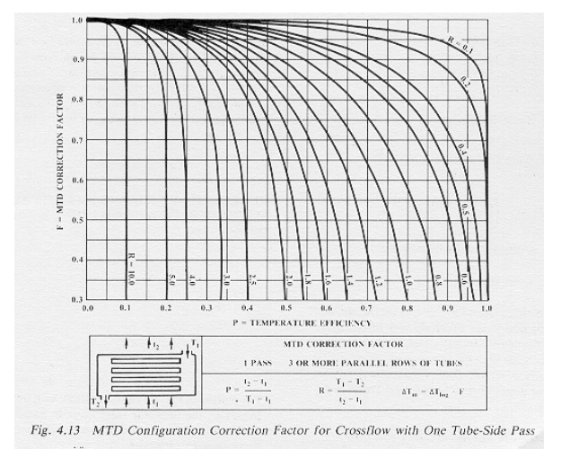

*图 4.13：横流、一管程时的 MTD 构型修正因子。*

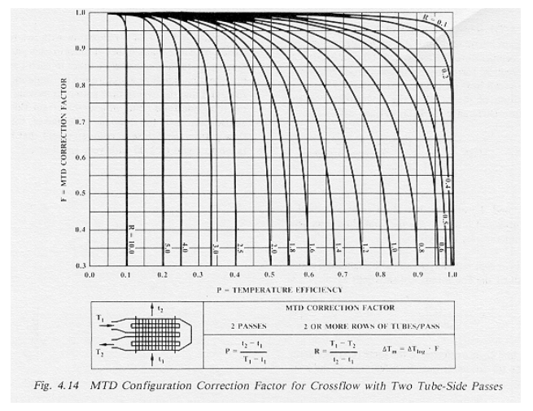

*图 4.14：横流、两管程时的 MTD 构型修正因子。*

### 4.3.3 Pressure Drop in Crossflow

### 4.3.3 横流压降

横掠翅片管束压降关联式与传热关联式一样需要谨慎使用，而且压降的不确定性通常更大。Robinson 和 Briggs 关联式为：

原式截图：[eq-4-13-original.png](./assets/eq-4-13-original.png)

$$
f_r =
9.47
\left(
\frac{d_r\rho_{air}V_{max}}{\mu_{air}}
\right)^{-0.32}
\left(\frac{P_t}{d_r}\right)^{-0.93}
\tag{4.13}
$$

摩擦因子定义为：

原式截图：[eq-4-14-original.png](./assets/eq-4-14-original.png)

$$
f_r =
\frac{\Delta P_{air}g_c}{2n\rho_{air}V_{max}^2}
\tag{4.14}
$$

其中 ΔPair 是管束空气侧压降，n 为管排数。该关联覆盖的公开数据范围为：根径 0.734 到 1.61 in.，翅片外径 1.561 到 2.750 in.，管节距 1.687 到 4.500 in.。大多数数据为等边三角形排列。

若采用等腰三角形排列，试验表明可在式 (4.13) 右侧再乘以 (Pt/P)0.52。其中 P 是纵向节距，即不同排相邻管中心沿对角方向的距离；等边排列时 Pt = P。由于被测试的一个等腰管束接近错列正方形排列，该修正也可能适用于类似几何，但仍应谨慎。

原书沿用前一传热例题，计算五排管管束压降。几何和流动参数，包括 Reynolds 数，与前一例题相同。由式 (4.13)：

$$
f_r=0.232
$$

再由式 (4.14)，空气侧压降为：

$$
\Delta p_{air}
=2.03\ \mathrm{lbf/ft^2}
=0.0141\ \mathrm{lbf/in^2}
$$

空气冷却设备通常用“英寸水柱”表示空气侧压降，即该压差能够支持的水柱高度。换算方法为：

原式截图：[eq-4-15-original.png](./assets/eq-4-15-original.png)

$$
\Delta P_{\mathrm{in.\ H_2O}}
=
\Delta P_{air}
\left(\frac{1}{\rho_{H_2O}}\right)
\left(\frac{12\ \mathrm{in.}}{1\ \mathrm{ft}}\right)
\left(\frac{g_c}{g}\right)
\tag{4.15}
$$

0.39 in. 水柱在这类风机能力范围内；0.5 in. 水柱是常见设计值。

### 4.3.4 Other Air-Side Pressure Effects

### 4.3.4 其他空气侧压力效应

空气冷却器空气侧还可能有其他压降来源，例如[百叶](../../../glossary/terms.md#term-louver)系统，即使全开，风机防护网、结构件、风箱和导流罩也会产生压降。公开文献中通常缺乏足够数据来精确评估这些影响。幸运的是，这些损失通常很小，粗略估计即可，主要用于确认它们不会成为限制设备性能的主要因素。

一个有用经验规则是：若主要压力效应来自流动突然加速后又突然减速，可计算流体通过限制处所需速度增量，再按该速度增量的两倍速度头作为不可恢复压降。

例如，若前一例题中的空气为了通过风机防护网，必须从 800 ft/min 加速到 900 ft/min，则该速度变化对应的速度头约为 0.011 in. H2O。把它加倍，可估计不可恢复压降最多约 0.02 in. H2O。与管束压降 0.39 in. H2O 相比，这一损失足够小，不会成为设计或运行中的主要问题。

若按上述估算得到的压降已经很大，则应使用制造商数据或更详细计算。最后，如果希望通过平滑收缩风道强烈加速排出热空气羽流，使其在与周围空气混合前升到设备上方较远位置，则可保守地把所需附加压降取为按目标排出速度计算的一个速度头。

## 4.4 Preliminary Design Procedures

## 4.4 初步设计程序

### 4.4.1 Principles of the Design Process

### 4.4.1 设计过程原则

多数空气冷却器设计问题的本质是：必须对工艺流股完成某个热状态改变，而空气只允许有限的温度变化和压力变化。

空气侧传热过程通常控制热量移除，而空气可用压降有限，又把速度和传热系数限制在很窄范围内。

设计的第一个问题是选择换热器构型的一般特征。第二个问题是计算所选构型能否在压降限制内传递所需热量。第二个问题有三种可能结果：

1. 所选构型能传热，并使用但不超过可用压降。这就是期望设计。
2. 除非超过空气侧允许压降，否则所选构型不能传递指定热量。此时必须选择更大的设计并重新计算。
3. 所选构型能传递指定热量，但没有充分利用可用压降。此时换热器过大，可减小尺寸以节省成本，直到达到第一种结果。

以上是对设计问题的粗略简化，但说明了设计过程的本质和成功标准。本节重点是第一个问题：选择一个主要特征接近最终设计的初步构型。

对许多用途，例如装置投资估算或初步总图布置，这种第一轮设计本身可能已经足够有用。它不替代最终校核，但能快速给出管束尺寸、风机数量级、迎风面积和排数范围，使后续详细设计不从空白开始。

### 4.4.2 Selection of Preliminary Design Parameters

### 4.4.2 初步设计参数选择

#### 管子选择

翅片管主要用于翅片侧流体传热系数远低于管侧的情况。粗略地说，管子应选到满足：

原式截图：[eq-4-16-original.png](./assets/eq-4-16-original.png)

$$
h_iA_i \approx h_oA_o
\tag{4.16}
$$

或按面积比：

原式截图：[eq-4-17-original.png](./assets/eq-4-17-original.png)

$$
\frac{A_o}{A_i}
\approx
\frac{h_i}{h_o}
\tag{4.17}
$$

由于典型空气冷却器 ho 约为 10 Btu/hr ft2 °F，可粗略选择 Ao/Ai 约等于 hi 数值的十分之一。例如若 hi 约为 100 Btu/hr ft2 °F，可考虑面积比约 10 的管子。若管侧为水或冷凝蒸汽，hi 可大于 1000，对应面积比实际不存在，此时只能选择较高面积比管型，并同时考虑材料、可得性、价格和其他因素。

低流量和液体工况通常偏好小直径管，以提高管侧速度、保证湍流并减小污垢。高管侧流量、气体、冷凝蒸汽或管侧压降受限工况通常偏好较大直径管。

#### 管排列选择

应采用错列管排，通常是等边三角形，较少为其他三角形或旋转正方形，以减少空气旁路。在给定管型下，还需选择节距。翅尖之间需要约 3/16 到 1/4 in. 的最小间隙，以防运行中翅片碰撞。更大间隙可降低压降，且压降降低通常快于传热系数降低；但会增加换热器尺寸和成本。因此通常实践是尽可能紧凑排列。

#### 设计空气温度选择

入口空气温度由自然条件决定，但一年或一天内有较大范围。设计者必须根据当地气象数据选择设计温度，例如选择全年只有 5% 小时被超过的温度。原则上，这意味着换热器一年中 5% 时间可能无法完全满足设计负荷，其余 95% 时间过设计。但实际并不如此简单，因为传热系数、工艺条件、运行变化、污垢瞬态和控制灵活性都会影响设备是否真的“失败”。

设计入口空气温度通常接近但低于可能遇到的最高空气温度。还必须注意，空气多数时间低于设计温度，可能导致工艺流体过冷、冻结，或在回流冷凝器中过度冷凝而影响塔和再沸器。应预先设置空气量或其他变量控制。

通常不经济地把管侧流体冷却到低于入口空气温度以上约 20 °F 的温度；换言之，冷端温差通常至少取 20 °F。也有指定 10 °F 的情况，但会显著增加面积。热端出口空气温度必须低于工艺流体入口温度；如果只采用一程或两程管侧流动，必须计算 F 因子，确保 F 大于 0.8 且不在曲线陡峭区。

### 4.4.3 Fundamental Limitations Controlling Air-Cooled Heat Exchanger Design

### 4.4.3 控制空气冷却换热器设计的基本限制

空气冷却换热器设计中有两到三类相互竞争的限制。首先，空气吸热能力有限，可称为热力学限制。其次，把热量传给空气的速率有限，可称为速率限制。二者都倾向于要求较高空气速度，但风机可提供的压降有限，这形成泵送限制。

热力学限制倾向于要求移动非常大的空气量，并尽可能接受较大的空气温升。由于可允许压降低，这种大空气量通常只能通过很大迎风面积和较浅管束深度实现。速率限制则要求两股流体之间保持尽可能大的温差，并在风机能力内提高空气速度。二者都希望提高空气速度，但共同受风机静压限制约束。

风机在空气冷却换热器中可提供的最大实际压降约为 1 in. 水柱，通常设计范围为 0.3 到 0.7 in.，0.5 in. 是方便设计目标。表 4.1 给出按管排数变化的典型最小流通面积质量速度，表 4.2 给出典型迎面速度。

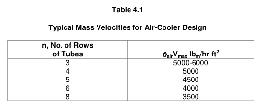

| 管排数 n | ρairVmax，lbm/hr ft2 |
|---:|---:|
| 3 | 5000-6000 |
| 4 | 5000 |
| 5 | 4500 |
| 6 | 4000 |
| 8 | 3500 |

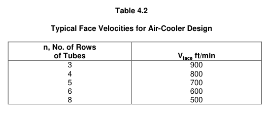

| 管排数 n | Vface，ft/min |
|---:|---:|
| 3 | 900 |
| 4 | 800 |
| 5 | 700 |
| 6 | 600 |
| 8 | 500 |

热力学限制来自热平衡。若总热负荷为 Q，空气入口和出口温度为 ti 和 to，所需空气质量流量为：

原式截图：[eq-4-18-original.png](./assets/eq-4-18-original.png)

$$
w_{air}
=
\frac{Q}{c_{p,air}(t_o-t_i)}
\tag{4.18}
$$

空气质量流量与迎面速度和迎风面积关系为：

原式截图：[eq-4-19-original.png](./assets/eq-4-19-original.png)

$$
A_{face}
=
\frac{w_{air}}{\rho_{air}V_{face}}
\tag{4.19}
$$

合并可得热力学限制所需迎风面积：

原式截图：[eq-4-20-original.png](./assets/eq-4-20-original.png)

$$
(A_{face})_T
=
\frac{Q}{c_{p,air}(t_o-t_i)\rho_{air}V_{face}}
\tag{4.20}
$$

其中 (Aface)T 表示仅由热力学限制决定的迎风面积。使用表 4.2 的典型 Vface，可按管排数快速估算单位热负荷所需迎风面积。

原书例题：100,000 lb/hr 水从 180 °F 冷却到 120 °F，空气入口为 90 °F，ρair = 0.0737 lbm/ft3。若空气出口取 140 °F，则热负荷为：

$$
Q=100000(1)(180-120)=6.0\times10^6\ \mathrm{Btu/hr}
$$

由式 (4.20)：

$$
\frac{(A_{face})_T}{Q}
=
\frac{0.01885}{V_{face}}
\quad
\mathrm{\frac{ft^2}{Btu/hr}}
$$

采用表 4.2 的典型迎面速度，可得：

| 管排数 n | Vface，ft/min | (Aface)T/Q，ft2/(Btu/hr) | (Aface)T，ft2 |
|---:|---:|---:|---:|
| 3 | 900 | 2.09×10-5 | 126 |
| 4 | 800 | 2.36×10-5 | 141 |
| 5 | 700 | 2.69×10-5 | 162 |
| 6 | 600 | 3.14×10-5 | 189 |
| 8 | 500 | 3.77×10-5 | 226 |

如果已经指定了管型和管排列，也可基于表 4.1 按最小流通面积质量速度做类似计算；这对实际设计可能更好，但不如表 4.2 方便。

速率限制仍由传热方程表达：

原式截图：[eq-4-21-original.png](./assets/eq-4-21-original.png)

$$
A_o =
\frac{Q}{U_o(MTD)}
\tag{4.21}
$$

把所需外侧总面积换算成迎风面积：

原式截图：[eq-4-22-original.png](./assets/eq-4-22-original.png)

$$
(A_{face})_{HT}
=
\frac{A_o}{nA^*_{HT}}
\tag{4.22}
$$

由此得到速率限制所需迎风面积：

原式截图：[eq-4-23-original.png](./assets/eq-4-23-original.png)

$$
(A_{face})_{HT}
=
\frac{Q}{nA^*_{HT}U_o(MTD)}
\tag{4.23}
$$

其中 n 是管排数，A*HT 是每平方英尺迎风面积、每排管对应的外侧翅片管总传热面积。A*HT 必须随具体管型和排列计算。

仍采用前述 3/4 in. 根径、1 5/8 in. 翅片外径、9 翅片/in.、1 7/8 in. 等边三角形节距的 H/R 管。每英尺管长的翅片面积约为 2.45 ft2，根部裸管面积约为 0.163 ft2，合计每英尺管长外侧总面积为 2.61 ft2。1 ft 管束宽度中每排管数为 12/1.875 = 6.40 根，因此：

$$
A^*_{HT}=6.40\times2.61=16.70
\ \mathrm{ft^2/ft^2\ face/row}
$$

最终设计必须使热力学限制和速率限制给出的迎风面积一致。其他条件相同时，热力学限制所需面积随管排数增加而增加，速率限制所需面积随管排数增加而减少。因此对给定问题存在一个交叉点。快速定位该交叉点，就能确定初步构型的主要特征。

为了估算速率限制，还需要估计 Uo 和 MTD。空气冷却器中，总传热系数主要受空气侧控制。前述例题在 Vface = 600 ft/min、最大质量速度约 5280 lbm/ft2 hr 时，空气侧 ho = 10.9 Btu/hr ft2 °F。相应地，Vface = 900 ft/min 时 ho 约 14.4，Vface = 400 ft/min 时 ho 约 8.3。

与式 (4.5) 中其他热阻项相比，这些空气侧值通常是主导量。典型量级如下：

| 项 | 典型等效系数，Btu/hr ft2 °F | 面积基准 |
|---|---:|---|
| 黏性液体 hi | 50 | 管内面积 |
| 高压气体 hi | 75 | 管内面积 |
| 中等液体 hi | 150 | 管内面积 |
| 轻质液体 hi | 250 | 管内面积 |
| 水 hi | 1200 | 管内面积 |
| 有机蒸汽冷凝 hi | 300 | 管内面积 |
| 蒸汽冷凝 hi | 2000 | 管内面积 |
| 重污垢 1/Rfi | 100 | 管内面积 |
| 中等污垢 1/Rfi | 500 | 管内面积 |
| 轻污垢 1/Rfi | 2000 | 管内面积 |
| 不锈钢内衬壁导热 1/Rw | 2000 | 内衬面积 |
| 铝管壁导热 1/Rw | 15000 | 根部面积 |
| 最大接触热阻 1/Rc | 300 | 接触面积 |
| 铝翅片最大热阻 1/Rfin | 125 | 翅片面积 |

由这些量级可见，空气侧热阻可能接近总热阻的 100%，例如管内为冷凝蒸汽时；也可能约占总热阻一半，例如黏性液体且管型按 hoAo ≈ hiAi 选择时。用于初步计算时，可合理取 Uo = 10 Btu/hr ft2 °F，基于外侧总翅片面积；若空气速度低或管内系数低，可降到约 5；若管内系数高且空气速度高，尤其浅管束，可取到约 12。

初步估算 MTD 时，若不考虑很小温差接近，可用算术平均温差：

原式截图：[eq-4-24-original.png](./assets/eq-4-24-original.png)

$$
AMTD =
\frac{1}{2}
\left[
(T_i-t_o)+(T_o-t_i)
\right]
\tag{4.24}
$$

AMTD 总是大于或等于 LMTD，二者差异取决于 (Ti - to)/(To - ti)。该比值接近 1 时，AMTD 近似等于 LMTD；偏离越大，误差越大。此外，对一程或两程管侧流动，还必须使用构型修正因子 F。实际空气冷却器中，通常希望 1.0 ≥ F ≥ 0.8，因此初估时 F = 0.9 是合理值。若由图 4.13 或图 4.14 得到 F < 0.8，通常应改变设计温度或管侧程数。

原书继续前述水冷却例题，空气 90 °F，水从 180 °F 冷却至 120 °F，仍假设空气出口 140 °F。使用 H/R Trufin，dr = 3/4 in.，do = 1 5/8 in.，1 7/8 in. 等边三角形节距，因此 A*HT = 16.70 ft2/ft2 face/row。

算术平均温差为：

$$
AMTD=\frac{1}{2}[(180-140)+(120-90)]=35\ ^\circ\mathrm{F}
$$

对应 LMTD 为 34.8 °F。若检查构型修正因子：

$$
P=\frac{140-90}{180-90}=0.556
$$

$$
R=\frac{180-120}{140-90}=1.20
$$

由图 4.13 或图 4.14，一管程 F 约为 0.82，两管程 F 约为 0.91。

据此可建立速率限制表：

| 管排数 n | 管侧程数 | F | MTD，°F | Vface，ft/min | Uo | (Aface)HT/Q，ft2/(Btu/hr) | (Aface)HT，ft2 |
|---:|---:|---:|---:|---:|---:|---:|---:|
| 3 | 1 | 0.82 | 28.5 | 900 | 12 | 5.84×10-5 | 350 |
| 4 | 2 | 0.91 | 31.7 | 800 | 11 | 4.29×10-5 | 258 |
| 5 | 2 | 0.91 | 31.7 | 700 | 10 | 3.78×10-5 | 227 |
| 6 | 3 | 1.00 | 34.8 | 600 | 9 | 3.19×10-5 | 191 |
| 8 | 4 | 1.00 | 34.8 | 500 | 8 | 2.69×10-5 | 161 |

将这张表与前述热力学限制表比较，可见两者在六排管、约 190 ft2 迎风面积处接近。因此初步构型可理解为一台约 20 ft 长、10 ft 宽的设备。由于本计算使用了典型迎面速度，风机要求预计也在合理范围内。

该设计所需外侧总传热面积约为：

$$
6\times10\times\frac{12}{1.875}\times20\times2.61
\approx 20000\ \mathrm{ft^2}
$$

对应总管长约 7680 ft。下一步必须校核空气侧和管侧传热系数、压降以及管侧速度，并确认两排管每程是否既必要又足够。空气侧压降计算可进一步给出风机和驱动装置规格。初算设计几乎一定还会调整，但它给了设计者一个可靠起点。

## 4.5 Final Design

## 4.5 最终设计

前文已经给出了空气冷却换热器的初步设计步骤。只要先对管内传热系数作出合理的初步估计，无论管内传热性质如何，都可以按这一程序进行。

下一步是采用适当关联式计算所有传热系数和压降，以验证设计是否满足换热器要求。通常需要对物理布置作一些调整，但经过几次迭代一般可得到合适设计。

无论管侧传热是单相还是两相，管侧系数通常都远大于空气侧，不会成为控制项。因此，虽然某些管侧关联式，特别是两相方程，并不精确，但其误差对空气冷却换热器整体传热通常不是严重问题。

必须注意压降，使其在设计限制内。两相流中这一点更重要，因为蒸汽体积大，通常会导致选择更大直径的 Trufin 管。单相流则应尽量保持管内处于湍流状态。

管侧传热和压降关联式分别见第 2 章显热传热、第 3 章冷凝和第 5 章沸腾传热。

## 公式原式截图索引

| 范围 | 原式截图 |
|---|---|
| (4.1)-(4.6) | [(4.1)](./assets/eq-4-1-original.png), [(4.2)](./assets/eq-4-2-original.png), [(4.3)](./assets/eq-4-3-original.png), [(4.4)](./assets/eq-4-4-original.png), [(4.5)](./assets/eq-4-5-original.png), [(4.6)](./assets/eq-4-6-original.png) |
| (4.7)-(4.12) | [(4.7)](./assets/eq-4-7-original.png), [(4.8)](./assets/eq-4-8-original.png), [(4.9)](./assets/eq-4-9-original.png), [(4.10)](./assets/eq-4-10-original.png), [(4.11)](./assets/eq-4-11-original.png), [(4.12)](./assets/eq-4-12-original.png) |
| (4.13)-(4.18) | [(4.13)](./assets/eq-4-13-original.png), [(4.14)](./assets/eq-4-14-original.png), [(4.15)](./assets/eq-4-15-original.png), [(4.16)](./assets/eq-4-16-original.png), [(4.17)](./assets/eq-4-17-original.png), [(4.18)](./assets/eq-4-18-original.png) |
| (4.19)-(4.24) | [(4.19)](./assets/eq-4-19-original.png), [(4.20)](./assets/eq-4-20-original.png), [(4.21)](./assets/eq-4-21-original.png), [(4.22)](./assets/eq-4-22-original.png), [(4.23)](./assets/eq-4-23-original.png), [(4.24)](./assets/eq-4-24-original.png) |

## Nomenclature

## 符号说明

[符号表原页 238](./assets/reference-page-238-original.png)

[符号表原页 239](./assets/reference-page-239-original.png)

[符号表原页 240](./assets/reference-page-240-original.png)

本章常用符号包括：Aface 迎风面积；AHT* 为单位迎风面积、每排管对应的外侧传热面积；Vface 为迎面速度；Vmax 为最小流通面积处最大空气速度；n 为管排数；F 为横流 MTD 构型修正因子。

## Bibliography

## 参考文献

[参考文献原页 241](./assets/reference-page-241-original.png)

本章主要引用 Weierman、Taborek、Marner、Bell、Kegler、Kern、Kraus、Briggs、Young、Robinson 等关于高翅片管束、空气侧横流传热压降和扩展表面的研究。
