# Chapter 5 Trufin Tubes in Boiling Heat Transfer

# 第 5 章 Trufin 管在沸腾传热中的应用

## 来源追溯

| 项目 | 内容 |
|---|---|
| 原书 | Engineering Data II |
| 章节 | Chapter 5 |
| PDF 页码 | 242-305 |
| 书内页码 | 241-305 |
| 进度记录 | [progress.md](./progress.md) |

## 5.1 Trufin in Boiling Heat Transfer

## 5.1 Trufin 在沸腾传热中的应用

[沸腾](../../../glossary/terms.md#term-boiling)是在受热表面形成蒸汽气泡的过程。这些气泡在[成核](../../../glossary/terms.md#term-nucleation)点形成，而成核点的数量和位置取决于表面粗糙度或空穴、流体物性以及操作条件。沸腾传热系数对受热表面与液体之间的温差极为敏感；此外，它还受局部汽液混合比例和局部速度影响，而这些又取决于蒸发器结构和操作条件。

这些变量之间相互作用复杂，使得精确预测沸腾系数几乎不可能。但在大型商业蒸发器中，两相流传热往往成为控制因素，变量数量会相对减少。本章讨论这些影响蒸发器设计的因素，并给出若干可用于形成蒸发器设计的工程原则。整体设计哲学以过程工业蒸发器设计为背景。

### 5.1.1 Pool Boiling Curve

### 5.1.1 池沸腾曲线

若一块受热表面浸没在处于沸点的液池中，并缓慢提高表面温度，则热流密度以及由此得到的传热系数随表面与液体沸点之间温差变化，会形成图 5.1 所示的曲线。这里先讨论单组分液体，混合物将在后文讨论。

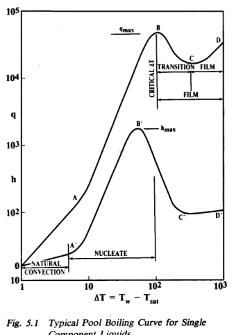

*图 5.1：单组分液体典型池沸腾曲线。*

在 A 或 A′ 点以前，传热以自然对流方式进行，表面看不到气泡。液池局部过热，蒸发发生在液-汽界面。到达 A 或 A′ 点时，局部过热度足以激活受热表面的成核点，蒸汽气泡开始形成。

气泡的快速甚至近似爆发式形成，会在液膜内产生很强的局部速度，从而显著提高传热。在 A 到 B 或 A′ 到 B′ 区域中，越来越多的气泡成核点被激活，这一区域称为[核态沸腾](../../../glossary/terms.md#term-nucleate-boiling)。在热流曲线的 B 点，也就是临界温差、离开核态沸腾点或烧毁点，继续提高表面温度反而会使热流密度降低。注意，热流曲线的 B 点并不对应传热系数曲线的 B′ 点；它出现在传热系数对温差曲线斜率为 -1 的温差处。

接近 B 点并进入 B-C 区域时，同时发生多种现象。大量成核点和快速蒸汽生成会阻止液体接近表面，使表面缺液；Zuber 将其定义为水动力危机。另一方面，越过 B 点后的短过渡区之后，膜态沸腾也会发生。Happel 和 Stephan 还观察到，在达到最小热流点 C 以前，连续蒸汽膜就已形成。

在[膜态沸腾](../../../glossary/terms.md#term-film-boiling)中，连续蒸汽层覆盖受热表面，使液体不能直接接触表面。蒸汽层的绝热作用降低传热率和传热系数。随着温差增大，蒸汽膜变厚，并在接近 C′ 点处达到某种最大厚度；此后，由于辐射以及蒸汽膜内进一步的对流作用，传热系数缓慢上升。

从核态沸腾到膜态沸腾的过渡区中，快速蒸汽生成会以粗糙、脉动、偶尔塌陷并重新润湿表面的汽液界面包覆管子。许多文献把过渡区定义为最大热流 B 点到最小热流 C 点之间，但也有实验在达到最小热流以前就观察到稳定蒸汽膜。

膜态沸腾与[莱顿弗罗斯特效应](../../../glossary/terms.md#term-leidenfrost-effect)关系密切。Leidenfrost 早在 1756 年观察到，液体滴在非常热的表面上时会形成不接触表面的液滴，液滴悬浮在表面上缓慢蒸发；当表面温度降到某一温度以下时，液滴会接触表面并迅速蒸发。因此，实际最大热流 B 点可能同时受水动力危机和膜态沸腾影响。

从实用角度看，只有 A-B 段通常有工程意义，因为在 B-C 区域运行会导致过高的表面温度。少数场合下膜态沸腾不可避免，例如低沸点液体汽化或低温蒸发器。试图利用膜态沸腾来降低污垢或腐蚀通常并不现实，因为启动、停机和过渡区膜层波动会使运行很难稳定。

蒸发器启动方式会影响后续运行。当热媒温度对应的温差超过临界温差时，若热源先作用而设备中还没有液体，管壁温度会接近热媒温度；随后进液时，沸腾可能直接从膜态或过渡区开始。若蒸发器先充满液体再通入蒸汽，壁温会从液体温度沿 A-B 段上升，更容易落在核态沸腾区。因此当热媒温度高于饱和温度加临界温差时，冷启动应先保证蒸发器中有液体。

### 5.1.2 Nucleation

### 5.1.2 成核

成核可以是均相的，也可以是异相的。均相成核发生在液体内部，异相成核发生在液体-固体界面。成核现象已被大量理论和实验研究，本手册只给出与设计相关的基本认识。

对球形气泡界面，由表面张力可得平衡关系：

原式截图：[eq-5-1-original.png](./assets/eq-5-1-original.png)

$$
P_{sat}-P_l=\frac{2\sigma}{r_c}
\tag{5.1}
$$

其中，Psat 为平界面处蒸汽饱和压力，Pl 为液体压力，σ 为表面张力，rc 为气泡曲率半径。借助流体蒸气压曲线，这一压力差可以转化为维持半径 rc 气泡所需的液体过热度。

均相成核所需过热度很大，在存在固体表面时通常难以实现。原书列出基于热力学和动力学理论的均相与异相成核过热公式：

原式截图：[eq-5-2-original.png](./assets/eq-5-2-original.png)、[eq-5-3-original.png](./assets/eq-5-3-original.png)

这些公式表明，异相成核所需过热度低得多，并且还取决于气泡与固体之间的接触角。接触角又受表面润湿性、孔穴形状、局部温度梯度等因素影响。

虽然人们已经相当深入地理解了成核的影响因素，但这些理论对工业蒸发器设计的直接帮助有限。原因在于：实际表面特性无法在制造前完全知道，运行中腐蚀和污垢会改变表面，溶解气体、混合物和固体颗粒会改变液体物性，发展中的气泡周围还存在局部温度和浓度梯度。此外，当两相流成为主导因素后，成核改善传热的相对作用会下降。

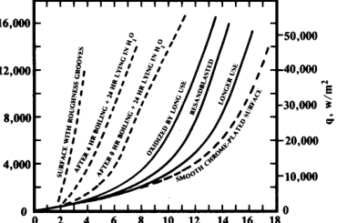

*图 5.2：表面条件和运行暴露对核态沸腾的影响。*

改善表面成核特性，会把图 5.1 中的曲线向左移动，但对 B 点最大热流影响不大。结果是在给定温差下得到更高传热，或在给定热流下需要更低温差。这在可用温差很小的场合很重要，在低温工况中尤其关键，因为动力消耗常与温差直接相关。

已有商业化的专有强化表面，也有机械加工表面，包括 Trufin。这些表面可大幅降低成核所需过热度，并使传热系数提高 3 到 10 倍。但它们必须谨慎使用，因为污垢、腐蚀或高沸点残留物积聚可能破坏其强化效果。

### 5.1.3 Nucleate Boiling Curve

### 5.1.3 核态沸腾曲线

核态沸腾曲线从图 5.1 的 A 点开始，到 B 点结束。该段斜率很陡，热流密度与温差的指数通常约为 2 到 4，传热系数可写成类似 h = aΔTm 的形式。观察表明，随着温差增大，更多成核点被激活；但当成核点间距小于气泡直径时，新增成核点的有效性应当下降。至今仍没有完整理论能严格证明为什么这个指数会如此之高。

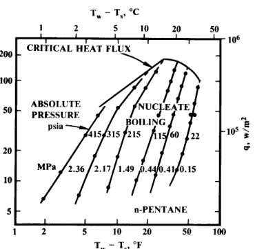

*图 5.3：压力对正戊烷沸腾曲线的影响。*

A-B 段的位置会因表面特性、表面张力、压力、溶解气体或固体以及混合物中的高沸点组分而向左或向右移动。图 5.2 说明表面变化如何改变曲线，图 5.3 说明压力如何影响核态沸腾曲线。

在二元混合物中，若两组分都能汽化，则混合物沸腾曲线通常位于两个纯组分曲线之间。更易挥发组分优先蒸发，会在液膜中造成局部浓度梯度、物性变化以及界面饱和温度变化。若另一组分沸点很高、几乎不挥发，则其浓度升高会把 A-B 曲线向右移动，降低传热系数；高沸点组分还可能积聚在成核空穴中，使强化表面失效。

### 5.1.4 Maximum or Critical Heat Flux

### 5.1.4 最大或临界热流密度

图 5.1 的 B 点是核态沸腾区域的最大热流密度，也常称为[临界热流密度](../../../glossary/terms.md#term-critical-heat-flux)。理论上，若沿 C-D 膜态沸腾段继续提高温差，可以在很高表面温度下获得更高热流；但这些说法主要针对单管池沸腾。管内沸腾或管束沸腾中的最大热流还可能由水动力条件、干壁、雾状流或循环不稳定造成。

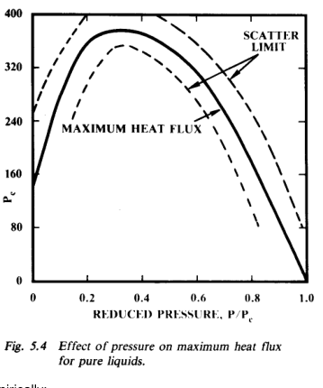

*图 5.4：压力对纯液体最大热流的影响。*

最大热流取决于压力，并随约化压力出现峰值。原书给出基于力平衡模型的非金属液体最大热流式，以及 Mostinski 基于对应状态法得到的简化式。后者在工程设计中更便于使用：

原式截图：[eq-5-4-original.png](./assets/eq-5-4-original.png)、[eq-5-5-original.png](./assets/eq-5-5-original.png)

$$
q_{max}
=803P_cP_r^{0.35}(1-P_r)^{0.9}
\tag{5.5}
$$

该式意味着在临界压力处最大热流趋近于零。实验表明，在超临界压力下仍可能出现类似沸腾的现象，部分原因是局部温度变化导致的密度差。最大热流还受表面方向、形状和混合物影响；这些影响难以预测，商业设备设计中通常不单独修正。

### 5.1.5 Film Boiling

### 5.1.5 膜态沸腾

完全发展的膜态沸腾中，蒸汽以平滑连续膜覆盖受热表面，只有生成蒸汽从膜中以大气泡逸出的位置例外。如果受热面为垂直面并穿过液位，蒸汽可从环形空间端部逸出，不一定形成气泡。

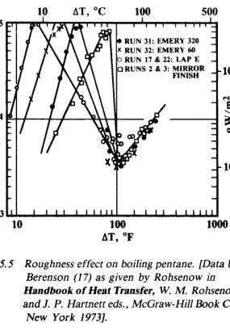

*图 5.5：表面粗糙度对戊烷沸腾的影响。*

完全发展的膜态沸腾中基本看不到表面粗糙度影响。膜态沸腾传热虽可相当合理地预测，但由于需要很高温差，工业上通常避免。高能源成本下，浪费温差势能不经济；同时，认为膜态沸腾可减少腐蚀或污垢的优点往往并不可靠。低温蒸发或某些低沸点化学品汽化中，受热源限制可能无法避免膜态沸腾。

### 5.1.6 Boiling Inside Tubes

### 5.1.6 管内沸腾

管内沸腾也可能处于核态或膜态沸腾状态，但还必须考虑汽液两相共同沿管流动这一额外因素。随着液体汽化，沿程干度增加，流型不断变化，传热和压降都受到两相流型影响。

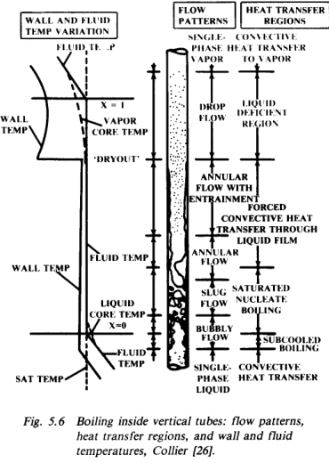

*图 5.6：垂直管内沸腾的流型、传热区域以及壁温和流体温度变化。*

循环系统中若发生完全汽化，管内压降会使入口局部沸点相对出口压力升高，因此入口会存在液体预热区。当局部管壁温度相对于局部压力下饱和温度具有足够过热时，壁面成核点开始生成气泡，传热受核态沸腾系数控制。随着两相混合物加速，两相对流传热可逐渐占主导。

根据管子方向，可能出现水平管分层流、垂直管弹状流，并在进一步汽化后发展成环状流。当蒸汽质量分数很高，通常超过 60% 时，可能发展为雾状流，壁面变干，传热转为对蒸汽的强制对流；蒸汽会过热并继续蒸发夹带液滴。若壁温足够高，也可能出现膜态沸腾，此时形成反环状流，即蒸汽膜包围液芯。

单根管整体性能也可能出现类似图 5.1 A-B-C 段的最大热流现象。但管内最大热流可能由三类原因造成：膜态沸腾，高干度导致干壁，或者两相压降曲线引起的水动力不稳定和流量脉动。其中第三类不稳定与整个循环回路压降特性有关，而不仅是某根管内部。

### 5.1.7 Subcooling and Agitation

### 5.1.7 过冷和搅动

前述讨论默认液体进料处于蒸汽饱和温度。若液池为过冷液体，且管壁温度不足以激活成核点，则传热为自然对流。一旦成核点被激活，局部传热会像核态沸腾一样很高，但气泡进入液膜或离开表面后很快塌缩，这称为初始沸腾。传热系数会很快接近饱和核态沸腾值。

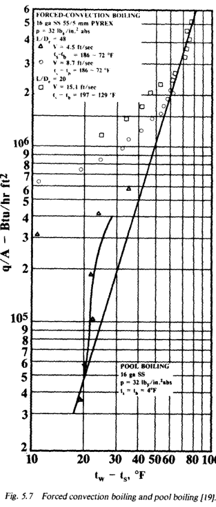

*图 5.7：强制对流沸腾与池沸腾的比较。*

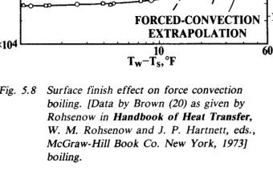

*图 5.8：表面状态对强制对流沸腾的影响。*

池沸腾中的搅动会改变传热曲线。管内强制对流沸腾中，传热起初沿对流曲线发展，一旦成核开始，则进入核态沸腾曲线。图 5.8 还说明，在强制对流沸腾中，表面状态对系数的影响远小于静止池沸腾。

## 5.2 Vaporizers - Types and Usage

## 5.2 蒸发器类型和用途

### 5.2.1 General

### 5.2.1 概述

蒸发器有许多结构和操作方式。根据用途不同，其设计、制造、检验、试验、运行和维护会受到规范和法规约束，最终目标是保证操作人员和社区安全。本手册不讨论所有规范问题，而只讨论过程工业常用的蒸发器，尤其是管壳式换热器。

按汽化发生位置，可大体分为两类：管内汽化和管外汽化。选择蒸发器类型时需综合考虑汽化目的、沸腾流体是单组分还是多组分、是否含不挥发液体或溶解固体、热源类型、污垢和排污要求、操作压力以及是否接近真空或临界压力等。管子可以是光管、翅片管或强化表面管；Trufin 管的应用在后文讨论。

### 5.2.2 Boiling Outside Tubes

### 5.2.2 管外沸腾

#### 5.2.2a Kettle Reboilers

#### 5.2.2a 釜式再沸器

[釜式再沸器](../../../glossary/terms.md#term-kettle-reboiler)把水平 U 形管束放在加大壳体底部，管束上方由挡板控制液位。多余液体，即塔底液或排污液，越过挡板进入端部区域，并由液位控制器控制。挡板液位上方空间用于从管束上方的飞溅和雾沫中分离蒸汽。循环液体从壳体与管束之间的偏心环形空间返回管束。

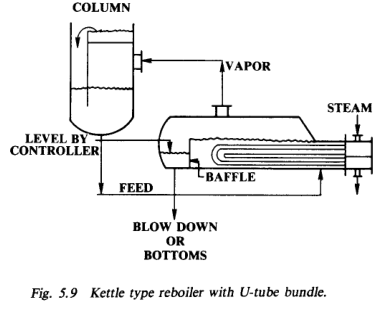

*图 5.9：带 U 形管束的釜式再沸器。*

釜式再沸器优点是对水动力不敏感、可靠、易于估算；可达到较高热流，可在低温差下运行，可处理高汽化率，管道简单，面积不受严格限制。缺点是污物和不挥发物会在壳侧积聚，若没有足够排出会不断浓缩；壳侧难清洗；宽沸程液体的混合程度和正确平均温差难以判断；加大壳体成本高。

图 5.10 是另一种釜式再沸器形式，即固定管板管壳式换热器，采用满管束并用壳侧液位控制运行。这种设备用于大型制冷和空调装置，制冷剂较清洁，通常完全蒸发。位于汽相空间的管子可用于干燥和过热蒸汽，以供压缩机使用。

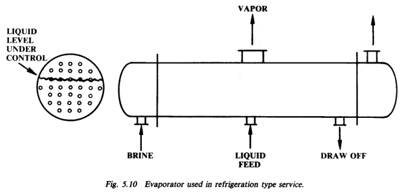

*图 5.10：制冷服务中使用的蒸发器。*

#### 5.2.2b Column Internal Reboiler

#### 5.2.2b 塔内再沸器

图 5.11 所示 U 形管束插入塔侧，作用类似釜式再沸器，但不需要外部壳体和连接管道。它可减少由于进料线或蒸汽线位置和尺寸不当引起的水力问题。缺点是可安装面积有限，需要大法兰和内部支承，管子较短导致管束昂贵，并且清洗时必须停塔，不能备用运行。

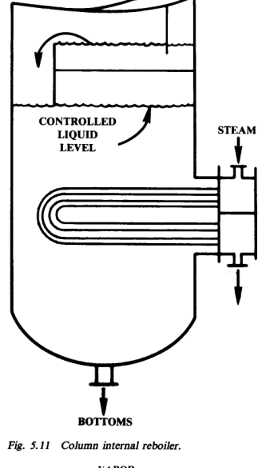

*图 5.11：塔内再沸器。*

#### 5.2.2c Horizontal Thermosyphon Reboilers

#### 5.2.2c 水平热虹吸再沸器

水平[热虹吸再沸器](../../../glossary/terms.md#term-thermosyphon-reboiler)采用常规带折流板管壳式换热器，壳侧沸腾，管内走加热介质。通过管道布置，使塔内液体与出口管中两相混合物之间的密度差形成循环驱动力。

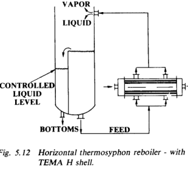

*图 5.12：TEMA H 壳水平热虹吸再沸器。*

其优点是循环量较高，可能得到比釜式再沸器更好的平均温差；塔裙高度低于垂直热虹吸；高流速和较低出口汽相分数可降低高沸点残留物影响并减少污垢；面积不受严格限制，也可处理易结垢的加热液体。缺点是壳侧结垢难清洗，折流板和支撑可能产生蒸汽包覆和局部干涸，多喷嘴和复杂管道不可避免，水动力设计资料较少，占地和结构费用较高。

#### 5.2.2d Vertical Shell-Side Thermosyphon

#### 5.2.2d 垂直壳侧热虹吸

垂直壳侧沸腾换热器并不常用于塔再沸，但常见于填充催化剂管式反应器冷却。由于填料和严格温控要求，会采用图 5.13 所示的垂直填充管反应器，并通过高位汽包形成循环。若上管板处温度条件不合适，蒸汽可能在管板下形成蒸汽覆盖层。

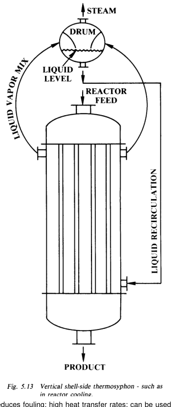

*图 5.13：垂直壳侧热虹吸，常见于反应器冷却。*

### 5.2.3 Boiling Inside Tubes

### 5.2.3 管内沸腾

#### 5.2.3a Vertical Thermosyphon

#### 5.2.3a 垂直热虹吸

垂直热虹吸通常采用单程 TEMA E 壳。出口管面积约等于所有管子总截面积，并尽量减小上管板与塔喷嘴之间的垂直距离。塔内液位通常保持在上管板高度，以获得最大循环。若液位降到管长的三分之一到二分之一，可得到更好传热系数，但循环会下降并可能增加结垢。真空服务中，静压头对局部沸点影响明显，常采用较低浸没高度。

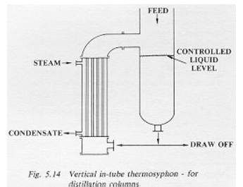

*图 5.14：用于精馏塔的垂直管内热虹吸。*

该类蒸发器循环驱动力来自塔内液体与管内两相混合物的密度差。优点是循环较高、可减少污垢，管侧污垢更易清洗，E 壳和连接管道较便宜、支撑方便、结构紧凑。缺点是需要更高空间和塔裙高度；由于不稳定，最大热流可能低于釜式再沸器；低温差或真空服务中，静压头导致的沸点升高可能成为问题；面积和汽化率也受限制。

#### 5.2.3b Vertical Long Tube Evaporators

#### 5.2.3b 垂直长管蒸发器

垂直长管蒸发器布置近似垂直热虹吸，但可省去再循环线，本质上是一次通过蒸发器，进料量单独控制。汽化质量分数可很高，甚至接近 100%，具体取决于进料沸程和结垢特性。由于有效浸没高度很低，管内大部分区域处于环状爬膜或雾状流状态。这类设备可在较低压力下操作，可处理黏性和宽沸程混合物，但常用温差通常中等。

#### 5.2.3c Forced Circulation Evaporators

#### 5.2.3c 强制循环蒸发器

强制循环蒸发器可为垂直或水平换热器，也可多程。管内通常很少汽化，特别是在最后一程以前，设备本质上按加热器处理；液体通过节流后闪蒸，分离液体再返回泵吸入口。其优点是高速度和少汽化可降低结垢，高传热率，可用于很低绝对压力和黏性塔底液，也可采用标准换热器和较小管道。缺点是泵和泵功费用。

### 5.2.4 Other Types of Evaporators

### 5.2.4 其他蒸发器类型

直接燃烧蒸发器，例如蒸汽发生器和管式炉，主要传热问题在热源侧，通常属于专门设计和专有方法范围，本手册不展开。

[降膜蒸发器](../../../glossary/terms.md#term-falling-film-vaporizer)中，薄液膜沿垂直管内壁向下流动，或跨越水平管束向下流动。液膜很薄，传热系数高，气泡形成很少甚至没有。由于压降低、静压头可忽略，它们适合很低压力以及低温差高系数工况。液体滞留量低，适合温敏液体；还可使用汽提气降低温度水平。

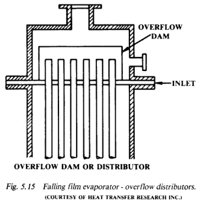

*图 5.15：降膜蒸发器的溢流分配器。*

缺点是液体必须均匀分配到所有管子，并且要在所有表面维持足够液膜；某些物性或热流条件下可能形成[干斑](../../../glossary/terms.md#term-dry-spot)。图 5.16 给出几种管侧分配器形式。垂直管降膜装置中，分配均匀性非常关键。

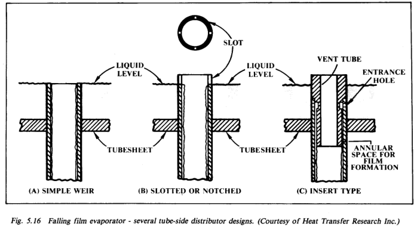

*图 5.16：降膜蒸发器的几种管侧分配器设计。*

水平管降膜设备中，初始分布均匀性相对不那么关键，常用简单溢流或喷淋装置。机械搅拌薄膜蒸发器则用贴近壁面的搅拌器或刮板形成液膜，适合很低压力运行，并能减少干斑和污垢，但机械驱动、轴承、密封和制造精度成本很高，单台能力也受限。

## 5.3 Boiling Heat Transfer

## 5.3 沸腾传热

沸腾液体传热系数预测存在很大误差，主要因为表面成核特性难以指定、制造和长期保持。虽然误差很大，但沸腾系数只是总传热系数的一部分，因此对整体设计的影响会被其他热阻部分削弱。不过，安全系数选择和操作参数选择仍必须考虑这些不确定性。

单管沸腾热流曲线是基本出发点。先用自然对流系数得到自然对流热流线：

原式截图：[eq-5-6-original.png](./assets/eq-5-6-original.png)

$$
q_{nc}=h_{nc}\Delta T
\tag{5.6}
$$

然后计算核态沸腾热流曲线，二者交点为 A 点。再计算最大热流确定 B 点。若运行可能超过临界温差，则再计算最小膜态热流及对应温差，确定 C 点，并画出膜态沸腾段。B-C 中间区域没有可靠预测式，工程上用直线连接。真实曲线在各段之间平滑过渡，但设计中忽略这种过渡通常略偏保守。

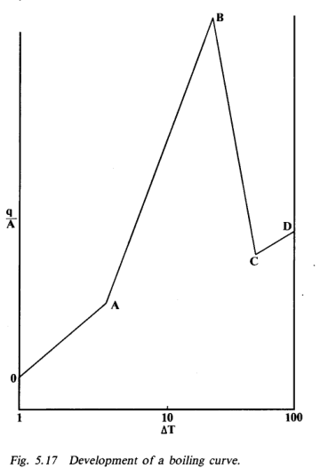

*图 5.17：用自然对流、核态沸腾、临界热流和膜态沸腾构造工程沸腾曲线。*

### 5.3.1 Pool Boiling - Single Tube

### 5.3.1 池沸腾：单根管

#### 5.3.1a Natural Convection

#### 5.3.1a 自然对流

当壁温过低，不能启动核态沸腾时，传热系数按液体自然对流计算，温差为壁温与液体温度之差。水平管自然对流公式见原式：

原式截图：[eq-5-7-original.png](./assets/eq-5-7-original.png)

#### 5.3.1b Nucleate Boiling

#### 5.3.1b 核态沸腾

理论型核态沸腾关联式通常需要大量物性数据，且表面条件不确定，使其对设计者并不实用。工程设计常采用 Borishanski 基于对应状态法、并经 Mostinski 和 Collier 修正的形式：

原式截图：[eq-5-8-original.png](./assets/eq-5-8-original.png)、[eq-5-8a-original.png](./assets/eq-5-8a-original.png)

$$
h_{nb}=A^*q^{0.7}F(P_r)
\tag{5.8}
$$

$$
A^*=0.00658P_c^{0.69}
\tag{5.8a}
$$

其中 A* 是在参考约化压力下评估的常数，F(Pr) 为图 5.18 给出的约化压力函数。

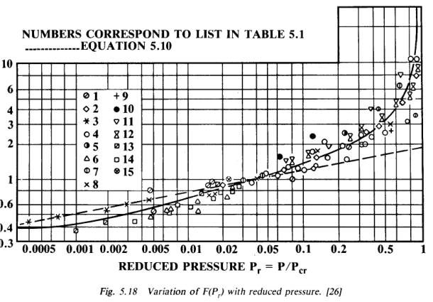

*图 5.18：约化压力函数 F(Pr) 的变化。*

原书给出 F(Pr) 的若干计算式：

原式截图：[eq-5-9-original.png](./assets/eq-5-9-original.png)、[eq-5-10-original.png](./assets/eq-5-10-original.png)、[eq-5-11-original.png](./assets/eq-5-11-original.png)

其中，池沸腾设计可使用更保守的简化式：

$$
F(P_r)_2=1.8P_r^{0.17}
\tag{5.10}
$$

需要强调的是，这些式子是为单组分液体建立的。系统压力、表面状态、非凝气、沸腾曲线滞后、表面尺寸和方向、过冷、润湿性和重力加速度都会影响结果。

#### 5.3.1c Critical or Maximum Heat Flux

#### 5.3.1c 临界或最大热流

Cichelli 和 Bonilla 发现最大热流是约化压力的函数，并在约化压力约为 0.3 处出现最大值。Zuber 基于表面水动力模式受限假设，提出了临界热流理论式；其原式见：

原式截图：[eq-5-12-original.png](./assets/eq-5-12-original.png)

图 5.19 汇总了不同几何形状的最大热流预测。商业设计中常采用该类临界热流公式，但必须认识到黏度、过冷和表面条件会带来额外影响。

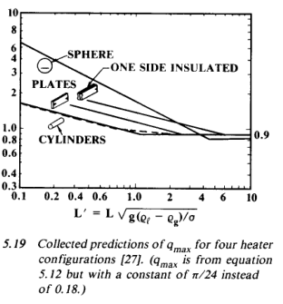

*图 5.19：不同加热体构型的最大热流预测。*

#### 5.3.1d Minimum Film Boiling Flux

#### 5.3.1d 最小膜态沸腾热流

膜态沸腾的最小热流对应图 5.17 的 C 点，表示维持稳定蒸汽膜所需的最低蒸汽生成率。原书列出由 Berenson 分析和 Zuber 理论得到的最小膜态热流及对应最小温差公式：

原式截图：[eq-5-13-original.png](./assets/eq-5-13-original.png)、[eq-5-14-original.png](./assets/eq-5-14-original.png)

#### 5.3.1e Film Boiling Heat Flux

#### 5.3.1e 膜态沸腾热流

高温差下，连续蒸汽膜覆盖表面，理论分析常与膜状冷凝相类比。原书给出大水平板、管子以及等效潜热的计算式：

原式截图：[eq-5-15-original.png](./assets/eq-5-15-original.png)、[eq-5-16-original.png](./assets/eq-5-16-original.png)、[eq-5-17-original.png](./assets/eq-5-17-original.png)、[eq-5-18-original.png](./assets/eq-5-18-original.png)、[eq-5-19-original.png](./assets/eq-5-19-original.png)

在这些温度水平下，辐射也会重要。Bromley 建议总膜态传热系数按导热/对流膜系数与辐射系数组合：

原式截图：[eq-5-20-original.png](./assets/eq-5-20-original.png)

$$
h_{ft}=h_f+0.75h_r
\tag{5.20}
$$

### 5.3.2 Single Tube in Cross Flow

### 5.3.2 横流中的单根管

横流对沸腾系数的影响见图 5.20。基本规律是：在低温差下，强制对流系数可能超过核态沸腾系数；在较高温差下，核态沸腾变为主导。工程上简单规则是取较高的系数。

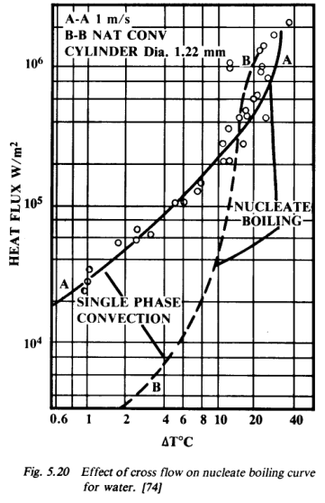

*图 5.20：横流对水核态沸腾曲线的影响。*

横流速度也会影响临界热流，但影响大小与管径相关，并在接近工业常用尺寸时趋于减弱，如图 5.21 所示。膜态沸腾区域低横流速度可用管子膜态沸腾式，高速度且过冷小于约 45 °C 时可用原书式 (5.21)：

原式截图：[eq-5-21-original.png](./assets/eq-5-21-original.png)

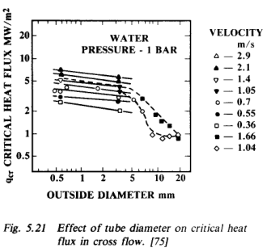

*图 5.21：管径对横流临界热流的影响。*

### 5.3.3 Boiling on Outside of Tubes in a Bundle

### 5.3.3 管束外侧沸腾

尽管水平管束应用广泛，可用于预测其传热的数据很少，公开方法也较初步。早期研究认为管束和单管系数近似相同；后续研究显示，由于管束内诱导循环，管束可能优于单管。图 5.22 显示，管束内不同位置的系数分布并不规则，但总体上从下部向上部增加。

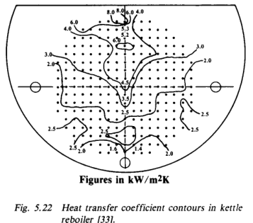

*图 5.22：釜式再沸器管束中的传热系数等值线。*

Palen 建议采用：

原式截图：[eq-5-22-original.png](./assets/eq-5-22-original.png)

$$
h_b=h_{nbl}F_bF_m+h_{nc}
\tag{5.22}
$$

其中 Fb 通常可取 1.5，hnc 为自然对流系数，hnbl 为单管核态沸腾系数，Fm 为混合物修正。1.5 是保守近似，实际可随管束布局、尺寸和热流提高到约 3。

管束最大热流与单管不同，通常更低。Palen 和 Small 基于蒸汽覆盖效应提出了修正项 Φb，用于乘以单管最大热流，原式见：

原式截图：[eq-5-23-original.png](./assets/eq-5-23-original.png)

### 5.3.4 Boiling Inside Tubes

### 5.3.4 管内沸腾

管内汽化涉及多个流型，每个流型都需不同传热系数，并且局部温差又依赖对应的压降计算。多数设备为自然循环设计，已知的是可用液柱压头，而不是每根管内流量，因此必须通过试算求出每根管进料量。该计算过程不适合手算，通常由程序完成。

#### 5.3.4a Single Phase Liquid Region

#### 5.3.4a 单相液体区

循环蒸发器中，进入管子的液体温度低于局部沸点，因为静压头会升高饱和温度。液体区延伸到液体温度升高且局部压力降低、达到局部饱和点为止；实际还需额外过热度来启动成核。液体区传热系数按层流或湍流单相液体关联式计算：

原式截图：[eq-5-24-original.png](./assets/eq-5-24-original.png)、[eq-5-25-original.png](./assets/eq-5-25-original.png)

#### 5.3.4b Boiling Region

#### 5.3.4b 沸腾区

沸腾区可进一步分为过冷沸腾、饱和沸腾和两相沸腾。Chen 的方法把饱和沸腾和两相区域合并，用一个由核态沸腾和对流沸腾共同组成的式子表示：

原式截图：[eq-5-26-original.png](./assets/eq-5-26-original.png)

$$
h_b=sh_{nb}+h_{cb}
\tag{5.26}
$$

其中 hb 为沸腾系数，hnb 为核态沸腾系数，hcb 为对流沸腾系数，s 为 Chen 抑制因子。对流项与 Lockhart-Martinelli 两相参数 Xtt 有关：

原式截图：[eq-5-27-original.png](./assets/eq-5-27-original.png)、[eq-5-28-original.png](./assets/eq-5-28-original.png)、[eq-5-29-original.png](./assets/eq-5-29-original.png)

核态沸腾系数按单管核态沸腾系数和混合物修正给出：

原式截图：[eq-5-30-original.png](./assets/eq-5-30-original.png)、[eq-5-31-original.png](./assets/eq-5-31-original.png)、[eq-5-32-original.png](./assets/eq-5-32-original.png)、[eq-5-33-original.png](./assets/eq-5-33-original.png)

#### 5.3.4c Mist Flow

#### 5.3.4c 雾状流

雾状流中，剩余少量液体以液滴夹带在蒸汽中，管壁基本干燥，传热系数迅速下降并接近气体传热。此时热量先传给蒸汽，蒸汽再把部分热量传给液滴，直到液滴完全蒸发；之后只剩对气体的显热加热。

主要问题是确定蒸汽温度，因此也难以确定温差。原书建议可用类似气体单相传热式估算，再用工程判断估计传给蒸汽的显热中有多少用于液滴蒸发。雾状流起点可由 Fair 图或简式估计：

原式截图：[eq-5-34-original.png](./assets/eq-5-34-original.png)

$$
G_{mm}=1.8(10^6)X_{tt}
\tag{5.34}
$$

#### 5.3.4d Film Boiling

#### 5.3.4d 管内膜态沸腾

管内膜态沸腾应尽量避免，因为存在控制问题、可能结垢，并且缺少压降计算数据。若全管长温差都足够高，可使用 Glickstein 和 Whiteside 关联式估算：

原式截图：[eq-5-35-original.png](./assets/eq-5-35-original.png)、[eq-5-36-original.png](./assets/eq-5-36-original.png)

但核心困难仍是确定质量速度。管内膜态沸腾中，液芯被低黏度蒸汽环膜包围，公开文献中缺少该情形的流量数据，因此循环量估算非常困难。也可用池沸腾关联式作替代估算。

#### 5.3.4e Maximum Heat Flux for Stable Operation

#### 5.3.4e 稳定运行的最大热流

垂直管热虹吸中存在多种运行限制，包括喘振、临界热流和雾状流。喘振不稳定发生在温差超过某一限制时，但它与水力布置有关，可通过物理布置调节。常规热虹吸设计建议出口管截面积等于所有管子总截面积，入口液体线通常较小，为出口管面积的 25% 到 50%。

随着温差升高，给定管子的汽化率会增加、达到最大值后再下降。Palen 关联式较简单，原式见：

原式截图：[eq-5-37-original.png](./assets/eq-5-37-original.png)

### 5.3.5 Boiling of Mixtures

### 5.3.5 混合物沸腾

[混合物沸腾](../../../glossary/terms.md#term-mixture-boiling)使传热系数预测更加复杂，因为局部组成变化会影响物性和沸点。理解这些影响可先从二元混合物入手。

当二元混合物沸腾时，生成蒸汽更富含低沸点组分。图 5.23 表示液体组成的泡点曲线和对应蒸汽组成的露点曲线。液体混合物加热到泡点时，第一批气泡形成；冷却二元蒸汽时，第一滴冷凝液在露点形成。露点和泡点之间的温度范围对应汽液两相共存。

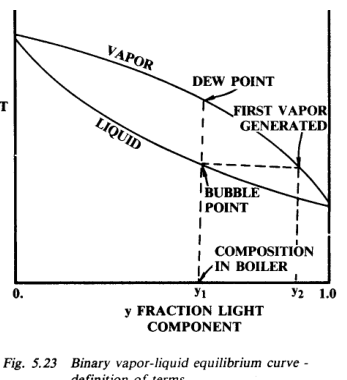

*图 5.23：二元汽液平衡曲线，用于定义泡点、露点和组成。*

这些平衡曲线是在汽液平衡条件下得到的，而沸腾是非平衡过程。表面形成气泡会使液膜中低沸点组分被消耗，剩余液体的局部沸点升高。于是从表面到液膜沸点的有效温差小于表观温差，按表观温差计算的系数会偏低。

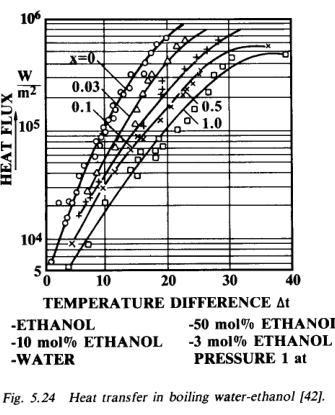

*图 5.24：水-乙醇混合物沸腾传热。*

早期混合物实验显示，混合物热流通常位于纯组分之间；按表观温差计算的传热系数总是低于纯组分系数，在汽液平衡线分离最大的浓度处出现最低值。图 5.25 和图 5.26 示出丙酮-正丁醇体系。

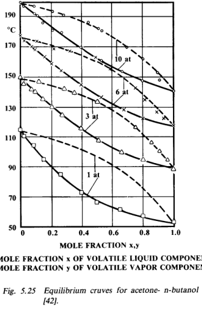

*图 5.25：丙酮-正丁醇平衡曲线。*

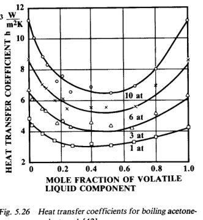

*图 5.26：丙酮-正丁醇沸腾传热系数。*

某些体系会形成共沸物，共沸组成处汽相和液相组成相同，表现得像单组分液体。图 5.27 和图 5.28 给出甲醇-苯体系相关数据，前者是平衡曲线，后者是沸腾传热系数。

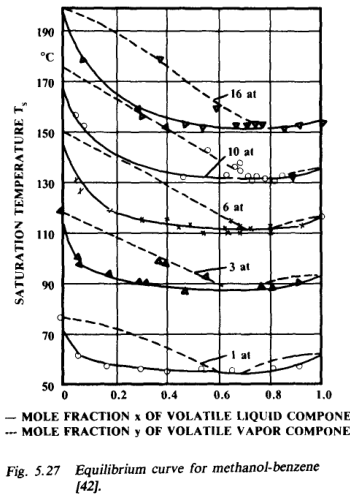

*图 5.27：甲醇-苯平衡曲线。*

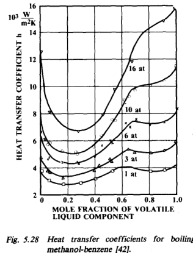

*图 5.28：甲醇-苯沸腾传热系数。*

工程上，Palen 和 Small 的经验方法使用混合物修正因子 Fm 修正挥发组分核态沸腾系数：

原式截图：[eq-5-38-original.png](./assets/eq-5-38-original.png)

$$
F_m=\exp(-0.015BR)
\tag{5.38}
$$

其中 BR 为沸程，即露点与泡点之差，单位为 °F；Fm 下限取 0.1。该方法可用于多组分体系的合理工程估算。

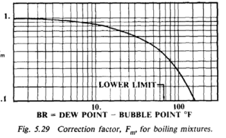

*图 5.29：混合物沸腾修正因子 Fm。*

混合物最大热流也可能不同于纯组分。某些数据甚至显示混合物最大热流可高于组分最大值，但机理和理论充分性仍有争议。设计中建议使用式 (5.5)，临界压力按摩尔平均估计，这会使最大热流位于组分值之间，通常偏保守。

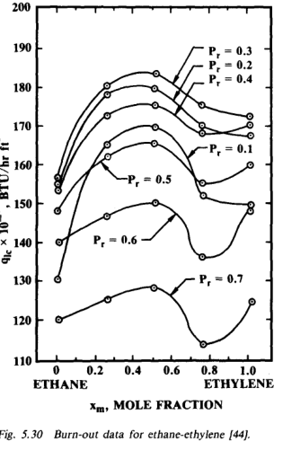

*图 5.30：乙烷-乙烯体系烧毁数据。*

## 5.4 Falling Film Heat Transfer

## 5.4 降膜传热

降膜蒸发器的特征是薄液膜与传热表面接触，因此传热方程本质上与冷凝方程相似，只是热流方向相反。这里假设不发生核态沸腾；由于降膜设备通常在高系数、低温差下运行，这一假设通常成立。若发生成核，传热会增加，因此忽略成核偏保守。

降膜蒸发器有一个特殊问题：干斑或液膜破裂。干斑可能由液量不足导致表面不能润湿，也可能由表面温度和热流过高使液体形成条流而留下干区。干斑热流很低，会降低能力，应避免。

### 5.4.1 Vertical In-Tube Vaporizer

### 5.4.1 垂直管内降膜蒸发器

管内降膜蒸发器必须把液体均匀分配到所有管子。图 5.16 中每根管使用的分配器类型会影响管板上允许的水力梯度。简单溢流堰对水力梯度非常敏感，开槽管则相对不敏感。分配器通常不是标准商品，而是针对具体应用设计。

即使进料接近饱和温度，仍需要预热段来建立液膜内温度梯度。原书给出层流和湍流区域的局部传热系数公式：

原式截图：[eq-5-39-original.png](./assets/eq-5-39-original.png)、[eq-5-40-original.png](./assets/eq-5-40-original.png)

表面蒸发时，层流和湍流的局部传热系数公式见：

原式截图：[eq-5-41-original.png](./assets/eq-5-41-original.png)、[eq-5-42-original.png](./assets/eq-5-42-original.png)、[eq-5-43-original.png](./assets/eq-5-43-original.png)

这些式子给出局部传热系数，设计时需沿蒸发器逐段计算。所有物性按液相评估。对混合物，还可能存在液膜和气膜中的传质阻力，处理方法与第 3 章冷凝类似。

### 5.4.2 Horizontal Shell-Side Vaporizer

### 5.4.2 水平壳侧降膜蒸发器

水平设备中，分配问题不如垂直管内设备严重，因为管排之间滴落很快会超过初始分配的影响。管间距、滴落和蒸汽速度对液滴运动仍有许多未解决问题，但可用原书给出的近似式估算预热区和蒸发区传热。

原式截图：[eq-5-44-original.png](./assets/eq-5-44-original.png)、[eq-5-45-original.png](./assets/eq-5-45-original.png)

水平装置常采用内外侧均强化的翅片管或强化表面，以改善传热。海水淡化和海洋温差能研究项目中有大量相关资料。

### 5.4.3 Dry Spots - Film Breakdown

### 5.4.3 干斑与液膜破裂

关于最小流量或高热流导致干斑和液膜破裂的理论已有发展，但与实验吻合只算一般。原书建议，对水而言，管底或管束底部的最小润湿流量应高于约 150 lb/hr ft，并且液膜温差不超过约 18 °F。

最小润湿率要求意味着可能需要一定再循环量。处理混合物时，再循环液会影响进料浓度和沸点，因此不能只从润湿角度考虑。

## 5.5 Special Surfaces

## 5.5 特殊表面

用于强化沸腾侧传热的商业表面包括翅片表面、特殊镀层表面，以及通过电镀、烧结或机械加工形成的多孔表面。用于沸腾和冷凝强化的 Trufin 管通常每英寸 16 到 40 片翅，翅高约 1/16 in.，形状类似螺纹。其基本目的，是增加单位长度暴露于沸腾液体的表面积，面积比可提高到 2.2 到 6.7。

翅片由挤压成形，多数金属均可制造。加工过程也会改变表面成核特性，从而带来强化表面因子。由于翅片很短，即使沸腾系数很高，翅片效率仍较高。铜等高导热金属的翅片效率几乎可达 100%；不锈钢等低导热金属可能下降到 70% 到 80%。

强化表面并不是改善再沸器性能的通用答案。必须考虑成本、可用材料和腐蚀要求、沸程和污垢特性、表面可清洗性、管束性能与单管性能差异，以及总传热中是否真正由沸腾侧控制。若热媒侧、污垢或管壁热阻控制总传热，改善沸腾系数并不会显著提高总体性能。

强化表面的主要应用，是低温差下清洁液体沸腾。Trufin 更多依靠面积增加，相对不易受污垢和宽沸程液体问题影响。按投影面积计，其最大热流似乎与光管相当。

### 5.5.1 Boiling on Fins

### 5.5.1 翅片上沸腾

翅片上沸腾的一个困难是确定翅片效率。核态沸腾系数强烈依赖局部壁面与液体之间的温差，而翅片温度沿长度变化，因此翅片效率通常需要逐步计算程序。原书引用了 Han、Chen、Cumo、Haley 和 Westwater 等人的相关研究。

Westwater 研究了翅片间隙影响，发现气泡尺寸是一个因素；在大气压力下，1/16 in. 间隙足以避免气泡干扰。

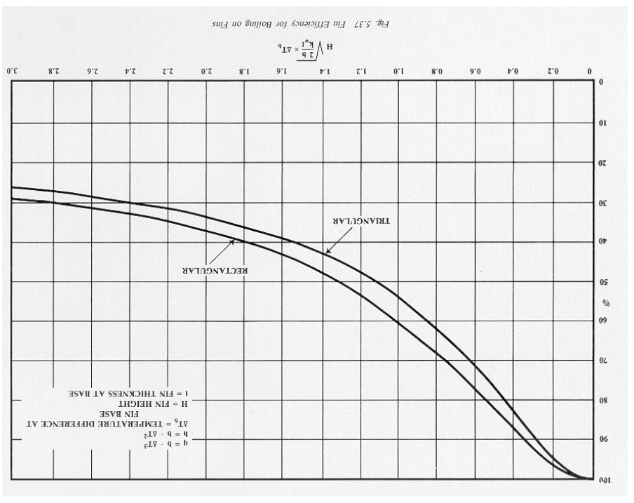

*图 5.37：用于沸腾翅片效率估算的图。*

### 5.5.2 Mean Temperature Difference

### 5.5.2 平均温差

所有沸腾过程中，液体相对于蒸汽饱和温度都会有一定过热，但平均温差计算通常忽略这部分过热。原因是过热量难以预测，且通常小于饱和温差。

管内沸腾的计算过程需要按流型分区，逐区计算传热和压降，因此温差自然包含在分段计算中，不另行计算单独平均温差。

管外沸腾中，平均温差取法具有一定任意性，取决于过冷量、沸程以及再沸器几何。关键问题是壳侧混合程度，而混合程度取决于循环率。当前对壳侧循环了解不足，估算循环率的方法仍处于发展阶段。

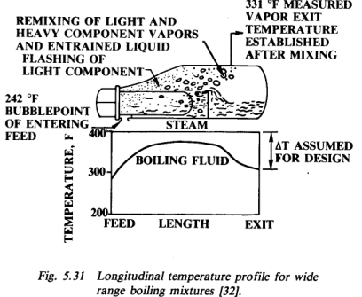

*图 5.31：宽沸程混合物再沸器中的长向温度分布。*

原书给出若干温差取法建议：纯组分或窄沸程混合物可用蒸汽饱和温度；若热媒为显热流体，可用与热媒端温的对数平均温差。宽沸程混合物或显热负荷占比较大时，逆流 LMTD 会偏乐观，建议用基于出口蒸汽温度的 LMTD。静压头显著时，应按包括静压头在内的管束平均压力确定沸腾温度。水平热虹吸再沸器中，逆流 LMTD 往往过于乐观，可采用并流 LMTD。

## 5.6 Pressure Drop

## 5.6 压降

系统总压降由三部分组成：静压差、动量变化造成的压差和摩擦压降：

原式截图：[eq-5-46-original.png](./assets/eq-5-46-original.png)

$$
\Delta P_t=\Delta P_s+\Delta P_m+\Delta P_f
\tag{5.46}
$$

沸腾系统中处理的是汽液混合物，蒸发区中汽液相对数量沿程变化。因此，这三部分压降必须按每一点的两相状态计算并沿系统积分。

两相压降比单相复杂得多。流型沿入口到出口可能大幅变化，汽相和液相通常以不同速度流动，局部流型和流量还可能波动。即使经过大量研究，两相压降预测达到 ±30% 已属优秀，±50% 可算很好，±100% 误差并不罕见。因此蒸发器设计必须给压降和相应流量留出足够裕量。

### 5.6.1 Tube-Side Pressure Drop

### 5.6.1 管侧压降

原书采用基于 Lockhart-Martinelli 分析的分相流模型，即汽相和液相流量按相同压力梯度建立。这仍是公开文献中较通用的模型之一。

垂直设备中，静压头损失非常重要，特别是在低热流和泡状流区域。原书给出静压头、两相密度和汽相体积分率关系：

原式截图：[eq-5-47-original.png](./assets/eq-5-47-original.png)、[eq-5-48-original.png](./assets/eq-5-48-original.png)、[eq-5-49-original.png](./assets/eq-5-49-original.png)

动量损失可由入口和出口状态逐段或整体计算：

原式截图：[eq-5-50-original.png](./assets/eq-5-50-original.png)

摩擦损失可按液相基准或气相基准表示，二者在相同条件下应给出相同结果，但液相形式适合液相雷诺数较高时，气相形式适合液相雷诺数较低时：

原式截图：[eq-5-51-original.png](./assets/eq-5-51-original.png)、[eq-5-52-original.png](./assets/eq-5-52-original.png)、[eq-5-53-original.png](./assets/eq-5-53-original.png)、[eq-5-54-original.png](./assets/eq-5-54-original.png)、[eq-5-55-original.png](./assets/eq-5-55-original.png)、[eq-5-56-original.png](./assets/eq-5-56-original.png)

这些式子沿管长逐步应用，总压降为各步压降之和。热虹吸再沸器中，计算压降必须与可用驱动压头相匹配；可用驱动压头等于总可用液柱减去再循环液体管线中的摩擦和动量损失。

### 5.6.2 Shell-Side Pressure Drop

### 5.6.2 壳侧压降

管束横流两相压降的计算与管内两相流类似，但数据更少，特别是在沸腾中常见的高液相比例区域。Ishihara 等人建议使用 Martinelli 分相流方法。图 5.32 显示数据与该方法的比较：高汽相比例区域符合较好，低汽相比例区域散布较大。

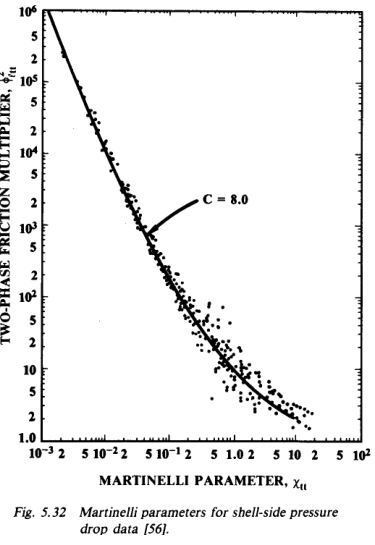

*图 5.32：用于壳侧压降数据的 Martinelli 参数。*

壳侧静压和动量损失按前述方法计算，但质量速度取管间最小流通面积处的最大质量速度。管束横掠摩擦压降公式见：

原式截图：[eq-5-58-original.png](./assets/eq-5-58-original.png)、[eq-5-59-original.png](./assets/eq-5-59-original.png)、[eq-5-60-original.png](./assets/eq-5-60-original.png)、[eq-5-61-original.png](./assets/eq-5-61-original.png)

上述式子可用于建立壳侧沸腾循环模型，但釜式再沸器中还存在若干额外困难：圆柱形管束中高度和流通面积随垂直位置变化，壳体与管束外径之间的下行流如何计算，循环流中气泡夹带造成密度降低如何处理。这些问题仍需更多研究。

## 5.7 Fouling

## 5.7 污垢

液体沸腾表面上的污垢可能产生意外结果。对成核点很少的光滑表面，初期污染可能增加成核点，使沸腾系数提高到足以抵消污垢层热阻。但这种效应依赖特殊条件，通常只存在于污垢初期。随着污垢层增长，其热阻会降低总传热系数和热流。

核态沸腾系数强烈依赖液膜温差，因此在总温差固定时，污垢热阻的影响会被放大。增加热阻会改变温度分配，进而改变沸腾系数，通常需要试算。原书把式 (5.8) 改写成：

原式截图：[eq-5-62-original.png](./assets/eq-5-62-original.png)

$$
q=[A^*F(P)]^{3.33}\Delta T^{3.33}=B\Delta T^{3.33}
\tag{5.62}
$$

图 5.33 以 q/B 与温差为坐标，并以 RoB 为参数，用于估计沸腾热阻以外的其他热阻对核态沸腾曲线的影响。

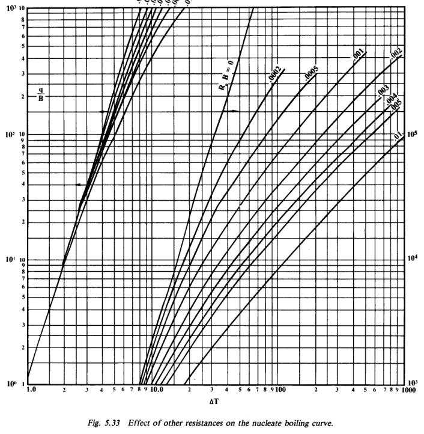

*图 5.33：其他热阻对核态沸腾曲线的影响。*

污垢系数本身含义模糊且不可靠。它本应允许设备运行一个合理时间后再停机清洗，但这个时间并未在系数中明确，而“合理”取决于场景。结晶蒸发器可能每班或每天清洗一次仍可接受；聚合结垢再沸器若需要物理清洗，则清洗周期应按清洗成本、停产损失和换热面积成本优化。

沸腾污垢还取决于沸腾类型。过渡沸腾和膜态沸腾早期，表面交替润湿和干燥，污垢可能非常快。原书给出一些粗略污垢热阻范围，可作为设计猜测的起点，但强调不能过分保守。过大污垢裕量可能导致清洁初期设备过大、沸腾控制困难、冷凝液排出困难、经济惩罚、循环减弱而反而加速污垢，甚至在固定温差下进入膜态沸腾区域。

## 5.8 Design Procedures

## 5.8 设计步骤

### 5.8.1 Selection of Reboiler Type

### 5.8.1 再沸器类型选择

选择[再沸器](../../../glossary/terms.md#term-reboiler)类型时，应至少考虑以下因素：

- 可清洗性：管侧通常比壳侧更容易清洗。
- 腐蚀和洁净要求：昂贵合金或需保持洁净的流体常放在管内，以避免昂贵合金壳体。
- 压力：高压流体通常放在管侧，以避免厚壁壳体；真空工况需结合其他因素判断。
- 温度：高温流体常放在管内，因为高温下降低的许用应力会影响壳体设计。
- 热媒要求有时比沸腾液体要求更重要。
- 沸腾流体特性：温敏液体需要低滞留量，宽沸程和浓度变化会影响循环要求，起泡液体可能更适合管内处理。
- 温差大小和沸腾类型会影响选型。
- 空间约束会排除某些垂直设备或塔内设备。
- 强化表面只适用于部分设备类型和工况。

### 5.8.2 Pool Type Reboilers

### 5.8.2 池式再沸器

常规釜式再沸器有浸没管束和蒸汽分离空间。蒸汽以饱和温度离开再沸器，可能夹带液滴。若需要干燥或过热蒸汽，例如压缩机进料，可增加分离器，或把部分管子放在汽相空间中用于干燥和过热。

典型管束直径约为壳体直径的 60%，液位刚好浸没管束。实际壳径由允许夹带量和相应蒸汽速度确定。原书给出蒸汽负荷经验式和喷嘴数经验式：

原式截图：[eq-5-63-original.png](./assets/eq-5-63-original.png)、[eq-5-64-original.png](./assets/eq-5-64-original.png)

$$
N_n\approx \frac{L}{5D_s}
\tag{5.64}
$$

管径通常为 5/8 到 1 in.，其中 3/4 和 1 in. 最常见。管长由热媒允许压降或空间限制决定。U 形管避免内部垫片，但弯头端不易机械清洗；若需要管侧机械清洗，可用固定管板直管。

管排列取决于清洗需求：易结垢工况用正方形排列，清洁液体可用三角形排列。节距比没有统一结论，因为最佳节距与循环量、汽化率、循环对系数的影响以及沸程有关。纯单组分液体只要管子保持润湿，传热通常较高；多组分液体则需要足够循环，以降低轻组分汽提导致的局部沸点升高。

### 5.8.3 In-tube or Thermosyphon Reboilers

### 5.8.3 管内或热虹吸再沸器

管内再沸器通常是垂直设备，壳侧为冷凝热媒。水平热虹吸再沸器的工艺流或热媒在管侧。二者都依赖进料和出口流之间密度差形成自然循环。垂直管内设备也可作为一次通过蒸发器运行，进料量由外部控制；本节主要讨论热虹吸作用再沸器。

管内蒸发器管径通常为 1 到 2 in.，管长 8 到 20 ft，空间受限时偏好短管。水平蒸发器可使用更长管。

水平热虹吸再沸器的基本设计方法，是估计汽化分数，根据管道布置和估计换热器压降确定循环率，再用液体对流或两相修正计算传热率。反复调整，直到计算和估计的汽化分数相符。汽化分数可高达约 25%。

管内蒸发器设计则先选定每根管流量，针对给定管径和管长计算传热和压降，再确定所需管数。随后计算管道压降，把总可用压头与总压降比较，并调整流量或阀门/节流件，直到压头平衡。

再沸器与精馏塔连接方式会影响再沸器性能。图 5.34 中，塔进料与再沸器回流液混合后再进入再沸器；这种布置简单，但平均温差最低，会牺牲一块汽提板，且高温滞留时间长，不利于热结垢。

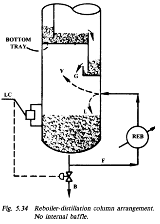

*图 5.34：无内挡板的再沸器-精馏塔连接。*

图 5.35 是总塔底进料系统，所有塔下流液一次通过再沸器。这给出最佳平均温差、低滞留量，适合结垢液体，但为了获得良好再沸器性能，最大汽化量通常限制为进料的 30%。

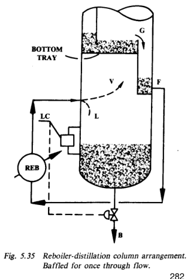

*图 5.35：为一次通过流动设置挡板的再沸器-精馏塔连接。*

图 5.36 是混合塔底进料方式。平均温差略低于总塔底进料，但对多数结垢服务足够，并且系统更灵活，只是塔内挡板更复杂。

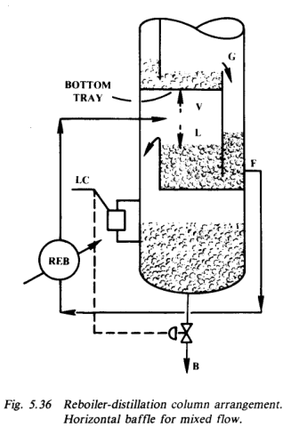

*图 5.36：水平挡板形成混合流的再沸器-精馏塔连接。*

## 5.9 Special Considerations

## 5.9 特殊考虑

再沸量对温差极其敏感，因此必须确定清洁和结垢条件下预期再沸量范围所需的温差范围，并确认该范围处于热媒可控能力内。冷凝热媒通常通过压力控制调节；显热热媒通常采用旁路控制，但此时热媒温差和热媒传热系数都会改变。

低负荷和清洁蒸发器使用冷凝热媒时，所需压力可能低到冷凝液排出困难。显热热源采用旁路时，流经蒸发器的热媒量可能下降到引起分布问题或加速结垢。

蒸发器应在有液体存在且尽可能低温差下启动。若污垢裕量过大、设计过分保守或低估传热系数，清洁再沸器的设计温差可能足以进入膜态沸腾区。在这种条件下，温差对热流的影响方向与核态沸腾相反，控制会失效，污垢也可能加速。

若清洁或低负荷时冷凝热媒压力过低，可固定淹没一部分传热面，使压力回到可控范围。但不宜通过连续改变淹没面积来控制再沸量，因为响应慢。部分淹没时还应考虑热应力，尤其是水平设备中被淹没和未淹没管子应力不同。

宽沸程混合物若重组分沸点高于热媒温度，需要即使在对流传热区也能循环的再沸器，否则轻组分会被汽提出去，局部停滞将发生。

接近临界压力运行会带来多重问题：汽液密度差低，循环驱动压头小；最大热流和临界温差也低。真空运行则必须仔细分析静压头对沸点的影响以及由此导致的温度夹点；沸点升高会延长液体预热段并减少可用循环压头。

低温差运行有时因过程经济性必需，此时关键问题是成核，通常需要强化表面。但传热系数预测不确定，建议针对具体表面和液体组合做实验。非常高温差则常见于低沸点液体汽化，此时必须评价膜态沸腾、雾状流和不稳定三类限制。

### 5.9.1 Examples of Design Problems

### 5.9.1 设计例题说明

设计换热器首先要假定几乎所有尺寸，然后计算该设计是否满足性能要求；若不满足，就修改假定并重复。设计问题本质上是一系列校核问题。蒸发器校核仍包含大量迭代，良好初猜可以显著减少计算量。后面的例题在初始步骤中展示了取得初步设计的一种方法。

## 5.10 Example of Design Problems for Trufin in Boiling Heat Transfer

## 5.10 Trufin 沸腾传热设计例题

### 5.10.1 Design Example - Kettle Reboiler

### 5.10.1 设计例题：釜式再沸器

该例题要求设计一台釜式再沸器，将 43.3(106) Btu/hr 热量传给 170 psia 下汽化的烃类混合物，热源为 395 °F 蒸汽。液体临界压力为 434 psia，沸程为 60 °F，沸腾温度为 330 °F。初始设计采用 3/4 in. 外径管、1.125 in. 正方形节距，估计潜热为 144 Btu/lbm，液体密度为 41 lbm/ft3。

例题步骤可概括为：

1. 估算热媒侧、管壁和污垢热阻，得到非沸腾热阻 Ro。
2. 由式 (5.38) 计算混合物修正因子 Fm。
3. 由式 (5.8a)、式 (5.10) 和式 (5.62) 计算 B、RoB，并用图 5.33 得到热流。
4. 用式 (5.5) 计算单管最大热流。
5. 初步估计管束直径。
6. 用式 (5.23) 校核管束最大热流。
7. 计算管束传热系数和总传热系数。
8. 校核实际热流低于管束允许最大热流。
9. 由总热负荷和单位面积热流确定管束长度。
10. 用式 (5.64) 和式 (5.63) 校核蒸汽喷嘴数量和夹带限制。

原书计算中，为了和试验装置比较，取蒸汽侧系数 2000 Btu/hr ft2 °F、管壁等效系数 4800 Btu/hr ft2 °F，并认为再沸器清洁，因此非沸腾热阻为：

$$
R_o=\frac{1}{2000}+\frac{1}{4800}=0.000708
$$

混合物修正因子按式 (5.38) 得 Fm = exp[-0.015(60)] = 0.41。由式 (5.8a)、式 (5.10) 和式 (5.62) 得 A* = 0.435、F(P)2 = 1.535，未修正的 B = 0.26；乘以 Fm 后 B = 0.1066，于是 RoB = 7.5×10-5。在 ΔT = 65 °F 时，图 5.33 读得 q/B = 280,000，因此：

$$
q=0.1066(280000)=29848\ \mathrm{Btu/hr\ ft^2}
$$

单管最大热流由式 (5.5) 得 q1,max = 160,488 Btu/hr ft2。初估管束直径时，原书先用管束最大热流关系推得 DB 约 2.118 ft；由于这个近似未计入循环对沸腾系数的附加作用，选用 2 ft 管束。该管束约含 180 根 U 形管，即 360 个管端。按式 (5.23) 计算，Φb = 0.1956，允许管束最大热流为 31,392 Btu/hr ft2。

随后原书假定实际热流 q = 28,600 Btu/hr ft2，计算得到单管核态沸腾系数 hnbl = 878.3 Btu/hr ft2 °F。由于资料不足，自然对流系数取 40 Btu/hr ft2 °F。代入式 (5.22) 后：

$$
h_b=878.3(0.41)(1.5)+40=580.1\ \mathrm{Btu/hr\ ft^2\ ^\circ F}
$$

把非沸腾热阻并入总系数，得到 U = 411.2 Btu/hr ft2 °F，热流 q = 26,730 Btu/hr ft2。这低于第 6 步的允许管束最大热流 31,392 Btu/hr ft2，因此管束热流校核通过；实测总系数为 440 Btu/hr ft2 °F，比计算高约 7%。由总热负荷反推所需管长为 22.9 ft，与试验管束的 23 ft 接近。

夹带校核中，式 (5.64) 给出蒸汽喷嘴数约 2.3，向上取 3 个。每个喷嘴蒸汽量约 100,231 lbm/hr，式 (5.63) 的夹带限制给出允许蒸汽质量通量约 1409 lbm/hr ft2。若壳体长度取 25 ft，并先假定液位在中心线处，所需壳径约为 4.66 ft。这个壳体相对 2 ft 管束显得很大，因此原书建议考虑采用夹带分离装置。

例题原页逐页对照：[source-page-286.png](./assets/source-page-286.png)、[source-page-287.png](./assets/source-page-287.png)、[source-page-288.png](./assets/source-page-288.png)、[source-page-289.png](./assets/source-page-289.png)

### 5.10.2 In-Tube Thermosyphon - Example Problem

### 5.10.2 管内热虹吸例题

该例题设计一台垂直热虹吸蒸发器，向有机液体传热 1,483,000 Btu/hr。给定液体沸点、比热、潜热、黏度、导热系数、密度、临界压力和热媒蒸汽温度，采用 1 in. 12 BWG 碳钢管，管长 8 ft，例题基于 Johnson 的实验数据。

例题重点不在最终面积数字，而在展示管内热虹吸设计的迭代结构：

1. 计算管壁和蒸汽侧热阻，得到 Ro。
2. 用式 (5.37) 校核最大限制热流，确认运行远低于最大热流限制。
3. 用图 5.33 先估核态沸腾热流，再用工程判断加入两相对流贡献。
4. 假定汽化分数，得到每根管进料量。
5. 计算质量速度、速度、雷诺数、摩擦损失、Martinelli 参数、两相倍率、两相密度、静压和动量损失。
6. 估算预热段长度和沸腾段长度。
7. 校核总可用压头与预热段、沸腾段摩擦损失、静压损失和动量损失是否接近。
8. 计算沸腾段传热系数和全管平均总传热系数。

原书先求管壁与蒸汽侧热阻。管壁热阻约 0.00035，蒸汽侧系数取 1000 Btu/hr ft2 °F，合并得 Ro = 0.00135。用式 (5.37) 得最大限制热流 qmax = 22,548 Btu/hr ft2。若达到该热流，仅壁面和蒸汽侧热阻就需要约 30.4 °F 温差，而总可用温差只有 31.9 °F，因此实际运行必然远低于最大热流限制。

核态沸腾热流由图 5.33 估算。式 (5.62) 给出 B = 0.1214，故 RoB = 0.00016；在 ΔT = 31.9 °F 时，图读 q/B = 44,000，于是核态沸腾热流约 5342 Btu/hr ft2。这只包括核态沸腾贡献，是下限估计；原书为了计入两相对流影响，假定沸腾侧系数增加 50%，重新折算后得到总系数 U = 225.7 Btu/hr ft2 °F、热流 q = 7200 Btu/hr ft2。

按 8 ft 管长和 1 in. 管外径计算，每根管蒸汽量为 97.4 lbm/hr。原书直接采用试验汽化分数 9%，得到每根管进料量 1082 lbm/hr。相应质量速度 Gt = 324,404 lbm/ft2 hr，液速 2.01 ft/s，Re = 22,021，摩擦因子取 0.0075，液相区每英尺压头损失为 0.029 ft/ft。

以平均汽化率 4.5% 估算两相段，Lockhart-Martinelli 参数 Xtt = 1.398，两相压降倍率约 15.82。因此两相摩擦压头损失为 0.42 ft/ft。滑移模型给出的两相密度为 11.38 lb/ft3，对应沸腾段静压头损失为 0.254 ft/ft；动量损失约 0.751 ft。

预热段传热按式 (5.25) 得 h = 121.1 Btu/hr ft2 °F，以外面积为基准；合并热阻后 U = 104.1 Btu/hr ft2 °F。原书假定预热段长 3 ft，由摩擦损失和有效浸没高度估得局部沸点升高约 5.53 °F，所需预热长度约 3.18 ft，因而 3 ft 假定足够接近。

压力闭合校核如下：可用压头为 8 ft 液柱；总动量损失约 0.751 ft，沸腾段摩擦损失 5×0.42 = 2.100 ft，预热段摩擦损失 0.087 ft，沸腾段静压损失 5×0.254 = 1.270 ft，预热段静压项 3.000 ft，合计约 7.21 ft。考虑再循环液管还会有若干损失，这一压头平衡已足够接近。

沸腾段传热计算给出 hnbl = 208.1 Btu/hr ft2 °F、Fch = 2.226、Retp = 59,874、抑制因子 s = 0.504、两相对流项 hcb = 269.6 Btu/hr ft2 °F，最终沸腾侧系数 hb = 374.5 Btu/hr ft2 °F。加入蒸汽侧与壁阻后，沸腾段 U = 249.0 Btu/hr ft2 °F。按 3 ft 预热段和 5 ft 沸腾段加权，全管平均 Uav = 194.5 Btu/hr ft2 °F，所需面积为 239 ft2，而试验蒸发器为 201 ft2。

例题得到的所需面积与测试蒸发器相差约 19%，原书认为对这种简化计算而言可接受。设计工况还应加入安全系数和污垢项；例题为了与清洁测试数据比较未加入污垢。

例题原页逐页对照：[source-page-289.png](./assets/source-page-289.png)、[source-page-290.png](./assets/source-page-290.png)、[source-page-291.png](./assets/source-page-291.png)、[source-page-292.png](./assets/source-page-292.png)、[source-page-293.png](./assets/source-page-293.png)

### 5.10.3 Boiling Outside Trufin Tubes - Example Problem

### 5.10.3 Trufin 管外沸腾例题

该例题比较光管和 Trufin 管在管外沸腾中的性能。光管为 0.75 in. 外径、18 BWG、90/10 铜镍管；Trufin 为 Wolverine Cat. No. 65-265049-53，外表面积为 0.640 ft2/ft，Ao/Ai = 4.61，翅高 0.057 in.，翅宽 0.012 in.，每英寸 26 片翅。热媒为蒸汽，纯烃液体在 100 psia 下沸腾，临界压力 489 psia，总温差 10 °F。

光管计算先估算壁阻和蒸汽侧热阻，再由式 (5.32) 求单管核态沸腾系数，代入式 (5.22) 得管束沸腾系数，并迭代实际沸腾温差，最终得到单位外面积热流。

光管按外面积基准计算。壁阻为 0.000162，蒸汽侧折算后总非沸腾热阻为 Ro = 0.00074。式 (5.32) 给出：

$$
h_{nbl}=0.24\Delta T^{2.33}
$$

若先假定全部 10 °F 都用于沸腾，hnbl = 47.9；取管束因子 Fb = 1.5、自然对流项 hc = 40，则 hb = 111.8，Uo = 103.2。扣除壁阻和蒸汽侧温降后，可用于沸腾的温差只有 9.2 °F，需重算。以 ΔTb = 9.2 °F 重算得 hnbl = 42.25、hb = 103.4、Uo = 96，最终热流为：

$$
q=96(10)=960\ \mathrm{Btu/hr\ ft^2}
$$

Trufin 计算改用内面积基准，先求壁阻和蒸汽侧热阻，再把表面因子引入核态沸腾系数，随后用图 5.37 估算翅片效率，把外面积基准沸腾系数折算到内面积基准，最后计算总传热系数和热流。

Trufin 管以内面积为基准，壁阻为 0.00013，合并蒸汽侧热阻后 Ro = 0.00063。表面因子取 1.5 后，核态沸腾式写成：

$$
h_{nbl}=0.36\Delta T^{2.33}
$$

假定沸腾温差 8 °F，得 hnbl = 45.8。再用 Fb = 1.5、hc = 30，得 hb = 98.7。图 5.37 用于翅片效率修正；按 b = 98.7/82 = 1.542 和本 Trufin 几何，读得翅片效率约 87%。因此外面积基准的有效沸腾系数为 85.9，折算到内面积基准为 396。合并非沸腾热阻后：

$$
U=\frac{1}{1/396+0.00063}=317
$$

以内面积为基准，热流 q = 3170 Btu/hr ft2。此时壁面和蒸汽侧温降为 0.00063×3170 = 2.0 °F，剩余沸腾温差正好为 8 °F，与假定一致。

例题按单位长度比较两种管子，得到 Trufin 与光管的性能比约为 2.3。这个比值来自面积增加、表面强化和翅片效率共同作用，而不是单纯等于面积比。

原书最后按每英尺管长比较：光管外面积为 0.1963 ft2/ft，q/ft = 960×0.1963 = 188.5 Btu/hr-ft；Trufin 外面积为 0.640 ft2/ft，但前面热流以内面积为基准，因此 q/ft = 3170×0.640/4.61 = 440.1 Btu/hr-ft。性能比为 440.1/188.5 ≈ 2.3。

例题原页逐页对照：[source-page-293.png](./assets/source-page-293.png)、[source-page-294.png](./assets/source-page-294.png)、[source-page-295.png](./assets/source-page-295.png)

## Table 5.1

## 表 5.1

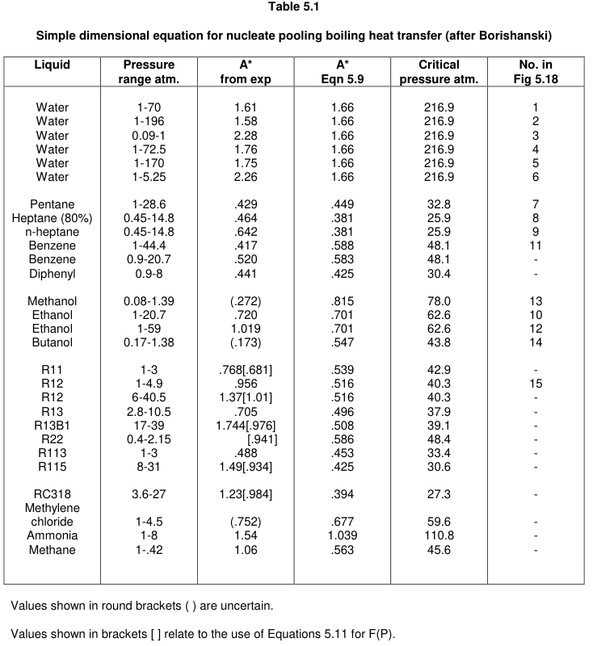

*表 5.1：Borishanski 核态池沸腾传热简式所用参数。圆括号中的数值不确定；方括号中的数值用于式 (5.11) 的 F(P) 计算。*

## Nomenclature and Bibliography

## 符号说明和参考文献

符号说明原页：

- [reference-page-298-original.png](./assets/reference-page-298-original.png)
- [reference-page-299-original.png](./assets/reference-page-299-original.png)
- [reference-page-300-original.png](./assets/reference-page-300-original.png)

参考文献原页：

- [reference-page-301-original.png](./assets/reference-page-301-original.png)
- [reference-page-302-original.png](./assets/reference-page-302-original.png)
- [reference-page-303-original.png](./assets/reference-page-303-original.png)
- [reference-page-304-original.png](./assets/reference-page-304-original.png)
- [reference-page-305-original.png](./assets/reference-page-305-original.png)

## 公式原式截图索引

| 范围 | 原式截图 |
|---|---|
| (5.1)-(5.8a) | [(5.1)](./assets/eq-5-1-original.png), [(5.2)](./assets/eq-5-2-original.png), [(5.3)](./assets/eq-5-3-original.png), [(5.4)](./assets/eq-5-4-original.png), [(5.5)](./assets/eq-5-5-original.png), [(5.6)](./assets/eq-5-6-original.png), [(5.7)](./assets/eq-5-7-original.png), [(5.8)](./assets/eq-5-8-original.png), [(5.8a)](./assets/eq-5-8a-original.png) |
| (5.9)-(5.16) | [(5.9)](./assets/eq-5-9-original.png), [(5.10)](./assets/eq-5-10-original.png), [(5.11)](./assets/eq-5-11-original.png), [(5.12)](./assets/eq-5-12-original.png), [(5.13)](./assets/eq-5-13-original.png), [(5.14)](./assets/eq-5-14-original.png), [(5.15)](./assets/eq-5-15-original.png), [(5.16)](./assets/eq-5-16-original.png) |
| (5.17)-(5.24) | [(5.17)](./assets/eq-5-17-original.png), [(5.18)](./assets/eq-5-18-original.png), [(5.19)](./assets/eq-5-19-original.png), [(5.20)](./assets/eq-5-20-original.png), [(5.21)](./assets/eq-5-21-original.png), [(5.22)](./assets/eq-5-22-original.png), [(5.23)](./assets/eq-5-23-original.png), [(5.24)](./assets/eq-5-24-original.png) |
| (5.25)-(5.32) | [(5.25)](./assets/eq-5-25-original.png), [(5.26)](./assets/eq-5-26-original.png), [(5.27)](./assets/eq-5-27-original.png), [(5.28)](./assets/eq-5-28-original.png), [(5.29)](./assets/eq-5-29-original.png), [(5.30)](./assets/eq-5-30-original.png), [(5.31)](./assets/eq-5-31-original.png), [(5.32)](./assets/eq-5-32-original.png) |
| (5.33)-(5.40) | [(5.33)](./assets/eq-5-33-original.png), [(5.34)](./assets/eq-5-34-original.png), [(5.35)](./assets/eq-5-35-original.png), [(5.36)](./assets/eq-5-36-original.png), [(5.37)](./assets/eq-5-37-original.png), [(5.38)](./assets/eq-5-38-original.png), [(5.39)](./assets/eq-5-39-original.png), [(5.40)](./assets/eq-5-40-original.png) |
| (5.41)-(5.48) | [(5.41)](./assets/eq-5-41-original.png), [(5.42)](./assets/eq-5-42-original.png), [(5.43)](./assets/eq-5-43-original.png), [(5.44)](./assets/eq-5-44-original.png), [(5.45)](./assets/eq-5-45-original.png), [(5.46)](./assets/eq-5-46-original.png), [(5.47)](./assets/eq-5-47-original.png), [(5.48)](./assets/eq-5-48-original.png) |
| (5.49)-(5.56) | [(5.49)](./assets/eq-5-49-original.png), [(5.50)](./assets/eq-5-50-original.png), [(5.51)](./assets/eq-5-51-original.png), [(5.52)](./assets/eq-5-52-original.png), [(5.53)](./assets/eq-5-53-original.png), [(5.54)](./assets/eq-5-54-original.png), [(5.55)](./assets/eq-5-55-original.png), [(5.56)](./assets/eq-5-56-original.png) |
| (5.58)-(5.64) | [(5.58)](./assets/eq-5-58-original.png), [(5.59)](./assets/eq-5-59-original.png), [(5.60)](./assets/eq-5-60-original.png), [(5.61)](./assets/eq-5-61-original.png), [(5.62)](./assets/eq-5-62-original.png), [(5.63)](./assets/eq-5-63-original.png), [(5.64)](./assets/eq-5-64-original.png) |

说明：OCR 和截图资产中未见独立的式 (5.57)，原书编号在 (5.56) 后直接进入壳侧压降的 (5.58)。本章暂按原编号保留，不补造公式编号。
