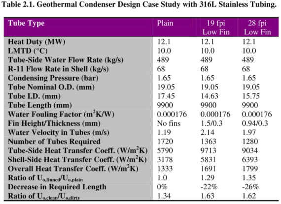

# Chapter 2 Design Considerations for Enhanced Heat Exchangers

# 第 2 章 强化换热器设计考虑

## 来源追踪

| 项目 | 内容 |
|---|---|
| 原书 | Engineering Data Book III |
| 章节 | Chapter 2 |
| PDF 页码 | 37-46 |
| 书内页码 | 2-1 到 2-10 |
| 进度记录 | [progress.md](./progress.md) |

完整源页截图保留在 `assets/source-page-37.png` 到 `assets/source-page-46.png`，用于逐页二校和表格复核。正文只展示必要的局部表格资产，避免整页原文图打断阅读。

## 摘要

本章聚焦管式换热器的[传热强化](../../../glossary/terms.md#term-heat-transfer-augmentation)，说明现有和潜在的管式强化技术在多个工业领域中的应用，并讨论热工、机械和经济方面的关键考虑。

## 2.1 Introduction

## 2.1 引言

[强化管](../../../glossary/terms.md#term-enhanced-tube)已经广泛用于制冷、空调和商业热泵行业。相比之下，在化工、石油和许多其他行业中，采用强化管还没有成为标准做法，尽管这种做法正在增加。

采用强化管设计管式换热器，通常能得到比常规光管设备更紧凑的设计。紧凑化不仅会带来换热器本体的热工、机械和经济优势，还会降低支撑结构、管道、撬装单元、运输和安装成本。在石化应用中，安装总成本常常达到换热器本体价格的 2 到 3 倍，因此这种外部成本下降很重要。紧凑强化设计还显著减少两种流体在换热器内的滞留量，在某些场合这是重要的安全因素。

本章说明管式换热器中使用强化管和[管内插入件](../../../glossary/terms.md#term-tube-insert)时的实际考虑、优势和应用识别原则。

## 2.2 Thermal and Economic Advantages of Heat Transfer Augmentations

## 2.2 传热强化的热工和经济优势

采用强化结构有许多热工优势，但必须与其相对于光管更高的成本，以及对工厂运行的经济收益一起权衡。对于许多小幅增产需求，例如 10% 到 30%，购买并安装全新的换热器未必经济；但如果换热器是某个单元操作的瓶颈，强化技术可能正是合适方案。

引入强化结构的主要优势，是显著提高热负荷，以满足新的工艺条件或产量目标。实现方式包括：

1. 在管内安装可拆卸插入件。
2. 用新的强化管束替换可拆卸管束。
3. 用同尺寸或更小尺寸的新强化管换热器替换原换热器。

前两种干预可以不改动换热器本体；三种方案通常都不需要改变原有管口连接和支座。因此，它们对生产装置运行计划的影响较小。

### 既有设备替换

对于已经安装的设备，可拆卸管束可以在停车期间较容易地替换为新的强化管束。固定管板设备也可保留原封头、管线和支座，只替换一部分。管内插入件则可在常规检修停车期间安装到既有管内，不造成额外停产。

若安装[扭带插入件](../../../glossary/terms.md#term-twisted-tape-insert)，尤其是在层流工况中，为满足压降限制，可能需要拆除封头中的部分或全部分程隔板，以减少管程数。这类改造由于简单，通常投资回报高、运行可靠性好，并可避免购买更大的光管设备，以及由支座、基础、管线改造和停产带来的高额成本。

### 新建装置中的新设备

对于新换热器，设计者往往倾向于选用优化良好的光管设备，因为这样最简单。但在同一服务条件下，这种选择可能不自觉地比强化设备多花 20% 到 50% 的本体成本。空间不足、无法并联布置两台或多台换热器、结构上存在重量限制或抽管束限制时，强化换热器也常有明显优势。

### 成本节省

在石化行业中，把强化管适当地用于管壳式换热器，单台设备常可节省 10,000 到 200,000 美元甚至更多。每年只要有几项这种应用，就足以抵消评估常规设计是否适合强化管的工程成本。例如可评估 Wolverine Tube 的 Trufin 管或 Turbo-Chil 管，这类管可同时具有内外强化结构。

### 合金管材料

当换热器使用高合金管，例如不锈钢、钛、镍基合金或双相不锈钢时，合适的强化结构可显著降低初始成本。强化不仅减少管材成本，也会减少封头、管板和制造成本，例如壳径更小、壁厚更小、管孔更少、合金覆层更少。即使对常规碳钢换热器，只要按工厂总成本而非设备本体成本评估，更紧凑、更轻的强化管壳式设备也能明显降低运输和安装成本。

### 强化管单价如何比较

强化管每米或每英尺价格不适合用简单表格概括，因为价格强烈依赖管材、材料硬度、强化制造过程中抗变形能力、壁厚和光管基价。一般而言，基管材料越贵，强化管相对光管的成本倍率越低。价格信息通常可通过联系强化结构制造商（Wolverine Tube Inc.）获取报价。许多应用还可使用双侧强化管，即管侧和壳侧都强化的管型；它往往是热工和经济上最好的选择。

### 换热器本体成本如何比较

仅比较强化管和光管的每米价格是误导性的，相当于只按每千克价格购买电脑而不看性能。对低翅片管，有时会按单位面积、单位长度成本比较。由于低翅片管外表面积常约为光管的 3 倍，如果每米价格是光管的 1.5 倍，则按表面积计，实际成本约为光管的一半。

更实际的比较是用每米管材成本除以优化后设备的总传热系数，形成成本-性能比。这会把内外传热强化和[污垢热阻](../../../glossary/terms.md#term-fouling-resistance)都纳入评估。另一个基准是比较两种设备所需的总管材成本，因为制造厂实际支付的是总管材费用。但这仍不完整，因为更紧凑设备还会节省壳体、封头、管板和制造费用。

总体上，最好让制造厂对常规光管设备和强化管设备分别报价，并且两者都要针对应用条件优化。即使总管材成本相同，典型节省仍可达到 15% 到 40%。如果粗略假设管材、其他材料加固定成本、人工成本各占换热器总成本的三分之一，则当设备变小后，后两类成本会显著下降。因此，最简单的经济尺度是尺寸缩减：如果强化设备少用三分之一管数，通常也会比常规设备便宜约三分之一，即使强化管单价更高。

## 2.3 Thermal Design and Optimization Considerations

## 2.3 热工设计和优化考虑

关于强化管首先要问的问题是：什么时候可以用？一个旧经验法则认为，当某一侧热阻是另一侧的 3 倍时，应考虑强化这一侧。但现在双侧强化管已经容易获得，即同时强化管侧和壳侧过程，几乎任何应用都可能获得热工收益。因此，关键不再是机械套用旧经验，而是确定哪类强化结构适合当前工况，并运行若干模拟设计，评估换热器尺寸和成本能下降多少。

需要记住的第一点是：一侧强化会对另一侧产生正面影响。对于沸腾过程，如果在加热流体一侧采用强化表面，较小的强化设备会提高热流密度，从而提高另一侧沸腾传热系数；同时管数减少会提高质量速度，也会增强对流传热。单相应用中，一侧强化会使新换热器尺寸变小，进而提高另一侧流速。这种“免费的二次强化”若不对强化管设备单独做热设计，常会被忽略。

第二点是：不要对强化管换热器施加不必要或无意识的设计限制。与同一应用下优化好的光管设备相比，强化设备几乎总会优化到不同的管束构型，例如更短管长、更少管数、不同管径、更少管程或更少并联管束。设计时不应强迫强化设备复制光管设备的几何。

许多光管设备，尤其是卧式冷凝器，本身优化并不好。若管长与壳径比很小，通常意味着设计成本偏高。石化装置建设时常把最大管长限制为 20 ft，即约 6.1 m，这会显著限制大型光管管侧和壳侧冷凝器的热工潜力。相反，强化管设备在这些条件下常优化到比光管更短的管长，有时设备尺寸不到光管设备的一半，或原来需要两台并联的任务可由一台较小强化设备完成。此时采用外低翅片管、内微翅片管或双侧强化管，成本节省常超过 50%。

强化结构带来的表面积增加不应被忽视。污垢系数应作用在强化结构的全部实际润湿面积上，而不是名义投影面积上。如果强化管与光管的面积比为 3.0，例如低翅片管，同一污垢系数对应的污垢热阻会降为光管的三分之一。尽管如此，与清洁设计相比，强化换热器在污垢设计下的超设计比例通常会增加，因为污垢系数数值不变，而管侧和壳侧传热系数已大幅提高，从而提供更多抗污垢裕量。

污垢系数还会影响[翅片效率](../../../glossary/terms.md#term-fin-efficiency)。污垢热阻必须加到翅片上的传热热阻中，这会降低翅片上的“有效”传热系数，从而提高翅片效率。换言之，随着污垢增加，翅片表面的有效面积会部分增加，这会部分补偿随运行时间增加的污垢影响。

多数常规换热器设计程序允许用户用以下一种或多种方式输入传热数据，从而实现强化换热设计：

1. 固定传热系数。
2. 相对于程序内部光管计算值的固定传热系数倍率。
3. 压降倍率项。
4. 单管核态池沸腾曲线。
5. j 因子和 f 因子曲线常数。
6. 作为强化传热系数倍率使用的设计安全系数。

对管内单相过程，在多数情况下输入固定传热系数或强化倍率比较方便。如果程序允许，输入 j 因子和 f 因子曲线更好。使用倍率时要注意，程序会把倍率乘到其内部光管关联式结果上，而该光管关联式未必与推导强化倍率时使用的光管基准一致。

由于管侧和壳侧污垢系数应作用在各自实际总润湿面积上，常规光管设计软件通常会错误地把强化表面的污垢系数施加到管的名义内外表面积上。正确处理方式是先将污垢系数除以对应面积比，再输入软件。例如，若内螺旋肋管相对于肋根名义面积的内表面积比为 1.8，则管侧污垢系数输入前应除以 1.8，才能在总传热系数计算中反映正确污垢热阻。

## 2.4 Mechanical Design and Construction Considerations

## 2.4 机械设计和制造考虑

### 机械应力计算

整体低翅片管的内压爆破试验表明，管两端光管段是沿管长最薄弱的位置，因为外部螺旋翅片相当于加强环。可以推想，内部螺旋翅片或肋也有类似作用。强化结构下方最小壁厚的选择会直接影响每米管材金属量，因此对昂贵合金材料尤其重要。

多数应用中，应使用强化结构下方的基底壁厚进行压力容器规范要求的机械应力计算，例如 ASME 规范。某些应用中，ASME 规范允许使用成翅或变形之前的原始光管壁厚进行最小壁厚计算，而不是使用更保守的翅下壁厚。表面冷凝器真空应用就是一种例子。实际设计应查阅适用压力容器规范。

### 换热器制造

强化管通常在两端保留略长于管板厚度的光管段，以便胀接或焊接到管板。强化结构外径，例如低翅片管翅顶外径，等于或略小于光管端外径，因此装配时可顺利穿入管束。管内插入件通常带有拉环或连接附件，用于安装、固定和清洗拆卸。

### U 形管

几乎所有整体传热强化结构，也就是与管壁一体成形的强化结构，都可弯成 U 形，用于 U 形管换热器。特定管型的最小弯曲半径应参考制造商建议，例如 Wolverine Tube Inc. 的产品建议。

### 平均金属温差

某些固定管板光管设计会在管束和壳体之间产生很大的平均金属温差，从而造成不均匀热膨胀或收缩及高应力。由于强化一股流体几乎总会把[控制热阻](../../../glossary/terms.md#term-controlling-resistance)转移到另一股流体，强化结构可用于降低平均金属温差，并在不希望使用膨胀节时避免使用膨胀节。

例如，某进出料换热器中，壳侧为被冷却的单相热气体，管侧为另一流体；采用整体低翅片管可使平均金属温差降低约三分之一。此外，优化后的管长通常也会更短，从而进一步降低壳体和管束之间的热差应力。

无论如何，对固定管板换热器，都应检查强化结构对平均金属温差的影响。在既有固定管板设备中安装插入件时，应把新的平均金属温差与原机械设计采用的数值比较。

## 2.5 Refrigeration and Air-Conditioning System Applications

## 2.5 制冷和空调系统应用

传热强化在制冷和空调系统中的收益已为行业熟知，其使用已经是常态而非例外。不过，为了获得最大收益，选型、优化和正确实施仍是关键。

对于管内沸腾或冷凝，曾经广泛使用的铝星形插入件几乎已完全被内部[微翅片管](../../../glossary/terms.md#term-microfin-tube)取代。微翅片管可提供与星形插入件相近的传热强化，但两相压降增加远小于星形插入件。Wolverine Tube Inc. 是微翅片管的主要制造商之一。

当空气流过空调盘管时，最新的百叶板翅紧凑式换热器设计相对于旧设计显著提高空气侧传热。因此，管内侧也常用微翅片强化。内部强化会缩短设备长度、减轻重量、减少外部百叶翅片数量，同时提高空气速度，从而也提高空气侧传热系数。

对于直接膨胀蒸发器，如果制冷剂在管内处于分层流，光管顶部周向不会被润湿；螺旋微翅片则可把液膜带到管顶，不仅更充分利用管内表面积，也更有效利用管外顶部周向的铝翅片。

对满液蒸发器，已有许多商业外部强化结构，多数也可采用双侧强化版本，即管侧为冷冻水、冷却水或盐水强化。比较这些强化结构时，不应只比较单管性能，而应比较管束性能，并计入水侧强化和内表面积比降低污垢热阻的正面效果。

对于管内冷冻水，高效内肋和内翅片设计能在传热与压降之间提供良好折中。若冷冻水在壳侧，例如直接膨胀蒸发器水冷机组，较优管型可能是外低翅片加内微翅片管；虽然每米管材金属量更高，但总管长可能只有约一半。

## 2.6 Refinery and Petrochemical Plant Applications

## 2.6 炼油和石化装置应用

化工装置和炼油厂中可寻找的传热强化干预示例如下。

单相换热器：

1. 当限制性热阻位于壳侧时，在换热器中使用整体低翅片管。
2. 在管内层流中使用管内插入件，例如金属丝网或扭带。
3. 在热回收设备管侧安装插入件，提高总传热系数、减小温度接近并增加能量回收。
4. 在压缩机和透平油冷却器中使用插入件，解决过热问题，或实现更适合撬装单元的小型换热器。

层流传热系数几乎与流速无关，因此即使光管采用很大压降，性能也难以提高。此时插入件或外低翅片可能是简单有效方案。设计得当的插入件设备通常比常规光管设备小得多，压降也可更小或相当。

再沸器：

1. 用低翅片管束或高性能沸腾管束替代光管 U 形管束，以提高热能力。
2. 在加热流体管侧安装插入件，提高卧式再沸器热负荷，尤其适合进出料换热器中的热流出气体。
3. 用强化管束替代光管管束，使设备可使用更便宜、温度更低的加热流体，例如低压蒸汽替代中压或高压蒸汽。
4. 对严重结垢且难以清洗的光管卧式热虹吸再沸器和釜式再沸器，可改用较大管间距、相同外表面积的低翅片管束，以显著降低清洗人工成本。
5. 对制冷工艺单元中的再沸-冷凝器，沸腾和冷凝强化可降低设备的对数平均温差并减少压缩功，节省 5% 到 10% 的动力成本。
6. 内微翅片在卧式管侧蒸发器中对全干度范围都很有效，尤其在低质量通量下。

冷凝器：

1. 在塔顶冷凝器中用低翅片 U 形管束替代光管 U 形管束，或在既有管束中安装插入件，提高总传热系数，降低蒸馏塔操作压力和温度，并节省进料加热能耗。
2. 采用低翅片管而非光管，常可把多壳程冷凝器的壳体数减少一半，尤其适合壳侧多组分蒸汽冷凝。
3. 内微翅片对卧式管侧冷凝器全干度范围都很有效，尤其在低质量通量下。

空气冷却器：

1. 对空气冷却换热器中黏性流体的冷却，高翅片管内安装插入件可显著减少并联单元数和占地面积。一些空冷器制造商已在制造带金属丝网插入件的设备。
2. 安装插入件可在炎热夏季提高既有空冷器的冷却能力，并在边界工况下避免新增冷却塔能力。

烃加工行业中的实际应用包括：气油、乙二醇、常压渣油、酚、炼厂轻端、Sulfinol、空冷润滑油、重蜡馏分、CO 气、柠檬酸、脂肪酸、Therminol-66 等冷却；原油塔底、乙炔、废气、聚合物、萘、后临界乙烯、丁基橡胶、溶剂、苯乙烯、异丙苯、重焦油和原油等加热或预热；液化气、制冷剂、轻烃、二甲苯、MDEA、醇类、乙二醇和甘油等冷却或汽化；以及醇类、塔顶馏出物、多组分蒸汽混合物和制冷剂冷凝。

其他重要应用还包括胶黏剂生产中的工艺流加热和冷却，以及塑料工业中 PVC、醋酸酯和聚苯乙烯等聚合物熔体的加热和冷却。真空蒸馏装置、润滑油装置和重油生产设施中也常见强化机会，因为这些场合有许多黏性流体，层流持续存在。

## 2.7 Air-Separation and Liquified Natural Gas Plant Applications

## 2.7 空分和液化天然气装置应用

板翅式换热器在空分和液化天然气设施中应用广泛。板翅换热器可以实现很小的温度接近，但其长而曲折的流道可能比管壳式设备压降更大。因此，应评估整个系统效率的真实收益。强化沸腾管和强化冷凝管可有利地用于这些设施的制冷系统再沸-冷凝器中，加热流体一侧也可采用翅片强化。

## 2.8 Applications to Lubricating Oil Coolers

## 2.8 润滑油冷却器应用

管内传热强化特别适合提高润滑油冷却器的传热系数。这些冷却器通常作为压缩机、透平、电机、发动机等撬装或成套设备的一部分，也可安装在大型工程机械上。因此，更轻、更紧凑的冷却器有很多经济优势。通常可通过插入件提高管侧传热性能，同时满足与光管设备相同的压降限制；实现方式是减少管程数。

## 2.9 Power Plant Operations

## 2.9 电厂运行

整体低翅片管正广泛用于电厂主冷凝器。用于蒸汽冷凝的外翅片必须优化翅片密度和高度。采用外翅片会把控制热阻转移到冷却水侧，因此带内肋的低翅片管特别适合这种应用，尤其在使用合金管时。波纹管在这些应用中也有收益。

在既有蒸汽冷凝器的管侧，即水侧，安装插入件可提高总传热系数和汽室真空度，因此汽轮机输出功率有时可提高 0.5% 到 2%。对电力企业而言，这代表显著燃料节省或额外发电能力，而且成本很低。

某些蒸汽发生器制造商在化石燃料电站锅炉中采用内肋管。内肋产生的旋流可在非对称热流环境中使管壁更好润湿，从而提高进入膜态沸腾前的临界热流密度。对既有光滑内壁设备中容易出现该问题的管段，也可安装扭带插入件。

## 2.10 Geothermal and Ocean-Thermal Power Plant Applications

## 2.10 地热和海洋温差电站应用

地热和海洋温差电站的可行性部分取决于换热器能否实现小温度接近，以提高循环效率。小温差接近会导致低对数平均温差，因此需要很大换热面积。为了减小这些设备的尺寸和成本，尤其当设备采用钛或 316 不锈钢等昂贵合金时，蒸发器和冷凝器中通常都采用传热强化。

对于蒸发器管束外沸腾，应使用低翅片管或高性能沸腾几何管，例如 Turbo-B。由于壳侧只接触非腐蚀性工质，例如制冷剂或丙烷，外部强化结构不必采用高合金材料。

对于壳侧冷凝，低翅片管或 Turbo-CSL 等强化冷凝管是合适选择。若采用低翅片管，应在特定材料可商业供应的几何范围内优化翅片密度、翅高和翅厚，并参考 Wolverine Tube 产品表。

强化蒸发器和冷凝器可使用更大的管侧水速，从而提高内部传热系数并减少污垢和结垢。表 2.1 给出了一个实际地热冷凝器优化案例，采用 316L 不锈钢管。该设计由 ENHANCED HEAT TRANSFER 软件优化，软件由 J. R. Thome 编写并通过 HTRI 授权。由于应用要求是可由卡车运输的便携设备，管长固定为 9.9 m。强化设计显著减少管数和壳体尺寸。其可靠性因子也更高，因为清洁总传热系数与污垢工况总传热系数之比从光管的 1.34 提高到约 1.62。

### Table 2.1 Geothermal Condenser Design Case Study with 316L Stainless Tubing

### 表 2.1 采用 316L 不锈钢管的地热冷凝器设计案例

| 项目 | 光管 | 19 fpi 低翅片 | 28 fpi 低翅片 |
|---|---:|---:|---:|
| 热负荷 MW | 12.1 | 12.1 | 12.1 |
| LMTD °C | 10.0 | 10.0 | 10.0 |
| 管侧水流量 kg/s | 489 | 489 | 489 |
| 壳侧 R-11 流量 kg/s | 68 | 68 | 68 |
| 冷凝压力 bar | 1.65 | 1.65 | 1.65 |
| 管名义外径 mm | 19.05 | 19.05 | 19.05 |
| 管内径 mm | 17.45 | 14.63 | 15.75 |
| 管长 mm | 9900 | 9900 | 9900 |
| 水侧污垢系数 m2K/W | 0.000176 | 0.000176 | 0.000176 |
| 翅高/翅厚 mm | 无翅片 | 1.5/0.3 | 0.94/0.3 |
| 管内水速 m/s | 1.19 | 2.14 | 1.97 |
| 所需管数 | 1720 | 1363 | 1280 |
| 管侧传热系数 W/m2K | 5790 | 9713 | 9034 |
| 壳侧传热系数 W/m2K | 3178 | 5831 | 6393 |
| 总传热系数 W/m2K | 1333 | 1691 | 1799 |
| Uo,finned/Uo,plain | 1.0 | 1.29 | 1.35 |
| 所需长度下降 | 0% | -22% | -26% |
| Uo,clean/Uo,dirty | 1.34 | 1.63 | 1.62 |

## 2.11 Applications in the Food Processing Industries

## 2.11 食品加工行业应用

在食品加工行业，传热强化特别适合温度敏感食品的巴氏杀菌，以及植物油等黏性流体的加热或冷却。对幂律流体等非牛顿流体，层流可使用管内插入件强化，湍流可使用整体管内强化结构，例如内肋管。
