# Chapter 3 Single-Phase Shell-Side Flows and Heat Transfer

# 第 3 章 单相壳侧流动与传热

## 来源追踪

| 项目 | 内容 |
|---|---|
| 原书 | Engineering Data Book III |
| 章节 | Chapter 3 |
| PDF 页码 | 47-66 |
| 书内页码 | 3-1 到 3-20 |
| 进度记录 | [progress.md](./progress.md) |

完整源页截图保留在 `assets/source-page-47.png` 到 `assets/source-page-66.png`，用于逐页二校和公式复核。正文只展示局部图表资产，避免整页原文图打断阅读。

## 摘要

本章介绍 Taborek（1983）针对单弓形折流板管壳式换热器单相[壳侧](../../../glossary/terms.md#term-shell-side)流动提出的设计方法。Taborek 版本的 [Delaware 法](../../../glossary/terms.md#term-delaware-method)被认为是公开文献中最准确、可靠且完整的方法之一。本章先给出带折流板换热器壳侧单相流动的基本理论，再完整说明 Taborek 方法如何应用于光管和整体低翅片管，例如 Wolverine Tube S/T Trufin 管。该方法依据管束几何和尺寸描述，预测壳侧传热系数和压降。

## 3.1 Introduction

## 3.1 引言

液体和气体横掠管束的单相流动，是许多换热器应用中都会遇到的重要传热过程。与管内单相传热相比，壳侧流动，也就是流体在壳体约束下横掠带折流板管束外侧的流动，要复杂得多，因为它受到许多几何因素影响，并存在多种可能的流路。

Tinker（1951）最早给出了这一过程的物理描述。该描述后来被用于发展通常称为 Delaware 法的壳侧设计方法；该方法由 Bell（1960，1963）提出，并在 Bell（1986）中重新发表。Taborek（1983）针对单弓形折流板管壳式换热器的单相壳侧流动提出了新的设计版本，主要适用于 TEMA E 壳程，并说明如何扩展到 TEMA J 壳程、F 壳程以及无窗口管的 E 壳程。

本章给出带折流板 E 壳换热器壳侧单相流动的基本理论，并进一步说明 Taborek 方法。该方法适用于单弓形折流板管束。特殊应用中还会使用双弓形折流板、三弓形折流板、盘环形折流板、杆式折流板和螺旋折流板；这些较少使用的几何形式不在本章处理范围内。本章先说明光管方法，再说明它对整体低翅片管的扩展。

## 3.2 Stream Analysis of Flow Distribution in a Baffled Heat Exchanger

## 3.2 带折流板换热器中的流量分布流路分析

在带折流板的[管壳式换热器](../../../glossary/terms.md#term-shell-and-tube-heat-exchanger)中，只有一部分壳侧流体真正按理想流路横掠管束、且方向垂直于管轴。其余流量会通过旁路区域流动。流体总是趋向于从入口到出口阻力较小的流路。在典型设计中，非理想流可占总流量的 40% 以内，因此必须把这些流路对传热和压降的影响计入设计。

Tinker（1951）首先直观描述了单弓形折流板实际换热器中的这些流路，如图 3.1 所示。他把总流量分成若干个以字母标识的流股。

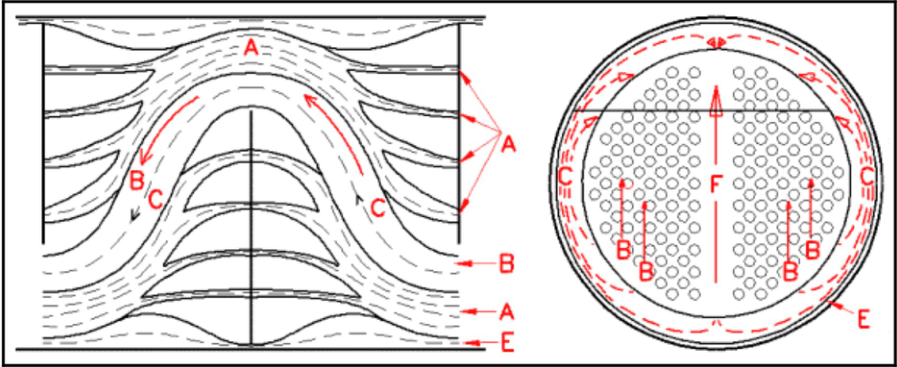

**A 流股：管孔泄漏流。** 管孔泄漏流是从一个折流板分室流到下一个分室、并穿过折流板上过大管孔与管外径之间环形开口的流动，如图 3.2 所示。驱动力是相邻折流板分室之间的压差。泄漏通道由折流板孔径与管外径之差形成的直径间隙决定。如果管子胀接到折流板中，则直径间隙为零。减小该直径间隙可降低该旁路流；间隙为零时，该流股被完全消除。

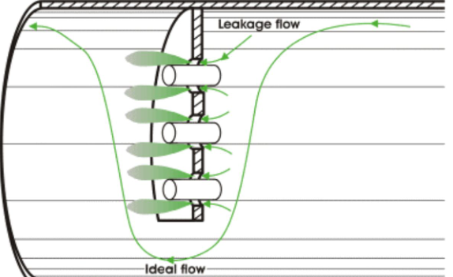

**B 流股：横掠管束流。** 横掠流是理想化的流动，方向垂直于管轴并横掠管束。这是带折流板管壳式换热器中最希望得到的流路，如图 3.1 所示。

**C 流股：管束旁路流。** 管束旁路流穿过管束外缘与壳体内壁之间的环形开口，如图 3.3 所示。该流路的直径间隙等于壳体内径减去管束外管限径。可通过减小壳体内径与管束外管限径之间的直径间隙来降低该旁路流，也可在管束周边安装成对密封条，阻挡该流路并迫使流体返回管束内部。

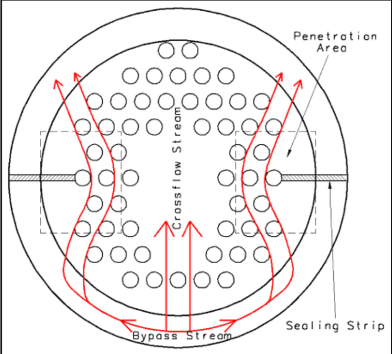

**E 流股：壳体-折流板旁路流。** 壳体-折流板旁路流指折流板外缘与壳体内壁之间间隙中的流动，如图 3.4 所示。直径间隙等于壳体内径减去折流板直径，可通过把壳体与折流板之间的制造间隙减小到可行下限来降低。

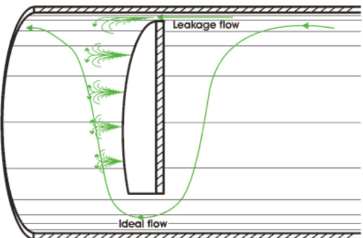

**F 流股：管程隔板通道旁路流。** 多管程换热器为布置封头中的管程隔板，会在管束和管板上省去部分管子，从而形成开通道。沿流动方向布置的这类开通道会产生 F 流股，如图 3.1 所示。只有与流动方向一致的管程隔板通道才产生旁路；与流动方向垂直的通道不产生旁路。该旁路流只出现在部分多管程布管中，可通过在每条旁路通道中布置若干根假管来消除，使流体重新进入管束。

## 3.3 Definition of Bundle and Shell Geometries

## 3.3 管束和壳体几何定义

图 3.5 给出了两端为固定管板的单弓形折流板管壳式管束几何。壳侧流体从管束一端到另一端完成一个壳程，折流板引导流体横掠管束。这是制冷和石化换热器中常见构型。入口、中央和出口折流板间距分别记为 Lbi、Lbc 和 Lbo。Lbi 和 Lbo 通常与 Lbc 相等，除非第一和最后一个折流板分室必须加大，以容纳相应的壳侧接管。

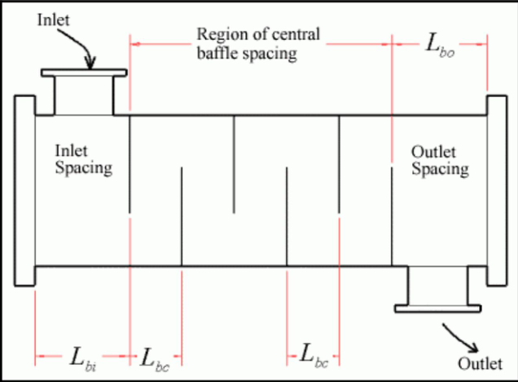

折流板布置由入口、中央和出口折流板间距以及有效管长确定。有效管长 Lta 等于总管长减去两块管板厚度之和。折流板数量必须为整数，折流板间距也由这些值确定。对 U 形管换热器，用于确定折流板间距的有效长度包括直管段长度加 Ds/2，其中 Ds 是壳体内径。因此，U 形弯头处的折流板间距应包括该分室中的直管长度再加 Ds/2。

图 3.5、图 3.6 和图 3.7 取自 Taborek（1983），定义了主要换热器尺寸。Dotl 是外管限径，Dctl 是管中心线限径；注意 Dctl = Dotl - Dt，其中 Dt 为管外径。折流板切口高度为 Lbch，折流板切口 Bc 定义为 (Lbch/Ds) × 100%，也就是按壳体内径百分比表示。壳体内径 Ds 与外管限径 Dotl 之间的直径间隙为 Lbb，其中 Lbb/2 是该旁路通道的宽度。图中还示出了宽度为 Lp 的管程隔板通道。壳体内径 Ds 与折流板直径 Db 之间的直径间隙为 Lsb，对应单侧间隙 Lsb/2。

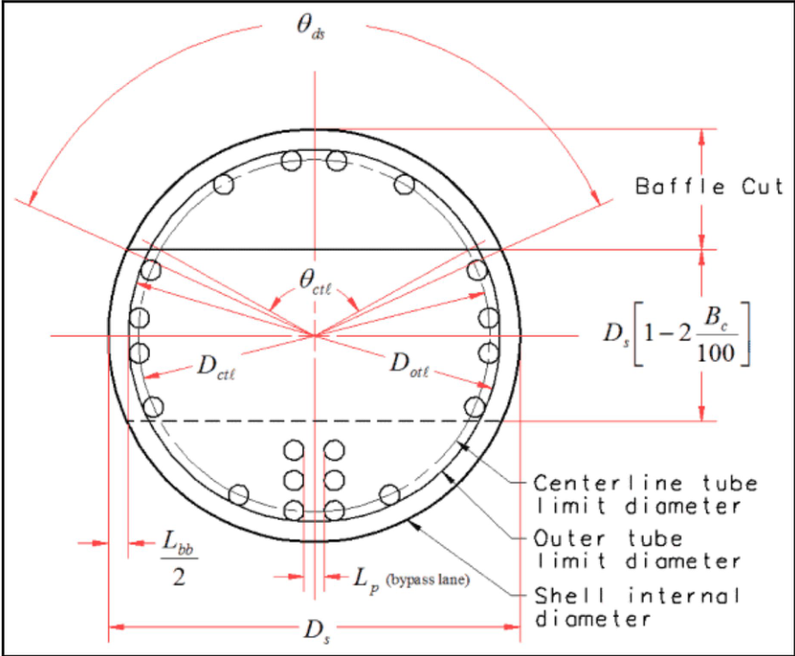

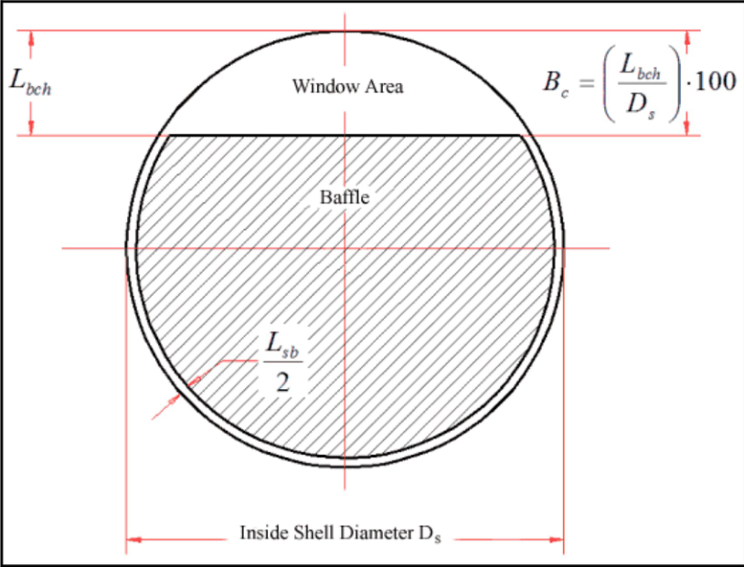

上述尺寸 Ds、Dotl、折流板切口、Lbb 和 Lsb 可从换热器布管图获得。如果 Dotl 未知，可按下列典型 TEMA 取值估算 Lbb：当 Ds < 300 mm 时取 9.525 mm；当 Ds > 1000 mm 时取 15.875 mm；当 Ds 在 300 到 1000 mm 之间时取 12.7 mm。这些值是 TEMA 换热器规格的典型值，但直接膨胀蒸发器常采用更小间隙。

如果 Lsb 未知，可取 Ds < 400 mm 时 Lsb = 2.0 mm；更大壳体可取 Lsb = 1.6 + 0.004Ds，单位为 mm。若折流板孔与管外径之间的直径间隙未知，可采用 TEMA 最大值 0.794 mm，或采用 0.397 到 0.794 mm 范围内的较小值。该间隙等于折流板孔径减去 Dt。减小该间隙可显著改善热工性能。

Taborek 设计方法处理图 3.8 所示的三种布管：30°、45° 和 90°，不包括 60° 布管。管间距 Ltp 定义为管束中相邻管中心距。平行于流动方向的节距为 Lpp，垂直于流动方向的节距为 Lpn。

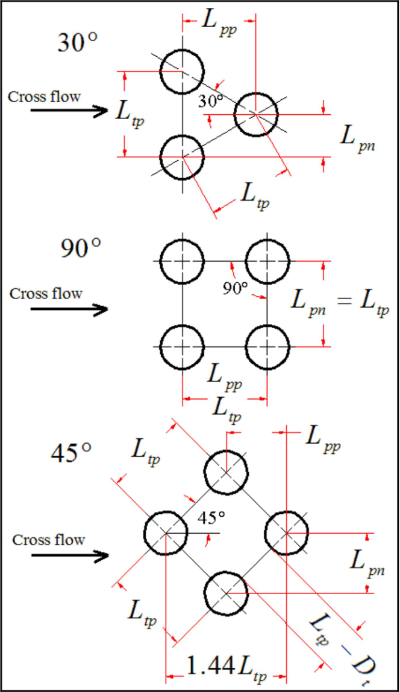

给定壳径内可容纳的管数取决于若干几何因素、尺寸和间隙，主要包括布管形式（三角形、正方形或旋转正方形）和管间距。Taborek（1983）给出了一个适用于固定管板、单管程、且入口和出口接管区域不抽管时的简单估算式：

$$
N_{tt}
=
\frac{0.7854D_{ctl}^2}
{C_lL_{tp}^2}
\tag{3.3.1}
$$

其中 Ntt 是管数，Dctl 是管中心线限径，Ltp 是管间距。对 90° 正方形布管和 45° 旋转正方形布管，常数 Cl = 1.0；对 30° 三角形布管，Cl = 0.866。多管程设计（2、4 等）很常见，其管数通常少于上式结果。推荐使用管数计算软件获得准确估计，因为入口接管处常因设置防冲板而抽管，抽管数量又取决于接管直径。准确管数会提高传热和压降计算精度。

## 3.4 Stream Analysis of Heat Transfer in a Baffled Heat Exchanger

## 3.4 带折流板换热器中的传热流路分析

单相壳侧流动的流路分析传热系数 αss 为：

$$
\alpha_{ss}
=
\left(J_CJ_LJ_BJ_RJ_SJ_\mu\right)\alpha_1
\tag{3.4.1}
$$

其中 α1 是理想管束传热系数，按全部流量都横掠管束计算，也就是全部流量都假定属于 B 流股。JC、JL、JB、JR 和 JS 是泄漏和旁路流影响修正因子，Jμ 是壁面黏度修正因子。下文说明这些修正因子和理想管束传热关联式。αss 是整个管束的平均值，作用面积为管外侧传热面积。关联式采用平均主体物性。

### 3.4.1 Baffle Cut Correction Factor (JC)

### 3.4.1 折流板切口修正因子 JC

折流板切口修正因子 JC 反映窗口流对传热的非理想影响。窗口流速度不等于横掠管束速度，随折流板切口大小和折流板间距不同，可高于或低于横掠流速度。此外，窗口流部分方向沿管长，换热效果低于横掠流。因此，JC 是折流板切口、外管限径和窗口流面积的函数，计算式为：

$$
J_C
=
0.55+0.72F_C
\tag{3.4.2}
$$

其中：

$$
F_C
=
1-2F_W
\tag{3.4.3}
$$

FW 是窗口占据的截面积分数：

$$
F_W
=
\frac{\theta_{ctl}}{360}
-
\frac{\sin\theta_{ctl}}{2\pi}
\tag{3.4.4}
$$

折流板切口相对于换热器中心线的角度 θctl 以度计：

$$
\theta_{ctl}
=
2\cos^{-1}
\left\{
\frac{D_s}{D_{ctl}}
\left[
1-2\left(\frac{B_c}{100}\right)
\right]
\right\}
\tag{3.4.5}
$$

上述表达式适用于折流板切口为壳体直径 15% 到 45% 的范围。通常不建议采用该范围以外的折流板切口，因为会造成流量分布不良。在良好设计中，JC 通常在 0.65 到 1.175 之间。

### 3.4.2 Baffle Leakage Correction Factor (JL)

### 3.4.2 折流板泄漏修正因子 JL

相邻折流板分室之间的压差，会驱动一部分流体穿过折流板上的管孔间隙（A 流股），以及穿过壳体与折流板边缘之间的环形间隙（E 流股）。这些流股会减少横掠管束的 B 流股，从而同时降低传热系数和压降。E 流股对热工设计尤其不利，因为它基本不参与有效传热。折流板泄漏修正因子为：

$$
J_L
=
0.44(1-r_s)
+
\left[
1-0.44(1-r_s)
\right]
\exp(-2.2r_{lm})
\tag{3.4.6}
$$

其中：

$$
r_s
=
\frac{S_{sb}}{S_{sb}+S_{tb}}
\tag{3.4.7}
$$

以及：

$$
r_{lm}
=
\frac{S_{sb}+S_{tb}}{S_m}
\tag{3.4.8}
$$

壳体-折流板泄漏面积 Ssb、Ntt(1-FW) 个管孔对应的管-折流板孔泄漏面积 Stb，以及管束中心线处横掠流面积 Sm 为：

$$
S_{sb}
=
0.00436D_sL_{sb}(360-\theta_{ds})
\tag{3.4.9}
$$

$$
S_{tb}
=
\left[
\frac{\pi}{4}
\left((D_t+L_{tb})^2-D_t^2\right)
\right]
N_{tt}(1-F_W)
\tag{3.4.10}
$$

$$
S_m
=
L_{bc}
\left[
L_{bb}
+
\frac{D_{ctl}}{L_{tp,eff}}
(L_{tp}-D_t)
\right]
\tag{3.4.11}
$$

式中，Lsb 是壳体到折流板的直径间隙。折流板切口角 θds 以度计：

$$
\theta_{ds}
=
2\cos^{-1}
\left[
1-2\left(\frac{B_c}{100}\right)
\right]
\tag{3.4.12}
$$

Lbc 为中央折流板间距，Lbb 为旁路通道直径间隙。有效管间距 Ltp,eff 对 30° 和 90° 布管等于 Ltp，对 45° 错列布管等于 0.707Ltp。对比例适当的换热器，JL 通常大于 0.7 到 0.9；应避免 JL 小于 0.6。JL 最大值为 1.0。制冷冷水机组和水冷冷凝器因制造公差和间隙小于 TEMA 标准，通常可达到 0.85 到 0.90。

### 3.4.3 Bundle Bypass Correction Factor (JB)

### 3.4.3 管束旁路修正因子 JB

管束旁路修正因子 JB 反映壳体内壁与管束之间流动（C 流股）以及沿流动方向的管程隔板通道旁路流（F 流股）的不利影响。F 流股并不总是存在，且可通过在管程隔板通道中布置假管完全消除。C 流股可通过提高管束与壳体配合紧密程度来降低，也可在管束周边布置密封条；密封条成对安装，最多可达到在两个折流板切口之间每两排横掠管排设置一对。管束旁路修正因子为：

$$
J_B
=
\exp
\left[
-C_{bh}F_{sbp}
\left(1-\sqrt[3]{2r_{ss}}\right)
\right]
\tag{3.4.13}
$$

经验因子 Cbh 在层流（Re ≤ 100）时取 1.35，在过渡和湍流（Re > 100）时取 1.25。计算该式需要旁路面积与横掠流面积之比 Fsbp，以及密封条对数 Nss 与一个折流板区段内折流板尖端之间横掠管排数 Ntcc 的比值 rss。首先：

$$
F_{sbp}
=
\frac{S_b}{S_m}
\tag{3.4.14}
$$

其中 Sm 已在前文给出，Sb 为旁路面积：

$$
S_b
=
L_{bc}
\left[
(D_s-D_{otl})+L_{pl}
\right]
\tag{3.4.15}
$$

Lpl 表示管间旁路通道宽度。没有管程隔板通道，或该通道垂直于流动方向时，取 Lpl = 0；当管程隔板通道平行于流动方向时，Lpl 等于该通道实际尺寸的一半，也可近似取为管外径 Dt。rss 为：

$$
r_{ss}
=
\frac{N_{ss}}{N_{tcc}}
\tag{3.4.16}
$$

Ntcc 由下式得到：

$$
N_{tcc}
=
\frac{D_s}{L_{pp}}
\left[
1-2\left(\frac{B_c}{100}\right)
\right]
\tag{3.4.17}
$$

其中，对 30° 布管 Lpp = 0.866Ltp，对 90° 布管 Lpp = Ltp，对 45° 布管 Lpp = 0.707Ltp。当 rss ≥ 1/2 时，JB 的上限为 1。

### 3.4.4 Unequal Baffle Spacing Correction Factor (JS)

### 3.4.4 不等折流板间距修正因子 JS

不等折流板间距修正因子 JS 反映入口折流板间距 Lbi 和/或出口折流板间距 Lbo 大于中央折流板间距 Lbc 时的不利影响。有些换热器为了布置壳侧接管，并避免与本体法兰或第一块折流板重叠，会把入口和出口接管分室的折流板间距做得大于中央折流板间距。这样会降低这些分室中的流速并降低传热。若入口和出口间距大于中央间距，则 JS < 1.0；若三者相等，则无需修正，JS = 1.0。JS 直接由流速影响确定：

$$
J_S
=
\frac{
(N_b-1)
+(L_{bi}/L_{bc})^{1-n}
+(L_{bo}/L_{bc})^{1-n}
}{
(N_b-1)
+(L_{bi}/L_{bc})
+(L_{bo}/L_{bc})
}
\tag{3.4.18}
$$

其中，湍流取 n = 0.6，层流取 n = 1/3。折流板分室数 Nb 由有效管长和折流板间距确定。

### 3.4.5 Laminar Flow Correction Factor (JR)

### 3.4.5 层流修正因子 JR

在层流中，流动沿通道热发展时会在边界层中形成不利温度梯度，从而降低传热。层流修正因子 JR 计入该影响。对壳侧层流，JR < 1.0，即 Re ≤ 100；对 Re > 100，不需要修正，JR = 1.0。当 Re ≤ 20 时：

$$
J_R
=
(J_R)_{20}
=
\left(
\frac{10}{N_c}
\right)^{0.18}
\tag{3.4.19}
$$

其中 Nc 是整个换热器中流动横掠的总管排数：

$$
N_c
=
(N_{tcc}+N_{tcw})(N_b+1)
\tag{3.4.20}
$$

折流板尖端之间的横掠管排数 Ntcc 已在前文给出；窗口区横掠管排数 Ntcw 为：

$$
N_{tcw}
=
\frac{0.8}{L_{pp}}
\left[
D_s\left(\frac{B_c}{100}\right)
-
\frac{D_s-D_{ctl}}{2}
\right]
\tag{3.4.21}
$$

当 20 < Re < 100 时，JR 按下式线性插值：

$$
J_R
=
(J_R)_{20}
+
\left(
\frac{20-Re}{80}
\right)
\left[
(J_R)_{20}-1
\right]
\tag{3.4.22}
$$

所有情况下，JR 的最小值为 0.4。

### 3.4.6 Wall Viscosity Correction Factor (Jμ)

### 3.4.6 壁面黏度修正因子 Jμ

传热和压降关联式通常用进出口温度平均值下的主体物性计算。对液体加热和冷却，主体流体温度与壁温之间物性变化的影响用黏度比 Jμ 修正，即主体黏度 μ 与壁温黏度 μwall 之比：

$$
J_\mu
=
\left(
\frac{\mu}{\mu_{wall}}
\right)^m
\tag{3.4.23}
$$

壳侧流体被加热时，该修正因子大于 1.0；被冷却时相反。液体加热和冷却通常取指数 m = 0.14。对气体，气体被冷却时不需要修正；气体被加热时采用基于温度而非黏度的修正：

$$
J_\mu
=
\left(
\frac{T+273}{T_{wall}+273}
\right)^{0.25}
\tag{3.4.24}
$$

其中 T 是主体温度，Twall 是壁温。必须先通过初步传热计算得到壁温，再确定壁温下的黏度。

### 3.4.7 Ideal Tube Bank Heat Transfer Coefficient (α1)

### 3.4.7 理想管束传热系数 α1

理想管束传热系数 α1 按全部流量都横掠管束计算，也就是换热器内全部流量均假定属于 B 流股且没有旁路流：

$$
\alpha_1
=
j_1c_p\dot mPr^{-2/3}
\tag{3.4.25}
$$

流体质量通量 \dot m 基于通过最小法向流通面积的总流量 M，单位为 kg/m2s。Pr 为普朗特数。传热因子 j1 为：

$$
j_1
=
a_1
\left(
\frac{1.33}{L_{tp}/D_t}
\right)^a
Re^{a_2}
\tag{3.4.26}
$$

其中：

$$
a
=
\frac{a_3}
{1+0.14Re^{a_4}}
\tag{3.4.27}
$$

a1、a2、a3 和 a4 的取值列于 Taborek（1983）给出的表 3.1。上述方法中的壳侧横掠流质量通量按管束最大横截面处计算：

$$
\dot m
=
\frac{M}{S_m}
\tag{3.4.28}
$$

其中 M 为壳侧质量流率，单位 kg/s，Sm 已在前文定义。壳侧 Reynolds 数为：

$$
Re
=
\frac{D_t\dot m}{\mu}
\tag{3.4.29}
$$

Prandtl 数定义为：

$$
Pr
=
\frac{c_p\mu}{k}
\tag{3.4.30}
$$

物性，包括黏度 μ、定压比热 cp 和导热系数 k，均在平均主体流体温度下评价。有效管长 Lta 用于计算实际外侧传热面积 Ao：

$$
A_o
=
\pi D_tL_{ta}N_{tt}
\tag{3.4.31}
$$

其中 Ntt 为管束管数。

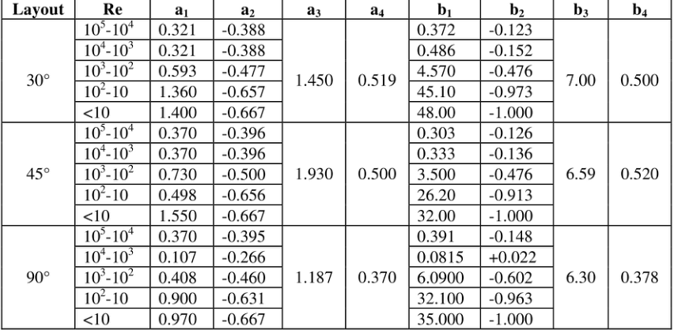

### Table 3.1 Empirical coefficients for calculation of j1 and f1

### 表 3.1 j1 和 f1 计算用经验系数

| 布管角 | Re 范围 | a1 | a2 | a3 | a4 | b1 | b2 | b3 | b4 |
|---|---:|---:|---:|---:|---:|---:|---:|---:|---:|
| 30° | 105-104 | 0.321 | -0.388 | 1.450 | 0.519 | 0.372 | -0.123 | 7.00 | 0.500 |
| 30° | 104-103 | 0.321 | -0.388 | 1.450 | 0.519 | 0.486 | -0.152 | 7.00 | 0.500 |
| 30° | 103-102 | 0.593 | -0.477 | 1.450 | 0.519 | 4.570 | -0.476 | 7.00 | 0.500 |
| 30° | 102-10 | 1.360 | -0.657 | 1.450 | 0.519 | 45.10 | -0.973 | 7.00 | 0.500 |
| 30° | <10 | 1.400 | -0.667 | 1.450 | 0.519 | 48.00 | -1.000 | 7.00 | 0.500 |
| 45° | 105-104 | 0.370 | -0.396 | 1.930 | 0.500 | 0.303 | -0.126 | 6.59 | 0.520 |
| 45° | 104-103 | 0.370 | -0.396 | 1.930 | 0.500 | 0.333 | -0.136 | 6.59 | 0.520 |
| 45° | 103-102 | 0.730 | -0.500 | 1.930 | 0.500 | 3.500 | -0.476 | 6.59 | 0.520 |
| 45° | 102-10 | 0.498 | -0.656 | 1.930 | 0.500 | 26.20 | -0.913 | 6.59 | 0.520 |
| 45° | <10 | 1.550 | -0.667 | 1.930 | 0.500 | 32.00 | -1.000 | 6.59 | 0.520 |
| 90° | 105-104 | 0.370 | -0.395 | 1.187 | 0.370 | 0.391 | -0.148 | 6.30 | 0.378 |
| 90° | 104-103 | 0.107 | -0.266 | 1.187 | 0.370 | 0.0815 | +0.022 | 6.30 | 0.378 |
| 90° | 103-102 | 0.408 | -0.460 | 1.187 | 0.370 | 6.0900 | -0.602 | 6.30 | 0.378 |
| 90° | 102-10 | 0.900 | -0.631 | 1.187 | 0.370 | 32.100 | -0.963 | 6.30 | 0.378 |
| 90° | <10 | 0.970 | -0.667 | 1.187 | 0.370 | 35.000 | -1.000 | 6.30 | 0.378 |

## 3.5 Stream Analysis of Shell-Side Pressure Drop in a Baffled Heat Exchanger

## 3.5 带折流板换热器中的壳侧压降流路分析

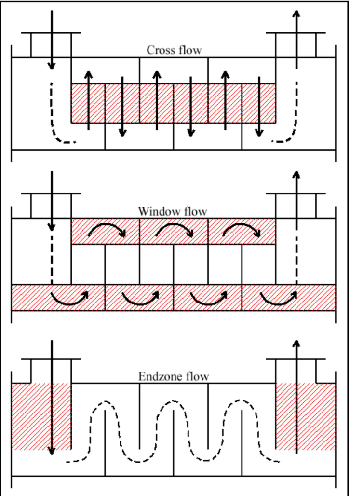

壳侧流动压降等于入口接管压降、管束压降和出口接管压降之和。入口和出口接管压降可近似为各等于 2 个速度头。管束压降等于横掠流压降 Δpc、窗口流压降 Δpw 和两个端部区域（第一和最后一个折流板分室）压降 Δpe 之和，如图 3.9 所示。不包括接管或防冲板时，管束总压降为：

$$
\Delta p_{total}
=
\Delta p_c+\Delta p_w+\Delta p_e
\tag{3.5.1}
$$

折流板尖端之间横掠管束的压降 Δpc，以中央折流板间距 Lbc 下一个折流板分室的理想管束压降 Δpb1 为基础。该压降覆盖中央折流板分室中折流板切口之间的横掠流区域。所有中央折流板分室中的压降为：

$$
\Delta p_c
=
\Delta p_{b1}(N_b-1)R_BR_L
\tag{3.5.2}
$$

其中 Δpb1 是 Nb 个分室中单个折流板分室的理想管束压降，并基于前文定义的质量通量。其表达式为：

$$
\Delta p_{b1}
=
0.002f_1N_{tc}
\frac{\dot m^2}{\rho}
R_\mu
\tag{3.5.3}
$$

摩擦因子 f1 为：

$$
f_1
=
b_1
\left(
\frac{1.33}{L_{tp}/D_t}
\right)^b
Re^{b_2}
\tag{3.5.4}
$$

其中：

$$
b
=
\frac{b_3}
{1+0.14Re^{b_4}}
\tag{3.5.5}
$$

经验常数 b、b1、b2、b3 和 b4 来自表 3.1。压降中的黏度修正因子 Rμ 为：

$$
R_\mu
=
\left(
\frac{\mu}{\mu_w}
\right)^{-m}
\tag{3.5.6}
$$

m 的取值同前。旁路压降修正因子 RB 为：

$$
R_B
=
\exp
\left[
-C_{bp}F_{sbp}
\left(1-\sqrt[3]{2r_{ss}}\right)
\right]
\tag{3.5.7}
$$

当 rss ≥ 1/2 时，RB 取上限 1。Fsbp 已在前文定义。经验因子 Cbp 对层流（Re ≤ 100）取 4.5，对过渡和湍流（Re > 100）取 3.7。泄漏压降修正因子 RL 为：

$$
R_L
=
\exp
\left[
-1.33(1+r_s)r_{lm}^{p}
\right]
\tag{3.5.8}
$$

rs 和 rlm 已在前文定义，指数 p 为：

$$
p
=
-0.15(1+r_s)+0.8
\tag{3.5.9}
$$

对湍流（Re > 100），所有 Nb 个窗口区的压降和质量通量为：

$$
\Delta p_w
=
N_b
\left[
(2+0.6N_{tcw})
\frac{0.001\dot m_w^2}{2\rho}
\right]
R_LR_\mu
\tag{3.5.10}
$$

$$
\dot m_w
=
\frac{M}{\sqrt{S_mS_w}}
\tag{3.5.11}
$$

其中 M 为壳侧质量流率，单位 kg/s。Sm 和 Sw 由前文相应表达式求得。式中的 0.6 表示摩擦效应，因子 2 表示窗口内流动转向产生的速度头。对层流（Re ≤ 100），对应表达式为：

$$
\Delta p_w
=
N_b
\left\{
26
\left(
\frac{\dot m_w\mu}{\rho}
\right)
\left[
\frac{N_{tcw}}{L_{tp}-D_t}
+
\frac{L_{bc}}{D_w^2}
\right]
+
\left[
\frac{0.002\dot m_w^2}{2\rho}
\right]
\right\}
R_LR_\mu
\tag{3.5.12}
$$

括号内第一项表示横掠流贡献，第二项表示纵向流贡献。折流板窗口的水力直径为：

$$
D_w
=
\frac{4S_w}
{\pi D_tN_{tw}+(\pi D_s\theta_{ds}/360)}
\tag{3.5.13}
$$

θds 已在前文定义。Ntw 是窗口中的管数，由总管数 Ntt 确定：

$$
N_{tw}
=
N_{tt}F_W
\tag{3.5.14}
$$

Sw 是窗口净流通面积：

$$
S_w
=
S_{wg}-S_{wt}
\tag{3.5.15}
$$

窗口中 Ntw 根管占据的面积 Swt 为：

$$
S_{wt}
=
N_{tw}
\left(
\frac{\pi}{4}D_t^2
\right)
\tag{3.5.16}
$$

不考虑窗口中管子时的窗口总流通面积 Swg 为：

$$
S_{wg}
=
\frac{\pi D_s^2}{4}
\left(
\frac{\theta_{ds}}{360}
-
\frac{\sin\theta_{ds}}{2\pi}
\right)
\tag{3.5.17}
$$

管束两个端部区域的压降为：

$$
\Delta p_e
=
\Delta p_{b1}
\left(
1+\frac{N_{tcw}}{N_{tcc}}
\right)
R_BR_S
\tag{3.5.18}
$$

入口和/或出口折流板间距相对于中央折流板间距不等时，压降修正因子 RS 为：

$$
R_S
=
\left(
\frac{L_{bc}}{L_{bo}}
\right)^{2-n}
+
\left(
\frac{L_{bc}}{L_{bi}}
\right)^{2-n}
\tag{3.5.19}
$$

Ntcw 和 Ntcc 已在前文定义，Δpb1、RB 和 Rμ 的计算方法也已给出。所有折流板间距相等时，RS = 2。上式中，层流（Re < 100）取 n = 1，湍流取 n = 0.2。

## 3.6 Stream Analysis Applied to Low Finned Tube Bundles

## 3.6 流路分析在低翅片管束中的应用

本节采用 Taborek（1983）的修正，把上述光管方法应用于整体低翅片管束。

### 3.6.1 Low Finned Tubes and Applications

### 3.6.1 低翅片管及其应用

[低翅片管](../../../glossary/terms.md#term-low-finned-tube)是适用于壳侧单相流动的优良传热强化形式，对液体流动有效，对气体流动通常更有利。图 3.10 给出了整体低翅片管的几何示意。其特征尺寸包括：光管端管径 Dt；翅顶管径 Dfo，通常等于 Dt；翅根直径 Dfr；翅片区管内径 Dti；翅片厚度 Lfs；每米翅片数 Nf；以及单位长度实际润湿面积 Aof。

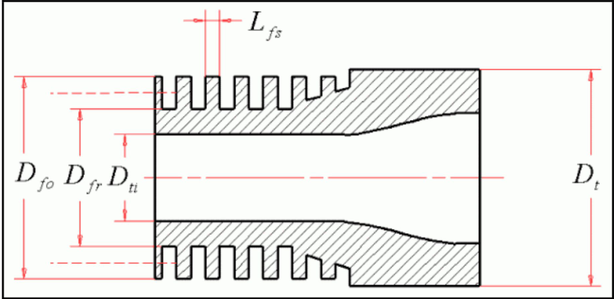

图 3.11 是 Wolverine Tube 若干低翅片管的照片。整体低翅片管几乎可用常见换热管材料制造。常见翅片密度为每米 630 片到 1000 片以上，通常按每英寸翅片数定义，例如 19 fpi、26 fpi、28 fpi 和 30 fpi 管。典型最大翅高约 1.5 mm，翅厚常约 0.3 mm。整体低翅片管的尺寸表可从 Wolverine Tube Inc. 网站获得。

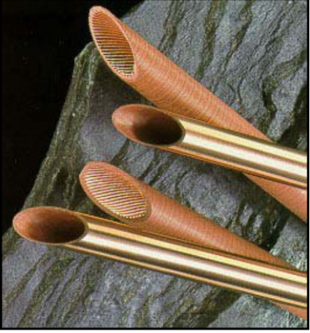

对许多单相流动，采用整体低翅片管比采用光管更有利。低翅片管适用于壳侧（外侧）传热系数远小于管侧传热系数的应用，也适用于壳侧[污垢热阻](../../../glossary/terms.md#term-fouling-resistance)控制设计的应用。前一种情况常出现在：壳侧流动处于湍流低端、过渡流或层流区；允许压降低，需要采用较大折流板切口和较大折流板间距；或管内采用螺旋翅片、内肋等传热强化结构时。

低翅片管另一个重要优点是它对壳侧污垢热阻具有有利影响。壳侧污垢系数施加在总润湿面积上，而该面积约为光管的 3 到 4 倍；若采用与光管设计相同的污垢系数值，则有效污垢热阻被降低到原来的约 1/3 到 1/4。对污垢系数较大或污垢热阻显著的场合，即使污垢系数只是中等水平，低翅片管的大面积比也可显著提高总传热系数。因此，使用低翅片管的作用包括提高壳侧传热系数、降低壳侧污垢热阻、提高管侧速度和传热系数；同时，翅片区管内径 Dti 小于管端光管段内径。

需要注意，当采用外低翅片管时，应使用翅片区管内径 Dti 来确定管侧传热系数和压降。最有效的低翅片几何可通过比较几种翅片密度确定。如果腐蚀裕量重要，应使用较厚翅片。若腐蚀裕量很大，则翅片可能并不适用，因为翅片可能会被腐蚀消耗掉。

### 3.6.2 Heat Transfer and Pressure Drops with Low Finned Tubes

### 3.6.2 低翅片管传热和压降

Taborek（1983）在同一文献中把光管流路分析方法扩展到整体低翅片管束。下文给出对上述设计方程的修改。低翅片管束壳侧传热系数随后用于计算总传热系数，此时必须计入低翅片的[翅片效率](../../../glossary/terms.md#term-fin-efficiency)。

**输入数据。** 为计算低翅片管束壳侧热工性能，还需要以下附加信息：

| 项目 | 符号 |
|---|---|
| 翅顶直径 | Dfo |
| 翅根直径 | Dfr |
| 单位管长翅片数 | Nf |
| 平均翅片厚度（按矩形轮廓假定） | Lfs |
| 低翅片管单位长度润湿面积 | Aof |
| 管-折流板孔间隙 | Ltb |

确定 Ltb 时，用 Dfo 代替 Dt。通常 Dfo 等于或略小于 Dt。

**传热和流动几何。** 对低翅片管束壳侧传热系数 αss 所采用的总传热面积为 Ao。对低翅片管：

$$
A_o
=
A_{of}L_{ta}N_{tt}
\tag{3.6.1}
$$

整体低翅片管的等效投影面积小于相同直径光管，因为沿流动方向相邻翅片之间存在开口。因此，“熔平”或等效投影直径 Dreq 是管几何和翅片密度的函数：

$$
D_{req}
=
D_{fr}+2L_{fh}N_fL_{fs}
\tag{3.6.2}
$$

翅高 Lfh 为：

$$
L_{fh}
=
\frac{D_{fo}-D_{fr}}{2}
\tag{3.6.3}
$$

因此，在光管管束关联式和几何方程中，凡出现光管直径 Dt，均按下列规则用 Dreq 或指定直径替换：

| 计算项 | 替换规则 |
|---|---|
| Sm 计算 | 用 Dreq 代替 Dt |
| Re 计算 | 用 Dreq 代替 Dt |
| Swt 计算 | 用 Dfo 代替 Dt |

**理想管束 j1。** 对 Re > 1000，光管方法可直接用于低翅片管，但 Re 应用 Dreq 而非 Dt 计算。当 Re < 1000 时，翅片上的层流边界层开始重叠并降低传热。该影响按下式修正，仅适用于 Re < 1000：

$$
j_1
=
J_fj_{1,plain}
\tag{3.6.4}
$$

Taborek（1983）给出了 Jf 随 log Re 从 Re = 20 到 Re = 1000 变化的图线，其中 Re = 1000 时 Jf = 1.0。这里将该曲线拟合为：

$$
J_f
=
0.58+0.42
\left(
\frac{\log(Re/20)}
{\log(1000/20)}
\right)
\tag{3.6.5}
$$

**理想管束 f1。** 与相同光管管束相比，低翅片管束具有更大的等效横掠流面积，因为翅片之间提供了额外流通面积。低翅片管的摩擦因子约为光管的 1.4 倍；不过，沿流动方向翅片间开口增大流通面积而导致的较低速度，已在 Reynolds 数 Re 中计入。低翅片管束摩擦因子计算时，先使用低翅片管的 Re 和 Dreq，按光管关联式计算 f1,plain，然后乘以 1.4：

$$
f_1
=
1.4f_{1,plain}
\tag{3.6.6}
$$

**算例。** Taborek（1983）中有一个详细六页算例，建议读者参考。
