# Chapter 6 Heat Transfer to Air-Cooled Heat Exchangers

# 第 6 章 空冷换热器传热

## 来源追溯

| 项目 | 内容 |
|---|---|
| 原书 | Engineering Data Book III |
| 章节 | Chapter 6 |
| PDF 页码 | 121-160 |
| 书内页码 | 6-1 到 6-40 |
| 进度记录 | [progress.md](./progress.md) |

## 章前说明

本章作者为 Anthony M. Jacobi，原书说明其任职于 University of Illinois at Urbana-Champaign 机械科学与工程系。作者致谢了 Air Conditioning and Refrigeration Center、Air-Conditioning and Refrigeration Technology Institute 以及合作者 Young-Gil Park 对相关研究的长期支持。

本章讨论制冷剂-空气和液体-空气换热器的传热与压降，重点在空气侧行为。原书给出圆管和扁管构型、连续翅片和间断翅片构型的性能关联式。

## 6.1 Introduction and Background

## 6.1 引言与背景

本书多数章节面向管内流动，提供预测管内两相流和单相流传热、压降所需的工具。这类计算对换热器设计和性能判断尤其重要。不过，在许多蒸气压缩系统以及其他应用中，空气侧的吸热或放热同样关键。某些系统会使用水或其他液体作为热库或工艺流股，但空气的使用非常普遍，而且空气侧计算方法不同于本书其他章节的管内流动方法。

本章聚焦换热器分析和设计中的空气侧传热与压降。由于推动本章的应用几乎总是采用圆管翅片换热器或扁管翅片换热器，所以讨论重点也放在这两类换热器上。图 6.1 和图 6.2 给出了它们的典型几何形态。

空气侧分析通常使用一套不同于管侧分析的符号体系。文献中的写法虽有差别，但常规空气侧符号已经广泛使用；如果本章放弃这套符号，反而会使读者更难把本章内容和既有空气侧文献联系起来。因此，本章采用一套相对独立的符号，章节末尾给出本章专用的符号说明。

许多工程师会觉得空气侧分析中广泛使用 [Colburn j 因子](../../../glossary/terms.md#term-colburn-j-factor)，而不是直接使用 [Nusselt 数](../../../glossary/terms.md#term-nusselt-number)，这一点有些令人困惑。j 因子的使用可能源自 Kays and London 经典著作的早期采用，但它也有理论基础。对稳态、层流、零压梯度边界层，尺度分析可说明，在 Prandtl 数不很低时，Nu 可写成 Re 和 Pr 的幂函数。对稳态湍流内流，也常用 Re 和 Pr 的幂函数表示传热。受边界层理论和湍流经验的启发，可定义 Colburn j 因子：

原式截图：[eq-6-1-original.png](./assets/eq-6-1-original.png)

$$
j=
\frac{Nu}{RePr^{1/3}}
\tag{6.1.1}
$$

并预期传热关联式常具有幂律形式：

原式截图：[eq-6-2-original.png](./assets/eq-6-2-original.png)

$$
j=ARe^{-B}
\tag{6.1.2}
$$

其中常数 B 很可能在 0.2 到 0.5 之间，具体取决于流动性质。

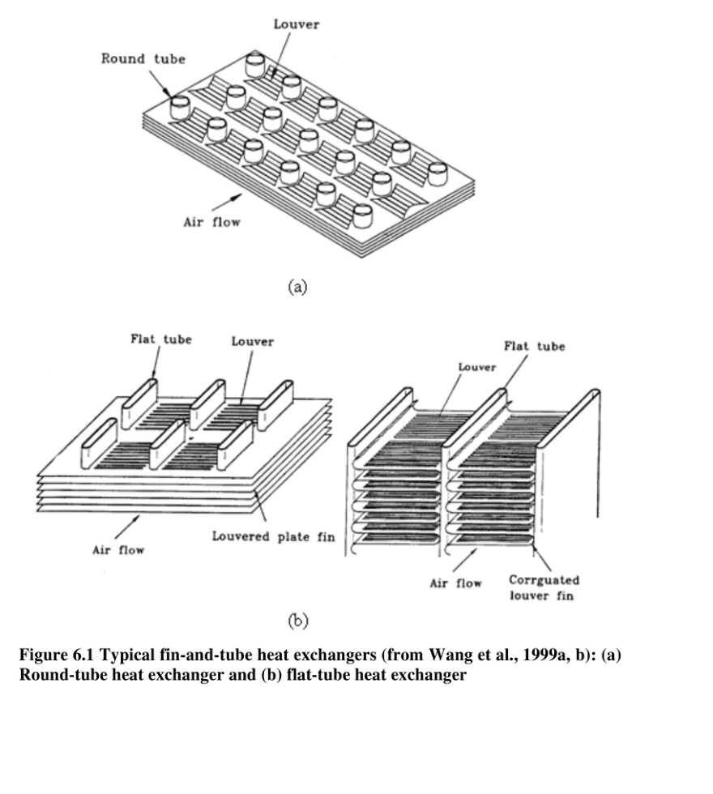

*图 6.1：典型翅片管换热器：a 为圆管换热器，b 为扁管换热器。*

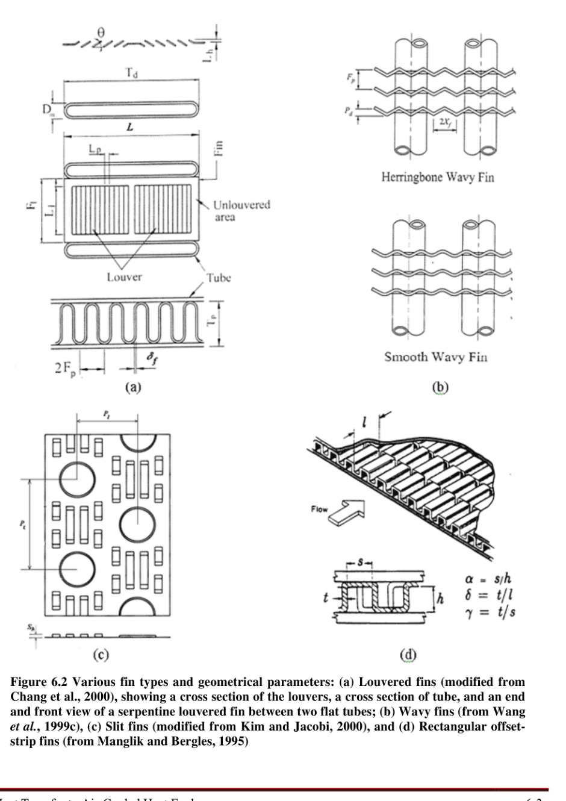

*图 6.2：各类翅片及几何参数：a 为百叶翅片，b 为波纹翅片，c 为开缝翅片，d 为矩形错列条翅片。*

### 换热器模型方程

为用简单形式提出换热器模型方程，先考虑稳态、无漏热、两股单相流。每股流体的能量平衡可写为：

原式截图：[eq-6-3-original.png](./assets/eq-6-3-original.png)

$$
Q=W_a c_{p,a}(T_{a,i}-T_{a,o})
\tag{6.1.3}
$$

原式截图：[eq-6-4-original.png](./assets/eq-6-4-original.png)

$$
Q=W_t c_{p,t}(T_{t,o}-T_{t,i})
\tag{6.1.4}
$$

其中下标 a 和 t 分别表示空气侧和管侧，下标 i 和 o 分别表示入口和出口。上述方程按空气被冷却的情形书写，也可改写为空气被加热的情形。如果发生相变，仍可用质量流量和焓变书写能量平衡。

除能量平衡外，传热还可用速率方程描述。最直观的一种写法是用[对数平均温差](../../../glossary/terms.md#term-log-mean-temperature-difference)：

原式截图：[eq-6-5-original.png](./assets/eq-6-5-original.png)

$$
Q=UA F\Delta T_{\mathrm{lm,cf}}
\tag{6.1.5a}
$$

$$
\Delta T_{\mathrm{lm,cf}}=
\frac{(T_{a,i}-T_{t,o})-(T_{a,o}-T_{t,i})}
{\ln\left[(T_{a,i}-T_{t,o})/(T_{a,o}-T_{t,i})\right]}
\tag{6.1.5b}
$$

式 (6.1.5) 中使用逆流对数平均温差；对于不是纯逆流构型的换热器，用依赖流动几何的校正因子 F 修正。

另一种写法是采用有效度-NTU 方法：

原式截图：[eq-6-6-original.png](./assets/eq-6-6-original.png)

$$
Q=\varepsilon Q_{\max}
\tag{6.1.6a}
$$

$$
\varepsilon=f(NTU,C_r)
\tag{6.1.6b}
$$

在 ε-NTU 方法中，流动几何被包含在 ε 与 NTU、热容率比 Cr 的函数关系中。不论采用 LMTD 还是 ε-NTU，速率方程都把传热量与驱动力和总传热导度 UA 联系起来；LMTD 法用 F 表示流动构型影响，ε-NTU 法用 ε = f(NTU, Cr) 表示流动构型影响。

换热器总传热导度 UA 是总热阻的倒数，总热阻来自管侧对流、接触热阻、污垢热阻、管壁导热热阻和空气侧对流。原书的一般热阻链为：

原式截图：[eq-6-7-original.png](./assets/eq-6-7-original.png)

$$
UA=
\left[
\frac{1}{(\eta h A_T)_t}
+R_{\mathrm{contact}}
+R_{\mathrm{foul}}
+R_{\mathrm{wall}}
+\frac{1}{(\eta_o h A_T)_a}
\right]^{-1}
\tag{6.1.7}
$$

接触热阻和污垢热阻可能显著，但完整处理超出本章范围。接触热阻强烈依赖制造方法：钎焊换热器不存在接触热阻；带翻边孔的翅片通常接触热阻可忽略；简单压配时接触热阻可能较大。污垢热阻强烈依赖运行环境、运行历史和维护方式。若这些效应重要，应查阅外部资料。管壁导热热阻几乎总是可以忽略。因此，在本章后续讨论的多数情形中，式 (6.1.7) 可简化为只保留两侧对流导度：

原式截图：[eq-6-8-original.png](./assets/eq-6-8-original.png)

$$
UA=
\left[
\frac{1}{(\eta h A_T)_t}
+\frac{1}{(\eta_o h A_T)_a}
\right]^{-1}
\tag{6.1.8}
$$

式 (6.1.8) 中，[总表面效率](../../../glossary/terms.md#term-overall-surface-efficiency) ηo 依赖翅片效率 ηf；而翅片效率又依赖对流传热系数、几何和翅片材料。因此计算常常需要迭代，多数分析会用计算机和标准软件求解联立方程。

以空气由翅片管内水流冷却为例，如果给定换热器几何、流量和入口温度，并已知管侧传热系数与水流量的关系、空气侧传热系数与空气流量的关系，那么热负荷和出口温度就是未知量。这类在固定换热器几何下求热负荷和出口温度的计算称为性能计算。分析步骤通常是：先按流量计算两侧对流传热系数；再按翅片几何计算翅片效率和总表面效率；随后用式 (6.1.8) 计算 UA；最后把式 (6.1.3)、(6.1.4) 与 LMTD 方程或 ε-NTU 方程联立求 Q 和出口温度。

另一类分析是设计计算。仍考虑同一问题，但不把换热器几何视为已知，而是在质量流量和入口温度给定时指定所需热负荷。此时目标是求所需换热器尺寸或 UA。计算步骤是：先计算两侧传热系数；再计算翅片效率和总表面效率；然后可用能量平衡由目标 Q 求出口温度，并用 LMTD 法求 UA；也可用 ε-NTU 法直接由 NTU 求 UA。即便 ε-NTU 法求 UA 时不必先知道出口温度，出口温度仍可再由能量平衡得到。

以上讨论只限于空气侧单相流。本书其他章节提供了管侧两相传热和压降计算方法，因此把分析扩展到管侧两相流时，可直接依赖本书其他章节。然而，空气侧也可能发生相变。例如除湿时空气侧表面会被液态水润湿；在制冷和热泵系统中，空气侧表面还可能结霜。Xia and Jacobi 以及 Park and Jacobi 对这类空气侧相变条件下的换热器性能表示方式做了详细讨论。由于翅片效率问题，分析可能大幅复杂化。

对于典型除湿工况，可采用基于焓势的写法：

原式截图：[eq-6-9-original.png](./assets/eq-6-9-original.png)

$$
Q=W_a(i_{a,i}-i_{a,o})
\tag{6.1.9}
$$

原式截图：[eq-6-10-original.png](./assets/eq-6-10-original.png)

$$
Q=W_t(i_{t,o}-i_{t,i})
\tag{6.1.10}
$$

原式截图：[eq-6-11-original.png](./assets/eq-6-11-original.png)

$$
Q=\frac{UA}{c_p}F\Delta i_{\mathrm{lm,cf}}
\tag{6.1.11a}
$$

$$
\Delta i_{\mathrm{lm,cf}}=
\frac{(i_{a,i}-i_{s,o})-(i_{a,o}-i_{s,i})}
{\ln\left[(i_{a,i}-i_{s,o})/(i_{a,o}-i_{s,i})\right]}
\tag{6.1.11b}
$$

其中 ia,i 和 ia,o 为空气入口和出口湿空气焓；is,i 和 is,o 为在管侧入口和出口温度下饱和湿空气的焓。式 (6.1.11) 类似式 (6.1.5)，只是用对数平均焓差作为同时传热传质的驱动力。焓势法适合许多空气冷却应用，但在部分湿表面换热器中可能失效；当传质效应改变输运系数时，它也会失效。

至此重点一直在传热计算。但在某些情况下，传热计算会与压降计算耦合，或受到压降约束。为计算流量、压降或风机功率，必须知道摩擦因子。类比传热关联式，可预期摩擦因子也遵循幂律形式：

原式截图：[eq-6-12-original.png](./assets/eq-6-12-original.png)

$$
f=CRe^{-n}
\tag{6.1.12}
$$

很多情况下这个预期可以成立，但后续内容会说明它过于简单。摩擦因子可通过紧凑式换热器压降关系与流量和压降关联起来。原书式 (6.1.13) 包含入口收缩、出口膨胀、密度变化和核心摩擦项：

原式截图：[eq-6-13-original.png](./assets/eq-6-13-original.png)

$$
f=
\frac{A_{\min}\bar{\rho}}{A_T\rho_i}
\left[
\frac{2\rho_i\Delta p}{G^2}
-
\left(K_c+1-\sigma^2\right)
-2\left(\frac{\rho_i}{\rho_o}-1\right)
+
\left(1-\sigma^2-K_e\right)\frac{\rho_i}{\rho_o}
\right]
\tag{6.1.13}
$$

其中 σ 为自由流通面积比，Kc 和 Ke 分别为入口收缩与出口膨胀损失系数，ρi、ρo 和平均密度分别对应入口、出口与核心平均状态。这个式子用于从实测压降反求核心摩擦因子，或在已知摩擦因子时估算总压降。

空气侧流动中，入口和出口效应常较小，密度变化也常可忽略。在这种情形下，原式可简化为核心摩擦压降形式：

原式截图：[eq-6-14-original.png](./assets/eq-6-14-original.png)

$$
\Delta p \approx
\frac{G^2}{2\rho}
\frac{A_T}{A_{\min}}f
\tag{6.1.14}
$$

使空气通过换热器所需的风机功率为：

原式截图：[eq-6-15-original.png](./assets/eq-6-15-original.png)

$$
P_{\mathrm{fan}}=
\frac{G A_{\min}\Delta p}{\rho\eta_p}
\tag{6.1.15}
$$

结束引言前还应指出：当空冷换热器在管侧两相流下运行，且管侧温度恒定或近似恒定时，式 (6.1.5) 和式 (6.1.11) 的修正因子趋近于 1；同样，此时 ε-NTU 关系可简化为 ε = 1 - exp(-NTU)。

Air-Conditioning and Refrigeration Technology Institute 在 2000 年代早期资助研究，评述并推进空气侧传热技术水平。后续内容很大程度来自这些研究。

## 6.2 Performance of plain-fin, round-tube heat exchangers

## 6.2 平片圆管换热器性能

Rich 和 Wang 等报告，翅片间距对传热和摩擦因子的影响并不强。Gray and Webb 给出了不含翅片间距的 j 因子关联式，但摩擦关联式中，随着翅片间距减小，f 会增加。Yan and Sheen 则认为，在翅片间距从 2.0 mm 到 1.4 mm 的范围内，传热和压降都会随翅片间距减小而增加。

文献中对翅片间距影响的分歧可能来自几何差异和实验不确定度。不过多数研究者认为，小翅片间距会带来较高 f，而 j 对翅片间距相对不敏感。一般也认为，在低 Re 下，j 因子会随管排数增加而降低；在高 Re 下，j 对管排数不敏感，甚至可能略微增加；摩擦因子通常对管排数不敏感。错列管布置通常优于顺列布置，因为错列管几何能减弱尾迹影响。近期也有利用涡发生器强化平片性能的研究。

当换热器在湿表面工况下运行，例如除湿应用中，空气侧表面滞留的冷凝液会改变表面几何和空气流动形态，并可能增加表面传热热阻。McQuiston 发现湿工况下传热和摩擦都会增加，并报告滴状冷凝时 j 高于膜状冷凝。多数研究者同意湿工况会增加 f，但并不一致认为 j 一定增加。

Wang 等发现，在低 Reynolds 数下，湿工况 j 会降低；在较高 Reynolds 数下，湿工况 j 与干工况接近或略高。Guillory and McQuiston 早先提出，可把光滑翅片上的冷凝液看作表面粗糙度增加；Tree and Helmer 用这一观点解释高 Reynolds 数下因过渡到湍流而产生的传热增强。McQuiston 在很低 Reynolds 数下发现 j 增加不显著，也支持这一简单粗糙度模型。

Jacobi and Goldschmidt 发现，在低 Reynolds 数下，冷凝液以翅片间桥接形式滞留会损害传热。Korte and Jacobi 在实验中同时测量冷凝液滞留质量和热工水力性能，表明滞留冷凝液质量随空气速度增加而减少；冷凝液会占据表面面积并阻塞空气流动，从而降低传热。由于高速度下冷凝液滞留减少，平片管换热器湿工况和干工况下的 j 与 f 差异也随 Reynolds 数升高而减小。

Wang 等基于 3 个翅片间距为 2.0 到 3.0 mm 的换热器实验数据，认为除湿工况下翅片间距对 f 和 j 都不重要。Korte and Jacobi 则报告显热传热和压降依赖翅片间距与接触角。他们测试了 14 排管、翅片间距 2.12 到 6.35 mm 的换热器；部分样品有涂层且平均接触角约 45°，其他样品无涂层或有防腐涂层，接触角为 60° 到 75°。对于较大翅片间距的换热器，他们没有发现湿工况下显热 j 降低；对较小翅片间距，湿工况下 f 高于干工况。翅片间距效应还依赖接触角：翅片间距小、接触角大时，湿工况 f 的增加更强。

湿工况下管排数的影响与干工况类似。Wang 等报告，j 会随管排数增加而降低，这一效应在小翅片间距时更强；他们同时发现 f 与翅片间距无关。相对湿度对完全湿表面平片圆管换热器的 f 影响可忽略，j 也几乎不受相对湿度影响。另一些数据提示相对湿度可能在某些工况下影响 f，因为较厚水膜会使流道变窄。

关于相对湿度对 j 的影响，文献差异很可能来自湿翅片效率计算方法差别。Wang 等采用 Threlkeld 方法处理实验数据时得到 j 与相对湿度无关；若采用 McQuiston and Parker 方法，则得到 j 随相对湿度降低。Wu and Bong 的湿翅片效率计算方法研究支持基于焓作为驱动力的 Threlkeld 方法。Xia and Jacobi 后续复核了数据处理方法，并建议使用一致的 LMTD 方法，特别适合部分湿表面。

多数湿表面研究只考虑完全湿表面，但实际应用中可能出现部分湿表面。对部分湿工况，必须把干表面翅片面积和湿表面翅片面积分开处理，才能正确计算翅片效率；Park and Jacobi 讨论了相应方法。

## 6.3 Performance of louvered-fin, round-tube heat exchangers

## 6.3 百叶翅片圆管换热器性能

翅片间距对百叶翅片圆管换热器的 j 和 f 影响较小。Wang 等报告，当 ReD 小于 1000 时，j 会随翅片间距减小而降低；当 ReD 大于 1000 时，j 与翅片间距基本无关。与平片换热器相比，翅片间距对 f 的影响较小。由于 j 对 Reynolds 数有这种依赖，Wang 等为不同 Reynolds 数范围分别给出了 j 因子关联式。

Yan and Sheen 的实验中未观察到 j 随翅片间距的明确趋势，但发现较小翅片间距会增加 f。与平片几何类似，当 ReD 小于 3000 时，传热会随管排数增加而降低；摩擦因子与管排数无关。Wang 等也报告 f 基本不依赖管排数；当 ReD 小于 2000 时，j 会随管排数增加而降低；当 ReD 大于 2000 时，j 与管排数无关。作者解释，低 Reynolds 数下传热衰减来自管后热尾迹；管排数多的换热器有更长空气流动深度，因此受尾迹影响更强。高 Reynolds 数下，管后的涡和湍流混合增强传热，使 j 对管排数的依赖消失。

空气侧摩擦会随管径减小而降低。Wang 等报告，在低 Reynolds 数下，大管径会降低传热，因为大管后方无效区域更大；高 Reynolds 数下，湍流混合使管径影响消失。Fu 等发现干表面条件下 j 与翅片间距无关；湿条件下，当 ReD 小于 2000 时，较小翅片间距会降低显热 j；ReD 大于 2000 时，j 与翅片间距无关。f 随翅片间距减小而增加。

湿工况下，Wang and Chang 报告显热传热系数与相对湿度无关。他们还指出，当迎面风速低于 0.7 m/s 时，百叶或开缝翅片带来的传热强化在湿工况下会变得不显著，这意味着冷凝对间断翅片显热传热系数的削弱大于对平片的削弱。基于实验数据，他们认为亲水涂层会降低压降，但不影响显热传热。Kim and Jacobi 在开缝翅片换热器中也发现类似涂层效应。

Fu 等对相对湿度影响得出不同结论：他们报告较高相对湿度会使 j 降低、f 增加。考虑到湿翅片效率计算方法的差异，这种 j 因子对相对湿度的依赖很可能来自他们采用的计算方法。Wang 等报告相对湿度对 j 因子影响较小，但较高湿度下压降略有增加。由于冷凝形态依赖表面接触角，对相对湿度影响作出一般性结论时必须谨慎考虑表面条件。

## 6.4 Performance of slit-fin, round-tube heat exchanger

## 6.4 开缝翅片圆管换热器性能

开缝翅片换热器中，翅片间距的影响可能强于百叶翅片换热器。Wang 等对 12 个开缝翅片试样进行干工况实验，发现传热系数和压降都会随翅片间距增加而降低。

与其他几何一样，管排数对摩擦因子影响较小，而 j 因子会随管排数增加而降低。不过，当管排数超过 4 排且翅片间距较小时，Wang 等观察到不同的 j 因子行为：一般趋势是 j 随 Reynolds 数增加而降低，但在大管排数下，j 会先随 Reynolds 数增加到峰值，再下降。Du and Wang 也报告，管排数对 f 几乎无影响；ReD 小于 1000 时，j 随管排数增加显著降低；ReD 大于 2000 时，j 与管排数无关。

Kim and Jacobi 通过 24 个开缝翅片试样研究热工水力性能和冷凝液滞留特性，翅片间距为 1.3、1.5 和 1.7 mm。湿工况下，他们发现较小翅片间距会使 f 增加、j 降低。由于较小翅片间距更容易让滞留冷凝液在翅片间形成桥接，这一结果可能来自冷凝液滞留。

干工况下，2 排开缝翅片换热器比 3 排换热器具有更低 f 和更高 j；湿工况下，2 排换热器的 f 反而高于 3 排试样。Kim and Jacobi 报告，单位表面积滞留冷凝液会随管排数增加而减少，并将其归因于空气流动方向上冷凝液滴的扫掠效应。亲水涂层在湿工况下稳定降低空气侧压降，但其对湿工况 j 因子的影响并不清晰。

## 6.5 Performance of wavy-fin, round-tube heat exchanger

## 6.5 波纹翅片圆管换热器性能

许多关于波纹翅片换热器的论文同时包含错列和顺列管布置，结果依赖管排布置。Wang 等报告，j 几乎不依赖翅片间距，而 f 随 Reynolds 数出现交叉趋势：当 ReD 小于 1000 时，f 随翅片间距增大而降低；当 ReD 大于 1000 时，f 随翅片间距增大而增加。Abu Madi 等报告，摩擦不受翅片厚度影响，而较小翅片厚度会提高传热系数。

Wang 等发现，对顺列和错列管布置，摩擦因子都与管排数无关。对顺列样品，管排数对 j 的影响类似间断翅片换热器：ReD 小于 2000 时，j 随管排数增加而降低；ReD 大于 2000 时，j 与管排数无关。在错列管换热器中，j 对管排数的依赖与顺列情形显著不同：ReD 小于 900 时，j 随管排数增加略有降低；ReD 大于 900 时，j 随管排数增加而增加。

Wang 等解释，在低 Reynolds 数下，连续波纹翅片上的热边界层沿流动方向增长，较长流动深度会更强地削弱传热。随着 Reynolds 数增加，波形驱动空气流动并破坏热边界层，边界层影响减弱。这一解释与 Rush 等的流动可视化工作一致。Rush 等进一步说明，错列布置才具有下游湍流强化传热的作用。

Kim 等比较了管布置和翅片形态对波纹翅片换热器性能的影响，报告人字形波纹翅片的传热高于光滑波纹翅片；但光滑型的面积优度因子 j/f 更高，意味着人字形波纹翅片也带来更高摩擦。他们还报告，错列管布置的传热高于顺列布置。

Wang 等研究了湿工况下人字形波纹翅片换热器几何参数对性能的影响。翅片节距对 f 和 j 的影响依赖管排数：翅片节距增加时，f 降低，这一效应对 6 排盘管强于单排盘管；翅片节距增加时，6 排盘管的显热 j 增加，而单排盘管的显热 j 降低。湿工况下，人字形波纹翅片换热器的 f 随管排数增加而降低，这不同于其他翅片几何。不过在小翅片节距和低 Reynolds 数下，显热 j 仍像其他翅片几何一样随管排数增加而降低。作者还报告了管径与翅片节距、管排数组合的影响，但这些关于管径的结论需要谨慎，因为不同管径图中也混入了不同波深。

## 6.6 Performance of louvered-fin, flat-tube heat exchanger

## 6.6 百叶翅片扁管换热器性能

虽然有些扁管百叶翅片换热器采用百叶板翅片和多排管，但多数采用蛇形百叶翅片和单排扁管。蛇形百叶翅片扁管换热器常用于高度重视紧凑性的应用。扁管设计的优点包括：空气流过百叶片组时更接近垂直穿过百叶片组；消除了圆管造成的管后尾迹；并降低管子的形状阻力。Joardar and Jacobi 报告了在百叶翅片换热器上叠加涡发生器的复合强化。

圆管换热器常用管径作为特征长度；扁管换热器通常用百叶节距作为特征长度。翅片节距对圆管和扁管几何都重要，但管径和管节距对扁管换热器性能的重要性降低，百叶节距、百叶长度、百叶角和翅片厚度的影响更大。

百叶翅片换热器的性能类似错列条翅片换热器，边界层再启动是重要强化机制。Davenport 说明了百叶长度与翅片长度之比的物理意义；Osada 等后来发现它也是湿工况冷凝排水中的重要参数。Achaichia and Cowell 发现，在 ReD 约 300 到 1000 以下时，j 与 Re 无关，并解释为低 Re 下气流较为管道导向，高 Re 下则较为百叶导向。

单个设计参数的影响最容易通过已有 j 和 f 关联式来研究。Chang and Wang、Chang 等提供了成熟关联式；Park and Jacobi 提供了更完整和综合的关联式。

湿表面传热早期研究之后，Jacobi 及合作者进行了广泛研究。Park and Jacobi 给出了较完整的性能关联式，并提出处理部分湿表面的方法。对于结霜表面条件下的百叶翅片扁管几何，也有有限研究。

## 6.7 Performance of slit-fin, flat-tube heat exchanger

## 6.7 开缝翅片扁管换热器性能

实际中，这类翅片通常不是蛇形翅片，而是连接到扁管上的矩形错列条翅片。该几何已有多个性能关联式，其中 Manglik and Bergles 的关联式最受关注，后来 Michna 等把它扩展到很高 Reynolds 数范围。

Kaiser and Jacobi 研究了两台带蛇形开缝翅片的汽车蒸发器在湿工况下的表现，报告开缝翅片几何在冷凝液排水方面优于百叶翅片，但未报告热工水力数据。Smotrys 等报告了采用涡发生器对开缝翅片进行复合强化的研究。

## 6.8 Predicting Air-Side Thermal-Hydraulic Performance

## 6.8 预测空气侧热工水力性能

### Table 6.1

### 表 6.1 换热器关联式

原书 Table 6.1 是大型关联式汇总表，跨 PDF 133-151 页。当前草稿保留逐页局部截图，供后续逐式转写和适用范围二校。使用这些关联式时，必须同时核对翅片类型、管型、表面状态、特征长度、Re 范围、几何参数范围和作者给出的注释。

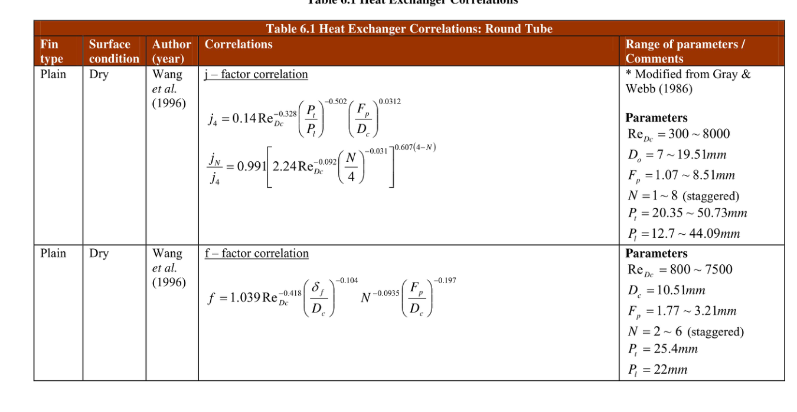

*表 6.1 第 1 部分：平片圆管干工况关联式。*

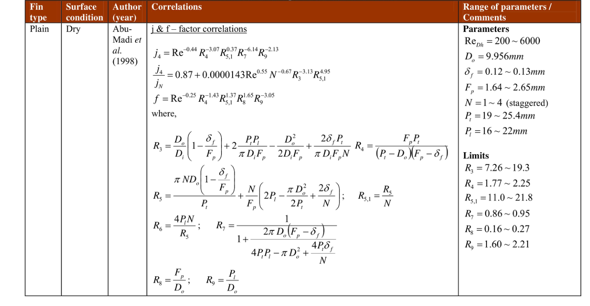

*表 6.1 第 2 部分：平片圆管干工况关联式续。*

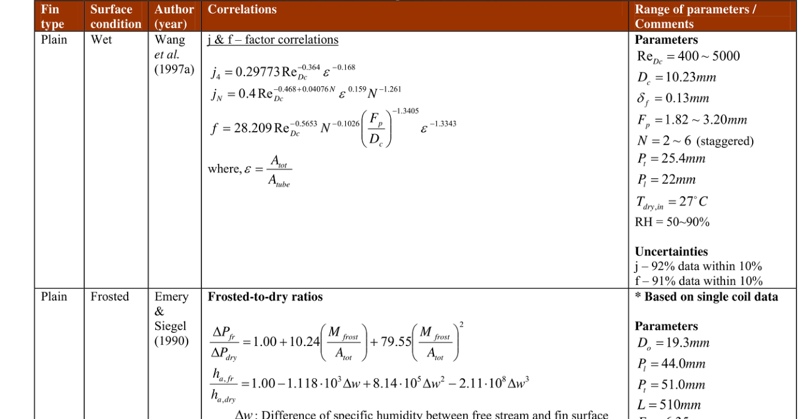

*表 6.1 第 3 部分：平片圆管湿工况和结霜工况关联式。*

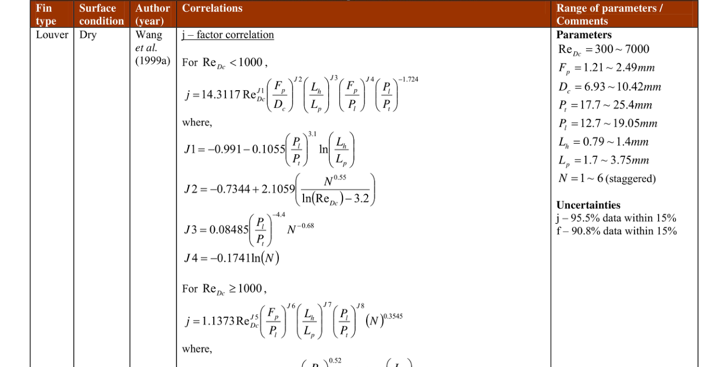

*表 6.1 第 4 部分：百叶翅片圆管干工况关联式。*

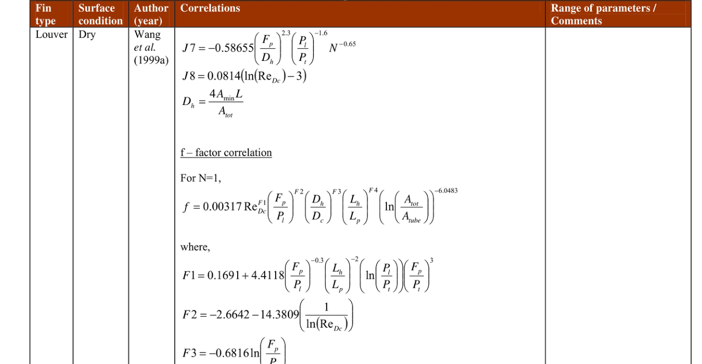

*表 6.1 第 5 部分：百叶翅片圆管干工况关联式续。*

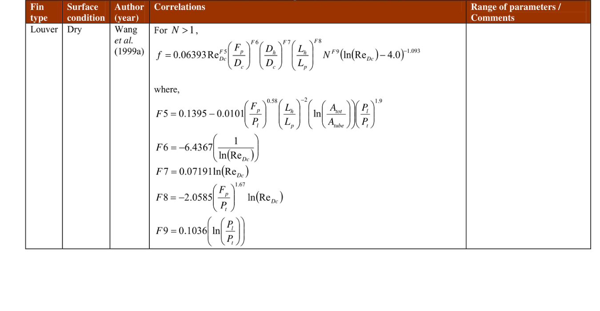

*表 6.1 第 6 部分：百叶翅片圆管湿工况关联式。*

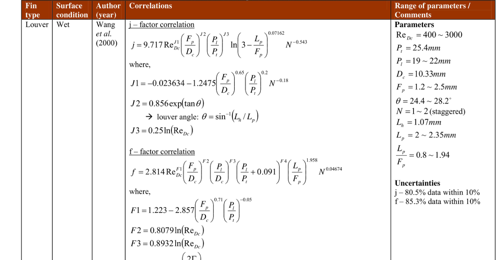

*表 6.1 第 7 部分：开缝翅片圆管干工况关联式。*

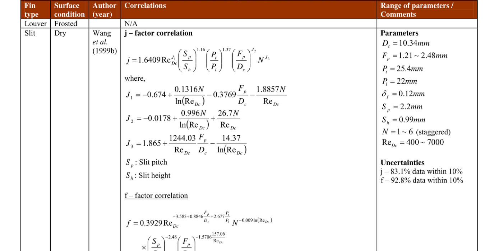

*表 6.1 第 8 部分：开缝翅片圆管湿工况关联式。*

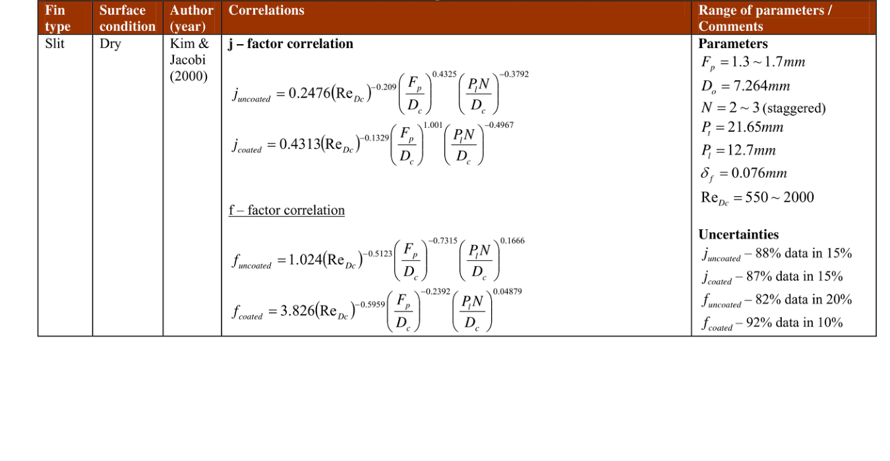

*表 6.1 第 9 部分：波纹翅片圆管干工况关联式。*

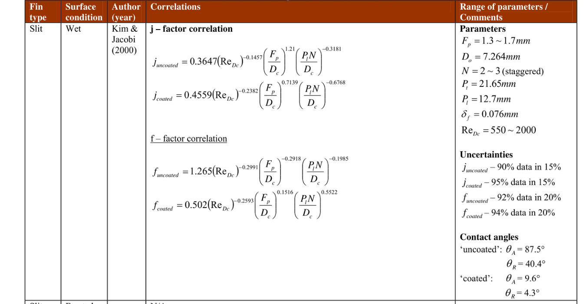

*表 6.1 第 10 部分：波纹翅片圆管湿工况关联式。*

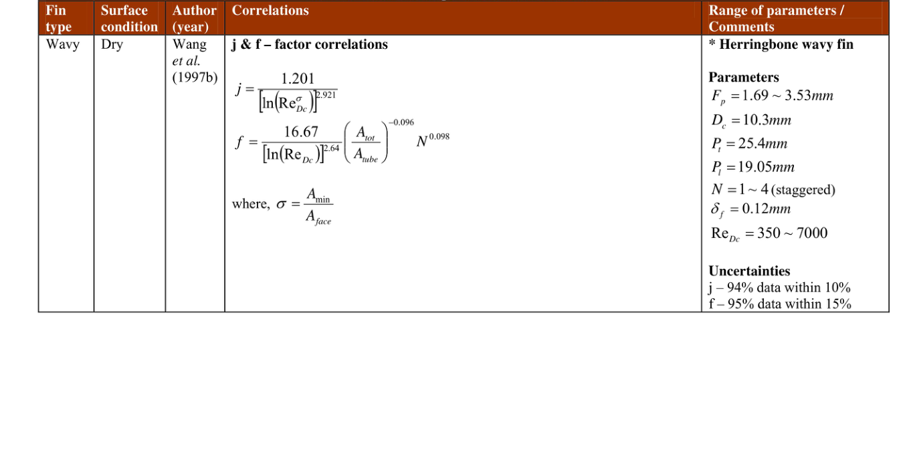

*表 6.1 第 11 部分：百叶翅片扁管干工况关联式。*

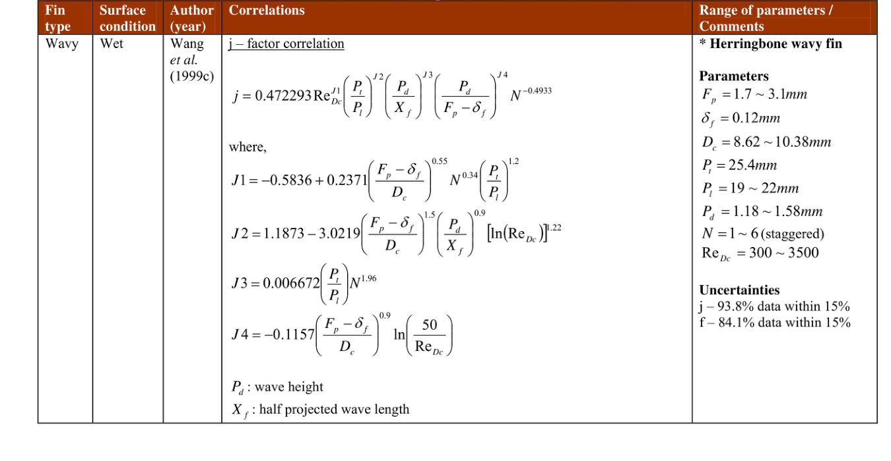

*表 6.1 第 12 部分：百叶翅片扁管干工况关联式续。*

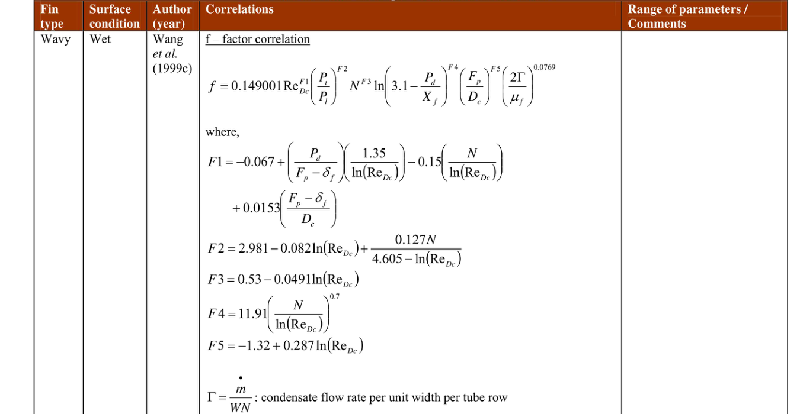

*表 6.1 第 13 部分：百叶翅片扁管湿工况关联式。*

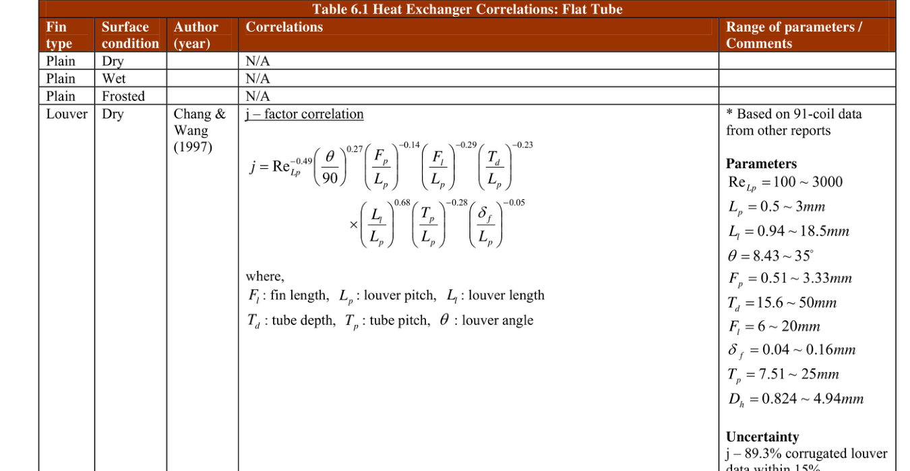

*表 6.1 第 14 部分：百叶翅片扁管湿工况关联式续。*

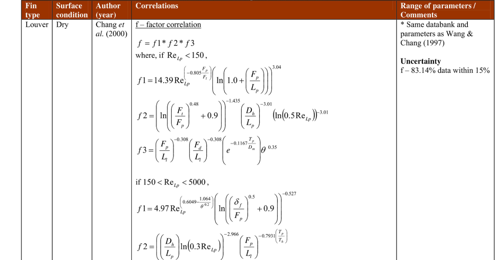

*表 6.1 第 15 部分：百叶翅片扁管部分湿工况关联式。*

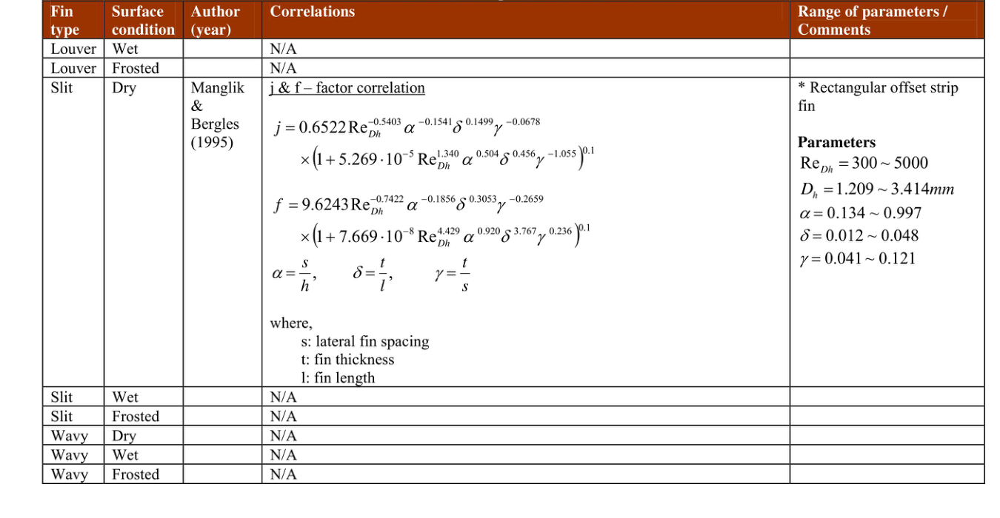

*表 6.1 第 16 部分：百叶翅片扁管结霜工况关联式。*

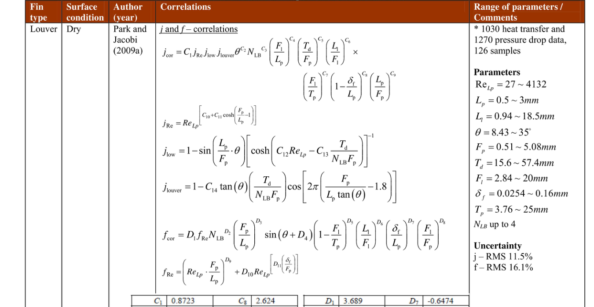

*表 6.1 第 17 部分：百叶翅片扁管结霜工况关联式续。*

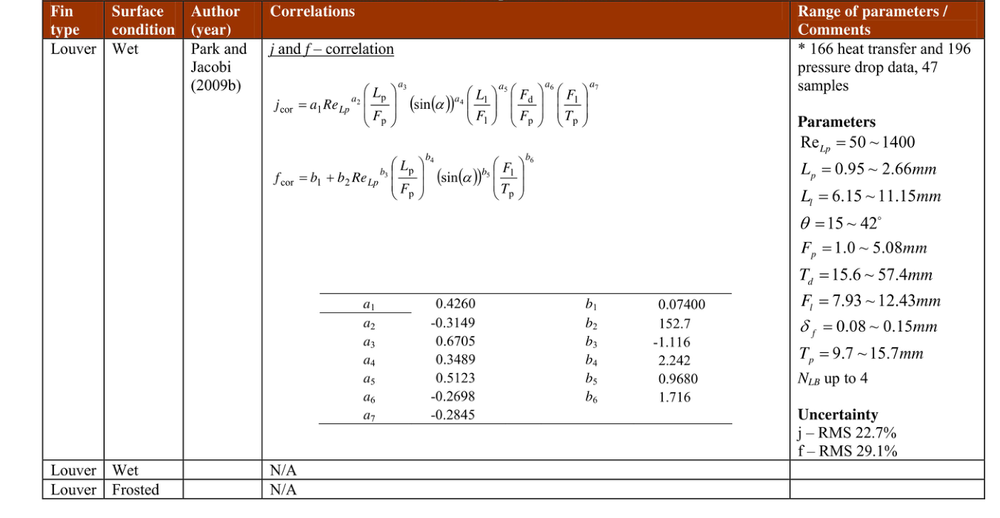

*表 6.1 第 18 部分：开缝翅片扁管干工况关联式。*

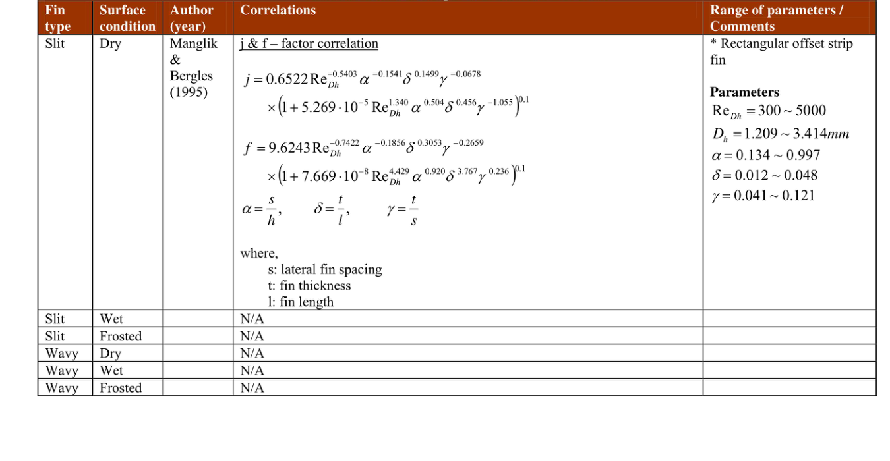

*表 6.1 第 19 部分：开缝翅片扁管干工况关联式续，并列出若干无公开关联式的组合。*

### 表 6.1 中文转写索引

下面按原表逐项转写表头、适用对象、作者、关联式类型、参数范围和备注。公式本体仍以紧邻的原表截图为准，后续若要做可计算公式库，应在此索引基础上逐式转写 LaTeX 并复核特征长度。

| 管型 | 翅片类型 | 表面状态 | 作者 | 关联式内容 | 参数范围和备注 |
|---|---|---|---|---|---|
| 圆管 | 平片 | 干 | Wang et al. (1996) | j 因子关联式；由 Gray and Webb (1986) 修正而来 | ReDc = 300-8000；Do = 7-19.51 mm；Fp = 1.07-8.51 mm；N = 1-8，错列；Pt = 20.35-50.73 mm；Pl = 12.7-44.09 mm |
| 圆管 | 平片 | 干 | Wang et al. (1996) | f 因子关联式 | ReDc = 800-7500；Dc = 10.51 mm；Fp = 1.77-3.21 mm；N = 2-6，错列；Pt = 25.4 mm；Pl = 22 mm |
| 圆管 | 平片 | 干 | Abu-Madi et al. (1998) | j 与 f 因子关联式；给出中间无量纲参数 R3 到 R9 的限制 | ReDh = 200-6000；Do = 9.956 mm；δf = 0.12-0.13 mm；Fp = 1.64-2.65 mm；N = 1-4，错列；Pt = 19-25.4 mm；Pl = 16-22 mm；R3 = 7.26-19.3；R4 = 1.77-2.25；R5,1 = 11.0-21.8；R7 = 0.86-0.95；R8 = 0.16-0.27；R9 = 1.60-2.21 |
| 圆管 | 平片 | 湿 | Wang et al. (1997a) | j 与 f 因子关联式；用面积比 ε = Atot/Atube | ReDc = 400-5000；Dc = 10.23 mm；δf = 0.13 mm；Fp = 1.82-3.20 mm；N = 2-6，错列；Pt = 25.4 mm；Pl = 22 mm；Tdry,in = 27 °C；RH = 50-90%；j 为 92% 数据在 10% 内，f 为 91% 数据在 10% 内 |
| 圆管 | 平片 | 结霜 | Emery and Siegel (1990) | 结霜/干工况压降比与传热系数比；同时给出干工况 j/f 关联式 | 基于单个盘管数据；Do = 19.3 mm；Pl = 44.0 mm；Pt = 51.0 mm；L = 510 mm；Fp = 6.35 mm；δf = 0.51 mm |
| 圆管 | 百叶翅片 | 干 | Wang et al. (1999a) | j 因子关联式；按 ReDc 小于 1000 和大于等于 1000 分段；同一条目还给出 f 因子关联式 | ReDc = 300-7000；Fp = 1.21-2.49 mm；Dc = 6.93-10.42 mm；Pt = 17.7-25.4 mm；Pl = 12.7-19.05 mm；Lh = 0.79-1.4 mm；Lp = 1.7-3.75 mm；N = 1-6，错列；j 为 95.5% 数据在 15% 内，f 为 90.8% 数据在 15% 内 |
| 圆管 | 百叶翅片 | 湿 | Wang et al. (2000) | j 与 f 因子关联式；包含百叶角 θ，θ = sin-1(Lh/Lp) | ReDc = 400-3000；Pt = 25.4 mm；Pl = 19-22 mm；Dc = 10.33 mm；Fp = 1.2-2.5 mm；θ = 24.4-28.2°；N = 1-2，错列；Lh = 1.07 mm；Lp = 2-2.35 mm；Lp/Fp = 0.8-1.94；j 为 80.5% 数据在 10% 内，f 为 85.3% 数据在 10% 内 |
| 圆管 | 百叶翅片 | 结霜 | 原表未列作者 | N/A | 原表未给出公开关联式 |
| 圆管 | 开缝翅片 | 干 | Wang et al. (1999b) | j 与 f 因子关联式；定义 Sp 为开缝节距、Sh 为开缝高度 | Dc = 10.34 mm；Fp = 1.21-2.48 mm；Pt = 25.4 mm；Pl = 22 mm；δf = 0.12 mm；Sp = 2.2 mm；Sh = 0.99 mm；N = 1-6，错列；ReDc = 400-7000；j 为 83.1% 数据在 10% 内，f 为 92.8% 数据在 10% 内 |
| 圆管 | 开缝翅片 | 干 | Kim and Jacobi (2000) | 未涂层与涂层表面的 j 与 f 因子关联式 | Fp = 1.3-1.7 mm；Do = 7.264 mm；N = 2-3，错列；Pt = 21.65 mm；Pl = 12.7 mm；δf = 0.076 mm；ReDc = 550-2000；未涂层 j 为 88% 数据在 15% 内；涂层 j 为 87% 数据在 15% 内；未涂层 f 为 82% 数据在 20% 内；涂层 f 为 92% 数据在 10% 内 |
| 圆管 | 开缝翅片 | 湿 | Kim and Jacobi (2000) | 未涂层与涂层表面的 j 与 f 因子关联式 | 参数范围同 Kim and Jacobi 干工况；未涂层 j 为 90% 数据在 15% 内；涂层 j 为 95% 数据在 15% 内；未涂层 f 为 92% 数据在 20% 内；涂层 f 为 94% 数据在 20% 内；接触角：未涂层 θA = 87.5°、θR = 40.4°；涂层 θA = 9.6°、θR = 4.3° |
| 圆管 | 开缝翅片 | 结霜 | 原表未列作者 | N/A | 原表未给出公开关联式 |
| 圆管 | 波纹翅片 | 干 | Wang et al. (1997b) | j 与 f 因子关联式；适用于人字形波纹翅片 | Fp = 1.69-3.53 mm；Dc = 10.3 mm；Pt = 25.4 mm；Pl = 19.05 mm；N = 1-4，错列；δf = 0.12 mm；ReDc = 350-7000；j 为 94% 数据在 10% 内；f 为 95% 数据在 15% 内 |
| 圆管 | 波纹翅片 | 湿 | Wang et al. (1999c) | j 与 f 因子关联式；适用于人字形波纹翅片；Pd 为波高，Xf 为半投影波长 | Fp = 1.7-3.1 mm；δf = 0.12 mm；Dc = 8.62-10.38 mm；Pt = 25.4 mm；Pl = 19-22 mm；Pd = 1.18-1.58 mm；N = 1-6，错列；ReDc = 300-3500；j 为 93.8% 数据在 15% 内；f 为 84.1% 数据在 15% 内 |
| 圆管 | 波纹翅片 | 结霜 | 原表未列作者 | N/A | 原表未给出公开关联式 |
| 扁管 | 平片 | 干、湿、结霜 | 原表未列作者 | N/A | 原表未给出公开关联式 |
| 扁管 | 百叶翅片 | 干 | Chang and Wang (1997) | j 因子关联式；基于其他报告中的 91 个盘管数据 | ReLp = 100-3000；Lp = 0.5-3 mm；Ll = 0.94-18.5 mm；θ = 8.43-35°；Fp = 0.51-3.33 mm；Td = 15.6-50 mm；Fl = 6-20 mm；δf = 0.04-0.16 mm；Tp = 7.51-25 mm；Dh = 0.824-4.94 mm；j 为 89.3% 波纹百叶数据在 15% 内 |
| 扁管 | 百叶翅片 | 干 | Chang et al. (2000) | f 因子关联式；与 Chang and Wang (1997) 采用相同数据库和参数 | f 为 83.14% 数据在 15% 内；分段适用于 ReLp 小于 150 和 150 到 5000 的范围，公式见原图 |
| 扁管 | 百叶翅片 | 干 | Park and Jacobi (2009a) | j 与 f 因子关联式；含 jRe、jlow、jlouver、fRe 等修正项 | 1030 个传热数据和 1270 个压降数据，126 个样品；ReLp = 27-4132；Lp = 0.5-3 mm；Ll = 0.94-18.5 mm；θ = 8.43-35°；Fp = 0.51-5.08 mm；Td = 15.6-57.4 mm；Fl = 2.84-20 mm；δf = 0.0254-0.16 mm；Tp = 3.76-25 mm；NLB 最大为 4；j 的 RMS 误差为 11.5%，f 的 RMS 误差为 16.1% |
| 扁管 | 百叶翅片 | 湿 | Park and Jacobi (2009b) | j 与 f 因子关联式；给出 a1-a7 与 b1-b6 常数 | 166 个传热数据和 196 个压降数据，47 个样品；ReLp = 50-1400；Lp = 0.95-2.66 mm；Ll = 6.15-11.15 mm；θ = 15-42°；Fp = 1.0-5.08 mm；Td = 15.6-57.4 mm；Fl = 7.93-12.43 mm；δf = 0.08-0.15 mm；Tp = 9.7-15.7 mm；NLB 最大为 4；j 的 RMS 误差为 22.7%，f 的 RMS 误差为 29.1% |
| 扁管 | 百叶翅片 | 湿、结霜 | 原表未列作者 | N/A | 原表另列若干湿/结霜组合为 N/A，表示未给出公开可用关联式 |
| 扁管 | 开缝翅片 | 干 | Manglik and Bergles (1995) | j 与 f 因子关联式；适用于矩形错列条翅片；α = s/h，δ = t/l，γ = t/s | ReDh = 300-5000；Dh = 1.209-3.414 mm；α = 0.134-0.997；δ = 0.012-0.048；γ = 0.041-0.121；s 为横向翅片间距，t 为翅片厚度，l 为翅片长度 |
| 扁管 | 开缝翅片 | 湿、结霜 | 原表未列作者 | N/A | 原表未给出公开关联式 |
| 扁管 | 波纹翅片 | 干、湿、结霜 | 原表未列作者 | N/A | 原表未给出公开关联式 |

### 表 6.1 公式转写草稿

下列公式按原表顺序转写，用于检索、复制和后续二校。几何符号的完整定义仍以原表截图和本章符号说明为准；涉及跨页续表的复杂常数，已尽量从旋转源页补齐，但出版级复核时仍应逐式对照 `table-6-1-part-01-original.png` 到 `table-6-1-part-19-original.png`。

#### 圆管平片

Wang et al. 干工况 j 因子：

$$
j_4=0.14Re_{Dc}^{-0.328}
\left(\frac{P_t}{P_l}\right)^{-0.502}
\left(\frac{F_p}{D_c}\right)^{0.0312}
$$

$$
\frac{j_N}{j_4}
=0.991
\left[
2.24Re_{Dc}^{-0.092}
\left(\frac{N}{4}\right)^{-0.031}
\right]^{0.607(4-N)}
$$

Wang et al. 干工况 f 因子：

$$
f=1.039Re_{Dc}^{-0.418}
\left(\frac{\delta_f}{D_c}\right)^{-0.104}
N^{-0.0935}
\left(\frac{F_p}{D_c}\right)^{-0.197}
$$

Abu-Madi et al. 干工况 j 与 f 因子：

$$
j_4=Re^{-0.44}R_4^{-3.07}R_{5,1}^{0.37}R_7^{-6.14}R_9^{-2.13}
$$

$$
\frac{j_4}{j_N}
=0.87+0.0000143Re^{0.55}N^{-0.67}R_3^{-3.13}R_{5,1}^{4.95}
$$

$$
f=Re^{-0.25}R_4^{-1.43}R_{5,1}^{1.37}R_8^{1.65}R_9^{-3.05}
$$

$$
R_3=
\frac{D_o}{D_i}\left(1-\frac{\delta_f}{F_p}\right)
+\frac{2P_tP_l}{\pi D_iF_p}
-\frac{D_o^2}{2D_iF_p}
+\frac{2\delta_fP_t}{\pi D_iF_pN}
$$

$$
R_4=
\frac{F_pP_t}{(P_t-D_o)(F_p-\delta_f)}
$$

$$
R_5=
\frac{\pi ND_o\left(1-\delta_f/F_p\right)}{P_t}
+\frac{N}{F_p}
\left(2P_l-\frac{\pi D_o^2}{2P_t}+\frac{2\delta_f}{N}\right),
\qquad
R_{5,1}=\frac{R_5}{N}
$$

$$
R_6=\frac{4P_lN}{R_5}
$$

$$
R_7=
\frac{1}{1+
\dfrac{2\pi D_o(F_p-\delta_f)}
{4P_tP_l-\pi D_o^2+4P_t\delta_f/N}}
$$

$$
R_8=\frac{F_p}{D_o},
\qquad
R_9=\frac{P_l}{D_o}
$$

Wang et al. 湿工况：

$$
j_4=0.29773Re_{Dc}^{-0.364}\varepsilon^{-0.168}
$$

$$
j_N=0.4Re_{Dc}^{-0.468+0.04076N}\varepsilon^{0.159}N^{-1.261}
$$

$$
f=28.209Re_{Dc}^{-0.5653}N^{-0.1026}
\left(\frac{F_p}{D_c}\right)^{-1.3405}
\varepsilon^{-1.3343},
\qquad
\varepsilon=\frac{A_{tot}}{A_{tube}}
$$

Emery and Siegel 结霜与干工况比值：

$$
\frac{\Delta P_{fr}}{\Delta P_{dry}}
=1.00+10.24\left(\frac{M_{frost}}{A_{tot}}\right)
+79.55\left(\frac{M_{frost}}{A_{tot}}\right)^2
$$

$$
\frac{h_{a,fr}}{h_{a,dry}}
=1.00-1.118\cdot10^3\Delta w
+8.14\cdot10^5\Delta w^2
-2.11\cdot10^8\Delta w^3
$$

同一条目给出的干工况基准式为：

$$
j=0.0091\left(\frac{Re_{Dh}}{1000}\right)^{-0.313},
\qquad
f=0.0398\left(\frac{Re_{Dh}}{1000}\right)^{-0.055}
$$

#### 圆管百叶翅片

Wang et al. 干工况 j 因子，低 Reynolds 数段：

$$
j=14.3117Re_{Dc}^{J1}
\left(\frac{F_p}{D_c}\right)^{J2}
\left(\frac{L_h}{L_p}\right)^{J3}
\left(\frac{F_p}{P_l}\right)^{J4}
\left(\frac{P_l}{P_t}\right)^{-1.724}
$$

$$
J1=-0.991-0.1055
\left(\frac{P_l}{P_t}\right)^{3.1}
\ln\left(\frac{L_h}{L_p}\right)
$$

$$
J2=-0.7344+2.1059
\left(
\frac{N^{0.55}}{\ln(Re_{Dc})-3.2}
\right)
$$

$$
J3=0.08485
\left(\frac{P_l}{P_t}\right)^{-4.4}
N^{-0.68},
\qquad
J4=-0.1741\ln(N)
$$

Wang et al. 干工况 j 因子，高 Reynolds 数段：

$$
j=1.1373Re_{Dc}^{J5}
\left(\frac{F_p}{P_l}\right)^{J6}
\left(\frac{L_h}{L_p}\right)^{J7}
\left(\frac{P_l}{P_t}\right)^{J8}
N^{0.3545}
$$

$$
J5=-0.6027+0.02593
\left(\frac{P_l}{D_h}\right)^{0.52}
N^{-0.5}\ln\left(\frac{L_h}{L_p}\right)
$$

$$
J6=-0.4776+
\frac{0.40774N^{0.7}}{\ln(Re_{Dc})-4.4}
$$

$$
J7=-0.58655
\left(\frac{F_p}{D_h}\right)^{2.3}
\left(\frac{P_l}{P_t}\right)^{-1.6}
N^{-0.65}
$$

$$
J8=0.0814\left[\ln(Re_{Dc})-3\right],
\qquad
D_h=\frac{4A_{\min}L}{A_{tot}}
$$

Wang et al. 干工况 f 因子，单排管：

$$
f=0.00317Re_{Dc}^{F1}
\left(\frac{F_p}{P_l}\right)^{F2}
\left(\frac{D_h}{D_c}\right)^{F3}
\left(\frac{L_h}{L_p}\right)^{F4}
\left[\ln\left(\frac{A_{tot}}{A_{tube}}\right)\right]^{-6.0483}
$$

$$
F1=0.1691+4.4118
\left(\frac{F_p}{P_l}\right)^{-0.3}
\left(\frac{L_h}{L_p}\right)^{-2}
\left[\ln\left(\frac{P_l}{P_t}\right)\right]
\left(\frac{F_p}{P_t}\right)^3
$$

$$
F2=-2.6642-14.3809\frac{1}{\ln(Re_{Dc})}
$$

$$
F3=-0.6816\ln\left(\frac{F_p}{P_l}\right),
\qquad
F4=6.4668
\left(\frac{F_p}{P_l}\right)^{1.7}
\ln\left(\frac{A_{tot}}{A_{tube}}\right)
$$

Wang et al. 干工况 f 因子，多排管：

$$
f=0.06393Re_{Dc}^{F5}
\left(\frac{F_p}{D_c}\right)^{F6}
\left(\frac{D_h}{D_c}\right)^{F7}
\left(\frac{L_h}{L_p}\right)^{F8}
N^{F9}
\left[\ln(Re_{Dc})-4.0\right]^{-1.093}
$$

$$
F5=0.1395-0.0101
\left(\frac{F_p}{P_l}\right)^{0.58}
\left(\frac{L_h}{L_p}\right)^{-2}
\left[
\ln\left(\frac{A_{tot}}{A_{tube}}\right)
\left(\frac{P_l}{P_t}\right)^{1.9}
\right]
$$

$$
F6=-6.4367\frac{1}{\ln(Re_{Dc})},
\qquad
F7=0.07191\ln(Re_{Dc})
$$

$$
F8=-2.0585
\left(\frac{F_p}{P_t}\right)^{1.67}
\ln(Re_{Dc}),
\qquad
F9=0.1036\ln\left(\frac{P_l}{P_t}\right)
$$

Wang et al. 湿工况 j 因子：

$$
j=9.717Re_{Dc}^{J1}
\left(\frac{F_p}{D_c}\right)^{J2}
\left(\frac{P_l}{P_t}\right)^{J3}
\left[\ln\left(3-\frac{L_p}{F_p}\right)\right]^{0.07162}
N^{-0.543}
$$

$$
J1=-0.023634-1.2475
\left(\frac{F_p}{D_c}\right)^{0.65}
\left(\frac{P_l}{P_t}\right)^{0.2}
N^{-0.18}
$$

$$
J2=0.856\exp(\tan\theta),
\qquad
\theta=\sin^{-1}\left(\frac{L_h}{L_p}\right),
\qquad
J3=0.25\ln(Re_{Dc})
$$

Wang et al. 湿工况 f 因子：

$$
f=2.814Re_{Dc}^{F1}
\left(\frac{F_p}{D_c}\right)^{F2}
\left(\frac{P_l}{D_c}\right)^{F3}
\left(\frac{P_l}{P_t}+0.091\right)^{F4}
\left(\frac{L_p}{F_p}\right)^{1.958}
N^{0.04674}
$$

$$
F1=1.223-2.857
\left(\frac{F_p}{D_c}\right)^{0.71}
\left(\frac{P_l}{P_t}\right)^{-0.05}
$$

$$
F2=0.8079\ln(Re_{Dc}),
\qquad
F3=0.8932\ln(Re_{Dc}),
\qquad
F4=-0.999\ln\left(\frac{2\Gamma}{\mu_f}\right)
$$

$$
\Gamma=\frac{\dot{m}}{WN}
$$

圆管百叶翅片结霜项原表为 N/A，未给出公开关联式。

#### 圆管开缝翅片

Wang et al. 干工况 j 因子：

$$
j=1.6409Re_{Dc}^{J1}
\left(\frac{S_p}{S_h}\right)^{1.16}
\left(\frac{P_t}{P_l}\right)^{1.37}
\left(\frac{F_p}{D_c}\right)^{J2}
N^{J3}
$$

$$
J1=-0.674+\frac{0.1316N}{\ln(Re_{Dc})}
-0.3769\frac{F_p}{D_c}
-\frac{1.8857N}{Re_{Dc}}
$$

$$
J2=-0.0178+\frac{0.996N}{\ln(Re_{Dc})}
+\frac{26.7N}{Re_{Dc}}
$$

$$
J3=1.865+\frac{1244.03F_p}{Re_{Dc}D_c}
-\frac{14.37}{\ln(Re_{Dc})}
$$

Wang et al. 干工况 f 因子：

$$
f=0.3929Re_{Dc}^{-3.585+0.8846F_p/D_c+2.677P_t/P_l}
N^{-0.009\ln(Re_{Dc})}
\left(\frac{S_p}{S_h}\right)^{-2.48}
\left(\frac{F_p}{D_c}\right)^{-1.5706-157.06/Re_{Dc}}
$$

Kim and Jacobi 干工况：

$$
j_{uncoated}=0.2476Re_{Dc}^{-0.209}
\left(\frac{F_p}{D_c}\right)^{0.4325}
\left(\frac{P_lN}{D_c}\right)^{-0.3792}
$$

$$
j_{coated}=0.4313Re_{Dc}^{-0.1329}
\left(\frac{F_p}{D_c}\right)^{1.001}
\left(\frac{P_lN}{D_c}\right)^{-0.4967}
$$

$$
f_{uncoated}=1.024Re_{Dc}^{-0.5123}
\left(\frac{F_p}{D_c}\right)^{-0.7315}
\left(\frac{P_lN}{D_c}\right)^{0.1666}
$$

$$
f_{coated}=3.826Re_{Dc}^{-0.5959}
\left(\frac{F_p}{D_c}\right)^{-0.2392}
\left(\frac{P_lN}{D_c}\right)^{0.04879}
$$

Kim and Jacobi 湿工况：

$$
j_{uncoated}=0.3647Re_{Dc}^{-0.1457}
\left(\frac{F_p}{D_c}\right)^{1.21}
\left(\frac{P_lN}{D_c}\right)^{-0.3181}
$$

$$
j_{coated}=0.4559Re_{Dc}^{-0.2382}
\left(\frac{F_p}{D_c}\right)^{0.7139}
\left(\frac{P_lN}{D_c}\right)^{-0.6768}
$$

$$
f_{uncoated}=1.265Re_{Dc}^{-0.2991}
\left(\frac{F_p}{D_c}\right)^{-0.2918}
\left(\frac{P_lN}{D_c}\right)^{-0.1985}
$$

$$
f_{coated}=0.502Re_{Dc}^{-0.2593}
\left(\frac{F_p}{D_c}\right)^{0.1516}
\left(\frac{P_lN}{D_c}\right)^{0.5522}
$$

圆管开缝翅片结霜项原表为 N/A，未给出公开关联式。

#### 圆管波纹翅片

Wang et al. 干工况：

$$
j=\frac{1.201}{\left[\ln\left(Re_{Dc}^{\sigma}\right)\right]^{2.921}}
$$

$$
f=
\frac{16.67}{\left[\ln(Re_{Dc})\right]^{2.64}}
\left(\frac{A_{tot}}{A_{tube}}\right)^{-0.096}
N^{0.098},
\qquad
\sigma=\frac{A_{\min}}{A_{face}}
$$

Wang et al. 湿工况 j 因子：

$$
j=0.472293Re_{Dc}^{J1}
\left(\frac{P_t}{P_l}\right)^{J2}
\left(\frac{P_d}{X_f}\right)^{J3}
\left(\frac{P_d}{F_p-\delta_f}\right)^{J4}
N^{-0.4933}
$$

$$
J1=-0.5836+0.2371
\left(\frac{F_p-\delta_f}{D_c}\right)^{0.55}
N^{0.34}
\left(\frac{P_t}{P_l}\right)^{1.2}
$$

$$
J2=1.1873-3.0219
\left(\frac{F_p-\delta_f}{D_c}\right)^{1.5}
\left(\frac{P_d}{X_f}\right)^{0.9}
\left[\ln(Re_{Dc})\right]^{1.22}
$$

$$
J3=0.006672
\left(\frac{P_t}{P_l}\right)
N^{1.96}
$$

$$
J4=-0.1157
\left(\frac{F_p-\delta_f}{D_c}\right)^{0.9}
\ln\left(\frac{50}{Re_{Dc}}\right)
$$

Wang et al. 湿工况 f 因子：

$$
f=0.149001Re_{Dc}^{F1}
\left(\frac{P_t}{P_l}\right)^{F2}
N^{F3}
\left[\ln\left(3.1-\frac{P_d}{X_f}\right)\right]^{F4}
\left(\frac{F_p}{D_c}\right)^{F5}
\left(\frac{2\Gamma}{\mu_f}\right)^{0.0769}
$$

$$
F1=-0.067+
\left(\frac{P_d}{F_p-\delta_f}\right)
\left(\frac{1.35}{\ln(Re_{Dc})}\right)
-0.15\left(\frac{N}{\ln(Re_{Dc})}\right)
+0.0153\left(\frac{F_p-\delta_f}{D_c}\right)
$$

$$
F2=2.981-0.082\ln(Re_{Dc})
+\frac{0.127N}{4.605-\ln(Re_{Dc})}
$$

$$
F3=0.53-0.0491\ln(Re_{Dc}),
\qquad
F4=11.91\left(\frac{N}{\ln(Re_{Dc})}\right)^{0.7},
\qquad
F5=-1.32+0.287\ln(Re_{Dc})
$$

$$
\Gamma=\frac{\dot{m}}{WN}
$$

圆管波纹翅片结霜项原表为 N/A，未给出公开关联式。

#### 扁管百叶翅片

扁管平片干、湿、结霜项原表均为 N/A，未给出公开关联式。

Chang and Wang 干工况 j 因子：

$$
j=Re_{Lp}^{-0.49}
\left(\frac{\theta}{90}\right)^{0.27}
\left(\frac{F_p}{L_p}\right)^{-0.14}
\left(\frac{F_l}{L_p}\right)^{-0.29}
\left(\frac{T_d}{L_p}\right)^{-0.23}
\left(\frac{L_l}{L_p}\right)^{0.68}
\left(\frac{T_p}{L_p}\right)^{-0.28}
\left(\frac{\delta_f}{L_p}\right)^{-0.05}
$$

Chang et al. 干工况 f 因子：

$$
f=f_1f_2f_3
$$

当 ReLp 小于 150：

$$
f_1=14.39Re_{Lp}^{-0.805F_p/F_l}
\left[
\ln\left(1.0+\frac{F_p}{L_p}\right)
\right]^{3.04}
$$

$$
f_2=
\left[
\ln\left(
\left(\frac{F_l}{F_p}\right)^{0.48}+0.9
\right)
\right]^{-1.435}
\left(\frac{D_h}{L_p}\right)^{-3.01}
\left[\ln(0.5Re_{Lp})\right]^{-3.01}
$$

$$
f_3=
\left(\frac{F_p}{L_l}\right)^{-0.308}
\left(\frac{F_d}{L_l}\right)^{-0.308}
\exp\left(-0.1167\frac{T_p}{D_m}\right)
\theta^{0.35}
$$

当 ReLp 介于 150 和 5000：

$$
f_1=4.97Re_{Lp}^{0.6049-1.064/\theta^{0.2}}
\left[
\ln\left(
\left(\frac{\delta_f}{F_p}\right)^{0.5}+0.9
\right)
\right]^{-0.527}
$$

$$
f_2=
\left[
\left(\frac{D_h}{L_p}\right)\ln(0.3Re_{Lp})
\right]^{-2.966}
\left(\frac{F_p}{L_l}\right)^{-0.7931T_p/T_h}
$$

$$
f_3=
\left(\frac{T_p}{D_m}\right)^{-0.0446}
\left[\ln\left(1.2+\frac{L_p}{F_p}\right)\right]^{-3.553}
\theta^{-0.477},
\qquad
T_h=T_p-D_m
$$

Park and Jacobi 干工况：

$$
j_{cor}=C_1j_{Re}j_{low}j_{louver}
\theta^{C_2}N_{LB}^{C_3}
\left(\frac{F_l}{L_p}\right)^{C_4}
\left(\frac{T_d}{F_p}\right)^{C_5}
\left(\frac{L_l}{F_l}\right)^{C_6}
\left(\frac{F_l}{T_p}\right)^{C_7}
\left(1-\frac{\delta_f}{F_p}\right)^{C_8}
\left(\frac{L_p}{F_p}\right)^{C_9}
$$

$$
j_{Re}=Re_{Lp}^{C_{10}+C_{11}\cosh(F_p/L_p)-1}
$$

$$
j_{low}
=1-\sin\left(\frac{L_p}{F_p}\theta\right)
\left[
\cosh\left(
C_{12}Re_{Lp}-C_{13}\frac{T_d}{N_{LB}F_p}
\right)
\right]^{-1}
$$

$$
j_{louver}
=1-C_{14}\tan(\theta)
\left(\frac{T_d}{N_{LB}F_p}\right)
\cos\left[
2\pi\left(\frac{F_p}{L_p\tan(\theta)}-1.8\right)
\right]
$$

$$
f_{cor}=D_1f_{Re}N_{LB}^{D_2}
\left(\frac{F_p}{L_p}\right)^{D_3}
\sin(\theta+D_4)
\left(1-\frac{F_l}{T_p}\right)^{D_5}
\left(\frac{L_l}{F_l}\right)^{D_6}
\left(\frac{\delta_f}{L_p}\right)^{D_7}
\left(\frac{F_l}{F_p}\right)^{D_8}
$$

$$
f_{Re}=
\left(Re_{Lp}\frac{F_p}{L_p}\right)^{D_9}
+D_{10}Re_{Lp}^{D_{11}\delta_f/F_p}
$$

常数表为：

| C | 值 | C | 值 | D | 值 | D | 值 |
|---|---:|---|---:|---|---:|---|---:|
| C1 | 0.8723 | C8 | 2.624 | D1 | 3.689 | D7 | -0.6474 |
| C2 | -0.2190 | C9 | 0.3005 | D2 | -0.2565 | D8 | -0.7986 |
| C3 | 0.0658 | C10 | 0.0757 | D3 | 0.0401 | D9 | -0.5445 |
| C4 | 0.1491 | C11 | -0.008737 | D4 | 0.2000 | D10 | 0.001298 |
| C5 | -0.2585 | C12 | 0.04897 | D5 | 0.7330 | D11 | 1.259 |
| C6 | -0.5400 | C13 | -0.1417 | D6 | 0.6481 |  |  |
| C7 | -0.9023 | C14 | -0.0065 |  |  |  |  |

Park and Jacobi 湿工况：

$$
j_{cor}=a_1Re_{Lp}^{a_2}
\left(\frac{L_p}{F_p}\right)^{a_3}
\left(\sin\alpha\right)^{a_4}
\left(\frac{L_l}{F_l}\right)^{a_5}
\left(\frac{F_d}{F_p}\right)^{a_6}
\left(\frac{F_l}{T_p}\right)^{a_7}
$$

$$
f_{cor}=b_1+b_2Re_{Lp}^{b_3}
\left(\frac{L_p}{F_p}\right)^{b_4}
\left(\sin\alpha\right)^{b_5}
\left(\frac{F_l}{T_p}\right)^{b_6}
$$

| 常数 | 值 | 常数 | 值 |
|---|---:|---|---:|
| a1 | 0.4260 | b1 | 0.07400 |
| a2 | -0.3149 | b2 | 152.7 |
| a3 | 0.6705 | b3 | -1.116 |
| a4 | 0.3489 | b4 | 2.242 |
| a5 | 0.5123 | b5 | 0.9680 |
| a6 | -0.2698 | b6 | 1.716 |
| a7 | -0.2845 |  |  |

扁管百叶翅片湿工况补充项和结霜项在原表中为 N/A。

#### 扁管开缝翅片

Manglik and Bergles 矩形错列条翅片干工况：

$$
j=0.6522Re_{Dh}^{-0.5403}\alpha^{-0.1541}
\delta^{0.1499}\gamma^{-0.0678}
\left(
1+5.269\cdot10^{-5}Re_{Dh}^{1.340}
\alpha^{0.504}\delta^{0.456}\gamma^{-1.055}
\right)^{0.1}
$$

$$
f=9.6243Re_{Dh}^{-0.7422}\alpha^{-0.1856}
\delta^{0.3053}\gamma^{-0.2659}
\left(
1+7.669\cdot10^{-8}Re_{Dh}^{4.429}
\alpha^{0.920}\delta^{3.767}\gamma^{0.236}
\right)^{0.1}
$$

$$
\alpha=\frac{s}{h},
\qquad
\delta=\frac{t}{l},
\qquad
\gamma=\frac{t}{s}
$$

扁管开缝翅片湿、结霜项以及扁管波纹翅片干、湿、结霜项在原表中为 N/A。

### 圆管换热器关联式选择

平片圆管换热器已有几十年研究，关联式很多。Gray and Webb 的关联式较成熟；Wang and Chang 对其进行了修正和扩展，覆盖更广数据。Wang 等的 f 因子关联式也有用，因为覆盖参数范围较宽。若希望提高通用性，Abu-Madi 等的关联式可作为参考，因为其中间无量纲参数范围可降低把不合理参数组合代入关联式的风险。

对湿工况平片圆管换热器，Wang 等的关联式覆盖较宽设计范围，并能给出较好预测。结霜条件本质上难以得到真正稳态测量；Emery and Siegel 的关联式基于单个试样，应用受限，但物理基础较清楚。

百叶翅片圆管几何已有大量文献。Wang 等分别给出的干工况和湿工况关联式较适合使用，参数范围宽，与实验数据吻合良好。

对干工况开缝翅片圆管换热器，Wang 等的 j 和 f 关联式可能最完整。对湿表面条件，Kim and Jacobi 的关联式似乎是公开文献中唯一可用的开缝翅片圆管湿工况关联式；其参数空间与 Wang 等干工况关联式相似，但范围更小。公开文献中没有开缝、百叶和波纹翅片换热器结霜工况关联式。对波纹翅片圆管换热器，Wang 等给出的干工况和湿工况关联式可作为主要参考。

### 扁管换热器关联式选择

对扁管百叶翅片换热器，Wang 等和 Chang 等使用 91 台干表面换热器数据库给出了良好关联式。Park and Jacobi 后续用更多数据扩展了这些工作，并覆盖湿表面和部分湿表面条件。

对扁管开缝几何，Manglik and Bergles 的干工况 j 和 f 关联式最广为接受。由于这种几何与其他扁管换热器差异很大，关联式采用了只与该几何相关的参数。公开文献中没有该几何的湿工况和结霜工况关联式。

## Example 6.1

## 例 6.1

考虑一台换热器，它由一排四根环形翅片管组成，如图 6.3 所示。热空气向上流过管外表面，水以单程方式流过管内。管内半径和外半径分别为 ri = 3.5 mm 和 ro = 5.0 mm；管长 Lc = 0.5 m；管材导热系数 k = 180 W/(m K)。外翅片半径 rf = 20 mm，翅片厚度 δ = 0.3 mm，翅片节距 Pf = 50 fins/m。水以 Tc,i = 20 °C 进入，总质量流量 mc = 0.15 kg/s。空气在换热器迎风面处速度 Vfr = 3 m/s，以 Th,i = 800 °C 进入。

在稳态运行条件下，分别用 LMTD 方法和 ε-NTU 方法求总传热率。

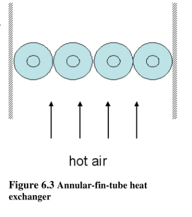

*图 6.3：环形翅片管换热器。*

### LMTD 解法

LMTD 法中，空气和水流股的速率方程与能量平衡可写为：

原式截图：[eq-example-6-1-lmtd-original.png](./assets/eq-example-6-1-lmtd-original.png)

$$
Q=
UA F
\left[
\frac{(T_{h,i}-T_{c,o})-(T_{h,o}-T_{c,i})}
{\log\left[(T_{h,i}-T_{c,o})/(T_{h,o}-T_{c,i})\right]}
\right]
\tag{6.1.example-a}
$$

$$
Q=m_c c_c(T_{c,o}-T_{c,i})
\tag{6.1.example-b}
$$

$$
Q=\rho_{a,i}A_{fr}V_{fr}c_a(T_{a,i}-T_{a,o})
\tag{6.1.example-c}
$$

对于给定几何、入口条件和已知物性，若假定 UA 可求，这三条方程仍有四个未知量：Th,o、Tc,o、Q 和 F。横流修正因子 F 依赖入口和出口温度。因此，用 LMTD 法求解需要迭代。较好的做法是先取 F = 1，求出 Th,o、Tc,o 和 Q，再用这些温度查取新的 F，并迭代到结果变化低于可接受容差。

原书按这一思路在 Table 6.2 中给出 LMTD 法所需方程组。表中列出了每个方程引入的未知量。所有物性都假定已知，但如果考虑物性随温度变化，物性求值本身也可能需要迭代。求解表中 22 个方程，得到 Q = 2430 W，Tc,o = 23.9 °C，Th,o = 773.2 °C。用这些温度图解查得 F 约为 1，因此原书不再继续迭代。

原书还指出，Rec = 6810，按此可能需要更精细的管侧传热关联式，例如 Gnielinski 关联式。但计算得到管侧热阻约为 3.1 × 10-1 K/W，而空气侧热阻约为 4.6 × 103 K/W；因此该换热器受空气侧控制，细化管侧模型没有必要。

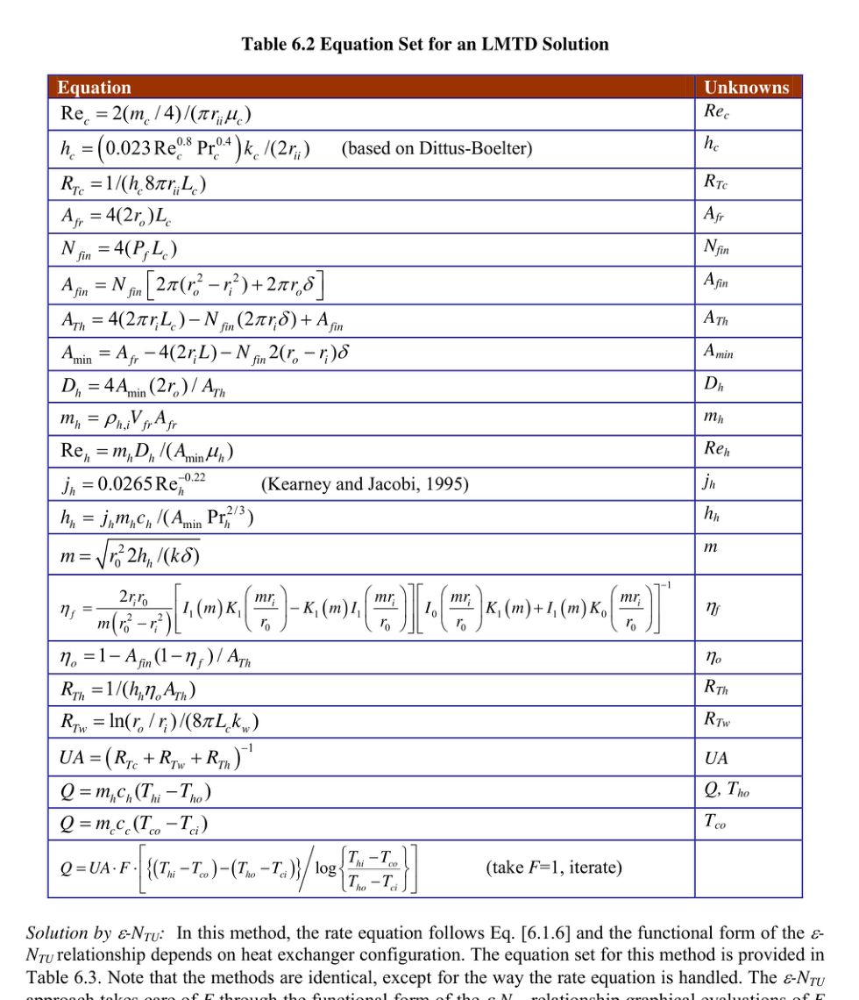

*表 6.2：LMTD 解法方程组。*

表 6.2 的方程组可转写为：

$$
\begin{aligned}
Re_c&=\frac{2(m_c/4)}{\pi r_i\mu_c} \\
h_c&=\frac{0.023Re_c^{0.8}Pr_c^{0.4}k_c}{2r_i} \\
R_{Tc}&=\frac{1}{h_c8\pi r_iL_c} \\
A_{fr}&=4(2r_o)L_c \\
N_{fin}&=4(P_fL_c) \\
A_{fin}&=N_{fin}\left[2\pi(r_o^2-r_i^2)+2\pi r_o\delta\right] \\
A_{Th}&=4(2\pi r_iL_c)-N_{fin}(2\pi r_i\delta)+A_{fin} \\
A_{\min}&=A_{fr}-4(2r_iL)-N_{fin}2(r_o-r_i)\delta \\
D_h&=\frac{4A_{\min}(2r_o)}{A_{Th}} \\
m_h&=\rho_{h,i}V_{fr}A_{fr} \\
Re_h&=\frac{m_hD_h}{A_{\min}\mu_h} \\
j_h&=0.0265Re_h^{-0.22} \\
h_h&=\frac{j_hm_hc_h}{A_{\min}Pr_h^{2/3}} \\
m&=\sqrt{\frac{r_o^2\,2h_h}{k\delta}}
\end{aligned}
$$

环形翅片效率与总热阻继续写为：

$$
\eta_f=
\frac{2r_ir_o}{m(r_o^2-r_i^2)}
\left[
I_1(m)K_1\left(\frac{mr_i}{r_o}\right)
-K_1(m)I_1\left(\frac{mr_i}{r_o}\right)
\right]
\left[
I_0\left(\frac{mr_i}{r_o}\right)K_1(m)
+I_1(m)K_0\left(\frac{mr_i}{r_o}\right)
\right]^{-1}
$$

$$
\begin{aligned}
\eta_o&=1-\frac{A_{fin}(1-\eta_f)}{A_{Th}} \\
R_{Th}&=\frac{1}{h_h\eta_oA_{Th}} \\
R_{Tw}&=\frac{\ln(r_o/r_i)}{8\pi L_ck_w} \\
UA&=(R_{Tc}+R_{Tw}+R_{Th})^{-1} \\
Q&=m_hc_h(T_{hi}-T_{ho}) \\
Q&=m_cc_c(T_{co}-T_{ci}) \\
Q&=UA\,F\,
\frac{(T_{hi}-T_{co})-(T_{ho}-T_{ci})}
{\log\left[(T_{hi}-T_{co})/(T_{ho}-T_{ci})\right]}
\end{aligned}
$$

最后一式先取 F = 1 迭代，再由出口温度回查横流修正因子。

### ε-NTU 解法

ε-NTU 法中，速率方程按式 (6.1.6) 书写，ε 与 NTU 的函数关系依赖换热器构型。原书在 Table 6.3 中给出该方法的方程组。注意，两种方法除了速率方程处理方式不同外，其余步骤相同。ε-NTU 方法通过 ε-NTU 函数关系处理了 F，因此不需要图解求 F，也不需要对 F 迭代。用 Table 6.3 的 24 条方程求得的结果与 LMTD 方法相同，这正是两种方法应该满足的结果。

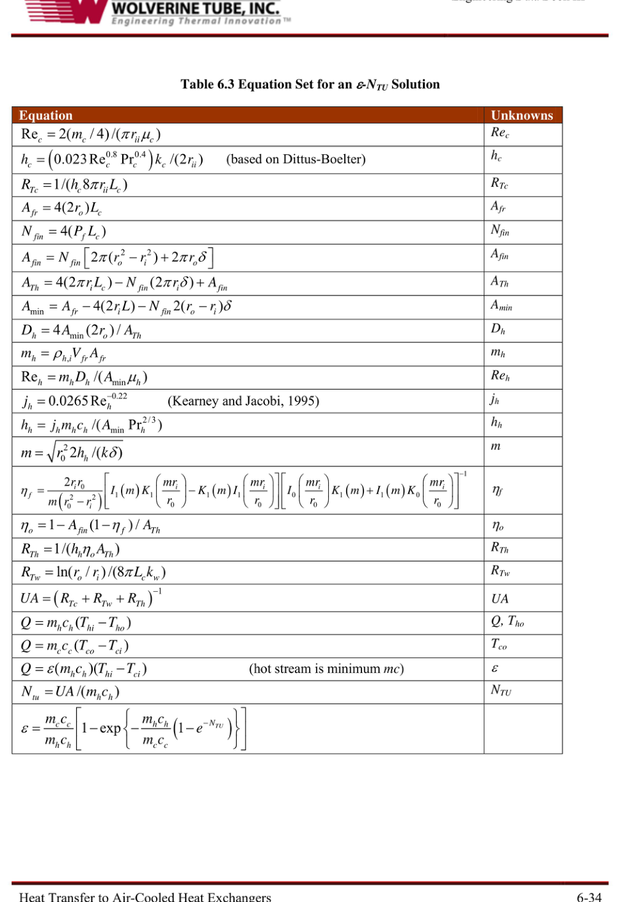

*表 6.3：ε-NTU 解法方程组。*

表 6.3 的几何、管侧、空气侧、翅片效率、热阻和 UA 方程与表 6.2 相同；差别在于用 ε-NTU 速率方程替代表 6.2 最后一条 LMTD 方程，并增加 NTU 与有效度关系：

$$
\begin{aligned}
Q&=m_hc_h(T_{hi}-T_{ho}) \\
Q&=m_cc_c(T_{co}-T_{ci}) \\
Q&=\varepsilon(m_hc_h)(T_{hi}-T_{ci}) \\
N_{tu}&=\frac{UA}{m_hc_h}
\end{aligned}
$$

在该例中热流体为最小热容率流体，原书采用的有效度关系为：

$$
\varepsilon=
\frac{m_cc_c}{m_hc_h}
\left[
1-\exp\left\{
-\frac{m_hc_h}{m_cc_c}
\left(1-e^{-N_{TU}}\right)
\right\}
\right]
$$

## 6.9 Nomenclature

## 6.9 符号说明

本节符号采用本章空气侧文献体系。下表按原书符号说明整理为中文，正式复算时仍应回看原页 [source-page-155.png](./assets/source-page-155.png) 和 [source-page-156.png](./assets/source-page-156.png)。

| 符号 | 中文说明 |
|---|---|
| A、B、C、D | 关联式常数 |
| Afin | 翅片相关传热面积 |
| Afr | 迎风面积，即入口面上游截面流通面积 |
| Amin | 最小截面流通面积，对应最大速度 |
| AT | 总传热面积 |
| Cr | 热容率比，(Wc)min/(Wc)max |
| cp | 比热 |
| Δp | 压降 |
| Dc | 管领外径；若无管领，则为管外径 |
| Dh | 空气侧水力直径，Dh = 4AminL/AT |
| Dm | 扁管短轴尺寸，见图 6.2 |
| F | 流动布置修正因子，见式 (6.1.5) |
| Fl | 翅片长度，见图 6.2 |
| Fp | 翅片间距，见图 6.2 |
| f | Fanning 摩擦因子，见式 (6.1.13) |
| G | 最小流通截面处质量通量，G = W/Amin |
| h | 传热系数；在错列条翅片中也表示条翅片高度 |
| Δilm,cf | 逆流对数平均焓差，见式 (6.1.11) |
| i | 焓 |
| j | Colburn j 因子，j = Nu/(RePr1/3) |
| Kc | 收缩压降系数，见式 (6.1.13) |
| Ke | 扩张压降系数，见式 (6.1.13) |
| k | 导热系数 |
| l | 错列条翅片中条片长度，见图 6.2 |
| L | 空气侧流动深度，即从入口面到出口面的距离 |
| Lp | 百叶间距，见图 6.2 |
| Ll | 百叶长度，见图 6.2 |
| N | 沿空气流动方向的管排数 |
| NTU | 传热单元数，NTU = UA/(Wc)min |
| Nu | Nusselt 数，Nu = hDh/k |
| P | 风机功率 |
| Pd | 沿空气流动方向的管中心距，见图 6.2 |
| Ph | 波纹翅片波幅，见图 6.2 |
| Pt | 横向管中心距，见图 6.2 |
| Pr | Prandtl 数，Pr = cpμ/k |
| Q | 传热率 |
| Qmax | 最大可能传热率，Qmax = (Wc)minΔTmax |
| R | 传热热阻 |
| Re | Reynolds 数，可用下标表示不同特征尺度 |
| s | 错列条翅片中条片间距，见图 6.2 |
| ΔTlm,cf | 逆流对数平均温差，见式 (6.1.5) |
| ΔTmax | 热流体入口温度减冷流体入口温度 |
| T | 温度 |
| Td | 扁管长轴尺寸，见图 6.2 |
| t | 错列条翅片中条片厚度，见图 6.2 |
| UA | 总传热导度 |
| W | 质量流量 |
| Xf | 波纹翅片半波长，见图 6.2 |

希腊字母：

| 符号 | 中文说明 |
|---|---|
| α | 错列条翅片几何参数，α = s/h |
| δ | 错列条翅片几何参数，δ = t/l；也可表示翅片厚度 |
| δf | 翅片厚度，见图 6.2 |
| ε | 换热器有效度，ε = Q/Qmax |
| ηf | 翅片效率，取决于几何 |
| ηo | 总表面效率，ηo = 1 - (Afin/AT)(1 - ηf) |
| γ | 错列条翅片几何参数，γ = t/s |
| μ | 动力黏度 |
| ρ | 密度 |
| σ | 收缩比，Amin/Afr |

下标：

| 下标 | 中文说明 |
|---|---|
| a | 空气或空气侧 |
| contact | 接触热阻相关 |
| f | 翅片 |
| foul | 污垢热阻相关 |
| i | 入口 |
| Lp | 以百叶间距为基准 |
| max | 最大 |
| min | 最小 |
| o | 出口或总体 |
| r | 比值 |
| T | 管或总传热面积语境 |
| t | 管侧 |
| wall | 壁面导热热阻相关 |
| overbar | 平均值 |

## 6.10 References

## 6.10 参考文献

本章参考文献跨 PDF 157-160 页，当前保留原页截图，不逐条翻译。后续出版级校对若需要统一文献格式，应从以下原页开始整理：

- [source-page-157.png](./assets/source-page-157.png)
- [source-page-158.png](./assets/source-page-158.png)
- [source-page-159.png](./assets/source-page-159.png)
- [source-page-160.png](./assets/source-page-160.png)
