# Chapter 8 Condensation Inside Tubes

# 第 8 章 管内冷凝

## 来源追踪

| 项目 | 内容 |
|---|---|
| 原书 | Engineering Data Book III |
| 章节 | Chapter 8 |
| PDF 页码 | 213-239 |
| 书内页码 | 8-1 到 8-27 |
| 进度记录 | [progress.md](./progress.md) |

完整源页截图保留在 `assets/source-page-213.png` 到 `assets/source-page-239.png`，用于逐页二校和公式复核。正文只展示局部图表资产，避免整页原文图打断阅读。

## 摘要

本章回顾水平管内冷凝的基本原理。流型和流动分层对局部冷凝传热系数预测非常重要。除光管内冷凝外，本章还讨论微翅片管内冷凝、[非共沸混合物](../../../glossary/terms.md#term-zeotropic-mixture)冷凝、过热蒸汽冷却过程中的冷凝，以及冷凝液过冷。

## 8.1 Condensation inside Horizontal Tubes

## 8.1 水平管内冷凝

本章讨论管内冷凝，目前只回顾水平管内冷凝。讨论对象包括纯蒸汽，也包括可凝混合物。

水平管内冷凝可能是部分冷凝，也可能是完全冷凝。按具体应用，入口蒸汽可能处于过热状态，也可能干度等于 1.0 或低于 1.0。因此，冷凝过程路径可能先经历干壁去过热区，再经历湿壁去过热区，随后进入饱和冷凝区，最后进入液体过冷区。冷凝传热系数强烈依赖局部[干度](../../../glossary/terms.md#term-quality)，干度升高时通常增大；它也强烈依赖质量通量，质量通量升高时通常增大。与外表面冷凝相反，在多数操作条件下，管内冷凝对壁温差 Tsat - Tw 不敏感，低质量流率工况除外。

### 8.1.1 Flow Regimes for Condensation in Horizontal Tubes

### 8.1.1 水平管内冷凝流型

Palen、Breber 和 Taborek（1979）的图 8.1 给出了水平管内冷凝的典型两相流型。在高质量通量下，流动通常处于[环状流](../../../glossary/terms.md#term-annular-flow)：液膜沿管壁周向分布，蒸汽位于中心核心区，液膜界面波尖端会把部分液体夹带进蒸汽核心。

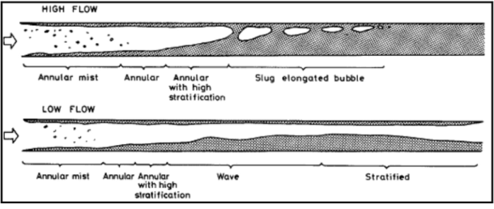

随着冷凝沿管长推进，蒸汽速度下降，界面上的[蒸汽剪切](../../../glossary/terms.md#term-vapor-shear)随之降低，液膜在管底逐渐比管顶更厚。新生成的冷凝液继续增加液膜厚度；随着液体量沿管长增大，流型会进入[弹状流](../../../glossary/terms.md#term-slug-flow)，再往后蒸汽最终全部转化为液体。

低流量下，图 8.1 下部所示的入口区域可先形成环状流，但很快转为间歇流，表现为大振幅波冲刷管顶；也可能转为[分层波状流](../../../glossary/terms.md#term-stratified-wavy-flow)，其波幅较小。如果液体没有跨越整个管截面，蒸汽可能在尚未冷凝完的情况下到达管末端。

这些流型与绝热两相流的流型非常相似。不过在冷凝中，即使整体流型接近[分层流](../../../glossary/terms.md#term-stratified-flow)，冷凝液也会在整个管周上形成。图 8.2 所示的完全分层流，在绝热流中液体通常全部位于管下部；而冷凝流中，管上部周向仍会有一层薄冷凝液膜。

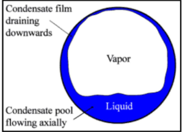

### 8.1.2 Condensation of Pure Vapor in a Horizontal Tube

### 8.1.2 水平管内纯蒸汽冷凝

如图 8.3 所示，在低流量下流动为分层流。由膜状冷凝形成的冷凝液膜在重力作用下从管顶向管底排液。当蒸汽核心速度较低时，液膜流动为层流，且主要沿向下方向运动。如果[蒸汽剪切](../../../glossary/terms.md#term-vapor-shear)足够大并超过湍流起始条件，则会形成湍流液膜，其主导流动方向变为轴向。

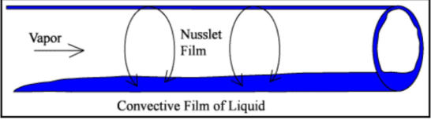

在低蒸汽剪切条件下，管内上部和侧部周向的冷凝过程与水平管外表面冷凝很相似。因此，可把 Nusselt 降膜分析用于管内上部区域。Chaddock（1957）首先采用这一思路，随后 Chato（1962）也采用了该方法。底部的分层液体层截面积可由局部[空隙率](../../../glossary/terms.md#term-void-fraction) ε 确定，再由几何关系确定分层液体角 θstrat。在干度 x 处，局部传热系数按各区域占据周向比例加权：

$$
\alpha(x)
=
\frac{\theta_{strat}}{\pi}\alpha_f
+
\frac{\pi-\theta_{strat}}{\pi}\alpha_{strat}
\tag{8.1.1}
$$

其中 θstrat 是从管顶到分层液体层的角度；当没有分层液层时，它等于 π。θstrat 以弧度表示。αf 是由式（7.5.11）从 0 到 (π - θstrat)/2 积分得到的膜平均传热系数；αstrat 是管底分层流区域的传热系数。若假定 αstrat 与 αf 相比可忽略，则第二项可忽略，αf 可按下式确定：

$$
\alpha_f
=
\Omega
\left[
\frac{\rho_L(\rho_L-\rho_G)g k_L^3 h_{LG}}
{\mu_L d_i (T_{sat}-T_w)}
\right]^{1/4}
\tag{8.1.2}
$$

Ω 是 θstrat 的几何函数，其中 Ω = βθstrat/π，kL 是液体导热系数。Jaster 和 Kosky（1976）表明，Ω 与蒸汽空隙率 ε 近似满足 Ω = 0.728ε。他们使用 Zivi（1964）空隙率方程，该方程是干度 x 以及汽、液密度的函数：

$$
\varepsilon
=
\frac{1}
{1+\left[\left(1-x\right)/x\right]\left(\rho_G/\rho_L\right)^{2/3}}
\tag{8.1.3}
$$

在更高流量、面对湍流环状流条件时，已有许多关联式被提出，例如 Akers、Deans 和 Crosser（1959），Cavallini 和 Zecchin（1974），Shah（1979）等。Akers、Deans 和 Crosser 以若干制冷剂和有机流体数据库为基础，把 Dittus-Boelter（1930）单相湍流管流关联式改写为等效两相 Reynolds 数形式。他们的局部冷凝系数为：

$$
\frac{\alpha(x)d_i}{k_L}
=
C Re_e^n Pr_L^{1/3}
\tag{8.1.4}
$$

两相流等效 Reynolds 数 Ree 由等效质量通量确定。该等效质量通量通过给总质量通量乘以一个倍率得到：

$$
\dot m_e
=
\dot m
\left[
(1-x)+x\left(\frac{\rho_L}{\rho_G}\right)^{1/2}
\right]
\tag{8.1.5}
$$

总质量通量使用液体和蒸汽总质量流率。式（8.1.4）中的经验参数 C 和 n 为：

| 条件 | C | n |
|---|---:|---:|
| Ree > 50,000 | 0.0265 | 0.8 |
| Ree < 50,000 | 5.03 | 1/3 |

Shah（1979）以 Dittus-Boelter 关联式为起点，提出了另一种乘子形式。该乘子（方括号内）作用在液相 Reynolds 数上：

$$
\frac{\alpha(x)d_i}{k_L}
=
0.023 Re_L^{0.8} Pr_L^{0.4}
\left[
(1-x)^{0.8}
+
\frac{3.8x^{0.76}(1-x)^{0.04}}{p_r^{0.38}}
\right]
\tag{8.1.6}
$$

Shah 使用约化压力 pr，其中 pr = psat/pcrit，psat 是饱和压力，pcrit 是流体临界压力，而不是使用密度比。他的数据库包括蒸汽、制冷剂和有机流体冷凝数据。ReL 是按液体流动性质计算的管内液相 Reynolds 数，但质量流率取液体加蒸汽的总质量流率。

Thome（1994b，1998）基于 R-134a、R-22 等文献局部测试数据的比较，建议当质量通量大于 200 kg/m2s 时采用 Shah 关联式；当质量通量低于该值时采用 Akers、Deans 和 Crosser（1959）关联式。

Dobson 和 Chato（1998）对 Chato（1962）方法作了大幅改进。其方法同时包括分层波状流方法，即从管顶向管底的膜状冷凝，以及一个环状流关联式。他们的环状流冷凝关联式为：

$$
Nu(x)
=
0.023 Re_{Ls}^{0.8}Pr_L^{0.4}
\left[
1+\frac{2.22}{X_{tt}^{0.89}}
\right]
\tag{8.1.7}
$$

其中局部 Nusselt 数 Nu(x) 以管内径 di 为基准：

$$
Nu(x)=\frac{\alpha(x)d_i}{k_L}
\tag{8.1.8}
$$

表观液相 Reynolds 数 ReLs 为：

$$
Re_{Ls}
=
\frac{\dot m d_i(1-x)}{\mu_L}
\tag{8.1.9}
$$

两相均为湍流时的 Martinelli 参数 Xtt 为：

$$
X_{tt}
=
\left(\frac{1-x}{x}\right)^{0.9}
\left(\frac{\rho_G}{\rho_L}\right)^{0.5}
\left(\frac{\mu_L}{\mu_G}\right)^{0.1}
\tag{8.1.10}
$$

为实施分层波状流方法，先用式（8.1.3）的 Zivi 空隙率计算 ε。假定全部液体都分层在管底，即忽略管壁上冷凝形成的液膜，则从管顶到管底分层液层的角度 θstrat 为：

$$
1-\frac{\theta_{strat}}{\pi}
\simeq
\frac{\arccos(2\varepsilon-1)}{\pi}
\tag{8.1.11}
$$

分层波状流传热系数由两部分按周向加权得到：左项为管顶周向的膜状冷凝系数，右项为分层周向上的强制对流传热系数：

$$
Nu(x)
=
\frac{0.23 Re_{G0}^{0.12}}
{1+1.11X_{tt}^{0.58}}
\left[
\frac{Ga_L Pr_L}{Ja_L}
\right]^{0.25}
+
\left(1-\frac{\theta_{strat}}{\pi}\right)Nu_{strat}
\tag{8.1.12}
$$

分层液体中的强制对流冷凝关联式为：

$$
Nu_{strat}
=
0.0195 Re_{Ls}^{0.8}Pr_L^{0.4}
\left(
1.376+\frac{c_1}{X_{tt}^{c_2}}
\right)^{1/2}
\tag{8.1.13}
$$

其中 1.376 使该表达式在 x = 0 时与 Dittus-Boelter 关联式一致。管内液相 Galileo 数 GaL 为：

$$
Ga_L
=
\frac{g\rho_L(\rho_L-\rho_G)d_i^3}{\mu_L^2}
\tag{8.1.14}
$$

仅以蒸汽计的 Reynolds 数 ReG0 为：

$$
Re_{G0}
=
\frac{\dot m d_i}{\mu_G}
\tag{8.1.15}
$$

液相 Jakob 数 JaL 按式（7.5.12）定义：

$$
Ja_L
=
\frac{c_{pL}(T_{sat}-T_w)}{h_{LG}}
\tag{8.1.16}
$$

液相 Froude 数 FrL 为：

$$
Fr_L
=
\frac{\dot m^2}{\rho_L^2 g d_i}
\tag{8.1.17}
$$

经验常数 c1 和 c2 按 FrL 取值：

当 0 < FrL ≤ 0.7 时：

$$
c_1=4.172+5.48Fr_L-1.564Fr_L^2
\tag{8.1.18a}
$$

$$
c_2=1.773-0.169Fr_L
\tag{8.1.18b}
$$

当 FrL > 0.7 时：

$$
c_1=7.242
\tag{8.1.19a}
$$

$$
c_2=1.655
\tag{8.1.19b}
$$

Dobson 和 Chato 用 Soliman（1982）转变准则预测环状流向分层波状流的转变，以判断应采用哪一种传热模式。Soliman 方法基于 Froude 转变数 Frso。当 ReLs ≤ 1250 时：

$$
Fr_{so}
=
0.025 Re_{Ls}^{1.59}
\left(
\frac{1+1.09X_{tt}^{0.039}}{X_{tt}}
\right)^{1.5}
\frac{1}{Ga_L^{0.5}}
\tag{8.1.20}
$$

当 ReLs > 1250 时：

$$
Fr_{so}
=
1.26 Re_{Ls}^{1.04}
\left(
\frac{1+1.09X_{tt}^{0.039}}{X_{tt}}
\right)^{1.5}
\frac{1}{Ga_L^{0.5}}
\tag{8.1.21}
$$

Soliman 把环状流到波状流的转变设在 Frso = 7。Dobson 和 Chato 发现 Frso = 20 更能拟合他们的传热数据，因此采用 20。其方法实施如下：

1. 当质量通量大于 500 kg/m2s 时，始终使用环状流关联式。
2. 当质量通量小于 500 kg/m2s 且 Frso > 20 时，使用环状流关联式。
3. 当质量通量小于 500 kg/m2s 且 Frso < 20 时，使用分层波状流关联式。

该方法在传热系数从环状流转向分层波状流时并不平滑，而是给出显著阶跃，这种阶跃实验中并未观察到。除此以外，Cavallini 等（1995）将其与独立测试数据比较后认为，该方法似乎是当时最准确的设计方法。工程实现时，可暂时用简单线性加权消除不连续：例如在 Frso = 7 处采用分层波状流关联式的计算值，在 Frso = 20 处采用环状流关联式的计算值，中间按 Frso 线性插值。

Tang（1997）也提出了一个简单关联式，它是 Shah（1979）方法的扩展，覆盖约化压力 0.2 到 0.53、质量通量 300 到 810 kg/m2s。该式只适用于环状流：

$$
\frac{\alpha(x)d_i}{k_L}
=
0.023 Re_L^{0.8}Pr_L^{0.4}
\left[
1+4.863
\left(
\frac{-x\ln p_r}{1-x}
\right)^{0.836}
\right]
\tag{8.1.22}
$$

Cavallini 等（2001）报告了 8 mm 管内冷凝局部测试数据，压力范围为 0.246 到 3.15 MPa，即 35.7 到 456.8 psia，流体包括 R-134a、R-125、R-32、R-410A 和 R-236ea 五种。他们覆盖质量通量 100 到 750 kg/m2s、干度 0.15 到 0.85，测试属于准局部型测试。

### Thome-El Hajal-Cavallini 模型

El Hajal、Thome 和 Cavallini（2003）提出了一个基于局部流型和界面波效应的现象学冷凝模型，用于光管内冷凝，覆盖非常宽的参数范围：质量通量 16 到 1532 kg/m2s，管内径 3.14 到 21.4 mm，约化压力 0.02 到 0.8，干度 0.03 到 0.97。该方法使用第 12 章介绍的 El Hajal、Thome 和 Cavallini（2003）冷凝流型图预测局部流型。

截至原书写作时，该方法已在传热和流型方面与二十种流体比较：ammonia、R-11、R-12、R-22、R-32、R-113、R-123、R-125、R-134a、R-236ea、R-32/R-125 近共沸混合物、R-402A、R-404A、R-407C、R-410A、R-502、propane、n-butane、iso-butane 和 propylene。原作者表明，该模型不仅统计精度较好，即来自九个实验室、十一种原始制冷剂、共 1850 个数据点中约 85% 可预测在 ±20% 内，而且能较好跟随数据库中关于干度、管径、质量通量、约化压力、空隙率等变量的趋势。下面给出该模型的细节。

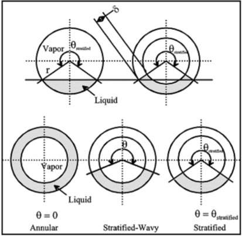

#### 简化流动结构

Kattan、Thome 和 Favrat（1998c）曾为水平管内蒸发假定同样的简化流动结构；在此被用于冷凝，差别在于分层型冷凝流中，管上部周向由于膜状冷凝而被润湿，而蒸发中该区域可为干壁。Thome-El Hajal-Cavallini 冷凝模型用三种简化几何描述环状流、分层波状流和完全分层流。

对环状流，模型假定均匀液膜厚度 δ，并忽略重力影响。对完全分层流，实际分层几何被转换为等效几何：分层角和液相占据截面积保持相同，但液体以均匀厚度 δ 的截断环形液膜分布。对分层波状流，界面波较小且不到达管顶，因此若没有冷凝，管上部周向会保持干燥；模型同样假定分层液体形成截断环形液膜。于是 θ 从完全分层流阈值处的最大值 θstrat，连续变化到环状流阈值处的最小值 0。重要的是，这三种简化几何在流型结构之间提供了平滑几何转变。

#### 传热模型

参照图 8.5，分层型流动中，周向 (2π - θ) 对应的分层液膜区域采用对流传热，周向 θ 对应的管上部区域采用膜状冷凝；该处冷凝液向下流入底部分层液体。对环状流，整个管周发生对流冷凝传热，不发生上部降膜冷凝。原作者进一步发现，环状流模型也适用于间歇流和有限的雾状流数据。因此，为保持模型简单，环状流传热模型同时用于间歇流和[雾状流](../../../glossary/terms.md#term-mist-flow)。文献中未找到气泡流传热数据，因此未提出气泡流传热模型；而气泡流通常也不属于常见设计条件。

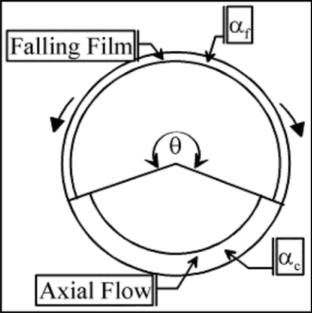

Dobson 和 Chato（1998）等早期模型已经包含上述两类机制；而把 Nusselt（1916）膜状冷凝模型用于水平管分层流上部周向，最早由 Chato（1962）提出。在 Thome-El Hajal-Cavallini 模型中，这两种机制作用在图 8.5 所示的各自传热面积上。对流冷凝传热系数 αc 用于被轴向液膜流润湿的周向：在环状流、间歇流和雾状流中是整个周向，在分层波状流和完全分层流中仅是下部周向。轴向液膜流假定为湍流。膜状冷凝传热系数 αf 用于分层波状流和完全分层流中本来会干燥、但因冷凝而被润湿的上部周向。αf 用 Nusselt（1916）降膜理论得到，该理论假设降膜为层流；对本章涉及的管径而言，这基本总是成立。模型忽略蒸汽剪切对该降膜的影响。分层型流动的传热系数在实验上与壁温差有关，而环状流传热系数则不明显依赖壁温差；该影响通过 Nusselt 降膜方程纳入。

局部周向平均冷凝传热系数 α(x) 的一般表达为：

$$
\alpha(x)
=
\frac{\alpha_f\theta+(2\pi-\theta)\alpha_c}{2\pi}
\tag{8.1.23}
$$

式中 θ 是管顶周向的降膜角。因此，对于 θ = 0 的环状流、间歇流和雾状流，α(x) = αc。分层角 θstrat 由以下隐式几何方程计算：

$$
A_L
=
\frac{d_i^2}{8}
\left[
(2\pi-\theta_{strat})-\sin(2\pi-\theta_{strat})
\right]
\tag{8.1.24}
$$

液相占据的截面积 AL 为：

$$
A_L=(1-\varepsilon)A
\tag{8.1.25}
$$

汽相占据的截面积 AG 为：

$$
A_G=\varepsilon A=1-A_L
\tag{8.1.26}
$$

其中 A 是管总截面积，ε 是局部截面空隙率。为覆盖从低约化压力到高约化压力的范围，ε 用 Steiner（1993）版本的 Rouhani 漂移流模型和均相模型构造的对数平均空隙率计算；Rouhani 模型见第 17 章。对数平均空隙率定义为：

$$
\varepsilon
=
\frac{\varepsilon_H-\varepsilon_r}
{\ln(\varepsilon_H/\varepsilon_r)}
\tag{8.1.27}
$$

均相空隙率 εH 为：

$$
\varepsilon_H
=
\frac{1}
{1+\left(\frac{1-x}{x}\right)\frac{\rho_G}{\rho_L}}
\tag{8.1.28}
$$

Steiner（1993）给出的水平管 Rouhani 空隙率 εr 为：

$$
\varepsilon_r
=
\frac{x}{\rho_G}
\left(
\left[1+0.12(1-x)\right]
\left[
\frac{x}{\rho_G}+\frac{1-x}{\rho_L}
\right]
+
\frac{1.18(1-x)\left[g\sigma(\rho_L-\rho_G)\right]^{0.25}}
{\dot m\rho_L^{0.5}}
\right)^{-1}
\tag{8.1.29}
$$

对环状流、间歇流和雾状流，θ = 0。对完全分层流，θ = θstrat。对分层波状流，θ 通过二次插值确定：在分层波状流向完全分层流转变处，θ 取最大值 θstrat；在分层波状流向环状流或间歇流转变处，θ 取 0：

$$
\theta
=
\theta_{strat}
\left[
\frac{\dot m_{wavy}-\dot m}
{\dot m_{wavy}-\dot m_{strat}}
\right]^{0.5}
\tag{8.1.30}
$$

相关转变值在同一干度下由第 12 章中 El Hajal、Thome 和 Cavallini（2003）冷凝流型图的各转变方程确定。为了避免用式（8.1.24）迭代求解 θstrat，可采用 Biberg（1999）给出的近似显式表达，并使用式（8.1.27）得到的 ε：

$$
\begin{aligned}
\theta_{strat}
&=
2\pi
-2
\Bigg\{
\pi(1-\varepsilon)
+
\left(\frac{3\pi}{2}\right)^{1/3}
\left[
1-2(1-\varepsilon)+(1-\varepsilon)^{1/3}-\varepsilon^{1/3}
\right]
\\
&\quad
-
\frac{1}{200}
(1-\varepsilon)\varepsilon
\left[1-2(1-\varepsilon)\right]
\left[1+4\left((1-\varepsilon)^2+\varepsilon^2\right)\right]
\Bigg\}
\end{aligned}
\tag{8.1.31}
$$

环状液膜中的对流冷凝传热系数 αc 由以下湍流液膜关联式得到：

$$
\alpha_c
=
c Re_L^n Pr_L^m
\frac{k_L}{\delta}f_i
\tag{8.1.32}
$$

液膜 Reynolds 数 ReL 以液体通过 AL 的平均速度为基准：

$$
Re_L
=
\frac{4\dot m(1-x)\delta}{(1-\varepsilon)\mu_L}
\tag{8.1.33}
$$

液相 Prandtl 数 PrL 定义为：

$$
Pr_L
=
\frac{c_{pL}\mu_L}{k_L}
\tag{8.1.34}
$$

经验常数 c、n 和 m 由传热数据库确定，δ 是液膜厚度。m 的最佳值为 0.5，也就是 Labuntsov（1957）在竖直板湍流降膜冷凝中得到的数值，大于 Dittus 和 Boelter（1930）单相管流关联式中的 0.4。由环状流冷凝数据库统计得到的最佳 c 和 n 分别为 c = 0.003、n = 0.74。

液膜厚度 δ 由以下几何方程求解：

$$
A_L
=
\frac{(2\pi-\theta)}{8}
\left[
d_i^2-(d_i-2\delta)^2
\right]
\tag{8.1.35}
$$

其中 di 是管内径。若在低干度的分层波状流或完全分层流中，液体占据超过一半管截面，即 ε < 0.5，则该表达式会给出 δ > di/2，这在几何上不现实。因此，在原方法中，只要 δ > di/2，就把 δ 设为 di/2。

#### 界面粗糙度修正

该管内冷凝模型把液膜流的界面粗糙度识别为影响传热的新参数，原因包括两点：第一，高速蒸汽核心的剪切通过界面传递给液膜，从而增加界面波的数量和幅值，增加可用于冷凝的表面积，提高传热；第二，界面波并非正弦波，往往会降低平均液膜厚度，同样提高传热。这两点类似于 Kutateladze（1963）在竖直板 Nusselt 膜状冷凝界面涟波中采用的强化修正因子。界面粗糙度和波的形成也与液滴夹带进入蒸汽核心直接相关，液滴夹带会降低液膜厚度并提高传热。此外，界面剪切还会在液膜中产生涡旋，从而提高传热。

界面粗糙度与界面剪切 τi 成正比，而 τi 取决于两相速度差 uG - uL。uG 和 uL 是由空隙率确定的汽相、液相在各自截面积 AG 和 AL 中的平均速度：

$$
u_L
=
\frac{\dot m(1-x)}{\rho_L(1-\varepsilon)}
\tag{8.1.36}
$$

$$
u_G
=
\frac{\dot m x}{\rho_G\varepsilon}
\tag{8.1.37}
$$

通常 uG 远大于 uL，因此 uG - uL 近似为 uG。用液相速度归一化蒸汽速度得到空隙率模型中常见的滑移比 uG/uL，界面剪切因而与 uG/uL 成比例。于是模型假定界面粗糙度 Δδ 与 (uG/uL)p 成比例，指数 p 由数据确定。界面波波长应与管顶无支撑液膜的一维 Taylor 不稳定波长 λT 相关，后者由下式计算：

$$
\lambda_T
\left[
\frac{(\rho_L-\rho_G)g}{\sigma}
\right]^{1/2}
=
2\pi\sqrt{3}
\tag{8.1.38}
$$

若假定界面波的特征波长可相对于液膜厚度进行尺度化，则用 δ 代替 λT，界面粗糙度 Δδ 可写成：

$$
\Delta\delta
\propto
\left[
\frac{(\rho_L-\rho_G)g\delta^2}{\sigma}
\right]^r
\tag{8.1.39}
$$

式中方括号内为无量纲项，r 是待定指数。式（8.1.32）中的界面粗糙度修正因子 fi 作用在 αc 上，用来纳入蒸汽剪切和界面不稳定性对波形成的影响。根据测试数据把 p 和 r 调整到名义值 1/2 和 1/4，且不引入额外经验常数后，除完全分层流以外所有流型的 fi 为：

$$
f_i
=
1+
\left(\frac{u_G}{u_L}\right)^{1/2}
\left(
\frac{(\rho_L-\rho_G)g\delta^2}{\sigma}
\right)^{1/4}
\tag{8.1.40}
$$

当液膜变得很薄时，fi 趋向 1；这在物理上合理，因为粗糙度必须与液膜厚度相关。fi 随滑移比 uG/uL 增大而增大，也随表面张力 σ 增大而减小，因为表面张力会抑制波动。对完全分层流，界面波逐渐衰减，因此上式变为：

$$
f_i
=
1+
\left(\frac{u_G}{u_L}\right)^{1/2}
\left(
\frac{(\rho_L-\rho_G)g\delta^2}{\sigma}
\right)^{1/4}
\left(
\frac{\dot m}{\dot m_{strat}}
\right)
\quad
\text{for }\dot m<\dot m_{strat}
\tag{8.1.41}
$$

这种处理使 α(x) 在分层流转变边界上也能像其他转变边界一样平滑变化。

膜状冷凝传热系数 αf 来自 Nusselt（1916）层流降膜冷凝理论，见第 7 章，并在此应用于管内周向。理论上更严格的做法是从管顶积分到分层液层来得到 αf；但原作者发现，使用从管顶到管底整周冷凝的平均值即可，其解析值为 0.728。因此：

$$
\alpha_f
=
0.728
\left[
\frac{\rho_L(\rho_L-\rho_G)g h_{LG}k_L^3}
{\mu_L d_i(T_{sat}-T_w)}
\right]^{1/4}
\tag{8.1.42}
$$

上式也可改写为热流密度形式：

$$
\alpha_f
=
0.655
\left[
\frac{\rho_L(\rho_L-\rho_G)g h_{LG}k_L^3}
{\mu_L d_i q}
\right]^{1/3}
\tag{8.1.43}
$$

其中前置常数 0.655 来自 0.7284/3。

上述传热方法不能在 ε = 1.0 时计算，因为会发生除零。因此，当 x > 0.99 时，将 x 重置为 0.99。适用下限为 x ≥ 0.01；测试数据范围为 0.97 > x > 0.03。

#### 实施步骤

Thome-El Hajal-Cavallini 基于流型的管内冷凝传热模型按以下步骤实施：

1. 用式（8.1.27）确定局部蒸汽空隙率。
2. 在相同干度 x 下，用流型图和必要的转变速度确定局部流型。
3. 识别流型类型：环状流、间歇流、雾状流、分层波状流或分层流。
4. 若为环状流、间歇流或雾状流，则 θ = 0，用式（8.1.32）确定 αc，并在式（8.1.23）中取 α(x) = αc；其中 δ 由式（8.1.35）求解，fi 由式（8.1.40）求得。
5. 若为分层波状流，则用式（8.1.31）和式（8.1.30）计算 θstrat 和 θ，再用式（8.1.32）以及式（8.1.42）或式（8.1.43）计算 αc 和 αf，最后用式（8.1.23）确定 α(x)；其中 δ 由式（8.1.35）求解，fi 由式（8.1.40）求得。
6. 若为完全分层流，则由式（8.1.31）得到 θstrat，并令 θ = θstrat，再用式（8.1.32）以及式（8.1.42）或式（8.1.43）计算 αc 和 αf，用式（8.1.23）确定 α(x)；其中 δ 由式（8.1.35）求解，fi 由式（8.1.41）求得。

#### 与制冷剂数据库比较

新模型主要使用 Cavallini 等（1999，2001）的传热数据库开发，随后用另外八项独立研究确定其一般适用性。图 8.6 给出了新模型与 Cavallini 数据的比较；图 8.7 给出了与全部 1850 个数据点的比较，但排除了低质量通量下趋势不现实的实验烃类数据。约 85% 数据可预测在 ±20% 以内。

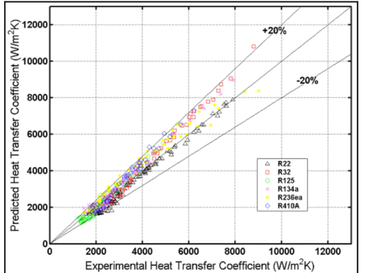

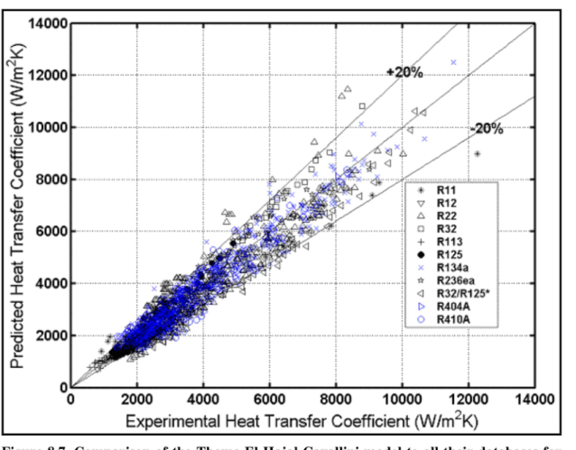

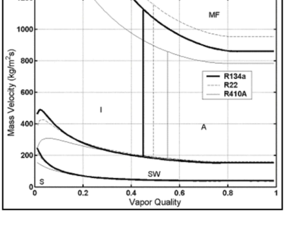

#### R-410A 模拟结果

该传热模型和流型图被用于模拟 R-410A 在 8 mm 管内、40 °C 饱和温度下的冷凝。图 8.8 显示了包括 R-410A 在内的三种制冷剂在这些条件下的流型图。为简化绘图，图 8.8 用固定质量通量 300 kg/m2s 计算空隙率；但在实际应用模型时，所有计算均使用真实质量通量。

图 8.9 给出热流密度 q = 40 kW/m2 时不同质量通量下的传热系数。质量通量为 30 kg/m2s 时，流动从入口到出口都处于分层流 S 区，传热系数随干度降低而缓慢下降。质量通量为 200 kg/m2s 时，流动从环状流 A 进入，随后经过间歇流 I 和分层波状流 SW。质量通量为 500 kg/m2s 时，流动从环状流进入，转为间歇流，并以间歇流离开。高干度下 α(x) 随 x 降低而迅速下降，是环状液膜厚度 δ 快速增长造成的。质量通量为 800 kg/m2s 时，流动从雾状流 MF 进入，进入环状流 A，最终以间歇流 I 离开。

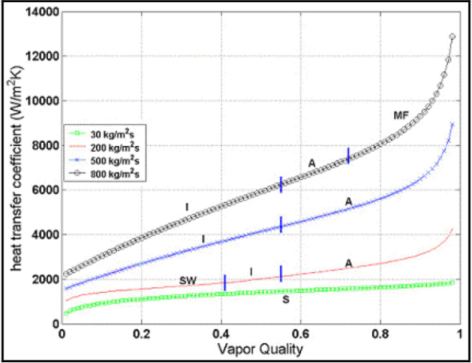

新模型能在流型转变边界上预测局部传热系数的连续变化，而不会使 α(x) 出现不连续。这正是 Dobson 和 Chato（1998）方法以及近期 Cavallini 等（2002）方法在进入其 slug 流区时存在的问题。

图 8.10 给出了质量通量 200 kg/m2s 时、热流密度 10 和 40 kW/m2 下的类似模拟，其中较低热流密度更接近典型设计条件。流动从环状流进入，转为间歇流，最后在约 x = 0.41 处变为分层波状流。在分层波状流区，管上部周向开始出现膜状冷凝传热机制，热流密度影响非常明显：较低热流密度形成更薄的冷凝液膜，因此传热系数更大。

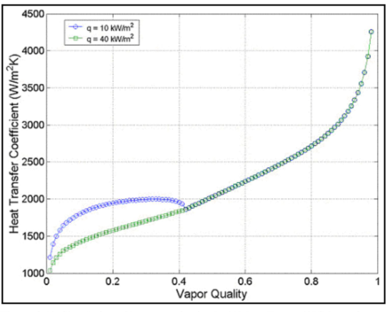

## 8.2 Condensation in Horizontal Microfin Tubes

## 8.2 水平微翅片管内冷凝

Shizuya、Itoh 和 Hijikata（1995）对 R-22、R-142b、R-114 和 R-123 在微翅片管与光管中的冷凝进行了广泛对比研究。他们的[微翅片管](../../../glossary/terms.md#term-microfin-tube)有 55 条翅片，螺旋角 14°，翅高 0.19 mm，内部面积为等效光管的 1.6 倍。微翅片管内径为 6.26 mm，光管内径为 6.16 mm。图 8.11 给出了他们的比较，同时标注了测试中观察到的流型。强化幅度在波状-弹状流中通常高于环状流。

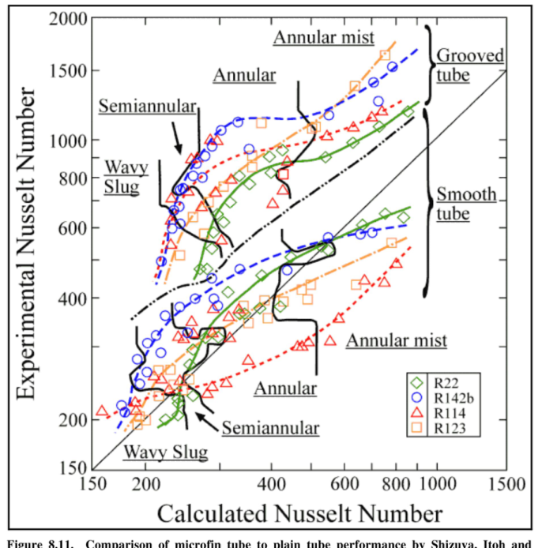

Muzzio、Niro 和 Arosio（1998）测量了光管、交替翅高微翅片管 VA、常规微翅片管 V 以及螺纹轮廓微翅片管 W 中的管内冷凝系数。他们的 R-22 结果见图 8.12。与微翅片冷凝测试的常见规律一致，低质量通量下传热强化幅度最高；质量通量升高时，强化比趋向面积比。

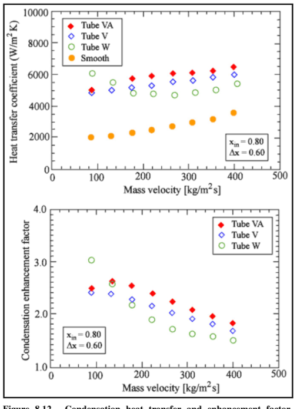

微翅片管内冷凝还有许多其他实验。原书列出 1990 年以来较重要的研究：

1. Koyama、Miyara、Takamatsu 和 Fujii（1990）测量了 R-22 和 R-114 的冷凝系数。
2. Eckels 和 Pate（1991a）详细比较了 R-134a 与 R-12 的平均系数。
3. Chiang（1993）在螺旋微翅片管和轴向微翅片管中进行了 R-22 测试，包括已机械胀管后的管材测试。
4. Torikoshi 和 Ebitsu（1994）在微翅片管中测试了 R-22 和制冷剂混合物。
5. Du、Xin 和 Huang（1995）测量了 R-11 在两种二维轴向微翅片管和三种三维轴向微翅片管中的冷凝系数，三维轴向微翅片管的翅片带交叉切槽。在环状流中，交叉切槽提供 34% 到 144% 的强化；在分层流中，强化为 31% 到 97%。
6. Chamra 和 Webb（1995）也对 R-22 的二维和三维微翅片几何进行了对比测试，但发现交叉切槽只带来 5% 到 15% 的边际改善。
7. Uchida、Itoh、Shikazono 和 Kudoh（1996）同样对 R-22 的二维和三维微翅片管几何进行了类似对比测试。
8. Dunn（1996）对 9.53 mm 即 3/8 in. Wolverine Tube Turbo-A 微翅片管开展了优秀的实验项目，工质包括 R-22、R-134a 和三种共沸混合物。他观察到 R-134a 性能等于或优于 R-22，R-410A 的表现与 R-22 相近。
9. Kedzierski 和 Goncalves（1997）报告了 R-134a、R-125、R-32 和 R-410A 的微翅片冷凝数据。通过温度剖面法，他们报告的是真正局部冷凝数据，而不是其他研究中常见的准局部数据。

Cavallini 等（1999）描述了目前可用于模拟微翅片管冷凝局部传热系数的方法。

## 8.3 Condensation of Condensable Mixtures in Horizontal Tubes

## 8.3 水平管内可凝混合物冷凝

[Silver-Bell-Ghaly 方法](../../../glossary/terms.md#term-silver-bell-ghaly-method)，即 Silver（1947）以及 Bell 和 Ghaly（1973）的方法，可成功预测互溶混合物冷凝；其适用前提是所有组分均可冷凝，且不存在[非凝气](../../../glossary/terms.md#term-non-condensable-gas)。冷凝混合物时，除移除潜热外，随着混合物露点温度沿管长下降，蒸汽相还必须被冷却。因此，该过程同时受冷凝和蒸汽单相冷却控制。该方法对蒸汽冷却作两个假设：

1. 传质不影响蒸汽中的单相传热过程。
2. 在确定蒸汽相传热系数时，假定蒸汽占据整个管截面。

对冷凝温度范围很大的混合物，忽略第一项影响会带来显著误差，因此该方法对温度范围小到中等的混合物更可靠，例如小于约 30 K。第二个假设是保守的，因为环状流中的界面波会强化蒸汽相传热系数。混合物冷凝的有效冷凝传热系数 αeff 按下式计算：

$$
\frac{1}{\alpha_{eff}}
=
\frac{1}{\alpha(x)}
+
\frac{Z_G}{\alpha_G}
\tag{8.3.1}
$$

实施该表达式时，冷凝传热系数 α(x) 用上一节中的纯流体管内关联式得到，但输入局部混合物物性。蒸汽单相传热系数 αG 用 Dittus-Boelter 湍流关联式计算，并在计算蒸汽 Reynolds 数时使用流动中的蒸汽分率。参数 ZG 是蒸汽显热冷却与总冷却速率之比：

$$
Z_G
=
x c_{pG}\frac{dT_{dew}}{dh}
\tag{8.3.2}
$$

其中 x 是局部干度，cpG 是蒸汽定压比热，dTdew/dh 是混合物冷凝时露点温度曲线相对于焓的斜率，即冷凝曲线的斜率。该方法已用于烃类混合物，也由 Cavallini 等（1995）用于二元和三元非共沸制冷剂混合物，并由 Smit、Thome 和 Meyer（2001）用于二元制冷剂混合物。关于多组分冷凝的更完整说明，可参考 Butterworth（1983）。

### Table 8.1 Condensation heat transfer database for zeotropic mixtures considered by Del Col, Cavallini and Thome (2005)

### 表 8.1 Del Col、Cavallini 和 Thome（2005）考虑的非共沸混合物冷凝传热数据库

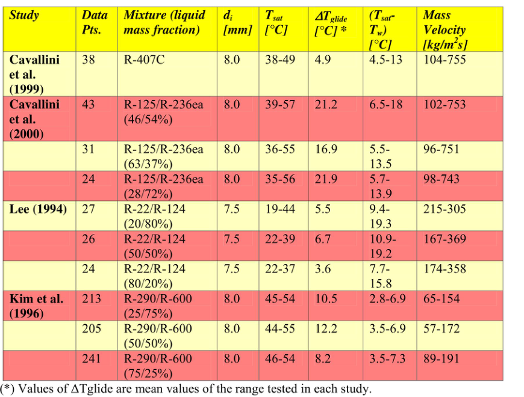

| 研究 | 数据点 | 混合物（液相质量分数） | di mm | Tsat °C | ΔTglide °C | Tsat - Tw °C | 质量通量 kg/m2s |
|---|---:|---|---:|---|---:|---|---|
| Cavallini et al. (1999) | 38 | R-407C | 8.0 | 38-49 | 4.9 | 4.5-13 | 104-755 |
| Cavallini et al. (2000) | 43 | R-125/R-236ea (46/54%) | 8.0 | 39-57 | 21.2 | 6.5-18 | 102-753 |
| Cavallini et al. (2000) | 31 | R-125/R-236ea (63/37%) | 8.0 | 36-55 | 16.9 | 5.5-13.5 | 96-751 |
| Cavallini et al. (2000) | 24 | R-125/R-236ea (28/72%) | 8.0 | 35-56 | 21.9 | 5.7-13.9 | 98-743 |
| Lee (1994) | 27 | R-22/R-124 (20/80%) | 7.5 | 19-44 | 5.5 | 9.4-19.3 | 215-305 |
| Lee (1994) | 26 | R-22/R-124 (50/50%) | 7.5 | 22-39 | 6.7 | 10.9-19.2 | 167-369 |
| Lee (1994) | 24 | R-22/R-124 (80/20%) | 7.5 | 22-37 | 3.6 | 7.7-15.8 | 174-358 |
| Kim et al. (1996) | 213 | R-290/R-600 (25/75%) | 8.0 | 45-54 | 10.5 | 2.8-6.9 | 65-154 |
| Kim et al. (1996) | 205 | R-290/R-600 (50/50%) | 8.0 | 44-55 | 12.2 | 3.5-6.9 | 57-172 |
| Kim et al. (1996) | 241 | R-290/R-600 (75/25%) | 8.0 | 46-54 | 8.2 | 3.5-7.3 | 89-191 |

注：ΔTglide 数值为各研究测试范围的平均值。

Del Col、Cavallini 和 Thome（2005）后来对水平光管内混合物冷凝进行了详细研究，覆盖表 8.1 所示的多实验室数据库。他们以 Thome、El Hajal（2003）的纯流体和共沸混合物局部冷凝传热系数模型，以及 El Hajal、Thome 和 Cavallini（2003）的伴随流型图为起点，并通过修改上文 Silver-Bell-Ghaly 方法把模型扩展到非共沸混合物。混合物产生的附加传热热阻被同时施加到对流系数和膜状冷凝系数上，同时还把界面粗糙度对作用于对流液膜的蒸汽传热系数 αG 的影响纳入。模型还引入非平衡混合物因子，以考虑分层流和分层波状流中的非平衡效应。

该新方法比理论质量扩散方法所需计算量小得多，但仍能准确预测局部传热数据，并且比原始 Silver-Bell-Ghaly 方法更准确。与表 8.1 中来自三个独立实验室的数据库比较时，该数据库包括十种不同混合物，温度滑移范围为 3.5 到 22.8 °C，即 6.3 到 41.0 °F，同时包含制冷剂和烃类混合物。该方法对 Cavallini 等（1999，2000）测得的制冷剂传热系数，98% 可预测在 ±20% 以内；对独立研究者测得的卤代和烃类制冷剂传热系数，85% 可预测在 ±20% 以内。下面说明该新方法。

#### 传热数据库

用于该研究的冷凝传热系数数据库包含四种混合物体系，代表十种不同非共沸混合物组成，覆盖宽范围温度滑移和测试条件。数据库包括 HCFC、HFC 和 HC（烃类）。温度滑移定义为在固定压力和总体组成下，露点温度与泡点温度之差。Cavallini 及合作者的一组数据覆盖 R-407C 和三种 R-125/R-236ea 混合物。他们测试的其他混合物通过混合两个饱和温度差别很大的 HFC 流体 R-125 和 R-236ea 获得，因此温度滑移较高；R-125 是高压流体，R-236ea 是低压流体。Lee（1994）的数据集为三种不同质量组成的 R-22/R-124 混合物；Kim、Chang 和 Ro（1996）的数据集则包括丙烷/丁烷混合物的传热数据。图 8.13 展示了其中一些测试数据。

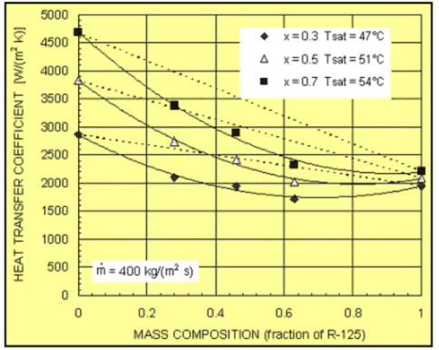

式（8.3.1）中的 1/α(x) 表示冷凝液层热阻；对混合物，通常用纯流体模型并输入液体混合物物性来计算。式（8.3.1）中的第二项表示沿通道把蒸汽流冷却到局部下降饱和温度所需克服的热阻。Del Col、Cavallini 和 Thome（2005）主要对原始 Silver-Bell-Ghaly 方法引入三项改进：

1. 蒸汽相传热系数 αG 通过界面波的强化作用进行修正；界面波本质上类似管内肋，会使蒸汽相传热系数高于 Dittus-Boelter 值。
2. 界面波取决于流型，因为在底层纯流体模型中，只有发生轴向对流的管周向存在界面波，而发生降膜冷凝的上部周向没有界面波。因此，在混合物流动的分层型流动中，角度 θ 成为影响 αG 的参数。
3. 模型包含非平衡效应；由于混合减弱，这些效应在分层型流动中更显著。

类似前文纯流体方法，混合物的周向平均局部传热系数 αeff 由混合物膜状冷凝系数 αfm 与混合物对流冷凝系数 αcm 按其所属周向加权得到：

$$
\alpha_{eff}
=
\frac{\alpha_{fm}\theta+(2\pi-\theta)\alpha_{cm}}{2\pi}
\tag{8.3.3}
$$

把 Thome-El Hajal-Cavallini 纯流体传热模型及其流型图应用于混合物时，除下面说明的改变外，方法与本章前述纯流体方法完全相同。此外，所有计算都使用局部混合物组成对应的物性。温度滑移记作 ΔTglide，Δhm 表示混合物焓变，包括潜热以及液相和汽相的显热冷却效应。θ 是管顶周向的降膜角，按式（8.1.30）计算。

对流冷凝传热系数用 Bell-Ghaly 方法得到：

$$
\alpha_{cm}
=
\left[
\frac{1}{\alpha_c}+R_c
\right]^{-1}
\tag{8.3.4}
$$

其中 αc 由纯流体模型方程计算。合适的 Bell-Ghaly 热阻 Rc 可按下式计算：

$$
R_c
=
x c_{pG}
\frac{\Delta T_{glide}}{\Delta h_m}
\frac{1}{\alpha_G f_i}
\tag{8.3.5}
$$

Rc 是以汽液界面为参照的蒸汽相传热系数的函数。Thome、El Hajal 和 Cavallini（2003）曾引入界面粗糙度因子 fi 作用在 αc 上，以考虑冷凝液和蒸汽之间界面剪切引起的传热系数增加；他们认为蒸汽剪切增加界面波的幅值和数量，从而增强传热。同一修正因子也作用在上式中的蒸汽传热系数上，其中 fi 由式（8.1.40）或式（8.1.41）计算。蒸汽传热系数 αG 用 Dittus 和 Boelter（1930）方程计算：

$$
\alpha_G
=
0.023
\left(\frac{k_G}{d_i}\right)
Re_G^{0.8}Pr_G^{0.33}
\tag{8.3.6}
$$

蒸汽相 Reynolds 数按下式和式（8.1.37）中的 uG 计算：

$$
Re_G
=
\frac{\rho_G u_G d_i}{\mu_G}
\tag{8.3.7}
$$

因此，新方法从实际蒸汽速度计算蒸汽传热系数，而不是假定蒸汽占据整个通道截面。

Silver-Bell-Ghaly 程序也按式（8.3.4）到式（8.3.7）应用于膜状冷凝分量，但取 Fi = 1.0，因为原始纯流体模型假定降落冷凝液膜上没有波。分层型流动中，非共沸混合物的膜状冷凝传热系数是饱和温度与壁温之差的函数；该影响并入 αfm 表达式：

$$
\alpha_{fm}
=
F_m
\left[
\frac{1}{\alpha_f}+R_c
\right]^{-1}
\tag{8.3.8}
$$

式中 αf 用混合物物性计算，Rc 由式（8.3.5）计算并取 Fi = 1.0。加入该式的非平衡混合物因子 Fm 用于考虑分层流型中的非平衡效应，其关联式为：

$$
F_m
=
\exp
\left[
-0.25(1-x)
\left(\frac{\dot m_{wavy}}{\dot m}\right)^{0.5}
\left(\frac{\Delta T_{glide}}{T_{sat}-T_w}\right)
\right]
\tag{8.3.9}
$$

Fm 取值范围为 0 到 1，并随质量通量和干度降低而降低。传质热阻与温度滑移成正比，因此 Fm 随 ΔTglide 增大而降低。饱和温度与壁温之差也包含在式中，因为它驱动质量扩散过程。

图 8.14 给出了整个数据库与新混合物冷凝模型的比较，图中以混合物温度滑移为横坐标，绘制预测值与实验值之比。

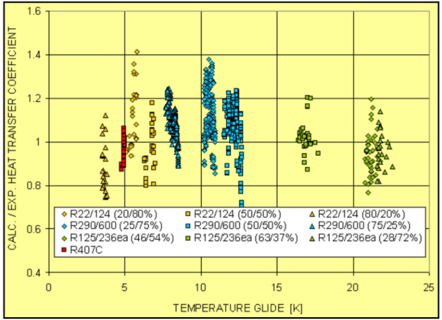

### 算例：丙烷及有温度滑移的烃类混合物

题设：丙烷在内径 15 mm 的水平光管内冷凝。制冷剂以 2 °C、5.07 bar 的饱和蒸汽进入，并以饱和液体离开。入口蒸汽质量流量为 0.03534 kg/s，管壁平均内表面温度为 -10 °C。要求在干度 x = 0.5 处，用 Akers、Shah 和 Dobson-Chato 方法求局部冷凝传热系数。然后，假设某烃类混合物具有与丙烷相同的物性，但冷凝过程中具有从 2 °C 到 -3 °C 的线性温度滑移，用 Dobson-Chato 方法配合 Silver-Bell-Ghaly 方法求 x = 0.5 处的局部冷凝传热系数。

2 °C 下丙烷物性为：

| 物性 | 数值 |
|---|---:|
| ρL | 528 kg/m3 |
| ρG | 11.0 kg/m3 |
| μL | 0.0001345 Ns/m2 |
| μG | 0.0000075 Ns/m2 |
| hLG | 373100 J/kg |
| kL | 0.108 W/m K |
| cpL | 2470 J/kg K |
| pcrit | 4264 kPa |
| PrL | 3.08 |
| kG | 0.0159 W/m K |
| cpG | 1880 J/kg K |
| PrG | 0.887 |

总质量通量为：

$$
\dot m
=
\frac{M}{\pi D^2/4}
=
\frac{0.03534}{\pi(0.015)^2/4}
=
200\ \mathrm{kg/(m^2s)}
$$

由 Akers 等（1959）的等效质量通量式：

$$
\dot m_e
=
200
\left[
(1-0.5)+0.5
\left(\frac{528}{11}\right)^{1/2}
\right]
=
792.8\ \mathrm{kg/(m^2s)}
$$

等效 Reynolds 数为：

$$
Re_e
=
\frac{\dot m_eD}{\mu_L}
=
\frac{792.8(0.015)}{0.0001345}
=
88416
$$

对于 Ree > 50,000，C = 0.0265，n = 0.8。代入式（8.1.4）：

$$
\frac{\alpha(x)(0.015)}{0.108}
=
0.0265(88416)^{0.8}(3.08)^{1/3}
$$

得到 Akers 局部冷凝传热系数：

$$
\alpha(x)=2516\ \mathrm{W/(m^2K)}
$$

对 Shah 方法，约化压力为 0.1189，液相 Reynolds 数为：

$$
Re_L
=
\frac{\dot mD}{\mu_L}
=
\frac{200(0.015)}{0.0001345}
=
22305
$$

按式（8.1.6）得到：

$$
\alpha(x)=4283\ \mathrm{W/(m^2K)}
$$

Dobson-Chato 方法的三个无量纲组由式（8.1.9）、式（8.1.10）和式（8.1.14）得到：

$$
Re_{Ls}
=
\frac{200(0.015)(1-0.5)}{0.0001345}
=
11152
$$

$$
X_{tt}
=
\left(\frac{0.5}{0.5}\right)^{0.9}
\left(\frac{11}{528}\right)^{0.5}
\left(\frac{0.0001345}{0.0000075}\right)^{0.1}
=
0.1926
$$

$$
Ga_L
=
\frac{9.81(528)(528-11)(0.015)^3}{(0.0001345)^2}
=
499600000
$$

由式（8.1.20）得到转变判据：

$$
Fr_{so}
=
103.7
$$

因为 Frso > 20，使用环状流关联式（8.1.7）。原书计算得到：

$$
Nu(x)=662.2
$$

再由式（8.1.8）得到：

$$
\alpha(x)=4768\ \mathrm{W/(m^2K)}
$$

因此，Akers、Shah 和 Dobson-Chato 三种方法分别给出 2516、4283 和 4768 W/m2K。

对具有 5 °C 线性温度滑移的烃类混合物，整个冷凝范围内露点温度下降为 5 °C。总焓变等于潜热加显热，显热可估算为液相比热和汽相比热平均值乘以 5 °C 温度滑移：

$$
dh
=
\frac{1}{2}(2470+1880)(5)+373100
=
10875+373100
=
383975\ \mathrm{J/kg}
$$

代入式（8.3.2）：

$$
Z_G
=
0.5(1880)\frac{5}{383975}
=
0.01224
$$

蒸汽分率对应的 Reynolds 数为：

$$
Re_G
=
\frac{200(0.015)(1-0.5)}{0.0000075}
=
200000
$$

用 Dittus-Boelter 单相湍流关联式得到蒸汽传热系数：

$$
\frac{\alpha_G(0.015)}{0.0159}
=
0.023(200000)^{0.8}(0.887)^{1/3}
$$

$$
\alpha_G
=
404.6\ \mathrm{W/(m^2K)}
$$

代入式（8.3.1）：

$$
\frac{1}{\alpha_{eff}}
=
\frac{1}{4768}
+
\frac{0.01224}{404.6}
$$

$$
\alpha_{eff}
=
4160\ \mathrm{W/(m^2K)}
$$

在这些条件下，传质效应使冷凝传热系数降低约 13%。

## 8.4 Condensation of Superheated Vapor

## 8.4 过热蒸汽冷凝

冷却过热蒸汽时，如果壁温低于蒸汽的饱和温度，或对混合物而言低于某一组分的饱和温度，就会发生冷凝。为了判断是否发生冷凝，必须沿程逐步计算壁温，并在热阻分析中同时使用冷却流体传热系数和蒸汽相单相传热系数。热流体和冷流体的温度沿过热蒸汽流动路径变化，计算蒸汽侧壁温时应使用局部值。若壁温低于饱和温度，即使主体蒸汽仍为过热状态，管壁热边界层内也会发生过热蒸汽冷凝。

由于冷凝传热远强于蒸汽单相传热，如果去过热区相对于饱和冷凝区具有显著长度，就必须在冷凝器热设计中包含这一效应。估算去过热区冷凝传热系数时，通常做法是使用与饱和区相同的热设计方程。饱和区方法通常应在干度 0.99 处评价，而不是在干度 1.0 处评价，因为部分方法会在干度 1.0 处计算失败，或退化为单相湍流传热系数。

上述情景假定过程是从热态路径达到该运行状态的，例如过热蒸汽先流经换热器，之后才施加冷却剂流动。若相反，冷却剂先进入换热器，那么随后进入的过热蒸汽会遇到低于饱和温度的壁温。在这种情况下，应在热阻分析中使用冷凝传热系数而不是蒸汽相单相传热系数来确定去过热区。

## 8.5 Subcooling of Condensate

## 8.5 冷凝液过冷

冷凝器过冷区应使用单相液体流动的传热和压降预测方法。实际上，冷凝液中可能仍含有尚未冷凝的少量气泡；这提醒我们，冷凝是动态过程，不是平衡热力学过程。不过这些气泡对热性能的影响通常不显著。过冷区流动可能为层流，也可能为湍流。对内部强化管，应采用该特定强化结构在单相模式下运行时对应的方法。例如，对微翅片管，应使用内肋管内传热和压降预测方法。
