# Chapter 8 Condensation Inside Tubes

# 第 8 章 管内冷凝

## 来源追踪

| 项目 | 内容 |
|---|---|
| 原书 | Engineering Data Book III |
| 章节 | Chapter 8 |
| PDF 页码 | 213-239 |
| 书内页码 | 8-1 到 8-27 |
| 进度记录 | [progress.md](./progress.md) |

## 摘要

本章回顾水平管内冷凝原理。流型和流动分层对局部冷凝传热系数预测非常重要。除光管冷凝外，本章还讨论微翅片管冷凝、非共沸混合物冷凝、过热蒸汽冷却过程中的冷凝，以及冷凝液过冷区。

## 8.1 Condensation inside Horizontal Tubes

## 8.1 水平管内冷凝

本章讨论管内冷凝，目前只覆盖水平管内冷凝。讨论对象既包括纯蒸汽，也包括可凝混合物。

水平管内冷凝可能是部分冷凝，也可能是完全冷凝。入口蒸汽可能处于过热状态，也可能干度等于 1.0 或低于 1.0。因此，实际过程可能先经历干壁去过热区，再经历湿壁去过热区，随后进入饱和冷凝区，最后进入液体过冷区。冷凝传热系数强烈依赖局部[干度](../../../glossary/terms.md#term-quality)，干度越高通常传热系数越高；它也强烈依赖质量通量，质量通量越大，传热系数越高。与外表面冷凝不同，在多数操作条件下，管内冷凝对壁温差 Tsat - Tw 不敏感，低质量通量工况除外。

### 8.1.1 Flow Regimes for Condensation in Horizontal Tubes

### 8.1.1 水平管内冷凝流型

Palen、Breber 和 Taborek 的图 8.1 给出了水平管内冷凝的典型两相流型。高质量通量下，流动通常处于[环状流](../../../glossary/terms.md#term-annular-flow)：液膜沿管壁周向分布，蒸汽位于中心核心区，界面波尖端会把部分液滴夹带进蒸汽核心。

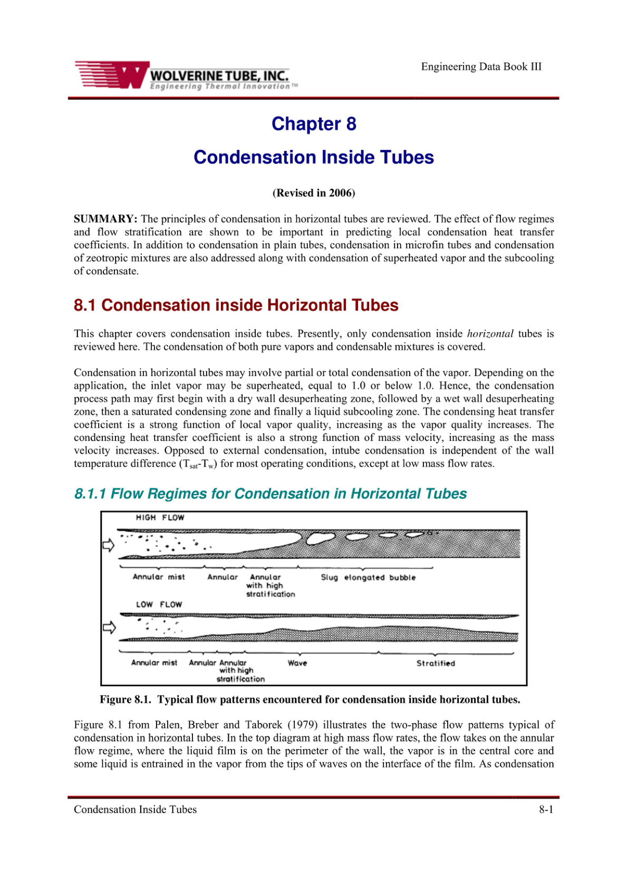

随着冷凝沿管长推进，蒸汽速度下降，界面上的[蒸汽剪切](../../../glossary/terms.md#term-vapor-shear)减弱，液膜在管底逐渐厚于管顶。新生成的冷凝液会继续增加液膜厚度；液量进一步增大后，流型会转入[弹状流](../../../glossary/terms.md#term-slug-flow)，最终蒸汽完全转化为液体。

低质量通量下，入口附近可先形成环状流，但很快转为间歇流或分层波状流。间歇流中大振幅波会冲刷管顶；分层波状流中波幅较小。如果液体没有跨越整个截面，蒸汽可能在未完全冷凝的情况下到达管末端。

这些流型与绝热两相流很相似，但冷凝问题有一个关键差异：即使整体流型接近分层流，管壁上部周向也会因冷凝形成薄液膜。图 8.2 和图 8.3 说明了这种分层冷凝几何。

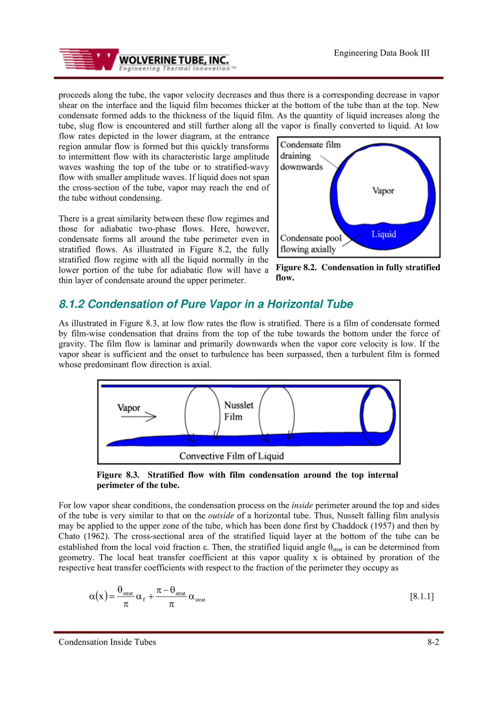

### 8.1.2 Condensation of Pure Vapor in a Horizontal Tube

### 8.1.2 水平管内纯蒸汽冷凝

低流量下流动为分层流。顶部管壁产生的[膜状冷凝](../../../glossary/terms.md#term-filmwise-condensation)液膜在重力作用下向底部排液；当蒸汽核心速度较低时，液膜主要作向下层流运动。若蒸汽剪切足够强并超过湍流起始条件，则会形成湍流液膜，其主流向转为轴向。

在低蒸汽剪切条件下，管内上部和侧部周向的冷凝与水平管外冷凝相似，因此可对管上部区域应用 Nusselt 降膜分析。Chaddock 和 Chato 最早把这种思路用于水平管内冷凝。底部液池所占截面积可由局部[空隙率](../../../glossary/terms.md#term-void-fraction)确定，再由几何关系得到分层液体角。局部传热系数可按各区域占据的周向比例加权。

高流量、湍流环状流条件下，已有大量关联式，例如 Akers-Deans-Crosser、Cavallini-Zecchin、Shah 等。Akers-Deans-Crosser 将 Dittus-Boelter 单相湍流管流式改写为等效两相 Reynolds 数形式；Shah 则以液相 Reynolds 数为基准，引入约化压力修正。Thome 建议质量通量大于 200 kg/m2s 时采用 Shah 关联式，质量通量更低时采用 Akers-Deans-Crosser 关联式。

Dobson 和 Chato 对 Chato 方法作了大幅改进，将分层波状流的顶部降膜冷凝与底部强制对流冷凝结合起来，并为环状流给出单独关联式。Soliman 环状流到分层波状流转变准则被用于选择传热模型。原方法在转变边界处会给出传热系数跳变；工程实现时可在转变区对两个模型线性加权，以避免不符合实验的阶跃。

Tang 提出了 Shah 方法的简化扩展，适用于约化压力 0.2 到 0.53、质量通量 300 到 810 kg/m2s 的环状流。

### Thome-El Hajal-Cavallini 模型

El Hajal、Thome 和 Cavallini 提出了基于局部流型和界面波效应的物理模型，覆盖广泛参数范围：质量通量 16 到 1532 kg/m2s，管内径 3.14 到 21.4 mm，约化压力 0.02 到 0.8，干度 0.03 到 0.97。该模型使用第 12 章中的冷凝流型图判断局部流型。

图 8.4 把环状流、分层波状流和完全分层流简化为三种几何。环状流采用均匀液膜厚度，忽略重力；完全分层流则用具有相同分层角和液相截面积的截断环形液膜表示；分层波状流介于两者之间，界面波不到达管顶，管顶仍通过冷凝形成降膜。

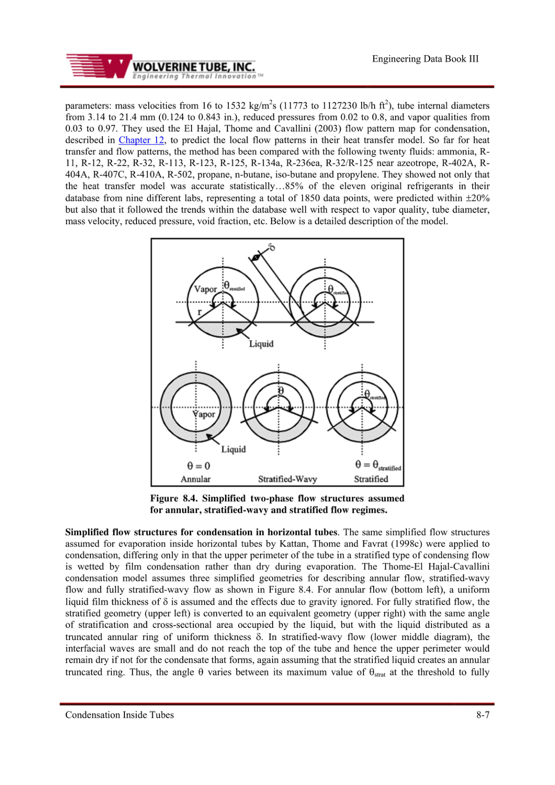

模型把传热分为两个机制：下部由轴向液膜流控制的对流冷凝，上部由重力排液控制的降膜冷凝。对流冷凝系数 αc 作用于被轴向液膜润湿的周向；降膜冷凝系数 αf 作用于分层流中本来会干燥、但因冷凝而被薄液膜润湿的上部周向。局部周向平均传热系数写为：

$$
\alpha(x)=
\frac{\alpha_f\theta+(2\pi-\theta)\alpha_c}{2\pi}
\tag{8.1.23}
$$

其中 θ 是顶部降膜区域角。环状、间歇和雾状流中 θ = 0，因此 α(x) = αc。

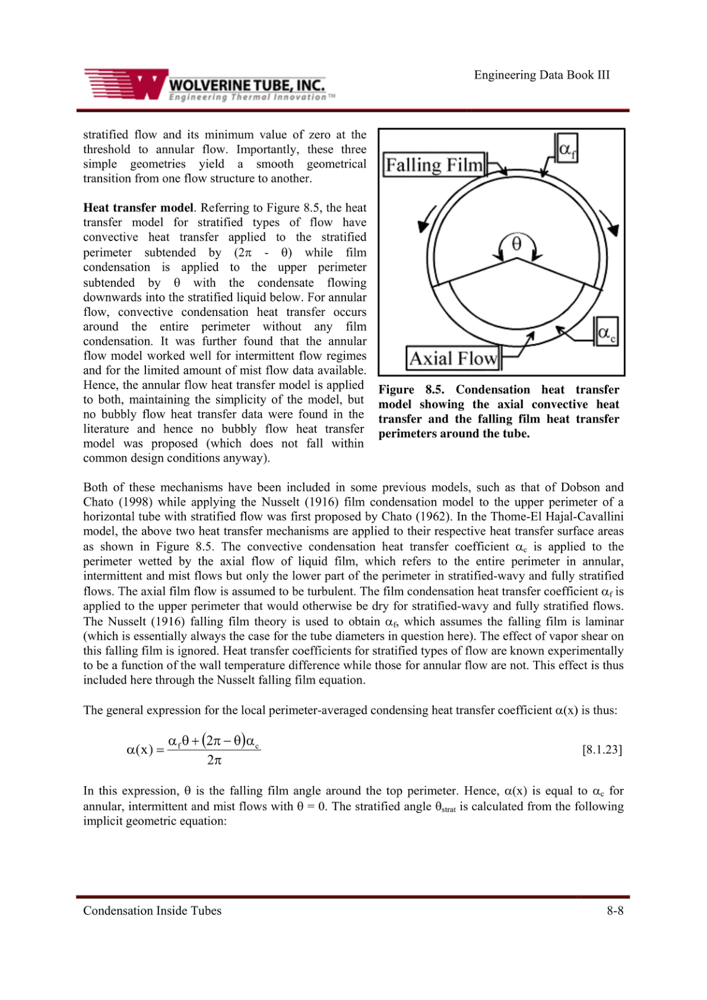

模型使用 Rouhani 漂移流空隙率和均相空隙率构造对数平均空隙率，并由几何关系确定分层角。为避免求解隐式几何方程，Biberg 的显式近似可用于求完全分层角。对流液膜系数采用湍流液膜关联式；液膜厚度由截面积几何方程求解。若低干度下几何方程给出超过半径的液膜厚度，则将液膜厚度限制为管径的一半。

模型还把界面粗糙度作为影响传热的新参数。蒸汽核心的高速剪切会增强界面波、降低平均液膜厚度并诱发液膜内旋涡，从而提高传热。界面粗糙度修正因子随滑移比增大而增大，随表面张力增大而减小；在完全分层流中，界面波逐渐衰减，修正因子也相应减弱。

模型实施步骤可概括为：

1. 用空隙率模型计算局部空隙率。
2. 用冷凝流型图确定局部流型和转变边界。
3. 将局部流型归类为环状、间歇、雾状、分层波状或完全分层。
4. 对环状、间歇和雾状流，取 θ = 0，用对流冷凝模型直接得到 α(x)。
5. 对分层波状流，计算分层角和顶部降膜角，再按式 (8.1.23) 加权。
6. 对完全分层流，令 θ 等于完全分层角，并使用完全分层流的界面粗糙度修正。

图 8.6 和图 8.7 显示模型与 Cavallini 数据库及全部数据库的比较，约 85% 数据可在 ±20% 内预测。图 8.8 到图 8.10 展示 R-410A 在 8 mm 管内冷凝时，流型转变、质量通量和热流密度对局部传热系数的影响。

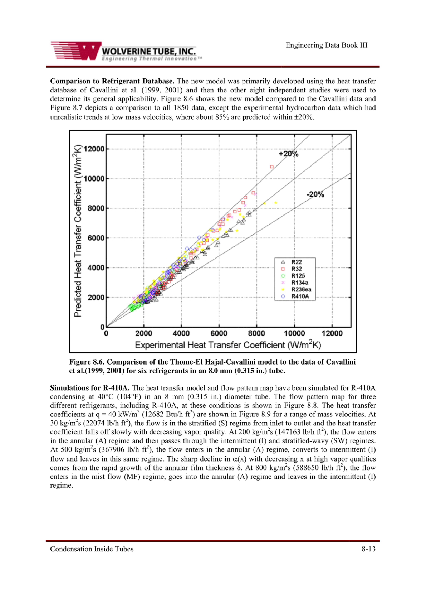

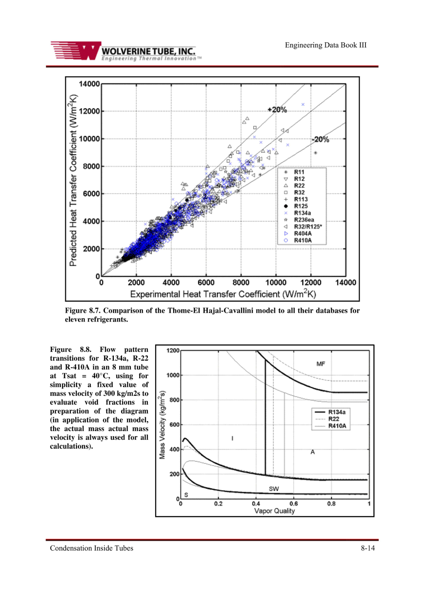

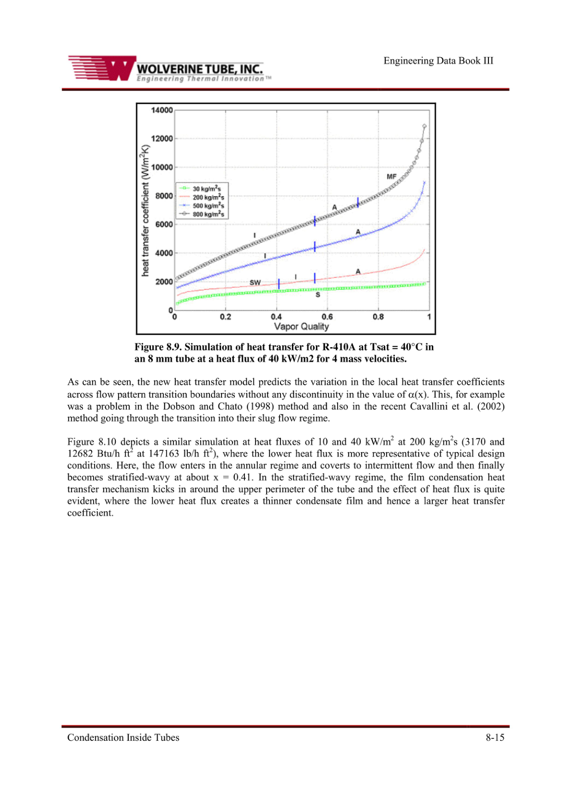

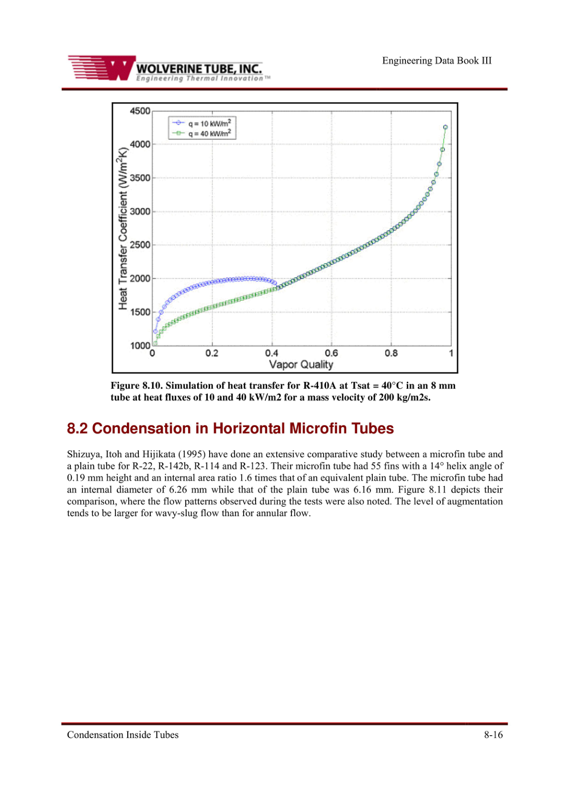

## 8.2 Condensation in Horizontal Microfin Tubes

## 8.2 水平微翅片管内冷凝

Shizuya、Itoh 和 Hijikata 比较了 R-22、R-142b、R-114 和 R-123 在微翅片管和光管中的冷凝性能。其微翅片管有 55 条翅片，螺旋角 14°，翅高 0.19 mm，内部面积为等效光管的 1.6 倍。结果表明，波状-弹状流中的强化幅度通常高于环状流。

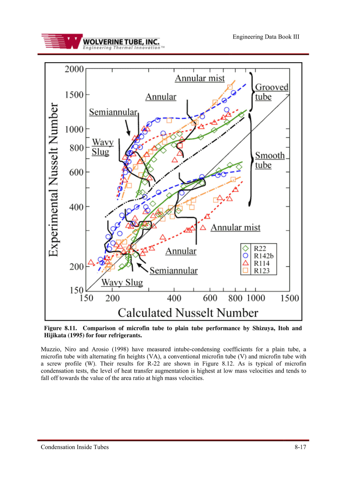

Muzzio、Niro 和 Arosio 测量了光管、交替翅高微翅片管、常规微翅片管以及螺纹轮廓微翅片管中的冷凝系数。典型结果是：微翅片管的强化比在低质量通量下最高，随着质量通量升高，强化比趋向面积比。

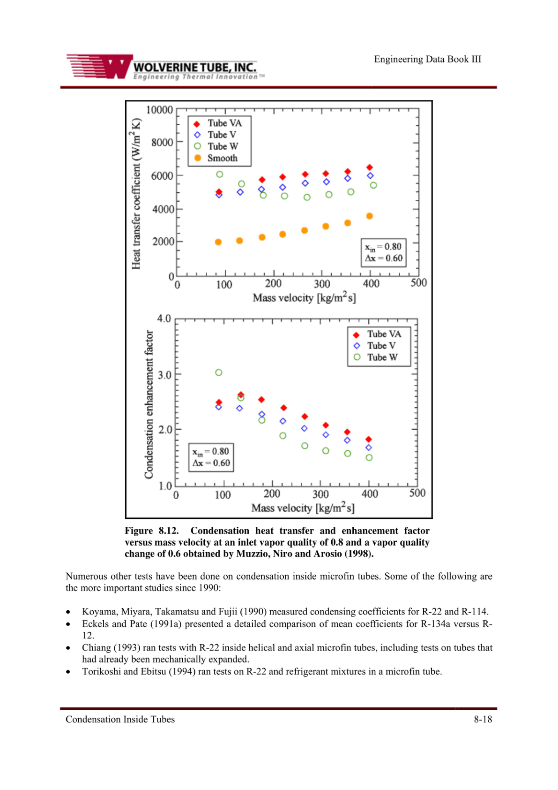

1990 年以后还有大量微翅片管冷凝实验。重要趋势包括：R-134a 与 R-22 性能可相当或更好；R-410A 与 R-22 相近；二维和三维微翅片几何的交叉切槽可能提高环状流和分层流传热，但不同研究对强化幅度给出不同结论。当前可用的局部传热系数模拟方法可参考 Cavallini 等对微翅片管冷凝模型的综述。

## 8.3 Condensation of Condensable Mixtures in Horizontal Tubes

## 8.3 水平管内可凝混合物冷凝

Silver-Bell-Ghaly 方法可用于预测所有组分都可凝、且不存在[非凝气](../../../glossary/terms.md#term-non-condensable-gas)的互溶混合物冷凝。混合物冷凝时，沿管程不仅要移除潜热，还要随着露点温度下降冷却蒸汽相；因此过程同时受冷凝和蒸汽单相冷却控制。

该方法作两个假设：其一，传质不影响蒸汽相单相传热；其二，在计算蒸汽相传热系数时，蒸汽占据整个管截面。前一假设在冷凝温度范围很大的混合物中误差会变大，因此该方法更适合温度滑移小到中等的混合物。后一假设偏保守，因为环状流中的界面波会强化蒸汽相传热。

混合物有效冷凝传热系数可写为：

$$
\frac{1}{\alpha_{eff}}
=
\frac{1}{\alpha(x)}
+\frac{Z_g}{\alpha_g}
\tag{8.3.1}
$$

其中 α(x) 由上一节纯流体管内冷凝关联式计算，但物性取局部混合物物性；αg 用 Dittus-Boelter 湍流式计算蒸汽相单相传热系数。Zg 表示蒸汽显热冷却占总冷却速率的比例：

$$
Z_g=x\,c_{pg}\frac{dT_{dew}}{dh}
\tag{8.3.2}
$$

Del Col、Cavallini 和 Thome 后续用多实验室数据库研究非共沸混合物管内冷凝。数据库覆盖 R-407C、R-22/R-124、丙烷/丁烷等多种混合物，温度滑移范围约 3.5 到 22.8 °C。

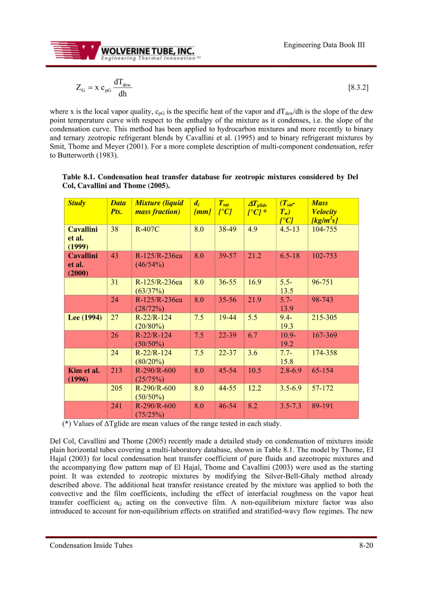

改进模型以 Thome-El Hajal-Cavallini 纯流体模型和流型图为基础，对 Silver-Bell-Ghaly 方法作了三项改进：蒸汽相传热系数考虑界面波强化；界面波影响与流型和润湿周向相关；分层流和分层波状流中的非平衡效应用额外混合物因子处理。

混合物的周向平均局部传热系数仍按两个传热机制分区加权：

$$
\alpha_{avg,mix}
=
\frac{\alpha_{film,mix}\theta+(2\pi-\theta)\alpha_{conv,mix}}{2\pi}
\tag{8.3.3}
$$

图 8.13 给出 Cavallini 等的 R-236fa、R-125 及其混合物数据；图 8.14 显示 Del Col-Cavallini-Thome 混合物冷凝模型对完整数据库的预测效果。

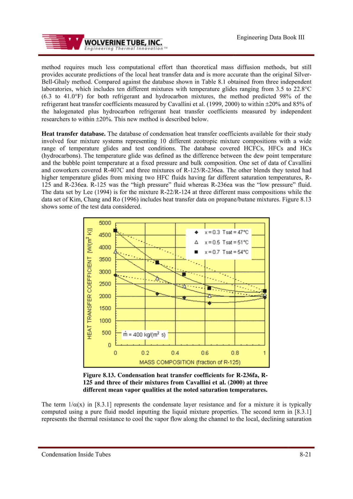

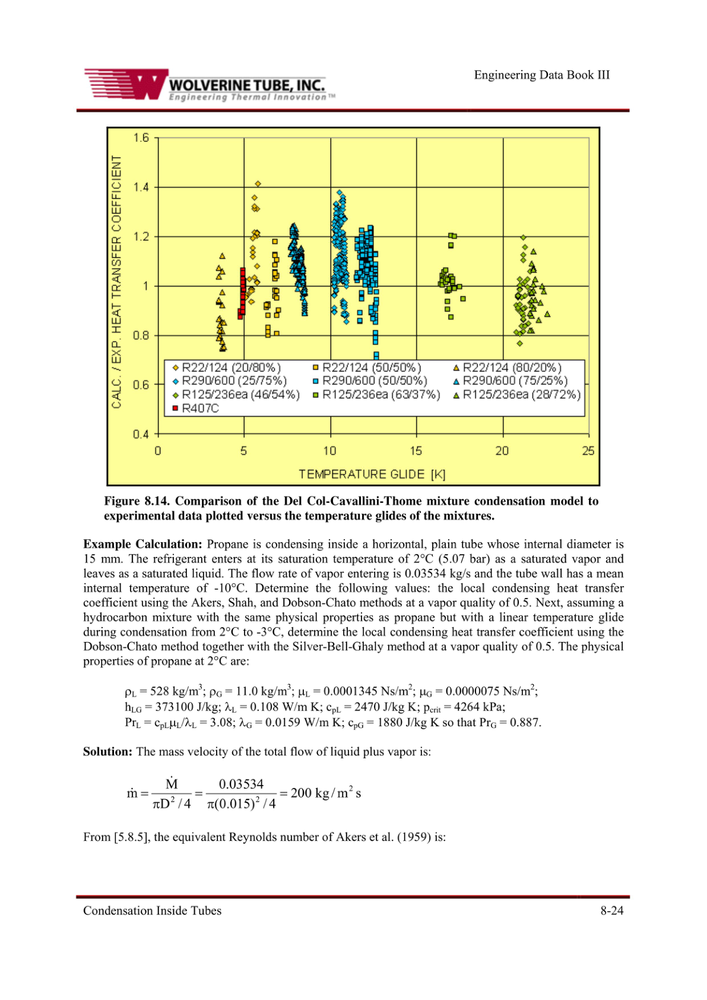

### 算例

算例给定丙烷在内径 15 mm 的水平光管内冷凝，入口为 2 °C 饱和蒸汽，出口为饱和液体，入口质量流量 0.03534 kg/s，壁面平均内温 -10 °C。要求在干度 0.5 处分别用 Akers、Shah、Dobson-Chato 估算局部冷凝传热系数，并再假设一个具有相同物性但有 5 °C 线性温度滑移的烃类混合物，用 Dobson-Chato 加 Silver-Bell-Ghaly 方法估算局部系数。

总质量通量为：

$$
G=
\frac{0.03534}{\pi(0.015)^2/4}
=200\ \mathrm{kg/(m^2s)}
$$

原书计算结果为：

| 方法 | 局部冷凝传热系数 |
|---|---:|
| Akers | 2516 W/m2K |
| Shah | 4283 W/m2K |
| Dobson-Chato | 4768 W/m2K |
| Dobson-Chato 加 Silver-Bell-Ghaly 混合物修正 | 4160 W/m2K |

在这个条件下，混合物传质热阻使局部冷凝传热系数降低约 13%。

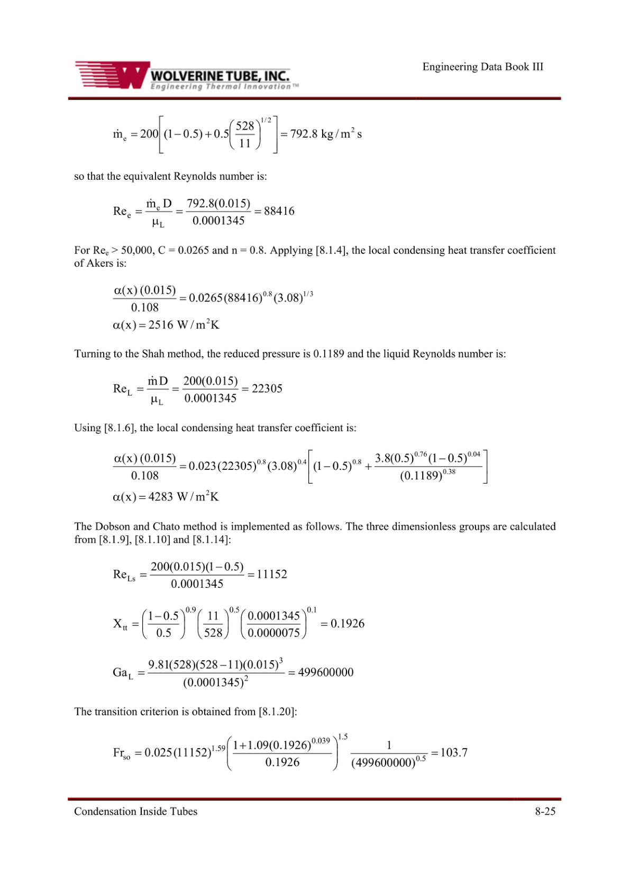

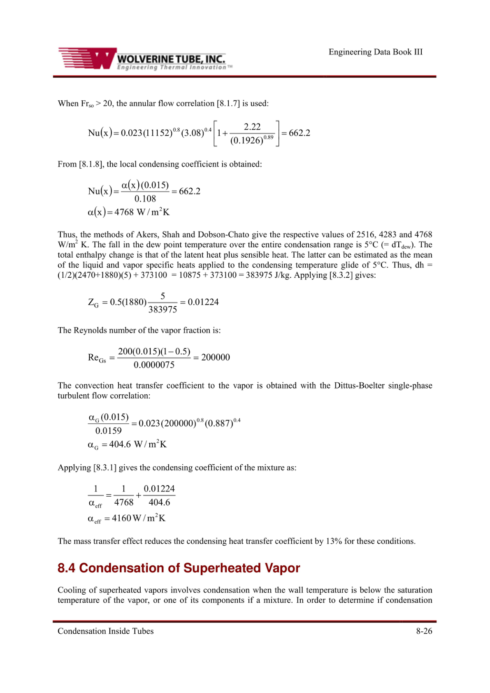

## 8.4 Condensation of Superheated Vapor

## 8.4 过热蒸汽冷凝

过热蒸汽冷却时，若壁温低于蒸汽或混合物某组分的饱和温度，边界层内会发生冷凝。判断是否发生冷凝需要沿程分步计算壁温，热阻网络中要同时使用冷却侧传热系数和蒸汽相单相传热系数。若蒸汽侧壁温低于饱和温度，即使主体蒸汽仍为过热状态，管壁边界层中也会发生冷凝。

由于冷凝传热远强于蒸汽单相对流，如果去过热区相对于饱和冷凝区并不短，就必须在冷凝器热设计中考虑这一效应。工程估算时通常用饱和冷凝区相同的热设计式估算去过热区的冷凝传热系数，但应在干度 0.99 处评价模型，而不是在干度 1.0 处评价，因为不少模型在干度 1.0 会失效或退化为单相湍流传热系数。

这一判断还依赖启动路径。如果设备先通入过热蒸汽、后通冷却介质，可先用蒸汽单相传热系数估算壁温；如果先通冷却介质、后通入过热蒸汽，蒸汽进入时壁温可能已低于饱和温度，此时去过热区应直接用冷凝传热系数进入热阻分析。

## 8.5 Subcooling of Condensate

## 8.5 冷凝液过冷

冷凝器过冷区应使用单相液体流动的传热和压降方法。实际冷凝液中可能仍有尚未完全冷凝的气泡，但对热性能影响通常不显著。过冷区流动可为层流，也可为湍流。若采用内强化管，应使用对应强化结构在单相液体模式下的传热和压降方法；例如微翅片管可采用内肋管单相流动预测方法。

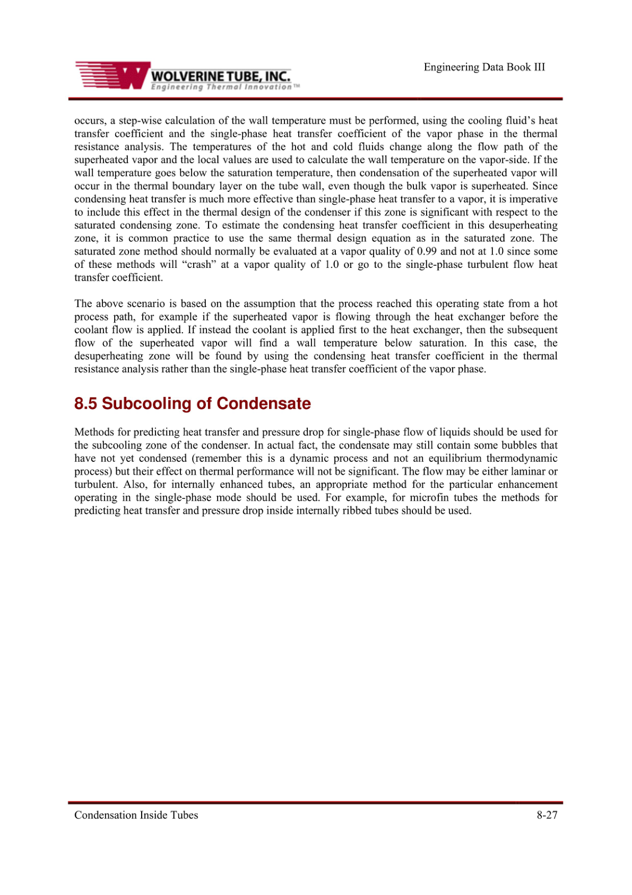
