# Chapter 10 Boiling Heat Transfer Inside Plain Tubes

# 第 10 章 光管管内沸腾传热

## 来源追踪

| 项目 | 内容 |
|---|---|
| 原书 | Engineering Data Book III |
| 章节 | Chapter 10 |
| PDF 页码 | 278-306 |
| 书内页码 | 10-1 到 10-29 |
| 进度记录 | [progress.md](./progress.md) |

完整源页截图保留在 `assets/source-page-278.png` 到 `assets/source-page-306.png`，用于逐页二校和公式复核。正文只展示局部图表资产，避免整页原文图打断阅读。

## 摘要

本章描述光管内蒸发传热，覆盖垂直管和水平管内蒸发方法。原书先介绍较早的设计方法，再介绍更新的方法。这些方法主要给出管周完全润湿或部分润湿条件下的局部流动沸腾传热系数预测，不覆盖雾状流干涸后传热。章内还讨论混合物蒸发，并给出通用预测思路。部分方法也适用于两个同心光管形成的环隙内蒸发。

原书推荐：垂直管蒸发采用 Steiner and Taborek（1992）方法；水平管蒸发采用 Wojtan、Ursenbacher and Thome（2005a, 2005b）对 Kattan、Thome and Favrat（1998a, 1998b, 1998c）模型的更新版本。

## 10.1 Introduction

## 10.1 引言

本章讨论受限通道内液体蒸发时出现的各种水动力条件。这里的通道是圆管，同时给出用于预测传热系数的方法。

先考虑一根沿长度均匀加热的垂直管。例如，可用直流电源对管壁直接焦耳加热。在相对较低热通量下，过冷液体从管底进入，并沿管长逐步完全蒸发，如图 10.1 所示。

当液体被加热到该高度局部压力对应的饱和温度前，管壁温度起初低于成核所需温度。图 10.1 中 A 区因此是对过冷液体的单相传热，可以是层流，也可以是湍流。随后壁温升高到饱和温度以上，管壁过热热边界层中发生沸腾成核，进入 B 区的过冷流动沸腾。此时气泡向过冷核心漂移时会凝结。液体达到饱和温度后，C 区开始以泡状流形式发生饱和沸腾。饱和沸腾继续经过 D 区弹状流、E 区环状流，以及 F 区伴随液滴夹带进入蒸汽核心的环状流。

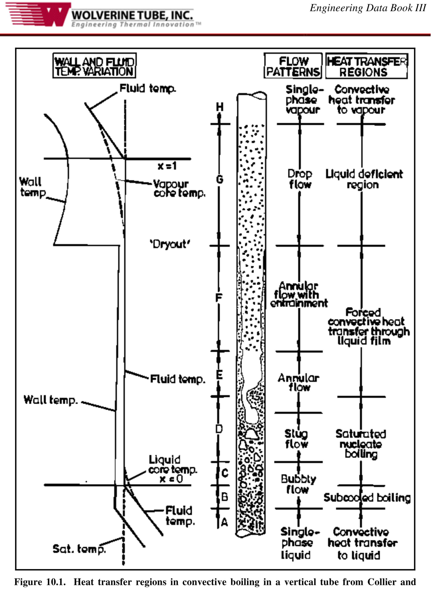

*图 10.1：Collier and Thome（1994）给出的垂直管对流沸腾传热区域。*

在 F 区末端，环状液膜会干涸，或被蒸汽从壁面剪切带走；这个点称为干涸起始，或简称干涸。超过该点后，夹带液滴形成雾状流。在给定壁面热通量条件下，壁温会大幅上升，进入 G 区。G 区连续蒸汽相温度趋于高于饱和温度，传热包含四种机制：对蒸汽的单相对流、对蒸汽中液滴的传热、壁面上液滴撞击传热，以及壁面对液滴的热辐射。由于这种非平衡效应，即使干度超过 1，蒸汽相中仍可能有液滴存在，直到进入 H 区。H 区所有液体已经蒸发完毕，传热转为对干蒸汽的单相对流。

图 10.2 给出了蒸发传热的“沸腾图”。它定性展示了流体沿加热管蒸发时，局部传热系数随干度变化的趋势，并把热通量作为参数。图中热通量从曲线 (i) 到 (vii) 逐渐增大。低热通量下，液体不足区出现在环状液膜干涸之后。较高热通量下，过程会经历核态沸腾偏离（departure from nucleate boiling, DNB），也就是通常所说的临界热通量，随后进入饱和膜态沸腾。理想化地看，膜态沸腾可理解为倒置环状流：蒸汽形成环状膜，液体位于中心核心区。高热通量下也可能在过冷条件下达到 DNB。膜态沸腾区和液体不足区的传热系数明显低于湿壁区。

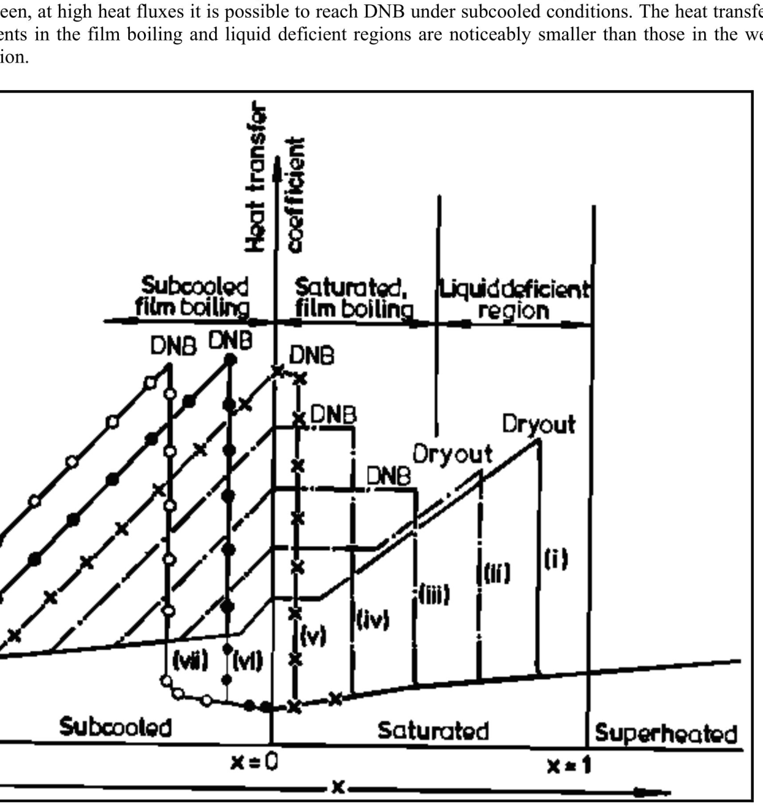

*图 10.2：Collier and Thome（1994）的沸腾图。*

## 10.2 Two-Phase Flow Boiling Heat Transfer Coefficient

## 10.2 两相流动沸腾传热系数

管内蒸发的局部两相流动沸腾传热系数 αtp 定义为：

$$
\alpha_{tp}
=
\frac{q}{T_{wall}-T_{sat}}
\tag{10.2.1}
$$

其中 q 是管壁传给流体的局部热通量，Tsat 是局部饱和压力 psat 下的饱和温度，Twall 是蒸发管轴向位置处的局部壁温，并假定它沿管周均匀。

流动沸腾模型通常认为两种传热机制最重要：核态沸腾传热 αnb 和对流沸腾传热 αcb。这种条件下的核态沸腾类似池沸腾，但主体流动会影响气泡生长、脱离以及气泡诱导对流。管内气泡也可能因轴向流动沿加热壁面滑移，从而影响气泡下方微液层的蒸发。对流沸腾则指加热壁面与液相之间的对流过程。以没有液膜内核态沸腾的环状流为例，可把对流传热理解为穿过液膜的单相强制对流，而蒸发发生在中心核心区液汽界面上。

在介绍具体模型前，原书先用幂律叠加形式比较不同模型如何组合 αcb 和 αnb：

$$
\alpha_{tp}
=
\left(
\alpha_{cb}^{n}
+
\alpha_{nb}^{n}
\right)^{1/n}
\tag{10.2.2}
$$

图 10.3 对固定压力、质量通量和干度下的流体说明了这种幂律表示。多数流动沸腾方法认为 αcb 不随热通量变化，因此在图中近似为水平线；αnb 通常是热通量函数，但不显式依赖质量速度，因此类似池沸腾曲线。若 n = 1，就是简单相加；Chen（1963, 1966）采用这一思路，但对 αnb 引入成核沸腾抑制因子，对 αcb 引入两相乘子。Kutateladze（1961）提出 n = 2 的渐近方法。Steiner and Taborek（1992）后来提出 n = 3。Shah（1982）则相当于取较大的那一项。

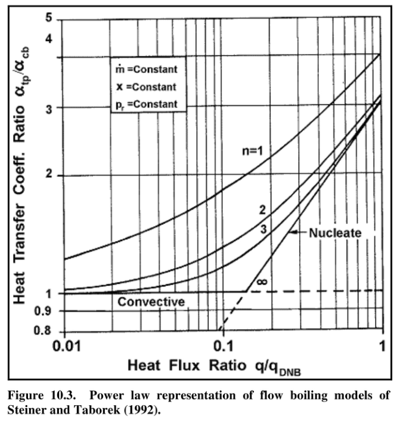

*图 10.3：Steiner and Taborek（1992）给出的流动沸腾模型幂律表示。*

## 10.3 Flow Boiling inside Vertical Plain Tubes

## 10.3 垂直光管内流动沸腾

本节讨论垂直管内对流蒸发，对应图 10.1 中的 C、D、E 和 F 区。这一过程可以是强制对流，例如动力锅炉或直接膨胀蒸发器；也可以是重力驱动，例如垂直热虹吸再沸器。高干度和高质量流率下，流型通常为环状流。较低流率且壁面过热度足够时，壁面会发生气泡成核，因此液膜中存在核态沸腾。随着流速提高并强化液膜内对流，壁面可能被冷却到低于维持成核所需的最小过热度，此时核态沸腾被抑制，传热只由穿过液膜的对流和液膜界面蒸发承担。

在某个阈值干度处，液膜可能干涸，也可能被高速蒸汽相夹带走，导致传热恶化。这一干涸后区域不在本章讨论范围内。

核态池沸腾中，传热强烈依赖热通量；而在局部强制对流蒸发中，局部干度和质量速度成为新的重要参数。因此，预测传热数据时必须同时考虑核态沸腾和对流传热。核态沸腾通常在低干度和高热通量下占主导；对流传热通常在高干度、高质量速度和低热通量下占主导；中间条件下两者常常都重要。

下面列出垂直管内两相流动沸腾传热系数的主要预测方法。一般而言，核态沸腾系数 αnb 取自文献中的池沸腾关联式，或作为流动沸腾关联式的一部分重新提出；对流传热系数 αcb 通常与“仅液体流动”传热系数 αL 相关，αL 一般用 Dittus-Boelter（1930）单相湍流管流关联式计算。这些方法通常假定通道中的液体份额，也就是 m(1 - x)，占据整个截面来计算 αL。

### 10.3.1 Chen Correlation

### 10.3.1 Chen 关联式

Chen（1963, 1966）提出了第一个得到广泛使用的垂直管蒸发流动沸腾关联式。他把局部两相流动沸腾系数 αtp 看作核态沸腾贡献和对流贡献之和：

$$
\alpha_{tp}
=
\alpha_{nb}
+
\alpha_{cb}
\tag{10.3.1}
$$

Chen 认为，与池沸腾相比，强制对流条件下管壁附近液体中的温度梯度更陡，会部分抑制沸腾成核点，从而降低核态沸腾贡献；另一方面，蒸发生成的蒸汽提高液体速度，使对流贡献相对于单相液体流动提高。因此他把式子写成：

$$
\alpha_{tp}
=
\alpha_{FZ}S
+
\alpha_{L}F
\tag{10.3.2}
$$

其中 αFZ 由 Forster-Zuber（1955）核态池沸腾关联式计算；S 是作用在 αFZ 上的成核沸腾抑制因子；αL 由 Dittus-Boelter（1930）湍流管流关联式计算；F 是表示两相流提高液相对流贡献的乘子。

Forster-Zuber 关联式给出的核态池沸腾系数为：

$$
\alpha_{FZ}
=
0.00122
\left[
\frac{
k_L^{0.79}c_{p,L}^{0.45}\rho_L^{0.49}
}{
\sigma^{0.5}\mu_L^{0.29}h_{LG}^{0.24}\rho_G^{0.24}
}
\right]
\Delta T_{sat}^{0.24}
\Delta p_{sat}^{0.75}
\tag{10.3.3}
$$

其中壁面过热度 ΔTsat 是管内壁温 Twall 与局部饱和温度 Tsat 的差，即 ΔTsat = Twall - Tsat。压力差 Δpsat 由壁温对应蒸汽压 pwall 与饱和温度对应蒸汽压 psat 相减得到，即 Δpsat = pwall - psat，式中 Δpsat 使用 N/m2。

液相对流系数采用 Dittus-Boelter 形式：

$$
\frac{\alpha_L d_i}{k_L}
=
0.023Re_L^{0.8}Pr_L^{0.4}
\tag{10.3.4}
$$

液相 Reynolds 数为：

$$
Re_L
=
\frac{\dot{m}(1-x)d_i}{\mu_L}
\tag{10.3.5}
$$

液相 Prandtl 数为：

$$
Pr_L
=
\frac{c_{p,L}\mu_L}{k_L}
\tag{10.3.6}
$$

Chen 的两相乘子 F 为：

$$
F
=
\left(
\frac{1}{X_{tt}}
+
0.213
\right)^{0.736}
\tag{10.3.7}
$$

Martinelli 参数 Xtt 用于表示两相流对对流项的影响，定义为：

$$
X_{tt}
=
\left(
\frac{1-x}{x}
\right)^{0.9}
\left(
\frac{\rho_G}{\rho_L}
\right)^{0.5}
\left(
\frac{\mu_L}{\mu_G}
\right)^{0.1}
\tag{10.3.8}
$$

当 1/Xtt 小于或等于 0.1 时，F 取 1.0。Chen 的沸腾抑制因子为：

$$
S
=
\frac{1}{
1+0.00000253Re_{tp}^{1.17}
}
\tag{10.3.9}
$$

其中两相 Reynolds 数为：

$$
Re_{tp}
=
Re_LF^{1.25}
\tag{10.3.10}
$$

Chen 数据库包括上升流和下降流水，以及甲醇、环己烷、正戊烷、正庚烷和苯的上升流数据。多数数据位于低干度，但覆盖干度约 0.01 到 0.71。该关联式适用于加热壁面保持润湿的范围，也就是直到干涸起始前。由于给定热通量时壁面过热度通常未知，实际计算需要对 Twall 和对应饱和压力差进行迭代。

### 10.3.2 Shah Correlation

### 10.3.2 Shah 关联式

Shah（1982）提出了另一种得到广泛关注的垂直通道蒸发方法。他同样认为核态沸腾和对流沸腾是两个主要机制，但不把两者相加，而是取其核态沸腾系数 αnb 和对流沸腾系数 αcb 中较大者作为局部两相流动沸腾系数 αtp。

Shah 方法也适用于水平管。垂直管版本从无量纲参数 N 开始。垂直管中，在任意液相 Froude 数下：

$$
N=C_o
\tag{10.3.11}
$$

Co 由局部干度和密度比确定：

$$
C_o
=
\left(
\frac{1-x}{x}
\right)^{0.8}
\left(
\frac{\rho_G}{\rho_L}
\right)^{0.5}
\tag{10.3.12}
$$

液相 Froude 数定义为：

$$
Fr_L
=
\frac{\dot{m}^{2}}{\rho_L^2 g d_i}
\tag{10.3.13}
$$

Shah 用液体份额 m(1 - x) 计算 Dittus-Boelter 液相对流系数。对流沸腾系数按下式计算：

$$
\frac{\alpha_{cb}}{\alpha_L}
=
\frac{1.8}{N^{0.8}}
\tag{10.3.14}
$$

热通量对核态沸腾的影响由 Boiling number Bo 表示。Bo 表示实际热通量与将液体完全蒸发所需最大热通量之比：

$$
Bo
=
\frac{q}{\dot{m}h_{LG}}
\tag{10.3.15}
$$

然后按 N 和 Bo 的范围选择核态沸腾分段公式。当 N > 1.0 且 Bo > 0.0003 时：

$$
\frac{\alpha_{nb}}{\alpha_L}
=
230Bo^{0.5}
\tag{10.3.16}
$$

当 N > 1.0 且 Bo < 0.0003 时：

$$
\frac{\alpha_{nb}}{\alpha_L}
=
1+46Bo^{0.5}
\tag{10.3.17}
$$

当 1.0 > N > 0.1 时：

$$
\frac{\alpha_{nb}}{\alpha_L}
=
F_sBo^{0.5}\exp(2.74N-0.1)
\tag{10.3.18}
$$

当 N < 0.1，即处于气泡抑制区时：

$$
\frac{\alpha_{nb}}{\alpha_L}
=
F_sBo^{0.5}\exp(2.74N-0.15)
\tag{10.3.19}
$$

上述式中，Bo > 0.0011 时 Shah 常数 Fs = 14.7；Bo < 0.0011 时 Fs = 15.43。然后取 αnb 和 αcb 中较大的值作为 αtp。

Shah 方法的重要弱点在于：用于表征核态沸腾的 Bo 中唯一物性是潜热；但潜热随压力升高而降低，而核态沸腾传热系数通常随压力升高而增大。

Shah 也把该方法用于垂直环隙蒸发。若内外管环隙宽度大于 4 mm，等效直径取两管直径差；若小于 4 mm，则用仅基于受热周长的水力直径。

### 10.3.3 Gungor-Winterton Correlations

### 10.3.3 Gungor-Winterton 关联式

Gungor and Winterton（1986）提出了 Chen 模型的新形式。他们整理了文献中 3693 个数据点，流体包括水、R-11、R-12、R-22、R-113、R-114 和乙二醇，主要为垂直上升流，也包含部分下降流。他们的局部两相沸腾系数仍由核态沸腾和对流两部分组成：

$$
\alpha_{tp}
=
E\alpha_L
+
S\alpha_{nb}
\tag{10.3.20}
$$

其中 αL 仍由 Dittus-Boelter 关联式计算，使用局部液体份额 m(1 - x)；核态池沸腾系数则由 Cooper（1984b）方程得到：

$$
\alpha_{nb}
=
55p_r^{0.12}
\left(
-0.4343\ln p_r
\right)^{-0.55}
M^{-0.5}
q^{0.67}
\tag{10.3.21}
$$

上式是有量纲形式，得到的传热系数单位为 W/(m2 K)，热通量 q 必须以 W/m2 输入。M 为分子量，pr 为约化压力，即饱和压力 psat 与临界压力 pcrit 之比。

两相对流乘子 E 是 Martinelli 参数和 Boiling number 的函数：

$$
E
=
1
+
24000Bo^{1.16}
+
1.37
\left(
\frac{1}{X_{tt}}
\right)^{0.86}
\tag{10.3.22}
$$

沸腾抑制因子 S 为：

$$
S
=
\left[
1+0.00000115E^2Re_L^{1.17}
\right]^{-1}
\tag{10.3.23}
$$

其中 ReL 基于 m(1 - x)。与其数据库相比，该方法平均偏差约为 21.4%，显著好于 Chen 方法；Shah 方法在同一数据库上也显示出相近精度，这给 Shah 方法的独立准确性提供了支持。

Gungor and Winterton（1987）又提出了只基于对流沸腾的简化版本：

$$
\alpha_{tp}
=
E_{new}\alpha_L
\tag{10.3.24}
$$

新的两相对流乘子 Enew 为：

$$
E_{new}
=
1
+
3000Bo^{0.86}
+
1.12
\left(
\frac{x}{1-x}
\right)^{0.75}
\left(
\frac{\rho_L}{\rho_V}
\right)^{0.41}
\tag{10.3.25}
$$

Thome（1997a）在与 R-134a 流动沸腾数据对比后，推荐这一新版作为两者中较好的形式。

### 10.3.4 Steiner-Taborek Asymptotic Model

### 10.3.4 Steiner-Taborek 渐近模型

在提出新方法前，Steiner and Taborek（1992）给出了垂直管蒸发传热系数应满足的自然限制：

- 当热通量低于成核沸腾起始阈值 qONB 时，只计入对流贡献，不计入核态沸腾贡献。
- 当热通量很高时，核态沸腾贡献应占主导。
- 当 x = 0 时，若 q 小于 qONB，αtp 应等于单相液体对流系数；若 q 大于 qONB，αtp 应对应单相液体对流加核态沸腾贡献。
- 当 x = 1.0 时，若流中已无液滴，αtp 应等于全部流量作为蒸汽时的强制对流系数 αg。

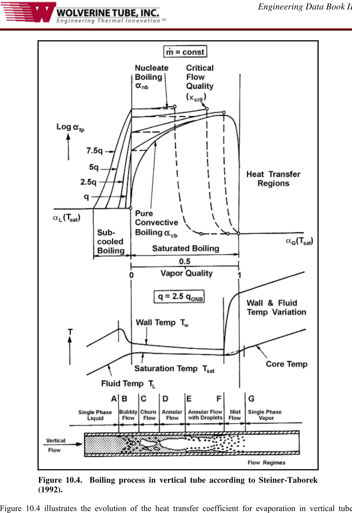

*图 10.4：Steiner and Taborek（1992）给出的垂直管沸腾过程。*

图 10.4 说明了这些限制下垂直管蒸发传热系数的演化。A-B 区只有对过冷液体的单相对流，若热通量高于 qONB 则出现过冷沸腾。B-C-D 区中，热通量低于 qONB 时沿“纯对流沸腾”曲线发展；热通量高于 qONB 时，核态沸腾和对流沸腾共同存在。D-E-F 区进入环状流，薄湍流环状液膜沿壁面流动，中心为蒸汽核心，并在临界干度 xcrit 处干涸。F-G 区进入雾状流，传热机制完全改变；Steiner-Taborek 模型不预测干涸后 x 大于 xcrit 的雾状流虚线区域。

Steiner and Taborek 的垂直管综合模型采用 n = 3 的渐近叠加形式：

$$
\alpha_{tp}
=
\left[
\left(\alpha_{nb,o}F_{nb}\right)^3
+
\left(\alpha_{Lt}F_{tp}\right)^3
\right]^{1/3}
\tag{10.3.26}
$$

式中，αnb,o 是约化压力 pr = 0.1、参考热通量 qo 下的局部核态池沸腾系数；Fnb 是核态沸腾修正因子，不是抑制因子；αLt 是把总流量视为液体时的局部液相强制对流系数；Ftp 是两相乘子。液相强制对流系数不再使用 Dittus-Boelter，而采用 Gnielinski（1976）关联式。对液体：

$$
\frac{\alpha_{Lt} d_i}{k_L}
=
\frac{
(f_L/8)(Re_{Lt}-1000)Pr_L
}{
1+12.7(f_L/8)^{1/2}(Pr_L^{2/3}-1)
}
\tag{10.3.27}
$$

液体 Fanning 摩擦因子为：

$$
f_L
=
\left[
0.7904\ln(Re_{Lt})-1.64
\right]^{-2}
\tag{10.3.28}
$$

液体 Reynolds 数用总质量速度计算：

$$
Re_{Lt}
=
\frac{\dot{m} d_i}{\mu_L}
\tag{10.3.29}
$$

两相乘子 Ftp 用于对流蒸发。当 x < xcrit 且 q > qONB，或者当 q < qONB 且覆盖整个干度范围时，可用：

$$
F_{tp}
=
\left[
(1-x)^{1.5}
+
1.9x^{0.6}
\left(
\frac{\rho_L}{\rho_G}
\right)^{0.35}
\right]^{1.1}
\tag{10.3.30}
$$

当 q < qONB 时，只存在纯对流蒸发；在 x = 1 的极限下，αtp 对应全部流量作为蒸汽时的强制对流系数 αGt。汽相 Gnielinski 关联式为：

$$
\frac{\alpha_{Gt}d_i}{k_G}
=
\frac{
(f_G/8)(Re_{Gt}-1000)Pr_G
}{
1+12.7(f_G/8)^{1/2}(Pr_G^{2/3}-1)
}
\tag{10.3.31}
$$

汽相 Fanning 摩擦因子为：

$$
f_G
=
\left[
0.7904\ln(Re_{Gt})-1.64
\right]^{-2}
\tag{10.3.32}
$$

汽相 Reynolds 数同样用液体加蒸汽的总质量速度计算：

$$
Re_{Gt}
=
\frac{\dot{m}d_i}{\mu_G}
\tag{10.3.33}
$$

此时 Ftp 使用：

$$
F_{tp}
=
\left\{
\left[
(1-x)^{1.5}
+
1.9x^{0.6}(1-x)^{0.01}
\left(
\frac{\rho_L}{\rho_G}
\right)^{0.35}
\right]^{-2.2}
+
\left[
\left(
\frac{\alpha_G}{\alpha_L}
\right)
x^{0.01}
\left(1+8(1-x)^{0.7}\right)
\left(
\frac{\rho_L}{\rho_G}
\right)^{0.67}
\right]^{-2}
\right\}^{-0.5}
\tag{10.3.34}
$$

成核沸腾起始所需的最小热通量 qONB 由液相传热系数、表面张力、饱和温度、临界成核半径和潜热确定：

$$
q_{ONB}
=
\frac{
2\sigma T_{sat}\alpha_{Lt}
}{
r_o\rho_Gh_{LG}
}
\tag{10.3.35}
$$

推荐临界成核半径 ro 为 0.3 × 10-6 m。若 q 大于 qONB，流动沸腾中计入核态沸腾；低于该阈值则不计入。

Steiner-Taborek 的核态沸腾系数基于类似 Gorenflo（1993）的池沸腾方法。Table 10.1 给出了标准条件下的标准核态流动沸腾系数 αnb,o，标准条件包括约化压力 pr = 0.1、平均粗糙度 Rp,o = 1 μm，以及表中列出的热通量 q0。修正因子考虑约化压力、热通量、管径、表面粗糙度和分子量残余修正。

核态沸腾修正因子为：

$$
F_{nb}
=
F_{pf}
\left(
\frac{q}{q_o}
\right)^{nf}
\left(
\frac{d_i}{d_{i,o}}
\right)^{-0.4}
\left(
\frac{R_p}{R_{p,o}}
\right)^{0.133}
F(M)
\tag{10.3.36}
$$

pr < 0.95 时，压力修正因子 Fpf 表示核态沸腾系数随压力升高而增加：

$$
F_{pf}
=
2.816p_r^{0.45}
+
\left\{
3.4
+
\left[
\frac{1.7}{1-p_r^7}
\right]
\right\}
p_r^{3.7}
\tag{10.3.37}
$$

归一化热通量项上的核态沸腾指数 nf 为：

$$
nf
=
0.8-0.1\exp(1.75p_r)
\tag{10.3.38}
$$

除低温液体外使用上式；对于氮、氧等低温流体，取：

$$
nf
=
0.7-0.13\exp(1.105p_r)
\tag{10.3.39}
$$

标准管参考直径 di,o 为 0.01 m，即 10 mm；标准表面粗糙度 Rp,o 为 1 μm。残余分子量修正因子以液体分子量 M 表示，在 10 < M < 187 范围内有效：

$$
F(M)
=
0.377
+
0.199\ln(M)
+
0.000028427M^2
\tag{10.3.40}
$$

F(M) 最大取 2.5，即使上式给出更大值也如此。对于低温液体 H2 和 He，F(M) 分别取 0.35 和 0.86。

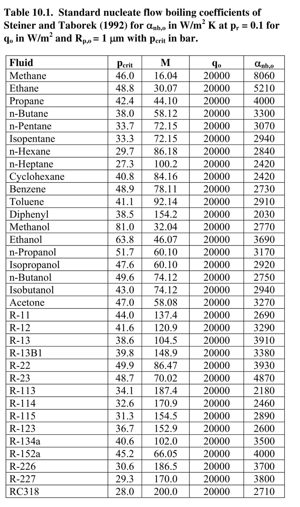

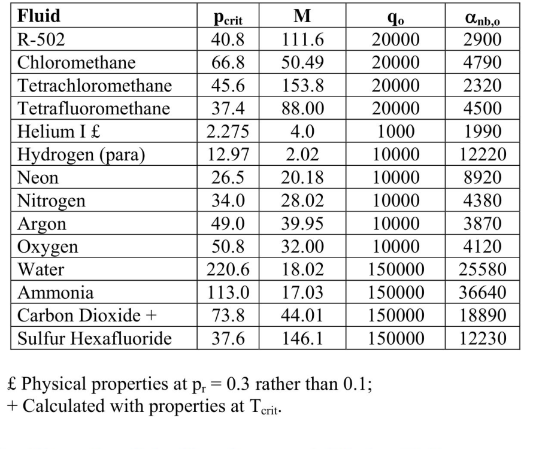

*表 10.1：Steiner and Taborek（1992）的标准核态流动沸腾系数。该表跨 PDF 292-293 页；下表为按源图逐项核对后的可检索转写，源图仍保留用于复核。*

| Fluid | pcrit bar | M | qo W/m2 | αnb,o W/(m2 K) |
|---|---:|---:|---:|---:|
| Methane | 46.0 | 16.04 | 20000 | 8060 |
| Ethane | 48.8 | 30.07 | 20000 | 5210 |
| Propane | 42.4 | 44.10 | 20000 | 4000 |
| n-Butane | 38.0 | 58.12 | 20000 | 3300 |
| n-Pentane | 33.7 | 72.15 | 20000 | 3070 |
| Isopentane | 33.3 | 72.15 | 20000 | 2940 |
| n-Hexane | 29.7 | 86.18 | 20000 | 2840 |
| n-Heptane | 27.3 | 100.2 | 20000 | 2420 |
| Cyclohexane | 40.8 | 84.16 | 20000 | 2420 |
| Benzene | 48.9 | 78.11 | 20000 | 2730 |
| Toluene | 41.1 | 92.14 | 20000 | 2910 |
| Diphenyl | 38.5 | 154.2 | 20000 | 2030 |
| Methanol | 81.0 | 32.04 | 20000 | 2770 |
| Ethanol | 63.8 | 46.07 | 20000 | 3690 |
| n-Propanol | 51.7 | 60.10 | 20000 | 3170 |
| Isopropanol | 47.6 | 60.10 | 20000 | 2920 |
| n-Butanol | 49.6 | 74.12 | 20000 | 2750 |
| Isobutanol | 43.0 | 74.12 | 20000 | 2940 |
| Acetone | 47.0 | 58.08 | 20000 | 3270 |
| R-11 | 44.0 | 137.4 | 20000 | 2690 |
| R-12 | 41.6 | 120.9 | 20000 | 3290 |
| R-13 | 38.6 | 104.5 | 20000 | 3910 |
| R-13B1 | 39.8 | 148.9 | 20000 | 3380 |
| R-22 | 49.9 | 86.47 | 20000 | 3930 |
| R-23 | 48.7 | 70.02 | 20000 | 4870 |
| R-113 | 34.1 | 187.4 | 20000 | 2180 |
| R-114 | 32.6 | 170.9 | 20000 | 2460 |
| R-115 | 31.3 | 154.5 | 20000 | 2890 |
| R-123 | 36.7 | 152.9 | 20000 | 2600 |
| R-134a | 40.6 | 102.0 | 20000 | 3500 |
| R-152a | 45.2 | 66.05 | 20000 | 4000 |
| R-226 | 30.6 | 186.5 | 20000 | 3700 |
| R-227 | 29.3 | 170.0 | 20000 | 3800 |
| RC318 | 28.0 | 200.0 | 20000 | 2710 |
| R-502 | 40.8 | 111.6 | 20000 | 2900 |
| Chloromethane | 66.8 | 50.49 | 20000 | 4790 |
| Tetrachloromethane | 45.6 | 153.8 | 20000 | 2320 |
| Tetrafluoromethane | 37.4 | 88.00 | 20000 | 4500 |
| Helium I £ | 2.275 | 4.0 | 1000 | 1990 |
| Hydrogen (para) | 12.97 | 2.02 | 10000 | 12220 |
| Neon | 26.5 | 20.18 | 10000 | 8920 |
| Nitrogen | 34.0 | 28.02 | 10000 | 4380 |
| Argon | 49.0 | 39.95 | 10000 | 3870 |
| Oxygen | 50.8 | 32.00 | 10000 | 4120 |
| Water | 220.6 | 18.02 | 150000 | 25580 |
| Ammonia | 113.0 | 17.03 | 150000 | 36640 |
| Carbon Dioxide + | 73.8 | 44.01 | 150000 | 18890 |
| Sulfur Hexafluoride | 37.6 | 146.1 | 150000 | 12230 |

注：Helium I 的物性按 pr = 0.3 而非 0.1；Carbon Dioxide 按 Tcrit 下的物性计算。

该方法数据库包括 10262 个水数据点，以及 2345 个制冷剂、烃类、低温流体和氨数据点。原书认为它是当时纯流体垂直管沸腾最准确的关联式之一。不过，由于混合物缺少简单方式确定 αnb,o，它较难直接推广到混合物。

## 10.4 Flow Boiling inside Horizontal Plain Tubes

## 10.4 水平光管内流动沸腾

图 10.5 展示了水平蒸发器管内生成蒸汽时可能形成的流型。该图表示一根水平圆管，均匀低热通量加热，入口为略低于饱和温度的液体，入口速度较低。与垂直上升流相比，重力导致汽相和液相分布不对称，从而引入新的复杂性。

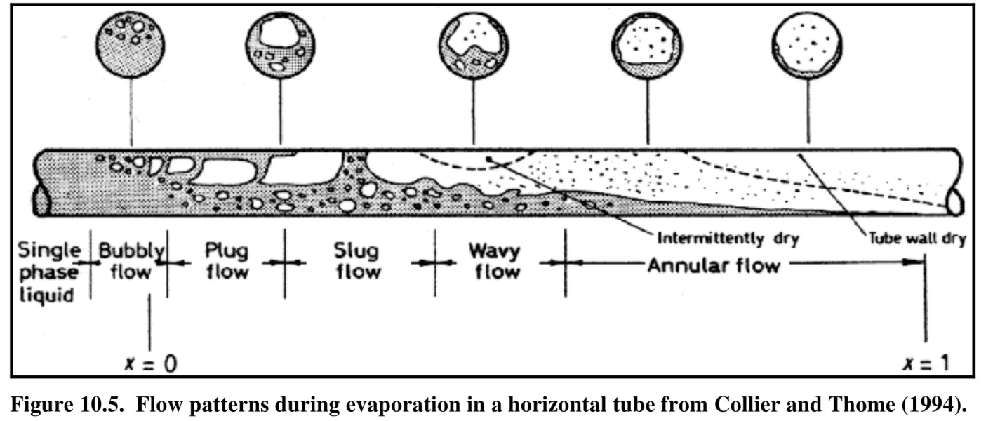

*图 10.5：Collier and Thome（1994）给出的水平管蒸发流型。*

从传热角度，必须注意管周局部完全干壁或间歇干壁的可能性，尤其是在弹状流、波状流，以及局部干涸的环状流中。例如在环状流中，管底液膜厚于管顶，干涸往往从顶部开始，并沿流动方向绕管周逐步扩大。在波状流中，如果波能冲刷管顶，则管顶可能间歇干；如果波达不到管顶，则管顶可能总是干的。波经过后留下的薄液膜，可能在下一波到来前完全蒸发，也可能不完全蒸发。

### 10.4.1 Vertical Tube Methods Applied to Horizontal Tubes

### 10.4.1 垂直管方法用于水平管

许多水平光管局部流动沸腾传热系数方法，都是把垂直管方法适配到水平管数据上，例如 Shah（1982）、Gungor and Winterton（1986, 1987）、Klimenko（1988）、Kandlikar（1990）和 Wattelet 等（1994）。Shah 用液相 Froude 数设置分层与非分层流的阈值：

$$
Fr_L
=
\frac{\dot{m}^{2}}{\rho_L^2 g d_i}
\tag{10.4.1}
$$

当 FrL 小于 0.04 时，流动被视为分层；大于 0.04 时视为非分层。非分层时直接使用垂直管方法；分层时按液相 Froude 数修正 N：

$$
N
=
0.38Fr_L^{-0.3}C_o
\tag{10.4.2}
$$

Gungor and Winterton 也采用类似思路，但阈值设为 FrL = 0.05。对于低 FrL，他们修正 E 和 S：

$$
E_2
=
Fr_L^{(0.1-2Fr_L)}
\tag{10.4.3}
$$

$$
S_2
=
Fr_L^{1/2}
\tag{10.4.4}
$$

这些修正倾向于降低低质量速度下的两相沸腾传热系数，而在大质量速度下基本不改变结果。但原书强调，液相 Froude 数并不能可靠预测分层起始。Kattan、Thome and Favrat（1995a）把该阈值与各种制冷剂的实验流型观察直接对比，发现误差可达 10 到 16 倍。因此，这类方法在分层类流型下通常不能可靠预测传热。它们的优点是方程少，实施很快；缺点是只区分分层与非分层，不认识水平沸腾中更细的流型，不捕捉高干度环状流顶部干涸导致的传热峰值和随后的急剧下降，也没有用液膜流方法直接建模环状流。

### 10.4.2 Local Flow Pattern Evaporation Model of Kattan-Thome-Favrat

### 10.4.2 Kattan-Thome-Favrat 局部流型蒸发模型

Kattan、Thome and Favrat（1998a, 1998b, 1998c）提出了更具现象学特征的方法，把局部两相流结构与局部流型联系起来。该方法基于他们自己的水平蒸发两相流型图，覆盖完全分层流、分层波状流、间歇流、环状流和局部干涸环状流。塞状流和弹状流被归为间歇流；在间歇流中，大振幅波频繁通过，假定管壁始终保持润湿。局部干涸的环状流被视为分层波状流的一种形式。该模型不处理泡状流和雾状流。

图 10.6 给出该模型对完全分层流、分层波状流和环状流所采用的简化两相结构。完全分层流中，液体位于管底，汽体在上方，界面近似水平。环状流和间歇流中，液体份额都被视为管壁上的环状液膜，厚度为 δ。分层波状流和局部干涸环状流中，截断环状液膜沿管周变化，介于下部分层极限与环状极限之间。

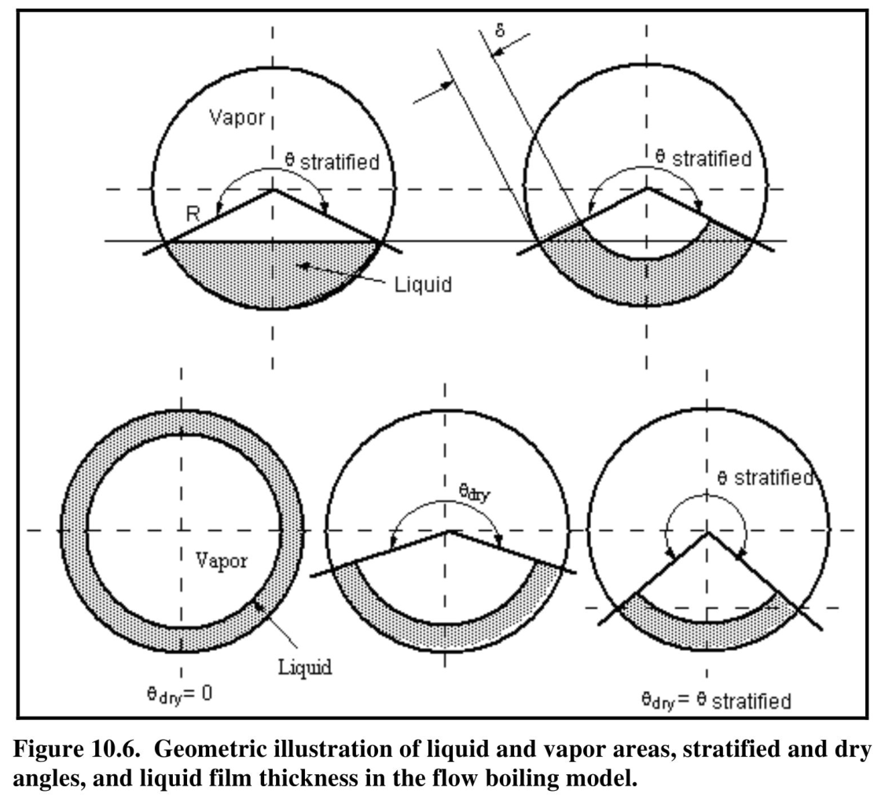

*图 10.6：流动沸腾模型中液相面积、汽相面积、分层角、干角和液膜厚度的几何示意。*

Kattan-Thome-Favrat 方法给出水平光管内局部蒸发传热系数的一般形式：

$$
\alpha_{tp}
=
\frac{
d_i\theta_{dry}\alpha_{vapor}
+
d_i(2\pi-\theta_{dry})\alpha_{wet}
}{
2\pi d_i
}
\tag{10.4.5}
$$

其中干壁周长由干角 θdry 给出；干壁面上传热系数为 αvapor；润湿周长上的传热系数为 αwet。αwet 由核态沸腾和对流沸腾按指数 3 渐近组合：

$$
\alpha_{wet}
=
\left(
\alpha_{nb}^{3}
+
\alpha_{cb}^{3}
\right)^{1/3}
\tag{10.4.6}
$$

Cooper（1984b）的有量纲约化压力关联式用于确定 αnb：

$$
\alpha_{nb}
=
55p_r^{0.12}
\left(
-\log_{10}p_r
\right)^{-0.55}
M^{-0.5}
q^{0.67}
\tag{10.4.7}
$$

该式中表面粗糙度已取 Cooper 的标准粗糙度 1.0 μm，因此粗糙度修正为 1.0；αnb 单位为 W/(m2 K)，pr 为约化压力，M 为液体分子量，q 为管壁热通量，单位为 W/m2。

把环状液体环更真实地看作液膜流而不是管流时，对流沸腾传热系数 αcb 为：

$$
\alpha_{cb}
=
0.0133
\left[
\frac{4\dot{m}(1-x)\delta}{(1-\varepsilon)\mu_L}
\right]^{0.69}
\left[
\frac{c_{p,L}\mu_L}{k_L}
\right]^{0.4}
\frac{k_L}{\delta}
\tag{10.4.8}
$$

若管周有干壁，干壁面上的汽相传热系数按汽相在其占据截面内的平均速度计算：

$$
\alpha_{vapor}
=
0.023
\left[
\frac{\dot{m}xd_i}{\varepsilon\mu_G}
\right]^{0.8}
\left[
\frac{c_{p,G}\mu_G}{k_G}
\right]^{0.4}
\frac{k_G}{d_i}
\tag{10.4.9}
$$

汽相空隙率 ε 采用 Rouhani-Axelsson（1970）漂移通量模型并经 Steiner（1993）改造为水平管形式：

$$
\varepsilon
=
\frac{x}{\rho_G}
\left\{
\left[1+0.12(1-x)\right]
\left(
\frac{x}{\rho_G}
+
\frac{1-x}{\rho_L}
\right)
+
\frac{1.18}{\dot{m}}
\left[
\frac{g\sigma(\rho_L-\rho_G)}{\rho_L^2}
\right]^{1/4}
(1-x)
\right\}^{-1}
\tag{10.4.10}
$$

液相占据的截面积 AL 由截面空隙率得到：

$$
A_L
=
A(1-\varepsilon)
\tag{10.4.11}
$$

其中 A 是管内总截面积。完全分层流中，下部液层的分层角 θstrat 满足：

$$
A_L
=
0.5r_i^2
\left[
(2\pi-\theta_{strat})
-
\sin(2\pi-\theta_{strat})
\right]
\tag{10.4.12}
$$

该隐式几何式用 AL 迭代求 θstrat。当 x < xmax 时，干角在高、低质量速度边界之间按线性插值得到：

$$
\theta_{dry}
=
\theta_{strat}
\left(
\frac{\dot{m}_{high}-\dot{m}}
{\dot{m}_{high}-\dot{m}_{low}}
\right)
\tag{10.4.13}
$$

对给定空隙率和干角，把液相截面积等同于被截断的环状液体环面积，可得液膜厚度：

$$
\delta
=
\frac{A_L}{r_i(2\pi-\theta_{dry})}
=
\frac{A(1-\varepsilon)}{r_i(2\pi-\theta_{dry})}
=
\frac{\pi d_i(1-\varepsilon)}
{2(2\pi-\theta_{dry})}
\tag{10.4.14}
$$

当 x > xmax 时，干角沿水平方向按下式外推：

$$
\theta_{dry}
=
(2\pi-\theta_{max})
\left(
\frac{x-x_{max}}{1-x_{max}}
\right)
+
\theta_{max}
\tag{10.4.15}
$$

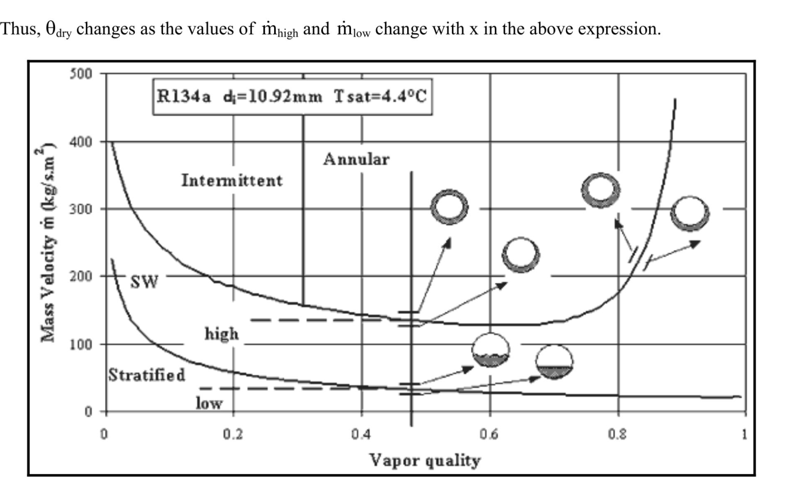

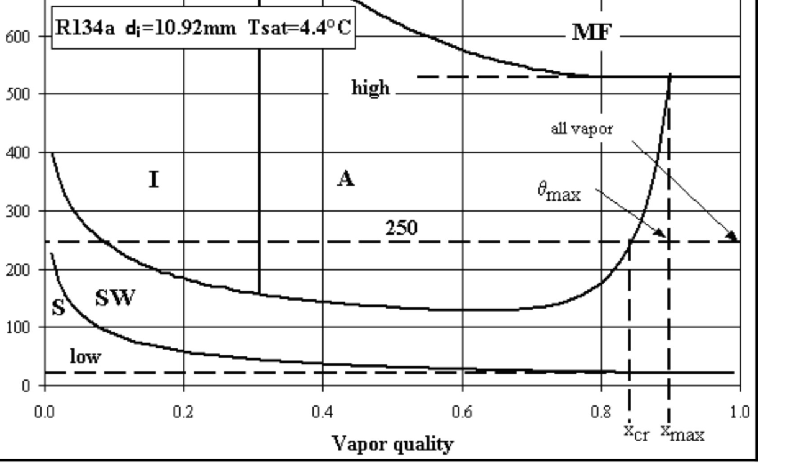

*图 10.7 和图 10.8：Kattan-Thome-Favrat 模型中不同干度范围下的流型图位置和干角处理。*

Zurcher、Thome and Favrat（1999）把该模型扩展到氨蒸发，并覆盖较低质量速度、很低约化压力和较高热通量。原书列出的验证范围包括 R-134a、R-123、R-502、R-402A、R-404A、R-407C 和氨，以及铜、碳钢和不锈钢管。对于环状流，该模型精度与 Shah、Jung 等、Gungor-Winterton 方法相近，但优势在于知道何时存在环状流，并能得到更正确的 αtp 随 x 变化斜率。对于分层波状流，该模型比这些方法更准确；在直接膨胀蒸发器常见的高干度范围，它也显著优于传统方法。

图 10.9 给出用 Kattan-Thome-Favrat 模型对 60 °C 饱和正丁烷的流型图和传热系数预测。模型在流型边界处保持传热系数连续。低质量速度下完全分层流覆盖全干度范围，αtp 随干角增加而单调下降；中等质量速度下出现分层波状流和适度峰值；更高质量速度下，先经历间歇流，再进入环状流并随液膜变薄传热增强，干涸起始后传热系数快速下降。

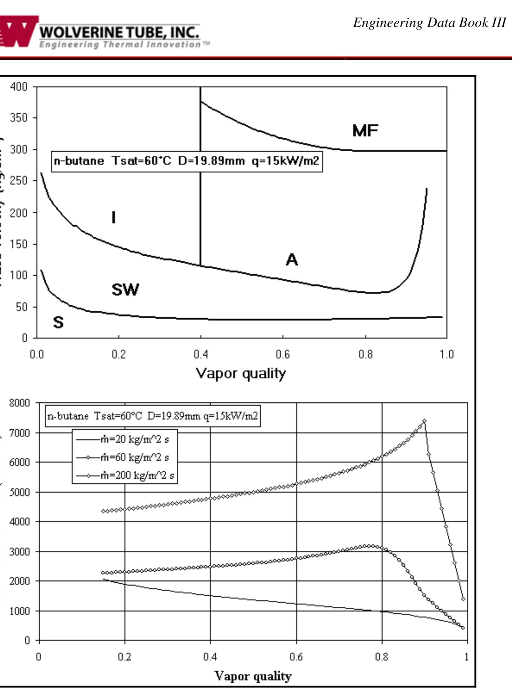

*图 10.9：Kattan-Thome-Favrat 模型对 60 °C 正丁烷的流型图和传热预测。*

### 10.4.3 Evaporation of Mixtures

### 10.4.3 混合物蒸发

Kattan-Thome-Favrat 模型被构造成可用于纯流体、共沸混合物和多组分非共沸混合物。多组分非共沸混合物在蒸发时存在温度滑移，例如 R-407C。模型通过把 Thome（1989）的混合物沸腾方程引入 Cooper 关联式，将液相传质对核态沸腾贡献的影响纳入计算。

关键修正是传质阻力因子 Fc。沸程 ΔTbp 为局部液相组成下露点温度减去泡点温度。Fc 定义为：

$$
F_c
=
\left\{
1
+
\left(
\frac{\alpha_{id}}{q}
\right)
\Delta T_{bp}
\left[
1-\exp
\left(
\frac{-q}{\rho_Lh_{LG}\beta_L}
\right)
\right]
\right\}^{-1}
\tag{10.4.16}
$$

对于非共沸混合物，沸程 ΔTbp 大于 0，因此 Fc 小于 1；对于纯流体和共沸混合物，ΔTbp 为 0，因此 Fc 等于 1。非共沸混合物的核态沸腾传热系数通过把 Fc 纳入 Cooper 关联式得到：

$$
\alpha_{nb}
=
55p_r^{0.12}
\left(
-\log_{10}p_r
\right)^{-0.55}
M^{-0.5}
q^{0.67}
F_c
\tag{10.4.17}
$$

其中 q 是总局部热通量，pr 和 M 为液体混合物的约化压力和分子量。传质系数 βL 取固定值 0.0003 m/s；理想传热系数 αid 先按式（10.4.17）并令 Fc = 1.0 求得。该方法适用于沸程最高约 30 K 的混合物，因此覆盖许多工业相关的非共沸制冷剂混合物和烃类混合物。

### 10.4.4 Instructions for Implementation of Kattan-Thome-Favrat Model

### 10.4.4 Kattan-Thome-Favrat 模型实施步骤

Kattan-Thome-Favrat 模型比早期方法步骤更多。给定管内径、质量速度、热通量、压力、干度和物性后，原书给出的实施顺序可整理为：

1. 用 Kattan-Thome-Favrat 水平蒸发流型图确定局部流型。
2. 计算局部汽相空隙率。
3. 计算局部液相截面积 AL。
4. 若为环状流或间歇流，令 θdry = 0 并求液膜厚度 δ。
5. 若为分层波状流，包括流型图归入分层波状流的顶部局部干涸环状流，迭代计算 θdry，再求液膜厚度 δ。
6. 若为完全分层流，迭代计算分层角 θstrat，并令 θdry = θstrat 后求 δ。
7. 计算 αcb。
8. 若部分管壁为干壁，计算 αvapor。
9. 若流体为纯流体或共沸混合物，直接用总局部热通量 q 确定 αnb。
10. 若流体为非共沸混合物，确定理想核态沸腾项、传质因子 Fc 和混合物修正后的 αnb。
11. 用 αnb 和 αcb 求 αwet。
12. 求局部流动沸腾系数 αtp。

### 10.4.5 Updated Version of Kattan-Thome-Favrat Model

### 10.4.5 Kattan-Thome-Favrat 模型更新版

Wojtan、Ursenbacher and Thome（2005a）改进了流型图，Wojtan、Ursenbacher and Thome（2005b）改进了传热模型。主要变化包括：把分层波状区分为三个新子区；修改环状流区并加入固定的核态沸腾抑制因子；加入雾状流传热模型；加入干涸区传热方法。原书说明，雾状流和干涸区方法在第 18 章讨论，本章不展开。

原始 Kattan-Thome-Favrat 模型在分层波状流中假定干角线性变化。Thome、El Hajal and Cavallini（2003）在水平管冷凝模型中采用二次插值：

$$
\theta_{dry}
=
\theta_{strat}
\left[
\frac{\dot{m}_{high}-\dot{m}}
{\dot{m}_{high}-\dot{m}_{low}}
\right]^{0.5}
\tag{10.4.18}
$$

Wojtan-Ursenbacher-Thome 更新版进一步把分层波状区分为 slug、slug/stratified-wavy 和 stratified-wavy 三个子区，从而改变干角计算。Slug 区高频液塞可保持上部管周有连续薄液膜，因此：

$$
\theta_{dry}
=
0
\tag{10.4.19}
$$

Stratified-wavy 区用 0.61 指数描述波对侧壁润湿的影响：

$$
\theta_{dry}
=
\theta_{strat}
\left[
\frac{\dot{m}_{high}-\dot{m}}
{\dot{m}_{high}-\dot{m}_{low}}
\right]^{0.61}
\tag{10.4.20}
$$

Slug/stratified-wavy 区中，随着干度增加，液塞频率降低，小振幅波逐渐占主导。为避免该区边界传热系数跳变，当 x < xIA 时采用：

$$
\theta_{dry}
=
\theta_{strat}
\left(
\frac{x}{x_{IA}}
\right)
\left[
\frac{\dot{m}_{high}-\dot{m}}
{\dot{m}_{high}-\dot{m}_{low}}
\right]^{0.61}
\tag{10.4.21}
$$

更新模型还修改了液膜厚度计算，改用：

$$
\delta
=
\frac{d_i}{2}
-
\left[
\left(
\frac{d_i}{2}
\right)^2
-
\frac{2A_L}{2\pi-\theta_{dry}}
\right]^{1/2}
\tag{10.4.22}
$$

当低干度下液体占据超过一半截面且上式给出 δ 大于 di/2 时，将 δ 限制为 di/2。分层角 θstrat 使用 Biberg（1999）表达式并用式（10.4.10）的 ε 非迭代计算：

$$
\theta_{strat}
=
2\pi
-
2
\left\{
\pi(1-\varepsilon)
+
\left(
\frac{3\pi}{2}
\right)^{1/3}
\left[
1-2(1-\varepsilon)+(1-\varepsilon)^{1/3}-\varepsilon^{1/3}
\right]
-
\frac{1}{200}(1-\varepsilon)\varepsilon
\left[
1-2(1-\varepsilon)
\right]
\left[
1+4\left((1-\varepsilon)^2+\varepsilon^2\right)
\right]
\right\}
\tag{10.4.23}
$$

核态沸腾贡献引入固定抑制因子 S = 0.8，因此式（10.4.6）变为：

$$
\alpha_{wet}
=
\left[
\left(S\alpha_{nb}\right)^3
+
\alpha_{cb}^{3}
\right]^{1/3}
\tag{10.4.24}
$$

更新后模型更准确地预测实验数据，特别是高热通量、干涸起始、干涸区和雾状流区。

图 10.10 展示了更新模型对 R-134a 的模拟：饱和温度 10 °C、质量速度 500 kg/(m2 s)、热通量 7500 W/m2、管内径 10 mm。黑线为流型转变边界，红线为预测传热系数，红色虚线为过程路径。干度 0.5 处传热系数为 6206 W/(m2 K)。

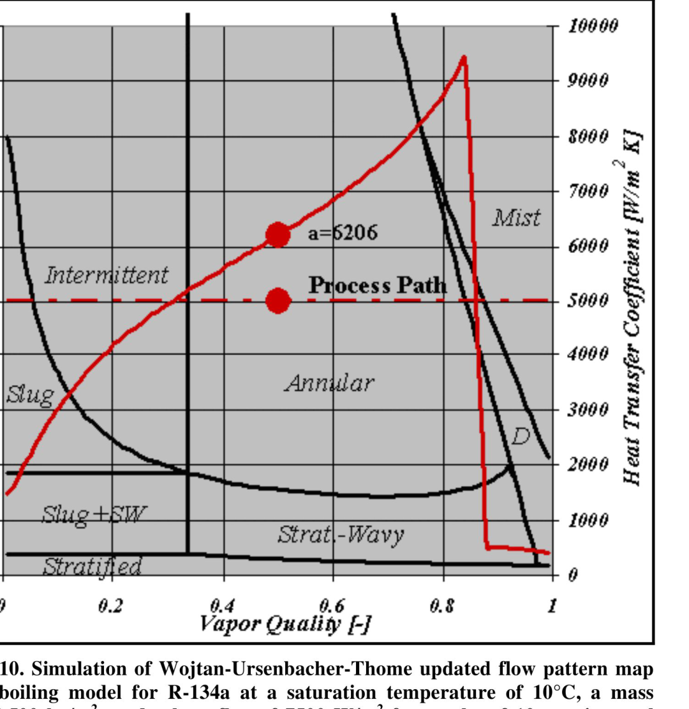

*图 10.10：Wojtan-Ursenbacher-Thome 更新流型图和流动沸腾模型模拟。*

## 10.5 Heat Transfer Measurements in Horizontal Tubes

## 10.5 水平管中的传热测量

原书讨论了一个实验问题：水平管流动沸腾传热数据是否适合用电加热测量，例如直接用管壁电阻加热或在管外缠绕加热带？这一直存在争论，当前更偏好逆流热水加热。

相关判断如下。第一，在环状流中，两种加热方式得到的 αtp 会非常接近。第二，对所有分层类流动，热液体加热会在管周诱导接近均匀的温度边界条件，更接近实际运行；而电加热会从顶部热干壁条件向底部较冷湿壁条件产生周向导热，边界条件难以确定。第三，对于管顶部局部干涸的环状流，电加热也不理想，因为试验段轴向导热会干扰测量。

过去，电加热的优势是能给出局部传热系数；热水加热通常只能给出分段平均值，或称“准局部”值，因为测试段内干度变化可能达到 3%-10% 或更高。后来可采用热流体加热，并沿热流体布置局部热电偶测量温度分布，同时配合壁面热电偶，得到真正的局部流动沸腾传热系数。若再结合修正 Wilson 图法取得环隙中加热流体侧传热系数，甚至可以不使用壁面热电偶。管外螺旋缠绕金属丝还可提高水侧传热系数并促进混合，降低分层沸腾试验中热流体从顶部到底部的温度梯度。

## 10.6 Subcooled Boiling Heat Transfer

## 10.6 过冷沸腾传热

过冷流动沸腾发生在加热过冷液体时：局部壁温高于流体饱和温度，并且足够高以发生沸腾成核。过冷沸腾的特征是在加热壁面形成孤立气泡或沿壁面的泡状层。气泡被液体带入过冷核心后凝结。

Gungor and Winterton（1986）把其关联式改造后用于预测过冷沸腾区局部传热系数。他们为核态沸腾和对流沸腾分别使用不同温差作为驱动力，因此热通量为两部分之和：

$$
q
=
\alpha_L(T_w-T_L)
+
S\alpha_{nb}(T_{wall}-T_{sat})
\tag{10.6.1}
$$

该方法预测其数据库的平均误差约为 ±25%。类似地，本章前面介绍的其他饱和强制对流蒸发方法，也可改造用于估算光管内过冷流动沸腾性能。
