# Chapter 12 Two-Phase Flow Patterns

# 第 12 章 两相流型

## 来源追踪

| 项目 | 内容 |
|---|---|
| 原书 | Engineering Data Book III |
| 章节 | Chapter 12 |
| PDF 页码 | 329-362 |
| 书内页码 | 12-1 到 12-34 |
| 进度记录 | [progress.md](./progress.md) |

完整源页截图保留在 `assets/source-page-329.png` 到 `assets/source-page-362.png`，用于逐页二校和公式复核。正文只展示局部图表资产，不嵌入整页原文图。

## 摘要

对两相流而言，液相和气相在流道中的分布是描述流动状态的关键。两相分布会形成若干常见、可识别的结构，这些结构称为两相流型。传热系数和压降都与局部两相流结构密切相关，因此流型预测是蒸发和冷凝建模的重要环节。近年的管内沸腾和冷凝传热模型通常以局部流型为基础，因此必须借助可靠的流型图判断给定局部工况下存在的流型。类似于单相流中预测层流向湍流的转变，两相流型图用于预测一种两相流型向另一种流型的转变。

本章首先描述管内垂直上升流和水平流的流型几何特征；随后给出若干常被引用的早期垂直流和水平流流型图；接着介绍较新的绝热流、水平管蒸发和水平管冷凝流型图及其流型转变方程；最后讨论水平管束外两相流的流型和相应流型图。

## 12.1 Flow Patterns in Vertical Tubes

## 12.1 垂直管内流型

在垂直管内气液并流上升时，液相和气相会形成若干可识别的流动结构。这些结构称为流型，如 Fig. 12.1 所示，可按如下方式描述。

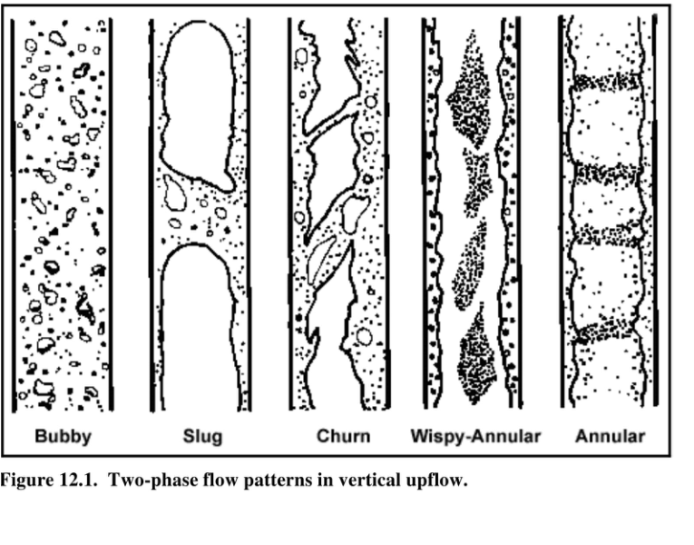

- Bubbly flow，泡状流：大量气泡以离散气泡形式分散在连续液相中。气泡的大小和形状可能相差很大，但通常近似球形，并且明显小于管径。
- Slug flow，弹状流：随着气相空隙率升高，气泡彼此接近、碰撞并聚并成尺寸接近管径的大气泡。这类气泡具有类似子弹的特征形状，前端呈半球形，尾端较钝，通常称为 Taylor 气泡。Taylor 气泡之间由液塞隔开，液塞中也可能夹带小气泡。Taylor 气泡与管壁之间存在薄液膜；即便总体流动向上，该液膜也可能因重力向下流动。
- Churn flow，搅动流：流速继续升高时，流动结构变得不稳定，流体以振荡方式上下运动，但净流向仍为向上。这种不稳定性来自重力与剪切力在 Taylor 气泡液膜上相互抗衡。搅动流实际上是弹状流和环状流之间的中间流型。在小直径管内，搅动流可能根本不发展，流动会直接从弹状流进入环状流。对于从再沸器返回精馏塔的两相传输管线或制冷剂管路网络，搅动流通常应避免，因为液塞质量可能对管路系统造成破坏性后果。
- Annular flow，环状流：当高速气相对液膜的界面剪切超过重力影响时，液体被排挤出管中心，在管壁上以薄膜形式流动，形成环形液体层；气体作为连续相沿管中心流动。界面上有高频波纹和扰动，液滴还可能被夹带进气相核心，并且夹带液体比例可能接近液膜中的液体比例。该流型相对稳定，是两相管流中通常希望得到的流型。
- Wispy annular flow，束雾环状流：流量进一步升高时，被夹带液滴可能在中心蒸汽核心中形成云团状或束状的瞬态相干结构。
- Mist flow，雾状流：在很高气相流速下，气相核心对界面的剪切会使环状液膜变薄、失稳并被破坏，全部液体以液滴形式夹带在连续气相中，类似于泡状流的反相形态。撞击壁面的液滴会间歇性地局部润湿管壁。雾状流中的液滴通常很小，若无特殊照明或放大很难观察。

## 12.2 Flow Patterns in Horizontal Tubes

## 12.2 水平管内流型

水平管内两相流型与垂直流相似，但重力会使液体趋向管底、气体趋向管顶，因此相分布受重力分层影响。气液在水平管内并流时的流型如 Fig. 12.2 所示，可分为以下几类。

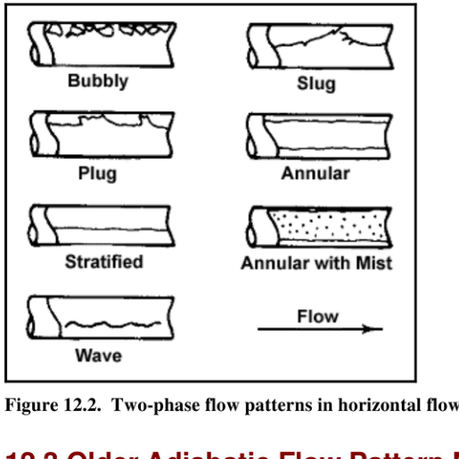

- Bubbly flow，泡状流：气泡分散在液体中，由于浮力作用，气泡在管上半部浓度较高。当剪切力占主导时，气泡会趋于在管内均匀分散。在水平流中，该流型通常只在高质量速度下出现。
- Stratified flow，分层流：在低液相速度和低气相速度下，两相完全分离，气体位于管顶，液体位于管底，中间由未受扰动的水平界面隔开。
- Stratified-wavy flow，分层波状流：从分层流开始提高气速时，界面上形成沿流向传播的波。波幅明显并取决于两相相对速度，但波峰不会达到管顶。波沿管壁两侧爬升，经过后会在管壁留下薄液膜。
- Intermittent flow，间歇流：继续提高气速后，界面波会大到足以冲刷管顶。该流型的特征是大振幅波间歇性冲刷管顶，其间夹有较小振幅波。大振幅波常含有夹带气泡。由于大波和其后留下的薄液膜，管顶几乎持续被润湿。间歇流也可看作 plug flow 和 slug flow 的复合流型。
- Plug flow，塞状流：液塞被细长气泡隔开。细长气泡直径小于管径，因此液相在气泡下方沿管底保持连续。该流型有时也称为 elongated bubble flow，即细长气泡流。
- Slug flow，弹状流：在较高气速下，细长气泡的直径接近通道高度，分隔这些气泡的液塞也可描述为大振幅波。
- Annular flow，环状流：在更高气体流量下，液体围绕管周形成连续环状液膜，类似垂直流中的环状流；但水平管内底部液膜厚于顶部。液体环与蒸汽核心之间的界面受小振幅波扰动，液滴可能分散在气相核心中。在高气相分数下，管顶处较薄的液膜会首先干涸，环状液膜只覆盖部分管周，此时该状态会被归为分层波状流。
- Mist flow，雾状流：与垂直流相同，在很高气速下，全部液体可能从壁面剥离并以小液滴形式夹带在连续气相中。

## 12.3 Older Adiabatic Flow Pattern Maps for Vertical and Horizontal Flows in Tubes

## 12.3 垂直管与水平管绝热流的早期流型图

对垂直上升流，Fig. 12.3 示意蒸发器管从入口到出口通常经历的流型顺序。流型通常在管入口处、核态沸腾起始后进入泡状流。核态沸腾起始可能发生在管内过冷区，此时气泡在加热壁面附近的过热热边界层中成核，但会在过冷核心流中冷凝。若入口过冷且热通量较低，核态沸腾也可能延迟到局部干度大于零后才开始。泡状流之后进入弹状流，再进入具有特征环状液膜的环状流。该液膜最终会干涸，或被界面蒸汽剪切夹带，使流动进入雾状流。被夹带液滴可能在干度已达到 1.0 之后仍继续存在于流动中。

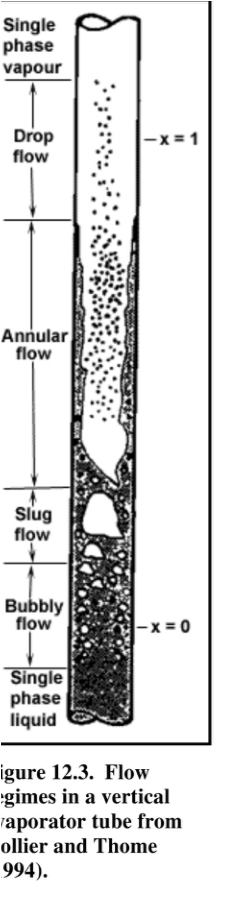

为了预测管内局部流型，需要使用流型图。流型图是显示流型之间转变边界的图，通常在对数坐标上以无量纲参数表示液相速度和气相速度。Fair（1960）与 Hewitt and Roberts（1969）提出了广泛引用的垂直上升流流型图，分别见 Fig. 12.4 和 Fig. 12.5。用于预测水平管绝热两相流型转变的常用流型图包括 Baker（1954）和 Taitel and Dukler（1976），分别见 Fig. 12.6 和 Fig. 12.7。流型图上的转变曲线应理解为转变区，而不是绝对分界线，类似于单相流层流与湍流之间的过渡区。关于两相流型转变的更全面和更基础处理，可参见 Barnea and Taitel（1986）。

使用 Fig. 12.4 所示 Fair（1960）图时，先针对具体应用计算横坐标参数和质量速度；原图中的质量速度单位为 lb/h ft2。随后用这两个值在图上作纵向和横向查找，交点位置即给出泡状流、弹状流、环状流或雾状流，图中深色线为各流型转变阈值。

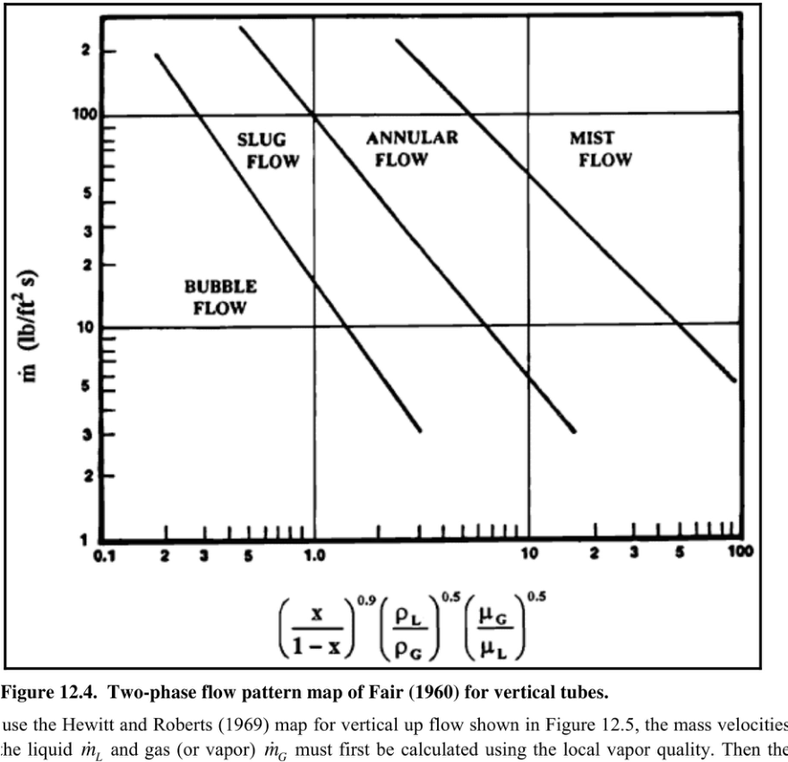

使用 Fig. 12.5 所示 Hewitt and Roberts（1969）垂直上升流图时，先由局部干度计算液相质量速度 mL 和气相或蒸汽质量速度 mG，再计算图中的 x、y 坐标。两坐标的交点给出该工况下预测存在的流型。

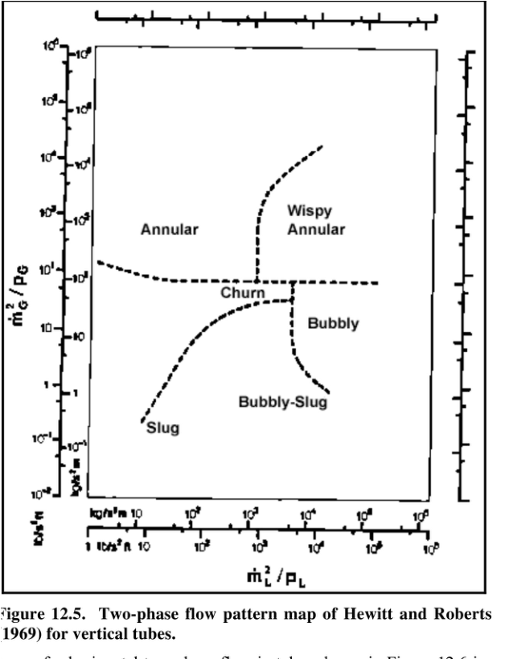

Baker（1954）水平管两相流型图见 Fig. 12.6，图中同时给出 SI 单位和英制单位。使用该图时，首先确定液相和蒸汽的质量速度，然后计算参数 λ 和 ψ。气相参数 λ 为：

$$
\lambda
=
\left(
\frac{\rho_G}{\rho_{air}}
\frac{\rho_L}{\rho_{water}}
\right)^{1/2}
\tag{12.3.1}
$$

液相参数 ψ 为：

$$
\psi
=
\left(
\frac{\sigma_{water}}{\sigma}
\right)
\left[
\left(
\frac{\mu_L}{\mu_{water}}
\right)
\left(
\frac{\rho_{water}}{\rho_L}
\right)^2
\right]^{1/3}
\tag{12.3.2}
$$

其中 ρG、ρL、μL 和 σ 为工质物性，参考物性为 ρwater = 1000 kg/m3，ρair = 1.23 kg/m3，μwater = 0.001 Ns/m2，σwater = 0.072 N/m。然后由横坐标和纵坐标确定对应流型。

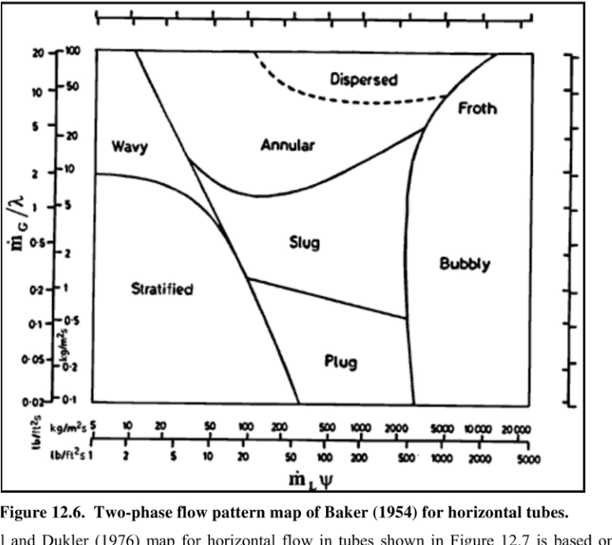

Taitel and Dukler（1976）水平管流型图见 Fig. 12.7。该图基于他们对流型转变机理的分析，并结合若干经验参数选择。该图使用 Martinelli 参数 X、气相 Froude 数 FrG 以及参数 T 和 K，由三张图组合而成。Martinelli 参数为：

$$
X
=
\left[
\frac{(dp/dz)_L}{(dp/dz)_G}
\right]^{1/2}
\tag{12.3.3}
$$

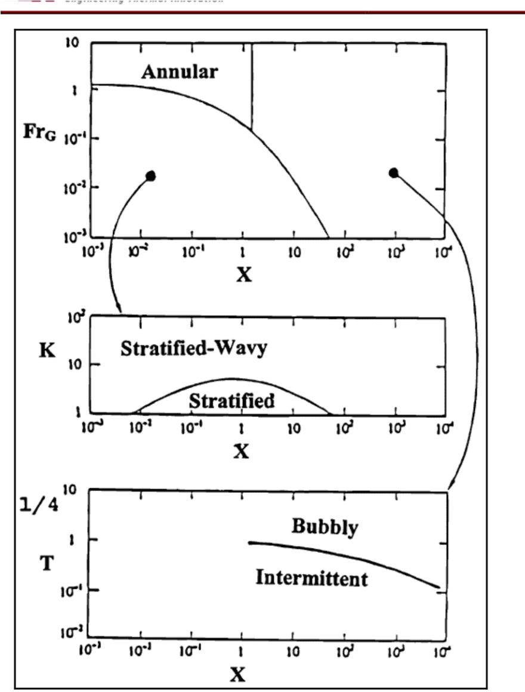

气相 Froude 数为：

$$
Fr_G
=
\frac{\dot m_G}
{\left[\rho_G(\rho_L-\rho_G)d_i g\right]^{1/2}}
\tag{12.3.4}
$$

参数 T 为：

$$
T
=
\left[
\frac{|(dp/dz)_L|}
{g(\rho_L-\rho_G)}
\right]^{1/2}
\tag{12.3.5}
$$

其中 g 为重力加速度，g = 9.81 m/s2。参数 K 为：

$$
K
=
Fr_G Re_L^{1/2}
\tag{12.3.6}
$$

液相和蒸汽相 Reynolds 数为：

$$
Re_L
=
\frac{\dot m_L d_i}{\mu_L}
\tag{12.3.7}
$$

$$
Re_G
=
\frac{\dot m_G d_i}{\mu_G}
\tag{12.3.8}
$$

相 k 的压降梯度为，其中 k 可为 L 或 G：

$$
(dp/dz)_k
=
-
\frac{2 f_k \dot m_k^2}
{\rho_k d_i}
\tag{12.3.9}
$$

当 Rek < 2000 时，采用层流摩擦因子：

$$
f_k
=
\frac{16}{Re_k}
\tag{12.3.10}
$$

当 Rek > 2000 时，采用湍流摩擦因子方程；即便在 2000 到 10000 的过渡范围内也采用该式：

$$
f_k
=
\frac{0.079}{Re_k^{1/4}}
\tag{12.3.11}
$$

实施该图时，先确定 Martinelli 参数 X 和 FrG。若在最上方图中，FrG 与 X 的坐标落入环状流区，则流型为环状流。若坐标落在上图左下区，则计算 K，并在中间图上用 K 和 X 判断是分层波状流还是完全分层流。若坐标落在上图右侧区域，则计算 T，并在下图上用 T 和 X 判断是泡状流还是间歇流，即塞状流或弹状流。

这些流型图均针对绝热两相流建立，但常被外推用于蒸发或冷凝等有热量交换的过程。与所有外推一样，这种用法不一定可靠。关于流型转变理论，可参考 Taitel（1990）的综述。

## 12.4 Flow Pattern Map for Evaporation in Horizontal Tubes

## 12.4 水平管蒸发流型图

对于水平管蒸发，Collier and Thome（1994）的 Fig. 12.8 给出了典型流型，其中包括流动结构的截面示意。对冷凝而言，流型相似；不同之处在于分层类流型中管顶不会是干壁，而会覆盖一层薄冷凝液膜。

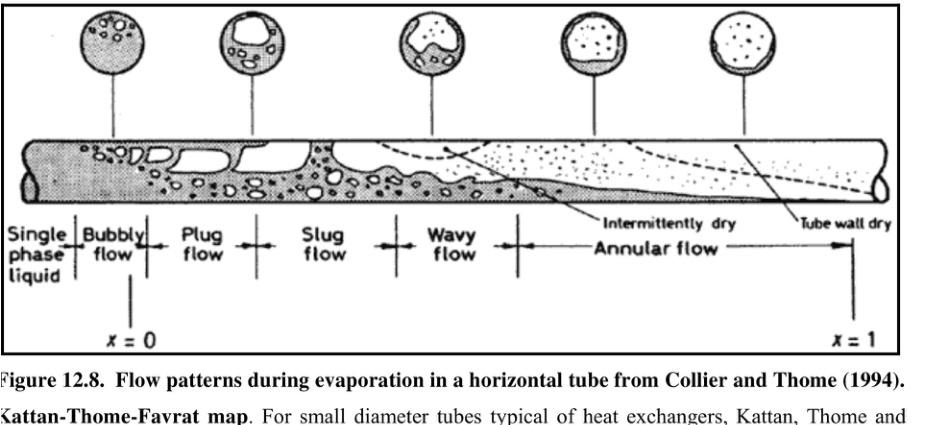

Kattan-Thome-Favrat map，Kattan-Thome-Favrat 图。针对换热器中典型小直径管，Kattan、Thome 和 Favrat（1998a、1998b、1998c）提出了对 Steiner（1993）图的修正；Steiner 图本身又是修正后的 Taitel-Dukler 图。该方法还包括预测蒸发环状流中管顶干涸起始的方法。由于第 10 章使用该流型图按局部流型预测局部流动沸腾传热系数，故本章介绍该图。Kattan-Thome-Favrat 流型图的流型转变边界见 Fig. 12.9；泡状流发生在很高质量速度下，图中未示出。该图在针对具体工质和流道的线性坐标上绘制质量速度对气相或蒸汽分数的关系，比其他对数坐标图更易使用。

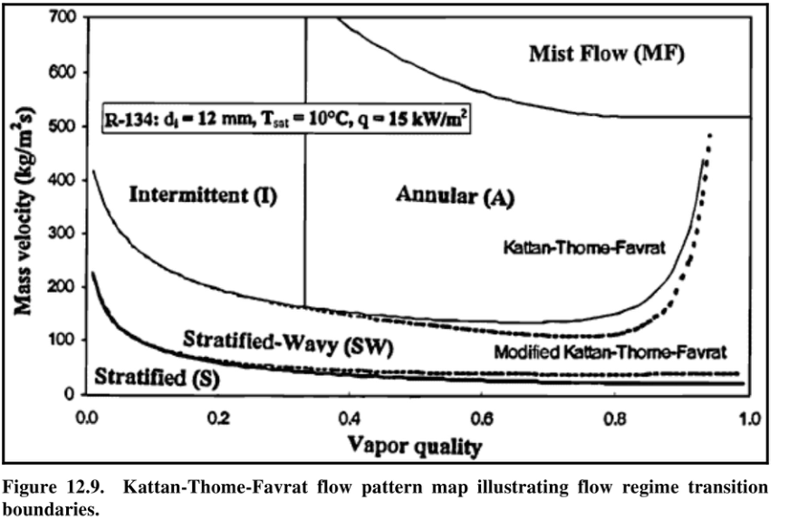

从环状流和间歇流向分层波状流的转变边界为：

$$
\dot m_{wavy}
=
\left\{
\frac{
16 A_{Gd}^3 g d_i \rho_L \rho_G
}{
x^2\pi^2\left[1-(2h_{Ld}-1)^2\right]^{0.5}
}
\left[
\frac{\pi^2}{25 h_{Ld}^2}
(1-x)^{-F_1(q)}
\left(\frac{We}{Fr}\right)_L^{-F_2(q)}
+1
\right]
\right\}^{0.5}
+50
\tag{12.4.1}
$$

该曲线的高干度部分取决于液相 Froude 数和 Weber 数之比。原文说明中将 FrL 描述为惯性力与表面张力之比、WeL 描述为惯性力与重力之比；此处按源页保留。环状流向雾状流转变的质量速度阈值为：

$$
\dot m_{mist}
=
\left\{
\frac{
7680 A_{Gd}^2 g d_i \rho_L \rho_G
}{
x^2\pi^2 \xi_{Ph}^2
}
\left(
\frac{Fr}{We}
\right)_L
\right\}^{0.5}
\tag{12.4.2}
$$

对上式求雾状流转变的最小质量速度可得到 xmin；当 x > xmin 时：

$$
\dot m_{mist}
=
\dot m_{min}
\tag{12.4.3}
$$

分层波状流与完全分层流之间的转变为：

$$
\dot m_{strat}
=
\left\{
\frac{
(226.3)^2 A_{Ld} A_{Gd}^2 \rho_G(\rho_L-\rho_G)\mu_L g
}{
x^2(1-x)\pi^3
}
\right\}^{1/3}
\tag{12.4.4}
$$

进入泡状流的转变阈值为：

$$
\dot m_{bubbly}
=
\left\{
\frac{
256 A_{Gd} A_{Ld}^2 d_i^{1.25}\rho_L(\rho_L-\rho_G)g
}{
0.3164(1-x)^{1.75}\pi^2 P_{id} \mu_L^{0.25}
}
\right\}^{1/1.75}
\tag{12.4.5}
$$

在上述方程中，We 与 Fr 之比为：

$$
\left(
\frac{We}{Fr}
\right)_L
=
\frac{g d_i^2 \rho_L}{\sigma}
\tag{12.4.6}
$$

摩擦因子为：

$$
\xi_{Ph}
=
\left[
1.138
+2\log
\left(
\frac{\pi}{1.5A_{Ld}}
\right)
\right]^{-2}
\tag{12.4.7}
$$

在 mwavy 边界方程中的无量纲经验指数 F1(q) 和 F2(q) 考虑了热通量对环状液膜干涸起始的影响，即环状流向局部干涸环状流的转变；在该图中后者被归为分层波状流。它们为：

$$
F_1(q)
=
646.0
\left(
\frac{q}{q_{DNB}}
\right)^2
+64.8
\left(
\frac{q}{q_{DNB}}
\right)
\tag{12.4.8a}
$$

$$
F_2(q)
=
18.8
\left(
\frac{q}{q_{DNB}}
\right)
+1.023
\tag{12.4.8b}
$$

Kutateladze（1948）关于偏离核态沸腾热通量的关联式用于归一化局部热通量：

$$
q_{DNB}
=
0.131\rho_G^{1/2}h_{LG}
\left[
g(\rho_L-\rho_G)\sigma
\right]^{1/4}
\tag{12.4.9}
$$

间歇流与环状流之间的竖直边界假定发生在固定 Martinelli 参数 Xtt = 0.34 处，其中 Xtt 定义为：

$$
X_{tt}
=
\left(
\frac{1-x}{x}
\right)^{0.875}
\left(
\frac{\rho_G}{\rho_L}
\right)^{0.5}
\left(
\frac{\mu_L}{\mu_G}
\right)^{0.125}
\tag{12.4.10}
$$

求解 x 后，间歇流到环状流转变在 xIA 处的阈值线为：

$$
x_{IA}
=
\left\{
\left[
0.2914
\left(
\frac{\rho_G}{\rho_L}
\right)^{-1/1.75}
\left(
\frac{\mu_L}{\mu_G}
\right)^{-1/7}
\right]
+1
\right\}^{-1}
\tag{12.4.11}
$$

Fig. 12.10 定义了流动几何尺寸：PL 是管的润湿周长，PG 是仅与蒸汽接触的干周长，h 是完全分层液层高度，Pi 是相界面长度。AL 和 AG 分别为对应截面积。用管内径 di 归一化后，可得到六个无量纲变量：

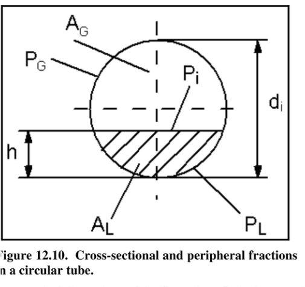

$$
h_{Ld}
=
\frac{h}{d_i},
\quad
P_{Ld}
=
\frac{P_L}{d_i},
\quad
P_{Gd}
=
\frac{P_G}{d_i},
\quad
P_{id}
=
\frac{P_i}{d_i},
\quad
A_{Ld}
=
\frac{A_L}{d_i^2},
\quad
A_{Gd}
=
\frac{A_G}{d_i^2}
\tag{12.4.12}
$$

当 hLd ≤ 0.5 时：

$$
\begin{aligned}
P_{Ld}
&=
\left[
8h_{Ld}^{0.5}
-2\left(h_{Ld}(1-h_{Ld})\right)^{0.5}
\right]/3,
\quad
P_{Gd}
=
\pi-P_{Ld}
\\
A_{Ld}
&=
\left[
12\left(h_{Ld}(1-h_{Ld})\right)^{0.5}
+8h_{Ld}^{0.5}
\right]h_{Ld}/15,
\quad
A_{Gd}
=
\frac{\pi}{4}-A_{Ld}
\end{aligned}
\tag{12.4.13}
$$

当 hLd > 0.5 时：

$$
\begin{aligned}
P_{Gd}
&=
\left[
8(1-h_{Ld})^{0.5}
-2\left(h_{Ld}(1-h_{Ld})\right)^{0.5}
\right]/3,
\quad
P_{Ld}
=
\pi-P_{Gd}
\\
A_{Gd}
&=
\left[
12\left(h_{Ld}(1-h_{Ld})\right)^{0.5}
+8(1-h_{Ld})^{0.5}
\right]\,(1-h_{Ld})/15,
\quad
A_{Ld}
=
\frac{\pi}{4}-A_{Gd}
\end{aligned}
\tag{12.4.14}
$$

当 0 ≤ hLd ≤ 1 时：

$$
P_{id}
=
2\left[h_{Ld}(1-h_{Ld})\right]^{0.5}
\tag{12.4.15}
$$

由于 h 未知，需要通过下式迭代求参考液位 hLd：

$$
X_{tt}^2
=
\left[
\left(
\frac{P_{Gd}+P_{id}}{\pi}
\right)^{1/4}
\left(
\frac{\pi^2}{64A_{Gd}^2}
\right)
\left(
\frac{P_{Gd}+P_{id}}{A_{Gd}}
+
\frac{P_{id}}{A_{Ld}}
\right)
\right]
\left(
\frac{\pi}{P_{Ld}}
\right)^{1/4}
\left(
\frac{64A_{Ld}^3}{\pi^2P_{Ld}}
\right)
\tag{12.4.16}
$$

一旦得到参考液位 hLd，即可由式（12.4.13）到式（12.4.15）计算无量纲变量，再由式（12.4.1）到式（12.4.11）确定新流型图的转变曲线。

该图由五种制冷剂数据库建立：两个单组分工质 R-134a 和 R-123、两个近共沸混合物 R-402A 和 R-404A、一个共沸混合物 R-502。试验范围包括质量速度 100 到 500 kg/m2s、干度 4% 到 100%、热通量 440 到 36500 W/m2、饱和压力 0.112 到 0.888 MPa、Weber 数 1.1 到 234.5、液相 Froude 数 0.037 到 1.36。Kattan-Thome-Favrat 流型图正确识别了 96.2% 的流型数据。

Zürcher、Thome 和 Favrat（1997c）又对非共沸制冷剂混合物 R-407C 在入口饱和压力 0.645 MPa 下取得了两相流型观察数据，该图也能准确识别这些新数据。Zürcher、Thome 和 Favrat（1999）还在 14 mm 内径可视管内获得了氨的两相流型数据，质量速度 20 到 140 kg/m2s，干度 1% 到 99%，热通量 5000 到 58000 W/m2，饱和温度 4°C，饱和压力 0.497 MPa。因此数据库的质量速度范围从最低 100 kg/m2s 扩展到 20 kg/m2s。特别地，研究者发现 mstrat 转变曲线偏低，于是将式（12.4.4）经验性修正为加上 20x：

$$
\dot m_{strat}
=
\left\{
\frac{
(226.3)^2 A_{Ld} A_{Gd}^2 \rho_G(\rho_L-\rho_G)\mu_L g
}{
x^2(1-x)\pi^3
}
\right\}^{1/3}
+20x
\tag{12.4.17}
$$

其中 mstrat 单位为 kg/m2s。另一方面，在高干度下，分层波状流到环状流的转变被观察到预测过高，因此在式（12.4.1）中增加一个带指数因子的经验项，用于修正高干度边界：

$$
\dot m_{wavy(new)}
=
\dot m_{wavy}
-75e^{
-\left[
\frac{(x^2-0.97)^2}{x(1-x)}
\right]
}
\tag{12.4.18}
$$

其中质量速度单位为 kg/m2s。这些边界移动会影响 Kattan、Thome 和 Favrat（1998c）流动沸腾传热模型中的干角 θdry 计算，并将干涸起始移到略高的干度，与氨传热试验数据一致。另外，Zürcher、Thome 和 Favrat（1999）发现，与他们更广泛的氨观测相比，Kattan-Thome-Favrat 图中的干涸起始影响过强，因此建议在式（12.4.8a）和式（12.4.8b）中用 q/2 代替 q。

使用该图需要以下参数，且全部采用 SI 单位：干度 x、质量速度 m、管内径 di、热通量 q、液体密度 ρL、蒸汽密度 ρG、液体动力黏度 μL、蒸汽动力黏度 μG、表面张力 σ 和汽化潜热 hLG。局部流型按下列步骤识别：

1. 用式（12.4.10）、（12.4.13）、（12.4.14）和（12.4.15）迭代求解式（12.4.16）。
2. 计算式（12.4.12）。
3. 计算式（12.4.6）、（12.4.7）、（12.4.8a）、（12.4.8b）和（12.4.9）。
4. 计算式（12.4.1）、（12.4.2）或（12.4.3）、（12.4.4）、（12.4.5）和（12.4.11）。
5. 将这些阈值与给定 x 和 m 比较，以识别流型。

原文特别指出，若使用最新版本，应以式（12.4.18）替代式（12.4.1），并以式（12.4.17）替代式（12.4.11）。该图因此与流体物性、流动条件即热通量、以及管内径相关。实现时可在任意计算语言中按 0.01 的干度步长计算转变曲线，形成阈值边界点表，再用 m 对 x 作为坐标绘制完整流型图。

Zürcher-Favrat-Thome map，Zürcher-Favrat-Thome 图。在上述工作的基础上，Zürcher、Favrat 和 Thome（2002）基于氨在 5°C、14.0 mm 水平可视管内的广泛流型观察，提出了从环状流和间歇流向分层波状流转变的新边界曲线，也就是式（12.4.1）的新版本。该边界基于对两相流耗散效应的深入分析，细节可参见其论文。

Thome-El Hajal map，Thome-El Hajal 图。为了工程实用性，并使流型图与传热模型一致，Thome 和 El Hajal（2003）提出了更易实现的 Kattan-Thome-Favrat 图版本。前述流型图通过 Fig. 12.10 所示分层流空隙率模型迭代计算 ALd、AGd、hLd 和 Pid。但 Kattan、Thome 和 Favrat（1998c）的流动沸腾传热模型使用 Steiner（1993）版 Rouhani-Axelsson 水平管漂移通量模型来求截面空隙率 ε，见第 17 章：

$$
\varepsilon
=
\frac{x}{\rho_G}
\left[
\left(1+0.12(1-x)\right)
\left(
\frac{x}{\rho_G}
+
\frac{1-x}{\rho_L}
\right)
+
\frac{
1.18(1-x)\left[g\sigma(\rho_L-\rho_G)\right]^{0.25}
}{
\dot m \rho_L^{0.5}
}
\right]^{-1}
\tag{12.4.19}
$$

该漂移通量空隙率模型易于使用，并将空隙率表示为总质量速度的显式函数，而 Taitel-Dukler 先前使用的迭代方法不能做到这一点。因此，在流型图和流动沸腾传热模型中使用同一空隙率模型是合理的。对制冷剂而言，Rouhani-Axelsson 模型至少可作为通用方法；Ursenbacher、Wojtan 和 Thome（2004）对 R-22 和 R-410A 的分层波状流和间歇流进行了 238 个空隙率测量，证明了该方法。用该空隙率模型时，先计算 ε，再可直接确定 ALd 和 AGd：

$$
A_{Ld}
=
\frac{A(1-\varepsilon)}{d_i^2}
\tag{12.4.20}
$$

$$
A_{Gd}
=
\frac{A\varepsilon}{d_i^2}
\tag{12.4.21}
$$

无量纲液位 hLd 和无量纲液体界面长度 Pid 可表示为分层角 θstrat 的函数；θstrat 是从管上部周向到分层液位的角度：

$$
h_{Ld}
=
0.5
\left[
1-\cos
\left(
\frac{2\pi-\theta_{strat}}{2}
\right)
\right]
\tag{12.4.22}
$$

$$
P_{id}
=
\sin
\left(
\frac{2\pi-\theta_{strat}}{2}
\right)
\tag{12.4.23}
$$

为完全避免迭代，Biberg（1999）给出的分层角几何近似可按空隙率计算：

$$
\theta_{strat}
=
2\pi
-2
\left\{
\pi(1-\varepsilon)
+
\left(
\frac{3\pi}{2}
\right)^{1/3}
\left[
1-2(1-\varepsilon)
+(1-\varepsilon)^{1/3}
-\varepsilon^{1/3}
\right]
-
\frac{1}{200}
(1-\varepsilon)\varepsilon
\left[1-2(1-\varepsilon)\right]
\left[
1+4\left((1-\varepsilon)^2+\varepsilon^2\right)
\right]
\right\}
\tag{12.4.24}
$$

由于空隙率是质量速度的函数，它会影响 Thome-El Hajal 图中含 ε 的转变曲线位置。Fig. 12.11 显示了质量速度对流型转变的影响；该影响只在低质量速度下显著。质量速度对低于 0.1 干度、且质量速度很低时的 SW-I/A 转变曲线影响最强，随着质量速度升高，该转变曲线上移。干度升高和质量速度增大后，该差异变小。A-M 边界也随质量速度增大略微上移。在设计实现中，实际质量速度用于计算转变曲线；而为了方便绘制下述流型图，原文采用固定质量速度评价整张图。

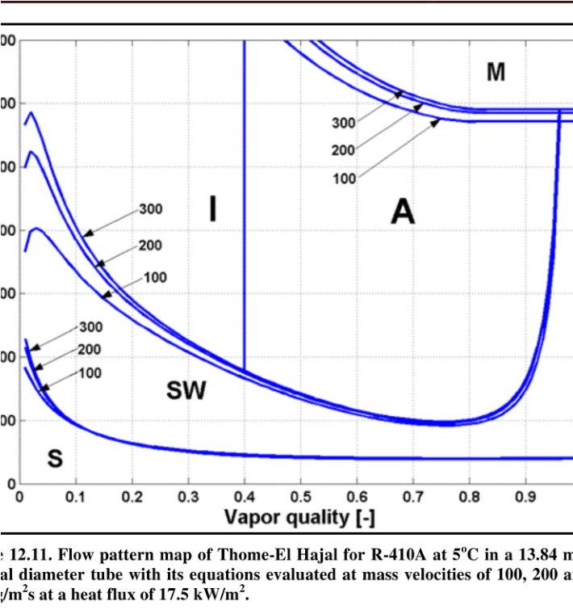

Barbieri、Saiz-Jabardo 和 Bandarra Filho（2005）在 Barbieri and Saiz-Jabardo（2006）描述的实验装置中拍摄了水平管两相流型的高质量照片。照片针对 R-134a，质量速度 500 kg/m2s，位于蒸发器出口处的可视管内；部分照片中的管外存在外部冷凝。Fig. 12.12 给出了分层类流动的照片。Fig. 12.13 给出了间歇流中从小幅界面波到大幅爬升波再到冲刷管顶的大幅波的序列。Fig. 12.14 给出了环状流中的界面波图像。

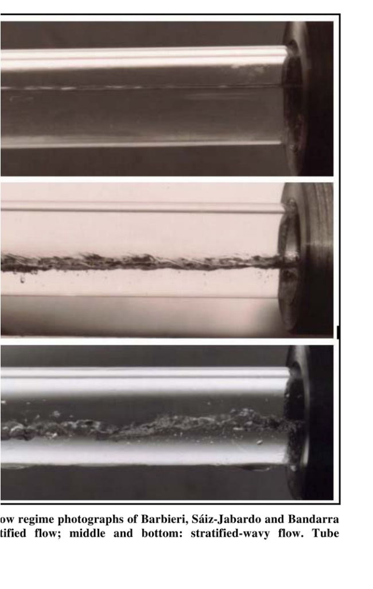

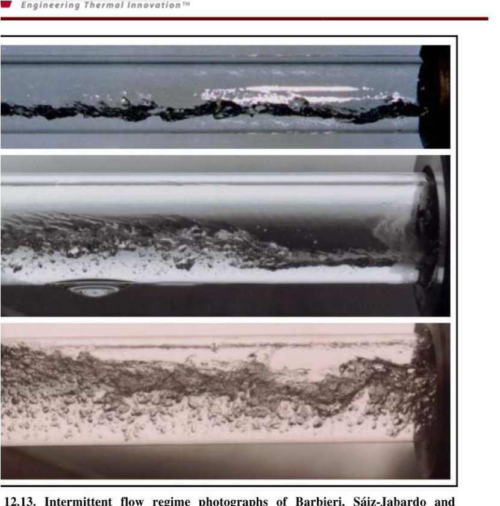

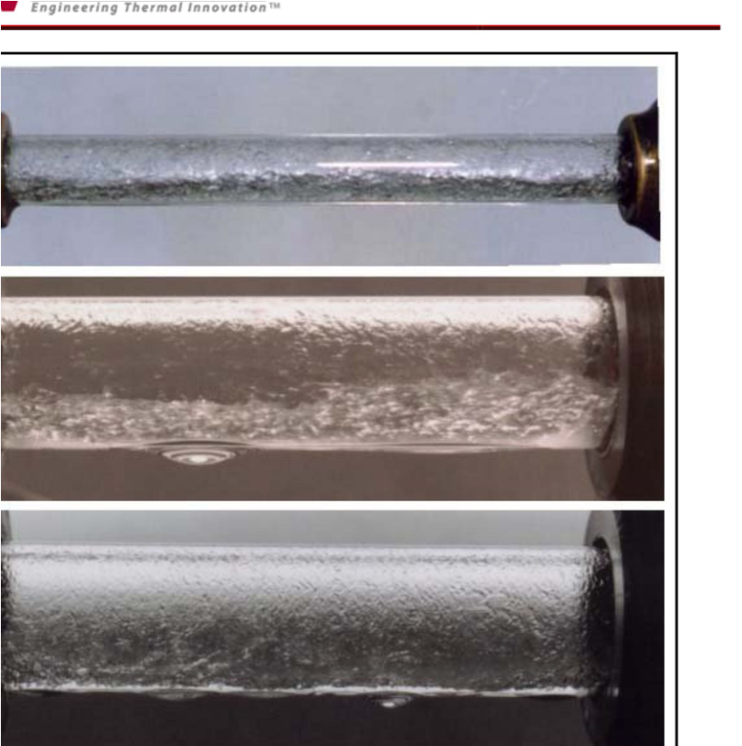

Wojtan-Ursenbacher-Thome map，Wojtan-Ursenbacher-Thome 图。Kattan、Thome 和 Favrat（1998a）的流型图主要针对大于 0.15 的干度开发，并且当时缺少专门研究热通量对高干度干涸起始和完成影响的实验。基于 Wojtan、Ursenbacher 和 Thome（2004）的动态空隙率测量，以及他们在 13.84 mm 水平可视管内、质量速度 70 到 200 kg/m2s 下的视频观察，得到以下结论：

1. 在测试的任何质量速度下都没有检测到完全分层流。
2. 在 0 < x < xIA 的干度范围内，观察到液塞和分层波状界面交替出现的流动结构；其中 xIA 是分隔间歇流和环状流的竖直线。
3. 从弹状/分层波状流到无弹状结构的完全分层波状流的转变大约发生在 xslug。
4. 对于 Thome-El Hajal 图中位于 m > mwavy(xIA) 的分层波状区，实际只观察到弹状流。

基于这些观察，Wojtan、Ursenbacher 和 Thome（2005a）对 Thome-El Hajal 版流型图中的分层波状区作了如下修改：

1. 在 x < xIA 时增加一条新的转变线 mslug = mstrat(xIA)，这会在 xIA 左侧形成一条新的水平转变线，并修改分层流 S 区边界。
2. 将分层波状区划分为三个子区：m > mwavy(xIA) 为弹状流区；mstrat < m < mwavy(xIA) 且 0 < x < xIA 为弹状/分层波状区；1 > x ≥ xIA 仍为分层波状区。

Fig. 12.15 给出了用上述修改后的 Thome-El Hajal 版 Kattan-Thome-Favrat 图计算的 R-22 新流型图，用于更好描述实际流动特征。虚线对应下文描述的新干涸和雾状流转变曲线。

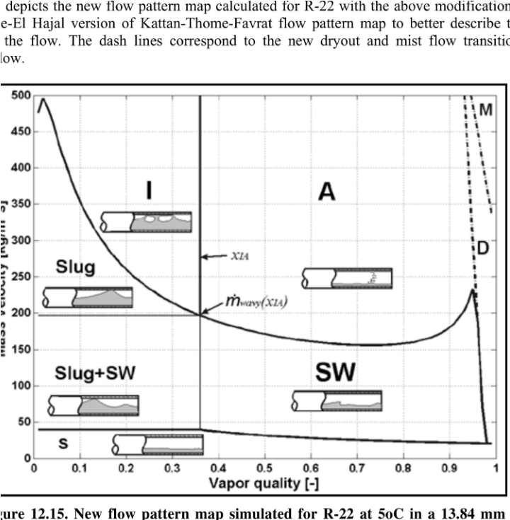

如 Fig. 12.16 所示，水平管中的干涸首先在管顶发生于 xdi，即 A-A 截面，因为该处环状液膜较薄；随后干涸沿管长绕管周推进，直到在 xde 处到达底部，即 C-C 截面，液膜消失。因此，水平管中的干涸发生在一个干度范围内：从环状流开始，到完全发展的雾状流形成结束。xdi 与 xde 之间的流型称为 dryout，干涸。

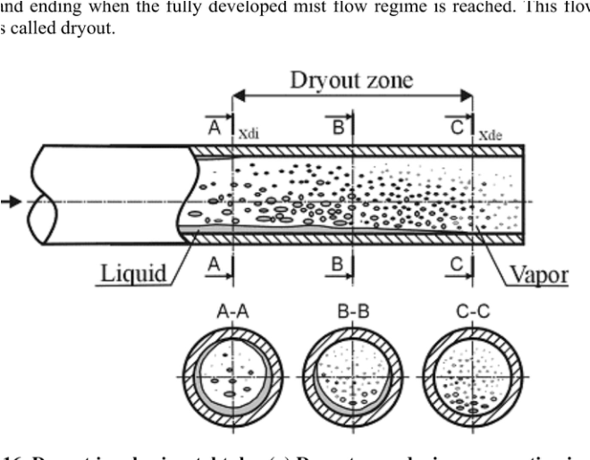

由于仅凭可视管观察很难确定干涸的起始和完成，Wojtan、Ursenbacher 和 Thome（2005a）测量了大量 R-22 和 R-410A 水平管流动沸腾传热数据，质量速度 70 到 700 kg/m2s，热通量 2.0 到 57.5 kW/m2。测试管内径包括 R-22 和 R-410A 的 13.84 mm，以及 R-410A 的 8.00 mm。传热数据用于识别 xdi 和 xde 的位置。如 Fig. 12.17 所示，传热系数随干度升高发生急剧变化，表明干涸开始；传热系数下降结束则标志干涸结束和雾状流开始。可视管观察确认，干涸和雾状流开始的干度与传热测量检测到的位置相同。

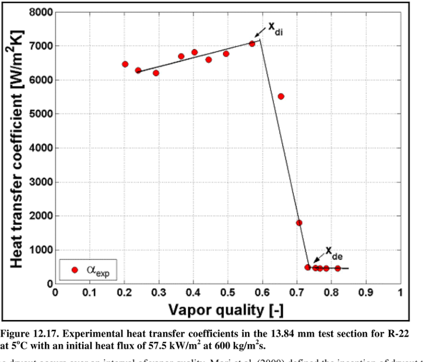

由于干涸发生在一段干度区间，Mori 等（2000）将干涸起始定义为 xdi，干涸完成定义为 xde，并使用他们命名为 S1、S2 和 S3 的三个特征区预测二者。Wojtan、Ursenbacher 和 Thome（2005a）从传热数据得到的 xdi 和 xde 与 Mori 等（2000）的 S2 区表达式吻合最好：

$$
x_{di}
=
0.58e^{
\left[
0.52
-0.000021We_G^{0.96}Fr_G^{-0.02}
\left(\rho_G/\rho_L\right)^{-0.08}
\right]
}
\tag{12.4.25}
$$

$$
x_{de}
=
0.61e^{
\left[
0.57
-0.000265We_G^{0.94}Fr_G^{-0.02}
\left(\rho_G/\rho_L\right)^{-0.08}
\right]
}
\tag{12.4.26}
$$

Wojtan、Ursenbacher 和 Thome（2005a）修正了 Mori 等的方法，以纳入他们在 R-22 和 R-410A 5°C 蒸发实验中观察到的热通量影响。该实验在 8.00 和 13.84 mm 试验段中进行，热通量最高 57.5 kW/m2。他们使用无量纲热通量比 q/qDNB 和新的经验因子，得到干涸区开始和结束的新边界：

$$
x_{di}
=
0.58e^{
\left[
0.52
-0.235We_G^{0.17}Fr_G^{0.37}
\left(\rho_G/\rho_L\right)^{0.25}
\left(q/q_{DNB}\right)^{0.7}
\right]
}
\tag{12.4.27}
$$

$$
x_{de}
=
0.61e^{
\left[
0.57
-0.0058We_G^{0.38}Fr_G^{0.15}
\left(\rho_G/\rho_L\right)^{-0.09}
\left(q/q_{DNB}\right)^{0.27}
\right]
}
\tag{12.4.28}
$$

其中 qDNB 由 Kutateladze（1948）式（12.4.9）计算。将这两个方程倒置，使质量速度表示为干度的函数后，环状流到干涸的 A-D 边界和干涸到雾状流的 D-M 边界分别为：

$$
\dot m_{dryout}
=
\left[
\frac{1}{0.235}
\left(
\ln\left(\frac{0.58}{x}\right)
+0.52
\right)
\left(
\frac{d_i}{\rho_G\sigma}
\right)^{-0.17}
\left(
\frac{1}{g d_i \rho_G(\rho_L-\rho_V)}
\right)^{-0.37}
\left(
\frac{\rho_G}{\rho_L}
\right)^{-0.25}
\left(
\frac{q}{q_{DNB}}
\right)^{-0.7}
\right]^{0.926}
\tag{12.4.29}
$$

$$
\dot m_{mist}
=
\left[
\frac{1}{0.0058}
\left(
\ln\left(\frac{0.61}{x}\right)
+0.57
\right)
\left(
\frac{d_i}{\rho_G\sigma}
\right)^{-0.38}
\left(
\frac{1}{g d_i \rho_G(\rho_L-\rho_V)}
\right)^{-0.15}
\left(
\frac{\rho_G}{\rho_L}
\right)^{0.09}
\left(
\frac{q}{q_{DNB}}
\right)^{-0.27}
\right]^{0.943}
\tag{12.4.30}
$$

源页中式（12.4.29）和式（12.4.30）的密度差项印为 ρL - ρV，本译文按原书转写，不自行改作 ρL - ρG。

把上述分层波状区修改以及新的 A-D、D-M 转变曲线并入图中后，Wojtan-Ursenbacher-Thome 图的实施步骤如下。

1. 用式（12.4.19）到（12.4.24）分别计算几何参数 ε、ALd、AGd、hLd、Pid 和 θstrat。
2. 由于高干度下热通量影响已由 A-D 和 D-M 转变曲线捕捉，先用式（12.4.1）的绝热版本计算 SW-I/A 转变：

$$
\dot m_{wavy}
=
\left\{
\frac{
16A_{Gd}^3 g d_i \rho_L\rho_G
}{
x^2\pi^2\left[1-(2h_{Ld}-1)^2\right]^{0.5}
}
\left[
\frac{\pi^2}{25h_{Ld}^2}
\left(
\frac{We_L}{Fr_L}
\right)^{-1}
+1
\right]
\right\}^{0.5}
+50
\tag{12.4.31}
$$

3. 将分层波状区分为三个子区：m > mwavy(xIA) 为弹状流区；mstrat < m < mwavy(xIA) 且 0 < x < xIA 为弹状/分层波状区；1 > x ≥ xIA 为分层波状区。
4. S-SW 转变用原始边界式（12.4.4）计算，但当 x < xIA 时令 mstrat = mstrat(xIA)，形成 0 ≤ x ≤ xIA 的水平边界段。
5. I-A 转变由原始边界式（12.4.11）计算，并向下延伸至与 mstrat 的交点。
6. A-D 边界由式（12.4.29）计算；当其值小于步骤 2 得到的 mwavy 时，采用式（12.4.29）的值。
7. D-M 边界由式（12.4.30）计算。由于 A-D 线与 D-M 线不平行，它们可能相交；当 xde < xdi 时，将 xde 设为 xdi，此时不存在 D 区。原文解释为，在高质量速度和低热通量下，高蒸汽剪切会使环状液膜趋于周向均匀，因此整个周向同时在 xdi 处变干是合理的。
8. 为定义图中高干度区的干涸起始边界 mdryout，按顺序采用下列逻辑：若 mstrat(x) ≥ mdryout(x)，则令 mdryout = mstrat(x)；若 mwavy(x) ≥ mdryout(x)，则保留 mdryout = mdryout(x)，且 mwavy 曲线在此处终止，这意味着 mwavy 曲线最右侧边界是它与 mdryout 曲线的交点；若 mdryout(x) ≥ mmist(x)，这在低热通量和高质量速度下可能发生，则保留 mdryout = mdryout(x)，干涸区在该质量速度下消失。

Fig. 12.18 给出了 R-22 在四种热通量下计算得到的流型图，A-D 和 D-M 边界的移动很明显。与 Kattan-Thome-Favrat 图相比，新图中出现了 slug、slug/stratified-wavy 和 dryout 等新区。可以看到，热通量降低时，干涸区和雾状流区变小。

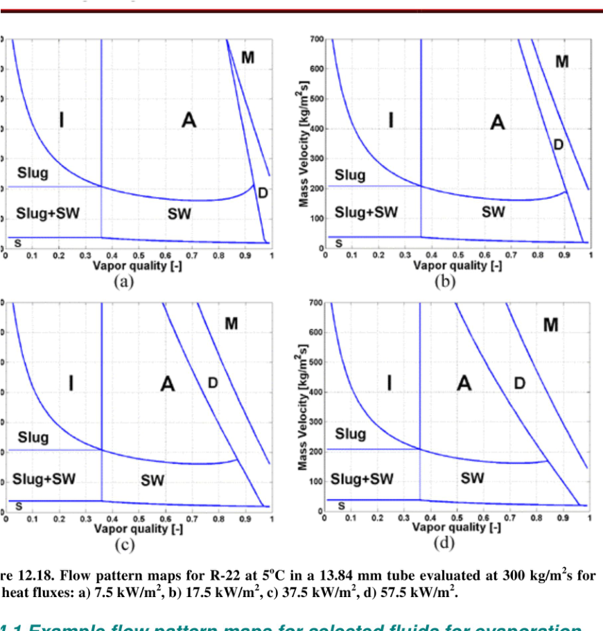

该图基于 5°C 下 R-22 和 R-410A 的数据库建立，但其早期版本覆盖了另外八种制冷剂：R-134a、R-123、R-402A、R-404A、R-502、R-407C、R-507A 和氨，管径范围 8 到 14 mm。所有这些实验的变量范围为质量速度 16 到 700 kg/m2s、干度 1% 到 99%、热通量 440 到 57500 W/m2。原文认为该图适用于低到中等压力的制冷剂，以及物性相近的轻烃；但不适用于 CO2，因为其运行压力过高，也不适用于空气-水或蒸汽-水系统，因为它们的表面张力和密度比相对于制冷剂数据库过高。

### 12.4.1 Example flow pattern maps for selected fluids for evaporation in horizontal tubes

### 12.4.1 水平管蒸发中若干流体的示例流型图

Fig. 12.19 展示了使用上述 Thome 及合作者最新流型图版本计算得到的若干流型图，对象为烃类流体 n-butane 和 propane。计算条件列在图中；图中流型包括 mist flow，MF；intermittent，I；annular，A；stratified-wavy，SW；stratified，S。泡状流未示出，因为它发生在比图中范围大得多的质量速度下。

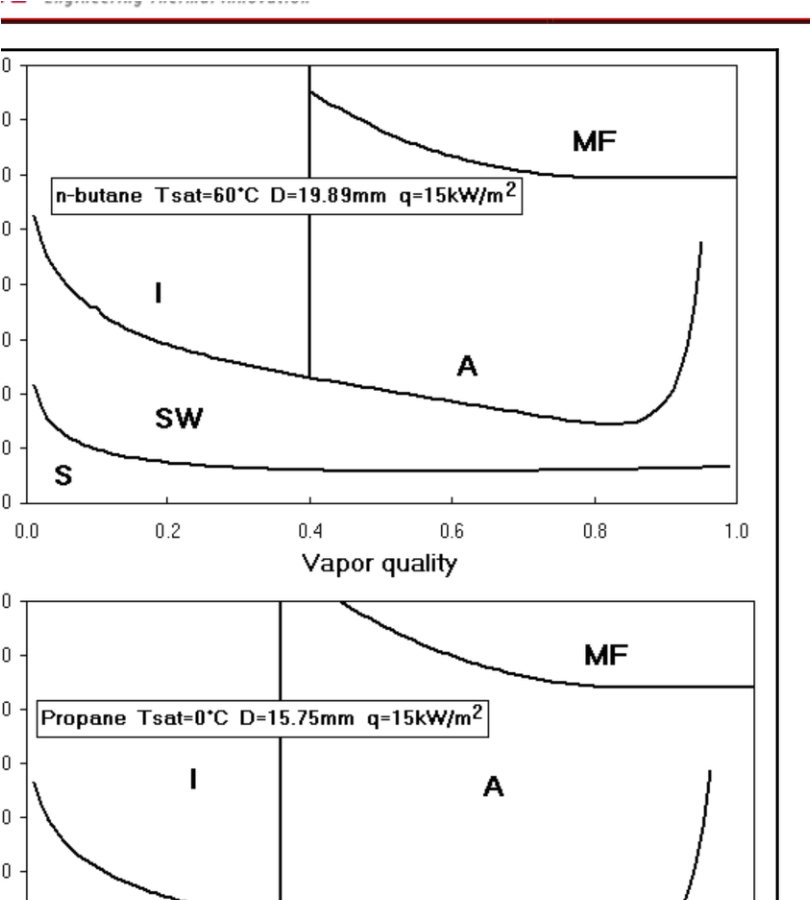

## 12.5 Flow Pattern Map for Condensation in Horizontal Tubes

## 12.5 水平管冷凝流型图

水平管内冷凝流型与上一节所述蒸发流型相似，但存在以下差异。

1. 入口为干饱和蒸汽，过程开始时没有液体夹带；而蒸发流中，搅动流和间歇流结构中的液体跨接通道，在这些结构破裂时会造成明显夹带。
2. 蒸发过程中环状液膜最终会干涸；冷凝过程中不会发生干涸。事实上，高干度冷凝时流型为环状流，不会像蒸发那样在管顶干涸起始时从环状流回到分层波状流。
3. 冷凝过程中生成的冷凝液会以液膜形式覆盖管周。对于在绝热流或蒸发流中本应接近雾状流的区域，在冷凝中流型会看起来像环状流，因为即便液体被夹带，管壁裸露表面也可通过冷凝快速形成新的液膜。
4. 冷凝的分层流型中，管顶被冷凝液膜润湿；绝热流和蒸发流中，管顶周向则为干壁。

因此，水平管内冷凝遇到的三个主要流型为：环状流，在冷凝传热文献中常称为 shear-controlled regime，即剪切控制区；分层波状流，其特征为管底分层液体界面上有波，同时管顶周向有膜状冷凝；分层流，管底分层液体界面无波，同时管顶周向有膜状冷凝并向分层液体排液。后两类在冷凝传热文献中有时称为 gravity-controlled regime，即重力控制区。

El Hajal、Thome 和 Cavallini（2003）提出，可暂用管内蒸发 Kattan-Thome-Favrat 流型图预测这些冷凝流型。首先取消雾状流转变，因为该区域的冷凝流可视为环状流：即使液体随后被夹带，冷凝液膜也总会形成。其次，修改分层波状流转变曲线：先消除高干度处从环状流到分层波状流的转变，即求解分层波状流转变曲线的最小值；再从该点向干度 x = 1.0 处的分层转变曲线终点作直线延伸。Fig. 12.20 给出了 R-134a 在 40°C、8.0 mm 水平管内冷凝的流型图。

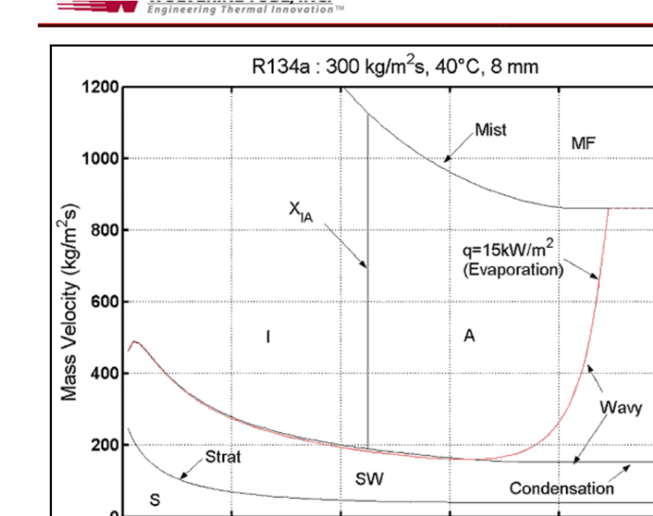

Soliman（1982）也提出了水平管冷凝中从环状流转为分层波状流的预测方法。第 8 章介绍了 Dobson and Chato（1998）管内冷凝传热模型中采用的该方法。

## 12.6 Flow Patterns in Horizontal Enhanced Tubes

## 12.6 水平强化管内流型

关于内部强化管中的两相流型，系统研究并不多；但通常认为强化结构会显著影响流型转变位置，也会改变某一流型的外观。例如，内部微翅片管被认为会把环状流到分层波状流的阈值降低到更小质量速度，从而在较低质量速度下通过实现管周完全润湿来提高传热。Cavallini 等（2002）的可视观察证实了这一假设，其对比视频见第 1 章。

Moreno Quiben 和 Thome 也在第 1 章给出了带扭带插入件的透明光管内两相流视频，可观察到扭带给流动施加了旋流效应。原文认为这种结构同样会使环状-分层波状转变阈值 mwavy 移向较低质量速度，但这一点尚未系统记录。

在环状流本身中，微翅片会使液膜产生更强湍动，如 Fig. 12.21 所示。照片由 Saiz-Jabardo（2005）提供，测试装置见 Bandarra Filho and Saiz-Jabardo（2006）。照片显示微翅片管似乎也会增加中心蒸汽核心中的液体夹带；照片是在蒸发器管出口处的光滑可视管中拍摄，因此不能直接看到微翅片本身的作用。

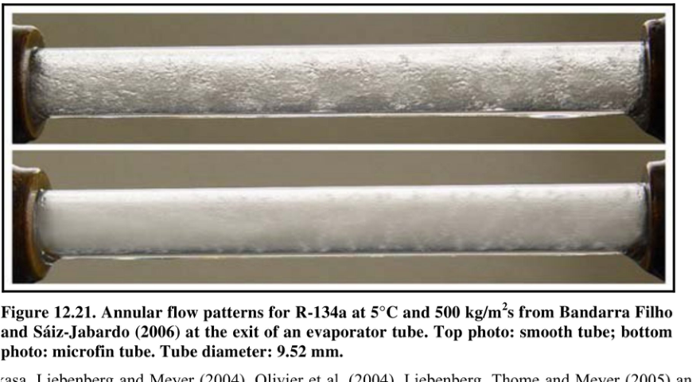

Bukasa、Liebenberg and Meyer（2004），Olivier 等（2004），Liebenberg、Thome and Meyer（2005）以及 Olivier 等（2007）研究了光管、螺旋微翅片管、鱼骨形微翅片管和带螺旋线插入件的管内流型。Meyer and Liebenberg（2006）也在综述中总结了这些工作。研究者发现，式（12.4.11）给出的光滑管 xIA 间歇-环状转变对其光滑管数据有效；但在 R-22、R-134a 和 R-407C 冷凝过程中，内部强化会把该转变延迟到更低干度，如 Fig. 12.22 所示。他们在冷凝试验段出口直接观察流型，并在早期研究中使用绝对压力信号功率谱分析识别转变。最近的测试中使用了轴向螺距 5.0、7.7 和 11.0 mm 的螺旋线。虽然线插入件会把 xIA 转变推向更低干度，但他们也发现线螺距本身对 xIA 转变边界位置影响很小。这些带线测试中，管内径为 8.1 mm，线径为 0.5 mm。

基于这些结果，Meyer、Liebenberg 及其合作者提出了带螺旋线插入件管内间歇-环状流转变线的 xIA 表达式：

$$
x_{IA}
=
\left\{
\left[
0.484
\left(
\frac{\rho_G}{\rho_L}
\right)^{-5/9}
\left(
\frac{\mu_L}{\mu_G}
\right)^{-1/9}
\right]
+1
\right\}^{-1}
\tag{12.6.1}
$$

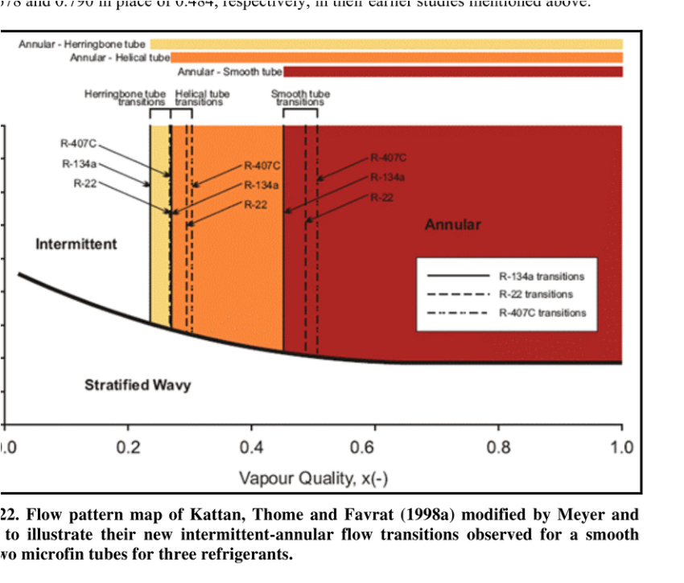

早期研究还为螺旋微翅片管和鱼骨形微翅片管提出了类似转变线，分别用 0.678 和 0.790 替代上式中的 0.484。

## 12.7 Flow Patterns and Map for Two-Phase Flows over Horizontal Tube Bundles

## 12.7 水平管束外两相流型和流型图

壳侧两相流型，即横掠管阵流动，以及相关流型图，与管内流相比受到的关注少得多。有些研究只定性描述观测到的流型，例如 Leong and Cornwell（1979），Cornwell、Duffin and Schuller（1980），Diehl（1958），Diehl and Unruh（1958）以及 Nakajima（1978）。其他研究则尝试通过流型图定量描述观测，例如 Grant and Murray（1972、1974），Grant（1973），Grant and Chisholm（1979），Kondo and Nakajima（1980）以及 Chisholm（1985）。自 1980 年代中期以来，壳侧两相流型研究并不多。

壳侧两相流型对热性能很重要，因为它会影响两相摩擦乘子，进而影响两相摩擦压降。流型也应影响管束沸腾传热系数和冷凝传热，但目前尚无研究确认这一关系。无论如何，了解流型并预测流型转变，是进行“thought experiments”的关键；这类思考性预测可估计新系统中的两相流结构，有助于判断系统运行特征并避免潜在运行问题。

Leong and Cornwell（1979）以及 Cornwell、Duffin and Schuller（1980）在釜式再沸器切片蒸发实验中进行了可视观察。他们报告了两个主导流型：在 241 根顺列管束下部区域，流动主要为泡状流；在蒸汽干度较高的上部区域，流动外观明显改变，呈 frothy 即泡沫状特征，该转变估计发生在空隙率约 60% 处。另一方面，Nakajima（1978）在错列管束内两相上升流、很低质量速度和低干度下只观察到泡状流和弹状流。Diehl（1957）在错列管束内较高质量速度的下降流中只观察到环状流和喷雾流。Diehl and Unruh（1958）将喷雾流描述为夹带液体比例高的流动，将环状流定义为夹带较低的流动。Grant and Chisholm（1979）在更全面的研究中，对错列管阵中的垂直上升流和下降流进行了宽范围质量速度和干度实验，观察到泡状流、间歇流即弹状流、以及喷雾流。Diehl 和 Diehl-Unruh 的环状流观察很可能与 Grant and Chisholm 的喷雾流类别相同。

Fig. 12.23 描绘并定义了上述研究中报告最频繁的流型名称；Fig. 12.24 给出了 Grant and Chisholm 提出的流型图。泡状流和喷雾流在垂直流和水平流中都常见，而弹状或间歇流以及分层流通常只在水平流中出现。实际换热器壳体中，这些理想化流型会受到管束中泄漏流的影响，例如折流板周围的流动分离、管与折流板管孔之间的泄漏以及其他旁路流。

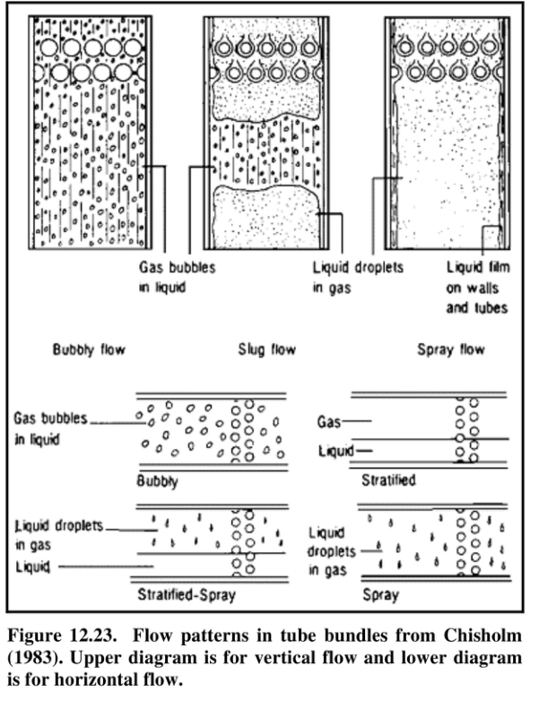

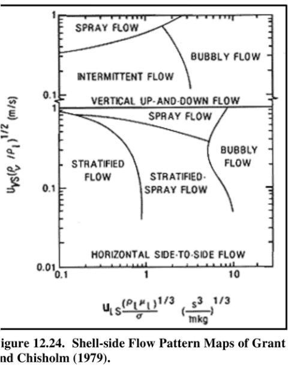

Chisholm（1985）后来提出了以下水平流转变阈值，以干度表示。

分层流：

$$
\frac{1-x_S}{x_S}
=
\left(
\frac{R-1}{B_S}
\right)^{2/(2-m)}
\tag{12.7.1}
$$

泡状流：

$$
\frac{1-x_B}{x_B}
=
\left(
\frac{R-1}{B_B}
\right)^{2/(2-m)}
\tag{12.7.2}
$$

喷雾流：

$$
\frac{1-x_F}{x_F}
=
\left(
\frac{R-1}{B_F}
\right)^{2/(2-m)}
\tag{12.7.3}
$$

在这些方程中，xS、xB 和 xF 分别为分层、泡状和喷雾转变点的转变干度。其他参数定义为：

$$
B_S
=
\frac{2^{2-m}-2}{Y+1},
\quad
B_B
=
\left(
\frac{\rho_L}{\rho_G}
\right)^{1/2},
\quad
B_F
=
\left(
\frac{\mu_L}{\mu_G}
\right)^{m/2}
\tag{12.7.4}
$$

$$
R
=
1.3
+0.59Fr_{LN}^2
\left(
\frac{\mu_L}{\mu_G}
\right)^m
\tag{12.7.5}
$$

$$
Y
=
\left(
\frac{dp}{dz}
\right)_G
/
\left(
\frac{dp}{dz}
\right)_L
=
\left(
\frac{\rho_L}{\rho_G}
\right)
\left(
\frac{\mu_L}{\mu_G}
\right)^{-m}
\tag{12.7.6}
$$

式（12.7.5）中 FrLN 按源页形态转写；原文随后说明该量是把总流量视作液体时的 Froude 数，其速度基于管束中垂直于流动方向的最小截面积。m 是 Blasius 型单相摩擦因子方程中的指数。原文指出，关于这些方法在一般流型转变预测中的可靠性，本章无法给出限定性评价。

## Conclusions

## 结论

流型对空隙率、流动沸腾和对流冷凝传热系数、两相压降的预测具有重要影响。因此，预测流型转变并将其整合为通用流型图，对理解两相流现象和设计两相设备很重要。

对于垂直管，Fair（1960）以及 Hewitt and Roberts（1969）的流型图是最常被推荐使用的。对于水平管，Taitel and Dukler（1976）和 Baker（1954）的方法被广泛使用。较新的 Kattan、Thome 和 Favrat（1998a）流型图及其后续改进，专门针对壳管式换热器中典型的小直径管、绝热和蒸发流建立，是原文推荐用于换热器设计的方法。El Hajal、Thome and Cavallini（2003）还提出了该图用于管内冷凝的另一版本。

与管内研究相比，壳侧流型和流型图得到的关注很少。虽然已有定性和定量尝试建立流型图，但迄今没有方法被证明可普遍适用。本章给出了 Grant and Chisholm（1979）流型图，但其使用目前只能视为最佳估计。

## Example Calculation

## 算例

两相流体在内径 1.0 in 的垂直管中向上流动。流体物性如下：液体密度 60 lb/ft3，蒸汽密度 2 lb/ft3，液体黏度 0.4 cp，蒸汽黏度 0.01 cp。若干度为 0.2，液体和蒸汽总流量为 3600 lb/h，使用 Fair 流型图，预期局部流型是什么？

解：3600 lb/h 质量流量等于 1.0 lb/s。内径为 1 in = 1/12 ft。用质量流量除以管内截面积，得到质量速度为 183.3 lb/s ft2。Fair 图横坐标参数为：

$$
\left(
\frac{x}{1-x}
\right)^{0.9}
\left(
\frac{\rho_L}{\rho_G}
\right)^{0.5}
\left(
\frac{\mu_G}{\mu_L}
\right)^{0.1}
=
\left(
\frac{0.2}{1-0.2}
\right)^{0.9}
\left(
\frac{60}{2}
\right)^{0.5}
\left(
\frac{0.01}{0.4}
\right)^{0.1}
=
1.09
$$

因此，用 183.3 和 1.09 在图上查得流型为环状流。原书这里的质量速度单位原样写为 lb/s ft2；若用于实际复算，应回看源页并统一英制面积单位口径。
